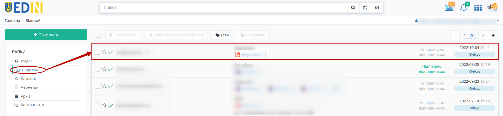

##########################################################################################################
Обмін документом "Акт звірки" з мережею "МЕТРО" через сервіс "Вільний". Інструкція для Постачальника
##########################################################################################################

.. картинки

.. role:: red

.. role:: green

.. role:: underline

.. contents:: Зміст:
   :depth: 2

---------

Вступ
==============================================================

Дана інструкція описує порядок роботи Постачальників в `сервісі "Вільний" <https://wiki.edin.ua/uk/latest/Vilnyi/Work_with_Vilnyi.html>`__ для формування та відправки документа "Акт звірки" в мережу "МЕТРО Кеш енд Кері Україна" на web-платформі EDI Network.

.. important::
   Перед початком роботи з платфомою Вам потрібно завантажити документ "Акт звірки" з порталу **"Metrolink"**. Якщо на Вашій стороні раніше завантажений документ "Акт звірки" з порталу **"Metrolink"**
    
    * :green:`погоджують`, то до сервісу **"Вільний"** потрібно завантажувати лише "Акт звірки";
    * :red:`потребує коригування`, то "Акт звірки" завантажується до сервісу **"Вільний"** разом з коригуванням (або все одним файлом, або оригінал "Акта звірки" + файл з коригуванням).

.. warning::
   Файли для завантаження "Акт звірки" і файл з коригуванням мають бути тільки у форматі PDF!

**1 Вхід на платформу**
====================================

.. include:: /general_2_0/rabota_s_platformoj_EDIN_2.0.rst
   :start-after: .. початок блоку для Enter
   :end-before: .. кінець блоку для Enter

Після успішної авторизації відкриється основне меню, де у вкладці **"Продукти та рішення"** EDIN потрібно обрати сервіс **"Вільний"**:

.. image:: /_constant/pics_landing/landing_vilnyi.png
   :align: center

**2 Відправка "Акта звірки" в мережу "МЕТРО" в сервісі "Вільний"**
===============================================================================================================================

Для початку потрібно **"Створити"** документ:

.. image:: pics_Metro_Vilnyi_schema/Metro_Vilnyi_schema_001.png
   :align: center

В створений документ можливо **"Додати"** раніше завантажений "Акт звірки" з порталу **"Metrolink"** в разі :green:`погодження` документа чи "Акт звірки" разом з :red:`коригуванням` (або все одним файлом, або оригінал "Акта звірки" + файл з коригуванням):

Після чого потрібно заповнити поля документа, чітко притримуючись наступних вказівок:

1. ЄДРПОУ отримувача: 32049199
2. ЄДРПОУ відправника: ЄДРПОУ постачальника
3. Номер документа: Номер контрагента в системі
4. Дата документа: Дата з акту в полі "Залишок на дату"
5. Повідомлення: Назва компанії
6. Тема документа: Акт звірки
7. Отримувачі: yuliya.kazimirska@metro.ua

Після того, як всі обов'язкові дані заповнено можливо **"Підписати всі"** додані файли в документ:

.. include:: /Vilnyi/Work_with_Vilnyi.rst
   :start-after: .. початок блоку для Metro
   :end-before: .. кінець блоку для Metro

.. _signing-watermark:

.. note::
   Після підписання файлів в форматах PDF, JPG (JPEG), PNG, BMP при їх попередньому перегляді додається водяний знак в верхньому лівому куті кожної сторінки файлу, а також додається сторінка листа підписання:

   .. image:: pics_Metro_Vilnyi_schema/Metro_Vilnyi_schema_005.png
      :align: center
   
   Водяний знак містить інформацію, про те що файл було підписано в EDI Network, GUID документа та поточну сторінку файлу.

   .. image:: pics_Metro_Vilnyi_schema/Metro_Vilnyi_schema_006.png
      :align: center

   Лист підписання містить посилання та QR-код для скачування архіва документа, інформацію по документу та його підписантів.

Після підписання також відображається блок щодо підписантів. Для відправки документа потрібно натиснути на кнопку **"Відправити"**:

Після відправки документа контрагентам він відображається в журналі надісланих документів і має статус **Очікує підпису** (при перегляді документа кнопки додавання файлів та підписання не активні):

---------------------------------

.. include:: /_constant/kontakti.rst
