#############################################################################################################
Формування "Товарної накладної" (COMDOC_027) для мережі "МЕТРО". Інструкція для "FM Logistic"
#############################################################################################################

.. сюда закину немного картинок для текста

.. role:: red

.. contents:: Зміст:
   :depth: 3

---------

Дана інструкція описує документообіг `"Товарною накладної" (COMDOC_027) <https://wiki.edin.ua/uk/latest/EDIN_Specs/XML/COMDOC_027_x.html>`__ на платформі EDI Network між Постачальником "FM Logistic" та Мережею "МЕТРО". Ініціатором документообігу виступає Постачальник "FM Logistic".

1 Формування "Товарної накладної" (COMDOC_027) для торгової мережі "МЕТРО". Сторона "FM Logistic"
===========================================================================================================

Щоб сформувати "Товарну накладну" (COMDOC_027) Постачальнику потрібно натиснути кнопку **"+Створити"** та обрати **"Товарна накладна(COMDOC)"** (не слід плутати з **"Товарною накладною"**!!!):

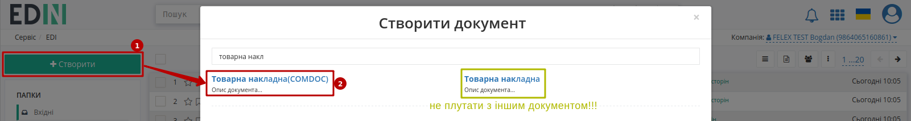

Документ створиться автоматично з заповненими даними відправника:

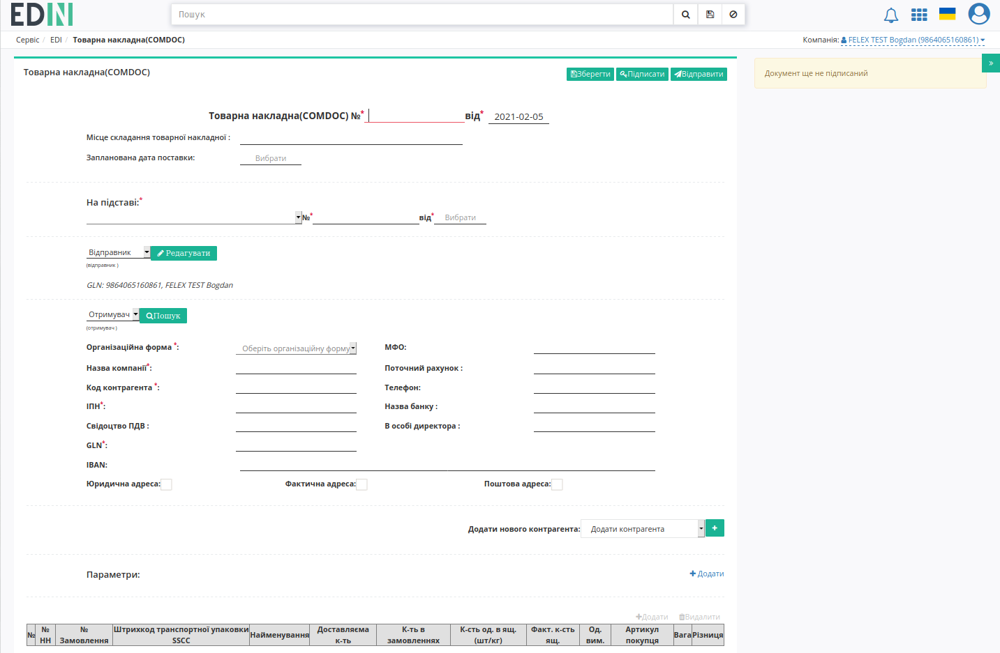

Всі поля, позначені червоною зірочкою :red:`*` - **обов'язкові до заповнення**. Для автоматичного заповнення данних Отимувача (мережа "МЕТРО") можливо скористатись пошуком (за назвою компанії, GLN чи ІПН) та "Вибрати" контрагента:

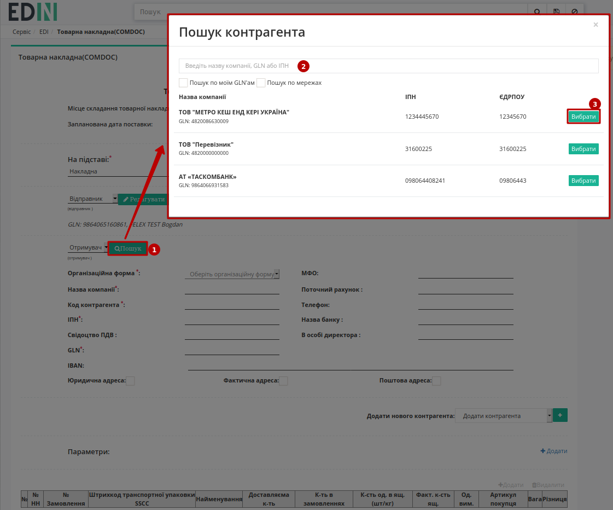

Також документ повинен містити хоча б одну позицію в табличній частині, для цього потрібно **"+Додати"** значення товарної позиції:

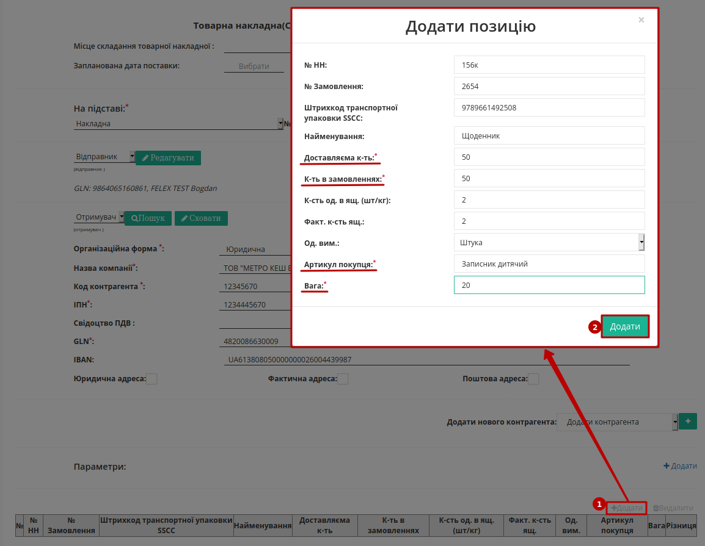

Попап для редагування відкривається при кліку на значення "Штрихкода транспортної упаковки SSCC":

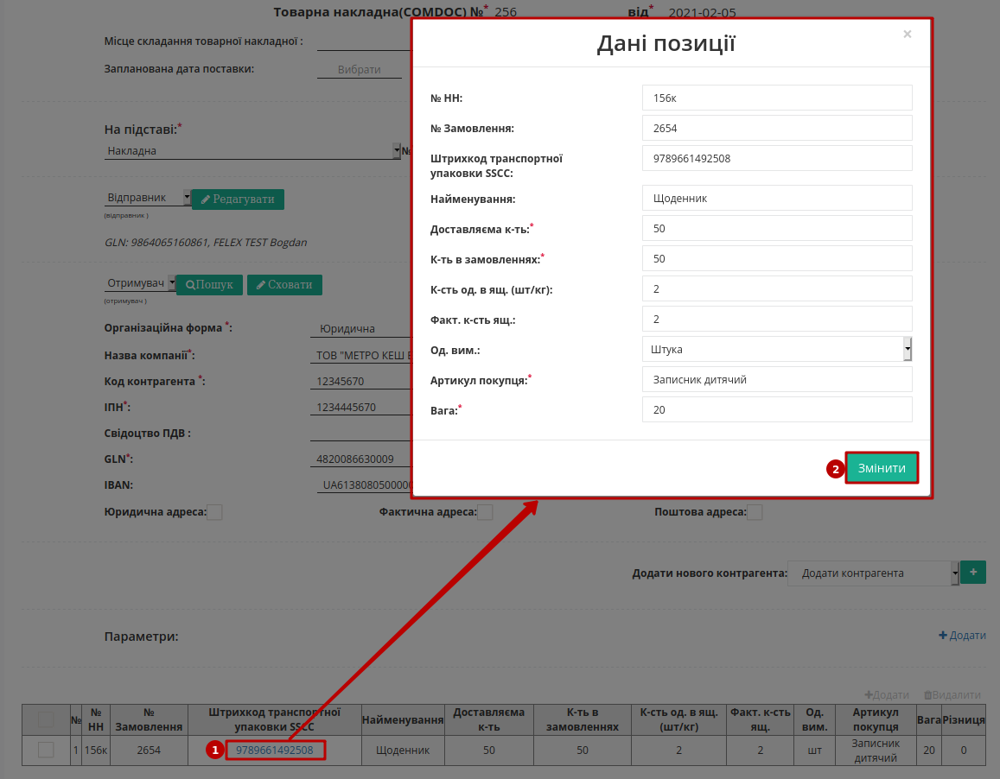

Для видалення позиції/-й з табличної частини потрібно вибрати позицію/-ї та натиснути **"Видалити"**: 

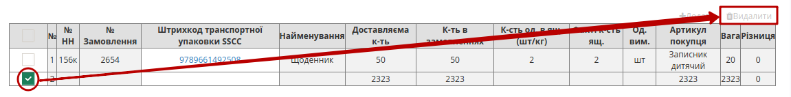

.. hint::
    Опціонально до документа можливо додати кілька контрагентів та додаткові параметри:

    .. image:: pics_formirovanie_COMDOC_027_na_EDI_Network_2_0/formirovanie_COMDOC_027_na_EDI_Network_2_0_06.png
       :align: center

Правильно заповнений документ потрідно **"Зберегти"** (1) та **"Відправити"** (2) без підписання:

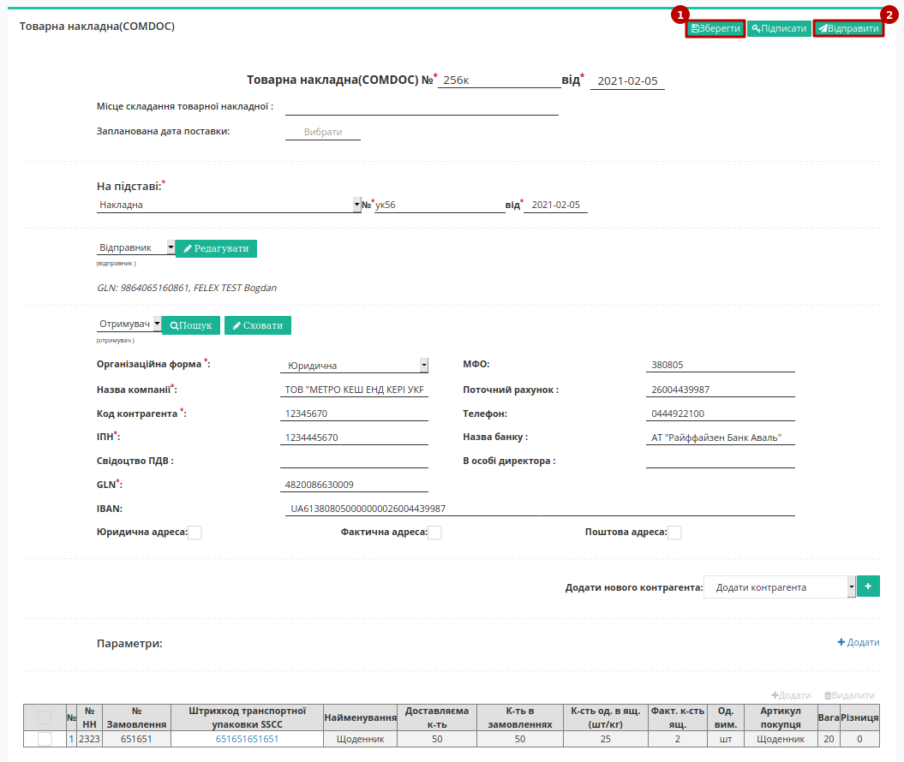

Відправлений документ відображається в папці **"Надіслані"**:

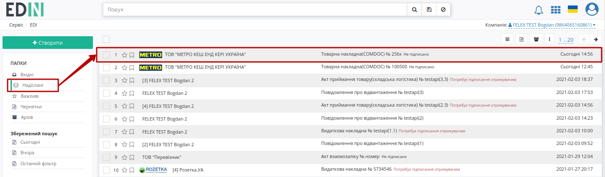

Відправлений документ можливо завантажити в .pdf, .xls, .xml, .zip форматах чи роздрукувати:

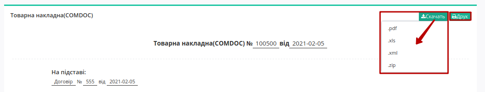

.. _revoke:

1.1 Відкликання підпису
-------------------------------------------------

.. include:: /_constant/comdoc_revoke/comdoc_revoke.rst
   :start-after: .. початок блоку для Comdoc_Revoke
   :end-before: .. кінець блоку для Comdoc_Revoke

2 Відповідь торгової мережі "МЕТРО"
============================================================================================

У торгової мережі "МЕТРО" вхідний документ відображається у **"Вхідних"**:

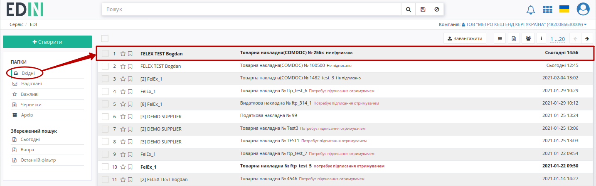

Мережа може **"Підтвердити"** або **"Відхилити"** "Товарну накладну" (COMDOC_027):

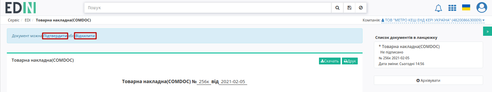

2.1 Підтвердження "Товарної накладної" (COMDOC_027) мережею "МЕТРО"
---------------------------------------------------------------------------------------------

Після того, як мережа вирішила **"Підтвердити"** комерційний документ висвічується повідомлення, що документ успішно прийнято:

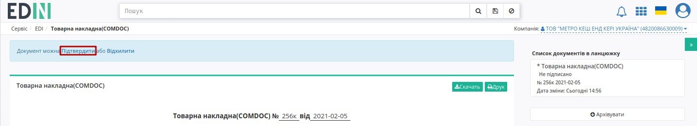

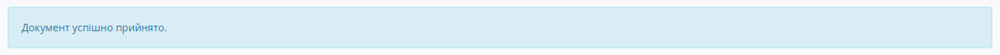

Документообіг завершено, про що свідчить значок |info| в журналі документів. Клік на значок |info| відкриває інформаційне вікно зі статусом по рішенню мережі "МЕТРО":

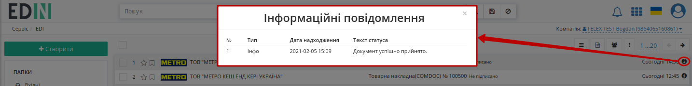

2.2 Відхилення "Товарної накладної" (COMDOC_027) мережею "МЕТРО"
---------------------------------------------------------------------------------------------

Після того, як мережа вирішила **"Відхилити"** потрібно обов'язково вказати причину відхилення документа:

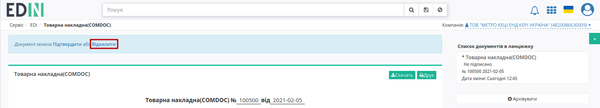

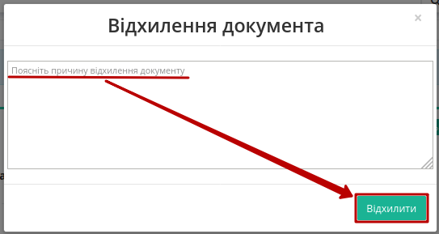

Вказана причина висвічується в повідомленні над документом, документ відхилено:

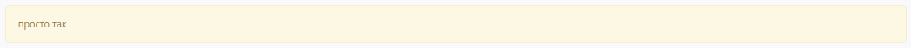

Документообіг завершено, про що свідчить значок |info| в журналі документів. Клік на значок |info| відкриває інформаційне вікно зі статусом по рішенню мережі "МЕТРО":

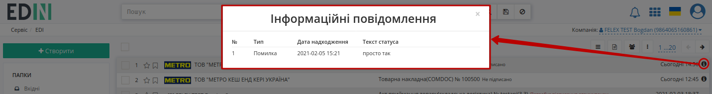

----------------------------
   
.. include:: /_constant/kontakti.rst

