Формування Товарної і Податкової накладної для мережі «МЕТРО»
====================================

.. сюда закину немного картинок для текста

.. role:: red

---------

.. contents:: Зміст
   :depth: 2
   :local:
   :class: no-bullets

---------

Дана інструкція описує порядок формування Товарної накладної для мережі «МЕТРО Кеш енд Кері Україна» на web-платформі EDIN 2.0.

.. important::
    **Увага!**  Для коректного формування документу **ТН** необхідно заповнити Товарний довідник. Ви можете подивитися `Інструкцію щодо заповнення довідника <https://wiki.edin.ua/uk/latest/general_2_0/Directories.html>`_.

Перед початком роботи з Товарною накладною необхідно заповнити всі реквізити компанії. Перевірте реквізити у "Налаштуваннях", якщо потрібно внести зміни до аккаунту, зверніться до вашого менеджера АТС.

Методи створення Товарної накладної
----------------------------------------------------
Створити Товарну накладну можливо декількома способами:

1. Через меню «Створити» вибрати Товарну накладну
2. На підставі «Замовлення» (ORDER)
3. На підставі «Повідомлення про прийом» (RECADV)

1. Створення через меню **Створити** вибравши **Товарна накладна**:

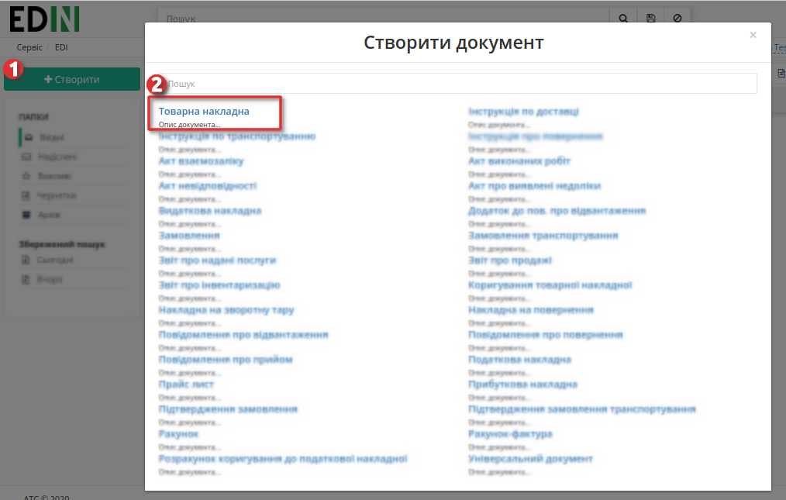

2. Створення на підставі **«Замовлення»**. Для цього вибираємо вкладку Вхідні, ставимо фільтри «Замовлення» (1) та вибираємо мережу «Метро» (2):

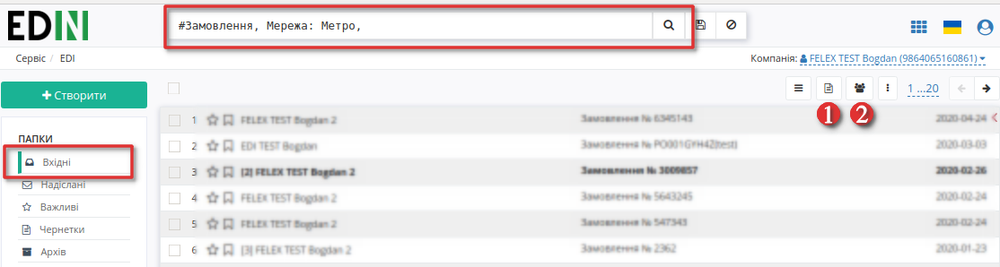

Переходимо в потрібний нам документ та на формі-підказці, котра дозволяє створити документ на основі Замовлення, виберіть зі списку «Товарна накладна»:

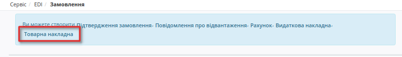

3. Створення на підставі **«Повідомлення про прийом»**. Для цього вибираємо вкладку Вхідні, ставимо фільтри «Повідомлення про прийом» (1) та вибираємо мережу «Метро» (2) і переходимо в потрібний нам документ:

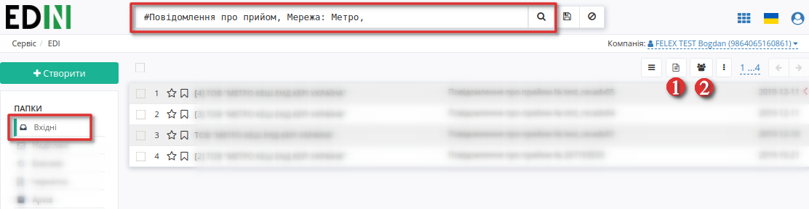
 
На формі-підказці, котра дозволяє створити документ на основі Повідомлення про прийом, виберіть зі списку «Товарна накладна»:

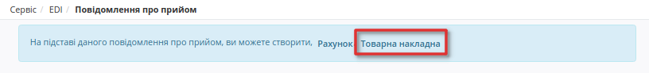

Заповнення документа Товарна накладна
----------------------------------------------------
Документ Товарна накладна створиться автоматично. Дані деяких полів пененесутся з документа основи (якшо ви створювали документ способом 2 або 3). Необхідно заповнити обов'язкові дані, позначені червоною зірочкою :red:`*`, в кожному з блоків.

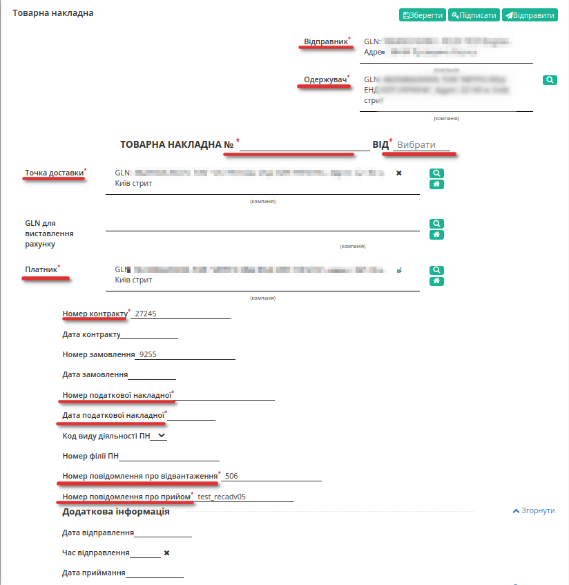

Перевірте правильність даних -  № та дату Товарної накладної, GLN контрагентів, номер замовлення та номер повідомлення про прийом» на основі яких створено документ, чи додайте необов'язкову, додаткову інформацію:

Нижче на сторінці створеного документа знаходиться блок з інформацією по позиціях.  

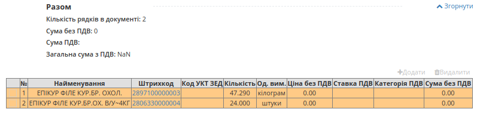

Система автоматично заповнює значення за позиціями з раніше відправленого документа, на основі якого був створений документ.

При перевірці внесених даних за товарними позиціями необхідно впевнитись, що обов'язково заповнене поле **код УКТ ЗЕД**. 
У разі, якщо поле не заповнено або заповнено некоректно, при збереженні документа буде виведено повідомлення:

 Будь ласка, заповнiть повнiстю обов'язкову iнформацiю по всiм позицiям!

Код УКТ ЗЕД не може бути менше 4 символів.

Щоб додати код **УКТ ЗЕД** натисніть на штрихкод товару. Відкриється вікно з даними позиції:

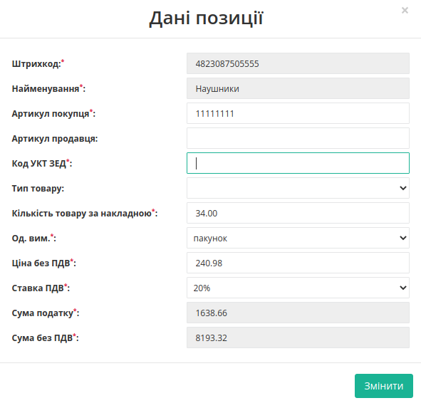

Для того, щоб поле з кодом **УКТ ЗЕД** за товарними позиціями при формуванні документа Товарна Накладна заповнювалось автоматично, необхідно перевірити коректність заповнення даних в Товарному довіднику. Для цього перейдіть у сервіс **Товари** та знайдіть позицію за штрихкодом.

.. image:: pics_formuvannia_TN_i_PN_Metro/formirovanie_Tovarnoj_nakladnoj_Leroy_Merlin_03_3.png
   :align: center
   
Після заповнення усіх обовязкових полів, будь ласка, збережіть документ натисканням на кнопку **Зберегти**! Після збереження документа, його необхідно підписати Електронно-Цифровим підписом (ЕЦП). Для ініціалізації підписання документу натисніть "**Підписати**".

.. _sign:

Підписання документа Товарна Накладна
----------------------------------------------------

.. загальне підписання на платформі

.. tabs::

   .. tab:: Файловий ключ

      .. include:: /_constant/signing/signing.rst
         :start-after: .. початок блоку для Signing
         :end-before: .. кінець блоку для Signing

   .. tab:: Token

      .. include:: /_constant/token_signing/token_signing.rst
         :start-after: .. початок блоку для TokenSign
         :end-before: .. кінець блоку для TokenSign

   .. tab:: Гряда

      .. include:: /_constant/gryada_signing/gryada_signing.rst
         :start-after: .. початок блоку для GryadaSign
         :end-before: .. кінець блоку для GryadaSign

   .. tab:: Cloud

      .. include:: /_constant/cloud_signing/cloud_signing.rst
         :start-after: .. початок блоку для CloudSign
         :end-before: .. кінець блоку для CloudSign

Після успішного підписання, натисніть кнопку **Відправити**. Відправлений документ додається в папку «Надіслані».
Після відправки у документі з'явиться візуалізація підпису "Товарна накладна" зеленим кольором, натиснувши на яку можна переглянути Дані про підписантів.

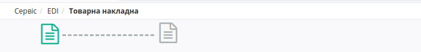

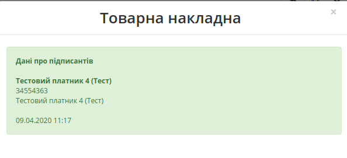

Сірим кольором відображається очікувана візуалізація підпису "Підтвердження товарної накладної", натиснувши на яку побачимо що документ ще не підписаний. 
Після підписання документа мережею, друга візуалізація підпису "Підтвердження товарної накладної" також стане зеленою, і в ній відобразяться Дані про підписантів.

Відправлену Товарну накладну можливо скачати у таких форматах: .pdf .xls .xml .zip .p7s

Статуси документа Товарна Накладна
----------------------------------------------------
Статус підписаного та відправленого документа можливо переглянути у загальному списку надісланих документів та в самому документі. Для першого способу, перейдіть до папки «Надіслані», виберіть серед фільтрів (або введіть у рядок пошуку) тип документу Товарна Накладна та виберіть отримувача. У списку накладних, біля дати доставки натисніть на позначку Інформація:

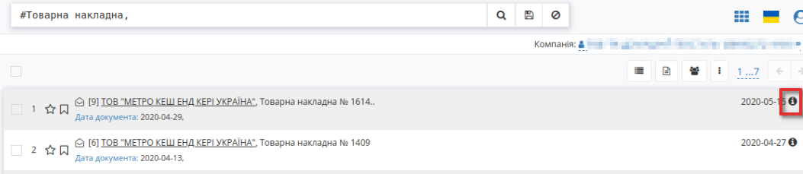

Відкриється вікно інформаційного повідомлення, зі статусом та датою надходження:

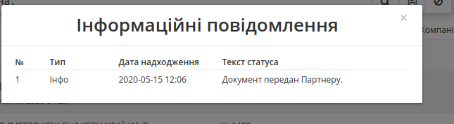

Також можливо переглянути статус у самому документі, в інформаційному розділі, нижче ланцюжка документів:

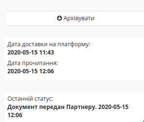

Заповнення документа Податкова Накладна
----------------------------------------------------
   Ви можете підписати та відправити Податкову накладну до отримання підтвердженної Товарної накладної, але ми рекомендуємо дочекатися позитивної відповіді від контрагента, тобто підписану Товарну накладну, а тоді надсилати Податкову накладну на перевірку.

Виберіть вашу відправлену Товарну накладну, та на формі-підказці, котра дозволяє створити документ, виберіть зі списку «Податкова накладна»:

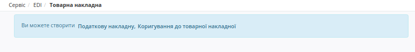

Виберіть ставку ПДВ у вікні що з'явилося. Вкажіть правильну **Ставку ПДВ по документу** для правильного розрахунку у блоці **Б**:

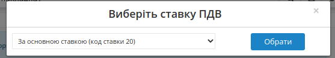

Дані деяких полів пененесуться з документа основи. Необхідно заповнити обов'язкові дані, позначені червоною зірочкою :red:`*`, в кожному з блоків.
Заповнюємо поля податкової накладної, звіряємося і натискаємо кнопку Зберегти.

Дочекавшись зміни статусу в Товарної накладної на **"Підтверджено з двох сторін"**, ми можемо підписувати і відправляти Податкову накладну.

На одну «Товарну накладну» можливо створити одну «Податкову накладну»!

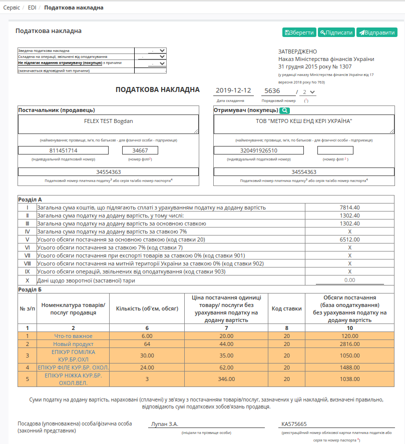

У податковій накладній натискаємо **Підписати** - процес підписання аналогічний `підписанню документа Товарна Накладна <https://wiki.edin.ua/uk/latest/retail_2.0/formuvannia__Tovarnoi_i_Podatkovoi_nakladnoi_Metro.html#sign>`_.

Статуси документа Податкова Накладна
----------------------------------------------------
Після успішного підписання, натисніть кнопку **Відправити**. Відправлений документ додається в папку «Надіслані».
Після відправки у документі з'явиться візуалізація підпису "Податкова накладна" зеленим кольором, натиснувши на яку можна переглянути Дані про підписантів.

Після успішної реєстраціїї податкової у документі з'явиться друга візуалізація підпису зеленим кольором з текстом «Успiшна вiдповiдь вiд податковоï»:

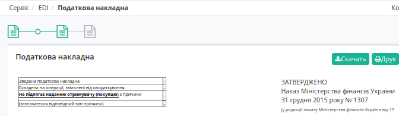

Якщо Податкова накладна не пройшла реєстрацію в ЄРПН, з'явиться друга візуалізація підпису червоним кольором з текстом «Похибка при реєстраціï»:

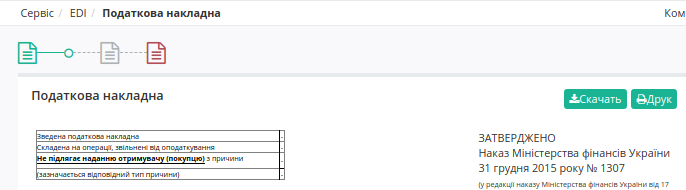

----------------------------
   
.. include:: /_constant/kontakti.rst