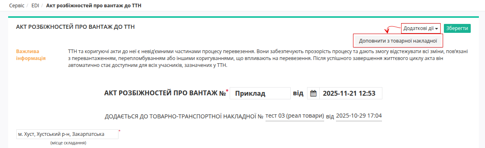
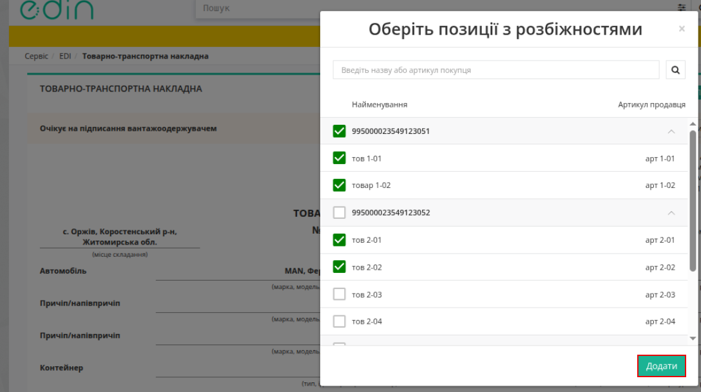

Створення «Акта розбіжностей про вантаж» для мережі «Метро» 
===============================================================================

.. hint::
    Процес створення **«Акта розбіжностей про вантаж»** на базі інших електронних документів опис в інструкції за `"посиланням" <https://wiki.edin.ua/uk/latest/ETTN_3_0/Create_Disagreement_Act_from.html>`__ 

Для мережі «Метро» реалізовано можливість під час створення **«Акта розбіжностей про вантаж»** на підставі е-ТТН доповнювати його табличну область даними з документа COMDOC 27 (Товарна накладна).
Це дозволяє зафіксувати розбіжності по окремих товарах на одній палеті. 

Для того щоб додати розбіжності по товару виконайте наступні кроки: 
1. Відкрийте необхідну ТТH.
2. У відкритому документі в блоці **«Ланцюжок документів»** натисніть кнопку **«Створити документ»** → **«Акт розбіжностей про вантаж»**.
3. Після цього відкриється вікно **«Оберіть позиції з розбіжностями»**. Або, якщо Акт уже створено, у відкритому документі натисніть **«Додаткові дії»** → **«Доповнити з товарної накладної»**.
4. У модальному вікні **Оберіть позиції з розбіжностями** відображається перелік товарів з наступними даними:

    * Найменування
    * Артикул
    * SSCC-код (палета)

Можно обрати всю палету або лише потрібні позиції. Для вибору встановіть позначку навпроти потрібної палети або товару. 
При виборі:
    * палети SSCC -> автоматично додаються всі товари, що входять до цієї палети. Усі позиції палети відмічаються чекбоксами.
    * окремого товару -> до табличної частини Акта буде додано лише вибрану позицію. 

Для підтвердження внесених даних натисніть на кнопку **«Додати»**. 

