Інструкція по роботі з мережею "Modern-Expo" на web-платформі EDI Network 2.0. Інструкція для Постачальника.
#####################################################################################################################

.. role:: red

.. contents:: Зміст:
   :depth: 6

---------

Вступ
====================================

Дана інструкція описує порядок документообігу з мережею "Modern-Expo" на платформі EDI Network 2.0.

**Загальна схема документообігу:**

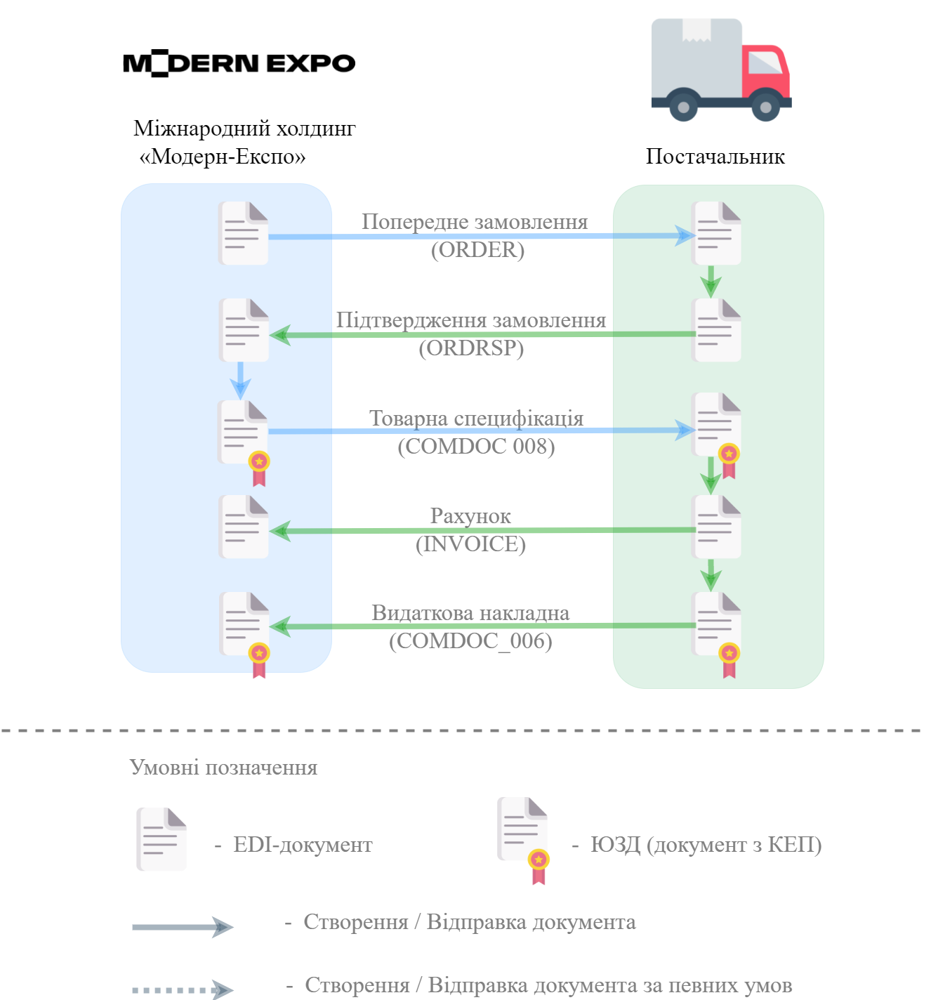

`XML Специфікації для роботи з "Modern-Expo" <https://wiki.edin.ua/uk/latest/ClientProcesses/Modern_Expo/Modern_Expo_XML-structure.html>`__

1 Вхід на платформу
====================================

.. include:: /general_2_0/rabota_s_platformoj_EDIN_2.0.rst
   :start-after: .. початок блоку для Enter
   :end-before: .. кінець блоку для Enter

Після успішної авторизації відкриється основне меню, де у вкладці **"Продукти та рішення"** EDIN потрібно обрати сервіс **"EDI Network"**:

.. image:: /_constant/pics_landing/landing_edi.png
   :align: center

2 Формування "Підтвердження замовлення" (ORDRSP) на підставі вхідного "Попереднього замовлення" (ORDER)
==============================================================================================================

Мережа "Modern-Expo" є ініціатором документообігу - надсилає "Попереднє замовлення" (ORDER), що містить поле DOCTYPE=PO. Документ відображається у "Вхідних" (для зручності можливо скористатись `пошуком <https://wiki.edin.ua/uk/latest/general_2_0/rabota_s_platformoj_EDIN_2.0.html#doc-search>`__):

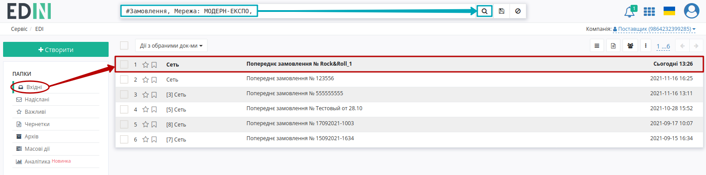

Після ознайомлення зі змістом вхідного документа для створення документа у відповідь на формі-підказці виберіть зі списку **"Підтвердження замовлення"**:

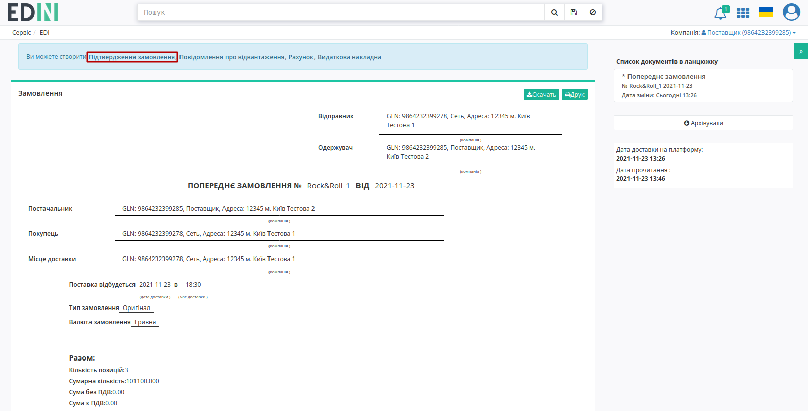

Після чого на підставі "Попереднього замовлення" (ORDER) автоматично створюється "Підтвердження замовлення" (ORDRSP). На формі створюваного документа значення більшості полів заповняться (пененесутся) з документа-підстави. Всі поля, позначені червоною зірочкою :red:`*` - **обов'язкові до заповнення**:

.. image:: pics_Modern_Expo_EDI_instruction/Modern_Expo_EDI_instruction_005.png
   :align: center

1. **Номер** - може збігатися з номером замовлення.
2. **Дата** - дата підтвердження, автоматично вказується поточна дата.
3. **Одержувач** / **Покупець** / **Постачальник** / **Місце доставки** / **Дата доставки** / **Валюта замовлення** автоматично переносяться з замовлення.

В табличній частині створеного документа знаходиться перелік товарних позицій, що були замовлені. Дані позицій можливо відредагувати та **"Змінити"** через pop-up вікно, що відкривається по кліку на штрихкод товару:

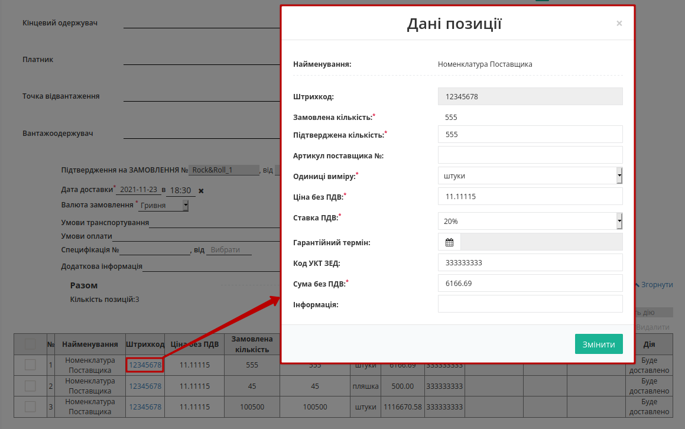

Інформація по позиціям, автоматично переноситься із Замовлення:

#. **№** - номер позиції
#. **Найменування** - назва позиції іх товарного довідника
#. **Штрихкод** - штрихкод товарної позиції, полегшує пошук, переноситься автоматично з замовлення
#. **Ціна без ПДВ**- ціна одиниці товару переноситься автоматично з документа підстави
#. **Замовлена кількість**- кількість автоматично переноситься з замовлення
#. **Підтверджена кількість** - фактична підтверджена кількість, що буде доставлена
#. **Одиниці виміру** - автоматично переноситься з замовлення
#. **Сума без ПДВ** - автоматично переноситься з замовлення
#. **Дії** - вибираються зі списку в залежності від ситуації: **Буде доставлено** (дана товарна позиція буде доставлена в повному обсязі) /  **Відмовлено** (дана товарна позиція доставлена не буде), а при зміні *Підтвердженої кількості* автоматично зміниться на **Зміна кількості**:

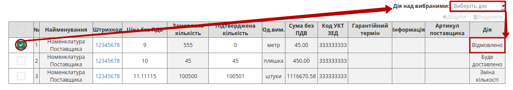

.. warning::
   Табличні значення (товарні позиції) також можливо **"+Додати"** чи **"Видалити"**, однак всі зміни за позиціями повинні виконуватись лише після узгодження з мережею!

Після того, як усі обов’язкові поля будуть заповнені потрібно **"Зберегти"** (1) документ, щоб внесені зміни вступили в силу, а потім - **"Відправити"** (2) документ в мережу:

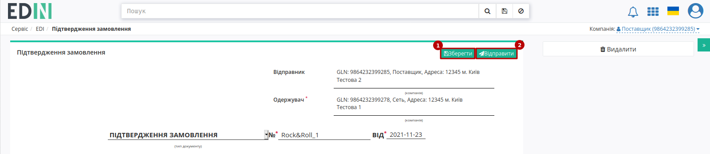

Відправлені документи доступні до перегляду знаходяться у вкладці "Надіслані":

.. image:: pics_Modern_Expo_EDI_instruction/Modern_Expo_EDI_instruction_009.png
   :align: center

3 Отримання "Товарної специфікації" (COMDOC_008)
==============================================================================================================

Мережа "Modern-Expo" у відповідь на "Підтвердження замовлення" (ORDRSP) формує і відправляє підписану "Товарну специфікацію" (COMDOC_008). Документ відображається у "Вхідних" (для зручності можливо скористатись `пошуком <https://wiki.edin.ua/uk/latest/general_2_0/rabota_s_platformoj_EDIN_2.0.html#doc-search>`__):

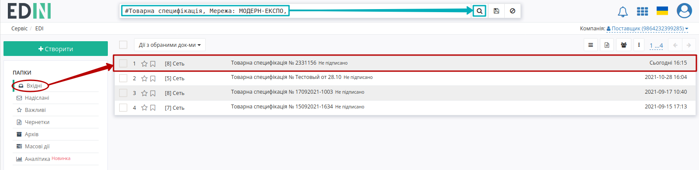

Цей документ **Потребує підписання отримувачем**. Для його підписання потрібно перейти в документ і у відкритому документі натиснути на кнопку **"Підписати і відправити"**:

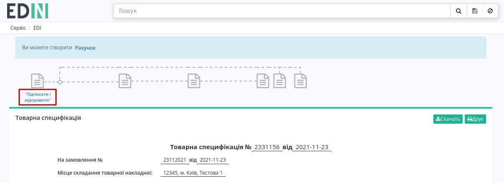

.. _sign:

3.1 Підписання та відправка "Товарної специфікації" (COMDOC_008)
----------------------------------------------------------------------------

.. загальне підписання на платформі

.. tabs::

   .. tab:: Файловий ключ

      .. include:: /_constant/signing/signing.rst
         :start-after: .. початок блоку для Signing
         :end-before: .. кінець блоку для Signing

   .. tab:: Token

      .. include:: /_constant/token_signing/token_signing.rst
         :start-after: .. початок блоку для TokenSign
         :end-before: .. кінець блоку для TokenSign

   .. tab:: Гряда

      .. include:: /_constant/gryada_signing/gryada_signing.rst
         :start-after: .. початок блоку для GryadaSign
         :end-before: .. кінець блоку для GryadaSign

   .. tab:: Cloud

      .. include:: /_constant/cloud_signing/cloud_signing.rst
         :start-after: .. початок блоку для CloudSign
         :end-before: .. кінець блоку для CloudSign

Після підписання "Товарна специфікація" (COMDOC_008) відправляється автматично, а інформацію щодо підписантів можливо переглянути, клікнувши на зелену іконку документа:

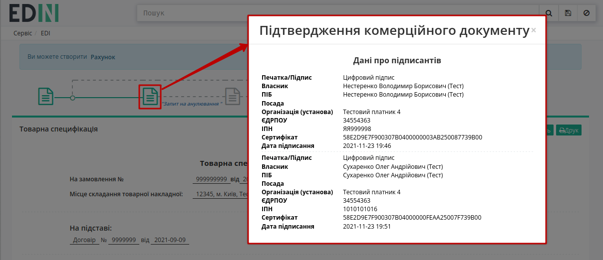

4 Формування "Рахунку" (INVOICE) на підставі вхідної "Товарної специфікації" (COMDOC_008)
==============================================================================================================

Після підписання "Товарної специфікації" (COMDOC_008) на підставі цього документа потрібно створити "Рахунок" (INVOICE). Для цього у відкритому документі "Товарна специфікація" (COMDOC_008) на формі-підказці потрібно вибрати і створити **"Рахунок"**:

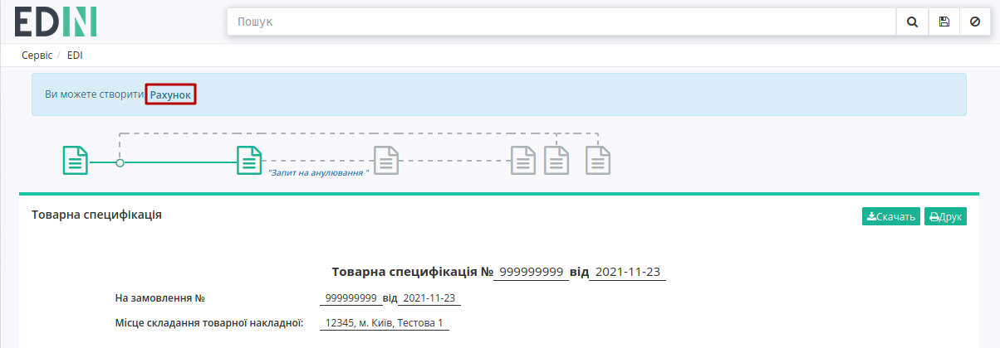

Після чого на підставі "Товарної специфікації" (COMDOC_008) автоматично створюється "Рахунок" (INVOICE). На формі створюваного документа значення більшості полів заповняться (пененесутся) з документа-підстави. Всі поля, позначені червоною зірочкою :red:`*` - **обов'язкові до заповнення**:

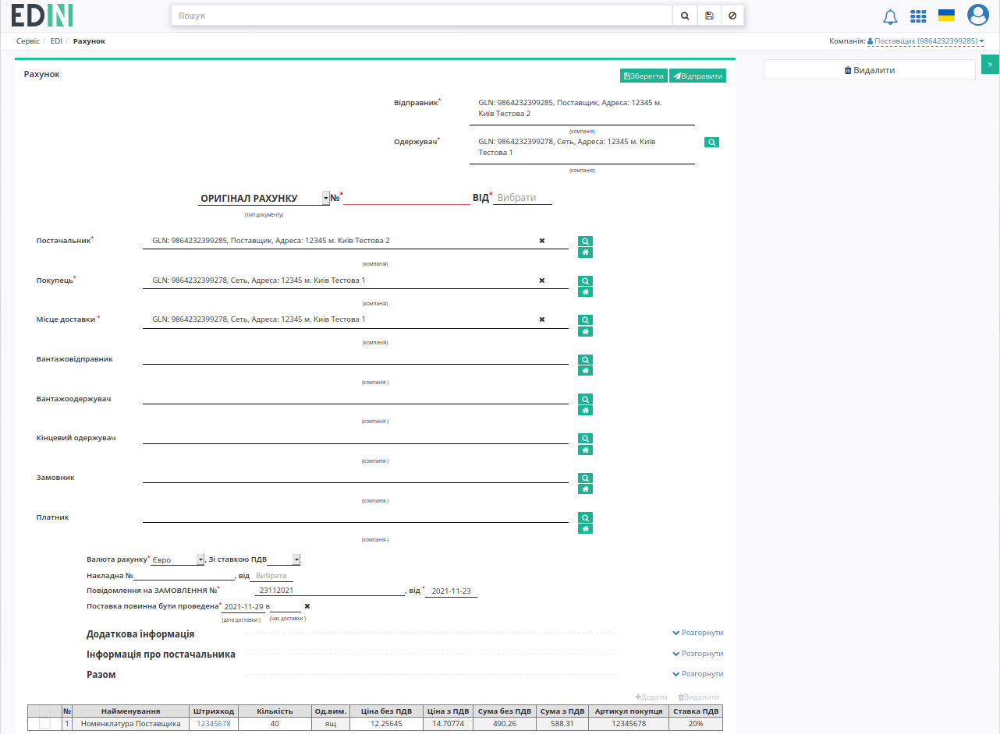

На сторінці створеного документа присутні блоки:

* **Додаткова інформація** про документ (необов'язкова до заповнення);
* **Інформація про постачальника** заповнюється автоматично і недоступна до редагування;
* **Разом** - розраховується автоматичноза табличними даними.

Ви можете відкрити або приховати ці блоки натиснувши на кнопку **Розгорнути / Згорнути**:

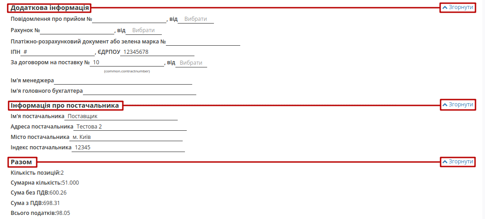

.. warning::
   Всі зміни за позиціями повинні виконуватись лише після узгодження з мережею!

В табличній частині створеного документа знаходиться перелік товарних позицій з документа-підстави. Можливо вносити зміни в кількість позицій за рахунком. **"Змінити"** можливо через pop-up вікно, що відкривається по кліку на штрихкод товару:

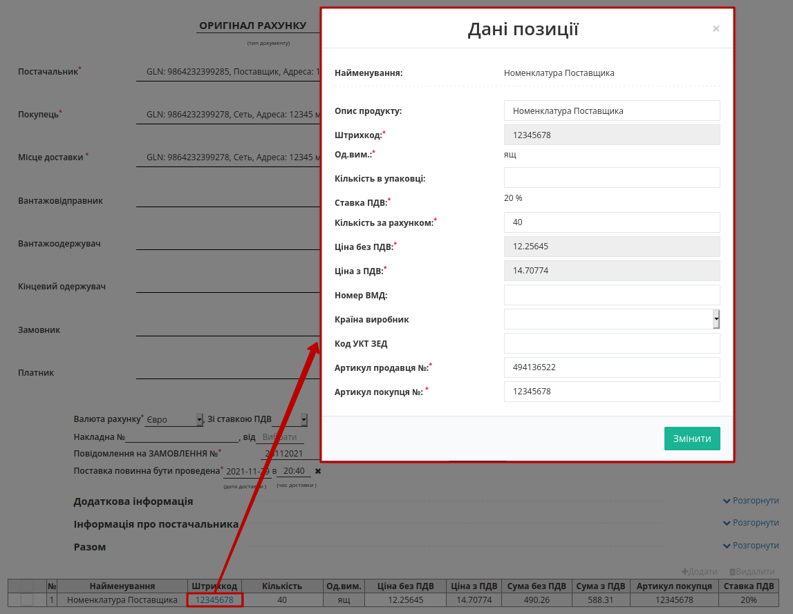

.. important::
   Кількість товарних позицій, що поставляється не може перевищувати кількість зазначену в замовленні!

Після того, як усі обов’язкові поля будуть заповнені потрібно **"Зберегти"** (1) документ, щоб внесені зміни вступили в силу, а потім - **"Відправити"** (2) документ в мережу:

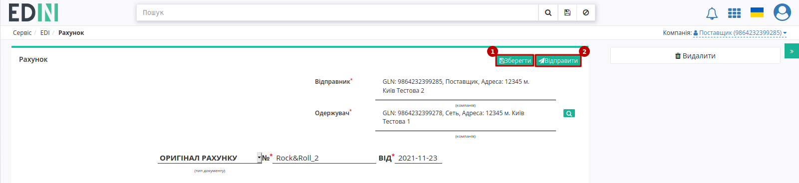

Відправлені документи доступні до перегляду знаходяться у вкладці "Надіслані":

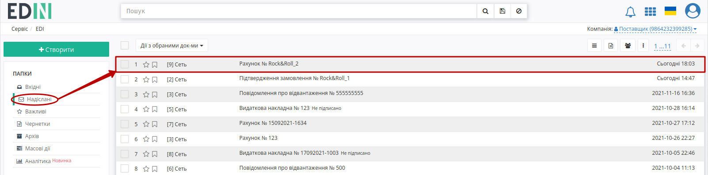

5 Формування "Видаткової накладної" (COMDOC_006) на підставі надісланого "Рахунку" (INVOICE)
==============================================================================================================

Останнім логічним документом, що закриває ланцюжок документів є "Видаткова накладна" (COMDOC_006). Для створення документа потрібно зайти в "Надіслані" та перейти в раніше відправлений "Рахунок" (INVOICE):

У відкритому документі на формі-підказці потрібно вибрати **"Видаткова накладна"**:

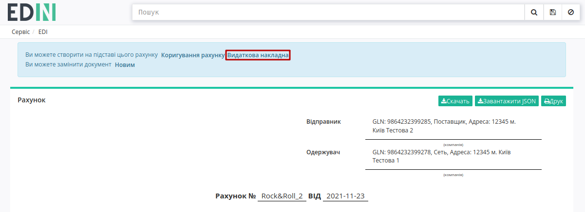

Після чого на підставі "Рахунку" (INVOICE) автоматично створюється "Видаткова накладна" (COMDOC_006). На формі створюваного документа значення більшості полів заповняться (пененесутся) з документа-підстави. Всі поля, позначені червоною зірочкою :red:`*` - **обов'язкові до заповнення**:

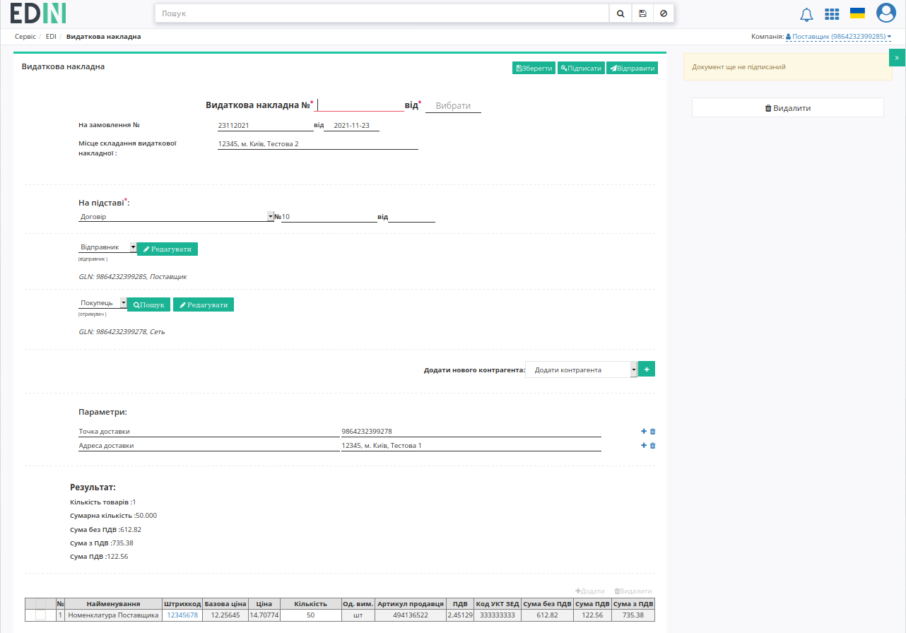

.. include:: /retail_2.0/formirovanie_otpravka_dokumenta_Vydatkova_Nakladna_na_EDI_Network_2.0.rst
   :start-after: .. початок блоку для ForAllCOMDOC_006/032/037
   :end-before: .. кінець блоку для ForAllCOMDOC_006/032/037

Обов'язкові дані блоків Відправника та Покупця заповнюються автоматично, однак за потреби їх можливо відредагувати (кнопка **"Редагувати"**):

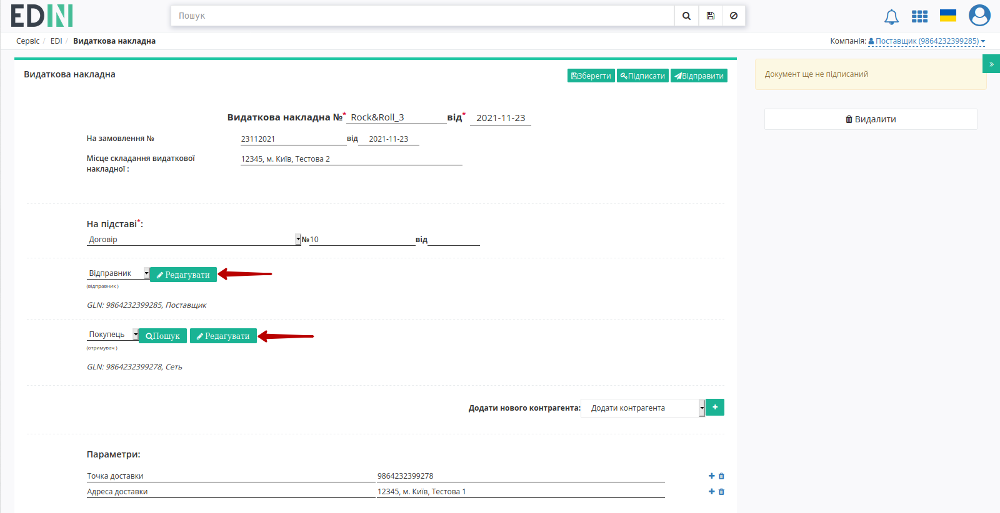

Після чого відредаговані дані цих блоків можливо **"Сховати"**:  

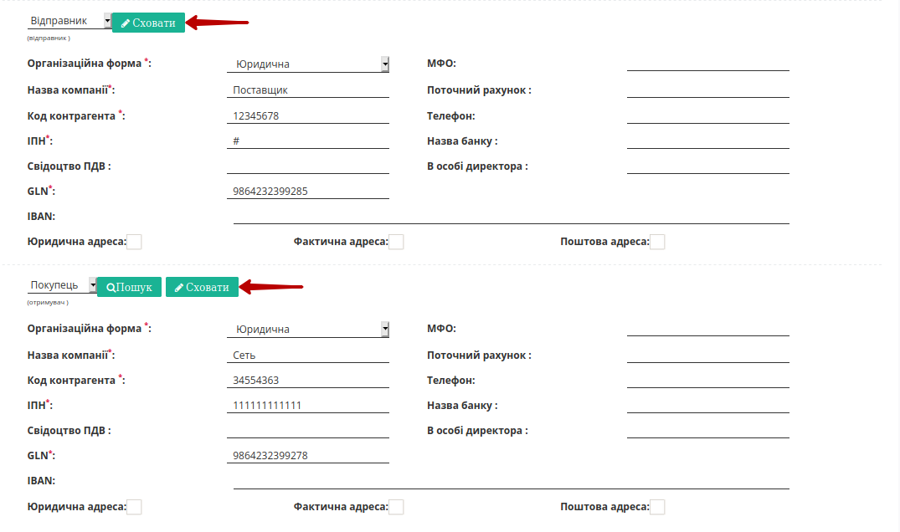

В табличній частині створеного документа знаходиться перелік товарних позицій з документа-підстави. Дані конкретної позиціїї можливо редагувати через pop-up вікно, що відкривається по кліку на штрихкод товару:

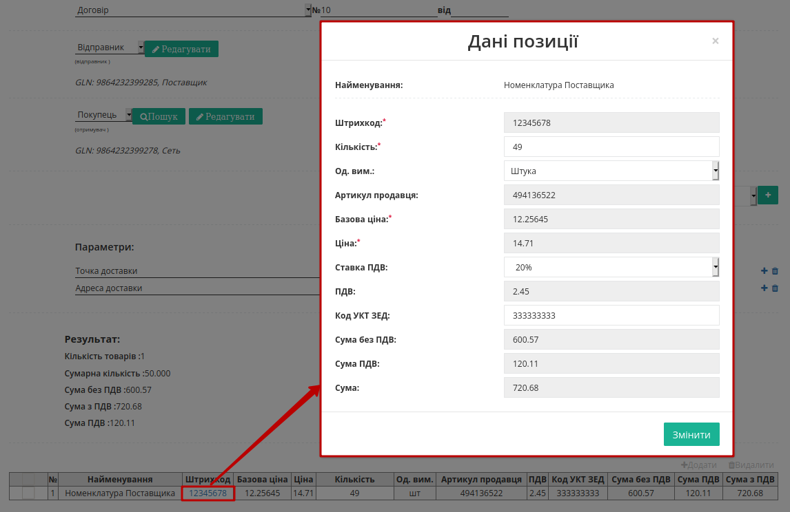

.. warning::
   Всі зміни за позиціями повинні виконуватись лише після узгодження з мережею!

Після того, як усі обов’язкові поля будуть заповнені документ потрібно **"Зберегти"** (1), **"Підписати"** (2), а потім - **"Відправити"** (3) документ в мережу:

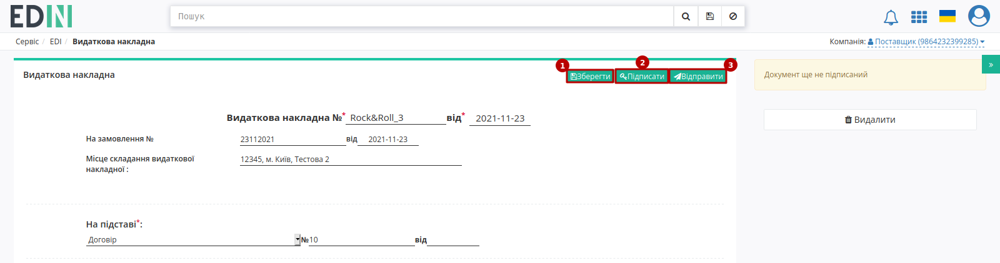

.. hint::
   Процес підписання документів на платформі не відрізняється і описаний в `розділі вище <https://wiki.edin.ua/uk/latest/ClientProcesses/Modern_Expo/Modern_Expo_Instructions/Modern_Expo_EDI_instruction.html#sign>`__.

Відправлені документи доступні до перегляду знаходяться у вкладці "Надіслані":

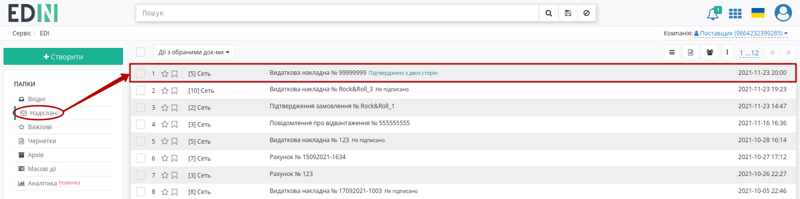

----------------------------
   
.. include:: /_constant/kontakti.rst
