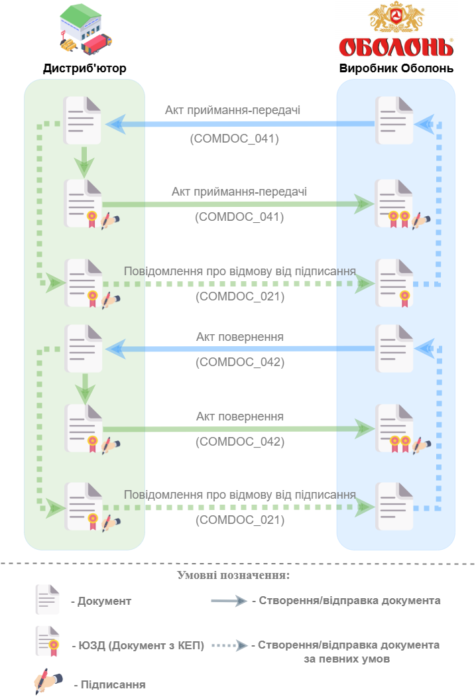

####################################################################################################################################
Документообіг компанії "Оболонь" з Дистриб'юторською Компанією на платформі EDI Network 2.0. Інструкція для Дистриб'ютора (Покупця)
####################################################################################################################################

.. картинки в текст

.. |лупа| image:: /_constant/icons/magnifying_glass.png

.. |будинок| image:: /_constant/icons/house.png

.. |pencil_stencil| image:: /_constant/icons/pencil_stencil.png

.. |лупа2| image:: /_constant/icons/magnifying_glass2.png

.. |drag_dots| image:: /_constant/icons/drag_dots.png

.. |trash| image:: /_constant/icons/trash.png

.. |download| image:: /_constant/icons/download.png

.. |trash_f_red| image:: /_constant/icons/trash_f_red.png

.. role:: red

.. role:: orange

.. role:: green

.. role:: underline

.. contents:: Зміст:
   :depth: 4

---------

Вступ
====================================

Дана інструкція описує порядок документообігу на платформі EDI Network 2.0 ПРАТ "Оболонь" з Дистриб'юторською Компанією. В документообігу за даною схемою приймають участь наступні документи:

- `Акт приймання-передачі (COMDOC_041) <https://wiki.edin.ua/uk/latest/EDIN_Specs/XML/COMDOC_041_x.html>`__
- `Акт повернення (COMDOC_042) <https://wiki-v2.edin.ua/books/xml-specifikaciyi-dokumentiv/page/akt-povernennia-comdoc-042>`__
- `Повідомлення про відмову від підписання (COMDOC_021) <https://wiki.edin.ua/uk/latest/EDIN_Specs/XML/COMDOC_021_x.html>`__

Документообіг здійснюється між двома Учасниками, де ініціатором виступає мережа "Оболонь".

**Загальна схема документообігу:**

Компанія "Оболонь" (Продавець) створює Акт приймання-передачі обладнання без електронного цифрового підпису (ЕЦП) та відправляє документ отримувачу (Дистриб'ютору). Якщо Дистриб'ютор погоджується з даними Акту, то він підписує Акт за допомогою ЕЦП відповідальної особи й відправляє Акт приймання-передавання обладнання Продавцю. Продавець підписує зі свого боку отриманий Акт. Якщо Дистриб'ютор не погоджується з даними Акту приймання-передачі, то він формує Відмову від підписання із вказанням причини відмови та накладанням ЕЦП. Після чого Продавець формує та відправляє Дистриб'ютору новий Акт приймання-передачі з урахуванням вказаних у Відмові причин.

Продавець створює Акт повернення без ЕЦП та відправляє документ Дистриб'ютору. Якщо Дистриб'ютор погоджується з даними Акту, то він підписує Акт за допомогою ЕЦП відповідальної особи й відправляє Акт повернення Продавцю. Продавець підписує зі свого боку отриманий Акт. Якщо Дистриб'ютор не погоджується з даними Акту повернення, то він формує Відмову від підписання із вказанням причини відмови та накладанням ЕЦП. Після чого Продавець формує та відправляє Дистриб'ютору новий Акт приймання-передачі з урахуванням вказаних у Відмові причин.

1. Вхід на платформу
================================================================================================================

.. include:: /general_2_0/rabota_s_platformoj_EDIN_2.0.rst
   :start-after: .. початок блоку для Enter
   :end-before: .. кінець блоку для Enter

Після успішної авторизації відкриється основне меню, де у вкладці **"Продукти та рішення"** EDIN потрібно обрати сервіс **"EDI Network"**:

.. image:: /_constant/pics_landing/landing_edi.png
   :align: center

2. Опрацювання вхідного "Акту приймання-передачі" (COMDOC_041) та вхідного "Акту повернення" (COMDOC_042)
=======================================================================================================================

Опрацювання вхідних документів "Акт приймання-передачі" (COMDOC_041) та "Акт повернення" (COMDOC_042) однакове. Розглянемо принцип опрацювання вхідного документу на прикладі "Акту повернення".

Для обробки "Акта повернення" (COMDOC_042) в сервісі "EDI Network" потрібно перейти у теку **"Вхідні"** та вибрати **"Акт повернення"** в статусі :red:`"Не підписано"` (для зручності можна скористатись рядком `пошуку <https://wiki.edin.ua/uk/latest/general_2_0/rabota_s_platformoj_EDIN_2.0.html#doc-search>`__):

.. image:: /ClientProcesses/Obolon/Obolon_Instructions/pics_Obolon/Obolon_002.png
   :align: center

Відкриється форма документа, де Ви зможете ознайомитись з документом. Якщо Ви згодні продовжити документообіг, потрібно підписати вхідний документ. Для цього натисніть кнопку **"Підписати"**:

.. image:: /ClientProcesses/Obolon/Obolon_Instructions/pics_Obolon/Obolon_003.png
   :align: center

.. hint::
   Процес підписання є типовим на платформі EDI Network та описаний в `розділі нижче <https://wiki.edin.ua/uk/latest/ClientProcesses/Obolon/Obolon_Instructions/Obolon_instruction.html#edin-2-0>`__.

Після підписання документ змінює свій статус на :orange:`"Очікує на підписання відправником"`. Після підписання документу з боку мережі документ буде відображатись в теці **"Вхідні"** в статусі :green:`"Підписано двома сторонами"`.

.. note::
   Для того, щоб **Відхилити** "Акт повернення" (COMDOC_042) можливо оформити типову для комерціних документів **"Відмову від підписання"** (`детальніше <https://wiki.edin.ua/uk/latest/ClientProcesses/Obolon/Obolon_Instructions/Obolon_instruction.html#comdoc-021-o13>`__):

   .. image:: /ClientProcesses/Obolon/Obolon_Instructions/pics_Obolon/Obolon_004.png
      :align: center

Підписання на платформі EDIN 2.0
=========================================================================================================================

.. tabs::

   .. tab:: Файловий ключ

      .. include:: /_constant/signing/signing.rst
         :start-after: .. початок блоку для Signing
         :end-before: .. кінець блоку для Signing

   .. tab:: Token

      .. include:: /_constant/token_signing/token_signing.rst
         :start-after: .. початок блоку для TokenSign
         :end-before: .. кінець блоку для TokenSign

   .. tab:: Гряда

      .. include:: /_constant/gryada_signing/gryada_signing.rst
         :start-after: .. початок блоку для GryadaSign
         :end-before: .. кінець блоку для GryadaSign

   .. tab:: Cloud

      .. include:: /_constant/cloud_signing/cloud_signing.rst
         :start-after: .. початок блоку для CloudSign
         :end-before: .. кінець блоку для CloudSign

Відмова від підписання комерційних документів - COMDOC_021 квитанція №13
==================================================================================================================

.. include:: /_constant/comdoc_reject/comdoc_reject.rst
   :start-after: .. початок блоку для Comdoc_Reject
   :end-before: .. кінець блоку для Comdoc_Reject

------------------------------------------------

.. include:: /_constant/kontakti.rst
