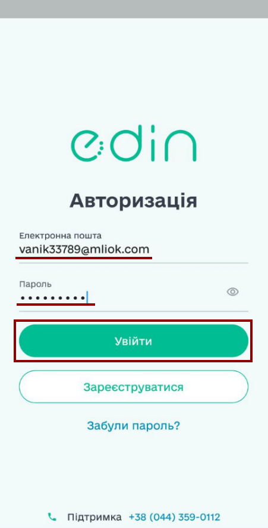
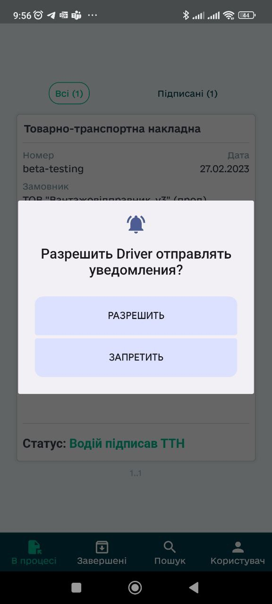
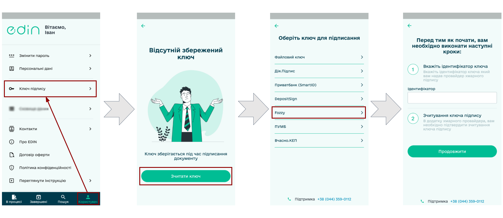
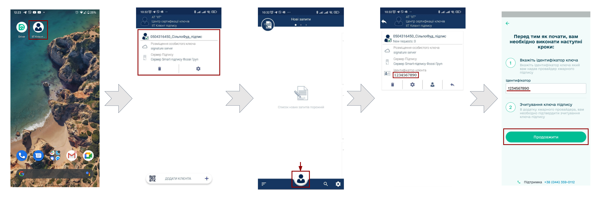
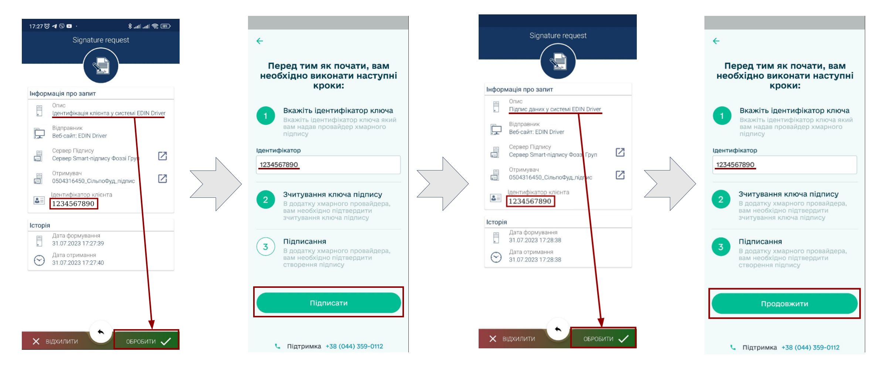
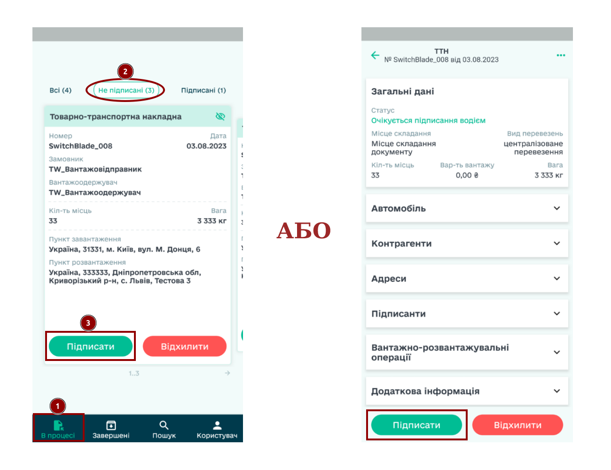
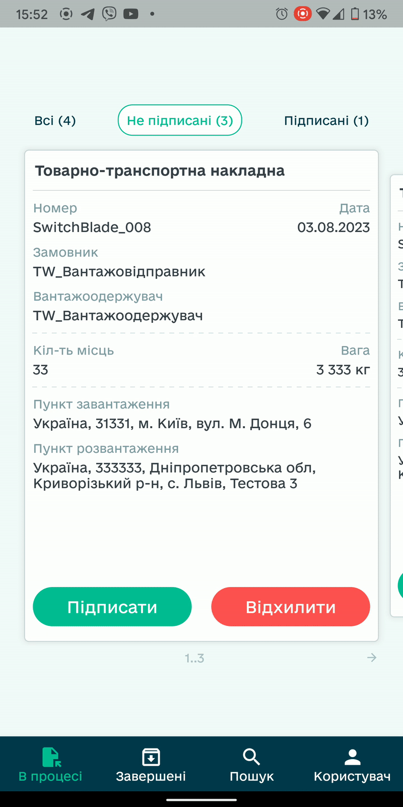
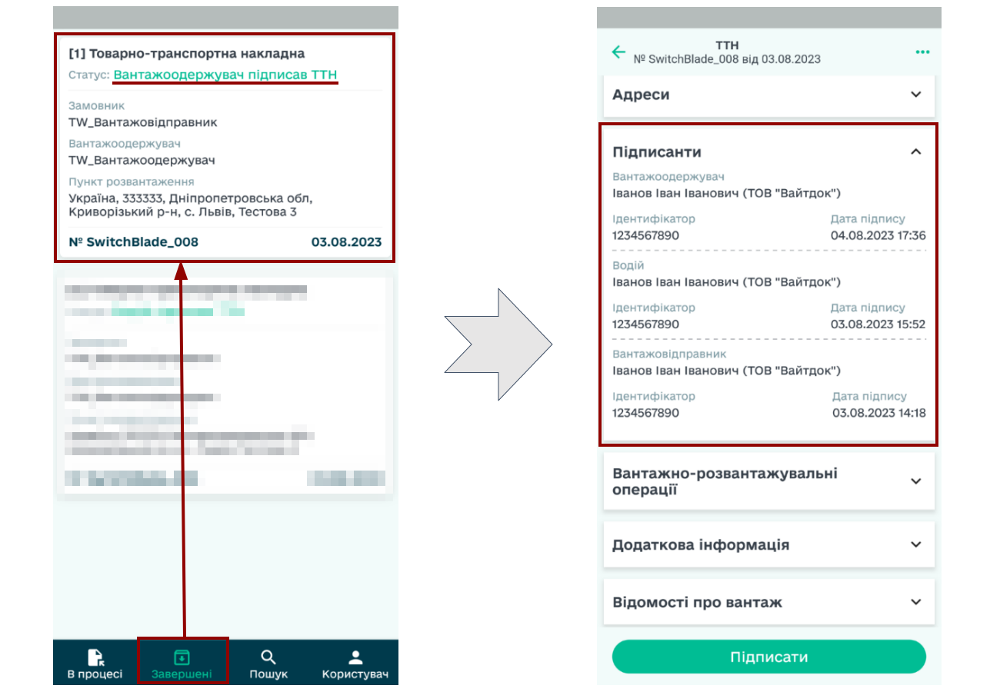

########################################################################################################################
Робота в додатку EDIN "Driver". Інструкція для Водіїв "Сільпо"
########################################################################################################################

.. сюда закину немного картинок для текста

.. |diskette| image:: /_constant/icons/diskette.png

.. |green_trash| image:: /_constant/icons/green_trash.png

.. contents:: Зміст:
   :depth: 5

---------

1 Встановлення додатку EDIN "Driver" на Ваш смартфон/планшет
====================================================================

.. android only: when ios will be ready add here some tabs fo different systems 

.. note::
   Android дає змогу встановлювати додатки не тільки з офіційного Google Play, але й від сторонніх розробників. За замовчуванням ця опція вимкнена в рамках безпеки (ми не рекомендуємо встановлювати додатки з неперевірених джерел). Перед встановленням нашого додатка через apk-файл переконайтесь, що на Вашому пристрої є додаток, що має дозвіл встановлювати додатки зі сторонніх джерел: "Налаштування" -> "Додатки та сповіщення" -> "Спеціальний доступ" -> "Встановлювати невідомі додатки":

   .. image:: pics_Silpo_EDIN_Driver/Silpo_EDIN_Driver_001.png
      :align: center
   
   Шлях налаштування в різних версіях та оболонках Android може відрізнятись, спробуйте:

   *Для версій старших Android 8.0 налаштування робляться централізовано:* "Налаштування" -> "Безпека" -> "Невідомі джерела" (також у меню "Налаштування" зазвичай доступний пошук по усіх налаштуваннях пристрою, спробуйте почати вводити туди словосполучення "невідомі джерела")

Після того, як Ви завантажите наш apk-файл на Ваш пристрій, потрібно відкрити "довірений" (див. примвтку вище) файловий менеджер, знайти наш apk-файл та **"Установити"** додаток:

.. image:: pics_Silpo_EDIN_Driver/Silpo_EDIN_Driver_002.png
   :align: center

По завершенню встановлення Ви зможете почати роботу з додатком **"Driver"**. 

.. _key-add:

2 Додавання ключа в EDIN "Driver"
====================================================================

Відкривши додаток EDIN "Driver", потрібно здійснити авторизований вхід: вже зареєстрованим користувачам потрібно ввести електонну пошту (логін), пароль та натиснути **"Увійти"**:

За потреби потрібно **"Дозволити"** додатку надсилати сповіщення аби Ви нічого не пропустили:

Для зручного підписання в додатку EDIN "Driver" можливо зберегти Ваш ключ підпису (при першому підписанні він зберігається автоматично). Для цього потрібно в меню **"Користувач"** перейти до **"Ключ підпису"** -> **"Зчитати ключ"** -> обрати ключ **"Fozzy"**: 

.. important::
   Передбачається, що Водії "Сільпо" вже мають встановлений додаток "ІІТ Клієнт підпису" ("IIT Sign client"), через який і буде здіснюватись підписання.

Далі додаток попросить Вас ввести ідентифікатор ключа. Ваш ідентифікатор можливо копівати з додатка "ІІТ Клієнт підпису" (обрати Ваш ключ, пройти підтвердження особи (пароль або біометрія) та знайти в своєму меню), вставити Ваш ідентифікатор у відповідне поле додатка EDIN "Driver" і **"Продовжити"**:

Після чого Вас буде автоматично перенаправлено в додаток "ІІТ Клієнт підпису" для підтвердження запиту. Потрібно **"Обробити"** запит і вже після цього натиснути **"Підписати"** в додатку EDIN "Driver". Для підписання потрібно ще раз **"Обробити"** запит в "ІІТ Клієнт підпису" та **"Продовжити"** додавання ключа підписання в додатку EDIN "Driver":

Тепер Ваш ключ підпису відображається в меню **"Користувач"** -> **"Ключ підпису"** (за потреби там його можливо замінити).

.. _sign:

3 Підписання е-ТТН в EDIN "Driver"
====================================================================

У вкладці **"В процесі"** відображаються е-ТТН, які Ви можете відфільтрувати ("Всі", "Підписані", "Не підписані"). Для того, щоб детальніше ознайомитись з документом потрібно натиснути на нього, а вибір документа здійснюється "свайпами" вліво вправо:

.. image:: pics_Silpo_EDIN_Driver/Silpo_EDIN_Driver_008.gif
   :height: 500px
   :align: center

.. hint::
   "Не підписані" е-ТТН документи можливо підписати **кожен окремо** чи **масово**, обравши кілька документів. 

1) Для того, щоб **підписати 1 документ** потрібно при перегляді документа чи у вкладці **"В процесі"** обрати не підписаний документ і натиснути **"Підписати"**:

2) Для того, щоб **підписати кілька документів** потрібно у вкладці **"В процесі"** серед **"Не підписаних"** документів **затиснути** один із документів (для активації функціоналу масового підписання), відмітити потрібні документи чи **"Обрати всі"** та натиснути **"Підписати (к-ть)"**:

.. note::
   При підписанні за допомогою ключа Fozzy в додаток "ІІТ Клієнт підпису" надходить запит, який потрібно **"Обробити"** (якщо Водій попердньо не ввів і не підтвердив у додатку свій код підпису, то додаток запитає код перед надсиланням запиту до IIT):

   .. image:: pics_Silpo_EDIN_Driver/Silpo_EDIN_Driver_011.png
      :height: 500px
      :align: center

Обрані документи підписано: з даними підписантів Ви можете ознайомитись відкривши **"Підписантів"** у документі:

.. image:: pics_Silpo_EDIN_Driver/Silpo_EDIN_Driver_012.png
   :height: 500px
   :align: center

Після того, як Вантажоодержувач підписує та надсилає е-ТТН документ зі своєї сторони, його статус змінюється (Ви отримаєте сповіщення) на **"Вантажоодержувач підписав ТТН"** і він автоматично переноситься у вкладку **"Завершені"**:

.. hint::
   Для зручної роботи з новими та поточними документами в додатку EDIN "Driver" старі документи можливо **"Перемістити в завершені"** (після цього документ не буде відображатись в розділі **"В процесі"**): 

   .. image:: pics_Silpo_EDIN_Driver/Silpo_EDIN_Driver_013.png
      :height: 500px
      :align: center

.. include:: /Driver/Instructions/Android.rst
   :start-after: .. початок блоку для Silpo_Driver_001
   :end-before: .. кінець блоку для Silpo_Driver_001

---------------------------------

.. include:: /_constant/kontakti.rst

