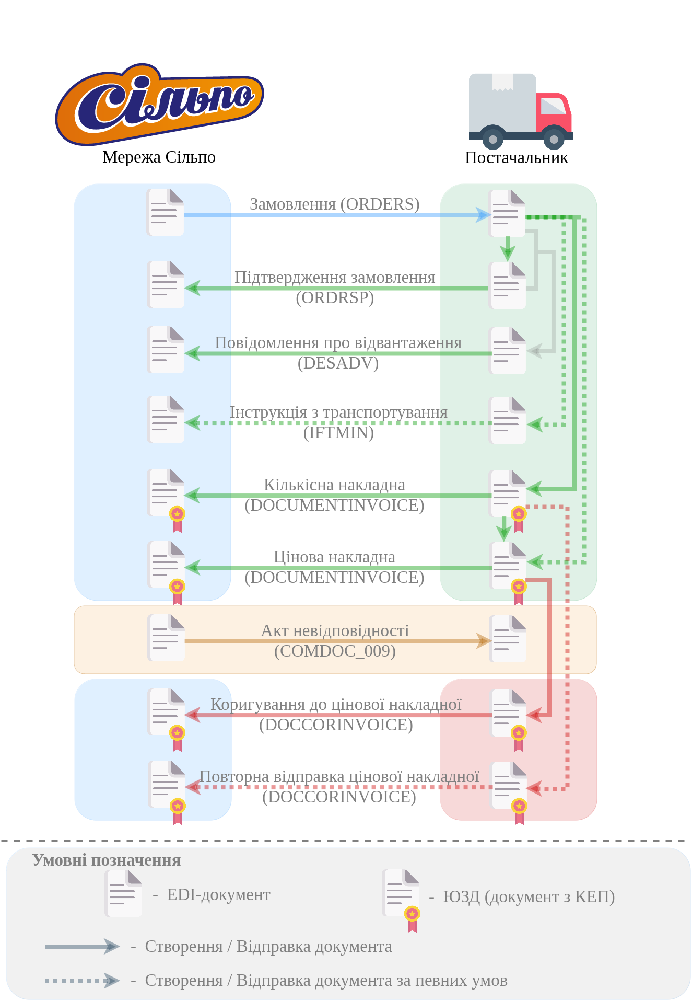

########################################################################################################################
Документообіг з мережею "Сільпо" на платформі EDI Network 2.0 за схемою "Match Invoice". Інструкція Постачальника
########################################################################################################################

.. картинки в текст

.. |лупа| image:: /_constant/icons/magnifying_glass.png

.. |будинок| image:: /_constant/icons/house.png

.. |pencil_stencil| image:: /_constant/icons/pencil_stencil.png

.. |лупа2| image:: /_constant/icons/magnifying_glass2.png

.. |drag_dots| image:: /_constant/icons/drag_dots.png

.. |trash| image:: /_constant/icons/trash.png

.. |download| image:: /_constant/icons/download.png

.. |trash_f_red| image:: /_constant/icons/trash_f_red.png

.. role:: red

.. role:: orange

.. role:: underline

.. contents:: Зміст:
   :depth: 5

---------

Вступ
====================================

Дана інструкція описує порядок документообігу на платформі EDI Network 2.0 з мережею "Сільпо" за схемою "Match Invoice". В документообігу за даною схемою приймають участь наступні документи:

- `Замовлення (ORDER) <https://wiki.edin.ua/uk/latest/ClientProcesses/Silpo/Silpo_XML-structure.html#order>`__
- `Підтвердження замовлення (ORDRSP) <https://wiki.edin.ua/uk/latest/ClientProcesses/Silpo/Silpo_XML-structure.html#ordrsp>`__
- `Інструкція з транспортування (IFTMIN) <https://wiki.edin.ua/uk/latest/ClientProcesses/Silpo/Silpo_XML-structure.html#iftmin>`__
- `Накладна за кількістю (DOCUMENTINVOICE_TN) <https://wiki.edin.ua/uk/latest/ClientProcesses/Silpo/Silpo_XML-structure.html#documentinvoice-tn>`__
- `Цінова накладна (DOCUMENTINVOICE_PRN) <https://wiki.edin.ua/uk/latest/ClientProcesses/Silpo/Silpo_XML-structure.html#documentinvoice-prn>`__
- `Акт невідповідності (COMDOC_009) <https://wiki.edin.ua/uk/latest/ClientProcesses/Silpo/Silpo_XML-structure.html#comdoc-009>`__
- `Коригування до товарної накладної (DOCCORINVOICE) <https://wiki.edin.ua/uk/latest/ClientProcesses/Silpo/Silpo_XML-structure.html#doccorinvoice>`__

Документообіг здійснюється між двома Учасниками, де ініціатором виступає мережа "Сільпо".

**Загальна схема документообігу:**

1 Вхід на платформу
====================================

.. include:: /general_2_0/rabota_s_platformoj_EDIN_2.0.rst
   :start-after: .. початок блоку для Enter
   :end-before: .. кінець блоку для Enter

Після успішної авторизації відкриється основне меню, де у вкладці **"Продукти та рішення"** EDIN потрібно обрати сервіс **"EDI Network"**:

.. image:: /_constant/pics_landing/landing_edi.png
   :align: center

.. _ordrsp-from-order:

2 Створення "Підтвердження замовлення" (ORDRSP) на підставі вхідного "Замовлення" (ORDER)
==========================================================================================================================

В схемі документообігу "Match Invoice" з Мережею "Підтвердження замовлення" (ORDRSP) створюється Постачальником на підставі вхідного "Замовлення" (ORDER).

.. admonition:: Важливо!

   Даний документ формується відразу після отримання "Замовлення" (ORDER) від Мережі.

.. include:: /ClientProcesses/Fozzy/Fozzy_Instructions/Fozzy_ORDRSP_instruction.rst
   :start-after: .. початок блоку для ordrsp_from_order_Silpo
   :end-before: .. кінець блоку для ordrsp_from_order_Silpo

.. _desadv-from-ordrsp:

3 Формування "Повідомлення про відвантаження" (DESADV)
=========================================================================================================================

Формування документа "Повідомлення про відвантаження" (DESADV) на платформі EDI Network можливо здійснити, як на підставі "Замовлення" (ORDER), так і на підставі "Підтвердження замовлення" (ORDRSP).

Розглянемо формування документа "Повідомлення про відвантаження" (DESADV) на підставі "Підтвердження замовлення" (ORDRSP).

Для цього потрібно у папці **"Надіслані"** обрати "Підтвердження замовлення" (ORDRSP), за яким потрібно зробити відвантаження (для зручності можливо скористатись `пошуком <https://wiki.edin.ua/uk/latest/general_2_0/rabota_s_platformoj_EDIN_2.0.html#doc-search>`__):

.. image:: /ClientProcesses/Silpo/Silpo_Instructions/pics_Silpo_Match_Invoice/Silpo_Match_Invoice_003.png
   :align: center

Потрібно відкрити надіслане "Підтвердження замовлення" (ORDRSP) лівою кнопкою миші та створити "Повідомлення про відвантаження" (DESADV) в блоці `ланцюжка документів <https://wiki.edin.ua/uk/latest/_constant/chain/chain.html>`__ для Мережі за допомогою кнопки **"Створити документ"**:

.. image:: /ClientProcesses/Silpo/Silpo_Instructions/pics_Silpo_Match_Invoice/Silpo_Match_Invoice_004.png
   :align: center

У відкритій формі "Повідомлення про відвантаження" (DESADV) майже всі поля заповнюються автоматично з пов'язаного документа-підстави (обов'язкові до заповнення поля позначені червоною зірочкою :red:`*`):

.. image:: /ClientProcesses/Silpo/Silpo_Instructions/pics_Silpo_Match_Invoice/Silpo_Match_Invoice_005.png
   :align: center

Дані **Відправника** заповнюються автоматично з обраної компанії і не підлягають редагуванню. Дані **Одержувача** також заповнюються автоматично (з документа-підстави) - їх можливо редагувати за допомогою кнопки "Пошук контрагента" (|лупа|). **Номер** документа співпадає з номером документа-підстави, **Дата** / час документа, що заповнюються автоматично, також доступні до редагування за потреби. Дані **Постачальник**, **Покупець**, **Місце доставки**, **Кінцевий одержувач** також заповнюються автоматично - їх можливо редагувати за допомогою кнопок "Пошук контрагента" (|лупа|) чи "Вказати себе" (|будинок|);

.. hint::
   За допомогою кнопки **"Пошук контрагента"** (|лупа|) або ж за допомогою кнопки **"Вказати себе"** (|будинок|) можливо вказати чи змінити дані контрагентів. При **"Пошуку контрагента"** (|лупа|) у виникаючому вікні введіть назву компанії, GLN або ІПН:

   .. image:: /ClientProcesses/Silpo/Silpo_Instructions/pics_Silpo_Match_Invoice/Silpo_Match_Invoice_006.png
      :align: center

Також потрібно додати інформацію **За накладною** (номер та дата), зазначити загальну **Кількість повідомлень про відвантаження на замовлення** та порядковий **Номер повідомлення про відвантаження**. Дані з "Замовлення" переносяться автоматично і недоступні до редагування. Блоки **Додаткова інформація** та **Транспортування** необов'язкові до заповнення і "згорнуті" за замовчуванням. Блок **Разом** розраховується автоматично після заповнення позицій.

:red:`Всі зміни за позиціями проводяться тільки після узгодження з мережею!`

Постачальник може редагувати "Кількість відвантаженого товару", "Кількість ящиків", "Одиниці виміру", "Ціну без ПДВ" та "Ставку ПДВ" прямо в таблиці чи **"Змінити"** дані позиції в розширеній формі "Дані товару" після натискання на штрихкод позиції:

.. image:: /ClientProcesses/Silpo/Silpo_Instructions/pics_Silpo_Match_Invoice/Silpo_Match_Invoice_007.png
   :align: center

.. attention::
   Кількість товарних позицій, що постачається не може перевищувати кількість зазначену в "Замовленні"!

Якщо по якійсь з позицій не буде поставки її необхідно відзначити галочкою і **"Видалити"**. Також можливо **"+Додати"** нові товарні позиції, але ці дії потрібно узгоджувати з мережею.

.. image:: /ClientProcesses/Silpo/Silpo_Instructions/pics_Silpo_Match_Invoice/Silpo_Match_Invoice_008.png
   :align: center

.. hint::
   До документа можливо додатково **"Прикріпити сертифікати"** (детальніше про те, як `додати Ваші сертифікати на платформу <https://wiki.edin.ua/uk/latest/general_2_0/Directories.html#certificates>`__). Знайти всі Ваші сертифікати можливо через пошук "за номером сертифікату" чи "за номером партії":

   .. image:: /ClientProcesses/Silpo/Silpo_Instructions/pics_Silpo_Match_Invoice/Silpo_Match_Invoice_010.png
      :align: center

   або автоматично знайти "по прив'язаним товарам" за штрихкодом:

   .. image:: /ClientProcesses/Silpo/Silpo_Instructions/pics_Silpo_Match_Invoice/Silpo_Match_Invoice_011.png
      :align: center

   Потрібно обрати зі списку знайдені сертифікати та додати їх до документа за допомогою кнопки **"Зберегти"** (видалити сертифікати з форми документа можливо кнопкою |trash_f_red|).

Після внесення всіх даних в документ, натисніть кнопку **"Зберегти"** (1), потім **"Відправити"** (2):

.. image:: /ClientProcesses/Silpo/Silpo_Instructions/pics_Silpo_Match_Invoice/Silpo_Match_Invoice_009.png
   :align: center

При створенні документу в Чернетки дозволяється відсутність даних в полі **Кількість ящиків** по одній або декільком товарним позиціям. Але при відправці документу буде показано помилку, якщо хоча б по одній товарній позиції поле **Кількість ящиків** не заповнене, оскільки це поле обов'язкове.

Відправлений документ автоматично потрапляє в папку **"Надіслані"** і буде знаходиться в `ланцюжку <https://wiki.edin.ua/uk/latest/_constant/chain/chain.html>`__ документів разом із "Замовленням" і "Підтвердженням замовлення" (цифрою відзначається кількість документів в ланцюжку):

.. image:: /ClientProcesses/Silpo/Silpo_Instructions/pics_Silpo_Match_Invoice/Silpo_Match_Invoice_012.png
   :align: center

.. _iftmin-from-order:

4 Створення "Інструкції з транспортування" (IFTMIN) на підставі вхідного "Замовлення" (ORDER)
==========================================================================================================================

В схемі документообігу "Match Invoice" з Мережею "Інструкція з транспортування" (IFTMIN) створюється Постачальником на підставі вхідного "Замовлення" (ORDER).

.. include:: /ClientProcesses/Fozzy/Fozzy_Instructions/Fozzy_IFTMIN_instruction.rst
   :start-after: .. початок блоку для iftmin_from_order_Silpo
   :end-before: .. кінець блоку для iftmin_from_order_Silpo

.. _documentinvoice-tn-from-order:

5 Створення "Накладної за кількістю" (DOCUMENTINVOICE.DocumentFunctionCode = TN) на підставі вхідного "Замовлення" (ORDER)
==========================================================================================================================

В схемі документообігу "Match Invoice" з Мережею "Інструкція з транспортування" (IFTMIN) створюється Постачальником на підставі вхідного "Замовлення" (ORDER).

.. include:: /ClientProcesses/Fozzy/Fozzy_Instructions/Fozzy_DOCUMENTINVOICE_TN_instruction.rst
   :start-after: .. початок блоку для documentinvoice_tn_from_order_Silpo
   :end-before: .. кінець блоку для documentinvoice_tn_from_order_Silpo

.. _documentinvoice-prn-from-order:

6 Створення "Цінової накладної" (DOCUMENTINVOICE.DocumentFunctionCode = PRN) на підставі вхідного "Замовлення" (ORDER)
==========================================================================================================================

"Цінова накладна" може бути створена Постачальником:

* на підставі вхідного "Замовлення" (ORDER);

.. image:: /ClientProcesses/Fozzy/Fozzy_Instructions/pics_Fozzy_DOCUMENTINVOICE_PRN_instruction/Fozzy_DOCUMENTINVOICE_PRN_instruction_002.png
   :align: center

* на підставі відправленої "Накладно ї за кількістю" (DOCUMENTINVOICE.DocumentFunctionCode = TN).

.. image:: /ClientProcesses/Fozzy/Fozzy_Instructions/pics_Fozzy_DOCUMENTINVOICE_PRN_instruction/Fozzy_DOCUMENTINVOICE_PRN_instruction_010.png
   :align: center

При цьому: якщо в ланцюжку документів вже відправлена "Накладна за кількістю", то "Цінову накладну" можливо створити лише на підставі "Накладної за кількістю".

.. include:: /ClientProcesses/Fozzy/Fozzy_Instructions/Fozzy_DOCUMENTINVOICE_PRN_instruction.rst
   :start-after: .. початок блоку для documentinvoice_prn_from_order_Silpo
   :end-before: .. кінець блоку для documentinvoice_prn_from_order_Silpo
   
------------------------------------------------

.. include:: /_constant/kontakti.rst
