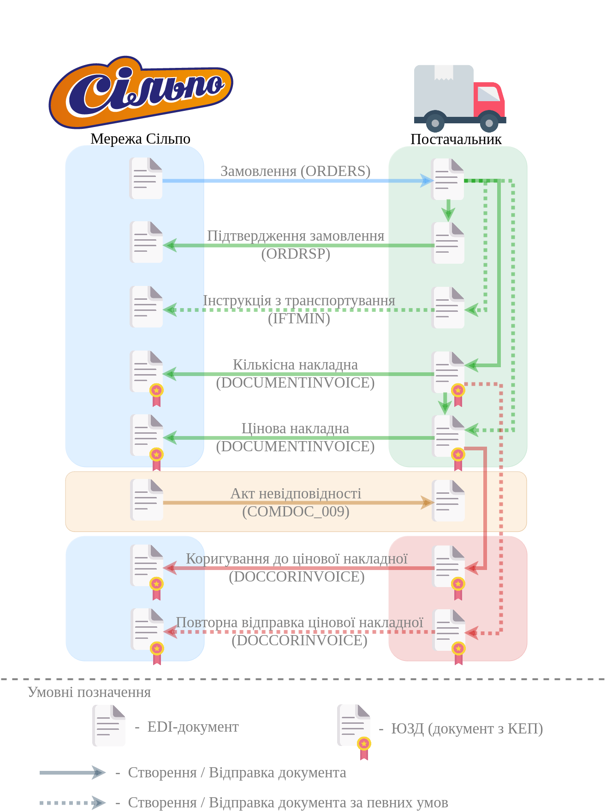

########################################################################################################################
Документообіг з мережею "Сільпо" на платформі EDI Network 2.0 за схемою "Match Invoice". Інструкція Постачальника
########################################################################################################################

.. картинки в текст

.. |лупа| image:: /_constant/icons/magnifying_glass.png

.. |будинок| image:: /_constant/icons/house.png

.. |pencil_stencil| image:: /_constant/icons/pencil_stencil.png

.. |лупа2| image:: /_constant/icons/magnifying_glass2.png

.. |drag_dots| image:: /_constant/icons/drag_dots.png

.. |trash| image:: /_constant/icons/trash.png

.. |download| image:: /_constant/icons/download.png

.. role:: red

.. role:: orange

.. role:: underline

.. contents:: Зміст:
   :depth: 5

---------

Вступ
====================================

Дана інструкція описує порядок документообігу на платформі EDI Network 2.0 з мережею "Сільпо" за схемою "Match Invoice". В документообігу за даною схемою приймають участь наступні документи:

- `Замовлення (ORDER) <https://wiki.edin.ua/uk/latest/ClientProcesses/Silpo/Silpo_XML-structure.html#order>`__
- `Підтвердження замовлення (ORDRSP) <https://wiki.edin.ua/uk/latest/ClientProcesses/Silpo/Silpo_XML-structure.html#ordrsp>`__
- `Інструкція з транспортування (IFTMIN) <https://wiki.edin.ua/uk/latest/ClientProcesses/Silpo/Silpo_XML-structure.html#iftmin>`__
- `Накладна за кількістю (DOCUMENTINVOICE_TN) <https://wiki.edin.ua/uk/latest/ClientProcesses/Silpo/Silpo_XML-structure.html#documentinvoice-tn>`__
- `Цінова накладна (DOCUMENTINVOICE_PRN) <https://wiki.edin.ua/uk/latest/ClientProcesses/Silpo/Silpo_XML-structure.html#documentinvoice-prn>`__
- `Акт невідповідності (COMDOC_009) <https://wiki.edin.ua/uk/latest/ClientProcesses/Silpo/Silpo_XML-structure.html#comdoc-009>`__
- `Коригування до товарної накладної (DOCCORINVOICE) <https://wiki.edin.ua/uk/latest/ClientProcesses/Silpo/Silpo_XML-structure.html#doccorinvoice>`__

Документообіг здійснюється між двома Учасниками, де ініціатором виступає мережа "Сільпо".

**Загальна схема документообігу:**

1 Вхід на платформу
====================================

.. include:: /general_2_0/rabota_s_platformoj_EDIN_2.0.rst
   :start-after: .. початок блоку для Enter
   :end-before: .. кінець блоку для Enter

Після успішної авторизації відкриється основне меню, де у вкладці **"Продукти та рішення"** EDIN потрібно обрати сервіс **"EDI Network"**:

.. image:: /_constant/pics_landing/landing_edi.png
   :align: center

.. _ordrsp_from_order:

2 Створення "Підтвердження замовлення" (ORDRSP) на підставі вхідного "Замовлення" (ORDER)
==========================================================================================================================

В схемі документообігу "Match Invoice" з Мережею "Підтвердження замовлення" (ORDRSP) створюється Постачальником на підставі вхідного "Замовлення" (ORDER).

.. admonition:: Важливо!

   Даний документ формується відразу після отримання "Замовлення" (ORDER) від Мережі.

.. include:: /ClientProcesses/Fozzy/Fozzy_Instructions/Fozzy_ORDRSP_instruction.rst
   :start-after: .. початок блоку для ordrsp_from_order_Silpo
   :end-before: .. кінець блоку для ordrsp_from_order_Silpo

.. _iftmin_from_order:

3 Створення "Інструкції з транспортування" (IFTMIN) на підставі вхідного "Замовлення" (ORDER)
==========================================================================================================================

В схемі документообігу "Match Invoice" з Мережею "Інструкція з транспортування" (IFTMIN) створюється Постачальником на підставі вхідного "Замовлення" (ORDER).

.. include:: /ClientProcesses/Fozzy/Fozzy_Instructions/Fozzy_IFTMIN_instruction.rst
   :start-after: .. початок блоку для iftmin_from_order_Silpo
   :end-before: .. кінець блоку для iftmin_from_order_Silpo

.. _documentinvoice_tn_from_order:

4 Створення "Накладної за кількістю" (DOCUMENTINVOICE.DocumentFunctionCode = TN) на підставі вхідного "Замовлення" (ORDER)
==========================================================================================================================

В схемі документообігу "Match Invoice" з Мережею "Інструкція з транспортування" (IFTMIN) створюється Постачальником на підставі вхідного "Замовлення" (ORDER).

.. include:: /ClientProcesses/Fozzy/Fozzy_Instructions/Fozzy_DOCUMENTINVOICE_TN_instruction.rst
   :start-after: .. початок блоку для documentinvoice_tn_from_order_Silpo
   :end-before: .. кінець блоку для documentinvoice_tn_from_order_Silpo

.. _documentinvoice_prn_from_order:

3 Створення "Цінової накладної" (DOCUMENTINVOICE.DocumentFunctionCode = PRN) на підставі вхідного "Замовлення" (ORDER)
==========================================================================================================================

"Цінова накладна" може бути створена Постачальником:

* на підставі вхідного "Замовлення" (ORDER);

.. image:: /ClientProcesses/Fozzy/Fozzy_Instructions/pics_Fozzy_DOCUMENTINVOICE_PRN_instruction/Fozzy_DOCUMENTINVOICE_PRN_instruction_002.png
   :align: center

* на підставі відправленої "Накладно ї за кількістю" (DOCUMENTINVOICE.DocumentFunctionCode = TN).

.. image:: /ClientProcesses/Fozzy/Fozzy_Instructions/pics_Fozzy_DOCUMENTINVOICE_PRN_instruction/Fozzy_DOCUMENTINVOICE_PRN_instruction_010.png
   :align: center

При цьому: якщо в ланцюжку документів вже відправлена "Накладна за кількістю", то "Цінову накладну" можливо створити лише на підставі "Накладної за кількістю".

.. include:: /ClientProcesses/Fozzy/Fozzy_Instructions/Fozzy_DOCUMENTINVOICE_PRN_instruction.rst
   :start-after: .. початок блоку для documentinvoice_prn_from_order_Silpo
   :end-before: .. кінець блоку для documentinvoice_prn_from_order_Silpo
   
------------------------------------------------

.. include:: /_constant/kontakti.rst
