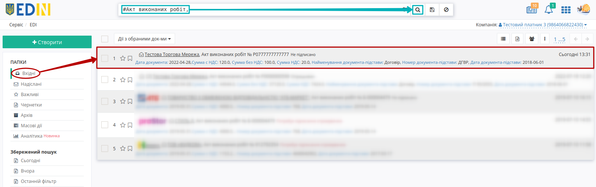
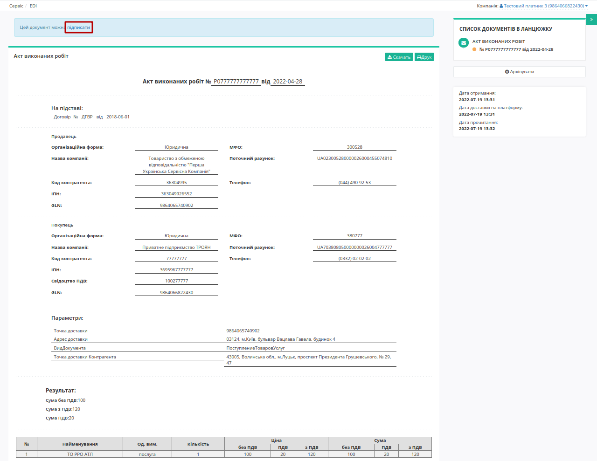

#############################################################################################################################################################################
Робота з "Актом виконаних робіт" (COMDOC_013) та "Актом звірки зведеним" (COMDOC_029) для клієнтів "Системи Трейд" та "ПУСК"
#############################################################################################################################################################################

.. сюда закину немного картинок для текста

.. role:: red

.. role:: green

.. role:: underline

.. contents:: Зміст:
   :depth: 2

---------

Вступ
==============================================================

Інструкція призначена клієнтам "Системи Трейд" та "Першої Української Сервісної Компанії" ("ПУСК"), що працюють з `"Актом виконаних робіт" (COMDOC_013) <https://wiki.edin.ua/uk/latest/EDIN_Specs/XML/COMDOC_013_x.html>`__ та `"Актом звірки зведеним" (COMDOC_029) <https://wiki.edin.ua/uk/latest/EDIN_Specs/XML/COMDOC_029_x.html>`__.

"Система Трейд" чи "Перша Українська Сервісна Компанія" ("ПУСК") в якості контагента формує та відправляє документи `"Акт виконаних робіт" (COMDOC_013) <https://wiki.edin.ua/uk/latest/EDIN_Specs/XML/COMDOC_013_x.html>`__ та `"Актом звірки зведеним" (COMDOC_029) <https://wiki.edin.ua/uk/latest/EDIN_Specs/XML/COMDOC_029_x.html>`__. Ці документи відображаються у **"Вхідних"**:

.. tip::
    Для зручності можливо скористатись фільтром документів у "Вхідних":

    .. image:: pics_System_Pysk_work_with_COMDOC_013_COMDOC_029/System_Pysk_work_with_COMDOC_013_COMDOC_029_02.png
       :align: center 

1 Робота з "Актом виконаних робіт" (COMDOC_013)
==============================================================

У папці **"Вхідні"** виберіть та перейдіть у небхідний документ (для зручності можливо скористатись `пошуком <https://wiki.edin.ua/uk/latest/general_2_0/rabota_s_platformoj_EDIN_2.0.html#doc-search>`__):

Ви можете ознайомитись з відкритим документом та якщо згодні з його змістом натиснути кнопку **"Підписати"**:

.. note::
   Для того аби **відредагувати** документ потрібно перервати (закрити) процес підписання:
   
   .. image:: pics_System_Pysk_work_with_COMDOC_013_COMDOC_029/System_Pysk_work_with_COMDOC_013_COMDOC_029_08.gif
      :align: center
   
   До зміни доступні лише номер та дата непідписаного документа:

   .. image:: pics_System_Pysk_work_with_COMDOC_013_COMDOC_029/System_Pysk_work_with_COMDOC_013_COMDOC_029_04.png
      :align: center
    
   Після внесених змін потрібно **"Зберегти"**, **"Підписати"** та **"Відправити"** документ.

.. _sign:

1.1 Підписання та відправка документа
-----------------------------------------------------

.. загальне підписання на платформі

.. tabs::

   .. tab:: Файловий ключ

      .. include:: /_constant/signing/signing.rst
         :start-after: .. початок блоку для Signing
         :end-before: .. кінець блоку для Signing

   .. tab:: Token

      .. include:: /_constant/token_signing/token_signing.rst
         :start-after: .. початок блоку для TokenSign
         :end-before: .. кінець блоку для TokenSign

   .. tab:: Гряда

      .. include:: /_constant/gryada_signing/gryada_signing.rst
         :start-after: .. початок блоку для GryadaSign
         :end-before: .. кінець блоку для GryadaSign

   .. tab:: Cloud

      .. include:: /_constant/cloud_signing/cloud_signing.rst
         :start-after: .. початок блоку для CloudSign
         :end-before: .. кінець блоку для CloudSign

Після підписання інформація щодо підписанта відображається в блоці "Підписанти". Для відправки документа необхідно натинути на кнопку "Відправити". Після відправки документа контрагенту він відображається в журналі вихідних документів.

2 Робота з "Актом звірки зведеним" (COMDOC_029)
==============================================================

У папці "Вхідні" виберіть та перейдіть у небхідний документ:

.. image:: pics_System_Pysk_work_with_COMDOC_013_COMDOC_029/System_Pysk_work_with_COMDOC_013_COMDOC_029_05.png
   :align: center

Ви можете ознайомитись з відкритим документом та якщо згодні з його змістом натиснути кнопку **"Підписати і відправити у відповідь"**. Підписання відбувається аналогічно до підписання будь-якого іншого документа на платформі та вже описане в розділі `"Підписання та відправка документа <https://wiki.edin.ua/uk/latest/ClientProcesses/System_Pysk/System_Pysk_Instructions/System_Pysk_work_with_COMDOC_013_COMDOC_029.html#sign>`__.

.. _revoke:

3 Відкликання підпису комерційних документів (COMDOC)
=========================================================================================================================

.. include:: /_constant/comdoc_revoke/comdoc_revoke.rst
   :start-after: .. початок блоку для Comdoc_Revoke
   :end-before: .. кінець блоку для Comdoc_Revoke

----------------------------
   
.. include:: /_constant/kontakti.rst
