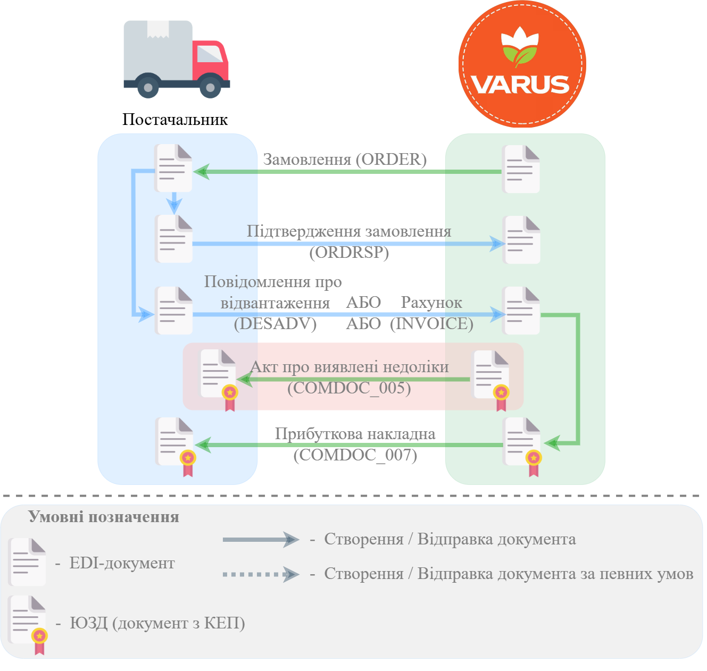

#############################################################################################################################
Документообіг з мережею "Варус" на платформі EDI Network 2.0. Інструкція для Постачальника
#############################################################################################################################

.. сюда закину немного картинок для текста

.. |bad_doc| image:: /general_2_0/pics_rabota_s_platformoj_EDIN_2.0/rabota_s_platformoj_066.png

.. |лупа| image:: /_constant/icons/magnifying_glass.png

.. |будинок| image:: /_constant/icons/house.png

.. role:: red

.. role:: green

.. role:: orange

.. role:: underline

.. contents:: Зміст:
   :depth: 5

---------

Вступ
====================================

Дана інструкція описує порядок документообігу з мережею "Варус" на платформі EDI Network 2.0. В документообігу приймають участь наступні документи:

- `Замовлення (ORDER) <https://wiki.edin.ua/uk/latest/EDIN_Specs/XML/ORDER_x.html>`__
- `Підтвердження замовлення (ORDRSP) <https://wiki.edin.ua/uk/latest/EDIN_Specs/XML/ORDRSP_x.html>`__
- `Рахунок (INVOICE) <https://wiki.edin.ua/uk/latest/EDIN_Specs/XML/INVOICE_x.html>`__
- `Повідомлення про відвантаження (DESADV) <https://wiki.edin.ua/uk/latest/EDIN_Specs/XML/DESADV_x.html>`__
- `Акт про виявлені недоліки (COMDOC_005) <https://wiki.edin.ua/uk/latest/EDIN_Specs/XML/COMDOC_005_x.html>`__
- `Прибуткова накладна (COMDOC_007) <https://wiki.edin.ua/uk/latest/EDIN_Specs/XML/COMDOC_007_x.html>`__

**Загальна схема документообігу:**

В цій схемі формування "Повідомлення про відвантаження" (DESADV) замість "Рахунку" (INVOICE) є пріоритетним для поставок в магазини.

1 Вхід на платформу
====================================

.. include:: /general_2_0/rabota_s_platformoj_EDIN_2.0.rst
   :start-after: .. початок блоку для Enter
   :end-before: .. кінець блоку для Enter

Після успішної авторизації відкриється основне меню, де у вкладці **"Продукти та рішення"** EDIN потрібно обрати сервіс **"EDI Network"**:

.. image:: /_constant/pics_landing/landing_edi.png
   :align: center

.. _ordrsp-create:

2 Створення та відправка «Підтвердження замовлення» (ORDRSP) на підставі вхідного «Замовлення» (ORDERS)
==============================================================================================================

.. include:: /retail_2.0/ORDRSP_na_EDI_Network.rst
   :start-after: .. початок блоку для Ordrsp_from_docs
   :end-before: .. кінець блоку для Ordrsp_from_docs

.. _invoice-create:

3 Створення та відправка "Рахунку" (INVOICE) на підставі вхідного «Замовлення» (ORDERS)
==================================================================================================================================

.. include:: /retail_2.0/formirovanie_otpravka_dokumenta_Schetfaktura_INVOICE_na_EDI_Network_2.0.rst
   :start-after: .. початок блоку для Invoice_from_Order
   :end-before: .. кінець блоку для Invoice_from_Order

4 Створення та відправка "Повідомлення про відвантаження" (DESADV) на підставі «Підтвердження замовлення» (ORDRSP)
==================================================================================================================================

.. include:: /retail_2.0/formirovanie_otpravka_dokumenta_Uvedomlenie_ob_otgruzke_DESADV_na_EDI_Network_2.0.rst
   :start-after: .. початок блоку для Desadv_from_Ordrsp
   :end-before: .. кінець блоку для Desadv_from_Ordrsp

Щоб сформувати "Повідомлення про відвантаження" (DESADV) на підставі "Підтвердження замовлення" (ORDRSP) Вам потрібно в меню сервісу **"EDI Network"** увійти в папку "Надіслані" і обрати "Підтвердження замовлення" (ORDRSP) (для зручності можливо скористатись `пошуком <https://wiki.edin.ua/uk/latest/general_2_0/rabota_s_platformoj_EDIN_2.0.html#doc-search>`__):

.. image:: /retail_2.0/pics_DESADV_na_EDI_Network_2.0/DESADV_na_EDI_Network_009.png
   :align: center

Потрібно відкрити надіслане "Підтвердження замовлення" (ORDRSP) лівою кнопкою миші та створити "Повідомлення про відвантаження" (DESADV) в блоці `ланцюжка документів <https://wiki.edin.ua/uk/latest/_constant/chain/chain.html>`__ за допомогою кнопки **"Створити документ"**:

.. image:: /retail_2.0/pics_DESADV_na_EDI_Network_2.0/DESADV_na_EDI_Network_010.png
   :align: center

У відкритій формі "Повідомлення про відвантаження" (DESADV) значна частина полів заповнюються автоматично з пов'язаного "Підтвердження замовлення" (ORDRSP) (обов'язкові до заповнення поля позначені червоною зірочкою :red:`*`):

.. image:: /retail_2.0/pics_DESADV_na_EDI_Network_2.0/DESADV_na_EDI_Network_011.png
   :align: center

Дані **Відправника** - це Ваші дані, що заповнюються автоматично і не підлягають редагуванню. Заповнити дані **Одержувача** можливо за допомогою кнопки **"Пошук контрагента"** (|лупа|).

.. hint::
   За допомогою кнопки **"Пошук контрагента"** (|лупа|) або ж за допомогою кнопки **"Вказати себе"** (|будинок|) можливо вказати чи змінити дані Покупця або Постачальника. Для пошуку введіть назву компанії, GLN або ІПН:

   .. image:: /retail_2.0/pics_formirovanie_ORDERS_na_EDI_Network_2.0/ORDERS_na_EDI_Network_2.0_024.png
      :align: center

Поля **Номер**, **Дата** документа, **Дата/час проведення доставки** заповнюються автоматично, але доступні до редагування за потреби. Дані **Постачальник**, **Покупець**, **Місце доставки**, **Кінцевий одержувач** також заповнюються автоматично - їх можливо редагувати за допомогою кнопок "Пошук контрагента" (|лупа|) чи "Вказати себе" (|будинок|).

Зверніть увагу! **Дата проведення доставки** не може бути раніше за поточну дату.

Автоматично вказується номер та дата "Замовлення" (ORDER), як початкового документа.

**За накладною №** - номер накладної.

.. important:: **Увага!** Номер накладної повинен повністю збігатися з номером оригіналу паперової накладної.

Блоки **Додаткова інформація** та **Транспортування** є необов'язковим до заповнення і "згорнуті" за замовчуванням. Блок **Разом** розраховується автоматично за табличними даними.

**Товарні позиції** переносяться з "Замовлення". Можливо коригувати значення **Кількість, що постачається**, **Ціна без ПДВ**, **Ціна з ПДВ** (підраховується автоматично) та **Ставка ПДВ** прямо в таблиці чи **"Змінити"** "Дані позиції" в розширеній формі після натискання на штрих-код позиції:

.. image:: /retail_2.0/pics_DESADV_na_EDI_Network_2.0/DESADV_na_EDI_Network_004.png
   :align: center

:red:`Всі зміни за позиціями потребують узгодження з Вашим Контрагентом!`

.. important:: **Увага!** У разі створення **кількох** видаткових накладних на замовлення, необхідно на кожну накладну формувати **Повідомлення про відвантаження**. При цьому, поле «**За накладною №**» в документах повинно відрізнятися.

Якщо якась із позицій відсутня і поставлятися не буде, її необхідно відзначити галочкою і **"Видалити"**:

.. image:: /retail_2.0/pics_DESADV_na_EDI_Network_2.0/DESADV_na_EDI_Network_005.png
   :align: center

Можливо також **"+Додати"** іншу позицію з вашого `"Товарного довідника" <https://wiki.edin.ua/uk/latest/general_2_0/Directories.html>`__, заповнивши форму (обов'язкові до заповнення поля позначені червоною зірочкою :red:`*`):

.. image:: /retail_2.0/pics_DESADV_na_EDI_Network_2.0/DESADV_na_EDI_Network_006.png
   :align: center

Після цього можна за необхідності прикріпити Сертифікати на товари, наявні в даній накладній (для використання цієї опції Ваша компанія має бути підписана на користування сервісом Е-Сертифікати). Для додавання сертифікатів до створеної видаткової накладної натисніть кнопку «**Прикріпити сертифікати**» та в з'явившомуся вікні «Обрати сертифікат» скористайтесь пошуком, щоб знайти потрібні сертифікати:

.. image:: /retail_2.0/pics_DESADV_na_EDI_Network_2.0/DESADV_na_EDI_Network_012.png
   :align: center

Пошук здійснюється автоматично в опублікованих Вами сертифікатах, в сервісі Е-Сертифікати:

* По номеру сертифіката,

* По прив'язаним товарам (товари, зазначені в повідомленні про відвантаження та в Сертифікаті, мають співпадати),

* По номеру партії.

.. important:: **Увага!** При відправці повідомлення про відвантаження з прикріпленим сертифікатом автоматично заповнюються дані по обраним Сертифікатам: 
   
   * вкладка “Пов'язані відвантаження”
   * вкладка “Пов'язані товари”, по сертифіктах “Декларація виробника”, “Посвідчення/сертифікат якості”

Оберіть потрібні сертифікати в результатах пошуку та натисніть кнопку «**Зберегти**»:

.. image:: /retail_2.0/pics_DESADV_na_EDI_Network_2.0/DESADV_na_EDI_Network_013.png
   :align: center

Якщо в картці обраного сертифікату зазначено обмежений доступ, система перевірить наявність GLN отримувача повідомлення про відвантаження в правах перегляду цього сертифікату. В разі відсутності GLN отримувача повідомлення про відвантаження буде додано туди автоматично.

Після внесення всіх даних потрібно **"Зберегти"** (1) документ, після чого його можливо **"Відправити"** (2):

.. image:: /retail_2.0/pics_DESADV_na_EDI_Network_2.0/DESADV_na_EDI_Network_007.png
   :align: center

Після збереження документ можливо знайти в папці **"Чернетки"**. Відправлений документ автоматично потрапляє в папку **"Надіслані"** і буде знаходиться в ланцюжку документів разом із попередніми документами:

.. image:: /retail_2.0/pics_DESADV_na_EDI_Network_2.0/DESADV_na_EDI_Network_008.png
   :align: center

.. _comdoc-005-processing:

5 Обробка вхідного "Акта про виявлені недоліки" (COMDOC_005)
==================================================================================================================================

.. note::
   "Акт про виявлені недоліки" (COMDOC_005) може відправлятися зі сторони мережі за потреби зазначення причини повернення товарів, що були доставлені в рамках ланцюжка поставки та коригування документів поставки.

Для обробки "Акта про виявлені недоліки" (COMDOC_005) в сервісі "EDI Network" потрібно перейти у **"Вхідні"** та вибрати **"Акт про виявлені недоліки"** в статусі :orange:`"Очікує на підписання отримувачем"` (для зручності можливо скористатись рядком `пошуку <https://wiki.edin.ua/uk/latest/general_2_0/rabota_s_platformoj_EDIN_2.0.html#doc-search>`__):

.. image:: /ClientProcesses/Varus/Varus_Instructions/pics_Varus_EDI/Varus_EDI_002.png
   :align: center

Відкриється форма документа, де Ви зможете ознайомитись з документом. Якщо Ви згодні продовжити документообіг, потрібно **"Підписати"** вхідний документ:

.. image:: /ClientProcesses/Varus/Varus_Instructions/pics_Varus_EDI/Varus_EDI_003.png
   :align: center

.. hint::
   Процес підписання є типовим на платформі EDI Network та описаний в `розділі нижче <https://wiki.edin.ua/uk/latest/ClientProcesses/Varus/Varus_Instructions/Varus_EDI.html#sign>`__.

Після підписання документ змінює свій статус на :green:`"Підписано двома сторонами"`.

.. note::
   Для того, щоб **Відхилити** "Акт про виявлені недоліки" (COMDOC_005) можливо оформити типову для комерціних документів **"Відмову від підписання"** (`детальніше <https://wiki.edin.ua/uk/latest/_constant/comdoc_reject/comdoc_reject.html>`__):

   .. image:: /ClientProcesses/Varus/Varus_Instructions/pics_Varus_EDI/Varus_EDI_004.png
      :align: center

.. _comdoc-007-processing:

6 Обробка вхідної "Прибуткової накладної" (COMDOC_007)
==================================================================================================================================

Для обробки "Прибуткової накладної" (COMDOC_007) в сервісі "EDI Network" потрібно перейти у **"Вхідні"** та вибрати **"Прибуткова накладна"** в статусі :orange:`"Очікує на підписання отримувачем"` (для зручності можливо скористатись рядком `пошуку <https://wiki.edin.ua/uk/latest/general_2_0/rabota_s_platformoj_EDIN_2.0.html#doc-search>`__):

.. image:: /ClientProcesses/Varus/Varus_Instructions/pics_Varus_EDI/Varus_EDI_005.png
   :align: center

Відкриється форма документа, де Ви зможете ознайомитись з документом. Якщо Ви згодні з документом, його потрібно **"Підписати"**:

.. image:: /ClientProcesses/Varus/Varus_Instructions/pics_Varus_EDI/Varus_EDI_006.png
   :align: center

.. hint::
   Процес підписання є типовим на платформі EDI Network та описаний в `розділі нижче <https://wiki.edin.ua/uk/latest/ClientProcesses/Varus/Varus_Instructions/Varus_EDI.html#sign>`__.

Після підписання документ змінює свій статус на :green:`"Підписано двома сторонами"`.

.. note::
   Для того, щоб **Відхилити** "Прибуткову накладну" (COMDOC_007) можливо оформити типову для комерціних документів **"Відмову від підписання"** (`детальніше <https://wiki.edin.ua/uk/latest/_constant/comdoc_reject/comdoc_reject.html>`__):

   .. image:: /ClientProcesses/Varus/Varus_Instructions/pics_Varus_EDI/Varus_EDI_007.png
      :align: center

.. hint::
   Також після підписання документа (документ підписаний з обох сторін в статусі :green:`"Підписано двома сторонами"`) за згодою сторін можливо відправити **"Запит на анулювання"** документа (`детальніше <https://wiki.edin.ua/uk/latest/_constant/comdoc_repeal/comdoc_repeal.html>`__):

   .. image:: /ClientProcesses/Varus/Varus_Instructions/pics_Varus_EDI/Varus_EDI_008.png
      :align: center

   Ініціатором анулювання може виступати, як Мережа так і Постачальник.

------------------------------------------------------

.. _sign:

Підписання на платформі EDIN 2.0
=========================================================================================================================

.. include:: /_constant/atb_check/atb_check.rst
   :start-after: .. початок блоку для ATB_check
   :end-before: .. кінець блоку для ATB_check

.. tabs::

   .. tab:: Файловий ключ

      .. include:: /_constant/signing/signing.rst
         :start-after: .. початок блоку для Signing
         :end-before: .. кінець блоку для Signing

   .. tab:: Token

      .. include:: /_constant/token_signing/token_signing.rst
         :start-after: .. початок блоку для TokenSign
         :end-before: .. кінець блоку для TokenSign

   .. tab:: Гряда

      .. include:: /_constant/gryada_signing/gryada_signing.rst
         :start-after: .. початок блоку для GryadaSign
         :end-before: .. кінець блоку для GryadaSign

   .. tab:: Cloud

      .. include:: /_constant/cloud_signing/cloud_signing.rst
         :start-after: .. початок блоку для CloudSign
         :end-before: .. кінець блоку для CloudSign

-------------------------------------

.. include:: /_constant/kontakti.rst
