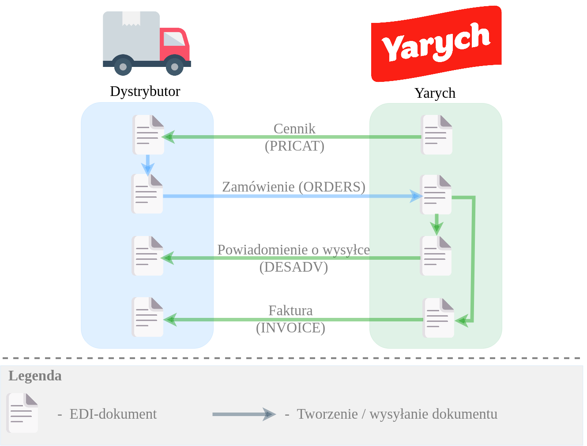

##################################################################################################################
Документообіг з "Yarych"
##################################################################################################################

.. сюди закину трохи картинок для тексту

.. role:: red

.. contents:: Зміст:
   :depth: 2

---------

**Вступ**
=========

**Маркет** — це комплексне електронне рішення, яке оптимізує процеси обміну електронними даними між Продавцями (Виробниками) та Покупцями (Дистриб’юторами). Інструкція описує додавання та редагування прайс-листа, обмежень та квот, перегляд списку Покупців (Дистриб'юторів) та замовлень.

Загальна схема документообігу:

.. _enter:

**1 Вхід на платформу та сервіс "Меркет"**
==============================================

.. include:: /general_2_0/rabota_s_platformoj_EDIN_2.0.rst
   :start-after: .. початок блоку для Enter
   :end-before: .. кінець блоку для Enter

Після успішної авторизації відкриється основне меню, де у вкладці **"Продукти та рішення"** EDIN потрібно обрати сервіс **Маркет**:

.. image:: /_constant/pics_landing/landing_distribution.png
   :align: center

.. _price-add:

**2 Вивантаження / відправка "Прайс-листа" (PRICAT) (Виробник "Yarych")**
================================================================================

.. include:: /Distribution/EDIN_2_0/Instructions_2_0/Instruktsiia_dlia_vyrobnyka.rst
   :start-after: .. початок блоку для Pricat_Add1
   :end-before: .. кінець блоку для Pricat_Add1

.. include:: /Distribution/EDIN_2_0/Instructions_2_0/Instruktsiia_dlia_vyrobnyka.rst
   :start-after: .. початок блоку для Pricat_Add2
   :end-before: .. кінець блоку для Pricat_Add2

**3 Створення Замовлення за Прайс-листом (Покупець (Дистриб'ютор))**
================================================================================

**3.1 Перегляд списку Виробників**
-------------------------------------------

.. note::
   Вхід на платформу та сервіс "Меркет" описано в `першому розділі інструкції <https://wiki.edin.ua/uk/latest/ClientProcesses/Yarych/Yarych_Instructions/Yarych_full_flow.html#enter>`__

.. include:: /Distribution/EDIN_2_0/Instructions_2_0/Instruktsiia_dlia_dystrybiutora.rst
   :start-after: .. початок блоку для Order_create1
   :end-before: .. кінець блоку для Order_create1

**3.2 Перегляд прайс-листа Виробника**
-------------------------------------------

.. include:: /Distribution/EDIN_2_0/Instructions_2_0/Instruktsiia_dlia_dystrybiutora.rst
   :start-after: .. початок блоку для Order_create2
   :end-before: .. кінець блоку для Order_create2

**3.3 Створення Замовлення за Прайс-листом**
----------------------------------------------------------

.. include:: /Distribution/EDIN_2_0/Instructions_2_0/Instruktsiia_dlia_dystrybiutora.rst
   :start-after: .. початок блоку для Order_create3
   :end-before: .. кінець блоку для Order_create3

**4 Вхід на платформу та сервіс "EDI Network"**
========================================================

.. include:: /general_2_0/rabota_s_platformoj_EDIN_2.0.rst
   :start-after: .. початок блоку для Enter
   :end-before: .. кінець блоку для Enter

Після успішної авторизації відкриється основне меню, де у вкладці **"Продукти та рішення"** EDIN потрібно обрати сервіс **"EDI Network"**:

.. image:: /_constant/pics_landing/landing_edi.png
   :align: center

**5 Створення «Повідомлення про відвантаження» (DESADV) на підставі вхідного «Замовлення» (ORDER) (Виробник "Yarych")**
=================================================================================================================================

.. include:: /retail_2.0/formirovanie_otpravka_dokumenta_Uvedomlenie_ob_otgruzke_DESADV_na_EDI_Network_2.0.rst
   :start-after: .. початок блоку для Desadv_from_Order
   :end-before: .. кінець блоку для Desadv_from_Order

**6 Створення «Рахунку» (INVOICE) на підставі вхідного «Замовлення» (ORDER) (Виробник "Yarych")**
==================================================================================================================

.. include:: /retail_2.0/formirovanie_otpravka_dokumenta_Schetfaktura_INVOICE_na_EDI_Network_2.0.rst
   :start-after: .. початок блоку для INVOICE_standart
   :end-before: .. кінець блоку для INVOICE_standart

-------------------------------------

.. include:: /_constant/kontakti.rst