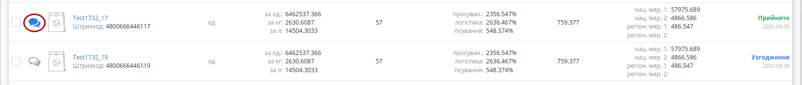
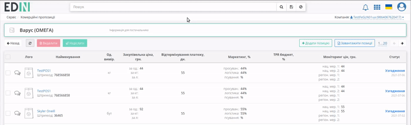

Комерційні пропозиції для Роздрібної Мережі
###############################################################################

.. раніше КП були частиною Е-спек

.. сюда закину немного картинок для текста

.. |non| image:: pics_Commercial_offers/Commercial_offers_005.png

.. |лупа| image:: pics_Commercial_offers/Commercial_offers_004.png

.. role:: red

.. role:: green

.. role:: blue

.. role:: orange

.. role:: underline

---------

.. contents:: Зміст:
   :depth: 3

---------

**Вступ**
===================================

Сервіс **"Комерційні пропозиції"** доступний на стороні **Покупця** (мережі) та **Постачальника**. Для початку роботи серед доступних сервісів потрібно вибрати **"Комерційні пропозиції"**:

.. image:: /E_SPEC/EDIN_2_0/Instructions_2_0/pics_E_Spec_Instruction_merezha/E_Spec_Instruction_merezha_24.png
   :align: center

.. hint::
   Шлях зміни статусів пропозицій: "Чернетка" -> :blue:`"Узгодження"` -> :green:`"Прийнято"`/ :red:`"Відхилено"`

**Робота з комерційними пропозиціями**
=====================================================

При переході в **"Комерційні пропозиції"** відкривається журнал з пропозиціями. **Постачальники** відправляють позиції на узгодження, а представник Мережі проводить їх узгодження: із загального списку обирає позиції в статусі :blue:`"Узгодження"` та прийняти рішення (масово **"Відхилити"** чи **"Прийняти"**) по обраним позиціям:

.. image:: /E_SPEC/EDIN_2_0/Instructions_2_0/pics_E_Spec_Instruction_merezha/E_Spec_Instruction_merezha_25.png
   :align: center

Також можливо детальніше ознайомитись з пропозицією (перехід через її найменування) і одразу **"Прийняти"** чи **"Відхилити"** ту позицію:

.. image:: /E_SPEC/EDIN_2_0/Instructions_2_0/pics_E_Spec_Instruction_merezha/E_Spec_Instruction_merezha_14.gif
   :align: center

.. admonition:: Прийняття пропозиції:

   після натискання кнопки **"Прийняти"** (1) в модальному вікні можливо додати коментар (необов'язково) і підтвердити рішення (2):

   .. image:: /E_SPEC/EDIN_2_0/Instructions_2_0/pics_E_Spec_Instruction_merezha/E_Spec_Instruction_merezha_20.png
      :align: center

   Після прийняття рішення статус позиції автоматично оновлюється з :blue:`"Узгодження"` -> на :green:`"Прийнято"` + може відображатись опціональний коментар для **Постачальника**, де також вказується користувач **Мережі**, дата/час рішення:

   .. image:: /E_SPEC/EDIN_2_0/Instructions_2_0/pics_E_Spec_Instruction_merezha/E_Spec_Instruction_merezha_21.png
      :align: center

---------------------------------------------------------

.. admonition:: Відхилення пропозиції:

   після натискання кнопки **"Відхилити"** (1) в модальному вікні потрібно необов'язково вказати причину (2) і підтвердити рішення (3):

   .. image:: /E_SPEC/EDIN_2_0/Instructions_2_0/pics_E_Spec_Instruction_merezha/E_Spec_Instruction_merezha_22.png
      :align: center

   Після прийняття рішення статус позиції автоматично оновлюється з :blue:`"Узгодження"` -> на :red:`"Відхилено"`,відображається коментар (причина відхилення) для **Постачальника**, де також вказується користувач **Мережі**, дата/час рішення:

   .. image:: /E_SPEC/EDIN_2_0/Instructions_2_0/pics_E_Spec_Instruction_merezha/E_Spec_Instruction_merezha_23.png
      :align: center

.. attention::
   При прийнятті масового рішення по пропозиціям коментар присвоюється до кожної пропозиції.

В журналі комерційних пропозицій при наявному коментарі від мережі відображається зафарбована іконка - |comment1| (при відсутності коментарів - |comment0|):

.. hint::
   Користувачі можуть отримувати повідомлення на ел. пошту про зміну статуса відправленої новинки. Для налаштувань такої опції потрібно звертутись до співробітників компанії-провайдера.

Якщо у **Покупця** (мережі) налаштовані повідомлення на ел. пошту, то він буде проінформований про новинки, навіть не заходячи до сервісу.

Повідомлення про отримання однієї комерційної пропозиції:

Повідомлення про отримання кількох комерційних пропозицій (масова відправка на стороні Постачальника):

**Пошук**
---------------------------------------------------------

Функціональне поле **"Пошуку"** використовує наступні Доступні для пошуку ключі:

Можливо обрати параметр зі списку/підказки чи почати вводити пошукове значення (система автоматично вкаже на можливі параметри): 

Після введення значення потрібно натиснути кнопку |лупа| для пошуку. Очищення рядка **"Пошуку"** відбувається за допомогою кнопки **"Скинути фільтри"** |non|.

При складному пошуку усі параметри повині бути розділені комами, наприклад, ``Штрихкод: 768566858, #Прийнято``:

Для зручності пошуку пропозицій за категорією додатково винесено кнопку **"Фільтр по категоріям"**:

----------------------------------

.. include:: /_constant/kontakti.rst
