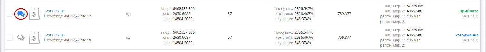
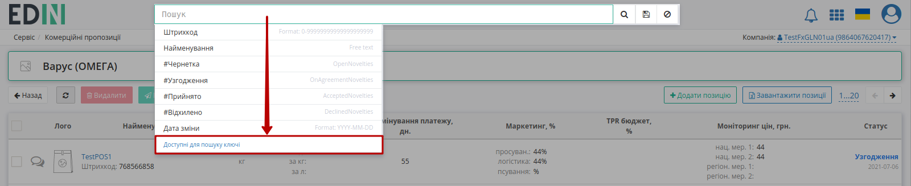
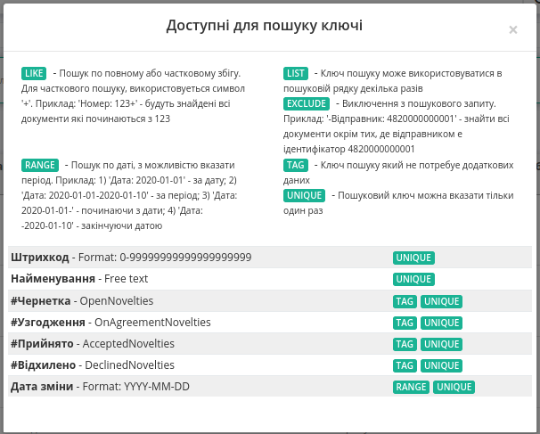
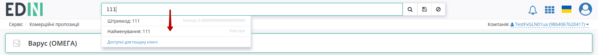
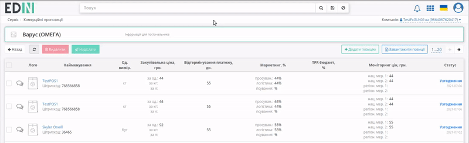
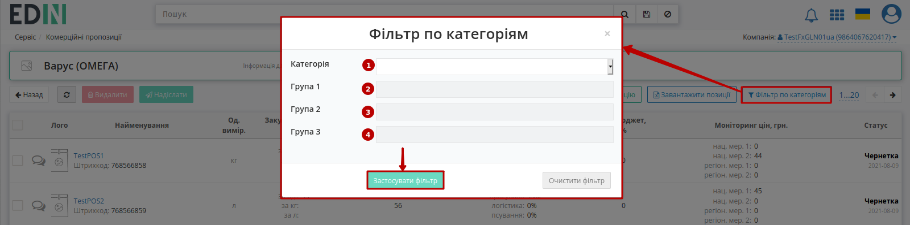
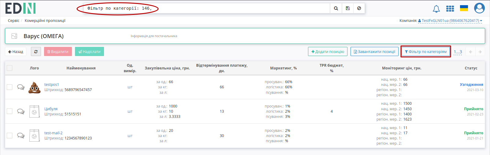

Комерційні пропозиції для Постачальника
###############################################################################

.. раніше КП були частиною Е-спек

.. сюда закину немного картинок для текста

.. |non| image:: pics_Commercial_offers/Commercial_offers_005.png

.. |лупа| image:: pics_Commercial_offers/Commercial_offers_004.png

.. role:: red

.. role:: green

.. role:: blue

.. role:: orange

.. role:: underline

---------

.. contents:: Зміст:
   :depth: 3

---------

**Вступ**
===================================

Сервіс **"Комерційні пропозиції"** доступний на стороні **Покупця** (мережі) та **Постачальника**.

Для початку роботи серед доступних сервісів потрібно вибрати **"Комерційні пропозиції"**:

.. image:: /E_SPEC/EDIN_2_0/Instructions_2_0/pics_E_Spec_Іnstruction_postachalnik/E_Spec_Іnstruction_postachalnik_60.png
   :align: center

.. hint::
   Шлях зміни статусів пропозицій: "Чернетка" -> :blue:`"Узгодження"` -> :green:`"Прийнято"`/ :red:`"Відхилено"`

**Робота з комерційними пропозиціями**
=====================================================

Для роботи з пропозиціями **Постачальнику** потрібно обрати Мережу:

.. image:: /E_SPEC/EDIN_2_0/Instructions_2_0/pics_E_Spec_Іnstruction_postachalnik/E_Spec_Іnstruction_postachalnik_61.png
   :align: center

Після чого відкриється журнал комерційних пропозицій, окрім перегляду пропозицій (перехід через **"Найменування"** пропозиції) передбачене:

1. Масове **"Видалення"** раніше створених комерційних пропозицій. Функціонал видалення також присутній при безпосередньому перегляді позиції.
2. Масове **"Надсилання"** раніше створених комерційних пропозицій. Функціонал надсилання також присутній при безпосередньому перегляді позиції.
3. **"Додавання нової позиції"**.
4. Масове **"Завантаження позиції"** з Excell файлу.

.. image:: /E_SPEC/EDIN_2_0/Instructions_2_0/pics_E_Spec_Іnstruction_postachalnik/E_Spec_Іnstruction_postachalnik_49.png
   :align: center

При масовому видаленні чи надсиланні комерційних пропозицій їх спочатку потрібно обрати (відмітити галочкою), як показано на зображенні вище.

При редагуванні чи **"Додаванні позиції"** відкривається вікно даних товару. Для збереження позиції потрібно заповнити всі обов'язкові поля позначні червоною зірочкою :red:`*` , послідовно вказавши **"Категорію"** -> **"Групу 1"** -> **"Групу 2"** -> **"Групу 3"** та натиснути **"Зберегти"** / **"Зберегти та створити ще"**:

.. image:: /E_SPEC/EDIN_2_0/Instructions_2_0/pics_E_Spec_Іnstruction_postachalnik/E_Spec_Іnstruction_postachalnik_62.png
   :align: center

Також обов'язково вказуються контакти Постачальника (повторно заповнюються автоматично за прізвищем).

.. note::
   При створенні товарної позиції (Чернетка) замість стандартного лого можливо завантажити фото товару максимальним розміром зображення 5 МБ (JPEG/JPG, PNG).

Масове **"Завантаження позицій"** з Excell файлу потрібно здійснювати згідно шаблону (обов'язкові колонки шаблону відмічені зеленим кольором з підказками), послідовно вказавши **"Категорію"** -> **"Групу 1"** -> **"Групу 2"** -> **"Групу 3"**, до яких будуть належати всі завантажені комерційні позиції:

.. image:: /E_SPEC/EDIN_2_0/Instructions_2_0/pics_E_Spec_Іnstruction_postachalnik/E_Spec_Іnstruction_postachalnik_63.png
   :align: center

.. note::
    В разі некоректного заповненого Excell документу файл не буде завантажено, а платформа повідомить про помилки повідомленням:

    .. image:: /E_SPEC/EDIN_2_0/Instructions_2_0/pics_E_Spec_Іnstruction_postachalnik/E_Spec_Іnstruction_postachalnik_52.png
       :align: center

Після **"Надсилання"** позицій на стороні **Покупця** (мережі) вони проходить узгодження (статус позицій оновлюється автоматично). :red:`"Відхилені"` пропозиції обов'язково містять коментар-причину відхилення (:green:`"Прийняті"` пропозиції також можуть містити необов'язковий коментар, якщо Мережа вирішить його додати):

.. image:: /E_SPEC/EDIN_2_0/Instructions_2_0/pics_E_Spec_Іnstruction_postachalnik/E_Spec_Іnstruction_postachalnik_58.png
   :align: center

.. image:: /E_SPEC/EDIN_2_0/Instructions_2_0/pics_E_Spec_Іnstruction_postachalnik/E_Spec_Іnstruction_postachalnik_59.png
   :align: center

В журналі комерційних пропозицій при наявному коментарі від мережі відображається зафарбована іконка - |comment1| (при відсутності коментарів - |comment0|):

.. hint::
   Користувачі можуть отримувати повідомлення на ел. пошту про зміну статуса відправленої новинки. Для налаштувань такої опції потрібно звертутись до співробітників компанії-провайдера.

**Пошук**
---------------------------------------------------------

Функціональне поле **"Пошуку"** використовує наступні Доступні для пошуку ключі:

Можливо обрати параметр зі списку/підказки чи почати вводити пошукове значення (система автоматично вкаже на можливі параметри): 

Після введення значення потрібно натиснути кнопку |лупа| для пошуку. Очищення рядка **"Пошуку"** відбувається за допомогою кнопки **"Скинути фільтри"** |non|.

При складному пошуку усі параметри повині бути розділені комами, наприклад, ``Штрихкод: 768566858, #Прийнято``:

Для зручності пошуку пропозицій за категорією додатково винесено кнопку **"Фільтр по категоріям"**:

----------------------------------

.. include:: /_constant/kontakti.rst