Комерційна пропозиція для Постачальника
###############################################################################

.. раніше КП були частиною Е-спек

.. сюда закину немного картинок для текста

.. |non| image:: pics_Commercial_offers/Commercial_offers_005.png

.. |лупа| image:: pics_Commercial_offers/Commercial_offers_004.png

.. role:: red

.. role:: green

.. role:: blue

.. role:: orange

.. role:: underline

---------

.. contents:: Зміст:
   :depth: 3

---------

**Вступ**
===================================

Сервіс **"Комерційна пропозиція"** доступний на стороні **Покупця** (**Мережі**) та **Постачальника**.

Для початку роботи серед доступних сервісів потрібно вибрати **"Комерційна пропозиція"**:

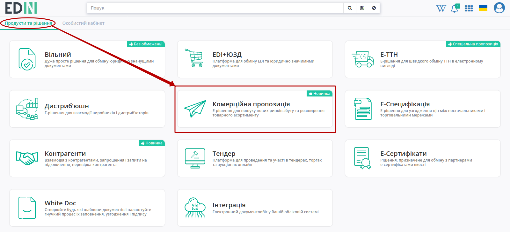

Бокове меню сервісу **"Комерційна пропозиція"** дозволяє переглядати **Всі** / **Важливі** / **Оброблені** "Комерційні пропозиції":

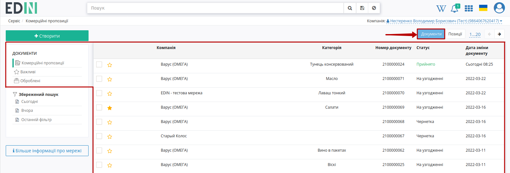

**"Важливими"** є всі комерційні пропозиції, що були відмічені заповненою зірочкою (|star|):

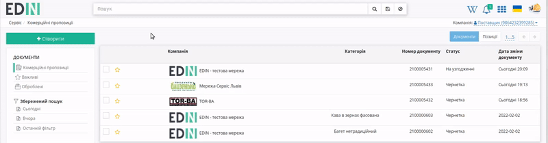

.. поки не реалізовано **Оброблені** - комерційні пропозиції, що були перенесені користувачем; в "Оброблені" можуть бути перенесені комерційні пропозиції лише в кінцевому статусі ("Прийнято" / "Відхилено").

Для того аби переглянути всі Ваші товарні позиції потрібно переключити відображення - кнопка **"Позиції"**:

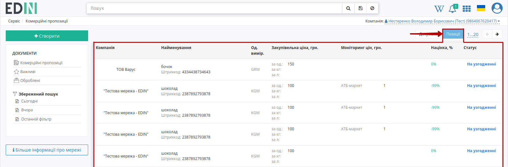

.. note::
   В цій вкладці при переході до деталей товарної позиції відкривається комерційна пропозиція, що містить обрану товарну позицію.

**Постачальнику** для того, щоб почати роботу з мережами потрібно подати заявку. Список мереж, доступний до підключення доступний при переході за допомогою кнопки **"Більше інформації про мережі"**:

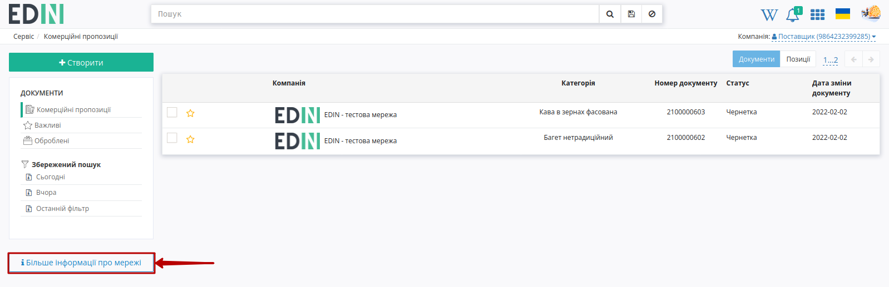

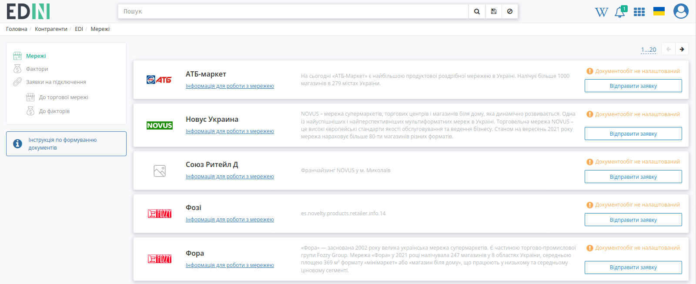

.. hint::
   Опис алгоритму подачі заявки доступний за `посиланням <https://wiki.edin.ua/uk/latest/Personal_Cabinet/PCInstruction.html#counterparties>`__.

.. _commercial-offer:

**1 Створення та відправка комерційної пропозиції**
=====================================================

Для створення комерційної пропозиції потібно натиснути **"Створити"**:

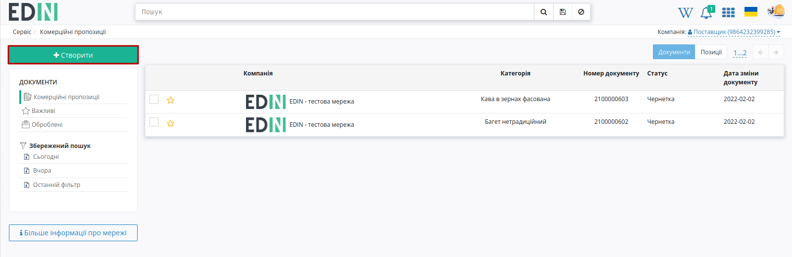

Після чого відкриється форма документа для заповнення:

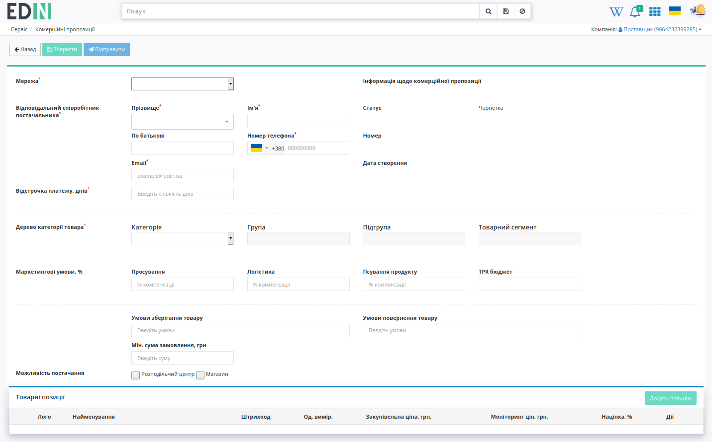

Для початку **Постачальнику** потрібно обрати **Мережу** після чого стає можливо **"Зберегти"** даний документ! 

.. note::
   Після першого **"Зберігання"** комерційної пропозиції її присвоюється номер та дата створення, з'являється можливість **"Додати позицію"**. Редагування комерційної пропозиції можливе поки вона перебуває у статусі "Чернетка".

   .. image:: pics_Commercial_offers/Commercial_offers_029.gif
      :align: center

Далі необхідно заповнити всі обов'язкові поля (позначні червоною зірочкою :red:`*`):

* вказати контакти **Постачальника** (додати новий контакт чи обрати за прізвищем вказаний раніше контакт):

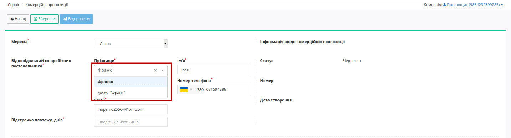

* кількість днів відстрочки платежу;
* послідовно вказати **"Категорію"** -> **"Групу"** -> **"Підгрупу"** -> **"Товарний сегмент"**. 

Після того, як чернетка комерційної пропозиції буде збережена можливо **"Додати позицію"**, заповнити форму **"Інфомації про товар"** (обов'язкові поля позначні червоною зірочкою :red:`*`)  та **"Додати товар"** до комерційної пропозицї:

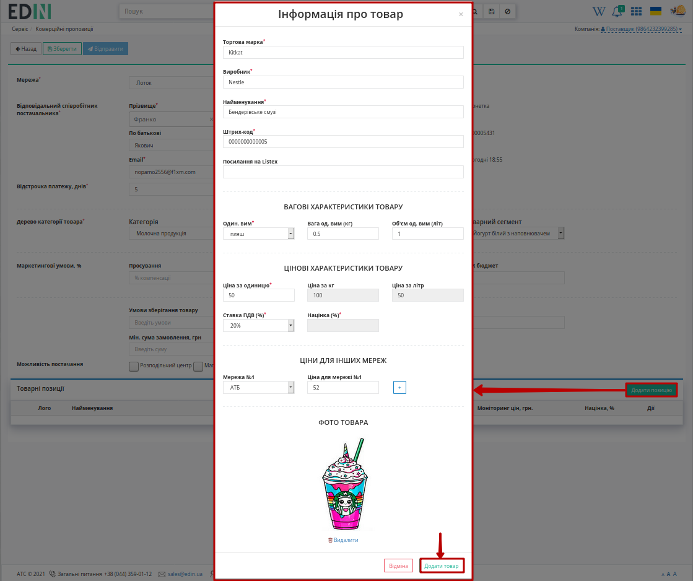

.. note::
   При створенні товарної позиції (Чернетка) замість стандартного лого можливо завантажити фото товару максимальним розміром зображення 5 МБ (JPEG/JPG, PNG).

Додані товарні позиції:

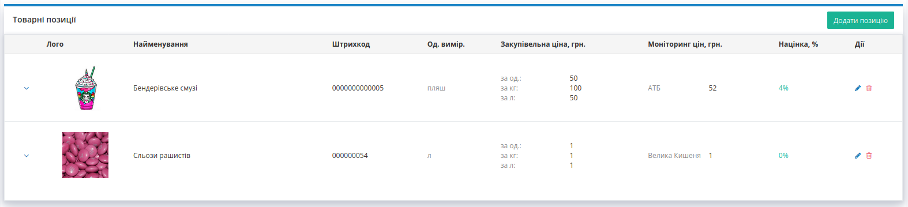

Додаткову інформацію за товарними позиціями можливо переглянути/приховати за допомогою |show| / |hide| кнопок відповідно. Додані товарні позиції можливо **"Редагувати"** (|edit|) чи **"Видалити"** (|del|). При редагуванні відкривається раніше заповнена форма **"Інфомації про товар"**.

--------------------------------------------------------

Після того, як всі обов'язкові поля комерційної пропозиції будуть заповнені її можливо **"Відправити"**:

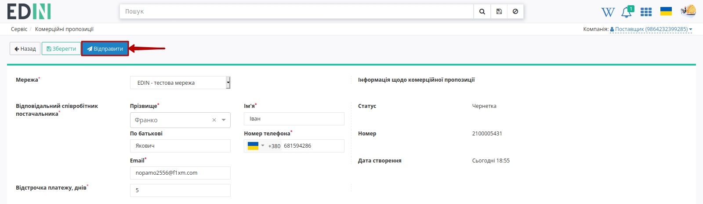

Відправлена комерційна пропозиція змінює свій статус на **"На узгодженні"**:

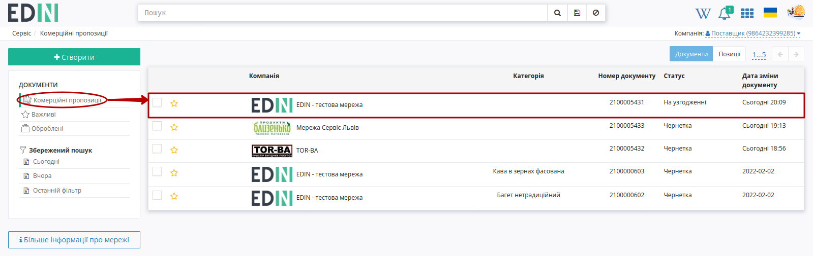

.. hint::
   Шлях зміни статусів Комерціних пропозицій: "Чернетка" -> :blue:`"На узгодженні"` -> :green:`"Прийнято"`/ :red:`"Відхилено"`

Після відправки пропозиції на стороні **Покупця** (**Мережі**) позиції проходить узгодження (статус позицій оновлюється автоматично). :red:`"Відхилені"` пропозиції обов'язково містять коментар-причину відхилення (:green:`"Прийняті"` пропозиції також можуть містити необов'язковий коментар, якщо **Мережа** вирішить його додати):

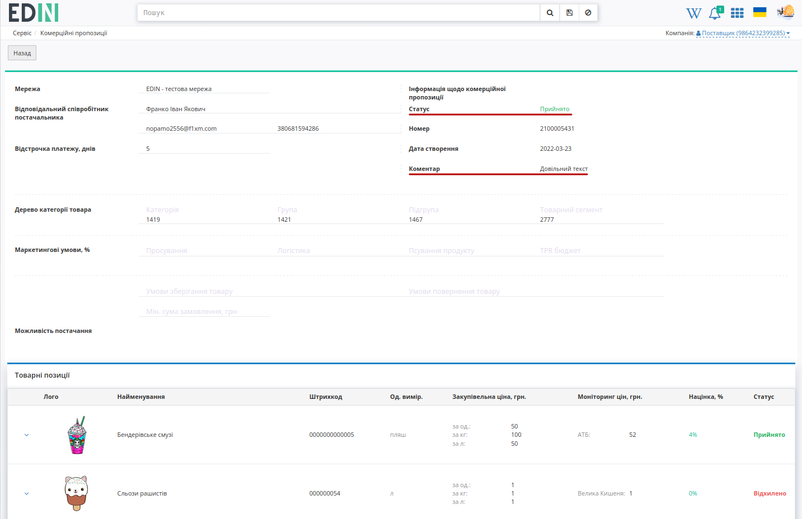

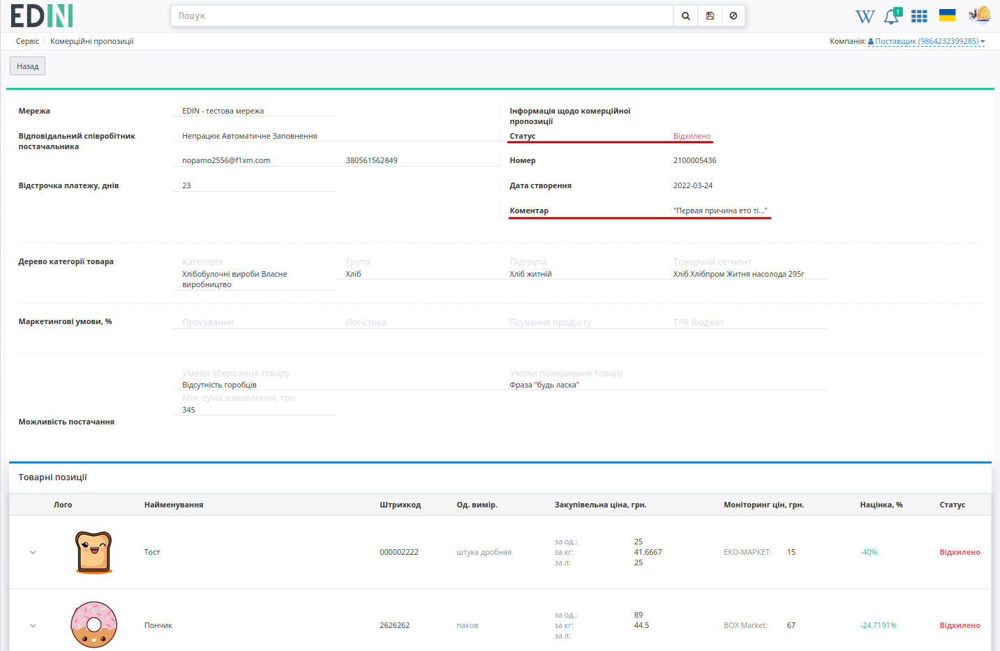

.. колись був такий функціонал   В журналі комерційних пропозицій при наявному коментарі від мережі відображається зафарбована іконка - |comment1| (при відсутності коментарів - |comment0|):

   .. image:: pics_Commercial_offers/Commercial_offers_003.png
      :align: center

   .. hint::
      Користувачі можуть отримувати повідомлення на ел. пошту про зміну статуса відправленої новинки. Для налаштувань такої опції потрібно звертутись до співробітників компанії-провайдера.

**Додатковий функціонал**
=====================================================

**Пошук**
------------------------------

Функціональне поле **"Пошуку"** використовує наступні Доступні для пошуку ключі:

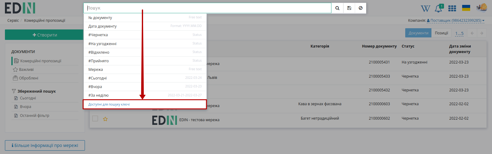

В залежності від того, який журнал відкрито (**Документи** чи **Позиції**) ключі пошуку будуть відрізнятись:

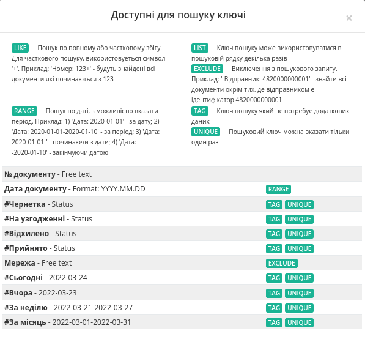

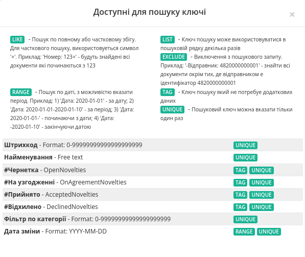

Можливо обрати параметр зі списку/підказки чи почати вводити пошукове значення (система автоматично вкаже на можливі параметри): 

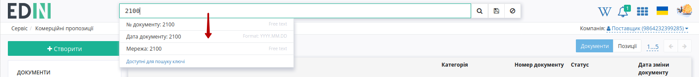

Після введення значення потрібно натиснути кнопку |лупа| для пошуку. Очищення рядка **"Пошуку"** відбувається за допомогою кнопки **"Скинути фільтри"** |non|.

При складному пошуку усі параметри повині бути розділені комами, наприклад, ``Мережа: EDIN - тестова мережа, #Чернетка``:

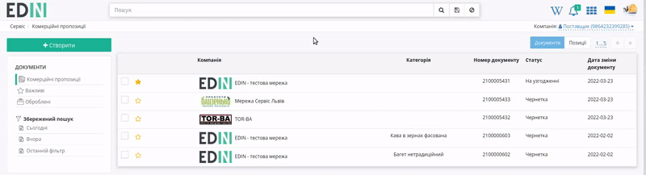

----------------------------------

.. include:: /_constant/kontakti.rst