#################################################################################
Робота з додатком "EDIN Market"
#################################################################################

.. role:: green

.. role:: navy

.. role:: red

.. role:: orange

.. картинки:

.. |android_logo| image:: /_constant/icons/android_logo.png
                  :height: 20px

.. |google-play| image:: /_constant/icons/google-play.png
                  :height: 35px
                  :target: https://play.google.com/store/apps/details?id=org.edin.edinMarket

.. |apple_logo| image:: /_constant/icons/apple_logo.png
                  :height: 30px

.. |app-store| image:: /_constant/icons/app-store.png
                  :height: 35px
                  :target: https://apps.apple.com/ua/app/edin-driver-signing-waybill/id1658986357

.. |filter_app| image:: /_constant/icons/filter_app.png

.. |trash_app| image:: /_constant/icons/trash_app.png

.. |up_app| image:: /_constant/icons/up_app.png

.. |clock| image:: /_constant/icons/clock.png

.. |edit_app| image:: /_constant/icons/edit_app.png

.. |user_app| image:: /_constant/icons/user_app.png

.. |diskette| image:: /_constant/icons/diskette.png

.. contents:: Зміст:
   :depth: 4

---------

Вступ
==========================

Для роботи в сервісі **Маркет** (ex **Дистриб’юшн**) та звичному обміну електронними документами між Продавцями (Виробниками) та Покупцями (Дистриб’юторами) прямо з Вашого мобільного/планшета був розроблений додаток **"EDIN Market"**. Додаток доступний в крамницях застосунків **"Google Play Market"** (Android) та **"Apple App Store"** (iOS). Дана інструкція описує метод встановлення додатку, налаштування, формування документа `Замовлення (ORDERS) <https://wiki.edin.ua/uk/latest/Distribution/EDIN_2_0/XML/ORDER_x.html>`__ за `Прайс-листом (PRICAT) <https://wiki.edin.ua/uk/latest/Distribution/EDIN_2_0/XML/PRICAT_x.html>`__ та інші функціональні можливості.

.. note::
   Користуватись додатком можуть лише `зареєстровані <https://wiki.edin.ua/uk/latest/general_2_0/User_registration.html#register>`__ користувачі платформи **"EDI Network"** (вже мають **Логін** та **Пароль**). 

.. _app-install:

1 Встановлення та вхід в додаток **"EDIN Market"**
============================================================

.. tabs::

   .. tab:: |android_logo| На "Android"

      Для встановлення додатка **"EDIN Market"** натисніть на кнопку |google-play| чи самостійно знайдіть віджет за назвою в **"Google Play Market"**. Далі потрібно **"Установити"** додаток:

      .. image:: pics_EDIN_Market/EDIN_Market_001.png
         :align: center

      Встановлений додаток **"EDIN Market"** можливо одразу **"Відкрити"** з **"Google Play Market"** чи знайти серед встановлених додатків на Вашому пристрої за назвою:

      .. image:: pics_EDIN_Market/EDIN_Market_002.png
         :align: center

   .. tab:: |apple_logo| На "iOS"

      Для встановлення додатка **"EDIN Market"** натисніть на кнопку |app-store| чи самостійно знайдіть віджет за назвою в **"Apple App Store"**. Далі потрібно "Установити" додаток:

      .. image:: pics_EDIN_Market/EDIN_Market_012.png
         :align: center

      Встановлений додаток **"EDIN Market"** можливо одразу **"Відкрити"** з **"Apple App Store"** чи знайти серед встановлених додатків на Вашому пристрої:

      .. image:: pics_EDIN_Market/EDIN_Market_013.png
         :height: 500px
         :align: center

Після встановлення для входу в додаток необхідно пройти аутентифікацію: ввести Ваш **Логін** і **Пароль** користувача, натиснути **"Увійти"**:

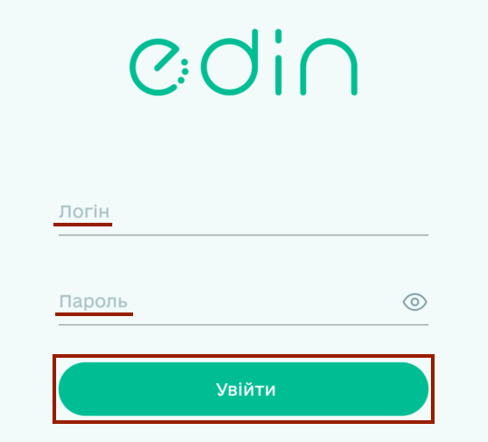

.. _auth:

2 Реєстрація/Авторизація користувача в додатку **"EDIN Market"**
=======================================================================

Для самостійної реєстрації в додатку **"EDIN Market"** користувачу необхідно на сторінці авторизації натиснути на кнопку **"Зареєструватися"**, ввести свою пошту, вигадати пароль та знову натиснути **"Зареєструватися"**. Після чого користувачу на вказану пошту відправляється лист з посиланням для підтвердження реєстрації - перейдіть за посиланням (дійсне 72 години) в ньому, щоб підтвердити email:

.. image:: pics_EDIN_Market/EDIN_Market_059.png
   :align: center

.. attention::
   Лист міг потрапити до спаму. Тому перевірте не тільки "Вхідні", але й "Спам". В разі попадання до спаму налаштуйте правила, щоб наступні листи від EDIN не потрапляли до спаму.

Для продовження реєстрації потрібно створити профіль користувача, заповніть поля: Прізвище, Ім’я, Посада, Email та номер телефону. Щоб ми були впевнені що ви використовуєте саме свій мобільний номер телефону підтвердіть його за допомогою sms-коду:

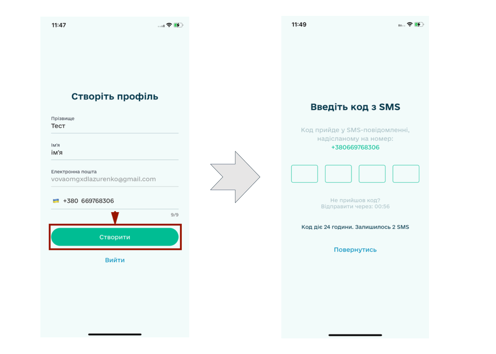

Щоб верифікувати дані компанії потрібно ввести ЄДРПОУ або РНОКПП (ІПН) і ми підтягнемо всю інформацію з відкритих джерел:

.. image:: pics_EDIN_Market/EDIN_Market_061.png
   :align: center

Реєстрацію завершено.

.. _main:

3 Основні функціональні елементи додатка **"EDIN Market"**
=====================================================================

В додатку **"EDIN Market"** є кілька основних функціональних розділів:

* **Замовлення** - робота з уже відправленими документами ("Замовленнями");
* **Продавці** - пошук, вибір Продавців (Ваших контрагентів), перегляд товарів Продавців, формування "Замовлень"-чернеток;
* **Кошик** - перегляд, редагування "Замовлень"-чернеток;
* **Налаштування** - вибір компанії, налаштування облікового запису / додатку, додаткова інформація.

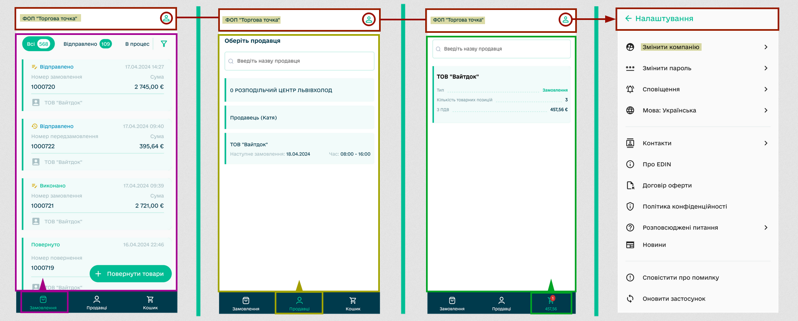

.. _prod-pricelist:

4 Перегляд "Прайс-листа" Продавця (Виробника)
=====================================================================

Для перегляду "Прайс-листа" Продавця в розділі **"Продавці"** потрібно обрати одного з Ваших контрагентів (можливо здійснювати пошук за назвою) після чого відкриється список з товарами (назва Продавця відображається у верхній частині екрану):

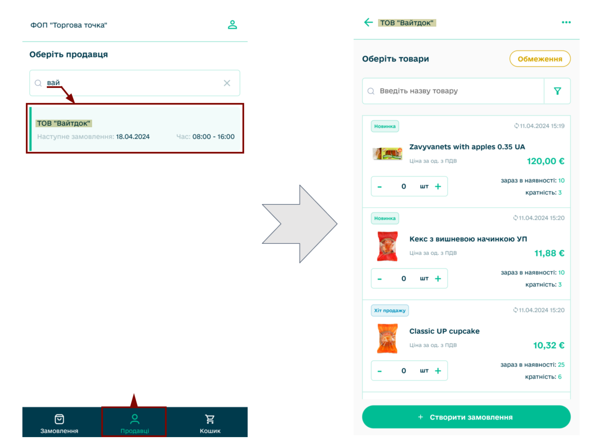

.. hint::
   У Продавців, що мають **Графік замовлень** (детальніше далі) одразу відображається примітка про наступні дату та час, коли вони зможуть прийняти "Замовлення".

В списку товарів відображаються лише актуальні позиції. Кожна товарна позиція має свою назву, ціну (грн/євро/долар США з/без ПДВ в залежності від налаштувань Продавця), розмірність в якій продається одиниця товару, дату та час публікації позиції. Додатково (налаштування Продавця) в товарних позиціях можуть бути зображення, встановлені позначки "Новинка" / "Хіт продажу" / "Надбавка" / "Публічна позиція" / "Акція", зазначена **кількість товару в наявності** (доступна кількість), а також **Кратність**, з якою можливо вказувати кількість товару для формування "Замовлення": 

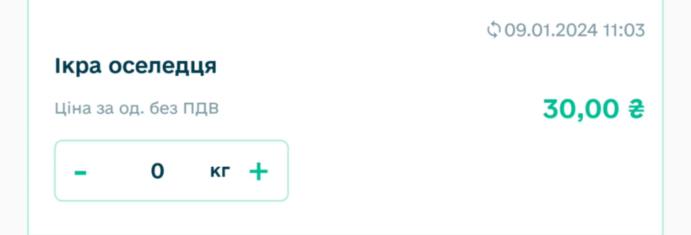

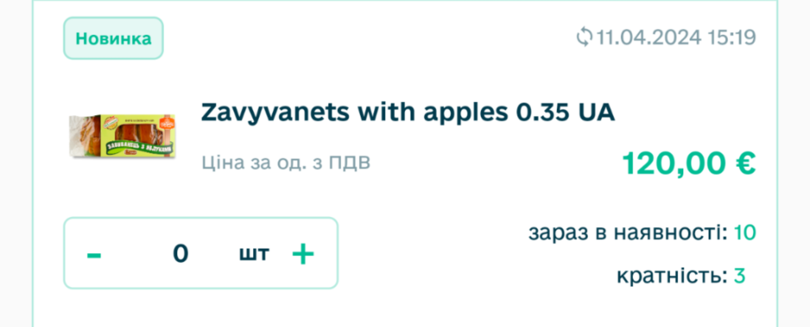

.. hint::
   Якщо Продавець (Виробник) в обраній позиції вказує "Кратність", то при формуванні "Замовлення" Покупцем кількість замовлених позицій має бути кратною вказаній кількості. Наприклад, якщо "Кратність"=3, то "Кількість одиниць" для формування "Замовлення" може бути 3, 6, 9...

Також, якщо в Продавця встановленні **"Обмеження"** (встановлені правила формування "Замовлення"), то відображається відповідна кнопка, при натисканні на яку одразу відображається список встановлених Продавцем обмежень або меню для перегляду **Обмежень / Графіку замовлень**, якщо останній теж встановлений Продавцем:

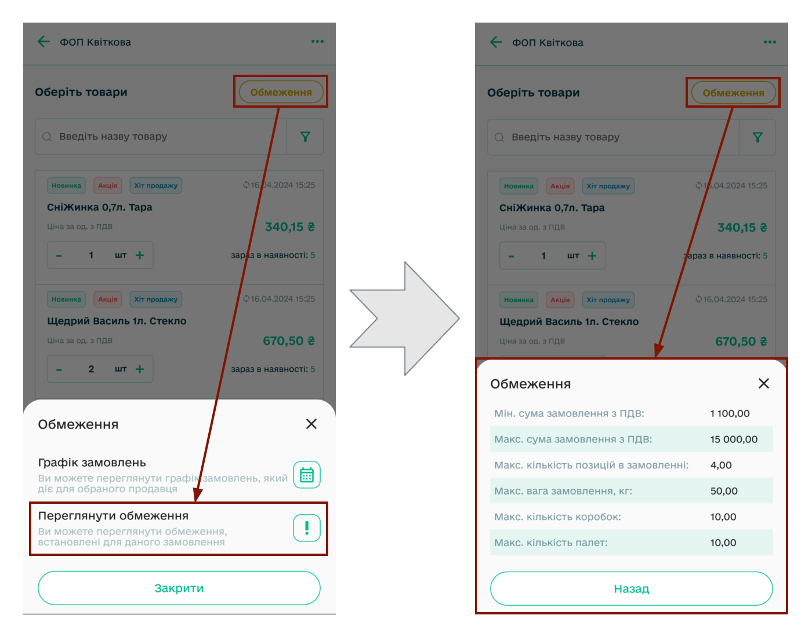

В **Графіку замовлень** Продавець зазначає дні та час, коли він приймає "Замовлення". Обравши дату в графіку, Ви можете ознайомитись з інформацією приймання "Замовлень". Зеленим кольором в календарі будуть відмічені дні прийому "Замовлень"; години прийому "Замовлень" та нагадувань можуть бути додатково зазначені при перегляді дати в календарі:

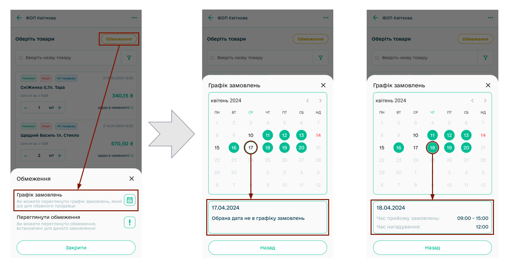

.. attention::
   Якщо Продавець (Виробник) заборонив відправляти "Замовлення" поза своїм **Графіком замовлень**, то при відправці замовлення не в визначений період, Ви отримаєте помилку!

Для того аби не виникали непорозуміння Продавець (Виробник) може налаштувати відправку системних сповіщень (а також на пошту) про свою готовність приймати "Замовлення".

Всі товарні позиції "Прайс-листа" можливо відсортувати за трьома рівнями. Перші два рівні обираються через меню фільтрування (кнопка |filter_app|), а третій (найточніший) вже при прокручуванні рядка (в дужках відображається кількість товарів в цій групі); також можливо скористатись рядком пошуку товару за його назвою:

.. image:: pics_EDIN_Market/EDIN_Market_021.gif
   :height: 700px

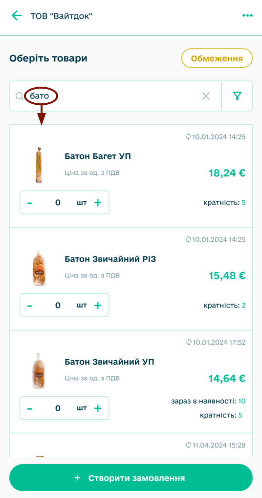

.. _order-create:

5 Створення "Замовлення" / "Передзамовлення" за Прайс-листом Продавця (Виробника)
=================================================================================================

Перед початком переконайтесь, що правильно обрали компанію! Для створення перейдіть до розділу **Продавці** та оберіть одного (можливо скористатись пошуком за назвою).

.. hint::
   Якщо для даного контрагента Ви вже створили чернетку (даний тип документа знаходиться в розділі **"Кошик"**), то відкриється "Прайс-лист" з обраними позиціями (режим редагування Чернетки "Замовлення") та кнопкою **"Перейти до замовлення"** для продовження редагування Чернетки!

Далі з урахуванням **Обмежень**, кратності та наявного товару (детальніше в `попередньому розділі інструкції <https://wiki.edin.ua/uk/latest/Distribution/EDIN_2_0/Instructions_2_0/EDIN_Market.html#prod-pricelist>`__) потрібно вказати кількість товару за допомогою курсору чи кнопок **«+»** / **«-»**. Після того, як всі товари буде обрано Ви можете **"+Створити замовлення"** (в дужках відображається кількість товарних позицій):

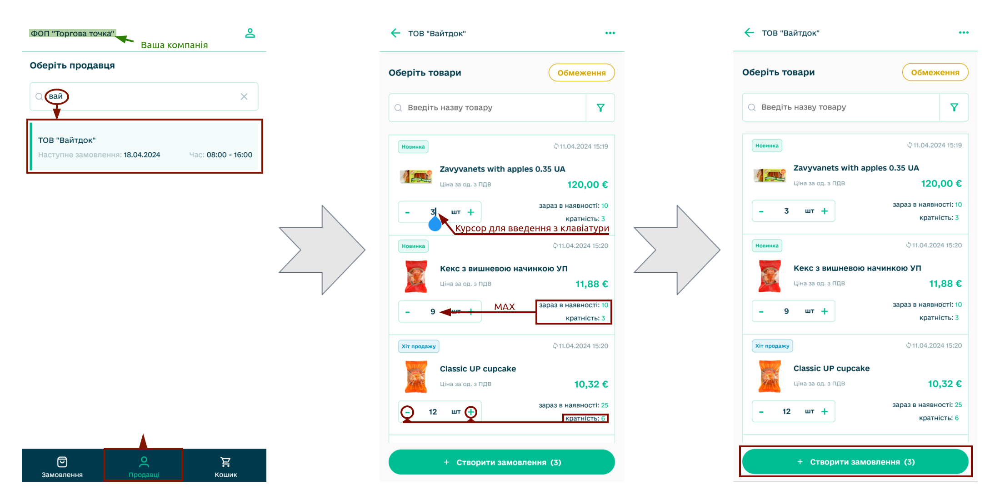

.. hint::
   Для створення "Передзамовлення" для обраного Продавця потрібно за допомогою трикрапки (**...**) в доступних діях обрати **"Передзамовлення"**. Якщо для даного контрагента Ви вже створили чернетку (даний тип документа знаходиться в розділі **"Кошик"**), то в кнопки **"Передзамовлення"** буде примітка, а при натисканні на кнопку відкриється раніше створена чернетка:

   .. image:: pics_EDIN_Market/EDIN_Market_033.png
      :align: center

   Основною відмінністю "Передзамовлення" є можливість наповнити і відправити документ без урахування **Обмежень** (в тому числі й графіку), кратності та наявного товару. Відправлені "Передзамовлення" помічаються в розділі **Замовлення** іконкою |clock|.

.. note::
   Чернетка в цьому вигляді зберігається та доступна в розділі **"Кошик"**, де відображаються всі створені чернетки. В **"Кошику"** відображається загальна сума за всіма чернетками, а також коротка інформація за кожною з чернеток (назва продавця, тип документа, кількість товарних позицій та загальна сума). Чернетку можливо знайти (за назвою продавця) та продовжити редагування, за потреби можливо видалити чернетку за допомогою кнопки |trash_app|:

   .. image:: pics_EDIN_Market/EDIN_Market_028.png
      :height: 500px
      :align: center

Формується Чернетка "Замовлення", що складається з блоків **До сплати**, блоку з товарами (**Товари**) та блоку **Оформлення замовлення**, що заповнюється реквізитами майбутнього документа:

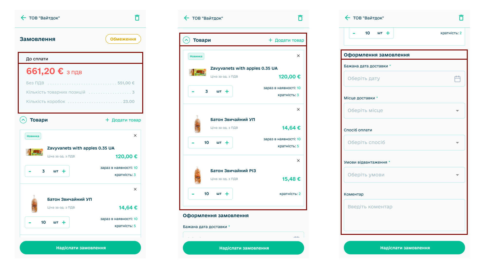

Інформація в блоці **До сплати** автоматично перераховується при змінах та містить інформацію про кількість товарних позицій в створеному Замовленні, загальні суми з/без ПДВ. Якщо сформована чернетка не відповідає за якимись параметрами **Обмеженням** Продавця, то такі пункти виділяються в блоці **До сплати** червоним кольором, якщо ж поточна дата не потрапляє в **Графік замовлень** Ви також побачите сповіщення. При спробі **"Надіслати замовлення"** без змін Ви отримаєте підказку про необхідність врахування параметрів Продавця:

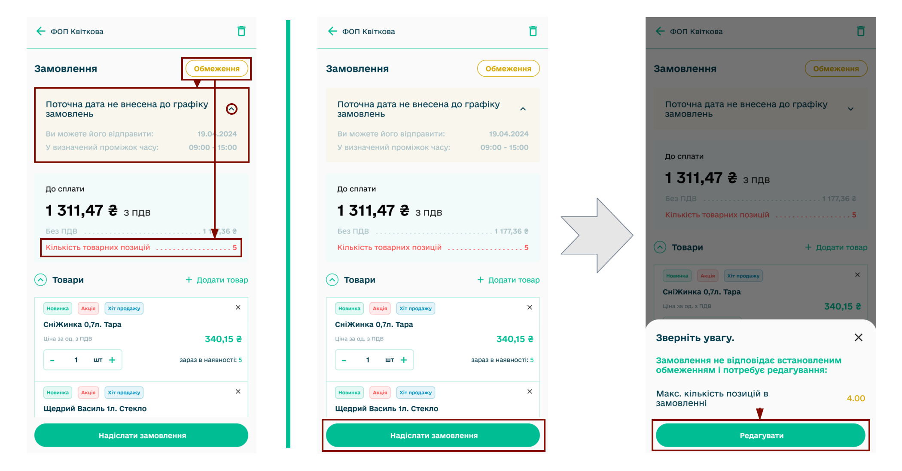

Блок **Товарів** дозволяє додавати (**+**) / видаляти (**-**) кількість замовляємого товару (з урахуванням наявності та кратності) прямо в чернетці. Також можливо видалити якусь товарну позицію повністю (кнопки **«-»** / **"Х"**) чи **"+Додати товар"** з "Прайс-листа" Продавця за допомогою одноіменної кнопки, обрати та **"+Додати у замовлення"**:

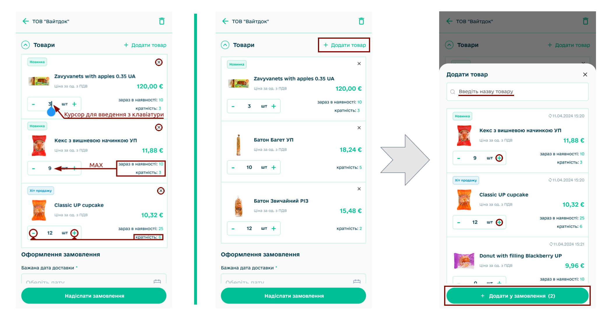

Після того, як всі поля в блоці **До сплати** будуть чорними для зручності можна згорнути (|up_app|) товарні позиції та перейти до заповнення реквізитів (блок **Оформлення замовлення**) - обв'язкові до заповнення поля відмічені зірочкою:

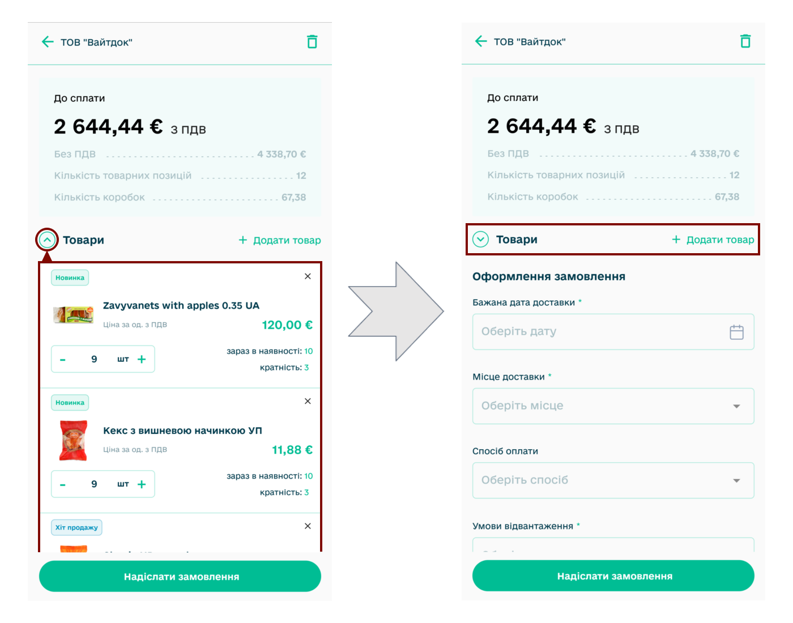

При заповненні "Бажаної дати доставки" відкривається календар для вибору дати, в полі "Місце доставки" одразу відображається список доступних адрес, серед "способів оплати" можливо обрати **Готівковий розрахунок/Безготівковий розрахунок**, в "Умовах відвантаження" потрібно обрати **Самовивіз/Доставка транспортом продавця** та додати коментар за потреби перед тим як **"Надіслати замовлення / передзамовлення"**:  

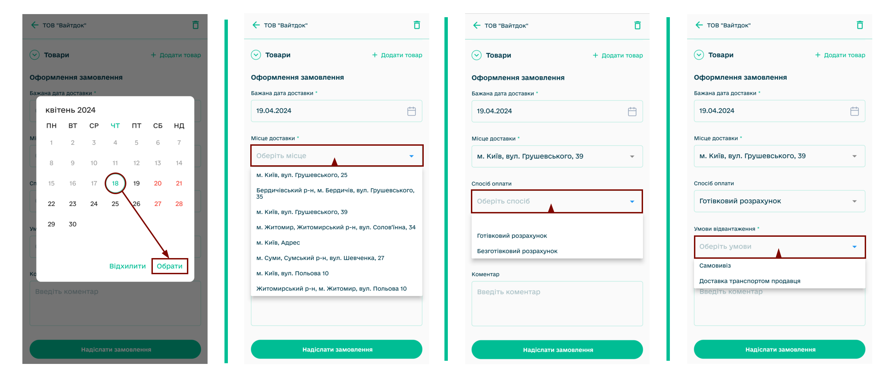

Після чого потрібно натиснути кнопку **"Надіслати замовлення / передзамовлення"** і якщо "Замовлення" / "Передзамовлення" створено коректно, то після відправки Ви зможете **"Переглянути замовлення / передзамовлення"** чи **"Продовжити покупки"** в розділі **Продавці** (при невідповідності накладеним обмеженням Ви отримаєте сповіщення про причину і потребу редагування - детальніше описано в `попередньому розділі інструкції <https://wiki.edin.ua/uk/latest/Distribution/EDIN_2_0/Instructions_2_0/EDIN_Market.html#prod-pricelist>`__):

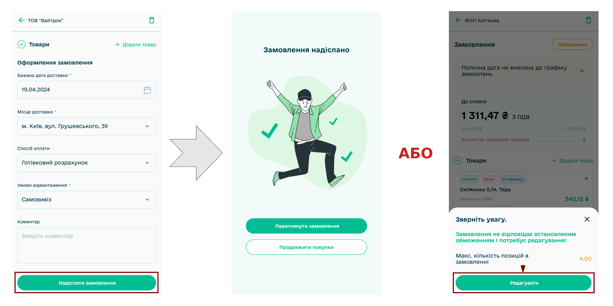

Надіслане "Замовлення" / "Передзамовлення" автоматично відображається в розділі **"Замовлення"**.

.. _order-repeat:

5.1 Повторити "Замовлення" / "Передзамовлення"
----------------------------------------------------------------

За потреби можливо **"Повторити замовлення"** (створити чернетку "Замовлення" / "Передзамовлення" з даними, ідентичними до вже відправленого документа). Для цього потрібно відкрити надісланий документ в розділі **Замовлення** та за допомогою трикрапки (**...**) в доступних діях обрати **"Повторити замовлення"**; залишається вказати дату доставки та натиснути **"Надіслати замовлення/передзамовлення"**:

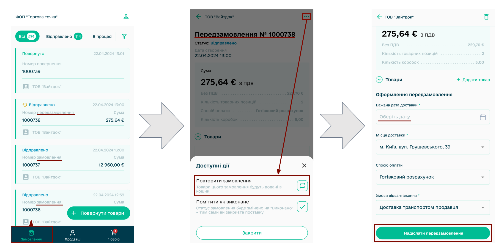

.. note::
   Якщо для даного контрагента Ви вже створили чернетку (даний тип документа знаходиться в розділі **"Кошик"**), то в кнопки **"Повторити замовлення"** буде примітка, а при натисканні на кнопку Ви зможете обрати дію: **"Замінити"** чи **"Об'єднати"** товари у кошику для цього контрагента:

   .. image:: pics_EDIN_Market/EDIN_Market_032.png
      :align: center

Автоматично створену Чернетку можливо надіслати одразу чи після редагування.

.. _order-repeat:

5.2 Редагування "Замовлення"
----------------------------------------------------------------

.. attention::
   Відредагувати відправлене "Замовлення" можливо поки контрагент не відповів на нього (документ перебуває в статусі :navy:`"Відправлено"`)!

Для редагування відправленого "Замовлення" в розділі **"Замовлення"** потрібно обрати документ в статусі :navy:`"Відправлено"` (для зручності можливо скористатись `пошуком <https://wiki.edin.ua/uk/latest/Distribution/EDIN_2_0/Instructions_2_0/EDIN_Market.html#doc-search>`__). Далі за допомогою трикрапки (**...**) в доступних діях потрібно обрати **"Редагування замовлення"**. При цьому в **"Кошику"** автоматично створюється чернетка "Редагування замовлення", що дозволяє видаляти / додавати товари (з "Прайс-листа" Продавця), змінювати замовлену кількість товарів (згідно вказаних наявності, кратності товару, накладеним **Обмеженням**) та реквізити документа :red:`окрім "Місця доставки"`:

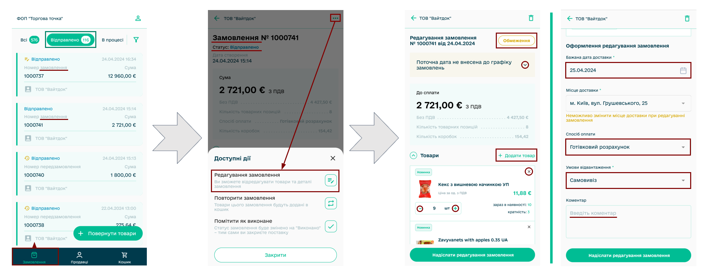

.. note::
   Якщо для даного контрагента Ви вже створили чернетку (даний тип документа знаходиться в розділі **"Кошик"**), то в кнопки **"Редагувати замовлення"** буде примітка, а при натисканні на кнопку Ви зможете обрати дію: **"Замінити"** чи **"Об'єднати"** товари у кошику для цього контрагента:

   .. image:: pics_EDIN_Market/EDIN_Market_039.png
      :align: center

Після того, як документ буде відредаговано можливо **"Надіслати редагування замовлення"**. Відправлені "Редагування замовлення" в розділі **"Замовлення"** відмічені іконкою |edit_app|, а в самому "Замовленні" вказуються зміни за замовленою кількістю та дата зміни документа (останнього редагування):

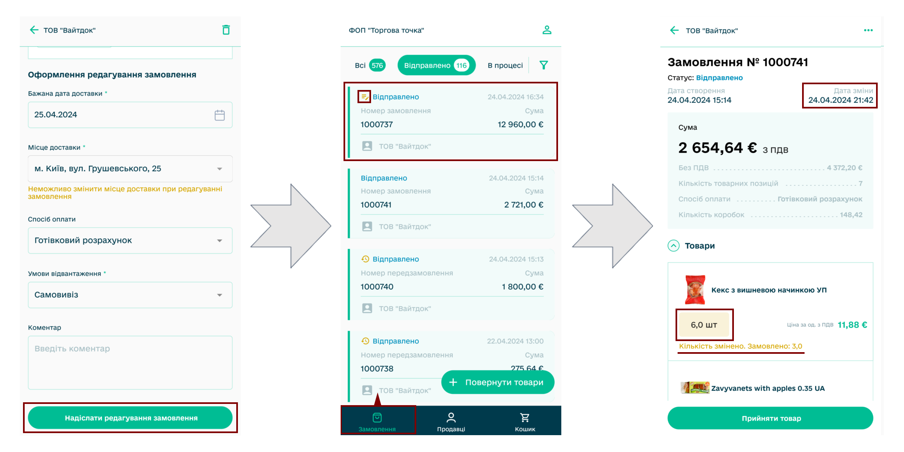

Таким чином одне "Замовлення" можливо редагувати багатократно (поки воно перебуває в статусі :navy:`"Відправлено"`), а всі зміни можливо відслідкувати в `"Історії замовлення" <https://wiki.edin.ua/uk/latest/Distribution/EDIN_2_0/Instructions_2_0/EDIN_Market.html#history>`__.

.. _next-steps:

6 Подальший документообіг 
=====================================================================

Після відправки "Замовлення" / "Передзамовлення" документи відображаються в розділі **"Замовлення"**, де їх можливо переглянути та здійснюються всі подальші дії. Документи змінюють свій статус впродовж їх життєвого циклу:

* :navy:`"Відправлено"` - усі відправлені "Замовлення" / "Передзамовлення" / "Редагування замовлення", на які ще немає відповіді контрагента;
* :orange:`"В процесі"` - усі "Замовлення" / "Редагування замовлення", на які Продавець (Виробник) надав відповідь (документи очікують на прийомку товару);
* :green:`"Виконано"` - усі "Замовлення" / "Передзамовлення" / "Редагування замовлення", за якими поставка товарів була завершена (кінцевий статус документа).

.. note::
   Статус :green:`"Повернуто"` використовується для процесу **Повернення товарів** (детальніше в `наступному розділі інструкції <https://wiki.edin.ua/uk/latest/Distribution/EDIN_2_0/Instructions_2_0/EDIN_Market.html#products-return>`__).

.. _doc-search:

6.1 Пошук документів
----------------------------------------------------------------

Відсортувати документи в розділі **"Замовлення"** за статусом можливо обравши один із швидких фільтрів, що доступні при прокручуванні рядка вбік:

.. image:: pics_EDIN_Market/EDIN_Market_034.gif
   :height: 700px
   :align: center

або, відкривши меню розширеного пошуку кнопкою |filter_app|. Знайти документи можливо за одним чи кількома критеріями, серед яких "Номер документа" (пошук працює за частиною номера), "Дата або період документа", "Продавець", Тип та Статус документа

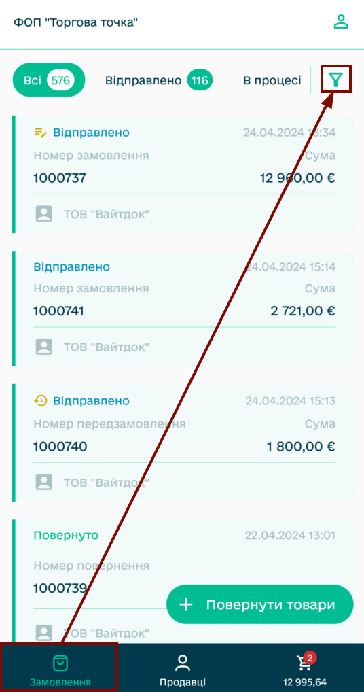

.. image:: pics_EDIN_Market/EDIN_Market_036.gif
   :height: 700px

За вибраними критеріями потрібно натиснути кнопку **"Пошук"** - якщо Ваші документи будуть їм відповідати, вони будуть знайдені. Кількість документів зазначається в полі "Знайдено", повернутись в меню розширеного пошуку можливо за допомогою кнопки |filter_app|; також можливо **"Очистити фільтр"**:

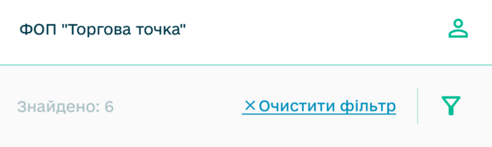

.. _products-acceptance:

6.2 Приймання товару
----------------------------------------------------------------

Після того, як Продавець (Виробник) формує підтвердження та/або відвантаження за Вашим "Замовленням", то даний документ автоматично змінює свій статус на :orange:`"В процесі"` (дія Вашого контрагента відображається в `"Історії замовлення" <https://wiki.edin.ua/uk/latest/Distribution/EDIN_2_0/Instructions_2_0/EDIN_Market.html#history>`__).

.. note::
   Звісно, якщо Ваш процес передбачає приймання товару без цифрової відповіді, то Ви можете можете виконати **"Приймання товару"** й на "Замовлення", що перебувають в статусі :navy:`"Відправлено"`.

Для того, щоб прийняти підтверджений/відвантажений товар потрібно в розділі **Замовлення** обрати документ (для зручності можливо скористатись `пошуком <https://wiki.edin.ua/uk/latest/Distribution/EDIN_2_0/Instructions_2_0/EDIN_Market.html#doc-search>`__) та натиснути **"Прийняти товар"**. Ви можете переглянути всі товари (присутній пошук за назвою товару) та **"Надіслати"** приймання товару контрагенту: 

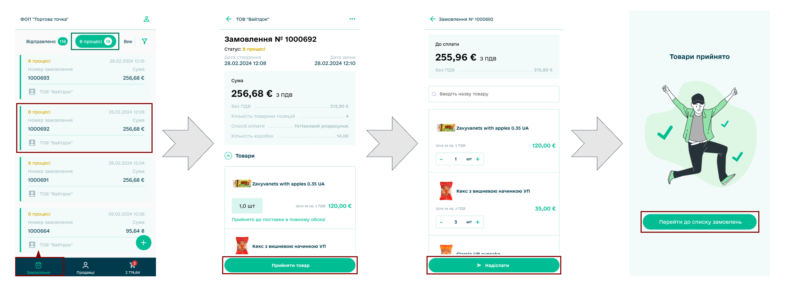

Якщо кількість товару, яку фактично приймаєте не відповідає кількості в документі її можливо змінити за допомогою курсору чи кнопок **«+»** / **«-»**, після натискання на кнопку **"Продовжити"** Вам відкриється форма лише з тими товарами, що мають розбіжності (зміни автоматично зазначаються жовтим кольором). За потреби Ви можете для кожного товару окремо "+Додати причину" розбіжності, обравши її зі списку:

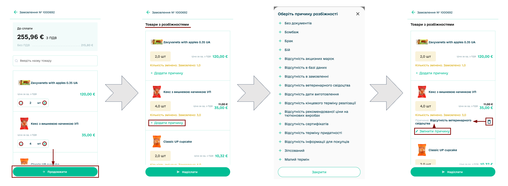

Обрану причину розбіжності можливо **Видалити** (|trash_app|) чи **"Змінити причину"** (переобрати зі списку). По завершенню внесення причин розбіж6остей потрібно **"Надіслати"** приймання товару контрагенту.

Після відправки приймання товару "Замовлення" змінює свій статус на :green:`"Виконано"` (Виконано), при перегляді документа відображається дата зміни (останньої дії), підкреслюються остаточна кількість прийнятих товарів, розбіжності та їх причини (якщо такі були вказані):

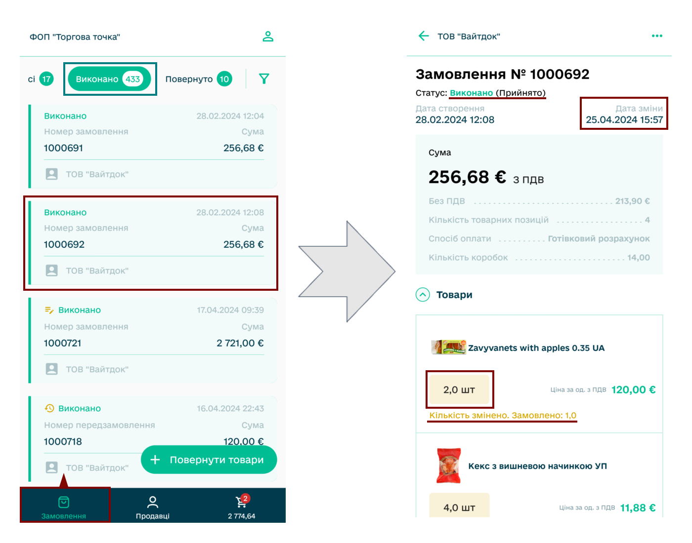

Документообіг завершено.

.. _products-return:

6.3 Повернути товари
----------------------------------------------------------------

.. attention::
   Даний функціонал реалізований для Продавців (Виробників), що працюють та дозволяють повертати товари, що швидко псуються! 

Повернення товарів здійснюється за допомогою кнопки **"+Повернути товари"** в розділі **Замовлення**. Далі потрібно обрати Продавця (Виробника) зі списку Ваших контрагентів (пристуній пошук за назвою), ввести кількість днів для здійснення повернення та натиснути **"Створити повернення"**. Після чого відображається неповний список товарів з останніх замовлень (присутній пошук за назвою товару), які можливо обрати вибірково чи **"Обрати все"** для оформлення повернення та **"Продовжити"**:

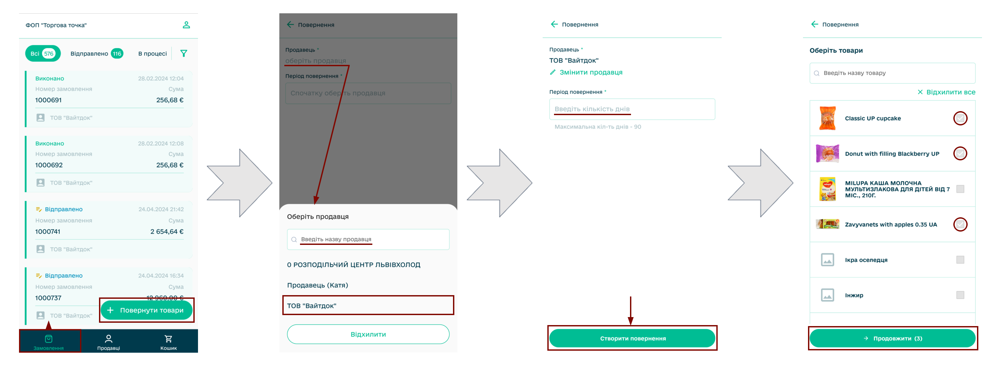

Далі відкривається форма повернення, де в блоці **Товари** можливо вказати кількість товару (кнопки **«+»** / **«-»**), зазначити причину повернення (**"+Додати причину"**) чи **"+Додати товар"** з "Прайс-листа" обраного Продавця (Виробника) навіть, якщо Ви його не "замовляли" через наш сервіс:

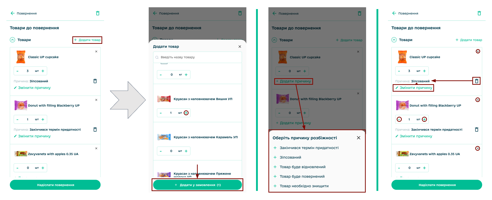

Чернетку повернення на етапі наповнення можливо видалити за допомогою кнопки |trash_app|. Після додавання усіх товарних позицій та їх кількості для зручності їх можна згорнути (|up_app|) та перейти до заповнення реквізитів (блок **Оформлення повернення**) - обв'язкові до заповнення поля відмічені зірочкою:

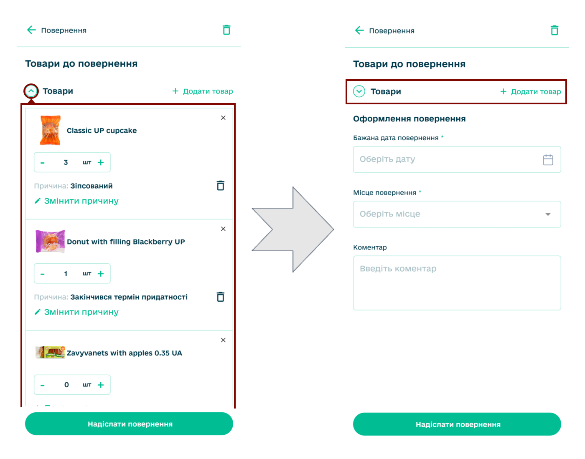

При заповненні "Бажаної дати повернення" відкривається календар для вибору дати, в полі "Місце доставки" одразу відображається список доступних адрес та додати коментар за потреби перед тим як **"Надіслати повернення"**:  

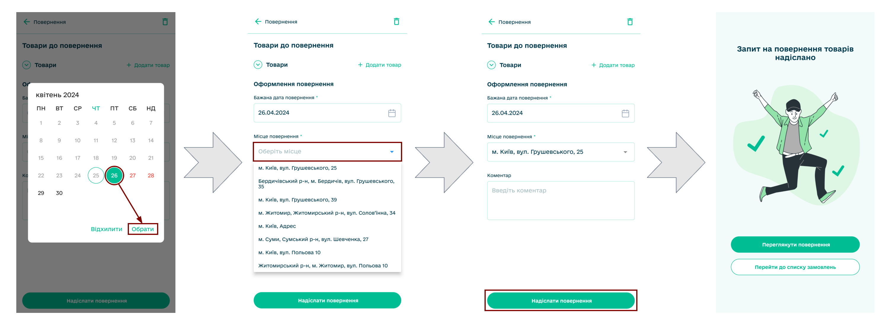

Якщо повернення створено коректно, то після відправки Ви зможете **"Переглянути повернення"** чи **"Перейти до списку замовлень"** в розділі **Продавці**. Надіслане повернення автоматично відображається в розділі **"Замовлення"** (для зручності можливо скористатись `пошуком <https://wiki.edin.ua/uk/latest/Distribution/EDIN_2_0/Instructions_2_0/EDIN_Market.html#doc-search>`__):

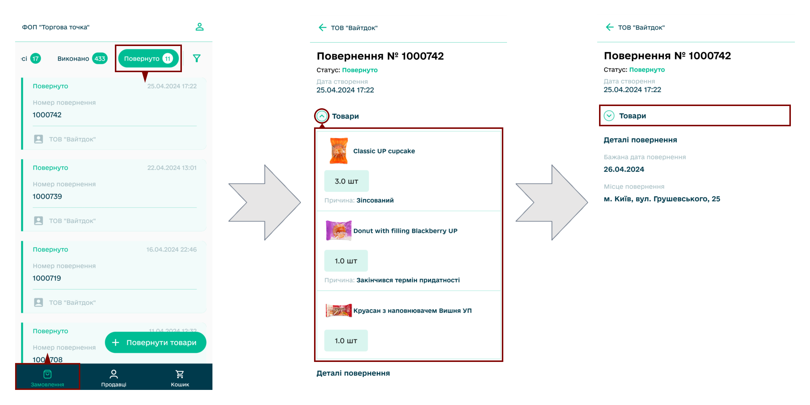

При перегляді документа відображаються кількість та причина (за наявності) повернення товарів, бажана дата та місце повернення.

.. _history:

6.4 Історія замовлення
----------------------------------------------------------------

Історія з'являється у "Замовлення", якщо з ним виконали якусь дію: створили "Редагування замовлення" (Покупець); підтвердження / відвантаження (Продавець); приймання (Покупець). Тобто "Замовлення" якщо документ редагували або документ перебуває в статусі :orange:`"В процесі"` / :green:`"Виконано"`, то він точно має "історію". Для того, щоб переглянути історію документа потрібно за допомогою трикрапки (**...**) в доступних діях обрати **"Історія замовлення"**, де відображаються основні зміни за документом: загальною сумою та за кількістю, ціною кожної товарної позиції:  

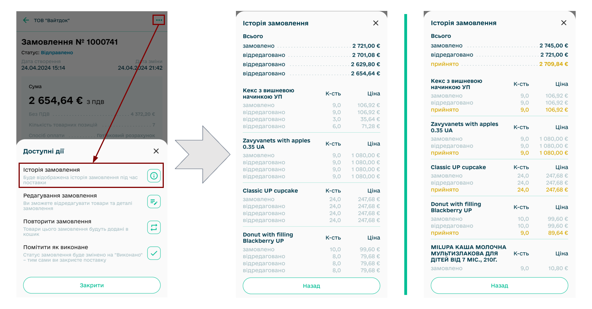

.. _settings:

7 Налаштування та корисна інформація
=====================================================================

Розділ **Налаштувань** доступний при натисканні на кнопку |user_app|. **Налаштування** умовно можливо поділити на функціональні блоки, де зберігаються Ваші персональні налаштування, політика та правила користування застосунком, наші контакти та інша корисна інформація:

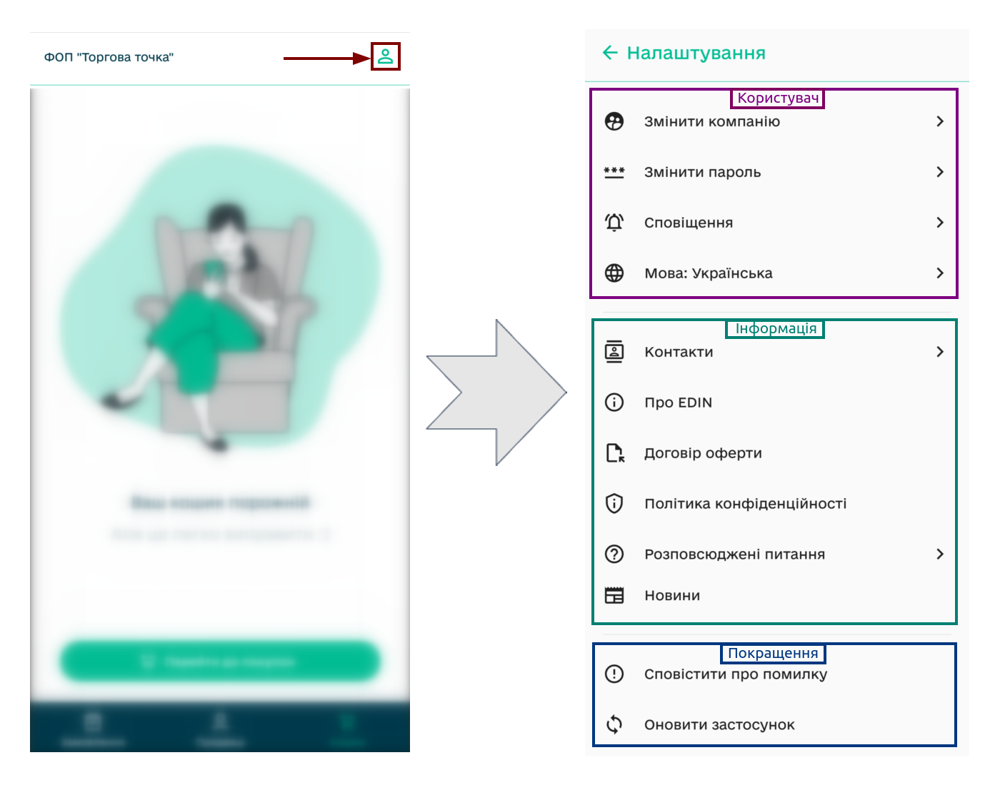

--------------------------

Для того, щоб **"Змінити компанію"** потрібно обрати та натиснути на Вашу компанію зі списку (поточна компанія відмічена галочкою та виділена зеленим кольором): 

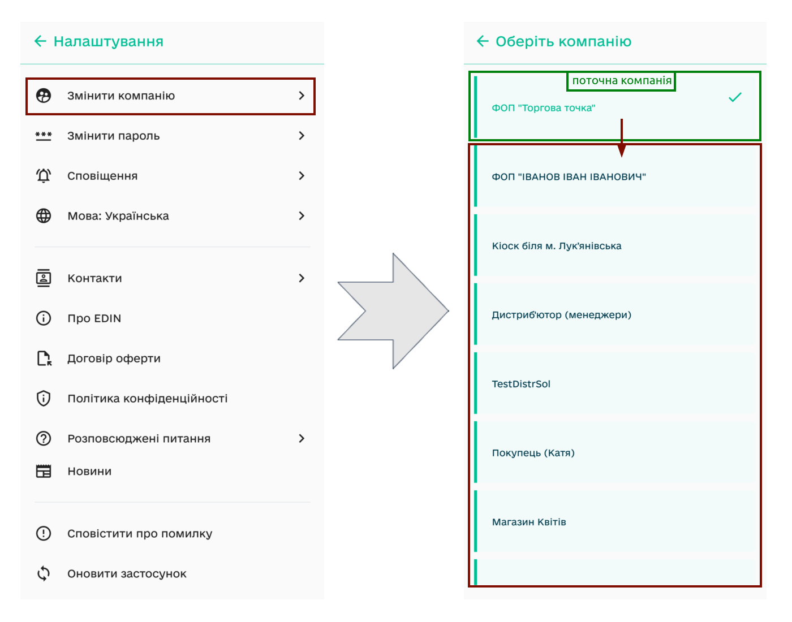

--------------------------

Для того, щоб **"Змінити пароль"** потрібно у відкритій формі ввести Ваш поточний пароль, ввести новий пароль (мінімум 6 символів), повторно ввести новий пароль (щоб уникнути помилки при наборі) та обов'язково **Зберегти** введені зміни за допомогою кнопки з іконкою |diskette|:

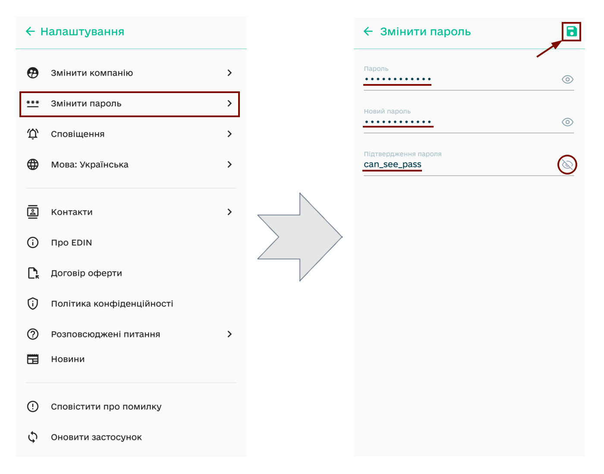

--------------------------

Для **налаштування сповіщень сервісу** потрібно обрати **"Сповіщення"** і увімкнути/вимкнути сповіщення на Пошту та безпосередньо на Телефон (Ваш пристрій) з додатку:

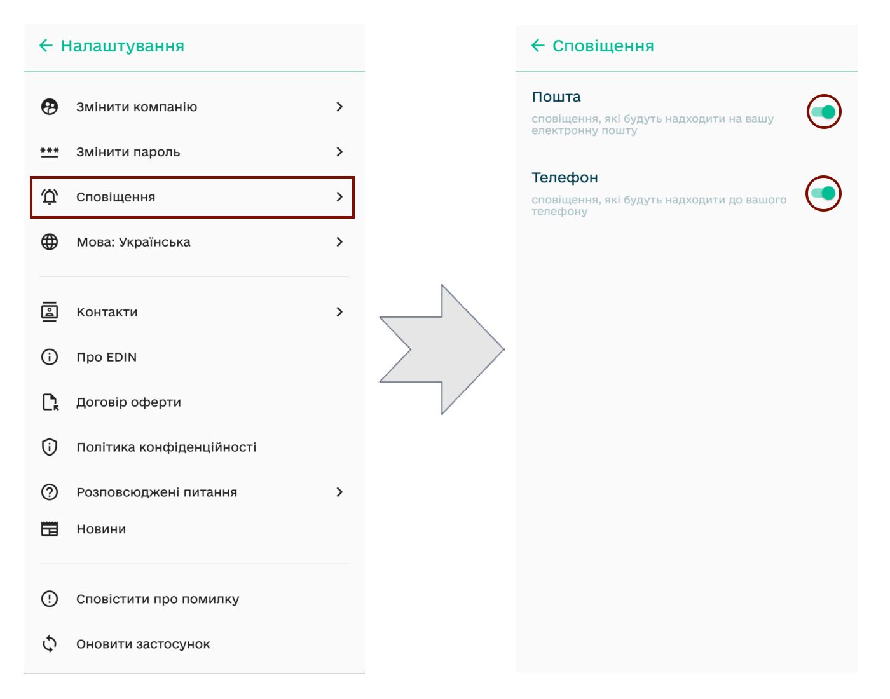

--------------------------

Інтерфейс додатка поки доступний на двох **мовах**: українською (за замовчуванням) та англійською:

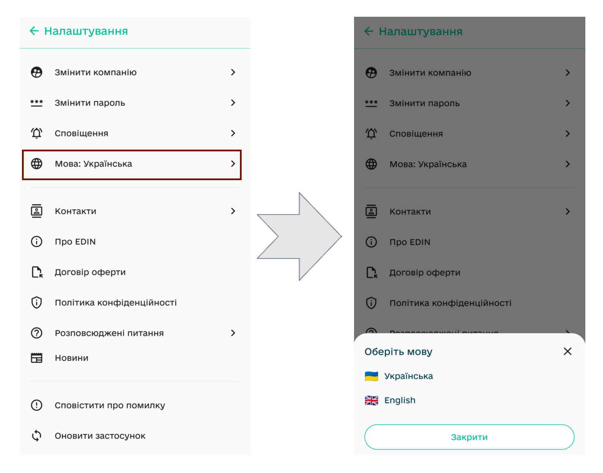

-----------------------------

.. hint::
   В інформаційному блоку Ви завжди можете знайти наші контакти, інформацію про компанію, перечитати договір/політику, ознайомитись з новинами та швидко знайти відповіді на розповсюджені питання прямо всередині нашого додатку!

-----------------------------

Дайте нам знати одразу, коли Ви одержали помилку в додатку: потрібно в **"Налаштуваннях"** обрати **"Сповістити про помилку"** та текстом вказати причину помилки ("що працює не так, як повинно"):

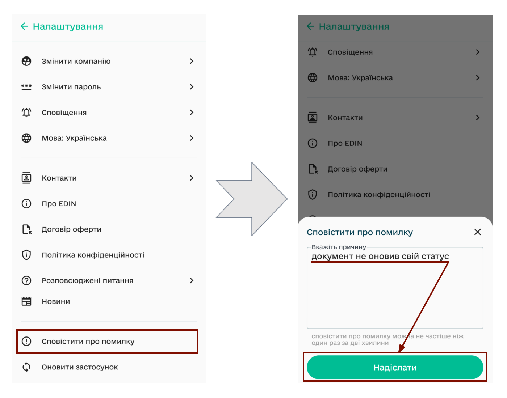

.. hint::
   Також з питань роботи в сервісі можливо звертатись до технічної підтримки в зручний для Вас спосіб (телефон, telegram, пошта):

   .. image:: pics_EDIN_Market/EDIN_Market_056.png
      :height: 500px
      :align: center

-----------------------------

Ми рекомендуємо своєчасно **"Оновлювати застосунок"**. Ви також будете отримувати сповіщення про те, що доступна нова версія додатку (при тривалому ігноруванні потреби в оновленні застосунку він може перестати працювати):

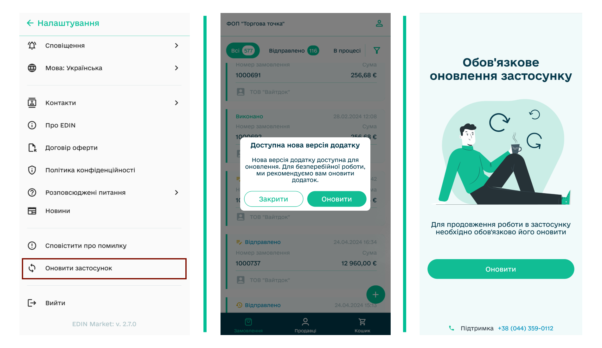

-----------------------------

.. hint::
   Якщо пристрій, на якому встановлено додаток використовується кількома користувачами: ми наполегливо рекомендуємо здійснювати **"Вихід"** з додатка перед передаванням такого пристрою іншій особі, щоб убезпечити Вашу конфіденційну інформацію!  

   .. image:: pics_EDIN_Market/EDIN_Market_058.png
      :height: 500px
      :align: center

.. _delete-account:

8 Видалення Вашого облікового запису в EDIN "Market"
====================================================================

.. caution::
   Ми дбаємо про конфіденційність Ваших облікових даних і Ви можете **"Видалити акаунт"**, вказавши причину та повторно підтвердивши дію кнопкою:

   .. image:: pics_EDIN_Market/EDIN_Market_062.png
      :height: 500px
      :align: center

   Однак Ви маєте знати, що будете позбавлені можливості користуватися EDIN Market, і інші учасники електронного документообігу будуть позбавлені можливості обмінюватися з Вами електронними документами з використанням EDIN Market! Детальніше про видалення та зберігання даних Ви можете дізнатись з нашої `Політики конфіденційності <https://wiki.edin.ua/uk/latest/Legal_info/Politic.html>`__ (п.5 та п.9.2.3 відповідно).

-------------------------------------

.. include:: /_constant/kontakti.rst

