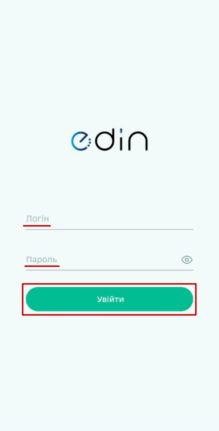
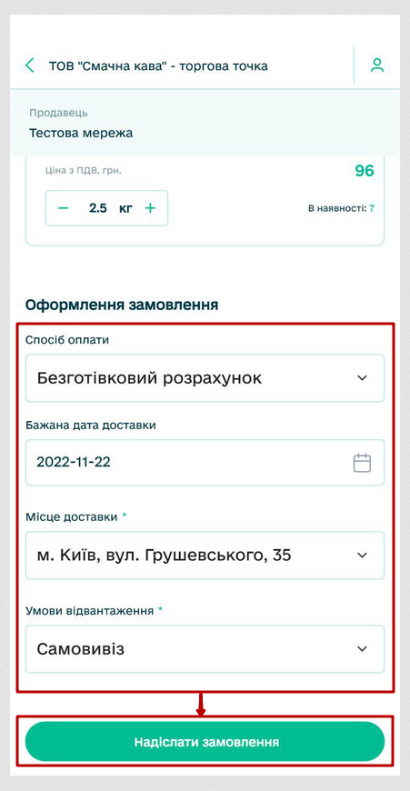

#################################################################################
Робота з додатком "EDIN Market"
#################################################################################

.. картинки:

.. |sen44444444444444444t| image:: pics_EDIN_Market/EDIN_Market_00000000000.png

.. contents:: Зміст:
   :depth: 4

---------

Вступ
==========================

Для роботи в сервісі **Дистриб’юшн** та звичному обміну електронними документами між Виробниками та їх Дистриб’юторами прямо з Вашого мобільного/планшета був розроблений додаток **"EDIN Market"**. Додаток доступний в крамницях застосунків **"Google Play Market"** (Android) та **"Apple App Store"** (iOS). Дана інструкція описує метод встановлення додатку та порядок формування документа `Замовлення (ORDERS) <https://wiki.edin.ua/uk/latest/Distribution/EDIN_2_0/XML/XML_structure.html#order>`__ за `Прайс-листом (PRICAT) <https://wiki.edin.ua/uk/latest/Distribution/EDIN_2_0/XML/XML_structure.html#pricat>`__.

.. note::
   Користуватись додатком можуть лише `зареєстровані <https://wiki.edin.ua/uk/latest/general_2_0/User_registration.html#register>`__ користувачі платформи **"EDI Network"** (вже мають логін та пароль). 

.. _widget-install:

1 Встановлення додатка **"EDIN Market"**
==============================================

.. tabs::

   .. tab:: На "Android"

      Для встановлення додатка **"EDIN Market"** Ви можете пройти за `посиланням <https://play.google.com/store/apps/details?id=org.edin.edinMarket>`__ чи самостійно знайти віджет за назвою в **"Google Play Market"**. Далі потрібно **"Установити"** додаток:

      .. image:: pics_EDIN_Market/EDIN_Market_001.png
         :align: center

      Встановлений додаток **"EDIN Market"** можливо одразу **"Відкрити"** з **"Google Play Market"** чи знайти серед встановлених додатків на Вашому пристрої за назвою:

      .. image:: pics_EDIN_Market/EDIN_Market_002.png
         :align: center

   .. tab:: На "iOS"

      Інструкція з'явиться найближчим часом.

2 Основні функціональні елементи додатка **"EDIN Market"**
=====================================================================

Для входу до сервісу платформи необхідно пройти аутентифікацію: ввести Ваш логін і пароль користувача, натиснути **"Увійти"**:

Після авторизації відкривається основне вікно додатка, в якому зручно обрати:

* Ваш GLN/компанію (від імені якої і будуть здійснюватись всі подальші дії):

* Ваших контрагентів:

* Ваші "Відправлені" чи створені, але не відправлені Замовлення ("Чернетки"):

3 Створення Замовлення за Прайс-листом Виробника
=====================================================================

Для початку потрібно переконатись, що ви обрали потрібний GLN/компанію (якщо у Вас їх кілька):

Для того, щоб переглянути Прайс-лист, потрібно відкрити вкладку **"Продавці"** та обрати одного зі списку:

Автоматично відкриється весь Прайс-лист Виробника. Всі товарні позиції Прайс-листа можливо відсортувати за трьома рівнями. Перші два рівні обираються через меню фільтрування, а третій (найточніший) вже при прокручуванні рядка (в дужках відображається кількість товарів в цій групі):

Для створення Замовлення Вам потрібно лише вказати кількість (вагу товару), враховуючи кількість товару "в наявності". Значення можливо збільшувати/зменшувати на одиницю за допомогою кнопок **"+"** та **"-"** відповідно чи ввести за допомогою клавіатури. Після того, як товари обрано потрібно **"+Створити замовлення"** (в дужках відображається кількість товарних позицій обраних до замовлення):

Формується Чернетка Замовлення. Блок "Разом" автоматично перераховується при змінах та містить інформацію про кількість товарних позицій в створеному Замовленні, загальні суми з/без ПДВ. Блок з "Товарними позиціями" дозволяє переглянути всі обрані товари та відредагувати вказану кількість (вагу) товару, "Додати товар" чи видалити товарну позицію (дія потребує підтвердження): 

В блоці "Офомлення замовлення" можливо зазначити спосіб оплати (готівковий/безготівковий), бажану дату доставки, обов'язково потрібно обрати "Місце доставки" з раніше введених адрес компанії, вказати "Умови відвантаження" (самовивіз/доставка транспортом продавця) та **"Надіслати замовлення"**:

Замовлення автоматично відображається у вкладці **"Замовлення"** -> **"Відправлені"**. За потреби можливо **"Повторити замовлення"** в один дотик - при цьому формується чернетка Замовлення з даними, що повністю повторюють вже відправлене Замовлення:

Автоматично створену Чернетку можливо надіслати одразу чи після редагування.

-------------------------------------

.. include:: /_constant/kontakti.rst

