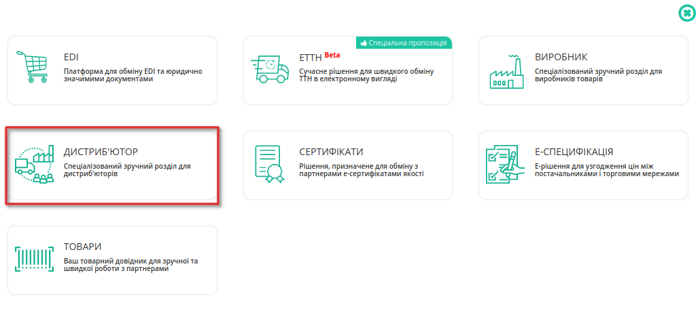
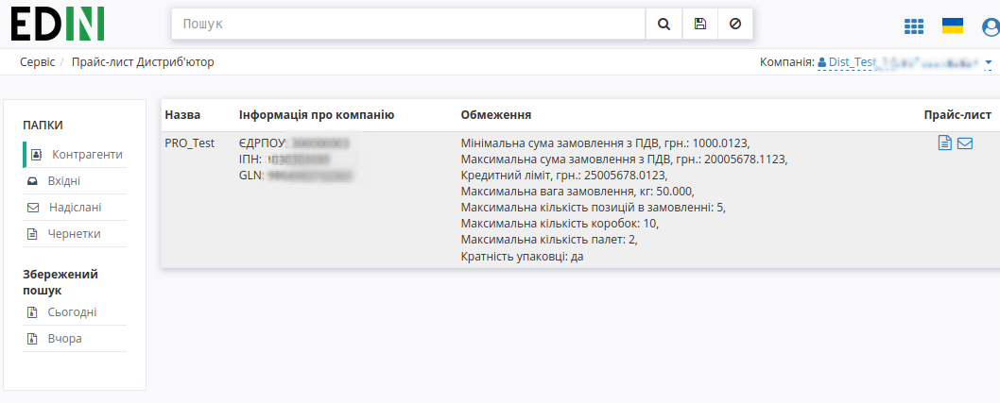
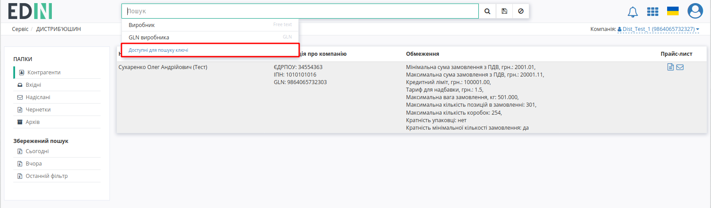
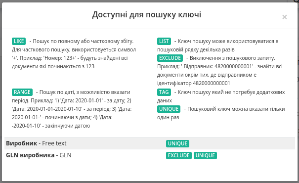
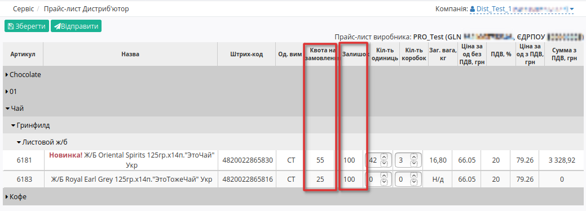
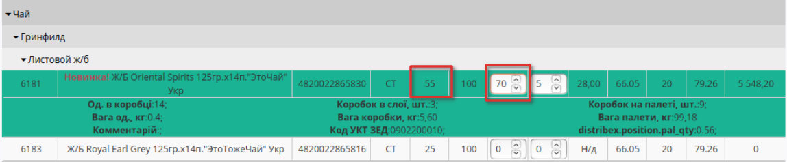
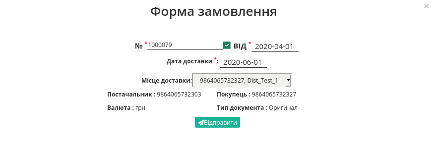

Створення замовлення по прайс-листу. Інструкція для дистриб'ютора
########################################################################
---------

.. contents:: Зміст:
   :depth: 2

---------

Вступ
===================================

EDIN-DISTRIBUTION — це комплексне електронне рішення, яке оптимізовує процеси взаємообміну електронними даними між виробниками та їх дистриб'юторами.

Дана інструкція описує порядок формування документа «Замовлення по прайсу» і обов’язкові для заповнення поля. Замовлення проводиться в бланку, основаному на даних для переданих виробником в документі Прайс-лист. Крім того, постачальником можуть бути встановлені обмеження щодо максимальної ваги, максимального об’єму, максимальної кількості позицій і мінімальній сумі замовленої партії й т.д.

.. note:: Всі дані, наведені в Інструкції - фіктивні, використовуються тільки в якості прикладу 

Перегляд списку виробників
===================================

Для перегляду списку контрагентів і подальшої роботи з прайс-листами необхідно виконати вхід в систему за допомогою наданих логіна і пароля. Далі серед доступних сервісів виберіть **Дистриб'ютор**

Після вибору сервісу відобразиться сторінка **Прайс-лист Дистриб'ютор** з усіма розділами, а саме вкладка з Контрагентами - виробниками. 

У таблиці подана така інформація про Контрагента:

 - Назва	
 - Інформація про компанію	
 - Обмеження	
 - Прайс-лист

Можливі дії з Контрагентами: 1 - **перегляд Обмежень** та 2 - **перегляд Прайс-листа**.

.. image:: pics_dlia_dystrybiutora/Instruktsiia_dlia_dystrybiutora_03.png
   :align: center

За допомогою зручного рядка пошуку можливо тонко відібрати потрібних контрагентів; доступні ключі пошуку:

Перегляд прайс-листа виробника
===================================

Для перегляду прайс-листа, натисніть на значок **Переглянути прайс-лист** (2) у відповідній колонці навпроти виробника.
Відкриється нове вікно прайс-листа з усіма доданими позиціями, згуртованими за лінійкою продукції, категоріями та підкатегоріями.

Каталог продукції в бланку замовлення по прайс-листу групується в три рівня. Можна приховувати окремі лінійки товарів, натиснувши на назву лінійки. Натискання на назву категорії приводить до відображення або приховання вмісту категорії групи.Кожна категорія може містити декілька підкатегорій з товарними позиціями.

Для колонок "Назва" та "Код виробника" передбачене сортування значень за зростанням згідно правила:

``пустоти, числа (від 0 до 9), пробіли, спецсимволи, букви від А до Z, букви від А до Я``

та за зменшенням в оберненому порядку.

Якщо виробник повідомляє своїх дистриб'юторів про залишки на складі, тобто відправляє в Прайс-листі свої дані про залишки продукції, то ці значення відображаються в бланку в колонці **Залишок**. Неможливо оформити більшу кількість товару, ніж залишок, навіть якщо не встановлена квота.

Встановлена виробником квота на максимальну кількість товару в одному замовленні відображаються у стовпці **Квота на замовлення**.

 Помітки *Новинка!*, *Акція!* та *Публічна позиція!* додає виробник.

Під табличною частиною з позиціями ви можете переглягути обмеження на замовлення, встановлені виробником.

.. image:: pics_dlia_dystrybiutora/Instruktsiia_dlia_dystrybiutora_04_2.png
   :align: center

Створення Замовлення по прайсу
===================================

Для створення Замовлення, необхідно заповнити ствопці **Кіл-ть одиниць** та **Кіл-ть коробок** враховуючи встановлені обмеження.

.. image:: pics_dlia_dystrybiutora/Instruktsiia_dlia_dystrybiutora_04.png
   :align: center

Після введення замовляємої кількості по позиції, автоматично для неї розраховується кількість коробок (палет), Загальна вага та Сума з ПДВ,грн.

При заповненнв кількості одиниць або кількості коробок, якщо поле позначене червоним  - перевірте, чи не перевищили ви обмеження та квоти, а також відповідність кількості одиниць до кількості коробок. В такому випадку, зменшите кількість товару в замовленні до рівня, який дозволяє дотримуватись обмежень. Натисніть на назву позиції або штрихкод для відображеня детальної інформації.

Якщо у вас виникнуть питання щодо значень встановлених обмежень, зверніться безпосередньо до постачальника.

Ви можете зберегти введену інформацію та повернутись до Замовлення пізніше - просто натисніть кнопку **Зберегти**, а якщо захочите продовжити оформлення, відкрийте прайс-лист виробника та продовжіть роботу.

.. image:: pics_dlia_dystrybiutora/Instruktsiia_dlia_dystrybiutora_005.png
   :align: center

Перед збереженням переконайтеся в тому, що не перевищено обмеження на розмір однієї партії в замовленні - в блоці Підсумки не повинно бути значень, виділених червоним кольором.

 Якщо ліміт по одному з встановлених обмежень перевищено, замовлення не відправиться.

Для оформлення замовлення натисніть кнопку **Відправити**.
Якщо кількість було введено неправильно, при спробі надіслати замовлення відобразиться інформаційне вікно з описом помилки. Якщо всі поля заповненно коректно, створиться **Форма Замовлення**  - поля відмічені червоною зірочкою *** обовязкові для заповнення**!

- №* - недоступно для редагування;
- від* - вкажіть дату замовлення;
- Дата доставки* - вкажіть дату доставки;
- Місце доставки - виберіть місце доставки з випадаючого списку 
- Постачальник - GLN виробника з прайс-листа, недоступно для редагування; 
- Покупець - GLN дистриб'ютора з прайс-листа, недоступно для редагування;
- Валюта: грн - недоступно для редагування;
- Тип документа: Оригинал - недоступно для редагування;

Після заповнення усіх полів (й лише тоді) стане активною кпопка **Відправити**. 

Робота з EDI та ЮЗД
===================================

Користувачу доступна робота з наступними документами:

* `Замовлення (ORDERS) <https://wiki.edin.ua/uk/latest/XML/XML-structure.html#order>`__
* `Підтвердження замовлення (ORDRSP) <https://wiki.edin.ua/uk/latest/XML/XML-structure.html#ordrsp>`__
* `Повідомлення про відвантаження (DESADV) <https://wiki.edin.ua/uk/latest/XML/XML-structure.html#desadv>`__
* `Повідомлення про прийом (RECADV) <https://wiki.edin.ua/uk/latest/XML/XML-structure.html#recadv>`__
* `Рахунок (INVOICE) <https://wiki.edin.ua/uk/latest/XML/XML-structure.html#invoice>`__
* `Видаткова накладна (COMDOC_006) <https://wiki.edin.ua/uk/latest/XML/XML-structure.html#comdoc-006>`__

Для зручності документи логічно пов'язуються в так звані ланцюжки. Далі представлені можливі схеми/комбінації документообігу (в дужках вказаний відправник документу):

1) ORDERS (дистриб'ютор) -> ORDRSP (виробник) -> DESADV (виробник) -> RECADV (дистриб'ютор) -> INVOICE (виробник)
2) ORDERS (дистриб'ютор) -> ORDRSP (виробник) -> DESADV (виробник) -> COMDOC_006 (виробник)
3) ORDERS (дистриб'ютор) -> ORDRSP (виробник) -> INVOICE (виробник)
4) ORDERS (дистриб'ютор) -> ORDRSP (виробник) -> COMDOC_006 (виробник)
5) ORDERS (дистриб'ютор) -> ORDRSP (виробник) -> RECADV (дистриб'ютор) -> INVOICE (виробник)
6) ORDERS (дистриб'ютор) -> DESADV (виробник) -> RECADV (дистриб'ютор) -> INVOICE (виробник)
7) ORDERS (дистриб'ютор) -> DESADV (виробник) -> COMDOC_006 (виробник)
8) ORDERS (дистриб'ютор) -> INVOICE (виробник)
9) ORDERS (дистриб'ютор) -> COMDOC_006 (виробник)

Перегляд Замовлення
---------------------------------

Після відправки, Замовлення вже не доступно для редагування, його можна лише переглянути в папці *Надіслані*.
У замовлені ви можете перевірити такі данні як наприклад GLN Покупця, GLN Місця доставки, або дату коли поставка відбудеться.
Ви можете скачати замовлення у форматі .pdf, .xls, .xml, .zip або відразу відправити на друк.

.. image:: pics_dlia_dystrybiutora/Instruktsiia_dlia_dystrybiutora_order_1.png
   :align: center

Користувачі замовника, наприклад, співробітники бухгалтерії, зайшовши в відправлений документ, можуть додавати до нього свої Коментарі. Видалити коментар неможливо.

.. image:: pics_dlia_dystrybiutora/Instruktsiia_dlia_dystrybiutora_order_2.png
   :align: center

Отримувач Замовлення також може лишати в ньому коментарі.

FAQ / Часті запитання
===================================

**Що робити, якщо Прайс-лист порожній?**

Зверніться до служби технічної підтримки АТС, і ми подбаємо про його завантаження постачальником для вашої компанії. 
Також, звернувшись до постачальника, ви можете уточнити причину, по якій вам не надано Прайс-лист і узгодити надання.

**Що робити, якщо ціни в прайсі не актуальні?**

Всі дані, що містяться в Прайс-листі, отримуються безпосередньо від постачальника. В такому випадку необхідно звернутися до відповідного постачальника для узгодження цін і подальшої актуалізації Прайс-листа.

**Як підключити Прайс-лист іншого Виробника?**

Для вирішення даного питання зверніться до свого менеджера компанії АТС.

**Чи можу я надсилати замовлення зі своєї облікової системи та як це зробити?**

Для відправки замовлення з облікової системи потрібні додаткові налаштування. Як це зробити підкаже ваші відповідальні менеджери компанії АТС.

-------------------------------------

.. include:: /_constant/kontakti.rst