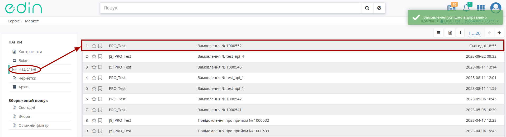
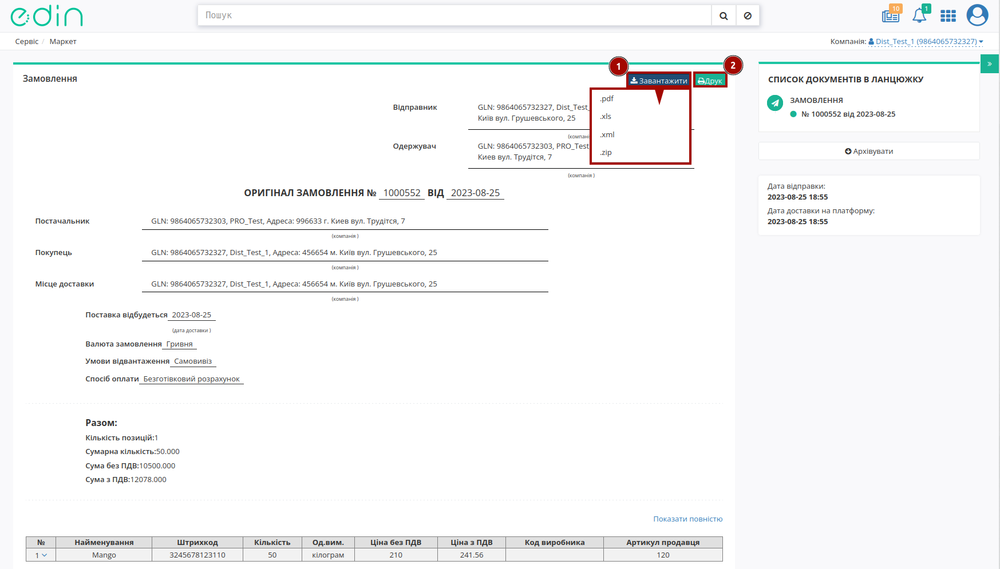

Створення замовлення по прайс-листу. Інструкція для дистриб'ютора
########################################################################

.. role:: red

.. role:: green

.. role:: blue

.. role:: orange

.. role:: underline

.. сюда закину немного картинок для текста

.. |view_price| image:: pics_dlia_dystrybiutora/Instruktsiia_dlia_dystrybiutora_014.png

.. |get_price| image:: pics_dlia_dystrybiutora/Instruktsiia_dlia_dystrybiutora_015.png

.. contents:: Зміст:
   :depth: 2

---------

Вступ
===================================

**Маркет** — це комплексне електронне рішення, яке оптимізує процеси обміну електронними даними між Виробниками та їх Дистриб'юторами.

Дана інструкція описує порядок формування документа `Замовлення (ORDERS) <https://wiki.edin.ua/uk/latest/Distribution/EDIN_2_0/XML/XML_structure.html#order>`__ за `Прайс-листом (PRICAT) <https://wiki.edin.ua/uk/latest/Distribution/EDIN_2_0/XML/XML_structure.html#pricat>`__.

1 Вхід на платформу
====================================

.. include:: /general_2_0/rabota_s_platformoj_EDIN_2.0.rst
   :start-after: .. початок блоку для Enter
   :end-before: .. кінець блоку для Enter

Після успішної авторизації відкриється основне меню, де у вкладці **"Продукти та рішення"** EDIN потрібно обрати сервіс **Маркет**:

.. image:: /_constant/pics_landing/landing_distribution.png
   :align: center

2 Перегляд списку Виробників
===================================

.. початок блоку для Order_create1

Після вибору сервісу відобразиться сторінка з Виробниками (папка "Контрагенти"): 

.. image:: /Distribution/EDIN_2_0/Instructions_2_0/pics_dlia_dystrybiutora/Instruktsiia_dlia_dystrybiutora_033.png
   :align: center

У таблиці подана основна інформація про Виробника (Назва, Інформація про компанію, Обмеження, Прайс-лист).

.. important::
   Виробником можуть бути встановлені **Обмеження** щодо максимальної ваги, максимального об’єму, максимальної кількості позицій і мінімальній сумі замовленої партії й т.д., яких потрібно дотримуватись при формуванні "Замовлення".

   .. image:: /Distribution/EDIN_2_0/Instructions_2_0/pics_dlia_dystrybiutora/Instruktsiia_dlia_dystrybiutora_034.png
      :align: center

Для початку роботи можливо **Запросити прайс-лист** (|get_price|) у Виробника чи **Переглянути прайс-лист** (|view_price|):

.. image:: /Distribution/EDIN_2_0/Instructions_2_0/pics_dlia_dystrybiutora/Instruktsiia_dlia_dystrybiutora_035.png
   :align: center

За допомогою зручного рядка пошуку можливо відфільтрувати потрібних контрагентів:

.. image:: /Distribution/EDIN_2_0/Instructions_2_0/pics_dlia_dystrybiutora/Instruktsiia_dlia_dystrybiutora_016.gif
   :align: center

Всі доступні ключі пошуку:

.. image:: /Distribution/EDIN_2_0/Instructions_2_0/pics_dlia_dystrybiutora/Instruktsiia_dlia_dystrybiutora_017.gif
   :align: center

.. кінець блоку для Order_create1

.. _prod-pricelist:

3 Перегляд прайс-листа Виробника
===================================

.. початок блоку для Order_create2

Для перегляду прайс-листа, натисніть на значок **Переглянути прайс-лист** (|view_price|) у відповідній колонці навпроти обраного Виробника:

.. image:: /Distribution/EDIN_2_0/Instructions_2_0/pics_dlia_dystrybiutora/Instruktsiia_dlia_dystrybiutora_036.png
   :align: center

Відкриється нове вікно прайс-листа з усіма доданими позиціями, згуртованими за лінійкою продукції, категоріями та підкатегоріями:

.. image:: /Distribution/EDIN_2_0/Instructions_2_0/pics_dlia_dystrybiutora/Instruktsiia_dlia_dystrybiutora_054.png
   :align: center

Каталог продукції в бланку замовлення по прайс-листу групується в три рівня. Можна приховувати окремі лінійки товарів, натиснувши на назву лінійки. Натискання на назву категорії призводить до відображення або приховування вмісту категорії групи. Кожна категорія може містити декілька підкатегорій з товарними позиціями.

Для колонок "Назва" та "Код виробника" передбачене сортування значень за зростанням згідно правила:

``пустоти, числа (від 0 до 9), пробіли, спецсимволи, букви від А до Z, букви від А до Я`` та за зменшенням в оберненому порядку.

.. image:: /Distribution/EDIN_2_0/Instructions_2_0/pics_dlia_dystrybiutora/Instruktsiia_dlia_dystrybiutora_019.gif
   :align: center

Якщо Виробник повідомляє своїх Дистриб'юторів про залишки на складі, тобто відправляє в Прайс-листі свої дані про залишки продукції, то ці значення відображаються в бланку в колонці **Залишок**. Неможливо оформити більшу кількість товару, ніж **Залишок**, навіть якщо не встановлена **Квота на замовлення** (максимальна кількість товару в одному замовленні, встановлена Виробником).

.. image:: /Distribution/EDIN_2_0/Instructions_2_0/pics_dlia_dystrybiutora/Instruktsiia_dlia_dystrybiutora_055.png
   :align: center

.. hint::
   Якщо Виробник в обраній позиції вказує "Кратність", то при формуванні "Замовлення" Покупцем кількість замовлених позицій має бути кратною вказаній кількості. Наприклад, якщо "Кратність"=3, то "Кількість одиниць" для формування "Замовлення" може бути 3, 6, 9...

   .. image:: /Distribution/EDIN_2_0/Instructions_2_0/pics_dlia_dystrybiutora/Instruktsiia_dlia_dystrybiutora_056.png
      :align: center

Помітки :red:`Новинка!`, :blue:`Акція!`, :green:`Публічна позиція!` та :orange:`Надбавка!` додає Виробник.

Під табличною частиною з позиціями ви можете переглягути обмеження на замовлення, встановлені виробником (за відсутності обмеження в прайс-листі відображається прочерк "-" ):

.. image:: /Distribution/EDIN_2_0/Instructions_2_0/pics_dlia_dystrybiutora/Instruktsiia_dlia_dystrybiutora_008.png
   :align: center

.. кінець блоку для Order_create2

4 Створення Замовлення за Прайс-листом
=================================================

.. початок блоку для Order_create3

При створенні `Замовлення (ORDERS) <https://wiki.edin.ua/uk/latest/Distribution/EDIN_2_0/XML/XML_structure.html#order>`__ варто враховувати встановлені Виробником **Обмеження** та кратності, що зазначаються за кожною позицією окремо. Документ формується через заповнення значень у ствопцях **Кількість одиниць** та **Кількість коробок**:

.. image:: /Distribution/EDIN_2_0/Instructions_2_0/pics_dlia_dystrybiutora/Instruktsiia_dlia_dystrybiutora_057.png
   :align: center

.. hint::
   У Виробника є можливість (за домовленістю) надіслати Вам в кошик "Попереднє замовлення", в якому Виробник зазначає рекомендовані (персонально для Вас) товари та кількості до замовлення. В цьому випадку при перегляді прайс-листа товари і кількості вже вказані і Ви можете одразу **"+Створити замовлення"** (всі рекомендовані кількості доступні до редагування).

   Коли Виробник надсилає Вам свої рекомендації Ви отримуєте `повідомлення "в дзвіночок" <https://wiki.edin.ua/uk/latest/general_2_0/rabota_s_platformoj_EDIN_2.0.html#messages>`__ та лист на пошту:

   .. image:: /Distribution/EDIN_2_0/Instructions_2_0/pics_dlia_dystrybiutora/Instruktsiia_dlia_dystrybiutora_053.png
      :align: center

   При натисканні на кнопку **"Перевірити кошик"** відкривається прайс-лист з рекомендаціями Виробника. 

Значення в цих колонках можливо вносити **вручну**, обираючи потрібні поля, або за допомогою XLSX/XLS файлу (кнопка **"Завантажити з Excel"**). Для масового внесення кількостей за товарами за допомогою файла потрібно спочатку **"Скачати шаблон"**:

.. image:: /Distribution/EDIN_2_0/Instructions_2_0/pics_dlia_dystrybiutora/Instruktsiia_dlia_dystrybiutora_049.png
   :align: center

Відкрийте та заповніть файл Excel. Заповнений Вашими даними файл можливо додати за допомогою кнопки **"Завантажити шаблон"**:

.. image:: /Distribution/EDIN_2_0/Instructions_2_0/pics_dlia_dystrybiutora/Instruktsiia_dlia_dystrybiutora_051.png
   :align: center

.. important::
   Зверніть увагу! Видаляти, міняти місцями колонки в Excel файлі не можна. Колонки виділенні зеленим кольором - **обов'язкові до заповнення**! Пара значень "Штрихкод"-"Артикул" повинна бути унікальною на рівні Замовлення (перевірка на дублі - додається лише перше значення). Якщо будь-яку з позицій буде заповнено некоректно, при додаванні файлу на платформі відображається підказка з переліком помилок в конкретних рядках, що потібно виправити:

   .. image:: /Distribution/EDIN_2_0/Instructions_2_0/pics_dlia_dystrybiutora/Instruktsiia_dlia_dystrybiutora_050.png
      :align: center

Після вказання кількості, що повинна бути замовлена в сервісі EDIN **Маркет** автоматично для цієї позиції та для всього документа `Замовлення (ORDERS) <https://wiki.edin.ua/uk/latest/Distribution/EDIN_2_0/XML/XML_structure.html#order>`__ розраховуються значення:

* Загальна кіл-ть позицій в замовленні = кількість блоків в POSITION в Замовленні (ORDERS) 
* Загальна кіл-ть коробок = сума всіх значень BOXESCOUNT в Замовленні (ORDERS)
* Загальна кіл-ть палет = сума всіх значень PALLETS в Замовленні (ORDERS)
* Загальна вага замовлення = сума всіх значень множників WEIGHT * BOXESCOUNT в Замовленні (ORDERS)
* Сумма замовлення з ПДВ = сума всіх значень множників ORDEREDQUANTITY * PRICEWITHVAT в Замовленні (ORDERS)
* Сума замовлення без ПДВ = сума всіх значень множників ORDEREDQUANTITY * ORDERPRICE в Замовленні (ORDERS)

.. image:: /Distribution/EDIN_2_0/Instructions_2_0/pics_dlia_dystrybiutora/Instruktsiia_dlia_dystrybiutora_009.png
   :align: center

Натисніть на дані позиції для відображеня детальної інформації про товар:

.. image:: /Distribution/EDIN_2_0/Instructions_2_0/pics_dlia_dystrybiutora/Instruktsiia_dlia_dystrybiutora_040.gif
   :align: center

Ви можете **Зберегти** введену інформацію та повернутись до Замовлення пізніше, для продовження оформлення якого повторно відкрийте прайс-лист Виробника та продовжіть роботу.

.. image:: /Distribution/EDIN_2_0/Instructions_2_0/pics_dlia_dystrybiutora/Instruktsiia_dlia_dystrybiutora_052.png
   :align: center

При заповненні кількості одиниць або кількості коробок, якщо поле позначене червоним - перевірте, чи не перевищили ви обмеження та квоти, а також відповідність кількості одиниць до кількості коробок. В випадку невідповідності до квот чи обмежень потрібно зменшити кількість товару в замовленні до значення, яке дозволяє **"+Створити замовлення"**:

.. image:: /Distribution/EDIN_2_0/Instructions_2_0/pics_dlia_dystrybiutora/Instruktsiia_dlia_dystrybiutora_042.gif
   :align: center

Перед збереженням переконайтеся в тому, що не перевищено обмеження на розмір однієї партії в замовленні - в блоці Підсумки не повинно бути значень, виділених червоним кольором. Якщо ліміт по одному з встановлених обмежень перевищено, `Замовлення (ORDERS) <https://wiki.edin.ua/uk/latest/Distribution/EDIN_2_0/XML/XML_structure.html#order>`__ не створиться.

Якщо у Вас виникнуть питання щодо значень встановлених обмежень, зверніться безпосередньо до Виробника. 

При введених значеннях, що відповідають квотам/обмеженням документ `Замовлення (ORDERS) <https://wiki.edin.ua/uk/latest/Distribution/EDIN_2_0/XML/XML_structure.html#order>`__ при **"+Створенні замовлення"** потрібно на "Формі замовлення" заповнити всі поля, позначені червоною зірочкою :red:`*` - **обов'язкові до заповнення**:

.. image:: /Distribution/EDIN_2_0/Instructions_2_0/pics_dlia_dystrybiutora/Instruktsiia_dlia_dystrybiutora_043.png
   :align: center

- №* - доступно для редагування (за відсутності відмітки);
- від* - вкажіть дату замовлення;
- Дата доставки* - вкажіть дату доставки;
- Місце доставки - виберіть місце доставки з випадаючого списку;
- Умови відвантаження (Самовивіз/Доставка транспортом виробника);
- Спосіб оплати (Готівковий/Безготівковий рахунок);
- Постачальник - GLN виробника з прайс-листа, недоступно для редагування; 
- Покупець - GLN дистриб'ютора з прайс-листа, недоступно для редагування;
- Валюта: грн - недоступно для редагування;
- Тип документа: Оригинал - недоступно для редагування.

.. image:: /Distribution/EDIN_2_0/Instructions_2_0/pics_dlia_dystrybiutora/Instruktsiia_dlia_dystrybiutora_031.gif
   :align: center

Після перевірки та заповнення основих даних документа його можливо **Надіслати**:

.. image:: /Distribution/EDIN_2_0/Instructions_2_0/pics_dlia_dystrybiutora/Instruktsiia_dlia_dystrybiutora_028.png
   :align: center

.. кінець блоку для Order_create3

4.1 Перегляд Замовлення
---------------------------------

Після відправки `Замовлення (ORDERS) <https://wiki.edin.ua/uk/latest/Distribution/EDIN_2_0/XML/XML_structure.html#order>`__ документ стає недоступним до редагування, його можливо лише переглянути в папці "Надіслані":

У `Замовленні (ORDERS) <https://wiki.edin.ua/uk/latest/Distribution/EDIN_2_0/XML/XML_structure.html#order>`__ Ви можете перевірити вказані дані (GLN Покупця, GLN Місця доставки, дату поставки...), табличну частину з товарними позиціями. Ви можете **"Завантажити"** (1) Замовлення у форматі .pdf, .xls, .xml, .zip або відразу відправити документ на друк (2):

В табличній частині відображається основна інформація, для ознайомлення з усією інформацією за товарною позицією предбачені кнопки **∨** / **∧** в "№" позиції та **"Показти повністю"** / **"Згорнути"** для всієї таблиці:

.. image:: pics_dlia_dystrybiutora/Instruktsiia_dlia_dystrybiutora_022.gif
   :align: center

Користувачі замовника, наприклад, співробітники бухгалтерії, зайшовши в відправлений документ, можуть додавати до нього свої Коментарі (видалити коментар неможливо):

.. image:: pics_dlia_dystrybiutora/Instruktsiia_dlia_dystrybiutora_023.gif
   :align: center

Отримувач Замовлення (Виробник) також може лишати в ньому коментарі.

Робота з EDI та ЮЗД
===================================

Користувачу доступна робота з наступними документами:

* `Замовлення (ORDERS) <https://wiki.edin.ua/uk/latest/EDIN_Specs/XML/ORDER_x.html>`__
* `Підтвердження замовлення (ORDRSP) <https://wiki.edin.ua/uk/latest/EDIN_Specs/XML/ORDRSP_x.html>`__
* `Повідомлення про відвантаження (DESADV) <https://wiki.edin.ua/uk/latest/EDIN_Specs/XML/DESADV_x.html>`__
* `Повідомлення про прийом (RECADV) <https://wiki.edin.ua/uk/latest/EDIN_Specs/XML/RECADV_x.html>`__
* `Рахунок (INVOICE) <https://wiki.edin.ua/uk/latest/EDIN_Specs/XML/INVOICE_x.html>`__
* `Видаткова накладна (COMDOC_006) <https://wiki.edin.ua/uk/latest/EDIN_Specs/XML/COMDOC_006_x.html>`__

Для зручності документи логічно пов'язуються в так звані ланцюжки. Далі представлені можливі схеми/комбінації документообігу (в дужках вказаний відправник документу):

1) ORDERS (дистриб'ютор) -> ORDRSP (виробник) -> DESADV (виробник) -> RECADV (дистриб'ютор) -> INVOICE (виробник)
2) ORDERS (дистриб'ютор) -> ORDRSP (виробник) -> DESADV (виробник) -> COMDOC_006 (виробник)
3) ORDERS (дистриб'ютор) -> ORDRSP (виробник) -> INVOICE (виробник)
4) ORDERS (дистриб'ютор) -> ORDRSP (виробник) -> COMDOC_006 (виробник)
5) ORDERS (дистриб'ютор) -> ORDRSP (виробник) -> RECADV (дистриб'ютор) -> INVOICE (виробник)
6) ORDERS (дистриб'ютор) -> DESADV (виробник) -> RECADV (дистриб'ютор) -> INVOICE (виробник)
7) ORDERS (дистриб'ютор) -> DESADV (виробник) -> COMDOC_006 (виробник)
8) ORDERS (дистриб'ютор) -> INVOICE (виробник)
9) ORDERS (дистриб'ютор) -> COMDOC_006 (виробник)

FAQ / Часті запитання
===================================

**Що робити, якщо Прайс-лист порожній?**

Зверніться до служби технічної підтримки АТС, і ми подбаємо про його завантаження постачальником для вашої компанії. 
Також, звернувшись до постачальника, ви можете уточнити причину, по якій вам не надано Прайс-лист і узгодити надання.

**Що робити, якщо ціни в прайсі не актуальні?**

Всі дані, що містяться в Прайс-листі, отримуються безпосередньо від постачальника. В такому випадку необхідно звернутися до відповідного постачальника для узгодження цін і подальшої актуалізації Прайс-листа.

**Як підключити Прайс-лист іншого Виробника?**

Для вирішення даного питання зверніться до свого менеджера компанії АТС.

**Чи можу я надсилати замовлення зі своєї облікової системи та як це зробити?**

Для відправки замовлення з облікової системи потрібні додаткові налаштування. Як це зробити підкаже ваші відповідальні менеджери компанії АТС.

-------------------------------------

.. include:: /_constant/kontakti.rst