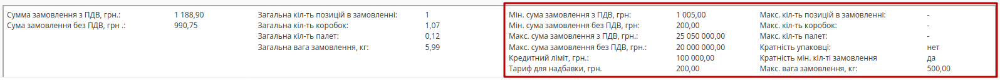
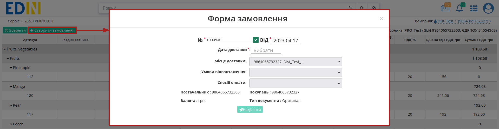
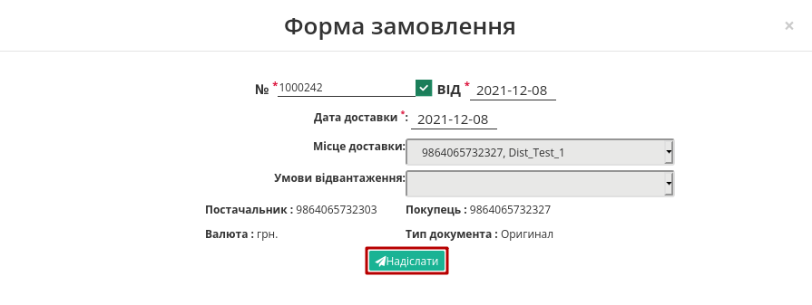

Створення замовлення по прайс-листу. Інструкція для дистриб'ютора
########################################################################

.. role:: red

.. role:: green

.. role:: blue

.. role:: orange

.. role:: underline

.. сюда закину немного картинок для текста

.. |get_price| image:: pics_dlia_dystrybiutora/Instruktsiia_dlia_dystrybiutora_015.png

.. contents:: Зміст:
   :depth: 2

---------

Вступ
===================================

**Дистриб'юшн** — це комплексне електронне рішення, яке оптимізовує процеси взаємообміну електронними даними між Виробниками та їх Дистриб'юторами.

Дана інструкція описує порядок формування документа `Замовлення (ORDERS) <https://wiki.edin.ua/uk/latest/Distribution/EDIN_2_0/XML/XML_structure.html#order>`__ за `Прайс-листом (PRICAT) <https://wiki.edin.ua/uk/latest/Distribution/EDIN_2_0/XML/XML_structure.html#pricat>`__.

1 Вхід на платформу
====================================

.. include:: /general_2_0/rabota_s_platformoj_EDIN_2.0.rst
   :start-after: .. початок блоку для Enter
   :end-before: .. кінець блоку для Enter

Після успішної авторизації відкриється основне меню, де у вкладці **"Продути та рішення"** EDIN потрібно обрати сервіс **Дистриб'юшн**:

2 Перегляд списку Виробників
===================================

Після вибору сервісу відобразиться сторінка з Виробниками (папка "Контрагенти"): 

У таблиці подана основна інформація про Виробника (Назва, Інформація про компанію, Обмеження, Прайс-лист).

.. important::
   Виробником можуть бути встановлені **Обмеження** щодо максимальної ваги, максимального об’єму, максимальної кількості позицій і мінімальній сумі замовленої партії й т.д., яких потрібно дотримуватись при формуванні "Замовлення".

   .. image:: pics_dlia_dystrybiutora/Instruktsiia_dlia_dystrybiutora_012.png
      :align: center

Для початку роботи можливо **Запросити прайс-лист** (|get_price|) у Виробника чи **Переглянути прайс-лист** (|view_price|):

За допомогою зручного рядка пошуку можливо відфільтрувати потрібних контрагентів:

Всі доступні ключі пошуку:

3 Перегляд прайс-листа Виробника
===================================

Для перегляду прайс-листа, натисніть на значок **Переглянути прайс-лист** (|view_price|) у відповідній колонці навпроти обраного Виробника. Відкриється нове вікно прайс-листа з усіма доданими позиціями, згуртованими за лінійкою продукції, категоріями та підкатегоріями:

Каталог продукції в бланку замовлення по прайс-листу групується в три рівня. Можна приховувати окремі лінійки товарів, натиснувши на назву лінійки. Натискання на назву категорії призводить до відображення або приховування вмісту категорії групи. Кожна категорія може містити декілька підкатегорій з товарними позиціями.

Для колонок "Назва" та "Код виробника" передбачене сортування значень за зростанням згідно правила:

``пустоти, числа (від 0 до 9), пробіли, спецсимволи, букви від А до Z, букви від А до Я`` та за зменшенням в оберненому порядку.

Якщо Виробник повідомляє своїх Дистриб'юторів про залишки на складі, тобто відправляє в Прайс-листі свої дані про залишки продукції, то ці значення відображаються в бланку в колонці **Залишок**. Неможливо оформити більшу кількість товару, ніж **Залишок**, навіть якщо не встановлена **Квота на замовлення** (максимальна кількість товару в одному замовленні, встановлена Виробником).

Помітки :red:`Новинка!`, :blue:`Акція!`, :green:`Публічна позиція!` та :orange:`Надбавка!` додає Виробник.

Під табличною частиною з позиціями ви можете переглягути обмеження на замовлення, встановлені виробником (за відсутності обмеження в прайс-листі відображається прочерк "-" ):

4 Створення Замовлення за Прайс-листом
=================================================

Для створення `Замовлення (ORDERS) <https://wiki.edin.ua/uk/latest/Distribution/EDIN_2_0/XML/XML_structure.html#order>`__ необхідно заповнити ствопці **Кількість одиниць** та **Кількість коробок** враховуючи встановлені Виробником **Обмеження**:

Після введення кількості, що повинна бути замовлена в сервісі EDIN **Дистриб'юшн** автоматично для цієї позиції та для всього документа `Замовлення (ORDERS) <https://wiki.edin.ua/uk/latest/Distribution/EDIN_2_0/XML/XML_structure.html#order>`__ розраховуються значення:

* Загальна кіл-ть позицій в замовленні = кількість блоків в POSITION в Замовленні (ORDERS) 
* Загальна кіл-ть коробок = сума всіх значень BOXESCOUNT в Замовленні (ORDERS)
* Загальна кіл-ть палет = сума всіх значень PALLETS в Замовленні (ORDERS)
* Загальна вага замовлення = сума всіх значень множників WEIGHT * BOXESCOUNT в Замовленні (ORDERS)
* Сумма замовлення з ПДВ = сума всіх значень множників ORDEREDQUANTITY * PRICEWITHVAT в Замовленні (ORDERS)
* Сума замовлення без ПДВ = сума всіх значень множників ORDEREDQUANTITY * ORDERPRICE в Замовленні (ORDERS)

.. image:: pics_dlia_dystrybiutora/Instruktsiia_dlia_dystrybiutora_009.png
   :align: center

Натисніть на дані позиції для відображеня детальної інформації про товар:

Ви можете **Зберегти** введену інформацію та повернутись до Замовлення пізніше, для продовження оформлення якого повторно відкрийте прайс-лист Виробника та продовжіть роботу.

При заповненні кількості одиниць або кількості коробок, якщо поле позначене червоним - перевірте, чи не перевищили ви обмеження та квоти, а також відповідність кількості одиниць до кількості коробок. В випадку невідповідності до квот чи обмежень потрібно зменшити кількість товару в замовленні до значення, яке дозволяє **"+Створити замовлення"**:

Перед збереженням переконайтеся в тому, що не перевищено обмеження на розмір однієї партії в замовленні - в блоці Підсумки не повинно бути значень, виділених червоним кольором. Якщо ліміт по одному з встановлених обмежень перевищено, `Замовлення (ORDERS) <https://wiki.edin.ua/uk/latest/Distribution/EDIN_2_0/XML/XML_structure.html#order>`__ не створиться.

Якщо у Вас виникнуть питання щодо значень встановлених обмежень, зверніться безпосередньо до Виробника. 

При введених значеннях, що відповідають квотам/обмеженням документ `Замовлення (ORDERS) <https://wiki.edin.ua/uk/latest/Distribution/EDIN_2_0/XML/XML_structure.html#order>`__ при **"+Створенні замовлення"** потрібно на "Формі замовлення" заповнити всі поля, позначені червоною зірочкою :red:`*` - **обов'язкові до заповнення**:

- №* - недоступно для редагування;
- від* - вкажіть дату замовлення;
- Дата доставки* - вкажіть дату доставки;
- Місце доставки - виберіть місце доставки з випадаючого списку 
- Постачальник - GLN виробника з прайс-листа, недоступно для редагування; 
- Покупець - GLN дистриб'ютора з прайс-листа, недоступно для редагування;
- Валюта: грн - недоступно для редагування;
- Тип документа: Оригинал - недоступно для редагування.

Після перевірки та заповнення основих даних документа його можливо **Надіслати**:

4.1 Перегляд Замовлення
---------------------------------

Після відправки `Замовлення (ORDERS) <https://wiki.edin.ua/uk/latest/Distribution/EDIN_2_0/XML/XML_structure.html#order>`__ документ стає недоступним до редагування, його можливо лише переглянути в папці "Надіслані":

У `Замовленні (ORDERS) <https://wiki.edin.ua/uk/latest/Distribution/EDIN_2_0/XML/XML_structure.html#order>`__ Ви можете перевірити вказані дані (GLN Покупця, GLN Місця доставки, дату поставки...), табличну частину з товарними позиціями. Ви можете **"Скачати"** (1) Замовлення у форматі .pdf, .xls, .xml, .zip або відразу відправити документ на друк (2):

В табличній частині відображається основна інформація, для ознайомлення з усією інформацією за товарною позицією предбачені кнопки **∨** / **∧** в "№" позиції та **"Показти повністю"** / **"Згорнути"** для всієї таблиці:

Користувачі замовника, наприклад, співробітники бухгалтерії, зайшовши в відправлений документ, можуть додавати до нього свої Коментарі (видалити коментар неможливо):

.. image:: pics_dlia_dystrybiutora/Instruktsiia_dlia_dystrybiutora_023.gif
   :align: center

Отримувач Замовлення (Виробник) також може лишати в ньому коментарі.

Робота з EDI та ЮЗД
===================================

Користувачу доступна робота з наступними документами:

* `Замовлення (ORDERS) <https://wiki.edin.ua/uk/latest/XML/XML-structure.html#order>`__
* `Підтвердження замовлення (ORDRSP) <https://wiki.edin.ua/uk/latest/XML/XML-structure.html#ordrsp>`__
* `Повідомлення про відвантаження (DESADV) <https://wiki.edin.ua/uk/latest/XML/XML-structure.html#desadv>`__
* `Повідомлення про прийом (RECADV) <https://wiki.edin.ua/uk/latest/XML/XML-structure.html#recadv>`__
* `Рахунок (INVOICE) <https://wiki.edin.ua/uk/latest/XML/XML-structure.html#invoice>`__
* `Видаткова накладна (COMDOC_006) <https://wiki.edin.ua/uk/latest/XML/XML-structure.html#comdoc-006>`__

Для зручності документи логічно пов'язуються в так звані ланцюжки. Далі представлені можливі схеми/комбінації документообігу (в дужках вказаний відправник документу):

1) ORDERS (дистриб'ютор) -> ORDRSP (виробник) -> DESADV (виробник) -> RECADV (дистриб'ютор) -> INVOICE (виробник)
2) ORDERS (дистриб'ютор) -> ORDRSP (виробник) -> DESADV (виробник) -> COMDOC_006 (виробник)
3) ORDERS (дистриб'ютор) -> ORDRSP (виробник) -> INVOICE (виробник)
4) ORDERS (дистриб'ютор) -> ORDRSP (виробник) -> COMDOC_006 (виробник)
5) ORDERS (дистриб'ютор) -> ORDRSP (виробник) -> RECADV (дистриб'ютор) -> INVOICE (виробник)
6) ORDERS (дистриб'ютор) -> DESADV (виробник) -> RECADV (дистриб'ютор) -> INVOICE (виробник)
7) ORDERS (дистриб'ютор) -> DESADV (виробник) -> COMDOC_006 (виробник)
8) ORDERS (дистриб'ютор) -> INVOICE (виробник)
9) ORDERS (дистриб'ютор) -> COMDOC_006 (виробник)

FAQ / Часті запитання
===================================

**Що робити, якщо Прайс-лист порожній?**

Зверніться до служби технічної підтримки АТС, і ми подбаємо про його завантаження постачальником для вашої компанії. 
Також, звернувшись до постачальника, ви можете уточнити причину, по якій вам не надано Прайс-лист і узгодити надання.

**Що робити, якщо ціни в прайсі не актуальні?**

Всі дані, що містяться в Прайс-листі, отримуються безпосередньо від постачальника. В такому випадку необхідно звернутися до відповідного постачальника для узгодження цін і подальшої актуалізації Прайс-листа.

**Як підключити Прайс-лист іншого Виробника?**

Для вирішення даного питання зверніться до свого менеджера компанії АТС.

**Чи можу я надсилати замовлення зі своєї облікової системи та як це зробити?**

Для відправки замовлення з облікової системи потрібні додаткові налаштування. Як це зробити підкаже ваші відповідальні менеджери компанії АТС.

-------------------------------------

.. include:: /_constant/kontakti.rst