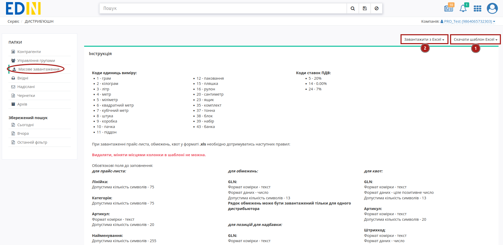
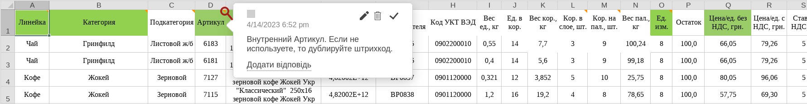

Створення прайс-листа. Інструкція для виробника.
#################################################################

.. role:: red

.. role:: green

.. role:: underline

.. сюда закину немного картинок для текста

.. |шестерня| image:: pics_dlia_vyrobnyka/Instruktsiia_dlia_vyrobnyka_16.png

.. |смітник| image:: pics_dlia_vyrobnyka/Instruktsiia_dlia_vyrobnyka_19.png

.. |прайс_лист| image:: pics_dlia_vyrobnyka/Instruktsiia_dlia_vyrobnyka_26.png

.. |pencil| image:: pics_dlia_vyrobnyka/Instruktsiia_dlia_vyrobnyka_34.png

.. :underline:`"Чернетки" для ролі "Організатор"`

.. contents:: Зміст:
   :depth: 2

---------

**Вступ**
=========

EDIN-DISTRIBUTION — це комплексне електронне рішення, яке оптимізовує процеси взаємообміну е-даними між виробниками та їх дистриб'юторами. Інструкція описує додавання та редагування прайс-листа, обмежень та квот, перегляд списку дистрибʼюторів та замовлень. 

.. note:: Всі дані, наведені в Інструкції - фіктивні, використовуються тільки в якості прикладу 

**1 Робота з дистриб'юторами**
===================================

Для перегляду списку покупців і подальшої роботи з прайс-листами необхідно виконати вхід в систему за допомогою наданих логіна і пароля. Далі серед доступних сервісів виберіть **Дистриб'юшин**

Після вибору сервісу відобразиться сторінка **Прайс-лист Виробник** з усіма розділами, а саме вкладка з Контрагентами - дистриб'юторами. 

У таблиці подана така інформація про Контрагента:

 - Назва	
 - Інформація про компанію	
 - Група	
 - Обмеження	
 - Прайс-лист

.. image:: pics_dlia_vyrobnyka/Instruktsiia_dlia_vyrobnyka_35.png
   :align: center

Доступне масове видалення прайс-листів і квот: для цього потрібно обрати (1) **Дистриб'ютора/-ів** та обрати, що потрібно **"Видалити"** (2).

Для перегляду та редагування **Обмежень** чи **Прайс-листа** потрібно лівою кнопкою миші натиснути на колонку обмежень чи піктограму прайс-листа (|прайс_лист|) відповідно. Для створення прайс-листа перейдіть у розділ `Масове завантаження <https://wiki.edin.ua/uk/latest/Distribution/EDIN_2_0/Instructions_2_0/Instruktsiia_dlia_vyrobnyka.html#mass-downloading>`__.

За допомогою зручного рядка пошуку можливо тонко відібрати потрібних контрагентів; доступні ключі пошуку:

.. image:: pics_dlia_vyrobnyka/Instruktsiia_dlia_vyrobnyka_40.png
   :align: center

**1.1 Прайс-лист**
------------------------------------------------------

Для перегляду прайс-листа, натисніть на значок **Переглянути прайс-лист** у відповідній колонці навпроти дистриб'ютора.

.. image:: pics_dlia_vyrobnyka/Instruktsiia_dlia_vyrobnyka_20.png
   :align: center

Відкриється нове вікно з усіма доданими позиціями, згруртованими за лінійкою продукціі та категоріями. Для перегляду вмісту кожного з рівнів потрібно натиснути мишкою на його назву. 

Реалізована можливість швидкого пошуку позиції в прайс-листі, підсказка:

.. image:: pics_dlia_vyrobnyka/Instruktsiia_dlia_vyrobnyka_27.png
   :align: center

Для колонок "Назва" та "Код виробника" передбачене сортування значень за зростанням згідно правила: ``пустоти, числа (від 0 до 9), пробіли, спецсимволи, букви від А до Z, букви від А до Я`` та за зменшенням в оберненому порядку.

Переглядаючи прайс-лист можливо перейти та відредагувати дані позиції (клік мишкою по назві). Відкриється модальне вікно з Даними позиції - поля відмічені червоною зірочкою :red:`*` **обовязкові до заповнення**!

За допомогою кнопки **"Видалити"** можливо повністю видалити прайс-лист (1) або всі квоти для цього прайс-листа (2) для данного дистриб'ютора; також доступне видалення конкретної позиції (кнопка |смітник|).

.. image:: pics_dlia_vyrobnyka/Instruktsiia_dlia_vyrobnyka_24.png
   :align: center

**1.2 Обмеження**
-------------------------------------------------

Для перегляду Обмежень, в папці Контрагенти натисніть на колонку **Обмеження** навпроти потрібного контрагента:

На сторінці зі встановленими обмеженнями доступне їх редагування (після редагування потрібно **"Зберегти"** зміни) чи видалити усі обмеження для цього дистриб'ютора за допомогою кнопки **"Очистити обмеження"**:

Можливі обмеження:

- Мінімальна сума замовлення з ПДВ, грн.
- Максимальна сума замовлення з ПДВ, грн.
- Мінімальна сума замовлення без ПДВ, грн
- Максимальна сума замовлення без ПДВ, грн
- Кредитний ліміт, грн.
- Тариф для надбавки, грн.
- Максимальна вага замовлення, кг	
- Максимальна кількість позицій в замовленні	
- Максимальна кількість коробок	
- Максимальна кількість палет	
- Кратність упаковці
- Кратність мінімальної кількості замовлення

**2 Управління групами**
===================================

Для оптимізації роботи з великою кількістю контрагентів передбачена можливість об'єднання дистриб'юторів в групи. В розділі "Управління групами" **Виробник** може "Створити групу" відповідною кнопкою, дати назву новій групі в спливаючому вікні та натиснувши "Зберегти":

.. image:: pics_dlia_vyrobnyka/Instruktsiia_dlia_vyrobnyka_14.png
   :align: center

Створена група потрапляє до списку раніше створених груп.

.. image:: pics_dlia_vyrobnyka/Instruktsiia_dlia_vyrobnyka_15.png
   :align: center

Для додавання/редагування назви чи списку дистриб'торів в групі потрібно натиснути на кнопку |шестерня|. В модальному вікні групи можливо скористатись пошуком, обрати зі списку своїх **Дистриб'юторів** та "Зберегти" зміни.

.. image:: pics_dlia_vyrobnyka/Instruktsiia_dlia_vyrobnyka_17.png
   :align: center

.. _mass-downloading:

**3 Масове завантаження**
===================================

Масове завантаження доступно лише для Виробника. У цьому розділі можливе створення прайс-листа, а також встановлення обмежень та квот.

Обмеження встановлюються на все замовлення, наприклад на максимальну можливу сумму замовлення; квота  - обмеження кількості одиниць певного товару до замовлення

У розділі доступно дві кнопки: 1 - **Скачати шаблон Excel** та 2 -  **Завантажити з Excel**. Під кожною кнопкою можливі відповідні дії по завантаженню прайс-листа, встановлення обмеження або квот.

Також в розділі на сторінці представлена **Інструкція** з правилами щодо заповнення форм для **Прайс-листа** / **Обмежень** / **Квот** / **Надбавок**. 

**3.1 Додавання прайс-листа**
--------------------------------------------------

Для коректного формування прайс-листа завантажте шаблон кліком по кнопці *Скачати шаблон прайс-листа*. Автоматично почнеться скачування шаблону у форматі .xls

.. important::
   Зверніть увагу! Видаляти, міняти місцями колонки в шаблоні не можна. Ви можете не заповнювати не обовязкові стовпці, але не видаляйте їх.

Відкрийте та заповніть файл Excel. Колонки виділенні зеленим кольором - **обов'язкові для заповнення**! Деякі стовпці мають підказки до заповнення - наведіть курсор у верхній куток назви стовпця для відображення підказки: 

Обовязкові для заповнення в шаблоні дані:

- Линейка	
- Категория	
- Подкатегория	
- Артикул	
- Наименование	
- Штрихкод 
- Ед. в кор. 
- Цена/ед. без НДС, грн.

Після заповнення шаблону, збережіть його!

Для завантаження прайс-листа на платформу натисніть на кнопку **«Завантажити з Excel»** та виберіть у новому вікні збережений файл. 

Якщо якусь з колонок заповнено некоректно, позиція зафарбується помаранчевим кольором, та з'явиться повідомлення про помилку, у якій буде вказано який саме стовбець потрібно виправити. 

 Навіть якщо деякі позиції додані неправильно, ви все одно можете додати позиції без помилок.

Якщо всі дані заповнено вірно, перед вами відобразиться список доданих товарів. Відмітьте чекером усі товари які ви хочете додати. 

.. image:: pics_dlia_vyrobnyka/Instruktsiia_dlia_vyrobnyka_06.png
   :align: center

Далі з ними можливі дії - віднести їх до певного дистриб'ютора чи вибрати всіх відразу. Встановіть Період дії: внесіть дату початку (не раніше поточної дати) і дату закінчення; Після натисніть на кнопку **«Опублікувати»** - після цього товари відобразяться у прайс-листі у вказаних дистриб’юторів. 

Ви можете редагувати позицію при перегляді прайс-листа вибраного дистриб'ютора, наприклад додати або відмінити помітки *Новинка!*, *Акція!* та *Публічна позиція!* або інші дані.

Таким способом ви можете оновлювати прайс-лист для кожного окремого дистриб'ютора, чи додавати нові позиції і навіть лінійки та категорії товарів для усіх контрагентів відразу.

.. note:: Зверніть увагу, що перш ніж Опублікувати, ви можете перевірити та редагувати дані!

**3.2 Додавання обмежень**
--------------------------------------------------

Для коректного формування обмежень завантажте шаблон кліком по кнопці **Скачати шаблон з Excel»** -> **Скачати шаблон обмежень**. Автоматично почнеться скачування шаблону у форматі .xls

.. important::
   Зверніть увагу! Видаляти, міняти місцями колонки в шаблоні не можна. Ви можете не заповнювати не обовязкові стовпці, але не видаляйте їх.

Відкрийте та заповніть файл Excel. Колонки виділенні зеленим кольором - **обов'язкові для заповнення**! 

Для встановлення обмежень обов'язковим для заповнення є лише **GLN** контрагента, для якого ви встановлюєте обмеження. Зазначений GLN повинен бути у списку Ваших дистриб'юторів!

Після заповнення шаблону, збережіть його!

Для завантаження обмежень на платформу натисніть на кнопку **«Завантажити з Excel»** -> **«Завантажити обмеження»** та виберіть файл з обмеженнями. 

.. image:: pics_dlia_vyrobnyka/Instruktsiia_dlia_vyrobnyka_10.png
   :align: center

Далі потрібно обрати всіх контрагентів, для яких потрібно **«Опублікувати»** обмеження:

Після цього обмеження відобразяться у вказаного дистриб’ютора та будуть діяти при оформленні замовлення.

Платформа автоматично повідомляє, якщо при завантаження по якомусь контрагенту зі списку були введені некорректні значення чи допущені інші помилки (текст помилки відображається для кожного контрагента окремо). Обмеження для цих контрагентів можливо відредагувати за допомогою кнопки |pencil|:

Обмеження можуть бути завантажені тільки для одного дистриб'ютора (одного GLN) - для інших дистриб'юторів повторіть дії з додавання обмежень.

.. note:: Зверніть увагу, що перш ніж Опублікувати, ви можете перевірити та редагувати дані!

**3.3 Додавання квот**
-------------------------

Для коректного додавання квот завантажте шаблон кліком по кнопці **Скачати шаблон квот** -> **Завантажити шаблон квот**. Автоматично почнеться скачування шаблону у форматі .xls

.. image:: pics_dlia_vyrobnyka/Instruktsiia_dlia_vyrobnyka_13.png
   :align: center

.. important::
   Зверніть увагу! Видаляти, міняти місцями колонки в шаблоні не можна. Ви можете не заповнювати не обовязкові стовпці, але не видаляйте їх.

Відкрийте та заповніть файл Excel. Колонки виділенні зеленим кольором - **обов'язкові для заповнення**! 

Для встановлення квот обов'язковими для заповнення є **GLN** контрагента, для якого встановлюється квота, **Штрихкод** позиції, **Артикул** та безпосередню сама **Квота**, тобто кількість товару до замовлення. Зазначений GLN повинен бути серед списку Ваших дистриб'юторів!

Після заповнення шаблону, збережіть його!

Для завантаження квот на платформу натисніть на кнопку **Завантажити з Excel** -> **Завантажити квоти** та виберіть у новому вікні збережений файл. 

.. image:: pics_dlia_vyrobnyka/Instruktsiia_dlia_vyrobnyka_11n.png
   :align: center

.. important::
   Якщо обов'язкові поля не були додані або зв'язок "Штрихкод + Артикул" відсутній в прайс-листі для вказаного Дистриб'ютора (GLN), то система повідомить про це без можливості публікації даної квоти.

Після натисніть на кнопку **«Опублікувати»** - після цього квота буде діяти при оформленні замовлення. Переглянути квоти можливо при перегляді прайсу, у стовпці "Квота на замовленя".

Для одного дистриб'ютора немає можливості завантажити різні квоти для одного товару.

.. note:: Зверніть увагу, що перш ніж Опублікувати, ви можете перевірити та редагувати дані!

**3.2 Додавання надбавок**
--------------------------------------------------

Для коректного додавання надбавок потрібно **Скачати шаблон надбавок** -> **Завантажити шаблон надбавок**. Автоматично почнеться скачування шаблону у форматі .xls

В xls-файлі присутні колонки GLN, Штрихкод, Артикул - вони є **обов'язковими для заповнення**! 

Для встановлення надбавок обов'язковими для заповнення є **GLN** контрагента, для якого встановлюється квота, **Штрихкод** та **Артикул** позиції. Зазначений GLN повинен бути серед списку Ваших дистриб'юторів!

Після заповнення шаблону, збережіть його!

Для завантаження квот на платформу натисніть на кнопку **Завантажити з Excel** -> **Надбавки** та виберіть у новому вікні збережений файл. 

.. image:: pics_dlia_vyrobnyka/Instruktsiia_dlia_vyrobnyka_37.png
   :align: center

.. image:: pics_dlia_vyrobnyka/Instruktsiia_dlia_vyrobnyka_38.png
   :align: center

.. important::
   Якщо обов'язкові поля не були додані або зв'язок "Штрихкод + Артикул" відсутній в прайс-листі для вказаного Дистриб'ютора (GLN), то система повідомить про це без можливості публікації відмітки "надбавки".

Після натисніть на кнопку **«Опублікувати»** - після цього надбавка буде діяти при оформленні замовлення.

**4 Робота з EDI та ЮЗД**
===================================

Користувачу доступна робота з наступними документами:

* `Замовлення (ORDERS) <https://wiki.edin.ua/uk/latest/XML/XML-structure.html#order>`__
* `Підтвердження замовлення (ORDRSP) <https://wiki.edin.ua/uk/latest/XML/XML-structure.html#ordrsp>`__
* `Повідомлення про відвантаження (DESADV) <https://wiki.edin.ua/uk/latest/XML/XML-structure.html#desadv>`__
* `Повідомлення про прийом (RECADV) <https://wiki.edin.ua/uk/latest/XML/XML-structure.html#recadv>`__
* `Рахунок (INVOICE) <https://wiki.edin.ua/uk/latest/XML/XML-structure.html#invoice>`__
* `Видаткова накладна (COMDOC_006) <https://wiki.edin.ua/uk/latest/XML/XML-structure.html#comdoc-006>`__

Для зручності документи логічно пов'язуються в так звані ланцюжки. Далі представлені можливі схеми/комбінації документообігу (в дужках вказаний відправник документу):

1) ORDERS (дистриб'ютор) -> ORDRSP (виробник) -> DESADV (виробник) -> RECADV (дистриб'ютор) -> INVOICE (виробник)
2) ORDERS (дистриб'ютор) -> ORDRSP (виробник) -> DESADV (виробник) -> COMDOC_006 (виробник)
3) ORDERS (дистриб'ютор) -> ORDRSP (виробник) -> INVOICE (виробник)
4) ORDERS (дистриб'ютор) -> ORDRSP (виробник) -> COMDOC_006 (виробник)
5) ORDERS (дистриб'ютор) -> ORDRSP (виробник) -> RECADV (дистриб'ютор) -> INVOICE (виробник)
6) ORDERS (дистриб'ютор) -> DESADV (виробник) -> RECADV (дистриб'ютор) -> INVOICE (виробник)
7) ORDERS (дистриб'ютор) -> DESADV (виробник) -> COMDOC_006 (виробник)
8) ORDERS (дистриб'ютор) -> INVOICE (виробник)
9) ORDERS (дистриб'ютор) -> COMDOC_006 (виробник)

**4.1 Перегляд Замовлення**
---------------------------------------

У розділі "Вхідні" відображається список оформлених замовлень від дистриб'юторів:

.. image:: pics_dlia_vyrobnyka/Instruktsiia_dlia_vyrobnyka_07.png
   :align: center

У замовлені ви можете перевірити такі данні як наприклад GLN Покупця, GLN Місця доставки, або дату коли поставка відбудеться.
Ви можете скачати замовлення у форматі .pdf, .xls, .xml, .zip або відразу відправити на друк.

.. image:: pics_dlia_vyrobnyka/Instruktsiia_dlia_vyrobnyka_order_12.png
   :align: center

Під основною інформацією - таблична частина з позиціями. Натисніть *"Показати повністю"* щоб розгорнути всю інформацію за позиціями, або розгорніть лише одні, натиснувши на знак біля номеру позиції.

.. image:: pics_dlia_vyrobnyka/Instruktsiia_dlia_vyrobnyka_order_12_2.png
   :align: center

Під позиціями можливо залишити коментар - видалити коментар неможливо.

**5 Додавання нового дистриб'ютора**
=======================================

Щоб додати нового покупця, зверніться до вашого менеджера в компанії АТС.

У випадку ротації дистриб’юторів і покупців, звертайтесь до вашого менеджера в компанії АТС.

**6 Відправлення прайс-листів дистриб’юторам з облікової системи**
==============================================================================

В компанії АТС розроблена специфікація XML. Щоб налаштувати відправлення прайсів безпосередньо з вашої облікової системи дистриб’юторам, зверніться до вашого менеджера в компанії АТС.

-------------------------------------

.. include:: /_constant/kontakti.rst
