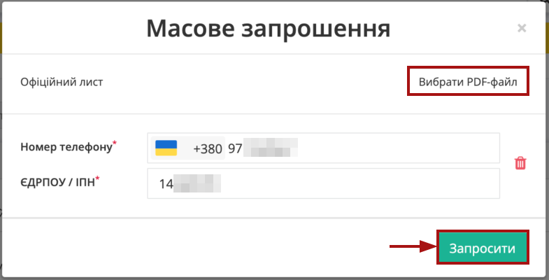
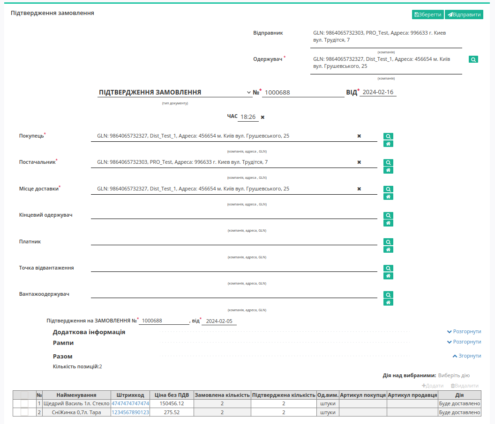

Робота в сервісі "Маркет". Інструкція для Продавця
#################################################################

.. role:: red

.. role:: green

.. role:: blue

.. role:: orange

.. role:: underline

.. сюда закину немного картинок для текста

.. |шестерня| image:: pics_dlia_vyrobnyka/Instruktsiia_dlia_vyrobnyka_16.png

.. |смітник| image:: pics_dlia_vyrobnyka/Instruktsiia_dlia_vyrobnyka_19.png

.. |прайс_лист| image:: pics_dlia_vyrobnyka/Instruktsiia_dlia_vyrobnyka_26.png

.. |pencil| image:: pics_dlia_vyrobnyka/Instruktsiia_dlia_vyrobnyka_34.png

.. |pencil_stencil_green| image:: /_constant/icons/pencil_stencil_green.png

.. |trash_green| image:: /_constant/icons/trash_green.png

.. |square_empty| image:: /_constant/icons/square_empty.png

.. |square_green_tick| image:: /_constant/icons/square_green_tick.png

.. |square_grey_tick| image:: /_constant/icons/square_grey_tick.png

.. |drag_dots_v| image:: /_constant/icons/drag_dots_v.png

.. |trash_f_red| image:: /_constant/icons/trash_f_red.png

.. |comment_dots| image:: /_constant/icons/comment_dots.png

.. :underline:`"Чернетки" для ролі "Організатор"`

.. contents:: Зміст:
   :depth: 2

---------

**Вступ**
=========

**Маркет** — це комплексне електронне рішення, яке оптимізує процеси обміну електронними даними між Продавцями (Виробниками) та їх Покупцями (Дистриб'юторами). Інструкція описує додавання та редагування прайс-листа, обмежень та квот, перегляд списку Покупців (Дистрибʼюторів) та замовлень. 

.. note:: Всі дані, наведені в Інструкції - фіктивні, використовуються тільки в якості прикладу 

**1 Вхід на платформу**
====================================

.. include:: /general_2_0/rabota_s_platformoj_EDIN_2.0.rst
   :start-after: .. початок блоку для Enter
   :end-before: .. кінець блоку для Enter

Після успішної авторизації відкриється основне меню, де у вкладці **"Продукти та рішення"** EDIN потрібно обрати сервіс **Маркет**:

.. image:: /_constant/pics_landing/landing_distribution.png
   :align: center

**2 Робота з Покупцями (Дистриб'юторами)**
==================================================

Після вибору сервісу за замовчуванням відобразиться розділ **"Мої покупці"** з Вашими Покупцями (Дистриб'юторами). Ваші Покупці для зручності поділені на:

* **Активні** - Покупці, з якими Ви вже співпрацюєте й можете вести діяльність;
* **Запрошені** - Покупці, яких Ви запросили до співпраці й вони ще не прийняли запрошення (детальніше про `Запрошення Покупців <https://wiki.edin.ua/uk/latest/Distribution/EDIN_2_0/Instructions_2_0/Instruktsiia_dlia_vyrobnyka.html#inviting-buyers>`__).

В журналі підрозділу **Активні** відображаються усі Ваші конрагенти та коротка інформація в табличному форматі (назва, адреса, ЄДРПОУ, GLN, група (якщо є)).  В підрозділі **Активні** доступне сортування списка контрагентів за назвою:

Журнал **Запрошених** контрагентів містить вказаний Email/номер телефону запрошеного контрагента, дату запрошення та статус запрошення (:orange:`Запрошено` / :green:`Прийнято` / :red:`Відхилено`):

В підрозділі **Активні** в журналі одразу можливо перейти до "Прайс-листа" / "Обмежень" Покупців (біла кнопка **"Переглянути"**), а зелена кнопка означає, що їх можливо **"Додати"** / **"Завантажити"**.

.. hint::

   Детальніше про завантаження Прайс-листа/Обмежень у розділі `Масове завантаження <https://wiki.edin.ua/uk/latest/Distribution/EDIN_2_0/Instructions_2_0/Instruktsiia_dlia_vyrobnyka.html#mass-downloading>`__.

   Детальніше про Прайс-лист у розділі `Прайс-лист <https://wiki.edin.ua/uk/latest/Distribution/EDIN_2_0/Instructions_2_0/Instruktsiia_dlia_vyrobnyka.html#pricat>`__.

   Детальніше про Обмеження до замовлення у розділі `Обмеження <https://wiki.edin.ua/uk/latest/Distribution/EDIN_2_0/Instructions_2_0/Instruktsiia_dlia_vyrobnyka.html#limits>`__.

За допомогою зручного рядка пошуку можливо тонко відібрати потрібних контрагентів; доступні ключі пошуку:

Доступне масове видалення прайс-листів, квот чи надбавок активних Покупців: для цього потрібно обрати (1) **Покупця/-ів (Дистрибʼютора/-ів)** та обрати, що потрібно **"Видалити"** (2):

.. _inviting-buyers:

**2.1 Запрошення Покупців**
------------------------------------------------------

Запросити Покупців можливо з підрозділів **Активні** та **Запрошені** за допомогою кнопки **"+Запросити покупця"** та обравши **"Запросити одного покупця"** чи **"Масово запросити покупців"**.

.. important::
   Перш ніж скористатися можливістю відправлення запрошень, необхідно впевнитися, що особа-покупець, якій планується вперше надіслати запрошення, надала згоду на отримання повідомлень від EDIN, які стосуються інформації про сервіс EDIN Market та здійснення електронного документообігу з його використанням. Якщо згоди на отримання повідомлень від EDIN не було отримано, відправляти запрошення через сервіс забороняється. У такому випадку рекомендується спершу зв'язатися з покупцем у інший спосіб, щоб отримати його явну згоду на отримання інформації про сервіс EDIN Market. Для підтвердження наявності такої згоди, просимо поставити відповідну позначку:

   .. image:: pics_dlia_vyrobnyka/Instruktsiia_dlia_vyrobnyka_088.png
      :align: center

   Наприклад:

   .. image:: pics_dlia_vyrobnyka/Instruktsiia_dlia_vyrobnyka_090.png
      :align: center

   Після першої відправки запрошення запит на згоду більше не буде відображатись на рівні акаунту.  

* **"Запросити одного покупця"** дозволяє вказати Email чи номер телефону (лише Україна) та ЄДРПОУ/ІПН для того, щоб **"Запросити"** одного Покупця (додатково можливо прикласти pdf-файл з офіційним інформаціним листом для Покупця):

.. image:: pics_dlia_vyrobnyka/Instruktsiia_dlia_vyrobnyka_079.png
   :align: center

* **"Масово запросити покупців"** дозволяє за допомогою xlsx-шаблону (потрібно **"Зберегти шаблон"**) вказати всі бажані Email чи номери телефонів (лише Україна) та ЄДРПОУ/ІПН для того, щоб **"Завантажити файл"** та запросити одразу всіх вказаних Покупців:

Після чого в модальному вікні відобразиться список усіх запрошуваних Покупців - після перевірки даних їх можливо **"Запросити"** (додатково можливо прикласти pdf-файл з офіційним інформаціним листом для Покупців): 

.. warning::
   Якщо в даних xlsx-файлу при масовому завантаженні буда допущена помилка, то відобразиться popup вікно з некоректними полями (виділені червоним), які потрібно виправити/видалити для того, щоб **"Запросити"** Покупців:

    .. image:: pics_dlia_vyrobnyka/Instruktsiia_dlia_vyrobnyka_082.png
      :align: center

Всі успішно запрошені Покупці відображаються в підрозділі **"Запрошені"** та можуть мати статус запрошення:

* :orange:`Запрошено` - запрошення відправлено, без реакції зі сторони Покупця;
* :green:`Прийнято` - запрошення прийнято Покупцем;
* :red:`Відхилено` - запрошення відхилено Покупцем.

Якщо Покупець відхиляє Ваше запрошення, то окрім відповідного статусу відображається його коментар-причина, з яким можливво ознайомитись, натиснувши на іконку |comment_dots|:

Після того, як запрошення прийнято, Покупець має налаштувати зв'язок Продавець-Покупець і лише після цього відображається в підрозділі **"Активні"** та готовий до співпраці.

Також можливо повторно нагадати про запрошення: для цього потібно відмітити вже відправлені запрошення в розділі (**Запрошені**) та натиснути **"Повторно запросити"** (запрошення можливо надіслати 1 раз на добу):

За потреби (наприклад, помилкові запрошення) можливо **"Видалити"**, щоб вони не відображались в списку:

.. _pricat:

**2.2 Прайс-лист**
------------------------------------------------------

Для перегляду "Прайс-листа", натисніть на кнопку **"Переглянути"** у відповідній колонці навпроти Покупця (Дистриб'ютора):

Ви перейдете в "Прайс-лист" з усіма доданими позиціями, де список товарів можливо відсортувати за назвою чи ціною:

Також можливо відобразити в журналі товарів "Прайс-листа" товари обраної лінійки/категорії/підкатегорії, відмітивши їх в деревовидній структурі **"Категорії товарів"** та натиснувши **"Застосувати"**:

Застосований фільтр **"Категорії товарів"** можливо **"Скинути"**.

.. note::
   За замовчуванням в журналі позицій зверху вниз спочатку відображаються товари *за алфавітом* [1]_ з мітками, а потім товари *за алфавітом* [1]_ без міток, однак в **"Категорії товарів"** інше правило: нові завантажені категорії відображаються знизу (в порядку завантаженого прайс-листа)!

Для перегляду вмісту кожного з рівнів потрібно натиснути мишкою на його назву. 

Реалізована можливість пошуку позицій в прайс-листі за доступними ключами:

.. image:: pics_dlia_vyrobnyka/Instruktsiia_dlia_vyrobnyka_065.png
   :align: center

Переглядаючи "Прайс-лист" можливо перейти та відредагувати дані позиції (клік мишкою по назві) в модальному вікні з Даними позиції (згідно налаштувань колонки "Відобразити продавцю" в розділі **Вигляд прайс-листів** - `детальніше <https://wiki.edin.ua/uk/latest/Distribution/EDIN_2_0/Instructions_2_0/Instruktsiia_dlia_vyrobnyka.html#pricat-view>`__):

.. hint::
   Якщо Продавець (Виробник) в обраній позиції вказує "Кратність", то при формуванні "Замовлення" Покупцем кількість замовлених позицій має бути кратною вказаній кількості. Наприклад, якщо "Кратність"=3, то "Кількість одиниць" для формування "Замовлення" може бути 3, 6, 9...

   .. image:: pics_dlia_vyrobnyka/Instruktsiia_dlia_vyrobnyka_067.png
      :align: center

За допомогою кнопки **"Видалити"** можливо повністю видалити прайс-лист (1), всі квоти для цього прайс-листа (2), всі надбавки для цього прайс-листа (3) для данного Покупця (Дистриб'ютора); також доступне видалення конкретної позиції (кнопка |trash_f_red|):

.. _pricat-view:

**2.3 Вигляд прайс-листів**
-------------------------------------------------------------------------------

У Продавців (Виробників) є можливість змінювати кількість та порядок полів, що відображаються при перегляді "Прайс-листа":

.. image:: pics_dlia_vyrobnyka/Instruktsiia_dlia_vyrobnyka_058.png
   :align: center

Ви можете встановити |square_green_tick| чи прибрати |square_empty| відмітки для себе (Продавця) та всіх Ваших контрагентів (Покупців) для того, щоб відображати чи приховувати відповідно ці поля при перегляді "Прайс-листа" (обов'язкові поля не доступні до змін відображення |square_grey_tick| - вони завжди відображаються). Перші поля в списку закріплені й відображаються саме в такому порядку, однак інші поля, що мають символ |drag_dots_v| перед назвою можливо перетягувати між собою лівою кнопкою миші, змінюючи таки чином порядок відображення колонок при перегляді "Прайс-листа":

Додатково можливо Заборонити введення значень в деякі поля (навіть, якщо вони обов'язкові):

.. _processes:

В розділі **"Вигляд прайс-листа"** Ви також маєте можливість додатково підключити процеси, що впливають на функціонал обрахунку та створення "Замовлення" на стороні Покупця:

* **Рекомендації до замовлення** - процес, що дозволяє Покупцю наповнити його "Замовлення" за Вашим "Прайс-листом" в один клік (кнопкою **"Замовити згідно рекмендації"**). При цьому в чернетку "Замовлення" Покупця додаються саме ті позиції та кількості, в яких Ви вказуєте (рекомендуєте) в полях "Прайс-листа": **"Рекомендоване замовлення, шт", "Рекомендоване замовлення, ящ"**. Якщо в позиціях "Прайс-листа" жодне з цих полів не заповнено, то такі позиції не приймають участь в логіці даного процесу. Функціонал на стороні Покупця:

.. image:: /Distribution/EDIN_2_0/Instructions_2_0/pics_dlia_dystrybiutora/Instruktsiia_dlia_dystrybiutora_071.png
   :align: center

При зміні рекомендованої кількості у Покупця відображається розбіжність з відповідним знаком:

.. image:: /Distribution/EDIN_2_0/Instructions_2_0/pics_dlia_dystrybiutora/Instruktsiia_dlia_dystrybiutora_072.png
   :align: center

* **Контроль кратності палет + надбавка** - процес, що дозволяє встановити "Надбавку" для товарних позицій, за якими додатково може виконуватись автоматичне стягнення з Покупця (Дистриб'ютора) за невідповідності: **якщо кількість замовлених коробок (вказує Покупець) не кратна кількості коробок, яку вміщує палета (вказує Продавець)**, то виконується стягнення згідно логіки:

   a) Якщо "Замовлена ​​кількість коробок" > "Кількість коробок на палеті" і НЕ дотримується кратність, то "Надбавка" = залишок від поділу "Замовлена ​​кількість коробок" / "Кількість коробок на палеті" * "Тариф для надбавки" (наприклад, замовлена ​​кількість коробок = 450 , кількість коробок на палеті = 200, тариф для надбавки = 10 грн. => залишок = 50 => надбавка = 500 грн.)
   b) Якщо "Замовлена ​​кількість коробок" < "Кількість коробок на палеті", то "Надбавка" = "Замовлена ​​кількість коробок" * "Тариф для надбавки" 

.. note::
   Якщо Ви плануєте Додати процеси: "Рекомендації до замовлення", "Контроль кратності палет + надбавка", то маєте передбачити, що це впливає відображення деяких полів "Прайс-листа" (є підказки про поля, що залучені в обраний процес):

   .. image:: pics_dlia_vyrobnyka/Instruktsiia_dlia_vyrobnyka_061.png
      :align: center

.. warning::
   Після внесення всіх змін їх обов'язково потрібно **"Зберегти"**!

.. _limits:

**2.4 Обмеження**
-------------------------------------------------

Для перегляду Обмежень (`Додавання обмежень <https://wiki.edin.ua/uk/latest/Distribution/EDIN_2_0/Instructions_2_0/Instruktsiia_dlia_vyrobnyka.html#limits-add>`__), в розділі **Мої покупці->Активні** натисніть на кнопку **"Переглянути"** чи **"Додати"** в колонці **Обмеження** навпроти потрібного контрагента:

.. image:: pics_dlia_vyrobnyka/Instruktsiia_dlia_vyrobnyka_083.png
   :align: center

Відкриється модальне вікно з порожніми полями чи вже встановленими "Обмеженнями" - всі вони доступні до редагування (після редагування потрібно **"Зберегти"** зміни) чи видалити усі обмеження для цього Покупця (Дистриб'ютора) за допомогою кнопки **"Очистити"**:

Доступні до встановлення Обмеження:

- Мінімальна сума замовлення з ПДВ, грн.
- Максимальна сума замовлення з ПДВ, грн.
- Мінімальна сума замовлення без ПДВ, грн
- Максимальна сума замовлення без ПДВ, грн
- Кредитний ліміт, грн.
- Тариф для надбавки, грн.
- Максимальна вага замовлення, кг	
- Максимальна кількість позицій в замовленні	
- Максимальна кількість коробок	
- Максимальна кількість палет	
- Кратність упаковці
- Кратність мінімальної кількості замовлення
- Контроль залишків та квот *(якщо обрано "ні", то Покупець може замовити більше встановленого залишку та/або квоти)*
- Максимальна кількість днів для повернення товару

.. _order-po:

**2.5 Попереднє замовлення (рекомендації для Дистиб'ютора (Покупця))**
-------------------------------------------------------------------------------

Після відправки прайс-листа Дистиб'ютору Продавець (Виробник) має можливість через `FTP <https://wiki.edin.ua/uk/latest/integration_2_0/FTP.html>`__ / `API <https://wiki.edin.ua/uk/latest/Distribution/EDIN_2_0/API_2_0/Distribution_API_2_0_list.html#producer-rec>`__ відправити персональне "Попереднє замовлення" (`ORDER <https://wiki.edin.ua/uk/latest/Distribution/EDIN_2_0/XML/ORDER_x.html>`__ з DOCTYPE = "PO") своєму контагенту, вказавши в ньому рекомендовані товари та їх кількості.

.. important::
   За відправки "Попереднього замовлення" (рекомендацій) Дистиб'ютору в його "кошик" покупця **будуть додані тільки нові товари**! Якщо товар вже був в "кошику" цього Дистиб'ютора, то кількість одиниць не буде оновлена!

В цьому випадку при перегляді прайс-листа Дистиб'ютором товари і кількості вже вказані і він може одразу **"+Створити замовлення"** (всі рекомендовані кількості доступні до редагування):

.. image:: /Distribution/EDIN_2_0/Instructions_2_0/pics_dlia_dystrybiutora/Instruktsiia_dlia_dystrybiutora_048.png
   :align: center

Після відправки "Попереднього замовлення" Дистиб'ютор (Покупець) отримує `повідомлення "в дзвіночок" <https://wiki.edin.ua/uk/latest/general_2_0/rabota_s_platformoj_EDIN_2.0.html#messages>`__ та лист на пошту:

.. image:: /Distribution/EDIN_2_0/Instructions_2_0/pics_dlia_dystrybiutora/Instruktsiia_dlia_dystrybiutora_053.png
   :align: center

При натисканні на кнопку **"Перевірити кошик"** йому відкривається прайс-лист з Вашими рекомендаціями. 

Для того, щоб інтегрувати в свою систему функцію "Попереднього замовлення" зверніться до вашого менеджера в компанії АТС.

.. _group-management:

**3 Управління групами**
===================================

Для оптимізації роботи з великою кількістю контрагентів передбачена можливість об'єднання Покупців (Дистриб'юторів) в групи. В розділі "Управління групами" **Продавець (Виробник)** може "Створити групу" відповідною кнопкою, дати назву новій групі в спливаючому вікні та натиснувши "Зберегти":

Створена група потрапляє до списку раніше створених груп.

Для додавання/редагування назви чи списку Покупців (Дистриб'юторів) в групі потрібно натиснути на кнопку |шестерня|. В модальному вікні групи можливо скористатись пошуком, обрати зі списку своїх **Покупців (Дистриб'юторів)** та "Зберегти" зміни.

.. image:: pics_dlia_vyrobnyka/Instruktsiia_dlia_vyrobnyka_17.png
   :align: center

.. _mass-downloading:

**4 Масове завантаження**
===================================

.. початок блоку для Pricat_Add1

Масове завантаження доступно лише для Продавця (Виробника). У цьому розділі можливе створення прайс-листа, а також встановлення обмежень та квот.

Обмеження встановлюються на все замовлення, наприклад на максимальну можливу сумму замовлення; квота  - обмеження кількості одиниць певного товару до замовлення

У розділі доступно дві кнопки: 1 - **Скачати шаблон Excel** та 2 -  **Завантажити з Excel**. Під кожною кнопкою можливі відповідні дії по завантаженню прайс-листа, встановлення обмеження або квот.

.. image:: /Distribution/EDIN_2_0/Instructions_2_0/pics_dlia_vyrobnyka/Instruktsiia_dlia_vyrobnyka_020.png
   :align: center

Також в розділі на сторінці представлена **Інструкція** з правилами щодо заповнення форм для **Прайс-листа** / **Обмежень** / **Квот** / **Надбавок**. 

.. кінець блоку для Pricat_Add1

.. _price-add:

**4.1 Додавання прайс-листа**
--------------------------------------------------

.. початок блоку для Pricat_Add2

Для коректного формування прайс-листа завантажте шаблон кліком по кнопці **"Скачати шаблон Excel"** ->  **"Прайс-листа"**:

.. image:: /Distribution/EDIN_2_0/Instructions_2_0/pics_dlia_vyrobnyka/Instruktsiia_dlia_vyrobnyka_016.png
   :align: center

Автоматично почнеться скачування шаблону у форматі .xls

.. important::
   Зверніть увагу! Видаляти, міняти місцями колонки в шаблоні не можна. Ви можете не заповнювати не обовязкові стовпці, але не видаляйте їх.

Відкрийте та заповніть файл Excel. Колонки виділенні зеленим кольором - **обов'язкові для заповнення**! Деякі стовпці мають підказки до заповнення - наведіть курсор у верхній куток назви стовпця для відображення підказки: 

.. image:: /Distribution/EDIN_2_0/Instructions_2_0/pics_dlia_vyrobnyka/Instruktsiia_dlia_vyrobnyka_41.png
   :align: center

Обовязкові для заповнення в шаблоні дані:

- Лінійка	
- Категорія
- Артикул	
- Найменування	
- Штрихкод 
- Од. виміру
- Ціна/од. без ПДВ, грн.

Після заповнення шаблону, збережіть його!

Для завантаження прайс-листа на платформу натисніть на кнопку **«Завантажити з Excel»** та виберіть у новому вікні збережений файл. 

Якщо якусь з колонок заповнено некоректно, позиція зафарбується помаранчевим кольором, та з'явиться повідомлення про помилку, у якій буде вказано який саме стовбець потрібно виправити. 

Навіть якщо деякі позиції додані неправильно, ви все одно можете додати позиції без помилок.

Якщо всі дані заповнено вірно, перед вами відобразиться список доданих товарів:

.. image:: /Distribution/EDIN_2_0/Instructions_2_0/pics_dlia_vyrobnyka/Instruktsiia_dlia_vyrobnyka_041.png
   :align: center

Далі потрібно відмітити чекером товари (які Ви хочете додати), встановити Період дії для обраних товарів (оберіть дату початку (не раніше поточної дати) і дату закінчення), оберіть валюту (за замовчуванням UAH) та вкажіть Покупців (Дистриб'юторів) чи групи (потребують попередніх `налаштувань <https://wiki.edin.ua/uk/latest/Distribution/EDIN_2_0/Instructions_2_0/Instruktsiia_dlia_vyrobnyka.html#group-management>`__):

.. image:: /Distribution/EDIN_2_0/Instructions_2_0/pics_dlia_vyrobnyka/Instruktsiia_dlia_vyrobnyka_055.png
   :align: center

Далі з ними можливі дії - віднести їх до певного Покупця (Дистриб'ютора) чи вибрати всіх відразу. Встановіть Період дії: внесіть дату початку (не раніше поточної дати) і дату закінчення.

.. image:: /Distribution/EDIN_2_0/Instructions_2_0/pics_dlia_vyrobnyka/Instruktsiia_dlia_vyrobnyka_056.png
   :align: center

Після натискання на кнопку **"Опублікувати"** відображається список з варіантами дій з обраними товарними позиціями:

* **"Замінити поточний прайс-лист"** - якщо обрана позиція вже була завантажена (для обраних контрагентів-Покупців (Дистриб'юторів)), то вона заміниться на оновлену;
* **"Доповнити поточний прайс-лист"** - обрана позиція додається до прайс-листа контрагента-Покупця (Дистриб'ютора) (за виключенням повного клону раніше доданої позиції).

Ви можете редагувати позицію при перегляді прайс-листа вибраного Покупця (Дистриб'ютора), наприклад додати або відмінити помітки :red:`Новинка!`, :blue:`Акція!`, :green:`Публічна позиція!` та :orange:`Надбавка!` або інші дані.

Таким способом ви можете оновлювати прайс-лист для кожного окремого Покупця (Дистриб'ютора), чи додавати нові позиції і навіть лінійки та категорії товарів для усіх контрагентів відразу.

.. note:: Зверніть увагу, що перш ніж **"Опублікувати"**, ви можете перевірити та редагувати дані!

.. кінець блоку для Pricat_Add2

.. _limits-add:

**4.2 Додавання обмежень**
--------------------------------------------------

Для коректного формування обмежень завантажте шаблон кліком по кнопці **Скачати шаблон Excel»** -> **Обмежень**:

.. image:: pics_dlia_vyrobnyka/Instruktsiia_dlia_vyrobnyka_017.png
   :align: center

Автоматично почнеться скачування шаблону у форматі .xls

.. important::
   Зверніть увагу! Видаляти, міняти місцями колонки в шаблоні не можна. Ви можете не заповнювати не обовязкові стовпці, але не видаляйте їх.

Відкрийте та заповніть файл Excel. Колонки виділенні зеленим кольором - **обов'язкові для заповнення**! 

Для встановлення обмежень обов'язковим для заповнення є лише **GLN** контрагента, для якого ви встановлюєте обмеження. Зазначений GLN повинен бути у списку Ваших Покупців (Дистриб'юторів)!

Після заповнення шаблону, збережіть його!

Для завантаження обмежень на платформу натисніть на кнопку **«Завантажити з Excel»** -> **«Завантажити обмеження»** та виберіть файл з обмеженнями. 

.. image:: pics_dlia_vyrobnyka/Instruktsiia_dlia_vyrobnyka_10.png
   :align: center

Далі потрібно обрати всіх контрагентів, для яких потрібно **«Опублікувати»** обмеження:

.. image:: pics_dlia_vyrobnyka/Instruktsiia_dlia_vyrobnyka_010.png
   :align: center

Після цього обмеження відобразяться у вказаного Покупця (Дистриб'ютора) та будуть діяти при оформленні замовлення.

Платформа автоматично повідомляє, якщо при завантаження по якомусь контрагенту зі списку були введені некорректні значення чи допущені інші помилки (текст помилки відображається для кожного контрагента окремо). Обмеження для цих контрагентів можливо відредагувати за допомогою кнопки |pencil|:

Обмеження можуть бути завантажені тільки для одного Покупця (Дистриб'ютора) (одного GLN) - для інших Покупців (Дистриб'юторів) повторіть дії з додавання обмежень.

.. note:: Зверніть увагу, що перш ніж **"Опублікувати"**, ви можете перевірити та редагувати дані!

.. _quota-add:

**4.3 Додавання квот**
-------------------------

Для коректного додавання квот завантажте шаблон кліком по кнопці **Скачати шаблон Excel»** -> **Квот**:

.. image:: pics_dlia_vyrobnyka/Instruktsiia_dlia_vyrobnyka_018.png
   :align: center

Автоматично почнеться скачування шаблону у форматі .xls

.. important::
   Зверніть увагу! Видаляти, міняти місцями колонки в шаблоні не можна. Ви можете не заповнювати не обовязкові стовпці, але не видаляйте їх.

Відкрийте та заповніть файл Excel. Колонки виділенні зеленим кольором - **обов'язкові для заповнення**! 

Для встановлення квот обов'язковими для заповнення є **GLN** контрагента, для якого встановлюється квота, **Штрихкод** позиції, **Артикул** та безпосередню сама **Квота**, тобто кількість товару до замовлення. Зазначений GLN повинен бути серед списку Ваших Покупців (Дистриб'юторів)!

Після заповнення шаблону, збережіть його!

Для завантаження квот на платформу натисніть на кнопку **Завантажити з Excel** -> **Завантажити квоти** та виберіть у новому вікні збережений файл. 

.. image:: pics_dlia_vyrobnyka/Instruktsiia_dlia_vyrobnyka_11n.png
   :align: center

.. important::
   Якщо обов'язкові поля не були додані або зв'язок "Штрихкод + Артикул" відсутній в прайс-листі для вказаного Покупця (Дистриб'ютора) (GLN), то система повідомить про це без можливості публікації даної квоти.

Після натисніть на кнопку **«Опублікувати»** - після цього квота буде діяти при оформленні замовлення. Переглянути квоти можливо при перегляді прайсу, у стовпці "Квота на замовленя".

Для одного Покупця (Дистриб'ютора) немає можливості завантажити різні квоти для одного товару.

.. note:: Зверніть увагу, що перш ніж Опублікувати, ви можете перевірити та редагувати дані!

.. _surcharge-add:

**4.4 Додавання надбавок**
--------------------------------------------------

Для коректного додавання надбавок потрібно **Скачати шаблон Excel»** -> **Надбавок**:

.. image:: pics_dlia_vyrobnyka/Instruktsiia_dlia_vyrobnyka_019.png
   :align: center

Автоматично почнеться скачування шаблону у форматі .xls

В xls-файлі присутні колонки GLN, Штрихкод, Артикул - вони є **обов'язковими для заповнення**! 

Для встановлення надбавок обов'язковими для заповнення є **GLN** контрагента, для якого встановлюється квота, **Штрихкод** та **Артикул** позиції. Зазначений GLN повинен бути серед списку Ваших Покупців (Дистриб'юторів)!

Після заповнення шаблону, збережіть його!

Для завантаження квот на платформу натисніть на кнопку **Завантажити з Excel** -> **Надбавки** та виберіть у новому вікні збережений файл. 

.. image:: pics_dlia_vyrobnyka/Instruktsiia_dlia_vyrobnyka_38.png
   :align: center

.. important::
   Якщо обов'язкові поля не були додані або зв'язок "Штрихкод + Артикул" відсутній в прайс-листі для вказаного Покупця (Дистриб'ютора) (GLN), то система повідомить про це без можливості публікації відмітки "надбавки".

Після натисніть на кнопку **«Опублікувати»** - після цього надбавка буде діяти при оформленні замовлення.

.. _schedules:

**5 Графік замовлень**
===================================

Розділ дозволяє зазначити дату/час, коли Ви (Продавець (Виробник)) приймаєте замовлення від Ваших Дистриб’юторів/Покупців. Налаштування можливо зробити для всіх Ваших контрагентів чи індивідуально.

.. note::
   Якщо Ви ще не додавали графіки, то відображається підказка, про те, що для відображення таблиці з даними потрібно **"+Створити графік"**:

   .. image:: pics_dlia_vyrobnyka/Instruktsiia_dlia_vyrobnyka_031.png
      :align: center

Для додавання налаштувань за новим графіком замовлень потрібно натиснути кнопку **"+Створити графік"**:

У відкритій формі потрібно заповнити всі обов'язкові поля (відмічені червоною зірочкою :red:`*`):

Якщо Ви хочете зробити **індивідуальний графік замовлень**, то в налаштуваннях потрібно обрати зі списку Ваших контрагентів сервісу Покупців (Дистриб'юторів) (підрозділ **"Контрагенти"**) чи обрати групи Покупців (Дистриб'юторів) (підрозділ **"Управління групами"**). При виборі контрагентів працює пошук за назвою:

Для формування **загального графіка замовлень** потрібно встановити відмітку **"Всі контрагенти"**:

.. note::
   Якщо **індивідуальний** та **загальний** графіки перетинаються по даті для Вашого котрагента, то йому будуть відображатись в першу чергу налаштування за **індивідуальним** графіком замовлень!  

Обов'язково потрібно обрати з календаря дату початку дії графіка, а також можливо обрати та зазначити дату завершення дії графіка:

Далі потрібно обрати період час прийому замовлень "з" - "по", наприклад:

У вказаному періоді дат можливо налаштувати повтори днів/тижнів (дні/тижні, в які Ви приймаєте замовлення) за правилом, що автоматично побудує ваш графік, наприклад:

І для Покупця (Дистриб'ютора) цей графік буде виглядати:

При налаштуванні повторів через тижні потрібно обрати дні, в які Ви будети приймати замовлення, наприклад, налаштування:

Для Покупця (Дистриб'ютора) будуть виглядати:

Додатково можливо заборонити відправку замовлень (для всіх контагентів чи обраних), що не потрапляють в дату/час встановленого графіка - для цього потрібно поставити відмітку **"Блокувати замовлення, які не в графіку"**:

Також можливо встановити час, коли Вашим контрагентам будуть приходити нагадування про те, що в даний момент Ви приймаєте замовлення. 

Після внесення всіх даних чи змін до Вашого графіка його потрібно **"Зберегти"**:

Після збереження всі Ваші графіки відображаються у вигляді таблиці, можливо повернутись до редагування графіка (|pencil_stencil_green|) чи взагалі видалити (|trash_green|) за допомогою кнопок:  

.. _work-with-edi:

**6 Робота з EDI та ЮЗД**
===================================

Користувачу доступна робота з наступними документами:

* `Замовлення (ORDERS) <https://wiki.edin.ua/uk/latest/EDIN_Specs/XML/ORDER_x.html>`__
* `Підтвердження замовлення (ORDRSP) <https://wiki.edin.ua/uk/latest/EDIN_Specs/XML/ORDRSP_x.html>`__
* `Повідомлення про відвантаження (DESADV) <https://wiki.edin.ua/uk/latest/EDIN_Specs/XML/DESADV_x.html>`__
* `Повідомлення про прийом (RECADV) <https://wiki.edin.ua/uk/latest/EDIN_Specs/XML/RECADV_x.html>`__
* `Рахунок (INVOICE) <https://wiki.edin.ua/uk/latest/EDIN_Specs/XML/INVOICE_x.html>`__
* `Видаткова накладна (COMDOC_006) <https://wiki.edin.ua/uk/latest/EDIN_Specs/XML/COMDOC_006_x.html>`__

Для зручності документи логічно пов'язуються в так звані ланцюжки. Далі представлені можливі схеми/комбінації документообігу (в дужках вказаний відправник документу):

1) ORDERS (Покупець (Дистрибʼютор)) -> ORDRSP (Продавець (Виробник)) -> DESADV (Продавець (Виробник)) -> RECADV (Покупець (Дистрибʼютор)) -> INVOICE (Продавець (Виробник))
2) ORDERS (Покупець (Дистрибʼютор)) -> ORDRSP (Продавець (Виробник)) -> DESADV (Продавець (Виробник)) -> COMDOC_006 (Продавець (Виробник))
3) ORDERS (Покупець (Дистрибʼютор)) -> ORDRSP (Продавець (Виробник)) -> INVOICE (Продавець (Виробник))
4) ORDERS (Покупець (Дистрибʼютор)) -> ORDRSP (Продавець (Виробник)) -> COMDOC_006 (Продавець (Виробник))
5) ORDERS (Покупець (Дистрибʼютор)) -> ORDRSP (Продавець (Виробник)) -> RECADV (Покупець (Дистрибʼютор)) -> INVOICE (Продавець (Виробник))
6) ORDERS (Покупець (Дистрибʼютор)) -> DESADV (Продавець (Виробник)) -> RECADV (Покупець (Дистрибʼютор)) -> INVOICE (Продавець (Виробник))
7) ORDERS (Покупець (Дистрибʼютор)) -> DESADV (Продавець (Виробник)) -> COMDOC_006 (Продавець (Виробник))
8) ORDERS (Покупець (Дистрибʼютор)) -> INVOICE (Продавець (Виробник))
9) ORDERS (Покупець (Дистрибʼютор)) -> COMDOC_006 (Продавець (Виробник))

**6.1 Перегляд Замовлення**
---------------------------------------

У розділі "Вхідні" відображається список оформлених замовлень від Покупців (Дистриб'юторів):

У замовлені ви можете перевірити такі данні як наприклад GLN Покупця, GLN Місця доставки, або дату коли поставка відбудеться.
Ви можете скачати замовлення у форматі .pdf, .xls, .xml, .zip або відразу відправити на друк.

Під основною інформацією - таблична частина з позиціями. Натисніть *"Показати повністю"* щоб розгорнути всю інформацію за позиціями, або розгорніть лише одні, натиснувши на знак біля номеру позиції.

.. image:: pics_dlia_vyrobnyka/Instruktsiia_dlia_vyrobnyka_order_12_2.png
   :align: center

Під позиціями можливо залишити коментар - видалити коментар неможливо.

.. _order-finalization:

**6.2 Фіналізація Замовлення (відправка Підтвердження Замовлення)**
------------------------------------------------------------------------------------

Якщо за замовленням немає жодних питань, то для швидкої відповіді контрагену можливо виконати **"Фіналізації замовлення"**:

Далі в вікні підтвердження потрібно натиснути **"Надіслати"** - при цьому автоматично створюється, заповнюється та відправляється "Підтвердження замовлення". Якщо ж натиснути **"Редагувати"**, то відкриється заповнена форма "Підтвердження замовлення" (готова до ручного редагування):

.. _inviting-buyers:

**7 Додавання нового Покупця (Дистриб'ютора)**
===================================================

Щоб додати нового покупця, зверніться до вашого менеджера в компанії АТС.

У випадку ротації Покупців (Дистриб'юторів) і покупців, звертайтесь до вашого менеджера в компанії АТС.

**7 Відправка прайс-листів Покупцям (Дистриб'юторам) з облікової системи**
==============================================================================

В компанії АТС розроблена специфікація XML. Щоб налаштувати відправлення прайсів безпосередньо з вашої облікової системи Покупцям (Дистриб'юторам), зверніться до вашого менеджера в компанії АТС.

-------------------------------------

.. [#] тут *за алфавітом* мається на увазі порядок відображення товарів, назви яких починаються з: **спец. символів (пробіл, лапки та ін.)** -> **цифр** -> **латиниці** -> **кирилиці**.

-------------------------------------

.. include:: /_constant/kontakti.rst
