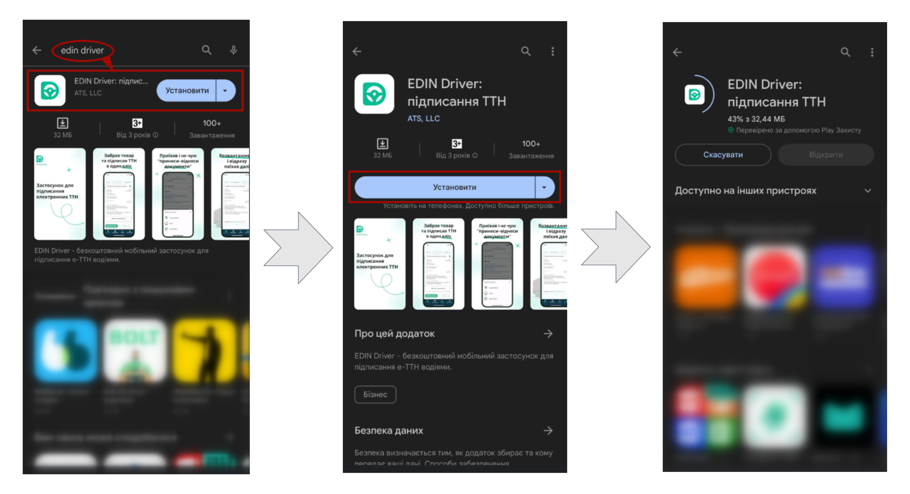
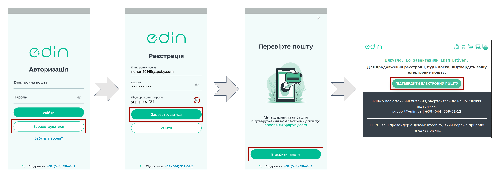
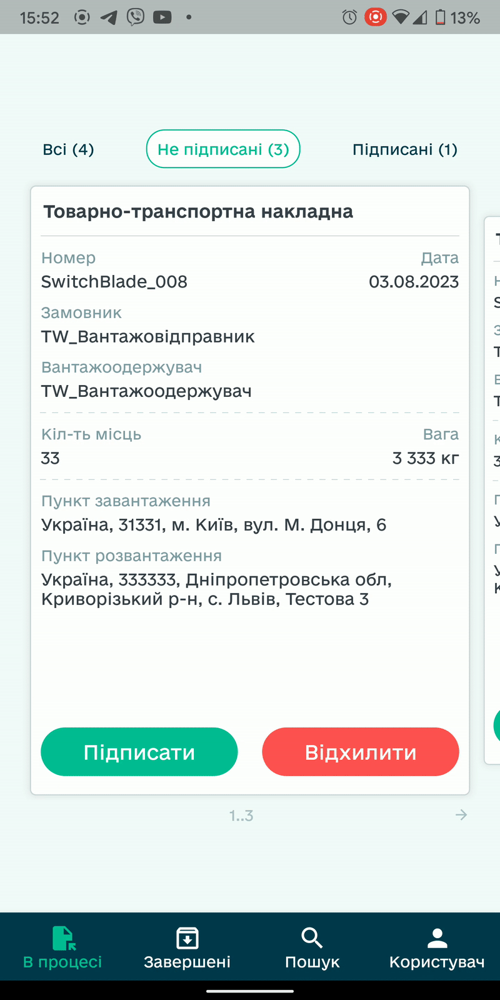
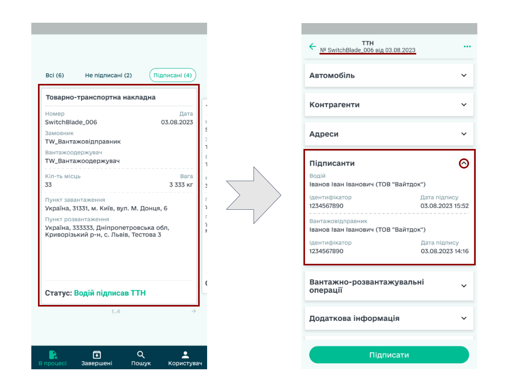
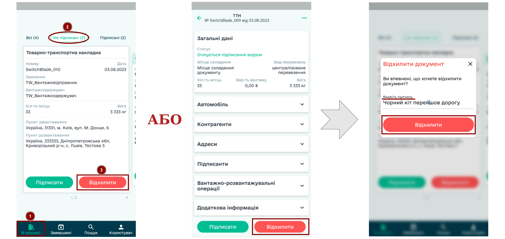
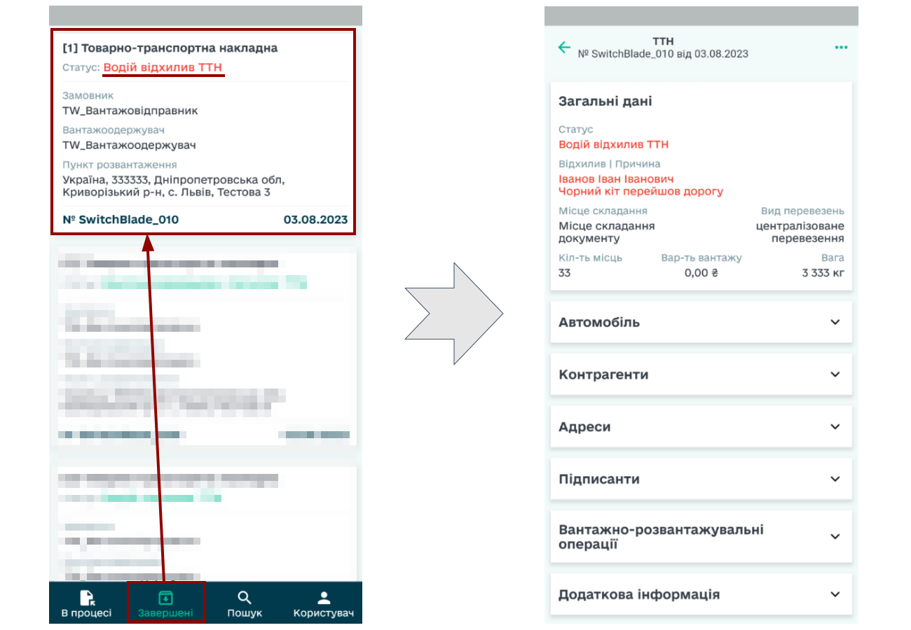
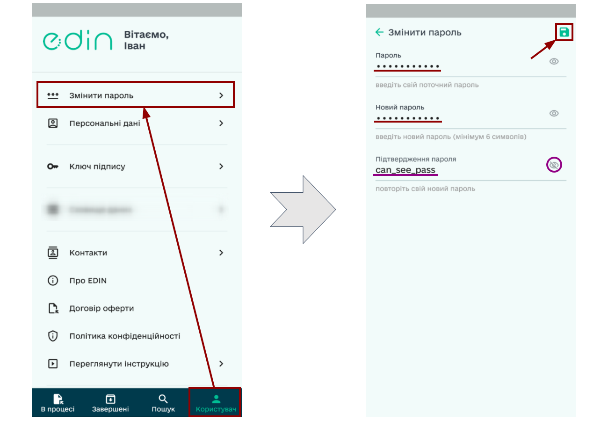
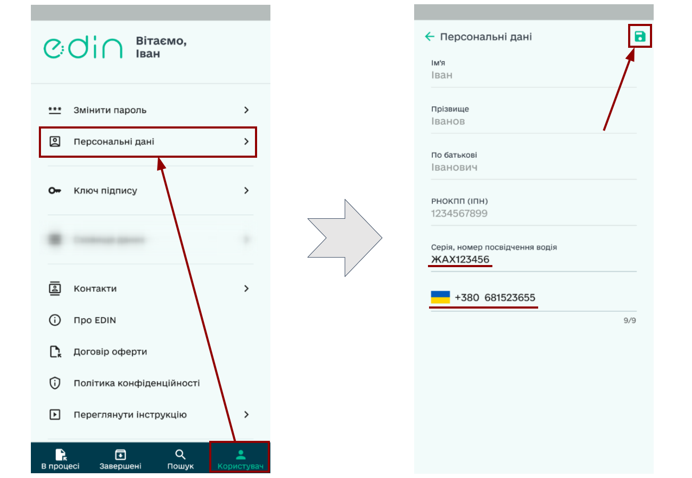
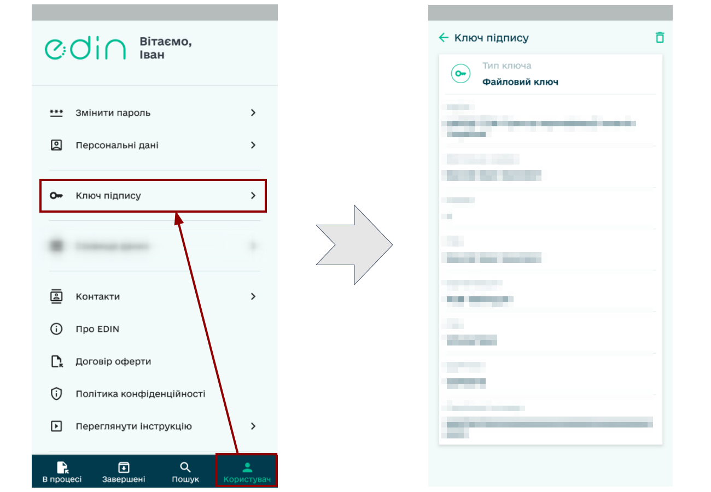

########################################################################################################################
**Android** | Робота в додатку "EDIN Driver" (інструкція для Водіїв)
########################################################################################################################

.. сюда закину немного картинок для текста

.. |diskette| image:: /_constant/icons/diskette.png

.. |green_trash| image:: /_constant/icons/green_trash.png

.. contents:: Зміст:
   :depth: 5

---------

.. attention::
   Для коректної роботи сервісу додаток **"EDIN Driver"** та всі додатки, від яких залежить підписання мають бути оновлені до останньої версії!

.. _app-install:

1 Встановлення додатка **"EDIN Driver"**
==============================================

Для встановлення додатка **"EDIN Driver"** Ви можете пройти за `посиланням <https://play.google.com/store/apps/details?id=org.edin.edin_driver>`__ чи самостійно знайти віджет за назвою в **"Google Play Market"**. Далі потрібно **"Установити"** додаток:

Встановлений додаток **"EDIN Driver"** можливо одразу **"Відкрити"** з **"Google Play Market"** чи знайти серед встановлених додатків на Вашому пристрої за назвою:

.. image:: pics_Android/Android_002.png
   :align: center

.. note::
   Користуватись додатком можуть лише зареєстровані водії (детальніше в наступному розділі інструкції; додатково: `інструкція з реєстрації на web (через браузер) <https://wiki.edin.ua/uk/latest/general_2_0/Driver_registration.html>`__).

.. _key-add:

2 Авторизація/Реєстрація Водія в додатку **"EDIN Driver"**
===============================================================

Для самостійної реєстрації в додатку **"EDIN Driver"** **Водію** необхідно на сторінці авторизації натиснути на кнопку **"Зареєструватися"**, ввести свою пошту, вигадати пароль та знову натиснути **"Зареєструватися"**. Після чого **Водію** на вказану пошту відправляється лист з посиланням для підтвердження реєстрації - перейдіть за посиланням (дійсне 72 години) в ньому щоб підтвердити email:

.. attention::
   Лист міг потрапити до спаму. Тому перевірте не тільки "Вхідні", але й "Спам". В разі попадання до спаму налаштуйте правила, щоб наступні листи від EDIN не потрапляли до спаму.

Для продовження потрібно **"Вибрати"** один із способів для ідентифікації за Вашим КЕП:

.. tabs::

   .. tab:: Файловий ключ

      При використанні файлового ключа Ви маєте переконатись, що він знаходиться на Вашому пристрої! Потрібно обрати **"Файловий ключ"** -> **"Додати файловий ключ"**:

      .. image:: pics_Android/Android_025.png
         :align: center

      За потреби потрібно дозволити доступ додатку **"EDIN Driver"** до Ваших файлів та обрати серед них Ваш ключ. Далі потрібно обрати зі списку АЦСК, що видав Вам ключ, вказати пароль і натиснути **"Підписати"**. Ваші дані підтягнуться автоматично (при першій реєстрації потрібно ще вказати **Серію та номер посвідчення водія** і **Номер телефону**):

      .. image:: pics_Android/Android_027.png
         :align: center

      Тепер Ваш ключ підпису відображається в меню **"Користувач"** -> **"Ключ підпису"** (за потреби там його можливо замінити).

   .. tab:: ПриватБанк (SmartID)

      При використанні ключа від **ПриватБанк (SmartID)** Ви маєте переконатись, що у Вас встановлена остання версія додатку від банку! Потрібно обрати **"ПриватБанк (SmartID)"** -> **"Продовжити"**:

      .. image:: pics_Android/Android_026.png
         :align: center

      На першому етапі потрібно дозволити відкривати звернення через додаток **"Privat24"**, виконати вхід в банківський застосунок, пройти авторизацію **"SmartID"** і вже в додатку **"EDIN Driver"** натиснути на кнопку **"Підписати"**:

      .. image:: pics_Android/Android_030.png
         :align: center

      На другому етапі потрібно знову пройти авторизацію **"SmartID"** та в додатку **"EDIN Driver"** натиснути на кнопку **"Продовжити"**. Ваші дані підтягнуться автоматично (при першій реєстрації потрібно ще вказати **Серію та номер посвідчення водія** і **Номер телефону**):
      
      .. image:: pics_Android/Android_029.png
         :align: center
      
      Тепер Ваш ключ підпису відображається в меню **"Користувач"** -> **"Ключ підпису"** (за потреби там його можливо замінити).

   .. tab:: Дія.Підпис

      При використанні ключа від **Дія.Підпис** Ви маєте переконатись, що у Вас встановлена остання версія цього додатку! Потрібно обрати **"Дія.Підпис"** і натиснути кнопку **"Так / Ні"** в залежності від того чи є в **"Дія"** Ваше посвідчення водія:

      .. image:: pics_Android/Android_031.png
         :align: center
         
      Далі потрібно виконати авторизований вхід в додаток **Дія**, натиснути **"Підписати"** запит на отримання копій документів від компанії АТС (після чого потрібно підтвердити код для **Дія.Підпис**):

      .. image:: pics_Android/Android_032.png
         :align: center

      Далі підписані документи потрібно **"Надіслати через Дію"**, попередньо відмітивши галочкою згоду на передачу даних третій стороні. Натисніть кнопку **"Продовжити"** для повернення в додаток **"EDIN Driver"**. Ваші дані підтягнуться автоматично (якщо дані Вашого водійського посвідчення відсутні в **"Дія"**, то додаток попросить їх вказати):

      .. image:: pics_Android/Android_033.png
         :align: center

.. _sign:

3 Підписання е-ТТН в EDIN "Driver"
====================================================================

У вкладці **"В процесі"** відображаються е-ТТН, які Ви можете відфільтрувати ("Всі", "Підписані", "Не підписані"). Для того, щоб детальніше ознайомитись з документом потрібно натиснути на нього, а вибір документа здійснюється "свайпами" вліво вправо:

.. image:: pics_Android/Android_008.gif
   :height: 500px
   :align: center

.. hint::
   "Не підписані" е-ТТН документи можливо підписати **кожен окремо** чи **масово**, обравши кілька документів. 

1) Для того, щоб **підписати 1 документ** потрібно при перегляді документа чи у вкладці **"В процесі"** обрати не підписаний документ і натиснути **"Підписати"**:

.. image:: pics_Android/Android_009.png
   :height: 500px
   :align: center

2) Для того, щоб **підписати кілька документів** потрібно у вкладці **"В процесі"** серед **"Не підписаних"** документів **затиснути** один із документів (для активації функціоналу масового підписання), відмітити потрібні документи чи **"Обрати всі"** та натиснути **"Підписати (к-ть)"**:

.. note::
   При підписанні за допомогою ключа Fozzy в додаток "ІІТ Клієнт підпису" надходить запит, який потрібно **"Обробити"** (якщо Водій попердньо не ввів і не підтвердив у додатку свій код підпису, то додаток запитає код перед надсиланням запиту до IIT):

   .. image:: pics_Android/Android_011.png
      :height: 500px
      :align: center

Обрані документи підписано: з даними підписантів Ви можете ознайомитись відкривши **"Підписантів"** у документі:

Після того, як Вантажоодержувач підписує та надсилає е-ТТН документ зі своєї сторони, його статус змінюється (Ви отримаєте сповіщення) на **"Вантажоодержувач підписав ТТН"** і він автоматично переноситься у вкладку **"Завершені"**:

.. image:: pics_Android/Android_020.png
   :height: 500px
   :align: center

.. hint::
   Для зручної роботи з новими та поточними документами в додатку EDIN "Driver" старі документи можливо **"Перемістити в завершені"** (після цього документ не буде відображатись в розділі **"В процесі"**): 

   .. image:: pics_Android/Android_013.png
      :height: 500px
      :align: center

.. _reject:

4 Відхилення е-ТТН в EDIN "Driver"
====================================================================

Для того, щоб **відхилити документ** потрібно при перегляді документа чи у вкладці **"В процесі"** обрати не підписаний документ і натиснути **"Відхилити"**; потрібно вказати текстом принину відхилення (для ваших контрагентів) та ще раз натиснути **"Відхилити"**:

Відхилений документ змінює свій статус на **"Водій відхилив ТТН"** та автоматично потрапляє у вкладку **"Завершені"**, при перегляді якого відображається Ваш коментар-причина відхилення:

.. _settings:

5 Налаштування EDIN "Driver" та корисна інформація
====================================================================

У вкладці **"Користувач"** зберігаються Ваші персональні налаштування, політика та правила користування застосунком, наші контакти та інша корисна інформація.

Для **зміни пароля** потрібно у вкладці **"Користувач"** обрати **"Змінити пароль"** і у відкритій формі ввести Ваш поточний пароль, ввести новий пароль (мінімум 6 символів), повтоно ввести новий пароль (щоб уникнути помилки при наборі) та обов'язково **Зберегти** введені зміни за допомогою кнопки з іконкою |diskette|:

Для **зміни даних водійського посвідчення та/чи номера телефону** потрібно у вкладці **"Користувач"** обрати **"Персональні дані"**, внести зміни та **Зберегти** введені зміни за допомогою кнопки з іконкою |diskette|:

.. hint::
   Для заміни коду країни номера телефону потрібно натиснути на прапор з кодом та обрати країну зі списку (для зручності можливо скористатись пошуком за назвою (лат.) чи кодом):

   .. image:: pics_Android/Android_017.png
      :height: 500px
      :align: center

Для **зміни чи додавання ключа підпису** потрібно у вкладці **"Користувач"** обрати **"Ключ підпису"**. Після `Додавання ключа <https://wiki.edin.ua/uk/latest/Driver/Instructions/Android.html#key-add>`__ (опис за посиланням) Вам відкриються детальні дані доданого ключа, що автоматично підтягується для `Підписання <https://wiki.edin.ua/uk/latest/Driver/Instructions/Android.html#sign>`__:

В додатку EDIN "Driver" зберігається лише один ключ - для додавання іншого ключа підпису поточний потрібно **Видалити** за допомогою кнопки з іконкою |green_trash|.

.. hint::
   Якщо пристрій, на якому встановлено EDIN "Driver" використовується кількома водіями: ми наполегливо рекомендуємо здійснювати **"Вихід"** з додатка перед передаванням такого пристрою іншій особі, щоб убезпечити Вашу конфіденційну інформацію!  

   .. image:: pics_Android/Android_019.png
      :height: 500px
      :align: center

---------------------------------

.. include:: /_constant/kontakti.rst

