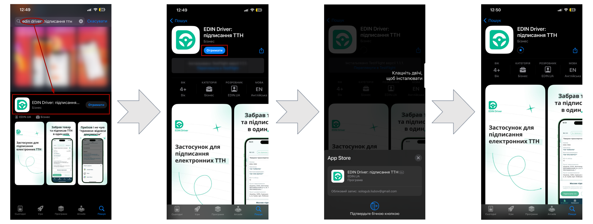
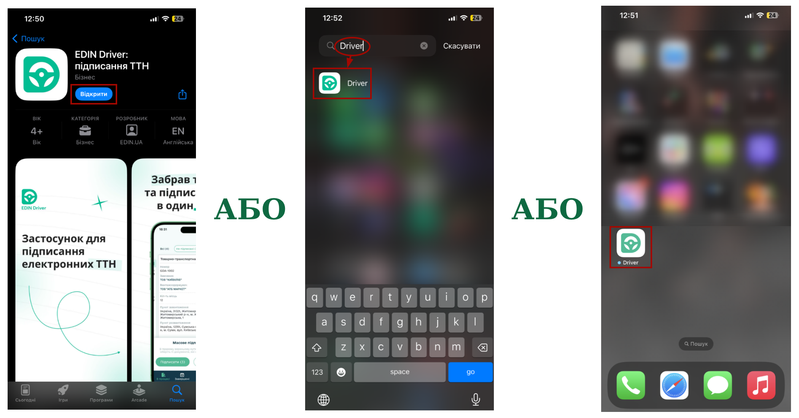

########################################################################################################################
|apple_logo| **iOS** | Робота в додатку "EDIN Driver" (інструкція для Водіїв)
########################################################################################################################

.. сюда закину немного картинок для текста

.. |diskette| image:: /_constant/icons/diskette.png

.. |green_trash| image:: /_constant/icons/green_trash.png

.. |apple_logo| image:: /_constant/icons/apple_logo.png
                  :height: 30px

.. |app-store| image:: /_constant/icons/app-store.png
                  :height: 35px
                  :target: https://apps.apple.com/ua/app/edin-driver-signing-waybill/id1658986357

.. contents:: Зміст:
   :depth: 5

---------

.. attention::
   Для коректної роботи сервісу додаток **"EDIN Driver"** та всі додатки, від яких залежить підписання мають бути оновлені до останньої версії!

.. _app-install:

1 Встановлення додатка **"EDIN Driver"**
==============================================

Для встановлення додатка **"EDIN Driver"** натисніть на кнопку |app-store| чи самостійно знайдіть віджет за назвою в **"Apple App Store"**. Далі потрібно **"Отримати"** додаток (потребує підтвердження):

Встановлений додаток **"EDIN Driver"** можливо одразу **"Відкрити"** з **"Apple App Store"** чи знайти серед встановлених додатків на Вашому пристрої за назвою:

.. include:: /Driver/Instructions/Android.rst
   :start-after: .. початок блоку для Android_to_iOS_001
   :end-before: .. кінець блоку для Android_to_iOS_001

RAW

.. raw:: html

    

        <iframe src="https://wiki.edin.ua/uk/latest/_static/videos/som.mp4" frameborder="0" allowfullscreen style="position: absolute; top: 0; left: 0; width: 100%; height: 100%;"></iframe>
    

Посилання на https://m.ourplay.net

1111111111111111111

.. raw:: html

    <embed>
        

            <source src="https://wiki.edin.ua/uk/latest/_static/videos/som.mp4" poster="https://raw.githubusercontent.com/EDI-N/For_Video/main/docs/Videos/placeholder.png" type="video/mp4">
         </video>
      

    </embed>

22222222222222222222

.. raw:: html

    <embed>
        

        <video width="470" height="255" oster="https://raw.githubusercontent.com/EDI-N/For_Video/main/docs/Videos/placeholder.png" controls>
            <source src="https://wiki.edin.ua/uk/latest/_static/videos/som.mp4" type="video/mp4">
         </video>
      

    </embed>

333333333333333333333333

.. raw:: html

    <embed>
        <video width="470" height="255" oster="https://raw.githubusercontent.com/EDI-N/For_Video/main/docs/Videos/placeholder.png" controls>
            <source src="https://wiki.edin.ua/uk/latest/_static/videos/som.mp4" type="video/mp4">
         </video>
    </embed>

---------------------------------

.. include:: /_constant/kontakti.rst

