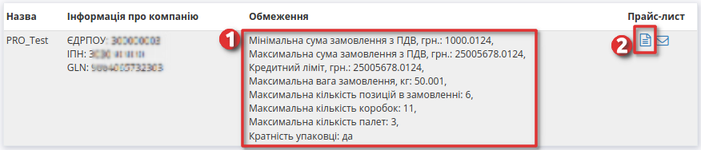
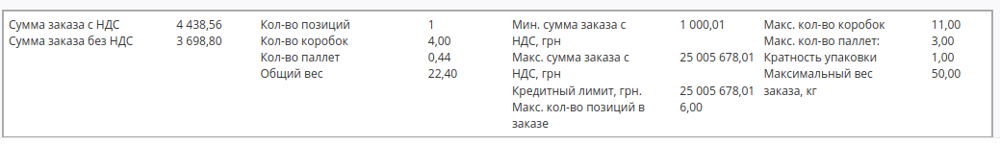
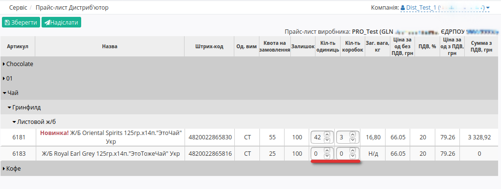

Прайс-лист Виробник. Інструкція для виробника
########################################################################

Створення замовлення по прайс-листу.

---------

.. contents:: Зміст:
   :depth: 2

---------

Вступ
************************************

EDIN-Distribution - сервіс електронного документообігу між виробниками, дистриб'юторами та оптовими покупцями. Сервіс дозволяє проводити обмін прайс-листами та іншими логістичними документами. EDIN-Distribution орієнтований на прискорення та спрощення документообігу, який допомагає уникати формування більшості помилок в документах з партнерами.

Дана інструкція описує порядок формування документа «Замовлення по прайсу» і обов’язкові для заповнення поля. Замовлення проводиться в бланку, основаному на даних для переданих виробником в документі Прайс-лист. Крім того, постачальником можуть бути встановлені обмеження щодо максимальної ваги, максимального об’єму, максимальної кількості позицій і мінімальній сумі замовленої партії - тобто .

Перегляд списку виробників
************************************

Для перегляду списку контрагентів і подальшої роботи з прайс-листами необхідно виконати вхід в систему за допомогою наданих логіна і пароля. Далі серед доступних сервісів виберіть **Дистриб'ютор**

.. image:: pics_dlia_dystrybiutora/Instruktsiia_dlia_dystrybiutora_01.png
   :align: center

Після вибору сервісу відобразиться сторінка **Прайс-лист Дистриб'ютор** з усіма розділами, а саме вкладка з Контрагентами - виробниками. 

.. image:: pics_dlia_dystrybiutora/Instruktsiia_dlia_dystrybiutora_02.png
   :align: center

У таблиці подана така інформація про Контрагента:

 - Назва	
 - Інформація про компанію	
 - Обмеження	
 - Прайс-лист

Можливі дії з Контрагентами: 1 - **перегляд Обмежень** та 2 - **перегляд Прайс-листа**.

Перегляд прайс-листа виробника
************************************
Для перегляду прайс-листа, натисніть на значок **Переглянути прайс-лист** у відповідній колонці навпроти виробника.
Відкриється нове вікно прайс-листа з усіма доданими позиціями, згруртованими за лінійкою продукціі, категоріями та підкатегоріями.

Каталог продукції в бланку замовлення по прайс-листу групується в три рівня. Можна приховувати окремі лінійки товарів, натиснувши на назву лінійки. Натискання на назву категорії приводить до відображення або приховання вмісту категорії групи.Кожна категорія може містити декілька підкатегорій з товарними позиціями.

.. image:: pics_dlia_dystrybiutora/Instruktsiia_dlia_dystrybiutora_04_1.png
   :align: center

Якщо постачальник відправляє в Прайс-листі свої дані про залишки продукції, то ці значення відображаються в бланку в колонці **Залишок**. Встановлені постачальником обмеження на максимальну кількість товару в одному замовленні відображаються у стовпці **Квота на замовлення**.

 Помітки *Новинка!*, *Акція!* та *Публічна позиція!* додає виробник.

Під табличною частиною з позиціями ви можете переглягути обмеження на замовлення, встановлені виробником.

Створення Замовлення по прайсу
************************************
Для створення Замовлення, необхідно заповнити ствопці **Кіл-ть одиниць** та **Кіл-ть коробок** враховуючи встановлені обмеження.

Після введення замовляємої кількості по позиції, автоматично для неї розраховується кількість коробок (палет), Загальна вага та Сума з ПДВ,грн.

При заповненнв кількості одиниць або кількості коробок, якщо поле позначене червоним  - перевірте, чи не перевищили ви обмеження та квоти, а також відповідність кількості одиниць до кількості коробок. В такому випадку, зменшите кількість товару в замовленні до рівня, який дозволяє дотримуватись обмежень. Натисніть на назву позиції або штрихкод для відображеня детальної інформації.

.. image:: pics_dlia_dystrybiutora/Instruktsiia_dlia_dystrybiutora_4_3.png
   :align: center

Якщо у вас виникнуть питання щодо значень встановлених обмежень, зверніться безпосередньо до постачальника.

Ви можете зберегти введену інформацію та повернутись до Замовлення пізніше - просто натисніть кнопку **Зберегти**, а якщо захочите продовжити оформлення, відкрийте прайс-лист виробника та продовжіть роботу.

.. image:: pics_dlia_dystrybiutora/Instruktsiia_dlia_dystrybiutora_005.png
   :align: center

Перед збереженням переконайтеся в тому, що не перевищено обмеження на розмір однієї партії в замовленні - в блоці Підсумки не повинно бути значень, виділених червоним кольором.

 Якщо ліміт по одному з встановлених обмежень перевищено, замовлення не відправиться.

Для оформлення замовлення натисніть кнопку **Відправити**.
Якщо кількість було введено неправильно, при спробі надіслати замовлення відобразиться інформаційне вікно з описом помилки. Якщо всі поля заповненно коректно, створиться **Форма Замовлення**  - поля відмічені червоною зірочкою *** обовязкові для заповнення**!

.. image:: pics_dlia_dystrybiutora/Instruktsiia_dlia_dystrybiutora_06_order.png
   :align: center

- №* - недоступно для редагування;
- від* - вкажіть дату замовлення;
- Дата доставки* - вкажіть дату доставки;
- Місце доставки - виберіть місце доставки з випадаючого списку 
- Постачальник - GLN виробника з прайс-листа, недоступно для редагування; 
- Покупець - GLN дистриб'ютора з прайс-листа, недоступно для редагування;
- Валюта: грн - недоступно для редагування;
- Тип документа: Оригинал - недоступно для редагування;

Після заповнення усіх полів (й лише тоді) стане активною кпопка **Відправити**. 

Перегляд Замовлення
**************************************************

Після відправки, Замовлення вже не доступно для редагування, його можна лише переглянути в папці *Надіслані*.
У замовлені ви можете перевірити такі данні як наприклад GLN Покупця, GLN Місця доставки, або дату коли поставка відбудеться.
Ви можете скачати замовлення у форматі .pdf, .xls, .xml, .zip або відразу відправити на друк.

.. image:: pics_dlia_dystrybiutora/Instruktsiia_dlia_dystrybiutora_order_1.png
   :align: center

Користувачі замовника, наприклад, співробітники бухгалтерії, зайшовши в відправлений документ, можуть додавати до нього свої Коментарі. Видалити коментар неможливо.

.. image:: pics_dlia_dystrybiutora/Instruktsiia_dlia_dystrybiutora_order_2.png
   :align: center

Отримувач Замовлення також може лишати в ньому коментарі.

.. include:: kontakti.rst