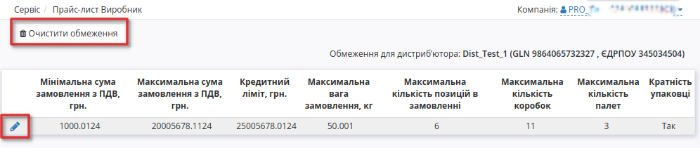
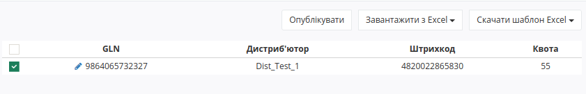
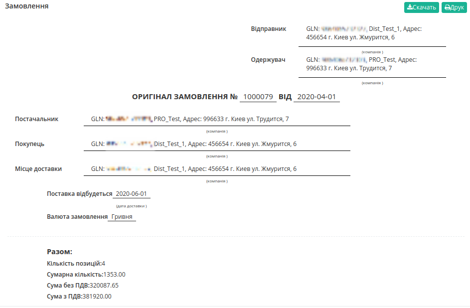

Створення прайс-листа. Інструкція для виробника.
#################################################################
---------

.. contents:: Зміст:
   :depth: 2

---------

Вступ
************************************

EDIN-Distribution - сервіс електронного документообігу між виробниками, дистриб'юторами та оптовими покупцями. Сервіс дозволяє проводити обмін прайс-листами та іншими логістичними документами. DistribEx - сервіс орієнтований на прискорення та спрощення документообігу, який допомагає уникати формування більшості помилок в документах з партнерами.

.. note:: Всі дані, наведені в Інструкції - фіктивні, використовуються тільки в якості прикладу 

Перегляд списку дистриб'юторів
************************************
Для перегляду списку покупців і подальшої роботи з прайс-листами необхідно виконати вхід в систему за допомогою наданих логіна і пароля. Далі серед доступних сервісів виберіть **Виробник**

.. image:: pics_dlia_vyrobnyka/Instruktsiia_dlia_vyrobnyka_1.png
   :align: center

Після вибору сервісу відобразиться сторінка **Прайс-лист Виробник** з усіма розділами, а саме вкладка з Контрагентами - дистриб'юторами. 

.. image:: pics_dlia_vyrobnyka/Instruktsiia_dlia_vyrobnyka_01.png
   :align: center

У таблиці подана така інформація про Контрагента:

 - Назва	
 - Інформація про компанію	
 - Група	
 - Обмеження	
 - Прайс-лист

Можливі дії з Контрагентами - перегляд та редагування **Обмежень** та перегляд **Прайс-листа**. Для створення прайс-листа перейдіть у розділ *Масове завантаження*.

Перегляд, редагування та очищення прайс-листа
--------------------------------------------------

Для перегляду прайс-листа, натисніть на значок **Переглянути прайс-лист** у відповідній колонці навпроти дистриб'ютора.
Відкриється нове вікно з усіма доданими позиціями, згруртованими за лінійкою продукціі та категоріями.

.. image:: pics_dlia_vyrobnyka/Instruktsiia_dlia_vyrobnyka_02.png
   :align: center

У цьому вікні ви можете редагувати дані позицій, або назву категорій - для цього натисніть на назву товарної позиції.  Відкриється вікно з Даними позиції - поля відмічені червоною зірочкою *** обовязкові для заповнення**!

Також тут ви можете повністю видалити прайс-лист для данного дистриб'ютора натиснувши **Очистити прайс-лист** або видалити якусь конкретну позицію.

Перегляд, редагування та очищення обмежень
--------------------------------------------------
Для перегляду Обмежень, на сторінці контрагентів натисніть на колонку **Обмеження** навпроти потрібного контрагента. Відкриється сторінка зі встановленими обмеженнями, які ви можете редагувати або видалити усі обмеження для цього дистриб'ютора.

Можливі обмеження:

- Мінімальна сума замовлення з ПДВ, грн.
- Максимальна сума замовлення з ПДВ, грн.	
- Кредитний ліміт, грн.	
- Максимальна вага замовлення, кг	
- Максимальна кількість позицій в замовленні	
- Максимальна кількість коробок	
- Максимальна кількість палет	
- Кратність упаковці

.. image:: pics_dlia_vyrobnyka/Instruktsiia_dlia_vyrobnyka_09.png
   :align: center

Масове завантаження
*************************
Масове завантаження доступно лише для Виробника. У цьому розділі можливе створення прайс-листа, а також встановлення обмежень та квот.

   Обмеження встановлюються на все замовлення, наприклад на максимальну можливу сумму замовлення; квота  - обмеження кількості одиниць певного товару до замовлення

У розділі доступно дві кнопки: 1 - **Скачати шаблон Excel** та 2 -  **Завантажити з Excel**. Під кожною кнопкою можливі відповідні дії по завантаженню прайс-листа, встановлення обмеження або квот.

.. image:: pics_dlia_vyrobnyka/Instruktsiia_dlia_vyrobnyka_04.png
   :align: center

Додавання прайс-листа
-----------------------------------------

Для коректного формування прайс-листа завантажте шаблон кліком по кнопці *Скачати шаблон прайс-листа*. Автоматично почнеться скачування шаблону у форматі .xls

.. important::
   Зверніть увагу! Видаляти, міняти місцями колонки в шаблоні не можна. Ви можете не заповнювати не обовязкові стовпці, але не видаляйте їх.

Відкрийте та заповніть файл Excel. Колонки виділенні зеленим кольором - **обов'язкові для заповнення**! Деякі стовпці мають підказки до заповнення - наведіть курсор у верхній куток назви стовпця для відображення підказки: 

.. image:: pics_dlia_vyrobnyka/Instruktsiia_dlia_vyrobnyka_05.png
   :align: center

Обовязкові для заповнення в шаблоні дані:

- Линейка	
- Категория	
- Подкатегория	
- Артикул	
- Наименование	
- Штрихкод 
- Ед. в кор. 
- Цена/ед. без НДС, грн.

Після заповнення шаблону, збережіть його!

Для завантаження прайс-листа на платформу натисніть на кнопку **«Завантажити з Excel»** та виберіть у новому вікні збережений файл. 

Якщо якусь з колонок заповнено некоректно, позиція зафарбується помаранчевим кольором, та з'явиться повідомлення про помилку, у якій буде вказано який саме стовбець потрібно виправити. 

 Навіть якщо деякі позиції додані неправильно, ви все одно можете додати позиції без помилок.

Якщо всі дані заповнено вірно, перед вами відобразиться список доданих товарів. Відмітьте чекером усі товари які ви хочете додати. 

.. image:: pics_dlia_vyrobnyka/Instruktsiia_dlia_vyrobnyka_06.png
   :align: center

Далі з ними можливі дії - віднести їх до певного дистриб'ютора чи вибрати всіх відразу. Встановіть Період дії: внесіть дату початку (не раніше поточної дати) і дату закінчення; Після натисніть на кнопку **«Опублікувати»** - після цього товари відобразяться у загальному прайс-листу (або лише у вказаного дистриб’ютора). 

Ви можете редагувати позицію при перегляді прайс-листа вибраного дистриб'ютора, наприклад додати або відмінити помітки *Новинка!*, *Акція!* та *Публічна позиція!* або інші дані.

Таким способом ви можете оновлювати прайс-лист для кожного окремого дистриб'ютора, чи додавати нові позиції і навіть лінійки та категорії товарів для усіх контрагентів відразу.

.. note:: Зверніть увагу, що перш ніж Опублікувати, ви можете перевірити та редагувати дані!

Додавання обмежень
-----------------------------------------
Для коректного формування обмежень завантажте шаблон кліком по кнопці *Скачати шаблон обмежень*. Автоматично почнеться скачування шаблону у форматі .xls

.. important::
   Зверніть увагу! Видаляти, міняти місцями колонки в шаблоні не можна. Ви можете не заповнювати не обовязкові стовпці, але не видаляйте їх.

Відкрийте та заповніть файл Excel. Колонки виділенні зеленим кольором - **обов'язкові для заповнення**! 

Для встановлення обмежень обов'язковим для заповнення є лише **GLN** контрагента, для якого ви становлюєте обмеження. Зазначений GLN повинен бути у списку Ваших дистриб'юторів!

Після заповнення шаблону, збережіть його!

Для завантаження обмежень на платформу натисніть на кнопку **«Завантажити з Excel»** та виберіть у новому вікні збережений файл. 

.. image:: pics_dlia_vyrobnyka/Instruktsiia_dlia_vyrobnyka_10.png
   :align: center

Після натисніть на кнопку **«Опублікувати»** - після цього обмеження відобразяться у вказаного дистриб’ютора та будуть діяти при оформленні замовлення.

.. note:: Зверніть увагу, що перш ніж Опублікувати, ви можете перевірити та редагувати дані!

Додавання квот
-----------------------------------------
Для коректного додавання квот завантажте шаблон кліком по кнопці *Скачати шаблон квот*. Автоматично почнеться скачування шаблону у форматі .xls

.. important::
   Зверніть увагу! Видаляти, міняти місцями колонки в шаблоні не можна. Ви можете не заповнювати не обовязкові стовпці, але не видаляйте їх.

Відкрийте та заповніть файл Excel. Колонки виділенні зеленим кольором - **обов'язкові для заповнення**! 

Для встановлення квот обов'язковими для заповнення є **GLN** контрагента, для якого ви становлюється квота, **Штрихкод** позиції та безпосередню сама **Квота**, тобто кількість товару до замовлення. Зазначений GLN повинен бути серед списку Ваших дистриб'юторів!

Після заповнення шаблону, збережіть його!

Для завантаження квот на платформу натисніть на кнопку **«Завантажити з Excel»** та виберіть у новому вікні збережений файл. 

Після натисніть на кнопку **«Опублікувати»** - після цього квота буде діяти при оформленні замовлення. Переглянути квоти можливо при перегляді прайсу, у стовпці "Квота на замовленя".

.. note:: Зверніть увагу, що перш ніж Опублікувати, ви можете перевірити та редагувати дані!

Перегляд Замовлення
******************************************
У розділі "Вхідні" відображається список оформлених замовлень від дистриб'юторів:

.. image:: pics_dlia_vyrobnyka/Instruktsiia_dlia_vyrobnyka_07.png
   :align: center

У замовлені ви можете перевірити такі данні як наприклад GLN Покупця, GLN Місця доставки, або дату коли поставка відбудеться.
Ви можете скачати замовлення у форматі .pdf, .xls, .xml, .zip або відразу відправити на друк.

Під основною інформацією - таблична частина з позиціями. Натисніть *"Показати повністю"* щоб розгорнути всю інформацію за позиціями, або розгорніть лише одні, натиснувши на знак біля номеру позиції.

.. image:: pics_dlia_vyrobnyka/Instruktsiia_dlia_vyrobnyka_order_12_2.png
   :align: center

Під позиціями можливо залишити коментар - видалити коментар неможливо.

Додавання нового дистриб'ютора
****************************************

Щоб додати нового покупця, зверніться до вашого менеджера в компанії АТС.

У випадку ротації дистриб’юторів і покупців, звертайтесь до вашого менеджера в компанії АТС.

Відправлення прайс-листів дистриб’юторам з облікової системи
---------------------------------------------------------------
В компанії АТС розроблена специфікація XML. Щоб налаштувати відправлення прайсів безпосередньо з вашої облікової системи дистриб’юторам, зверніться до вашого менеджера в компанії АТС.

.. include:: kontakti.rst
