####################################################
Інструкція адміністратора користувачів
####################################################
---------

.. contents:: Зміст:
   :depth: 2

---------

Дана інструкція описує порядок дій адміністратора користувачів зі створення, редагування ролей та облікових записів користувачів.

1 Терміни та визначення
------------------------

- Компанія – юридична чи фізична особа, яка використовує систему для виконання своїх процесів. До одного акаунта можливо прив’язати декілька компаній. Документи, довідники, типи комплектів і контракти створюються в межах компанії і закріплюються за нею.

 - Роль користувача – визначає обмеження доступу до розділів системи.

 - Користувач – працівник, який буде створювати, редагувати, підписувати чи обробляти комплект документів. Для користувачів, що оброблятимуть комплект документів, налаштовуються доступи до комплектів.

 - Адміністратор Компанії та модуля Cryptex (АК) – користувач, який відповідає за налаштування Компанії, модуля Cryptex, налаштовує роботу з сертифікатами та ключами шифрування. АК має доступ до розділів «Журнал подій» (перегляд), «Шифрування» в карточці компанії та «Сертифікати» (редагування).

 - Адміністратор користувачів (АП) – користувач, відповідальний за створення, редагування облікових записів користувачів, присвоєння ролей користувачам. Для АП доступний розділ «Користувачі».

 - Адміністратор ролей (АР) – користувач, що відповідає за створення та редагування ролей, налаштування доступів до комплектів (присвоєння довідників та їх значень). Для АР доступний розділ «Ролі».

 - Бізнес-адміністратор (БА) – користувач, відповідальний за налаштування та введення довідників, обробку контрактів, налаштування компанії, налаштування та керування комплектами та типами документів. БА доступні розділи «Мої компанії», «Сценарії документообігу», «Налаштування комплектів документів».

2 Авторизація
--------------
Для авторизації на платформі перейдіть за посиланням https://doc.edin.ua/auth та введіть свої логін = email і пароль на формі авторизації. Детальна інформація з авторизації міститься в `«Інструкції з авторизації»`_.

.. _«Інструкції з авторизації»: https://wiki.edin.ua/uk/latest/EDIN_DOCflow/edin_docflow/instruktsia-avtorizatsia.html

3 Створення облікового запису користувача
-------------------------------------------
Для створення облікового запису нового користувача перейдіть до розділу меню «Налаштування доступу» - «Користувачі». В розділі відображається перелік вже існуючих облікових записів користувачів. Список можливо відфільтрувати за статусом або скористатися пошуком за ПІБ чи email.

Для створення облікового запису користувача натисніть «Створити користувача»:

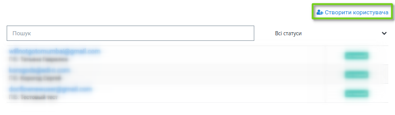

Форма створення / редагування облікового запису користувача містить наступні вкладки:

 - Основна інформація – містить базову інформацію з налаштувань користувача, дозволяє задати рівень складності пароля, дає можливість скинути пароль для користувача

 - Білий список – використовується для налаштування білого списку доступних ІР-адрес, з яких буде можливо заходити на платформу

 - Ролі – вкладка для призначення ролей користувачам

 - Шифрування – вкладка для встановлення параметрів розшифрування документів

 - Доступ до комплектів – містить перелік контрактів і типів комплектів, до яких має доступ користувач.

**3.1 Основна інформація**

Для створення облікового запису користувача заповніть обов’язкові поля (виділені червоним і позначені «зірочкою») форми «Основна інформація». Значення, внесене в поле Email, буде використовуватися системою як логін. Процедура зміни Email описана в «Інструкції з авторизації». 

Поле ПІБ призначене для внесення прізвища, імені та по-батькові користувача, мінімальна кількість знаків для внесення – п’ять. 

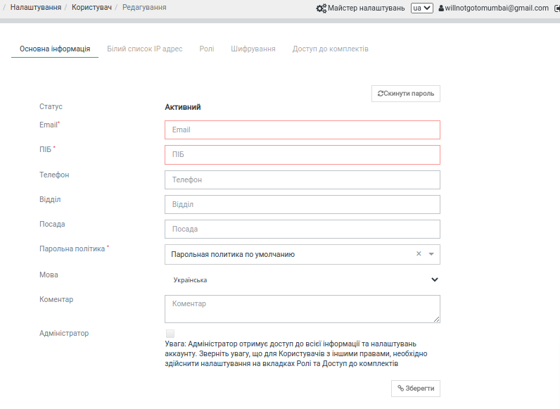

Поле «Парольна політика» містить випадаючий список рівнів парольної політики, які налаштовуються в меню «Безпека» - «Безпека акаунту» – «Парольна політика».

За відсутності інших налаштувань до користувача, для якого не встановлений рівень парольної політики, застосовуються наступні правила:

 - Обов’язкове використання капчі;

 - Час блокування користувача – 5 хвилин

 - Кількість попередніх паролів (кількість раніше використаних паролів,збережених у системі для блокування їх повторного використання) – 1

 - Мінімальна довжина пароля - 6 знаків

 - Обов’язкова наявність цифр у паролі.

.. admonition:: Зверніть увагу! 

   Значення поля Email (логін користувача) повинно бути унікальним. У разі введення даних вже зареєстрованого користувача система повідомить про помилку.

**3.2 Білий список IP-адрес**

Якщо не задано інакше, доступ дозволено з будь-якої IP-адреси:

.. image:: pics_instruktsia-administratora-polzovatelei/new_instruktsia-administratora-polzovatelei_03.png
   :align: center

Для внесення обмежень за IP-адресою користувача натисніть «Редагувати», перейдіть до вкладки *Білий список* і натисніть «Додати обмеження»:

.. image:: pics_instruktsia-administratora-polzovatelei/new_instruktsia-administratora-polzovatelei_04.png
   :align: center

Для додання IP-адреси до переліку необхідно ввести цифрове значення у відповідне поле та натиснути «Зберегти». Для зручності реалізована можливість вказати лише початкові цифри IP-адреси, замінивши останні цифри «зірочками» — * :

Після додання усіх необхідних IP-адрес натисніть кнопку «Зберегти». Система повідомить про успішне збереження даних. Обмеження за кількістю доступних IP-адрес у білому списку відсутнє. Для видалення IP-адреси з переліку натисніть «Видалити»:

**3.3 Призначення ролі**

Оскільки роль визначає перелік розділів, доступних користувачеві, призначення ролі є необхідною передумовою початку роботи нового користувача. Обмеження не стосується користувачів, які є власниками акаунта.

Для призначення ролі користувачеві натисніть «Редагувати», перейдіть до вкладки «Ролі» і натисніть «Додати»:

.. image:: pics_instruktsia-administratora-polzovatelei/new_instruktsia-administratora-polzovatelei_05.png
   :align: center

Наступним кроком виберіть роль для користувача з випадаючого списку і натисніть «Додати». У списку будуть відображені всі ролі, створені в розділі «Налаштування доступу» - «Ролі»:

.. image:: pics_instruktsia-administratora-polzovatelei/new_instruktsia-administratora-polzovatelei_06.png
   :align: center

Одному користувачеві можливо призначити декілька ролей.

Для видалення ролі зі списку призначених користувачеві натисніть позначку «Видалити» навпроти ролі.

**3.4 Шифрування**

Для визначення порядку розшифрування документів для користувача перейдіть до вкладки «Шифрування» і оберіть потрібний варіант:

.. image:: pics_instruktsia-administratora-polzovatelei/new_instruktsia-administratora-polzovatelei_07.png
   :align: center

При виборі «Розшифрувати документи за допомогою Cryptex» необхідно вказати IP-адресу серверу шифрування і порт сервера (комп’ютера), де встановлений модуль.

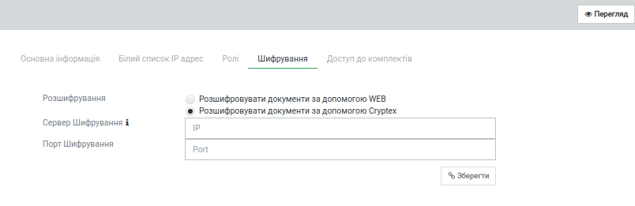

Для збереження внесених данних натисніть «Зберегти».

**3.5 Доступ до комплектів**

Доступ до комплектів використовується для визначення зв'язку користувача та сценаріїв документообігу і типів комплектів, доступних користувачеві для роботи. Список доступів до комплектів налаштовується у розділі «Налаштування доступу» - «Доступ до комплектів». Для додання доступу до комплектів до облікового запису користувача перейдіть до вкладки «Доступ до комплектів», де у вигляді списку будуть відображені всі доступи, призначені даному користувачеві. Для додання доступів натисніть «Додати»:

.. image:: pics_instruktsia-administratora-polzovatelei/new_instruktsia-administratora-polzovatelei_08.png
   :align: center

У формі, що відкриється, виберіть із випадаючого списку типи доступів. У списку для вибору будуть доступні всі типи доступів до комплектів за активними контрактами, що укладені з компаніями, які доступні користувачеві відповідно до налаштувань ролі.

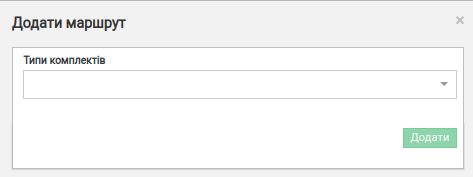

**3.6 Налаштування облікового запису користувача при інтеграції**

За відсутності інших налаштувань капча застосовується для всіх користувачів при доступі на WEB-платформу. Для користувачів із інтеграційним підключенням для обробки комплектів капча не застосовується.

Для вимкнення капчі перейдіть до розділу «Особистий кабінет» – «Акаунт» – «Парольна політика» і створіть або відредагуйте парольну політику без застосування капчі. Для цього зніміть відмітку у відповідному чекері:

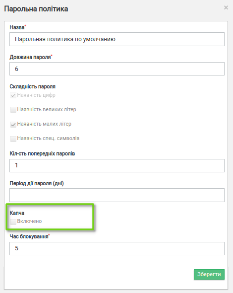

Детальніше про порядок налаштування парольної політики в пункті 4.3 даної інструкції.

В цілях безпеки для користувачів із вимкненою капчею рекомендовано налаштовувати білий список.

**3.7 Блокування користувача**

З метою обмеження доступу користувачів на плафторму реалізована можливість їх блокування. Для цього натисніть «Редагувати» у формі налаштувань облікового запису користувача. У формі, що відкриється, натисніть перемикач «Заблокувати»:

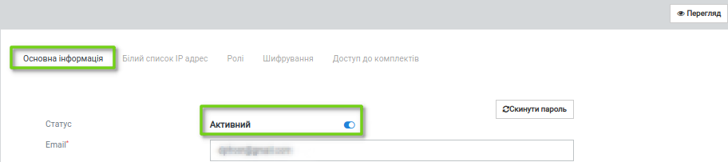

Для розблокування поверніться до форми налаштувань користувача («Налаштування доступу» – «Користувачі» - «Редагувати») та натисніть перемикач «Розблокувати»:

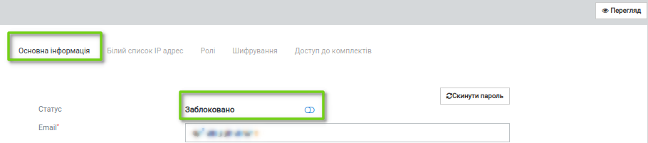

4 Налаштування акаунта
-----------------------
Для спрощення процедури створення облікових записів користувачів реалізована можливість встановлення налаштувань білого списку, шифрування та парольної політики на рівні акаунта у розділі «Безпека» - «Безпека акаунту».

**4.1 Налаштування парольної політики**

Для налаштування парольної політики перейдіть до розділу меню «Безпека» - «Безпека акаунту», вкладка «Парольна політика». На вкладці відображений перелік всіх створених рівнів парольної політики із можливістю редагування та видалення.

Для створення нового рівня натисніть «Створити»:

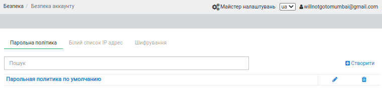

У формі створення рівня парольної політики заповніть наступні поля:

 - Назва — назва рівня парольної політики (обов’язкове для заповнення поле)

 - Довжина пароля — мінімальна кількість символів 4, максимальна - 50 (обов’язкове для заповнення поле)

 - Складність пароля — зумовлює необхідність використання у паролі наступних символів: великих літер, малих літер, спец. символів; наявність цифр обов’язкова (відмітка проставлена автоматично)

 - Кількість попередніх паролів — вказується кількість раніше використаних паролів, збережених у системі для блокування їх повторного використання; поле не обов’язкове для заповнення

 - Період дії пароля — вказується період часу, через який користувачеві необхідно змінити пароль. Якщо поле не заповнене, змінювати пароль не потрібно

 - Час блокування — мінімальне значення 3 (хвилини) , максимальне 1440 (= 24 години).

На формі також є можливість увімкнути / вимкнути капчу, встановивши відмітку у відповідному чекері:

.. image:: pics_instruktsia-administratora-polzovatelei/new_instruktsia-administratora-polzovatelei_14.png
   :align: center

Після заповнення форми налаштувань натисніть «Зберегти».

**4.2 Налаштування білого списку на рівні акаунта**

Для налаштування обмежень за IP-адресами перейдіть до розділу «Особистий кабінет» – «Акаунт», вкладка «Білий список IP адрес».

Якщо не задано інакше, доступ дозволено з будь-якої IP-адреси:

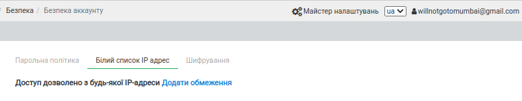

Для додання обмеження необхідно натиснути **Додати обмеження**, ввести IP-адресу, з якої користувачеві буде дозволений доступ до платформи, та натиснути «Додати»:

.. image:: pics_instruktsia-administratora-polzovatelei/new_instruktsia-administratora-polzovatelei_16.png
   :align: center

При створенні облікового запису нового користувача вказані у даному розділі IP-адреси будуть автоматично завантажені до налаштувань користувача у меню «Налаштування доступу» - «Користувачі».

**4.3 Налаштування шифрування на рівні акаунта**

Для визначення порядку розшифрування документів на рівні акаунта перейдіть до розділу «Особистий кабінет» – «Акаунт» – «Шифрування»:

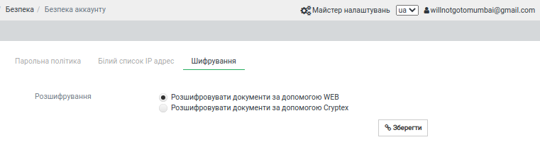
   
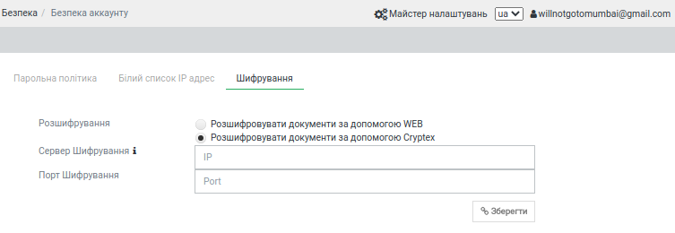

Серед доступних методів розшифрування Web або Cryptex оберіть потрібний варіант і натисніть «Зберегти». При створенні облікового запису нового користувача вказані у даному розділі налаштування будуть автоматично завантажені на вкладку «Шифрування» у формі налаштувань користувача меню «Налаштування доступу» - «Користувачі».

5 Створення ролі
-----------------
Для створення ролі перейдіть до розділу «Налаштування доступу» – «Ролі». У розділі списком відображатимуться всі ролі, створені у межах компаній облікового запису. Натисніть «Створити»:

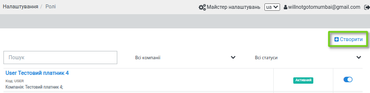

У формі, що відкриється, заповніть поля «Назва ролі», «Код ролі», «Компанія». Всі поля є обов’язковими для заповнення. Значення для поля «Компанія» необхідно вибрати з системного переліку. Значення, введене в поле «Код ролі», повинно бути унікальним у межах компанії.

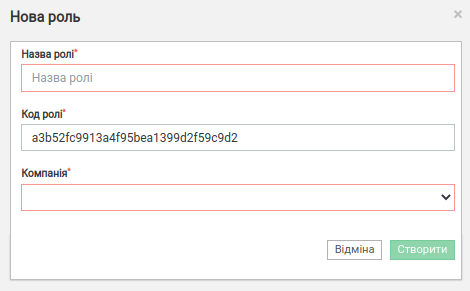

Після внесення даних натисніть «Створити». Система повідомить про успішне створення ролі і відкриє форму налаштувань.

На вкладці «Користувачі» оберіть користувачів, котрим буде призначена роль. Для цього натисніть «Додати користувача» і оберіть із переліку :

.. image:: pics_instruktsia-administratora-polzovatelei/new_instruktsia-administratora-polzovatelei_21.png
   :align: center

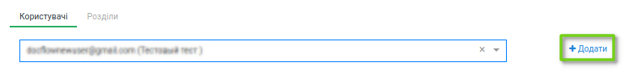

Одну роль можливо призначити декільком користувачам (кількість користувачів необмежена). Для визначення прав доступу для ролі перейдіть до вкладки «Розділи»:

.. image:: pics_instruktsia-administratora-polzovatelei/new_instruktsia-administratora-polzovatelei_23.png
   :align: center

Розділ передбачає наступні варіанти доступу:

 - Немає доступу – розділ не відображається для користувача

 - Перегляд – розділ доступний для перегляду без можливості редагування

 - Редагування і перегляд – повний доступ до всіх опцій розділу.

До початку налаштувань всі розділи є закритими для ролі (автоматично проставлена відмітка «немає доступу»). Для надання доступу встановіть відмітку напроти певного розділу та натисніть «Зберегти».

Розділи в ролі відповідають наступним розділам платформи:

 - Комплекти – «Зовнішні комплекти документів»

 - Компанії - «Налаштування компанії» - «Мої компанії»

 - Сценарії документообігу - «Контрагенти» - «Сценарії документообігу»

 - Типи комплектів - «Налаштування компанії» - «Налаштування комплектів документів»

 - Користувачі -  - «Налаштування доступу» - «Користувачі»

 - Безпека - «Безпека» - «Безпека акаунту»

 - Акаунт – «Особистий кабінет» - «Акаунт»

 - Журнал подій - «Особистий кабінет» - «Журнал подій»

 - Доступ до комплектів - «Налаштування доступу» - «Доступ до комплектів»

 - Налаштування сценаріїв документообігу - «Контрагенти» - «Сценарії документообігу»

 - Рахунки - «Особистий кабінет» - «Рахунки та акти»

 - Групи для узгодження - «Налаштування доступу» - «Групи для узгодження»

 - Узгодження - «Налаштування доступу» - «Маршрути узгодження»

 - Мої завдання - «Мої завдання»

 - Контрагенти - «Контрагенти» - «Запрошення контрагентів»

 - Внутрішній документообіг

 - Аналітика - «Аналітичні звіти»	

 - Білінг - «Особистий кабінет» - «Білінг»

 - Ролі - «Налаштування доступу» - «Ролі»

 - Список тегів - «Налаштування компанії» - «Керування тегами»

 - Сертифікати безпеки - «Безпека» - «Сертифікати безпеки»

**5.1 Рекомендації щодо налаштування спеціальних ролей**

*5.1.1 Бізнес-адміністратор*

Для налаштування ролі бізнес-адміністратора надайте доступ до редагування наступних розділів:

.. image:: pics_instruktsia-administratora-polzovatelei/new_instruktsia-administratora-polzovatelei_24.png
   :align: center

*5.1.2 Адміністратор*

Налаштування ролі адміністратора передбачає доступ до наступних розділів:

.. image:: pics_instruktsia-administratora-polzovatelei/new_instruktsia-administratora-polzovatelei_25.png
   :align: center

*5.1.3 Адміністратор користувачів*

Налаштування ролі адміністратора доступу користувачів передбачає доступ до наступних розділів:

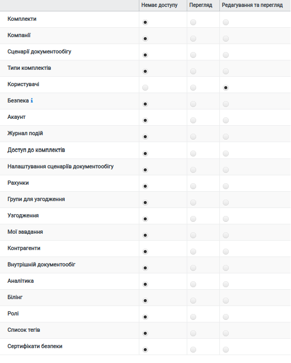

*5.1.4 Користувач*

Налаштування ролі користувача передбачає доступ до наступних розділів:

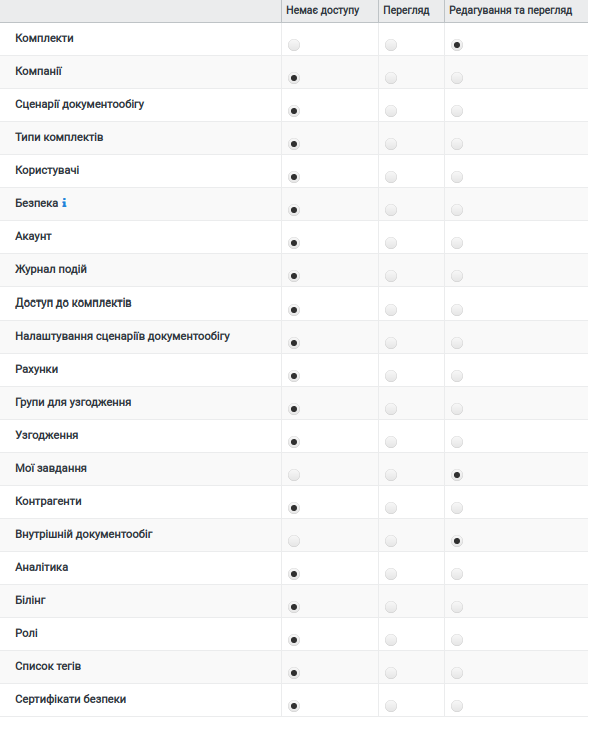

**5.2 Автоматичне створення ролей**

Для зручності ролі бізнес-адміністратора, адміністратора системи та користувача створюються автоматично при доданні нової компанії («Налаштування компанії» – «Мої компанії»- «Створити»). Роль адміністратора системи об’єднує в собі ролі адміністратора доступу та адміністратора.

.. admonition:: Зверніть увагу!

   У разі створення компанії користувачем, який не є власником акаунта, система автоматично надасть йому роль бізнес–адміністратора.

Відредагувати автоматично надану роль можливо у меню «Налаштування доступу» – «Ролі» або «Налаштування доступу» – «Користувачі» – «Редагувати» – «Роль».

**5.3 Блокування – розблокування ролі**

Для блокування / розблокування ролі переведіть перемикач у відповідне положення:

.. image:: pics_instruktsia-administratora-polzovatelei/new_instruktsia-administratora-polzovatelei_28.png
   :align: center

6 Керування розсилкою повідомлень
-----------------------------------
Для керування розсилкою повідомлень перейдіть до розділу меню «Налаштування компанії» - «Мої компанії» і виберіть зі списку потрібну компанію, натиснувши на її назву. У формі редагування, що відкриється, перейдіть до вкладки «Повідомлення»:

.. image:: pics_instruktsia-administratora-polzovatelei/new_instruktsia-administratora-polzovatelei_29.png
   :align: center

Вкладка містить наступні поля:

 - Ел. адреса для нових сценаріїв документообігу - поле для введення електронних адрес, на які надходитимуть повідомлення щодо отримання нових контрактів

 - Ел. адреса для змінених сценаріїв документообігу – поле для введення електронних адрес, на які надходитимуть повідомлення щодо зміни статусу контракту (прийняття або відхилення на стороні отримувача контракту)

 - Ел. адреса для нових комплектів – поле для введення електронних адрес, на які надходитимуть повідомлення про отримання нових комплектів

 - Ел. адреса для змінених комплектів – поле для введення електронних адрес, на які надходитимуть повідомлення при зміну статусу комплекта отримувачем (надання статусу«прийнятий», «відхилений», «відмова», «уточнення»). 

 - Ел.адреса для нових завдань на узгодження

 - Ел.адреса для нових повідомлень чату

Для кожного поля доступні варіанти:

 - Відключити – розсилка не надходитиме

 - За користувачем – розсилка надходитиме на Email користувача з відповідними правами доступу. Повідомлення про надходження нових вхідних контрактів або зміну статусу вихідних надходитимуть лише тим користувачам, що мають доступ на перегляд та редагування розділу «Контракти», а також доступ до компанії відповідно до ролі. Повідомлення про надходження нових комплектів або зміну статусу комплекта отримувачем будуть надходити лише тим користувачам, що мають доступ на перегляд та редагування розділу «Зовнішні комплекти документів», а також доступ до комплекта відповідно до ролі та доступу до комплектів. Всі повідомлення також будуть надходити власнику акаунта.

 - Вказані адреси – розсилка надходитиме на вказані адреси:

.. image:: pics_instruktsia-administratora-polzovatelei/new_instruktsia-administratora-polzovatelei_30.png
   :align: center

Після заповнення полів та вибору варіанту розсилки натисніть «Зберегти».     
