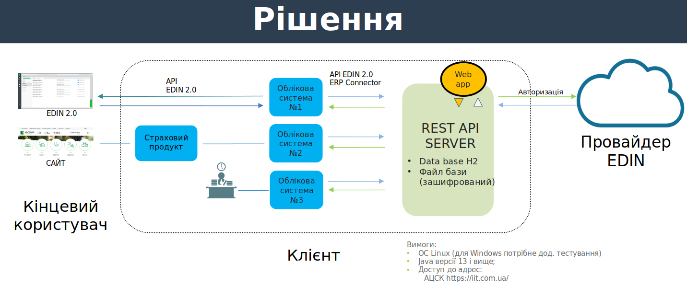
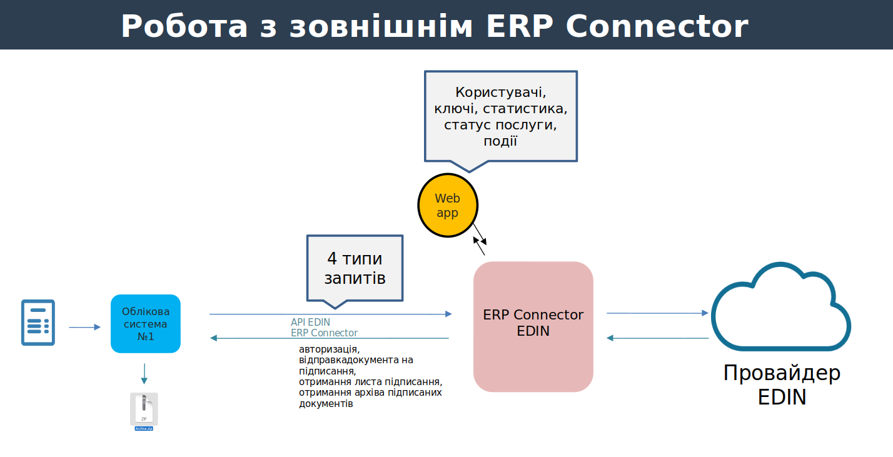
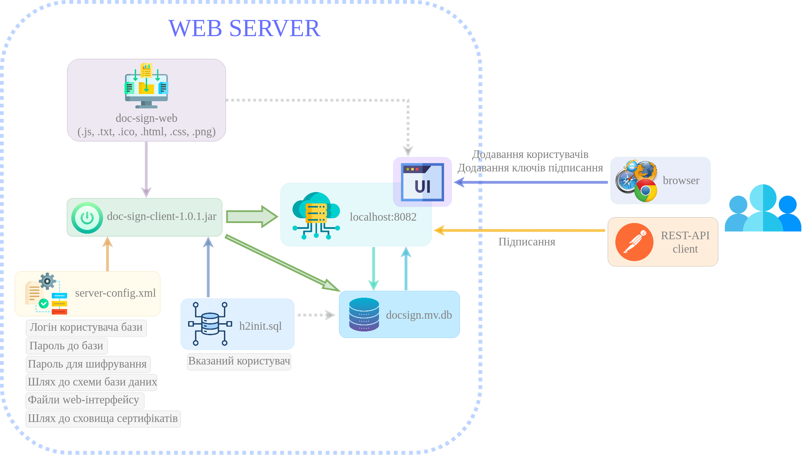
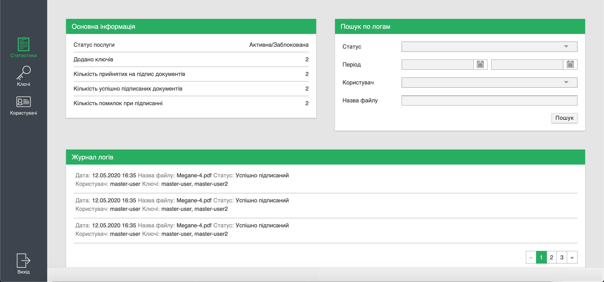
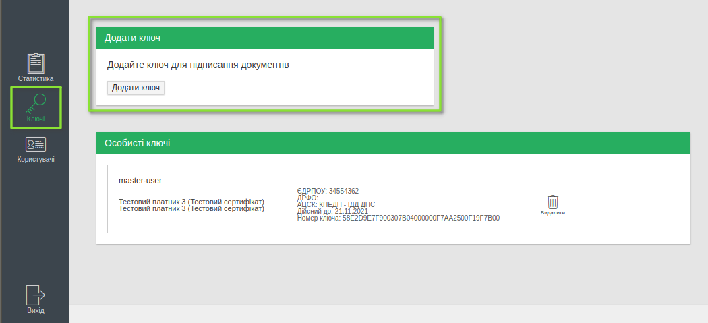
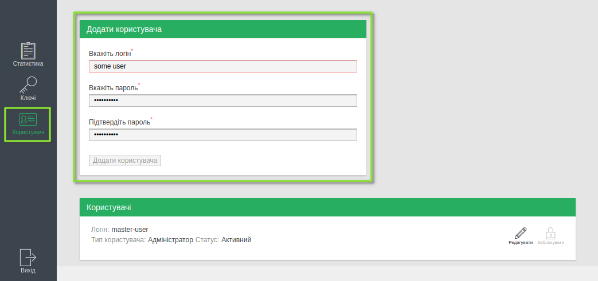
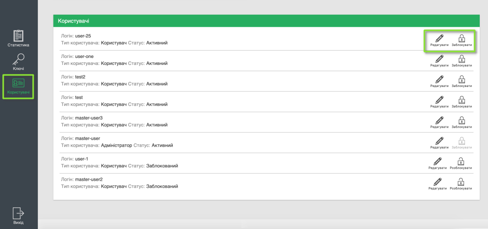

####################################################
Можливості та застосування ERP Connector-а
####################################################

.. old docsign

.. contents:: Зміст:
   :depth: 3

---------

В даній інструкції описані можливості використання ERP Connector, порядок дій для встановлення його, як додатку та реалізоване API (http-запити).

ERP Connector дозволяє миттєво підписувати велику кількість документів, що створюються в різних облікових системах клієнта.

1 Загальні схеми інтеграції
===============================================

Робота з ERP Connector передбачається згідно подальшої схеми: **ERP Connector <- Облікова система клієнта -> API EDIN 2.0**

.. deprecated Наприклад, для сервісу ЕТТН схема виглядає наступним чином:

   .. image:: files/Modul_pidpysannia_Doc_Sign_Service_10.png
      :align: center

2 Технічні вимоги
===============================================

1. OC: операційні системи сімейства Linux;
2. Встановлена Jаva версії 13 і вище;
3. відкритий доступ до адрес АЦСК, https://iit.com.ua/.

3 Архітектура програми
===============================================

Додаток являє собою REST сервер написаний на Java, та розгортається в локальному середовищі.

Основні компоненти:

* **doc-sign-client-1.0.1.jar** - файл запуску web-сервера
* **server-config.xml** - конфігураційний файл сервера
* **/db/h2init.sql** - схема бази даних
* **doc-sign-web** - каталог файлів для відмальовування web-інтерфейсу

-----------------------------

Сервіс готовий до запуску "з коробки", однак за потреби можливо замінити налаштуваннями за замовчуванням в **server-config.xml**:

- логін користувача бази даних;
- пароль до бази даних;
- шлях до схеми бази даних;
- файли web-інтерфейсу;
- шлях до сховища сертифікатів.

З налаштуваннями за замовчуванням (**server-config.xml**):

- .jar бере **/db/h2init.sql** схему бази даних з зазначеним користувачем та формує в каталозі /db базу даних **docsign.mv.db**
- .jar бере файли з каталога **doc-sign-web** та відмальовує інтерфейс web, що за замовчуванням лежить на localhost:8082 і через GUI дозволяє додавати нових користувачів та ключі підписання
- розгорнутий web-сервер приймає REST-API запити на підписання документів на http://localhost:8082/api/{route_name} 

4 Запуск та налаштування програми
===============================================

Наданий архів необхідно розпакувати в окрему директорію (папку). В данній вибраній директорії відкрити термінал та виконати команду запуску.

**Команда запуску:**

.. code:: json

    java -jar doc-sign-client-1.0.1.jar server-config.xml > server.log 2>&1 &

де:

- server-config.xml - конфігураційний файл
- server.log - файл, куди будуть писатись логи роботи сервера

За замовчуванням сервер запускається на *8082* порту.

Налаштування сервісу здійснюється за допомогою **web інтерфейсу**. Налаштування сервісу доступне тільки одному попередньо налаштованому користувачу, користувачам які створені в web інтерфейсі доступні тільки Http запити по API, описані нижче.

5 Опис web інтерфейсу
===============================================

Після розгортання сервісу перейдіть за отриманою web адресою та виконайте вхід за допомогою логіна та пароля.

Відкриється основна сторінка - **Статистика**, на якій ви можете отримати основну інформацію про послугу, журнал логів та можливість пошуку по логам.

У блоці *Основна інформація* доступні дані про Статус послуги та Дату оновлення статусу, скільки Додано ключів, Кількість прийнятих на підпис документів, Кількість успішно підписаних документів та Кількість помилок. У *Журналі  логів* подана інформація про дату та статус підписання, назву документа а також вказано користувача, що здійснив підписання.

У розділі **Ключі** доступна інформація про особисті ключі, а також форма для додавання ключів. Щоб додати ключ натисніть на кнопку **Додати ключ** - відкриється вікно для вибору файлу з вашого ПК або носія. Після вибору файлу, необхідно вказати *назву ключа* (обов'язково) - латиницею, та вказати *пароль* для ключа (обов'язково) та знову натиснути на *Додати ключ*.

У розділі **Користувачі** можливо додати нового користувача, у якого буде доступ для використання запитів. Для цього натисніть на кнопку **Додати користувача** та вкажіть *логін* (обов'язково) - латиницею та без пробілів, та вкажіть *пароль* для користувача (обов'язково) та натисніть на *Додати користувача*.

Нижче знаходиться список користувачів з можливістю редагування або блокування. Наприклад, Ви можете змінити пароль або редагувати логін для користувача.

6 REST API
===============================================

REST API сервіс ERP Connector дозволяє:

* Підписувати вказані файли (.pdf) зазначеним набором ЕЦП
* Завантажувати архів з підписаним документом (оригінальний файл, файли підписів, файл з візуалізацією підпису)
* Завантажувати файл з візуалізацією підпису

6.1 Авторизація
------------------------------------

Для авторизації використовується логін та пароль створеного користувача.

.. csv-table:: 
  :file: files/Authorization.csv
  :widths:  10, 41
  :stub-columns: 0

``RESPONSE``

В **заголовку відповіді** (Response header cookies) в json-форматі передається "ключ сесії" **SID**, необхідний для подальшої роботи. В кожному наступному запиті (виклику методу) повинен бути присутнім HTTP-заголовок (Header) "Authorization", який повинен містити токен "SID" зі значенням, отриманим при авторизації для коректного виконання запитів.

Тривалість сесії при бездіяльності користувача становить 10 хвилин (мається на увазі, що ключ сесії буде видалено через 10 хвилин, якщо користувач не буде активним (не буде відправляти HTTP запити)).

У **відповідь** передається код стану HTTP 200 (ok)

*Можливі помилки*:

 - 401, "Unauthorized" - перевірте введені дані, або перевірте правильність отриманого логіна та пароля.

--------------

6.2 Відправка документа на підписання
------------------------------------------------------------------------

.. csv-table:: 
  :file: files/sign-task.csv
  :widths:  10, 41
  :stub-columns: 0

``RESPONSE``

У **тілі відповіді** при успішному виконанні запиту, прийде *uuid завдання*, за яким надалі можна отримати результат підписання; у разі помилки - опис помилки.

*Можливі помилки*:

 - 400, "Bad Request" - при некоректному тілі запиту, або некоректним списком ключів, опис помилки буде зазначено в тілі відповіді.

--------------

6.3 Отримання листа підписання
------------------------------------------------------------------------

.. csv-table:: 
  :file: files/sign-list.csv
  :widths:  10, 41
  :stub-columns: 0

``RESPONSE``

У **тілі відповіді** при успішному виконанні запиту, повернеться PDF файл листа підписання (attachment).

*Можливі помилки*:

 - 404, "Not Found" - вказано некоректний task_uuid;
 - 102, "Processing" - файл ще обробляється, необхідно повторити запит пізніше;
 - 422, "опис помилки" - під час підписання виникла помилка;

--------------

6.4 Отримання архіву з результатом підписання
------------------------------------------------------------------------

.. csv-table:: 
  :file: files/sign-arch.csv
  :widths:  10, 41
  :stub-columns: 0

``RESPONSE``

У **тілі відповіді** при успішному виконанні запиту, повернеться ZIP-архів з результатом підписання (вихідний файл, файли
підписів, лист підписання).

*Можливі помилки*:

 - 404, "Not Found" - вказано некоректний task_uuid;
 - 102, "Processing" - файл ще обробляється, необхідно повторити запит пізніше;
 - 422, "опис помилки" - під час підписання виникла помилка;

