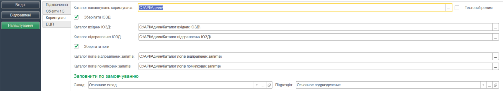

########################################################################################################
Опис файлу користувацьких налаштувань UserSettings.txt "ERP Connector PRO"
########################################################################################################

.. матеріал взято з UserSettings_description

.. contents:: Зміст:
   :depth: 6

---------

1 Вступ
===============================================================

Файл **UserSettings.txt** створюється при використанні обробки 1С | BAS. Файл **UserSettings.txt** – текстовий файл, в якому зберігаються налаштування користувача обробки 1С | BAS.  Збережені у файлі налаштування є персональними кожного з користувачів і повноту їх заповнення визначає сам користувач. При першому запуску в «1С | BAS Підприємстві» проходить пошук каталогу, назва якого співпадає з назвою поточного користувача 1С | BAS. Якщо такий каталог відсутній - він створюється. В  каталозі користувача перевіряється наявність файлу **UserSettings.txt**. Якщо файл не знайдено - він створюється. Дані у файлі зберігаються у вигляді JSON рядка, в якому дані розділені  по певним інформативним блокам. Вміст, структура, послідовність даних файлу безпосередньо залежить від налаштувань.

2 Дані користувача
===============================================================

Перелік персональних даних користувача зберігається у блоці **USER_DATA**. Дані користувач заповнює на закладці **«Налаштування»**.

.. image:: pics_UserSettings_description/UserSettings_description_01.png
   :align: center

.. csv-table:: 
  :file: USER_DATA.csv
  :widths:  10, 10, 41
  :stub-columns: 0

3 Електронно цифрові підписи
===============================================================

.. image:: pics_UserSettings_description/UserSettings_description_03.png
   :align: center

Список ключів, які користувач використовує або буде використовувати вказується на закладці **ЕЦП**. На момент підписання у табличній частині по одній організації може бути встановлено прапорець тільки по одному з рядків. Це необхідно, щоб при підписанні однозначно визначити необхідну пару ключів. Внесені ключі зберігаються в блоці **SIGN_KEYS**.

.. csv-table:: 
  :file: SIGN_KEYS.csv
  :widths:  10, 10, 10, 41
  :stub-columns: 0

4 Зразок файлу користувацьких налаштувань
===============================================================

::

        {
            "USER_DATA": {
                "EDIN_USER_Warehouse": "{\r\n\"MetaDataObject\": \"Справочники\",\r\n\"Name\": \"Склады\",\r\n\"ID\": \"59c9e0fe-56a3-11e9-941e-70c94ef89d69\"\r\n}",
                "EDIN_USER_Organization_Unit": "{\r\n\"MetaDataObject\": \"Справочники\",\r\n\"Name\": \"ПодразделенияОрганизаций\",\r\n\"ID\": \"59c9e0fb-56a3-11e9-941e-70c94ef89d69\"\r\n}",
                "EDIN_USER_Save_Loggs": "1",
                "EDIN_USER_Log_Folder_Sent": "C:\\API\\Админ\\Каталог логів відпралених запитів\\",
                "EDIN_USER_Log_Folder_Error": "C:\\API\\Админ\\Каталог логів помилкових запитів\\",
                "EDIN_USER_Test_Mode": "1",
                "EDIN_USER_Save_UZD_DOCUMENTS": "1",
                "EDIN_USER_Inbox_UZD_Folder": "C:\\API\\Админ\\Каталог вхідних ЮЗД\\",
                "EDIN_USER_Outbox_UZD_Folder": "C:\\API\\Админ\\Каталог відправлених ЮЗД\\",
                "USER_1": "uatestAPIpost",
                "USER_RETAILERS": {
                    "retailer1": "16404",
                    "retailer2": "17046"
                }
            },
            "SIGN_KEYS": {
                "Keys_1": {
                    "Use": 1,
                    "Organization": "59c9e0fa-56a3-11e9-941e-70c94ef89d69",
                    "KeyAccountant": "D:\\1C_Yurchenko\\Keys\\new\\Директор\\Key-6.dat",
                    "KeyDigitalStamp": "D:\\1C_Yurchenko\\Keys\\new\\Печатка\\Key-6.dat"
                }
            }
        }

