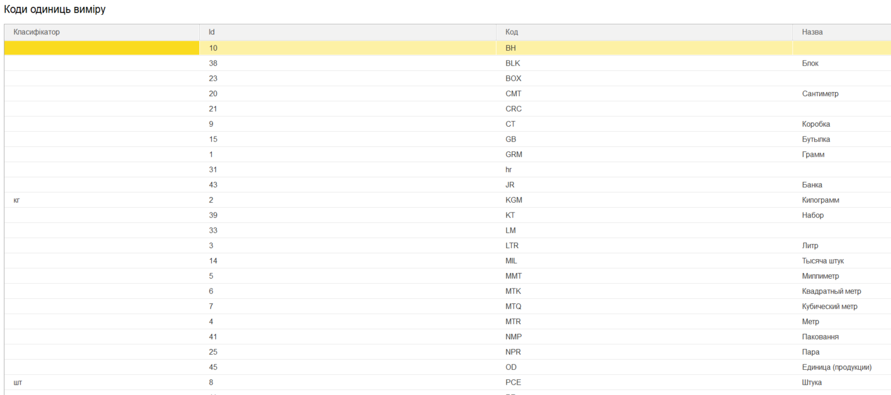

#############################################################################################
Опис конфігураційного файлу Config.txt "ERP Connector PRO"
#############################################################################################

.. матеріал взято з config_description

.. contents:: Зміст:
   :depth: 6

---------

1 Основні налаштування
===============================================================

Файл **Config.txt** створюється при використанні обробки 1С | BAS. Файл **Config.txt** – текстовий файл, в якому зберігаються основні налаштування обробки 1С | BAS. Налаштування є спільними для всіх користувачів, тому їх заповнення необхідно зробити на самому початку використання інтеграції і уважно підходити до їх зміни у майбутньому.

Є два способи збереження даних:

1) В додаткових властивостях об’єкта 1С | BAS. Розглядається, як найбільш бажаний, вказується по замовчуванню при натисканні кнопки "Заповнити по замовчуванню".
2) Безпосередньо в об’єкті 1С | BAS в певному реквізиті. Окрім опису місця збереження можливо вказати, що саме буде зберігатися для  ідентифікації даних. Це необхідно у випадках використання довідників, які не передбачені для зазначення їх для додаткових властивостей або в об’єкті  1С | BAS відсутній реквізит для його збереження.

Передбачені наступні способи пошуку:

* За Значенням – вказує, що буде безпосередньо зберігатися необхідне значення;
* За Кодом – зберігається код обраного елемента довідника;
* За Назвою – зберігається назва обраного елемента довідника.

Заповнення налаштувань збереження даних виконується на вкладці "Об’єкти 1С | BAS" в таблицях. Збереження одного налаштування описується окремим блоком в файлі **Config.txt**. Блок заповнюється на основі даних, які користувач може переглянути в формі внесення налаштувань.

.. csv-table:: 
  :file: Setting_Name.csv
  :widths:  10, 41
  :stub-columns: 0

2 Налаштування довідників
===============================================================

У файлі **Config.txt** налаштування для довідників зберігаються у блоці **Catalog1C_Settings**.

.. csv-table:: 
  :file: Catalog1C_Settings.csv
  :widths:  10, 10, 10, 41
  :stub-columns: 0

3 Налаштування документів постачальника
===============================================================

У файлі **Config.txt** налаштування для документів постачальника зберігаються у блоці **Supplier_Documents**. Структура блока аналогічна блоку налаштувань довідників.

.. csv-table:: 
  :file: Supplier_Documents.csv
  :widths:  10, 10, 10, 41
  :stub-columns: 0

4 Налаштування одиниць виміру
===============================================================

Для коректного завантаження позицій номенклатури необхідно вказувати їм  відповідність в 1C  | BAS.

Блок відповідності одиниць виміру називається **UNITS**. Список одиниць виміру відкриваєть при натисканні кнопки **"Коди одиниць виміру"**. Кожен рядок в таблиці із заповненим значенням в колонці «Класифікатор» описується у окремому підблоці **UNIT_[поточний номер заповненного рядка]**.

.. csv-table:: 
  :file: UNITS.csv
  :widths:  10, 10, 10, 41
  :stub-columns: 0

5 Зразок конфігураційного файлу
===============================================================

::

    {
        "API_USERS": {
            "USER_1": {
                "login": "bb8442f8d12ab8dff75997f7890e7a248e8110bcb3371c870a68",
                "api_key": "bbb242acd166b8fcf71e97c5897e7a328efa10f8b36c1ccc0a5d268c7b3f3aa86500e2294f0ec33d33dfa8550a8933fb6aaad1269b056b1543845b7843d8e10d",
                "password": "bbc242ddd112b8eff74797f5"
            }
        },
        "General_Settings": {
            "EDIN_Configuration_1C_Type": "БП30",
            "EDIN_API_address": "https://edo-v2.edin.ua/",
            "EDIN_Partner_Equal_Consignee": 0,
            "EDIN_Search_Partner_By_Delivery_Point": 0,
            "EDIN_Use_Characteristics": 0,
            "EDIN_Order_Upload_Date": 0,
            "EDIN_Realization_Upload_Date": 0,
            "EDIN_EUTaxService_СертификатМДС": "",
            "EDIN_EUTaxService_СертификатEDIN": ""
        },
        "Catalog1C_Settings": {
            "Organization": {
                "Catalog1C": "Организации",
                "EDIN_GLN": {
                    "Setting_Name": "EDIN_GLN",
                    "Storage_Index": 0,
                    "Multi_Data": 1,
                    "Search_Index": 0
                }
            },
            "Partner": {
                "Catalog1C": "Контрагенты",
                "EDIN_GLN": {
                    "Setting_Name": "EDIN_GLN",
                    "Storage_Index": 0,
                    "Search_Index": 0
                },
                "EDIN_FormatTaxInvoice": {
                    "Setting_Name": "EDIN_FormatTaxInvoice",
                    "Storage_Index": 0,
                    "Search_Index": 0
                },
                "EDIN_BasePrice": {
                    "Setting_Name": "EDIN_BasePrice",
                    "Storage_Index": 0,
                    "Search_Index": 0
                },
                "EDIN_Price_Incl_NDS": {
                    "Setting_Name": "EDIN_Price_Incl_NDS",
                    "Storage_Index": 0,
                    "Search_Index": 0
                },
                "EDIN_AvtoExchange": {
                    "Setting_Name": "EDIN_AvtoExchange",
                    "Storage_Index": 0,
                    "Search_Index": 0
                }
            },
            "DeliveryPoint": {
                "Catalog1C": "Контрагенты",
                "EDIN_GLN": {
                    "Setting_Name": "EDIN_GLN",
                    "Storage_Index": 0,
                    "Search_Index": 0
                },
                "EDIN_MetroCode": {
                    "Setting_Name": "EDIN_MetroCode",
                    "Storage_Index": 0,
                    "Search_Index": 0
                },
                "EDIN_Partner": {
                    "Setting_Name": "EDIN_Partner",
                    "Storage_Index": 0,
                    "Search_Index": 0
                }
            }
        },
        "Supplier_Documents": {
            "ORDER": {
                "Document1С | BAS": "СчетНаОплатуПокупателю",
                "EDIN_ID": {
                    "Setting_Name": "EDIN_ID",
                    "Storage_Index": 0,
                    "Search_Index": 0
                },
                "EDIN_ID_CHAIN": {
                    "Setting_Name": "EDIN_ID_CHAIN",
                    "Storage_Index": 0,
                    "Search_Index": 0
                },
                "EDIN_DocumentNumber": {
                    "Setting_Name": "EDIN_DocumentNumber",
                    "Storage_Index": 0,
                    "Search_Index": 0
                },
                "EDIN_DocumentDate": {
                    "Setting_Name": "EDIN_DocumentDate",
                    "Storage_Index": 0,
                    "Search_Index": 0
                },
                "EDIN_Partner": {
                    "Setting_Name": "EDIN_Partner",
                    "Storage_Index": 0,
                    "Search_Index": 0
                },
                "EDIN_DeliveryPoint": {
                    "Setting_Name": "EDIN_DeliveryPoint",
                    "Storage_Index": 0,
                    "Search_Index": 0
                },
                "EDIN_Quantity": {
                    "Setting_Name": "EDIN_Quantity",
                    "Storage_Index": 1,
                    "Multi_Data": 1,
                    "Prop_Name": "Товары.Количество",
                    "Search_Index": 0
                }
            },
            "ORDRSP": {
                "Document1С | BAS": "СчетНаОплатуПокупателю",
                "EDIN_ID": {
                    "Setting_Name": "EDIN_ID",
                    "Storage_Index": 0,
                    "Search_Index": 0
                },
                "EDIN_ID_CHAIN": {
                    "Setting_Name": "EDIN_ID_CHAIN",
                    "Storage_Index": 0,
                    "Search_Index": 0
                },
                "EDIN_DocumentNumber": {
                    "Setting_Name": "EDIN_DocumentNumber",
                    "Storage_Index": 0,
                    "Search_Index": 0
                },
                "EDIN_DocumentDate": {
                    "Setting_Name": "EDIN_DocumentDate",
                    "Storage_Index": 0,
                    "Search_Index": 0
                },
                "EDIN_Quantity": {
                    "Setting_Name": "EDIN_Quantity",
                    "Storage_Index": 1,
                    "Multi_Data": 1,
                    "Prop_Name": "Товары.Количество",
                    "Search_Index": 0
                }
            },
            "DESADV": {
                "Document1С | BAS": "РеализацияТоваровУслуг",
                "EDIN_ID": {
                    "Setting_Name": "EDIN_ID",
                    "Storage_Index": 0,
                    "Search_Index": 0
                },
                "EDIN_ID_CHAIN": {
                    "Setting_Name": "EDIN_ID_CHAIN",
                    "Storage_Index": 0,
                    "Search_Index": 0
                },
                "EDIN_DocumentNumber": {
                    "Setting_Name": "EDIN_DocumentNumber",
                    "Storage_Index": 0,
                    "Search_Index": 0
                },
                "EDIN_DocumentDate": {
                    "Setting_Name": "EDIN_DocumentDate",
                    "Storage_Index": 0,
                    "Search_Index": 0
                },
                "EDIN_Partner": {
                    "Setting_Name": "EDIN_Partner",
                    "Storage_Index": 0,
                    "Search_Index": 0
                },
                "EDIN_DeliveryPoint": {
                    "Setting_Name": "EDIN_DeliveryPoint",
                    "Storage_Index": 0,
                    "Search_Index": 0
                },
                "EDIN_Quantity": {
                    "Setting_Name": "EDIN_Quantity",
                    "Storage_Index": 1,
                    "Multi_Data": 1,
                    "Prop_Name": "Товары.Коэффициент",
                    "Search_Index": 0
                }
            },
            "RECADV": {
                "Document1С | BAS": "РеализацияТоваровУслуг",
                "EDIN_ID": {
                    "Setting_Name": "EDIN_ID",
                    "Storage_Index": 0,
                    "Search_Index": 0
                },
                "EDIN_ID_CHAIN": {
                    "Setting_Name": "EDIN_ID_CHAIN",
                    "Storage_Index": 0,
                    "Search_Index": 0
                },
                "EDIN_DocumentNumber": {
                    "Setting_Name": "EDIN_DocumentNumber",
                    "Storage_Index": 0,
                    "Search_Index": 0
                },
                "EDIN_DocumentDate": {
                    "Setting_Name": "EDIN_DocumentDate",
                    "Storage_Index": 0,
                    "Search_Index": 0
                },
                "EDIN_Quantity": {
                    "Setting_Name": "EDIN_Quantity",
                    "Storage_Index": 1,
                    "Multi_Data": 1,
                    "Prop_Name": "Товары.Коэффициент",
                    "Search_Index": 0
                }
            },
            "INVOICE": {
                "Document1С | BAS": "РеализацияТоваровУслуг",
                "EDIN_ID": {
                    "Setting_Name": "EDIN_ID",
                    "Storage_Index": 0,
                    "Search_Index": 0
                },
                "EDIN_ID_CHAIN": {
                    "Setting_Name": "EDIN_ID_CHAIN",
                    "Storage_Index": 0,
                    "Search_Index": 0
                },
                "EDIN_DocumentNumber": {
                    "Setting_Name": "EDIN_DocumentNumber",
                    "Storage_Index": 0,
                    "Search_Index": 0
                },
                "EDIN_DocumentDate": {
                    "Setting_Name": "EDIN_DocumentDate",
                    "Storage_Index": 0,
                    "Search_Index": 0
                },
                "EDIN_Partner": {
                    "Setting_Name": "EDIN_Partner",
                    "Storage_Index": 0,
                    "Search_Index": 0
                },
                "EDIN_DeliveryPoint": {
                    "Setting_Name": "EDIN_DeliveryPoint",
                    "Storage_Index": 0,
                    "Search_Index": 0
                },
                "EDIN_Quantity": {
                    "Setting_Name": "EDIN_Quantity",
                    "Storage_Index": 1,
                    "Multi_Data": 1,
                    "Prop_Name": "Товары.Коэффициент",
                    "Search_Index": 0
                }
            },
            "COMDOC_006": {
                "Document1С | BAS": "РеализацияТоваровУслуг",
                "EDIN_ID": {
                    "Setting_Name": "EDIN_ID",
                    "Storage_Index": 0,
                    "Search_Index": 0
                },
                "EDIN_ID_CHAIN": {
                    "Setting_Name": "EDIN_ID_CHAIN",
                    "Storage_Index": 0,
                    "Search_Index": 0
                },
                "EDIN_DocumentNumber": {
                    "Setting_Name": "EDIN_DocumentNumber",
                    "Storage_Index": 0,
                    "Search_Index": 0
                },
                "EDIN_DocumentDate": {
                    "Setting_Name": "EDIN_DocumentDate",
                    "Storage_Index": 0,
                    "Search_Index": 0
                },
                "EDIN_Partner": {
                    "Setting_Name": "EDIN_Partner",
                    "Storage_Index": 0,
                    "Search_Index": 0
                },
                "EDIN_DeliveryPoint": {
                    "Setting_Name": "EDIN_DeliveryPoint",
                    "Storage_Index": 0,
                    "Search_Index": 0
                },
                "EDIN_Quantity": {
                    "Setting_Name": "EDIN_Quantity",
                    "Storage_Index": 1,
                    "Multi_Data": 1,
                    "Prop_Name": "Товары.Коэффициент",
                    "Search_Index": 0
                }
            },
            "COMDOC_007": {
                "Document1С | BAS": "РеализацияТоваровУслуг",
                "EDIN_ID": {
                    "Setting_Name": "EDIN_ID",
                    "Storage_Index": 0,
                    "Search_Index": 0
                },
                "EDIN_ID_CHAIN": {
                    "Setting_Name": "EDIN_ID_CHAIN",
                    "Storage_Index": 0,
                    "Search_Index": 0
                },
                "EDIN_DocumentNumber": {
                    "Setting_Name": "EDIN_DocumentNumber",
                    "Storage_Index": 0,
                    "Search_Index": 0
                },
                "EDIN_DocumentDate": {
                    "Setting_Name": "EDIN_DocumentDate",
                    "Storage_Index": 0,
                    "Search_Index": 0
                }
            },
            "DECLAR": {
                "Document1С | BAS": "НалоговаяНакладная",
                "EDIN_ID": {
                    "Setting_Name": "EDIN_ID",
                    "Storage_Index": 0,
                    "Search_Index": 0
                },
                "EDIN_ID_CHAIN": {
                    "Setting_Name": "EDIN_ID_CHAIN",
                    "Storage_Index": 0,
                    "Search_Index": 0
                }
            }
        },
        "UNITS": {
            "UNIT_1": {
                "id": "2",
                "name": "KGM",
                "1C_ID": "41ca5947-561b-11e9-941e-70c94ef89d69"
            },
            "UNIT_2": {
                "id": "8",
                "name": "PCE",
                "1C_ID": "41ca5948-561b-11e9-941e-70c94ef89d69"
            }
        }
    }

