#################################################################################
Інструкція користувача "ERP Connector PRO"
#################################################################################

.. матеріал взято та об'єднано з user_instruction та user_1C_eTTN_3_0_integration

.. картинки:

.. |refresh| image:: pics_user_instruction/user_instruction_04.jpg

.. contents:: Зміст:
   :depth: 6

---------

Скорочення:

ОС - облікова система

ЕЦП - електронно-цифровий підпис/печатка

GLN - (Global Location Number) глобальний номер місцезнаходження

EDI - (Electronic Data Interchange) електронний обмін данними; тут мається на увазі не ЮЗ документообіг.

ЮЗД - юридично значимий документ/документообіг

---------

1 Вступ
==========================

Дана інструкція описує роботу комп’ютерної програми "ERP Connector PRO" для облікової системи (далі ОС). Комп’ютерна програма являє собою зовнішню обробку для інтеграції електронного документообігу між обліковою системою користувача та платформою EDIN 2.0. Комп’ютерну програму створено для звичайних форм конфігурацій ОС, але також є можливість налаштування під нестандартні конфігурації. В комп’ютерній програмі окремим блоком (**"ETTN"**) виділена робота з транспортними документами та іншим електронним документообігом (**"EDI"**).

.. _edi-block:

2 Робота в "EDI" блоці
==========================

Для роботи в "ERP Connector PRO" з документами меню "EDI" блоку розділено на:

* **"Вхідні"** - розділ для роботи з вхідними документами;
* **"Відправлені"** - розділ для роботи з вихідними документами;
* **"Чернетки"** - розділ для роботи зі створеними / підписаними, але ще не відправленими документами;
* **"Архів"** - розділ для архівних документів;
* **"Оператор"** - розділ з розширеними можливостями обробки та роботи з документами.

.. hint::
   Розділ **"Налаштування"** описано в `Інструкції оператора. Первинні налаштування <https://wiki.edin.ua/uk/latest/ERP_Connector_PRO/Instructions/operator_instruction.html>`__

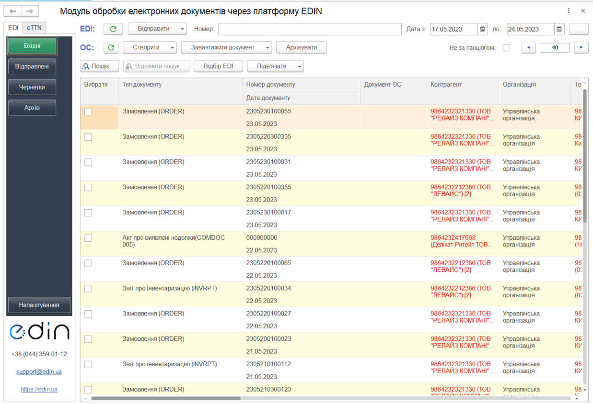

2.1 "Вхідні"
------------------------------------

Розділ вхідних документів (від контрагентів) при запуску програми відкривається за замовчуванням. В журналі документів відображаються всі вхідні документи за датою їх отримання. Список документів можливо відфільтрувати за датою документа (поля "Дата з" / "по"), повним номером документа (поле номер). Також можливо налаштувати кількість документів, що будуть виводитись на одній сторінці журналу (пагінація) - це дозволяє пришвидшити завантаження сторінки та роботу з новими документами.

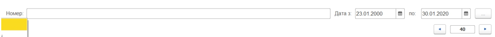

.. important::
    У **"Вхідних"/"Відправлених"** в списку журналу відображається документ, що є **останнім** в "ланцюжку документів" (документи, що логічно об'єднані між собою). В журналі документів для зручності проставляються позначки про наявність відповідних типів документів в ланцюжку.

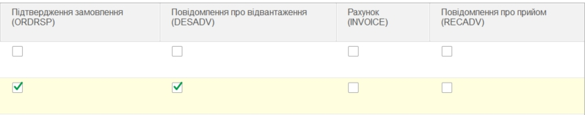

Через подвійний клік лівою кнопкою мишки по номеру/даті документа можливо відкрити друковану форму документа із коротким описом пов'язаних документів у ланцюжку. В цій формі можливо переглянути кожен пов'язаний документ.

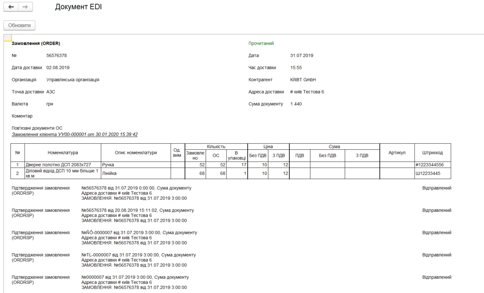

Документи в ланцюжку розташовані в хронологічному порядку; в цій формі можливо перейти на кожен документ в ланцюжку через подвійний клік. Через "Файл"->"Друк" можливо роздрукувати документ, а через "Файл"->"Зберегти як" зберегти документ на локальний носій в *.xml, *.odt, *.html, *.docx, *.txt та ін. форматах (типовий функціонал ОС).

.. _edi-select:

2.1.1 Відбір EDI
``````````````````````````

У **"Вхідних"/"Відправлених"/"Оператор"** є можливість розширеного відбору документів (аналогічно до web-платформи):

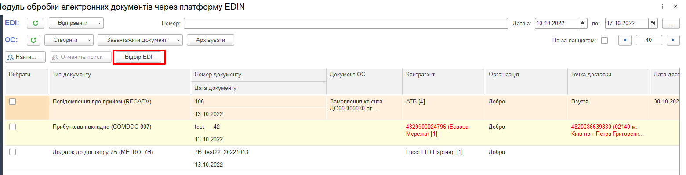

Натиснувши на кнопку **"Відбір EDI"** відкривається вікно, де можливо вказати критерії для формування запиту на отримання документів:

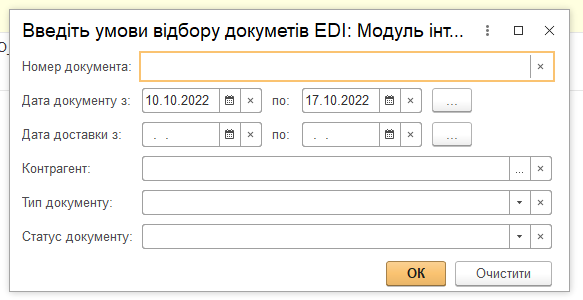

Поле "Контрагент" дозволяє обрати контрагентів (мають заповнений GLN) зі списку:

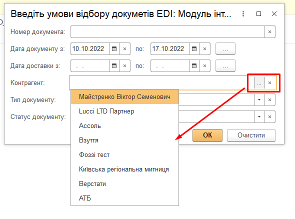

"Тип документа" можливо обрати з випадаючого списку:

.. image:: pics_user_instruction/user_instruction_39.jpg
   :align: center

"Статус документа" також можливо обрати з випадаючого списку:

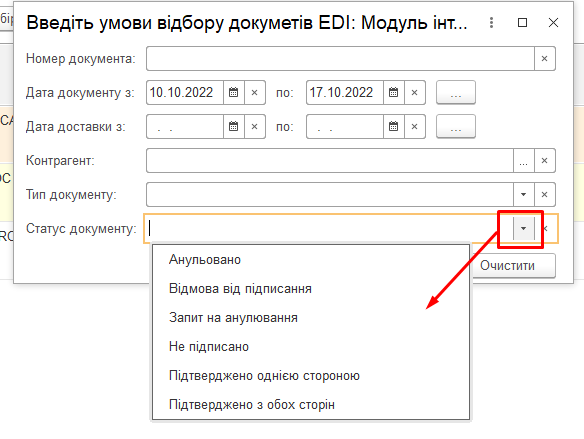

.. note::
   Відбір за статусом здійснюється тільки з заповненим типом документа!

.. _doc-download:

2.1.2 Завантаження документів
```````````````````````````````````````

У **"Вхідних"/"Відправлених"/"Архів"/"Оператор"** є можливість **"Завантажити документ"**:

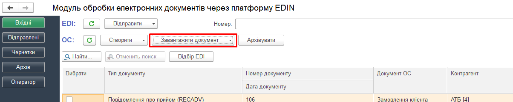

При натисканні на кнопку Ви можете обрати формат, в якому буде завантажено обраний (проставлена відмітка) документ:

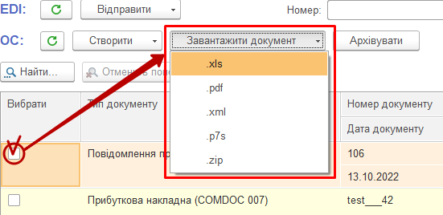

.. attention::
   Деякі документи не підтримують завантаження у всіх форматах, тому при спробі завантажити документ не у відповідному форматі система видасть попередження.

------------------------------------

У розділі присутні кнопки оновлення списку документів |refresh| (оновлення вхідних документів з платформи електронного документообігу та довантаження створених документів з ОС).

.. important::
   Попередньо перед створенням документів необхідно обов'язково переконатися, що вказані відповідні GLN з `довідниками ОС <https://wiki.edin.ua/uk/latest/ERP_Connector_PRO/Instructions/operator_instruction.html>`__ .

.. _створення та відправки документів:

2.2 "Відправлені"
------------------------------------

Розділ відправлених документів (до контрагентів) відображає в журналі документів всі відправлені документи за датою їх відправки. Аналогічно до розділу "Вхідних" документів "Відправлені" містить фільтри за датою документа (поля "Дата з" / "по"), повним номером документа (поле номер) і також дозволяє налаштувати кількість документів, що будуть виводитись на одній сторінці журналу (пагінація).

.. important::
    У **"Вхідних"/"Відправлених"** в списку журналу відображається документ, що є **останнім** в "ланцюжку документів" (документи, що логічно об'єднані між собою). В журналі документів для зручності проставляються позначки про наявність відповідних типів документів в ланцюжку.


Через подвійний клік лівою кнопкою мишки по номеру/даті документа можливо відкрити друковану форму документа із коротким описом пов'язаних документів у ланцюжку. В цій формі можливо переглянути кожен пов'язаний документ.


Документи в ланцюжку розташовані в хронологічному порядку; в цій формі можливо перейти на кожен документ в ланцюжку через подвійний клік. Через "Файл"->"Друк" можливо роздрукувати документ, а через "Файл"->"Зберегти як" зберегти документ на локальний носій в *.xml, *.odt, *.html, *.docx, *.txt та ін. форматах (типовий функціонал ОС).

.. hint::
   Для "Відправлених" доступний функціонал (опис за посиланням):
   
   * `"Відбору EDI" <https://wiki.edin.ua/uk/latest/ERP_Connector_PRO/Instructions/user_instruction.html#edi-select>`__
   * `"Завантаження документів" <https://wiki.edin.ua/uk/latest/ERP_Connector_PRO/Instructions/user_instruction.html#doc-download>`__

У розділі присутні кнопки оновлення списку документів |refresh| (оновлення вхідних документів з платформи електронного документообігу та довантаження створених документів з ОС).

.. important::
   Попередньо перед створенням документів необхідно обов'язково переконатися, що вказані відповідні GLN з `довідниками ОС <https://wiki.edin.ua/uk/latest/ERP_Connector_PRO/Instructions/operator_instruction.html>`__.

2.3 "Чернетки"
------------------------------------

"Чернетки" - це розділ, журнал якого містить створені, але ще не відправлені документи. Юридично значимі документи потрапляють до цього розділу вже підписаними. Документи потрапляють до цього розділу, якщо в `налаштуваннях користувача <https://wiki.edin.ua/uk/latest/ERP_Connector_PRO/Instructions/operator_instruction.html#user>`__ проставлена відмітка "Тестовий режим".

Такі налаштування дозволяють співробітнику (наприклад недосвідченому чи без ЕЦП) створювати документи, а безпосередньою перевіркою/відправкою вже займається бухгалтер/керівник чи інший відповідальний співробітник.

2.4 "Архів"
------------------------------------

«Архів» - це розділ, журнал якого містить архівні документи (аналог такого ж розділу, як і у веб інтерфейсі).

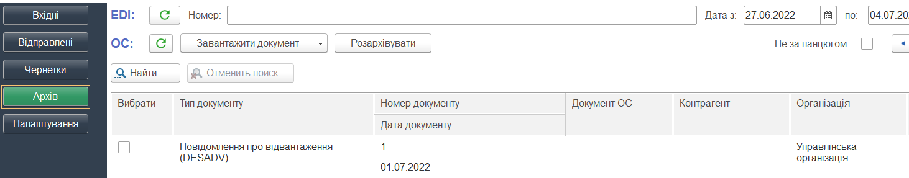

Основні можливості даного розділу - це перегляд і `"Завантаження документів" <https://wiki.edin.ua/uk/latest/ERP_Connector_PRO/Instructions/user_instruction.html#doc-download>`__ та розархівування документів, які були опрацьовані і відправлені в архів за допомогою веб платформи або ж через обробку ОС.

.. image:: pics_user_instruction/user_instruction_17n.jpg
   :align: center

Для того щоб додати документ до архіву безпосередньо в обробці ОС потрібно скористатись кнопкою «Архівувати», яка доступна на панелі інструментів вкладки «Вхідні» та «Вихідні». Для перенесення документа в архів потрібно його відмітити і натиснути відповідну кнопку:

.. image:: pics_user_instruction/user_instruction_19n.jpg

Всі відмічені документи потраплять в «Архів».

.. _operator:

2.5 "Оператор"
------------------------------------

Розділ "Оператора" має бідьш розширений функціонал в порівнянні з попередніми розділами. В розділі "Оператора" документи відображаються у вигляді дерева, де першим рівнем є `"Замовлення" (ORDER) <https://wiki.edin.ua/uk/latest/EDIN_Specs/XML/ORDER_x.html>`__ покупця (окрім випадків коли в ланцюжку немає Замовлення покупця), під яким розміщуються всі вхідні та вихідні документи які відносяться до цього ланцюжка:

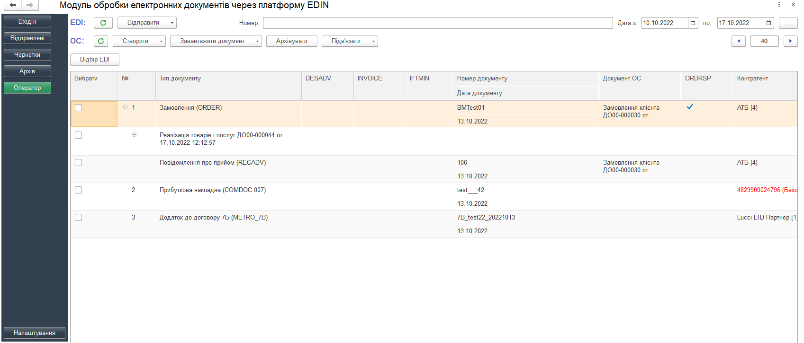

Основний функціонал кнопок повторює функціонал кнопок розділу "Вхідні" та має свої особливості:

1. Для підтвердження замовлення покупця чи створення документів облікової системи потрібно відмітити рядок Замовлення:

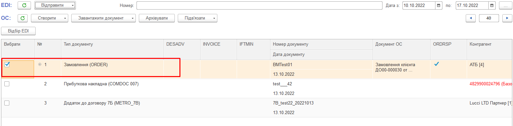

2. Для відправки `"Повідомлення про відвантаження" (DESADV) <https://wiki.edin.ua/uk/latest/EDIN_Specs/XML/DESADV_x.html>`__ чи `"Комерційних документів" (COMDOC) <https://wiki.edin.ua/uk/latest/EDIN_Specs/EDIN_Specs_list.html>`__ потрібно відмітити документи реалізації (всі створені реалізації завжди будуть йти другим рівнем під `"Замовленням" (ORDER) <https://wiki.edin.ua/uk/latest/EDIN_Specs/XML/ORDER_x.html>`__):

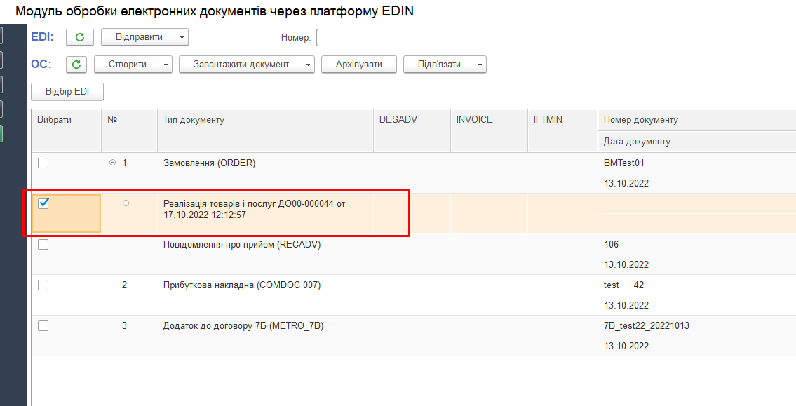

Це зроблено для того, щоб оператор міг відправити необхідні йому документи за вказаними документами облікової системи.

3. В розділі "Оператора" можливо **"Підв’язувати"** / **Відв’язувати** ланцюжки документів EDI до уже створених документів облікової системи або замінювати одні документи облікової системи на інші: 

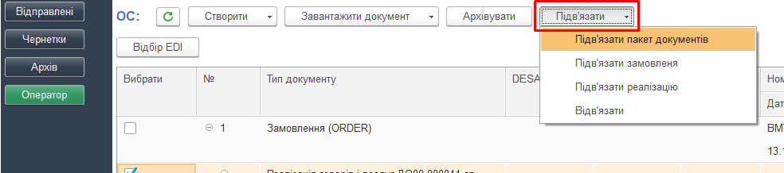

**Підв’язати пакет документів** - підв’язати документи «Замовлення покупця» та «Реалізацію товарів та послуг» до замовлення EDI. Після натискання кнопки відкриється форма вибору документа «Замовлення покупця»:

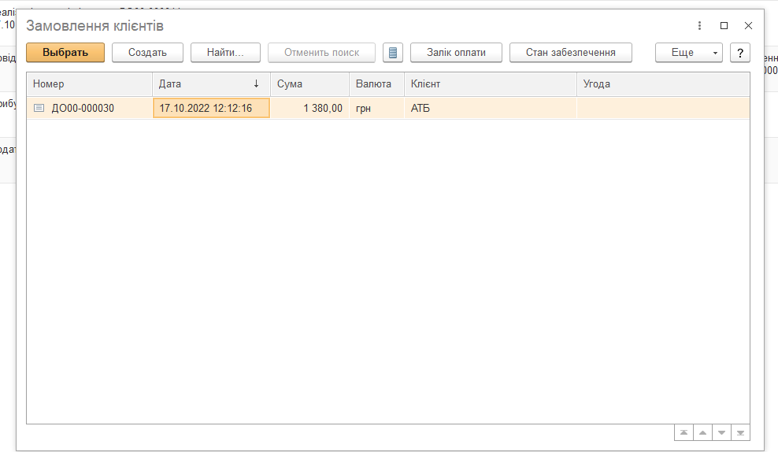

**Підв’язати замовлення** - підв’язати документ «Замовлення покупця» облікової системи до замовлення EDI. Після натискання кнопки відкриється форма вибору документа «Замовлення покупця».

**Підв’язати реалізацію** - підв’язати документ «Реалізацію товарів та послуг» до замовлення EDI. Після натискання кнопки відкриється форма вибору документа «Замовлення покупця».

**Відв’язати** - розірвати зв’язки між EDI та документами облікової системи.

4. Підменю **"Оновлення реалізації по RECADV"** дозволяє провести аналіз відмінностей між реалізацією облікової системи та документом EDI `"Повідомлення про прийом" (RECADV) <https://wiki.edin.ua/uk/latest/EDIN_Specs/XML/RECADV_x.html>`__, а також якщо потрібно то перенести необхідні зміни з RECADV в EDI реалізацію за допомогою кнопки **"Оновлення реалізації"**:

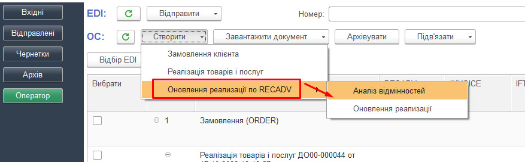

.. hint::
   В розділі "Оператора" доступний функціонал (опис за посиланням):
   
   * `"Відбору EDI" <https://wiki.edin.ua/uk/latest/ERP_Connector_PRO/Instructions/user_instruction.html#edi-select>`__
   * `"Завантаження документів" <https://wiki.edin.ua/uk/latest/ERP_Connector_PRO/Instructions/user_instruction.html#doc-download>`__

2.6 Створення та відправка документів
---------------------------------------------

2.6.1 EDI
```````````````````````````````````````

Створювати EDI документи в ОС можна тільки на основі вхідного Замовлення. Для створення відповідного документа ОС необхідно **Вибрати** вхідний документ і вибрати тип відповідного документа під кнопкою **Створити**:

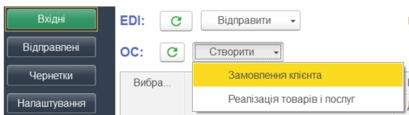

Якщо "ERP Connector PRO" автоматично не розпізнав Контрагента/Організацію/Точку доставки - можливо через подвійний клік мишкою по об'єкту вручну вибрати з довідника ОС (`налаштування <https://wiki.edin.ua/uk/latest/ERP_Connector_PRO/Instructions/operator_instruction.html#doc-settings>`__). 

При створенні документа в ОС "ERP Connector PRO" автоматично підтягує всі необхідні дані, проте якщо номенклатура була знайдена не вся - "ERP Connector PRO" відкриває вікно **"Незнайдена номенклатура"** для додавання і збереження артикула і штрих-кода контрагента у відповідному довіднику/регістрі відомостей ОС:

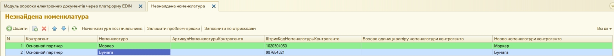

Для відправки документа у відповідь необхідно вибрати документ в колонці **"Документ ОС"**, зробити позначку навпроти вхідного документа (колонка **"Вибрати"**) і натиснути **"Відправити"**:

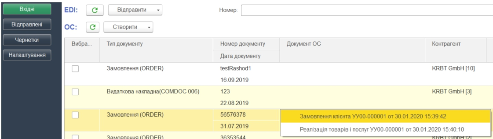

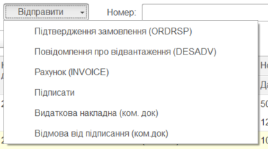

.. important:: Якщо одразу відправити "Замовлення" без створення документа в ОС, то "Замовлення" підтвердиться в повному обсязі.

.. important::
    Якщо документ відправити повторно тойже документ, то система повідомить про це та запитає про необхідність повторної відправки документа чи документів. 

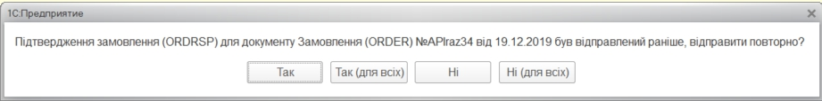

Всі EDI документи відправляються тільки на основі вхідних замовлень. В залежності від виду вивантаженого документа автоматично визначаються необхідні джерела заповнення даних:

1. **Підтвердження замовлення (ORDRSP)** – можливо підтвердити поставку, або відмовитись від поставки повністю. Для того щоб підтвердити поставку частково потрібно створити замовлення покупця і базі ОС і внести необхідні зміни в документі, а потім підтверджувати поставку. Якщо при підтвердженні поставки не створено жодного документа в ОС, тоді буде відправлено підтвердження у повному об'ємі вказаному в замовленні. Якщо при підтвердженні поставки відповідні документи ОС створені, тоді кількість заповнюється з них;

.. image:: pics_user_instruction/user_instruction_20n.jpg
   :align: center

2. **Повідомлення про відвантаження (DESADV)** – створюється тільки при наявності відповідного документа в ОС;
3. **Рахунок (INVOICE)** – створюється тільки при наявності відповідного документа в ОС.

2.6.2 ЮЗД
```````````````````````````````````````

.. important::
   Для роботи з юридично значимими документами в "ERP Connector PRO" повинні бути `налаштовані ЕЦП <https://wiki.edin.ua/uk/latest/ERP_Connector_PRO/Instructions/operator_instruction.html#etsp>`__ для кожної організації.

Комерційні документи (COMDOC) надходять в розділ "Вхідні" вже підписаними зі сторони відправника. У відповідь користувачу доступно підтвердити документ (кнопка "Підписати") чи відмовити (кнопка "Відмова від підписання"). В випадку "Відмова від підписання", в Комерційному документі необхідно заповнити поле коментар, мотивуючий відмову від підписання.

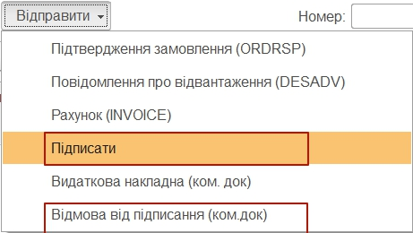

1. **Підписати** – призначено для підписання вхідного комерційного документа;
2. **Видаткова накладна** (ком. док) – призначено для вивантаження комерційного документа «Видаткова накладна», який використовується в схемах обміну деяких торгівельних мереж (створюється на основі "Реалізації товарів та послуг");
3. **Відмова від підписання** (ком.док) – призначено для відмови від підписання вхідного комерційного документа.

При будь-якій роботі з ключами (в тому числі і підписанні) "ERP Connector PRO" запитує пароль ключа для бухгалтера та печатки. Програма запитує пароль 1 раз в сесію для кожної організації, вказаної в `налаштуваннях ЕЦП <https://wiki.edin.ua/uk/latest/ERP_Connector_PRO/Instructions/operator_instruction.html#etsp>`__.

.. image:: pics_user_instruction/user_instruction_12.jpg
   :align: center

Документ "Податкова накладна" автоматично підтягується з ОС користувача. Для відправки "Податкової накладної" необхідно перейти в **"Відправлені"**, вибрати документ (відмітка галочкою) та натиснути кнопку "Відправити" -> "Податкова накладна". Аналогічно відправляється і "Коригування на податкову накладну" (Додаток 2 до податкової накладної).

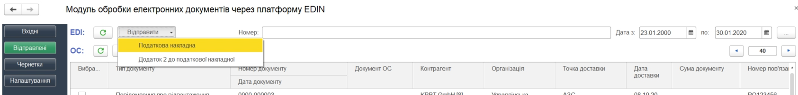

Документи "Податкова накладна" і "Коригування податкових накладних", по яким не були відправлені електронні документи виділяються сірим кольором і відображаються у кінці списку відправлених документів. Не відправлені податкові документи відбираються по контрагентам, в яких вказано в налаштуваннях формат вивантаження податкових документів і організації, для яких вказано GLN.

.. image:: pics_user_instruction/user_instruction_14.jpg
   :align: center

Кількість документів, яка вказується на закладці відправлених документів

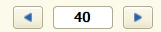

не впливає на відображення невідправлених податкових. 

.. _comdoc-settings:

2.6.2.1 Комерційні документи (COMDOC). Налаштування схеми документообігу
'''''''''''''''''''''''''''''''''''''''''''''''''''''''''''''''''''''''''''''''''''''''''''

Для налаштувань різних схем роботи з документами (різні контрагенти) потрібно заповнити формат вивантаження. Для цього відмічаємо потрібні мережі:

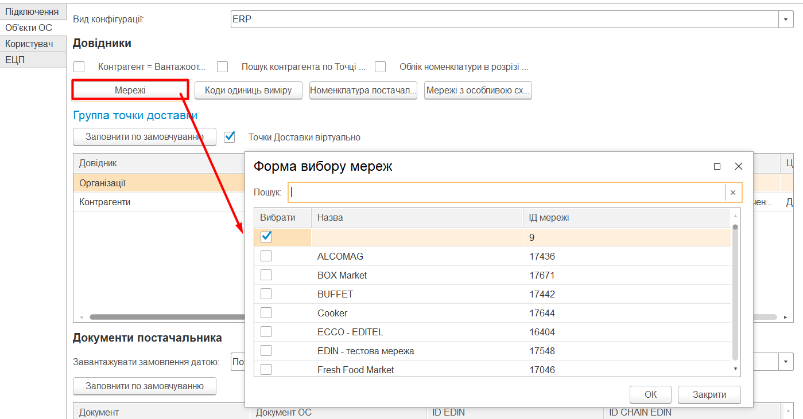

Далі відкриваємо форму прив’язки контрагентів бази ОС до GLN контрагентів мережі:

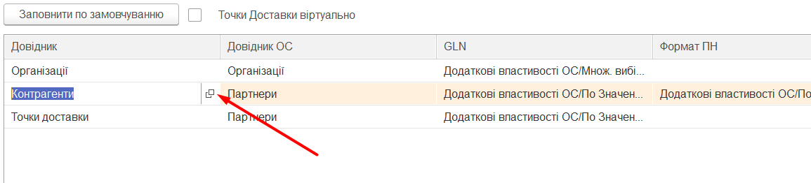

Відкриється форма налаштувань, де для початку ми знаходимо потрібний GLN і підв’язуємо його контрагенту з бази ОС:

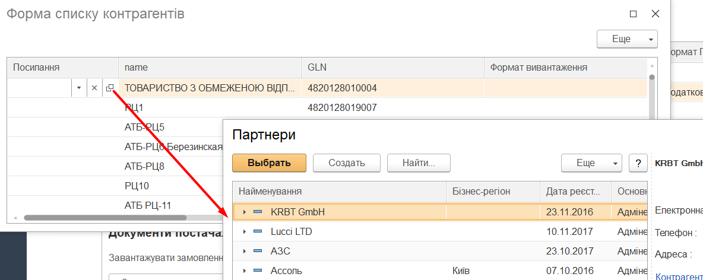

Далі заповнюємо формат вивантаження відповідно до обраної мережі (в нашому випадку це АТБ):

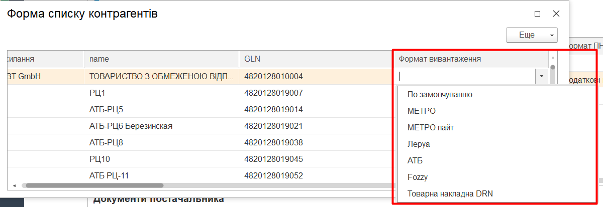

Після цих маніпуляцій, система буде знати що даний контрагент бази ОС відноситься до мережі (в нашому випадку АТБ) і працює по схемі процесів цієї мережі.

2.6.3 Індивідуальні ЮЗД схеми клієнтів
``````````````````````````````````````````````````````````````````````````````

2.6.3.1 Схема Fozzy
'''''''''''''''''''''''''''''''''''''''''''''''''''''''''''''''''''''''''''''''''''''''''''

Для активації схеми документообігу мережі "Fozzy" потрібно для початку зробити налаштування формату вивантаження для контрагентів цієї мережі. Налаштування описані в пункті `Комерційні документи (COMDOC). Налаштування схеми документообігу <https://wiki.edin.ua/uk/latest/ERP_Connector_PRO/Instructions/user_instruction.html#comdoc-settings>`__. Після підтвердження замовлення у нас є можливість відправити документ "Інструкція з транспортування":

.. image:: pics_user_instruction/user_instruction_25n.jpg
   :align: center

Але перед відправкою користувачеві буде запропоновано заповнити дані з транспортування:

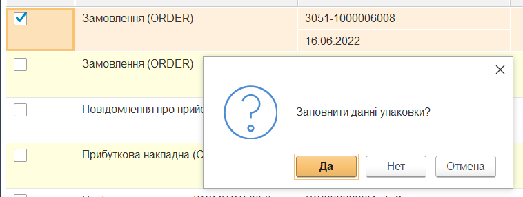

Відкриється форма заповнення:

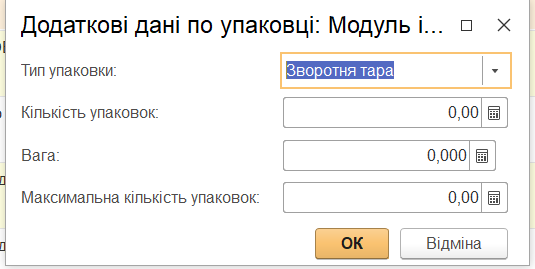

після заповнення форми натискаємо «ОК» і документ буде відправлено.

При відправці "Товарної накладної" за схемою "Fozzy" маємо розділення окремо на цінову накладну і кількісну:

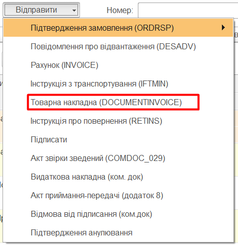

При відправці користувачу буде запропоновано вибрати, яку саме накладну відправляти, або відправити обидві відразу:

.. image:: pics_user_instruction/user_instruction_29n.jpg
   :align: center

Після відмітки необхідних документів натискаємо «ОК» для відправки документа/-ів.

2.6.3.2 Схема АТБ
'''''''''''''''''''''''''''''''''''''''''''''''''''''''''''''''''''''''''''''''''''''''''''

Для активації схеми документообігу мережі "АТБ" потрібно для початку зробити налаштування формату вивантаження для контрагентів цієї мережі. Налаштування описані в пункті `Комерційні документи (COMDOC). Налаштування схеми документообігу <https://wiki.edin.ua/uk/latest/ERP_Connector_PRO/Instructions/user_instruction.html#comdoc-settings>`__. При відправці "Повідомлення про відвантаження" (DESADV):

.. image:: pics_user_instruction/user_instruction_30n.jpg
   :align: center

користувачу буде запропоновано вибрати варіант поставки (в залезності від вибору "АТБ" буде знати чи це буде пряма поставка чи зі складу "Логістик Юніон"):

.. image:: pics_user_instruction/user_instruction_31n.jpg
   :align: center

Якщо це пряма поставка то далі потрібно відправити "Видаткову накладну" (COMDOC_006):

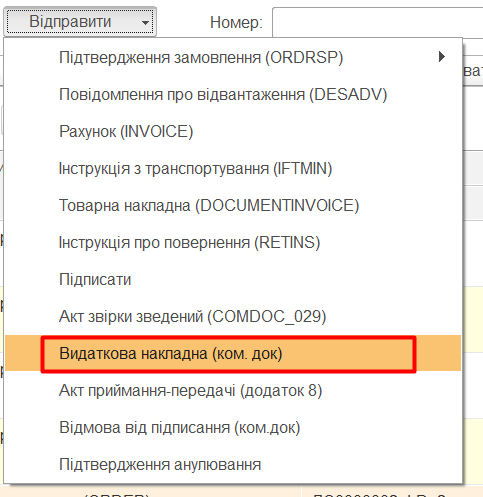

Якщо це поставка зі складу "Логістик Юніон", то потрібно окрім "Видаткової накладної" (COMDOC_006) відправити "Акт приймання-передачі (додаток 8)" (COMDOC_032):

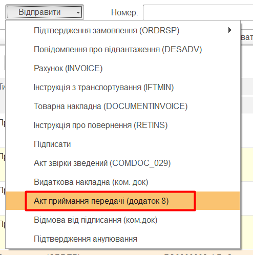

2.6.3.3 Схема Леруа Мерлен
'''''''''''''''''''''''''''''''''''''''''''''''''''''''''''''''''''''''''''''''''''''''''''

Для активації схеми документообігу мережі "Леруа Мерлен" потрібно для початку зробити налаштування формату вивантаження для контрагентів цієї мережі. Налаштування описані в пункті `Комерційні документи (COMDOC). Налаштування схеми документообігу <https://wiki.edin.ua/uk/latest/ERP_Connector_PRO/Instructions/user_instruction.html#comdoc-settings>`__ та вказати, в якому полі документа платформи знаходиться GLN контрагента.

Якщо таблиця мереж буде пуста, то потрібно натиснути «Заповнити таблицю доступних мереж»:

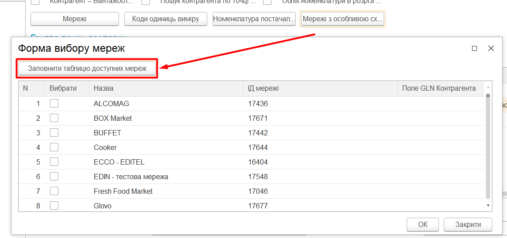

Далі відмічаємо потрібну нам мережу і вказуємо, в якому полі знаходиться GLN контрагента:

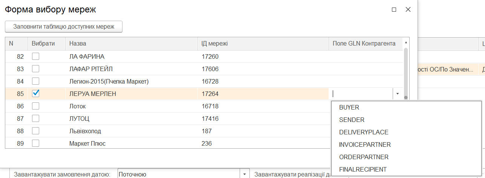

Після цих налаштувань система буде розуміти де знаходиться потрібний GLN для пошуку контрагента для подальшого використання його в створені документів облікової системи.

.. _ettn-block:

3 Робота в "ETTN" блоці
==========================

"ETTN" блок орієнтований на Вантажовідправника (роль в логістиці та документообігу). Для роботи в "ERP Connector PRO" з документами меню "ETTN" блоку розділено на:

* **"Вхідні"** - розділ для роботи з вхідними документами;
* **"Відправлені"** - розділ для роботи з вихідними документами;
* **"Чернетки"** - розділ для роботи зі створеними / підписаними, але ще не відправленими документами.

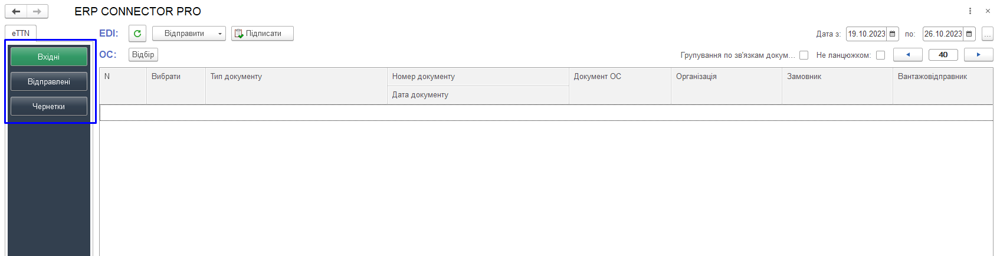

3.1 "Вхідні"
------------------------------------

Розділ вхідних документів (від контрагентів) при запуску "ERP Connector PRO" відкривається за замовчуванням. В журналі документів відображаються всі вхідні документи за датою їх отримання. Список документів можливо відфільтрувати за датою документа (поля «Дата з» / «по») та більш розширено за допомогою **"Відбір"**. Також можливо налаштувати кількість документів, що будуть виводитись на одній сторінці журналу (пагінація) - це дозволяє пришвидшити завантаження сторінки та роботу з новими документами. В залежності від ролі користувача (а також схеми, за якою працює дана компанія) і логіки документообігу вхідні документи можливо **«Підтвердити»**, **«Підписати»**, **«Відхилити»**. Також "ERP Connector PRO" дозволяє на підставі **«Підтвердження транспортування»** створити **«ТТН»**.

.. image:: pics_user_instruction/user_instruction_50.png
   :align: center

У розділі присутні кнопки оновлення списку документів |refresh| (оновлення вхідних документів з платформи електронного документообігу та довантаження створених документів з ОС).

**Групування по зв'язкам документів** – виділення пов'язаних документів однотипним кольором.

**Не за ланцюгом** – відображення всіх типів документів, що не увійшли до ланцюжка документів.

За допомогою кнопки **"Відбір"** виводиться вікно для введення умов відбору документів:

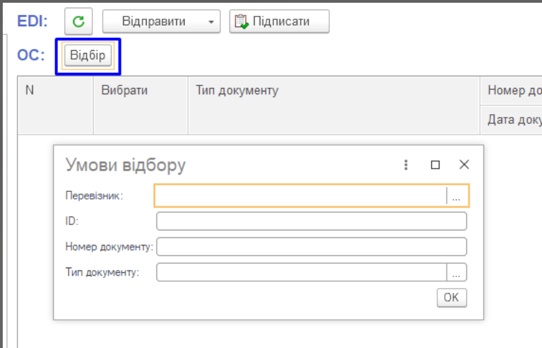

**Номер документу** - поле пошуку по повному або частковому збігу. Для часткового пошуку, використовується символ ``+``. Приклад: ``Номер: 123+`` - будуть знайдені всі документи, які починаються з 123.

**Перевізник** – вказується компанія-Перевізник. Також є можливість вибору за кодом ЄДРПОУ компанії.

**ID** – Унікальний ідентифікатор документа.

**Тип документа** – відільтрувати вхідні по необхідному типу документа (ЕТТН, Підтверждення заявки на траспортування і т.д).

3.2 "Відправлені"
------------------------------------

Розділ відправлених документів (до контрагентів) відображає в журналі документів всі відправлені документи за датою їх відправки. Аналогічно до розділу "Вхідних" документів "Відправлені" містить фільтри за датою документа (поля "Дата з" / "по") і також дозволяє налаштувати кількість документів, що будуть виводитись на одній сторінці журналу (пагінація). 

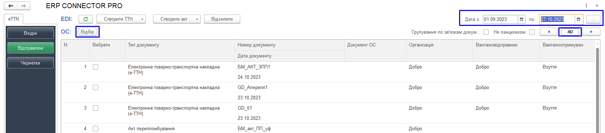

У розділі присутні кнопки оновлення списку документів |refresh| (оновлення вхідних документів з платформи електронного документообігу та довантаження створених документів з ОС).

3.3 "Чернетки"
------------------------------------

"Чернетки" - це розділ, журнал якого містить створені, але ще не відправлені документи. Юридично значимі документи потрапляють до цього розділу не підписаними.

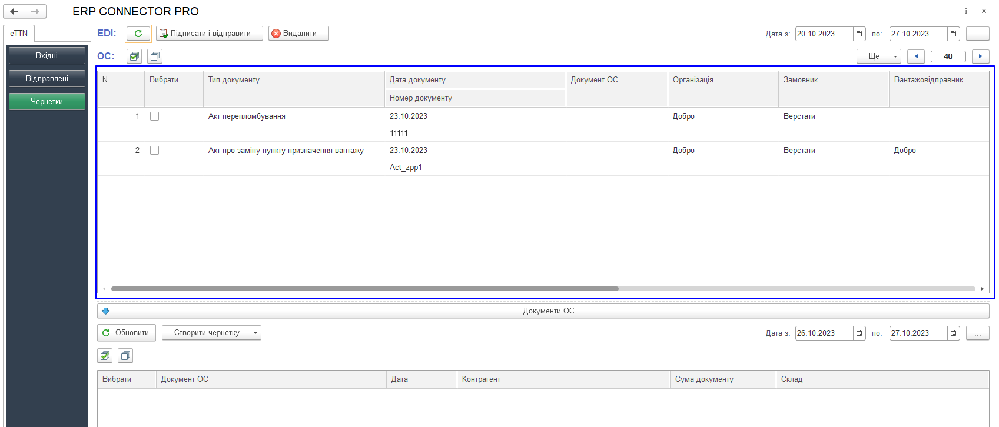

3.4 Створення та відправка документів
---------------------------------------------

Документи сервісу EDIN "ETTN" рекомендовано створювати з розділу **"Чернетки"**. Для цього потрібно **"Обновити"** список документів, що можуть стати підставою до формування електронного документа, обрати (відмітити галочкою) документ та натиснути **"Створити чернетку"**: 

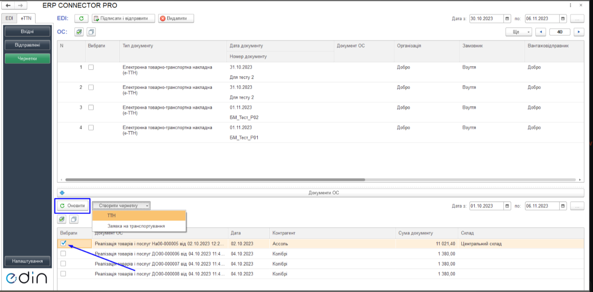

Згідно налаштувань документ-чернетка автоматично заповниться. У розділі **"Чернетки"** з’явиться нова не підписана ЕТТН.

Також ЕТТН можливо створити з розділу **«Відправлені»**. Створення можливе "вручну" та на підставі інших документів.

3.4.1 Створення документів "вручну"
``````````````````````````````````````````````````````````````````````````````

3.4.1.1 Створення еТТН документа в ручному режимі
'''''''''''''''''''''''''''''''''''''''''''''''''''''''''''''''''''''''''''''''''''''''''''

Створювати еТТН в ручному режимі потрібно тоді коли в нас не вистачає всіх данних для заповнення документа автоматично. Створення в ручному реживі відбувається з розділу «Відправлені», в меню «Створити ТТН» потрібно вибрати пункт «Вручну»:

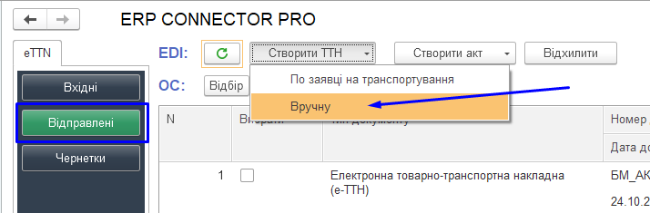

Далі відкриється форма документа еТТН:

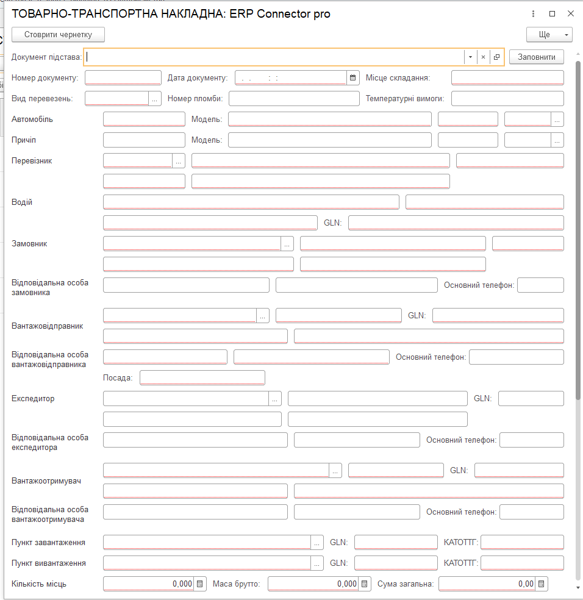

Всі поля документа можливо заповнювати вручну або заповнити на основі документа, який був доданий в налаштуваннях та за цим документом були проставлені відповідні співставлення полів документа та тегів еТТН. Для вибору документа-підстави потрібно натиснути на кнопку вибору зі списку, далі **"Показати всі"**:

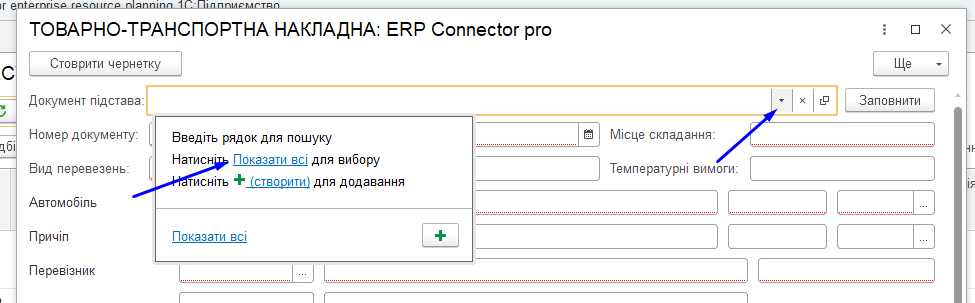

та обираємо документ-підставу для заповнення ЕТТН. Коли вибору документу, натискаємо кнопку **«Заповнити»**:

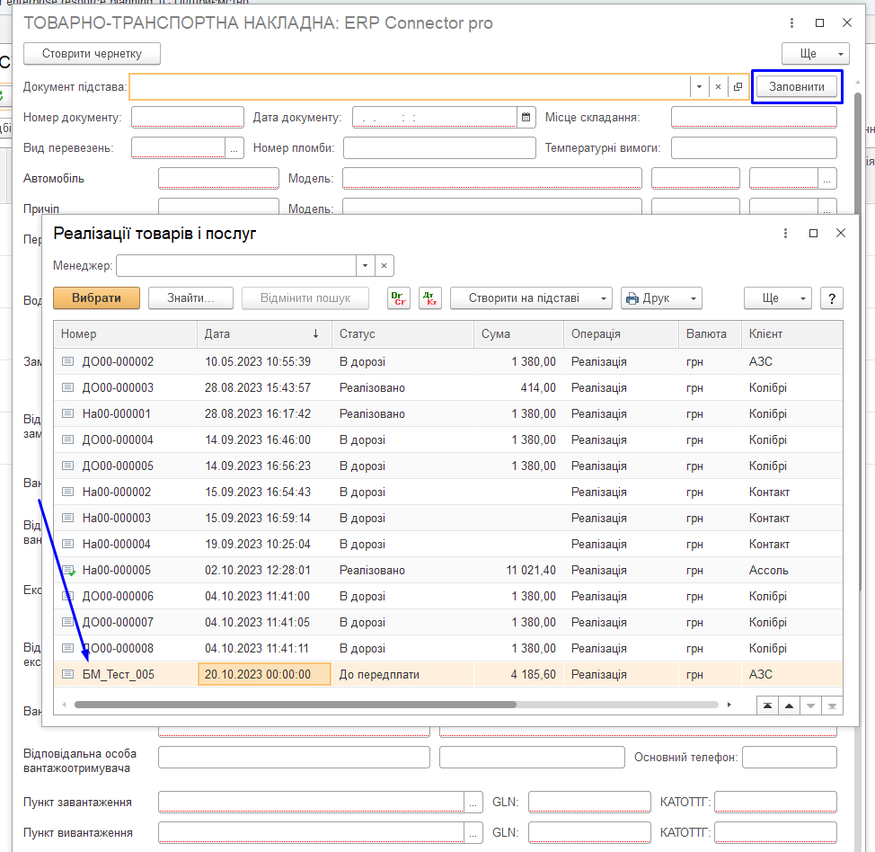

Згідно налаштувань документ-чернетка автоматично заповниться, а незаповнені поля (за потреби) можливо ввести вручну:

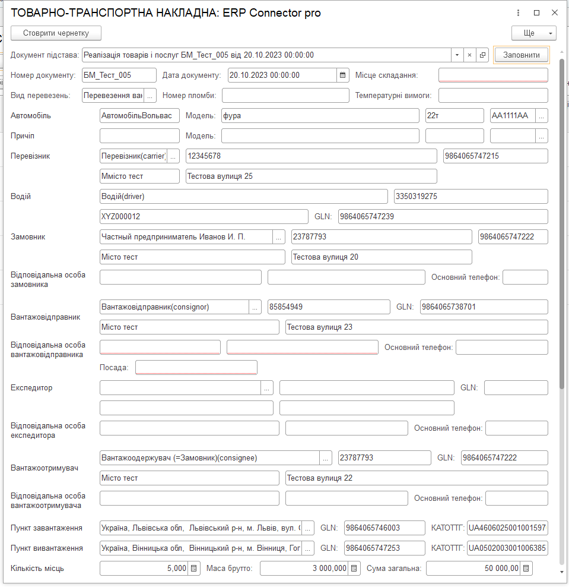

Далі потрібно обрати заповнений документ-чернетку (відмітка галочкою) та натиснути кнопку **"Підписати і відправити"**: 

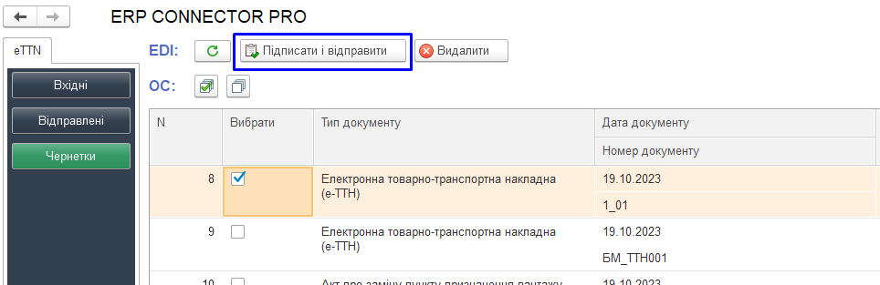

Також якщо Ви допустили помилку в чернетці її можна видалити щоб випадково її не відправити, для цього потрібно виділити потрібну чернетку та натиснути на кнопку **"Видалити"**:

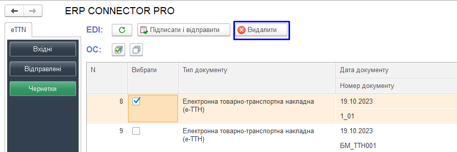

3.4.2 Створення документів на підставі інших документів
``````````````````````````````````````````````````````````````````````````````

3.4.2.1 Створення документа еТТН на основі "Заявки на транспортування"
'''''''''''''''''''''''''''''''''''''''''''''''''''''''''''''''''''''''''''''''''''''''''''

Для створення чернетки документа на основі "Заявки на транспортування" потрібно в меню **"Відправлені"** відмітити потрібну заявку та в меню **"Створити ТТН"** вибрати відповідний пункт:

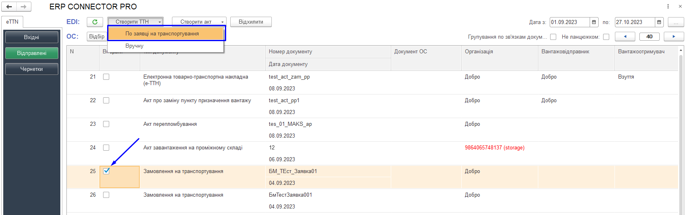

Створені документи потраплять у **"Чернетки"** для подальшого підписання та відправки.

3.4.2.2 Створення документа "Заявки на транспортування"
'''''''''''''''''''''''''''''''''''''''''''''''''''''''''''''''''''''''''''''''''''''''''''

Для створення документа "Заявки на транспортування" потрібно в розділі **"Чернетки"** в таблиці документів облікової системи вибрати необхідний документ-підставу та в підменю **"Створити чернетку"** натиснути кнопку **"Заявка на транспортування"**:

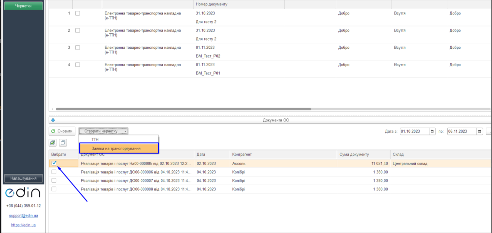

Далі відкриється форма заповнення заявки, де потрібно заповнити всі необхідні поля і натиснути кнопку **"Створити чернетку"**:

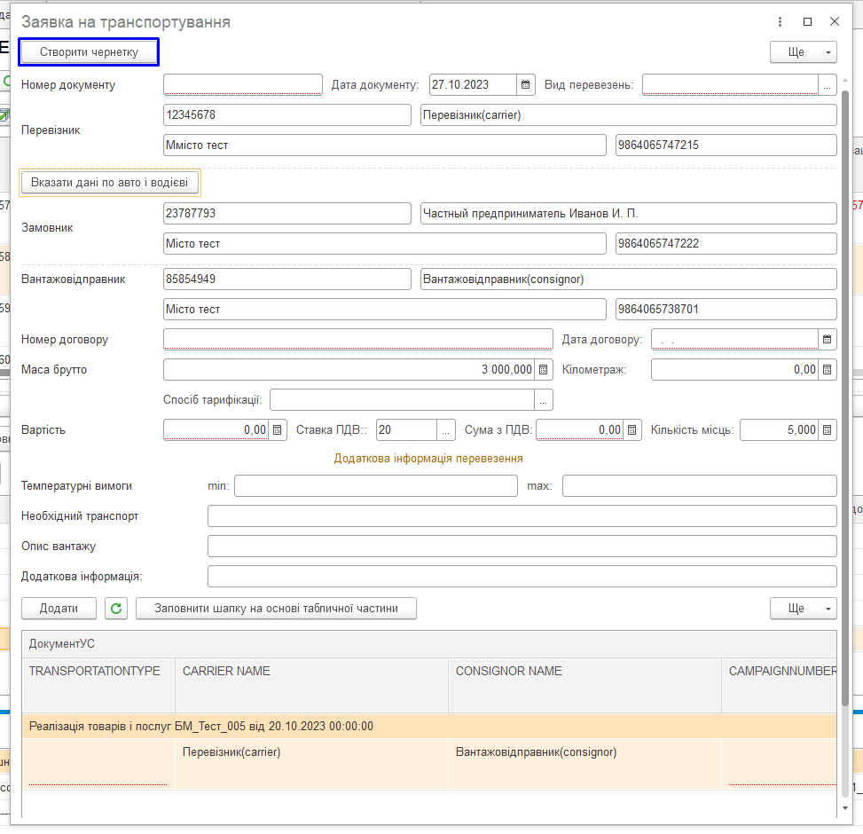

Після цього чернетка заявки з’явиться в списку чернеток і її можливо буде **"Підписати і відправити"**:

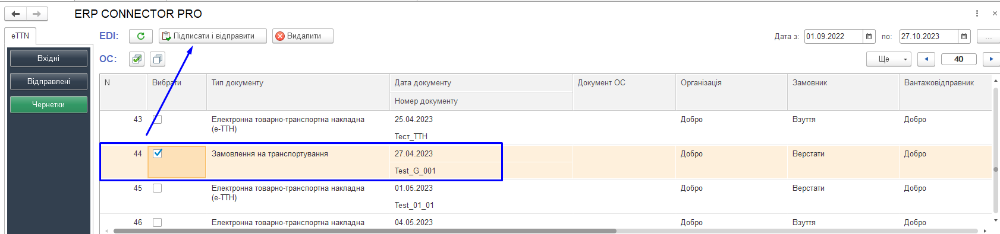

3.4.2.3 Створення документа "Акт зміни пункту призначення"
'''''''''''''''''''''''''''''''''''''''''''''''''''''''''''''''''''''''''''''''''''''''''''

.. attention::
   Створення "Акту зміни пункту призначення" можливе лише на основі документа еТТН.

Для створення документа "Акт про зміну пункту призначення" потрібно перейти в розділ меню **"Відправлені"** та в списку відправлених документів вибрати документ-підставу й **"Створити акт"** в підменю:

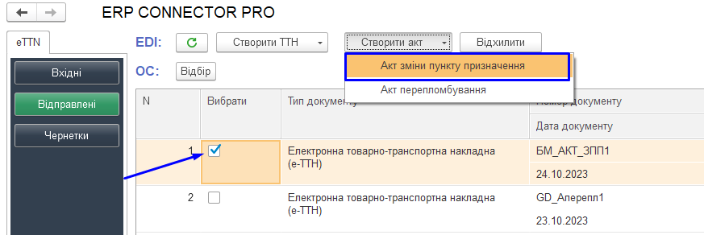

Далі відкриється форма для заповнення "Акта про заміну пункту призначення" з заповненою частиною полів з документа підстави:

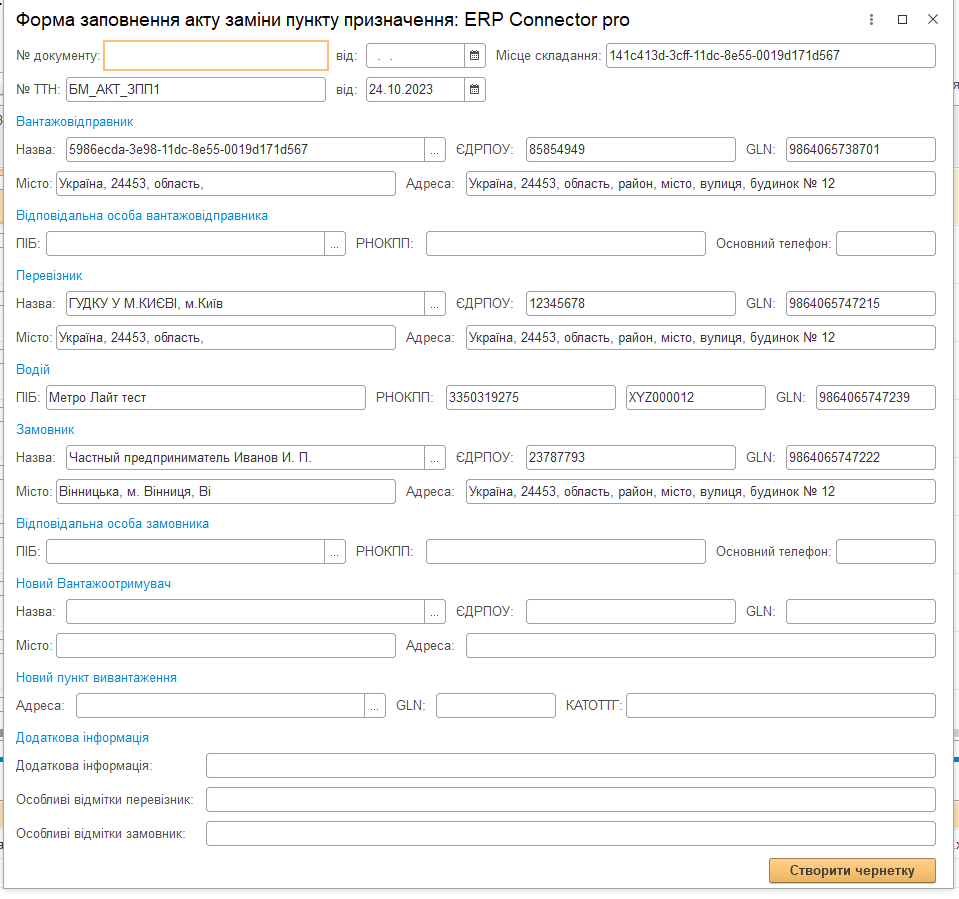

Все що залишиться зробити це дозаповнити необхідні поля та натиснути на кнопку **"Створити чернетку"**. Далі документ з’явиться в розділі меню **"Чернетки"** для подальшого підписання та відправки.

3.4.2.4 Створення документа "Акт перепломбування"
'''''''''''''''''''''''''''''''''''''''''''''''''''''''''''''''''''''''''''''''''''''''''''

.. attention::
   Створення "Акту зміни пункту призначення" можливе лише на основі документа еТТН.

Для створення документа "Акт перепломбування" потрібно перейти в розділ меню **"Відправлені"** та в списку відправлених документів вибрати документ-підставу й **"Створити акт"** в підменю:

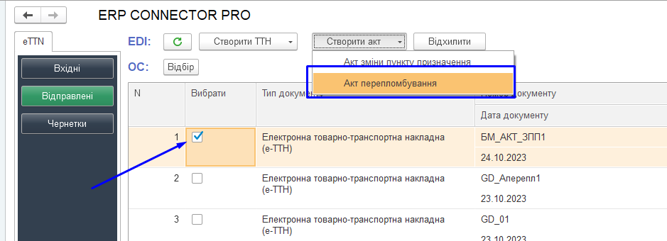

Далі відкриється форма для заповнення документа "Акт перепломбування" з заповненою частиною полів з документа підстави:

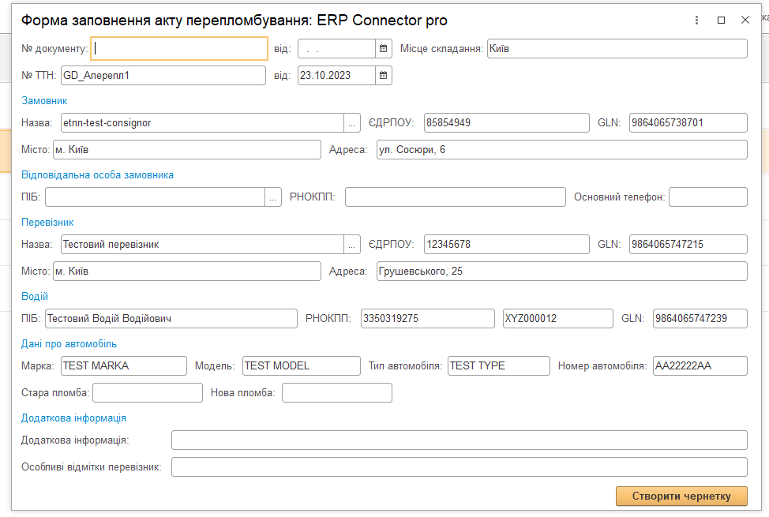

Все що залишиться зробити це дозаповнити необхідні поля та натиснути на кнопку **"Створити чернетку"**. Далі документ з’явиться в розділі меню **"Чернетки"** для подальшого підписання та відправки.

3.5 Відхилення документа еТТН
---------------------------------------------

У разі коли було відправлено ТТН, але виявились помилки, то до моменту підписання документа Перевізником є можливість відхилити даний документ. Для цього потрібно в розділі **"Відправлені"** вибрати необхідний документ та натиснути кнопку **"Відхилити"**:

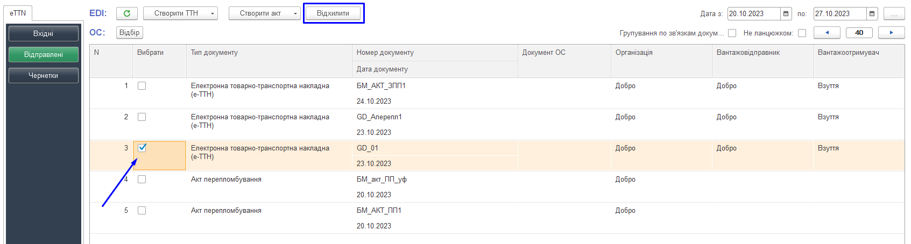

3.6 Підписання вхідних документів
---------------------------------------------

Для того щоб підписати вхідний документ потрібно в розділі **"Вхідні"** вибрати необхідний документ та натиснути кнопку **"Підписати"**:

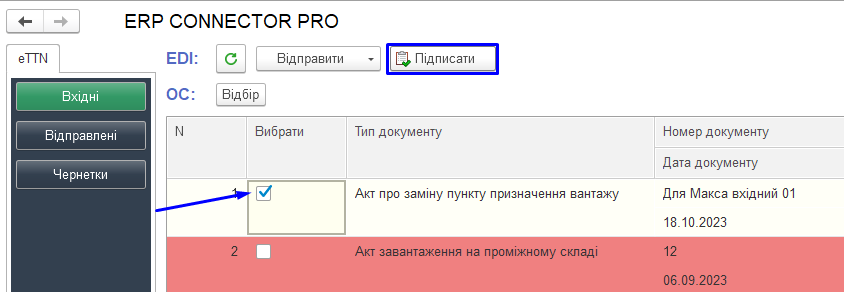

3.7 Перегляд документу з платформи в ОС
---------------------------------------------

Форма перегляду документу відкривається подвійним кліком по номеру або даті документа, який необхідно переглянути:

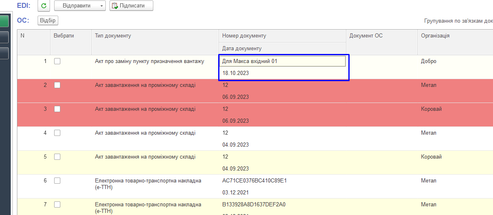

Після чого відкривається форма перегляду:

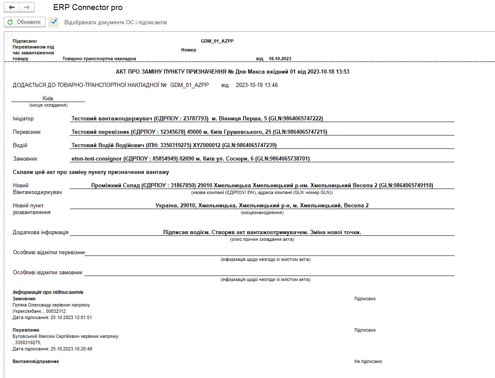

-------------------------------------

.. include:: /_constant/kontakti.rst
