"Акт виконаних робіт" на підставі ЕТТН (створення, підписання, відправлення та відхилення) 
#################################################################################################################################

.. role:: red

.. role:: green

.. role:: underline

.. сюда закину немного картинок для текста

.. |фільтр| image:: pics_Create_act_at_accepted_work/Create_act_at_accepted_work_28n.png

.. |drop_pass| image:: signing/drop_pass.png

.. |del_key| image:: signing/del_key.png

.. :underline:`"Чернетки" для ролі "Організатор"`

.. contents:: Зміст:
   :depth: 6

---------

При формуванні "Акта виконаних робіт" ініціатором документа виступає **"Перевізник"** (в сервісі ETTN передбачені 3 основні ролі учасників документообігу: **"Вантажовідправник"**, **"Перевізник"**, **"Вантажоотримувач"**). Обмін документом здійснюється між **"Перевізником"** та **"Вантажовідправником"**

:green:`"Перевізник" -> "Вантажовідправник"`

.. important::
    Функціонал створення актів доступний для компанії з роллю **"Перевізника"** на підставі підписаного з трьох сторін ЕТТН (в статусі "Підписано отримувачем").

**Створення "Акта виконаних робіт" на підставі ЕТТН ("Перевізник")**
==============================================================================

Для того аби створити "Акт виконаних робіт" потрібно перейти до каталогу **"Вхідні"** (1) та в розділі **"Додатковий пошук"** (2) скористатись |фільтр| фільтром **"Для актів виконаних робіт"** (3), що дозволяє відсортувати ЕТТН документи, на підставі яких може бути створений відповідний акт.

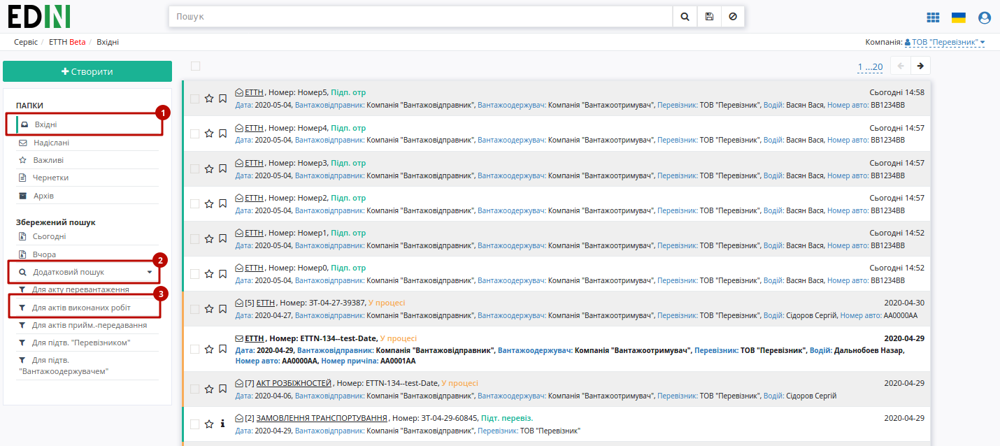

При створенні "Акту виконаних робіт" можливо вибрати 1 або кілька документів ЕТТН, на підставі яких він буде створений:

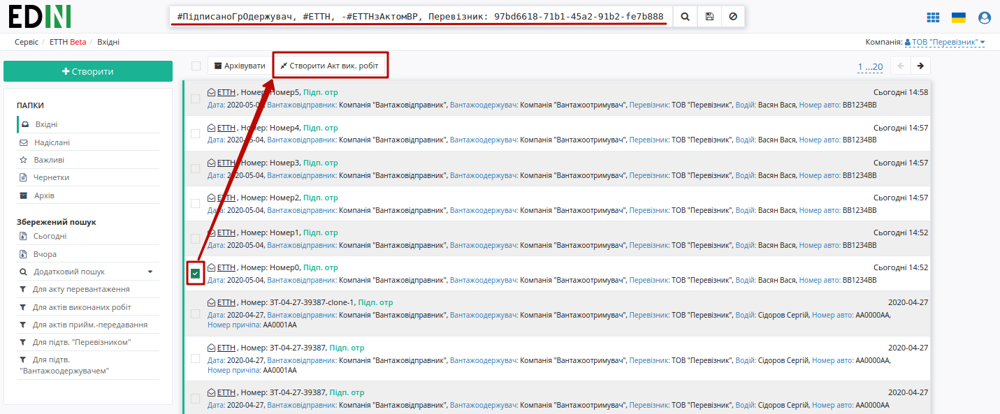

Далі необхідно заповнити форму "Акта виконаних робіт": 

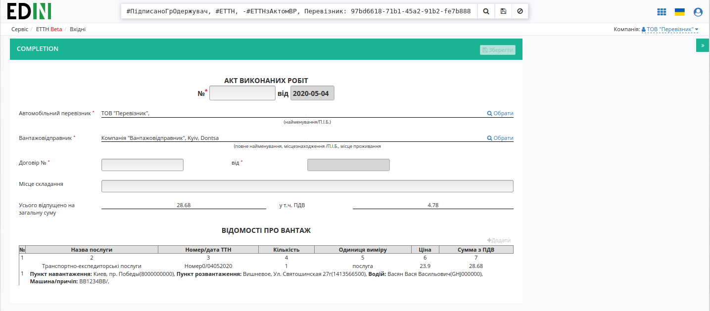

Після того, як обов'язкові поля документа (позначені червоною зірочкою :red:`*`) будуть заповнені його можливо буде **"Зберегти"** (1) та **"Підписати"** (2):

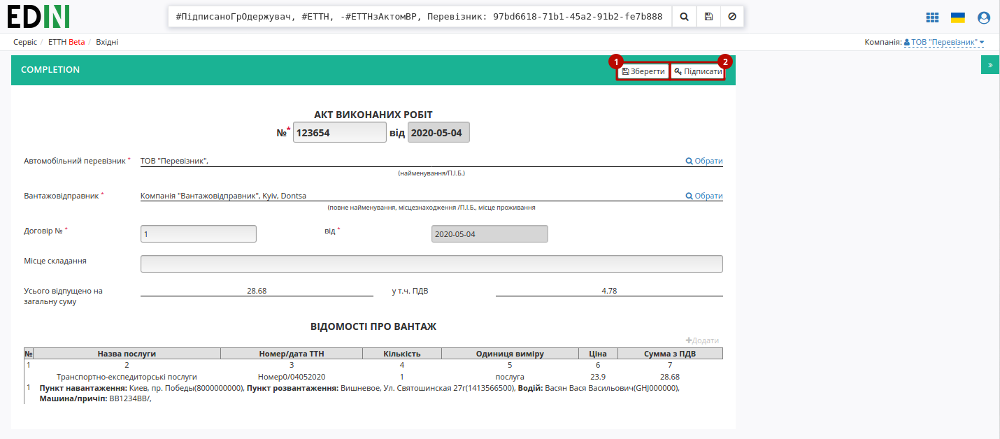

.. _sign:

**Підписання та відправка "Акта виконаних робіт" "Перевізником"**
==============================================================================

Після ініціалізації бібліотеки підписання, система надасть можливість додати ключ для підписання. При :underline:`першому` підписанні у модальному вікні потрібно обрати файл чи токен (1), ввести пароль (2) та натиснути **"Считати"** (3) ключ для підписання:

.. image:: signing/file1.png
   :align: center

.. image:: signing/file2.png
   :align: center

При успішному додаванні ключа автоматично відобразиться особа, від імені якої буде здійснено підписання. У користувача може бути додано кілька ключів - для вибору потрібного для здійснення операції підписання потрібно проставити відмітку (4) лівою кнопкою миші і натиснути "Підписати" (5):

.. image:: signing/file3.png
   :align: center

.. important::
   Якщо підписання цим ключем вже було здійснено або знайдена невідповідність даних ЄДРПОУ/ІПН (перевірка), то підписання блокується, а користувачу виводиться відповідне повідомлення:

.. image:: signing/wrong_key.png
   :align: center

Додатково в вікні підписання можливо натиснути **"Детальніше"** для того, щоб переглянути інформацію про підписанта, обрати за необхідності посаду, скинути пароль активного ключа (|drop_pass|) чи видалити помилкові (|del_key|).

При подальшій роботі з раніше доданим ключем/-ами потрібно вводити лише пароль для обраного ключа:

.. image:: signing/file4.png
   :align: center

Після підписання "Акту виконаних робіт" інформація щодо підписанта відображається в блоці "Підписанти", а документ можливо **"Надіслати"**:

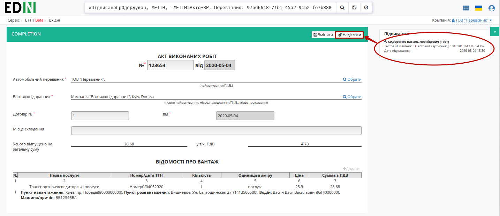

У **"Перевізника"** відправлений документ відображається у **"Надіслані"** зі статусом "У процесі"

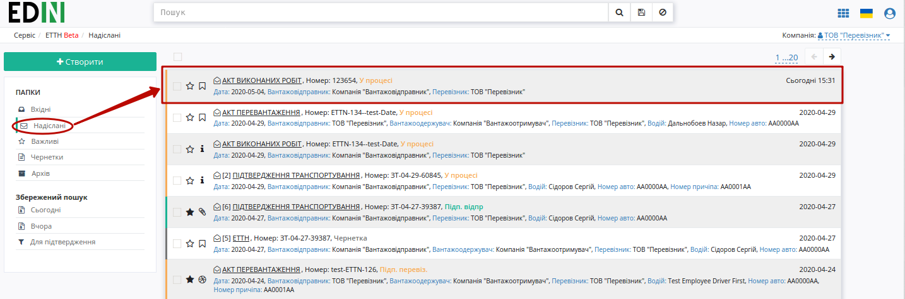

Відправлений "Акт виконаних робіт" має наступний вигляд:

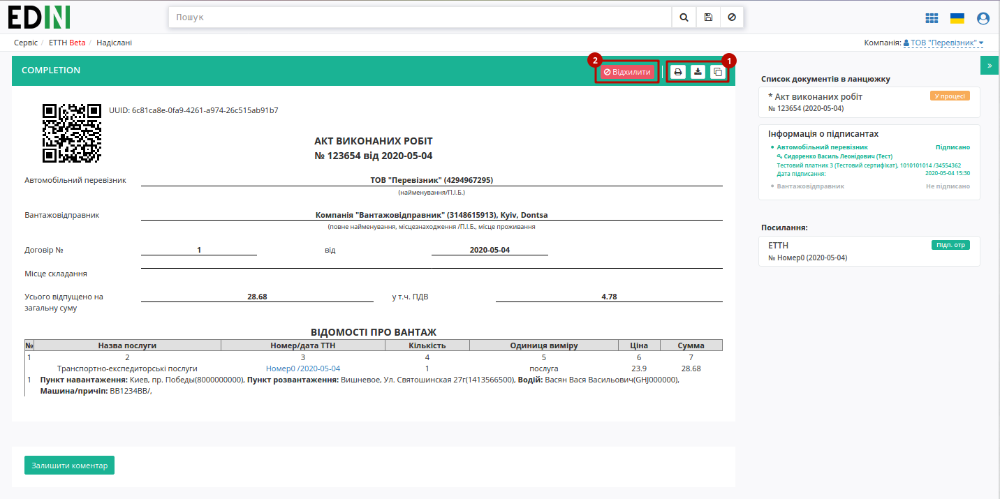

На формі "Акта виконаних робіт" у лівій верхній частині відображаються QR-код та унікальний ідентифікатор документа.

Користувач може скористатись функціоналом для "Друку", "Завантаження" чи "Клонування"; також у разі виявлення помилки в документі у **"Перевізника"** є можливість відхилити відправлений "Акт виконаних робіт" до підписання **"Вантажовідправником"**. Для цього потрібно натиснути на кнопку **"Відхилити"**.

**Відхилення "Акта виконаних робіт" "Перевізником"**
==============================================================================

Для того, щоб відхилити документ (доступно **до підписання "Вантажовідправником"**) потрібно натиснути **"Відхилити"**. 

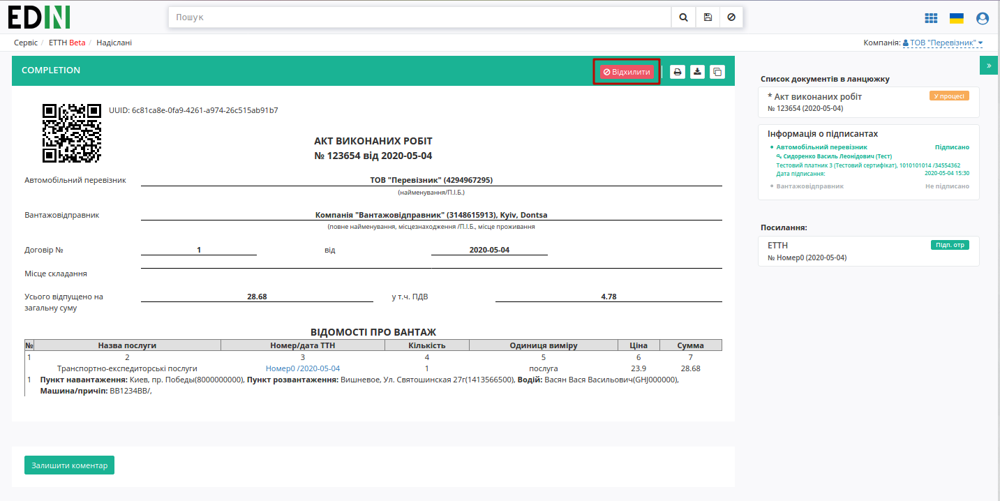

Після чого в модульному вікні обов'язково потрібно заповнити причину відміни документа:

.. image:: pics_Create_act_at_accepted_work/Create_act_at_accepted_work_20n.png
   :align: center

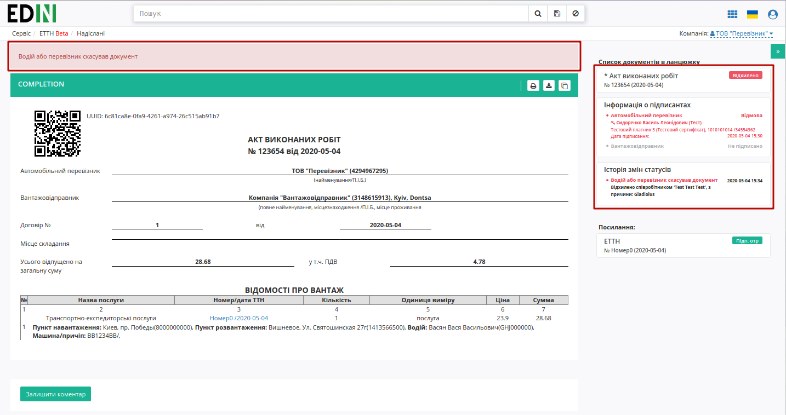

На платформі відображається повідомлення та змінюється статус документа в ланцюжку ("Відхилено").

**Отримання "Акта виконаних робіт" "Вантажовідправником"**
=================================================================================================================

Відправлений з боку **"Перевізника"** "Акт виконаних робіт" відображається в папці "Вхідні".

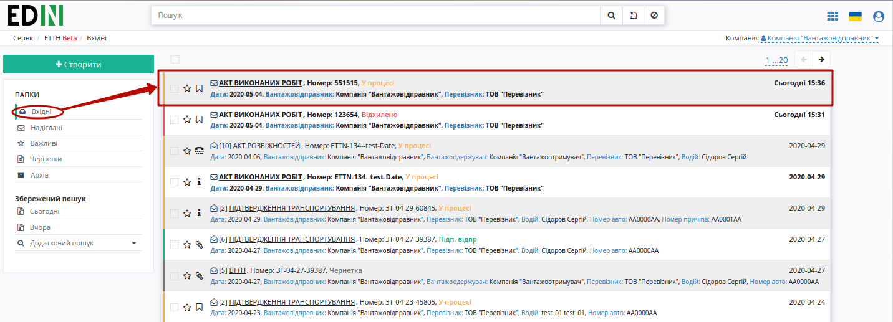

Вхідний підписаний документ можливо "Підписати" чи "Відхилити".

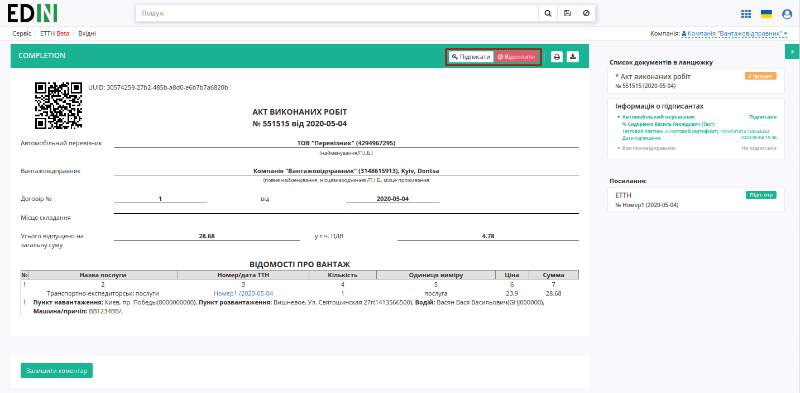

**Підписання "Акта виконаних робіт" "Вантажовідправником"**
=============================================================

Для підписання документу потрібно натиснути на кнопку **"Підписати"**:

.. image:: pics_Create_act_at_accepted_work/Create_act_at_accepted_work_25n.png
   :align: center

.. hint::
    Процес підписання **"Перевізником"** не відрізняється від підписання **"Вантажовідправником"** та описаний в `розділі вище <https://wiki.edi-n.com/uk/latest/ETTN_2_0/Create_act_at_accepted_work.html#sign>`__ .

Після підписання система повідомить про завершення документообігу інформаційним повідомленням в формі документу:

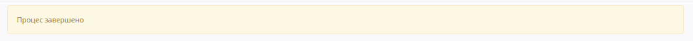

**Відхилення "Акта виконаних робіт" "Вантажовідправником"**
=============================================================================

У **"Вантажовідправника"** є можливість відхилити "Акт виконаних робіт". Для цього потрібно натиснути на кнопку **"Відхилити"**. Після чого в модульному вікні обов'язково потрібно заповнити причину відміни документа:

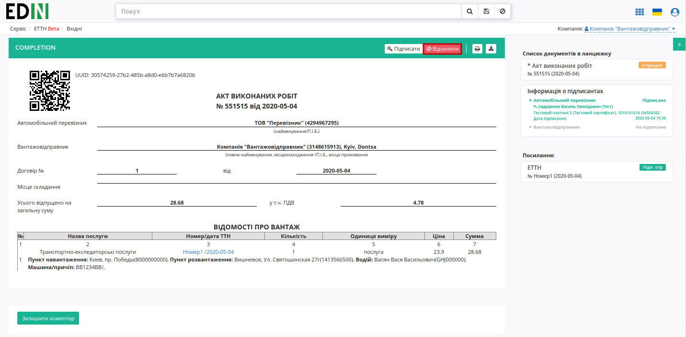

.. image:: pics_Create_act_at_accepted_work/Create_act_at_accepted_work_20n.png
   :align: center

Для відхиленого **"Вантажовідправником"** "Акта виконаних робіт" присвоєно статус "Відхилено".

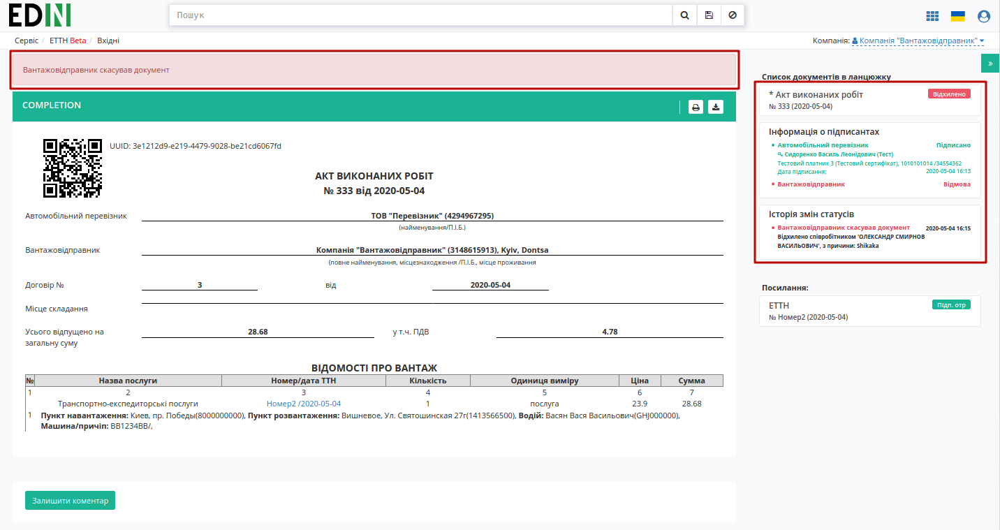

Документ з цим статусом відображається у "Вхідних" **"Вантажовідправника"** - документообіг завершено.

.. _additional-functionality:

**Додатковий функціонал**
==============================================================================

Додатково в "Акті виконаних робіт" можливо налаштувати автоматичне підрахування цін за послугу **"Перевізника"**.

.. note::
    Налаштування здійснюються на стороні контрагента з роллю **"Вантажовідправника"**!

Для налаштування автоматичного підрахування цін за послугу **"Вантажовідправнику"** потрібно перейти в "Налаштування":

.. image:: pics_Create_act_at_accepted_work/Create_act_at_accepted_work_29n.png
   :align: center

Далі серед своїх компаній (якщо їх кілька) обрати компанію, для якої будуть виконані наступні налаштування:

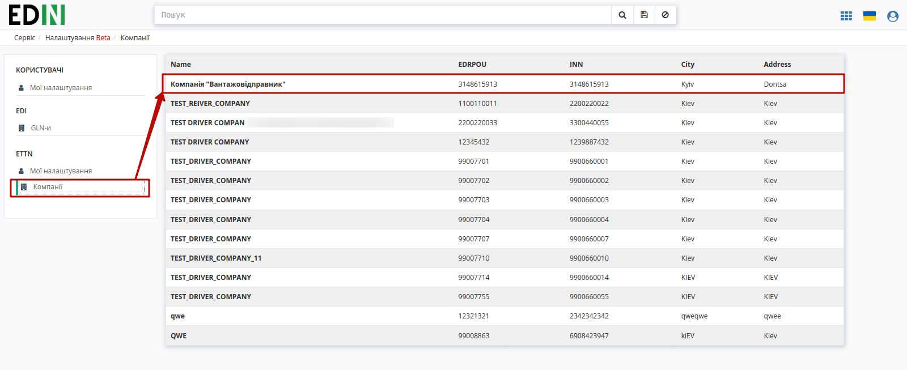

Обрати вкладку **"Тарифи"** та натиснути кнопку **"+Додати"**:

.. image:: pics_Create_act_at_accepted_work/Create_act_at_accepted_work_31n.png
   :align: center

Обрати (за назвою чи ЄДРПОУ) компанію-**"Перевізника"**, яка вже зареєстрована на платформі EDIN (1) і встановити фіксований "Тариф за т." (2) згідно якого буде проводитись автоматичний підрахунок цін (лише для обраного **"Перевізника"**). Кнопка "Зберегти" (3) зберігає вказані налаштування.

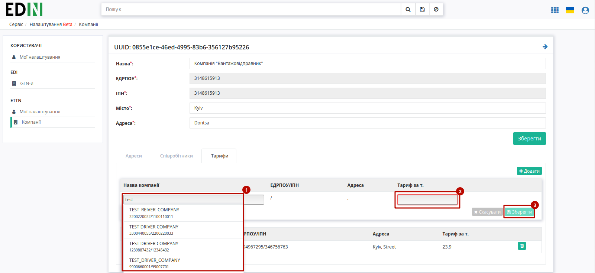

Налаштування можливо видалити в будь-який момент:

.. image:: pics_Create_act_at_accepted_work/Create_act_at_accepted_work_33n.png
   :align: center

.. include:: kontakti.rst