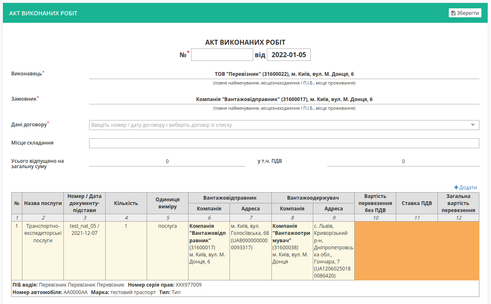
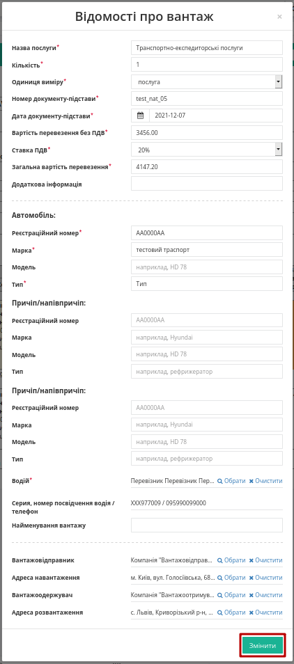

"Акт виконаних робіт" на підставі "Підтвердження транспортування" (створення, підписання, відправлення та відхилення) 
#################################################################################################################################

.. role:: red

.. role:: green

.. role:: underline

.. сюда закину немного картинок для текста

.. |фільтр| image:: pics_Create_act_at_accepted_work_on_PT/Create_act_at_accepted_work_on_PT_030.png

.. |drop_pass| image:: signing/drop_pass.png

.. |del_key| image:: signing/del_key2.png

.. :underline:`"Чернетки" для ролі "Організатор"`

.. contents:: Зміст:
   :depth: 3

---------

При формуванні "Акта виконаних робіт" ініціатором документа виступає **"Перевізник"** (в сервісі ETTN передбачені 3 основні ролі учасників документообігу: **"Вантажовідправник"**, **"Перевізник"**, **"Вантажоотримувач"**). Обмін документом здійснюється між **"Перевізником"** та **"Вантажовідправником"**

:green:`"Перевізник" -> "Вантажовідправник"`

.. important::
    Функціонал створення актів доступний для компанії з роллю **"Перевізника"** з "нуля" чи на підставі підписаного з обох сторін "Підтвердження транспортування" (в статусі "Підписано замовником"):

    .. image:: pics_Create_act_at_accepted_work_on_PT/Create_act_at_accepted_work_on_PT_001.png
       :align: center

.. attention::
    Якщо **"Вантажовідправником"** на "Підтвердження транспортування" був сформований документ "е-ТНН", то на створення "Акта виконаних робіт" діють обмеження поки не завершиться документообіг "е-ТНН" (тобто документ повинен бути підписаний **"Вантажоотримувачем"** і мати статус "Очікує підписання водієм / перевізником", "Очікує підписання перевізником (підтверджено водієм)" чи "Підписано перевізником"). Якщо серед пов'язаних документів "Підтвердження транспортування" є хоча б один документ "е-ТНН" в іншому статусі, то "Акт виконаних робіт" не створюється:

    .. image:: pics_Create_act_at_accepted_work_on_PT/Create_act_at_accepted_work_on_PT_003.png
       :align: center

**1 Створення "Акта виконаних робіт" на підставі "Підтвердження транспортування" ("Перевізник")**
================================================================================================================

Для того аби створити "Акт виконаних робіт" потрібно перейти до каталогу **"Надіслані"** (1) та в розділі **"Додатковий пошук"** (2) скористатись |фільтр| фільтром **"Для актів виконаних робіт"** (3), що дозволяє відсортувати "Підтвердження транспортування", на підставі яких може бути створено акт:

При створенні "Акту виконаних робіт" можливо вибрати 1 або кілька "Підтверджень транспортування", на підставі яких він буде створений:

.. image:: pics_Create_act_at_accepted_work_on_PT/Create_act_at_accepted_work_on_PT_005.png
   :align: center

Далі необхідно заповнити форму "Акта виконаних робіт" (обов'язкові поля документа позначені червоною зірочкою :red:`*`): 

.. hint::
   Таблична частина може бути одразу заповнена, якщо налаштоване `автоматичне підрахування цін <https://wiki.edin.ua/uk/latest/ETTN_2_0/Create_act_at_accepted_work_on_Proposal.html#additional-functionality>`__.

   .. image:: pics_Create_act_at_accepted_work_on_PT/Create_act_at_accepted_work_on_PT_034.png
      :align: center

Поле "Дані договору" - номер/дата договору, на підставі якого створено документ (створити та переглянути всі договори можливо в розділі "Компанії" `"Особистого кабінету" <https://wiki.edin.ua/uk/latest/Personal_Cabinet/PCInstruction.html#company-contracts>`__). Якщо договорів кілька, то можливо обрати договір зі списку або створити **"+Новий договір"** прямо в цьому документі, якщо їх поки немає:

.. image:: pics_Create_act_at_accepted_work_on_PT/Create_act_at_accepted_work_on_PT_035.png
   :align: center

.. image:: pics_Create_act_at_accepted_work_on_PT/Create_act_at_accepted_work_on_PT_032.png
   :align: center

.. attention::
   При створенні документа шляхом `клонування <https://wiki.edin.ua/uk/latest/ETTN_2_0/Work_with_ETTN.html#doc-clone>`__ поле "Дані договору" заповнюється автоматично лише за наявності цього договору в `"Особистому кабінеті" <https://wiki.edin.ua/uk/latest/Personal_Cabinet/PCInstruction.html#company-contracts>`__.

Можливо **"Додати"** дані про новий вантаж або **"Змінити"** / **"Видалити"** дані, що автоматично підтягнулись з документа-підстави: "Заявки на транспортування" (за умови, що в "Замовника" не активовані налаштування *заборони редагування вартості перевезення* [1]_ в "Актах виконаних робіт"):

.. image:: pics_Create_act_at_accepted_work_on_PT/Create_act_at_accepted_work_on_PT_036.png
   :align: center

Після того, як всі обов'язкові поля заповнені можливо **"Зберегти"** документ, в якості чернетки:

Після збереження чернетки (кнопка **"Зберегти"**) можливо додати супровідні документи на вантаж через кнопку **"Додати файл"**:

Для того щоб видалити доданий файл необхідно натиснути на іконку корзини. Для того щоб зберегти доданий файл необхідно натиснути на його назву. Після того, як обов'язкові поля документа (позначені червоною зірочкою :red:`*`) будуть заповнені документ за потреби можливо повторно **"Зберегти"** (1) та **"Підписати"** (2):

.. _sign:

**1.1 Підписання та відправка "Акта виконаних робіт" "Перевізником"**
----------------------------------------------------------------------------

.. загальне підписання на платформі

.. include:: /_constant/atb_check/atb_check.rst
   :start-after: .. початок блоку для ATB_check
   :end-before: .. кінець блоку для ATB_check

.. tabs::

   .. tab:: Файловий ключ

      .. include:: /_constant/signing/signing.rst
         :start-after: .. початок блоку для Signing
         :end-before: .. кінець блоку для Signing

   .. tab:: Token

      .. include:: /_constant/token_signing/token_signing.rst
         :start-after: .. початок блоку для TokenSign
         :end-before: .. кінець блоку для TokenSign

   .. tab:: Гряда

      .. include:: /_constant/gryada_signing/gryada_signing.rst
         :start-after: .. початок блоку для GryadaSign
         :end-before: .. кінець блоку для GryadaSign

   .. tab:: Cloud

      .. include:: /_constant/cloud_signing/cloud_signing.rst
         :start-after: .. початок блоку для CloudSign
         :end-before: .. кінець блоку для CloudSign

Після підписання "Акту виконаних робіт" інформація щодо підписанта відображається в блоці "Підписанти", а документ можливо **"Надіслати"**:

У **"Перевізника"** відправлений документ відображається у **"Надіслані"** зі статусом **"Очікує підписання замовником"**.

Відправлений "Акт виконаних робіт" має наступний вигляд:

На формі "Акта виконаних робіт" у лівій верхній частині відображаються QR-код та унікальний ідентифікатор документа.

Користувач може скористатись функціоналом для "Друку", "Завантаження" чи "Клонування" (1); також у разі виявлення помилки в документі у **"Перевізника"** є можливість **"Відхилити"** (2) відправлений "Акт виконаних робіт" до підписання **"Вантажовідправником"**.

**1.2 Відхилення "Акта виконаних робіт" "Перевізником"**
----------------------------------------------------------------------------

Для того, щоб відхилити документ (доступно **до підписання "Вантажовідправником"**) потрібно натиснути **"Відхилити"**. 

Після чого в модульному вікні обов'язково потрібно заповнити причину відміни документа:

.. image:: pics_Create_act_at_accepted_work_on_PT/Create_act_at_accepted_work_on_PT_015.png
   :align: center

На платформі відображається повідомлення та змінюється статус документа в ланцюжку (**"Скасовано виконавцем"**).

.. hint::
   Якщо "Акт виконаних робіт" було відхилено однією зі сторін, то на основі одного і того ж "Підтвердження транспортування" **"Перевізник"** може створити і відправити новий акт (в посиланнях до "Підтвердження транспортування" будуть відображатись всі прив'язані акти). 

**2 Отримання "Акта виконаних робіт" "Вантажовідправником"**
=================================================================================================================

Відправлений з боку **"Перевізника"** "Акт виконаних робіт" відображається в папці "Вхідні".

.. image:: pics_Create_act_at_accepted_work_on_PT/Create_act_at_accepted_work_on_PT_017.png
   :align: center

Вхідний підписаний документ можливо "Підписати" чи "Відхилити".

**2.1 Підписання "Акта виконаних робіт" "Вантажовідправником"**
----------------------------------------------------------------------------

**"Замовник"** акта ("Вантажовідправник" чи "Вантажоотримувач") може **"Підписати"** вхідний документ за допомогою одноіменної кнопки в формі документа:

Або **масово** підписати одразу кілька вхідних "Актів виконаних робіт" в журналі документів (детальніше про `Масове підписання "Актів виконаних робіт" <https://wiki.edin.ua/uk/latest/ETTN_2_0/Create_act_at_accepted_work_on_PT.html#mass-sign>`__).

.. hint::
    Процес підписання **"Перевізником"** не відрізняється від підписання **"Вантажовідправником"** та описаний в `розділі вище <https://wiki.edin.ua/uk/latest/ETTN_2_0/Create_act_at_accepted_work_on_PT.html#sign>`__ .

Після підписання документ змінює свій статус на **"Підписано замовником"** система повідомить про завершення документообігу інформаційним повідомленням в формі документу:

**2.2 Відхилення "Акта виконаних робіт" "Вантажовідправником"**
----------------------------------------------------------------------------

У **"Вантажовідправника"** є можливість відхилити "Акт виконаних робіт". Для цього потрібно натиснути на кнопку **"Відхилити"**. Після чого в модульному вікні обов'язково потрібно заповнити причину відміни документа:

.. image:: pics_Create_act_at_accepted_work_on_PT/Create_act_at_accepted_work_on_PT_015.png
   :align: center

Для відхиленого **"Вантажовідправником"** "Акта виконаних робіт" присвоєно статус "Відхилено".

Документ з цим статусом відображається у "Вхідних" **"Вантажовідправника"** - документообіг завершено.

.. hint::
   Якщо "Акт виконаних робіт" було відхилено однією зі сторін, то на основі одного і того ж "Підтвердження транспортування" **"Перевізник"** може створити і відправити новий акт (в посиланнях до "Підтвердження транспортування" будуть відображатись всі прив'язані акти). 

.. _additional-functionality:

**3 Додатковий функціонал**
==============================================================================

.. зробимо тут спільний блочок

.. include:: Create_act_at_accepted_work.rst
   :start-after: .. початок блоку для additional-functionality
   :end-before: .. кінець блоку для additional-functionality

Тож при формуванні "Акта виконаних робіт" на підставі "Підтвердження транспортування" при заданих налаштуваннях в створюваному акті виконується автоматичний розрахунок вартості перевезення (тариф за 1км/1т - обирається в "Заявці на транспортування"):

.. image:: pics_Create_act_at_accepted_work_on_PT/Create_act_at_accepted_work_on_PT_028.png
   :align: center

.. _mass-sign:

**4 Масове підписання "Актів виконаних робіт"**
==============================================================================

.. зробимо й тут спільний блочок

.. include:: Create_act_at_accepted_work.rst
   :start-after: .. початок блоку для mass-sign
   :end-before: .. кінець блоку для mass-sign

---------------------------------

.. [#] **Заборонити редагування вартості перевезення** - додаткові налаштування "Замовника", що можуть бути виконані при зверненні через службу підтримки. Якщо ці налаштуванні активовані, то:

   * В "Заявці на транспортування" поля "Вартість перевезення без ПДВ", "Ставка ПДВ", "Загальна вартість перевезення", "Спосіб тарифікації" у "Заявці на транспортування" є обов'язковими до заповнення;
   * В "Актах виконаних робіт", створених на на підставі "Заявки на транспортування" / "Підтвердження транспортування", "Перевізник" ("Виконавець"):

      * не може редагувати вартість перевезення (поля "Вартість перевезення без ПДВ", "Ставка ПДВ", "Загальна вартість перевезення";
      * не може **"Додавати"** / **"Видаляти"** позиції в ВІДОМОСТІ ПРО ВАНТАЖ (табличні дані).

---------------------------------

.. include:: /_constant/kontakti.rst