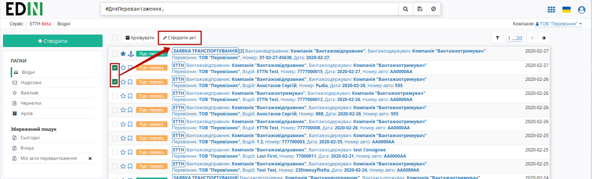
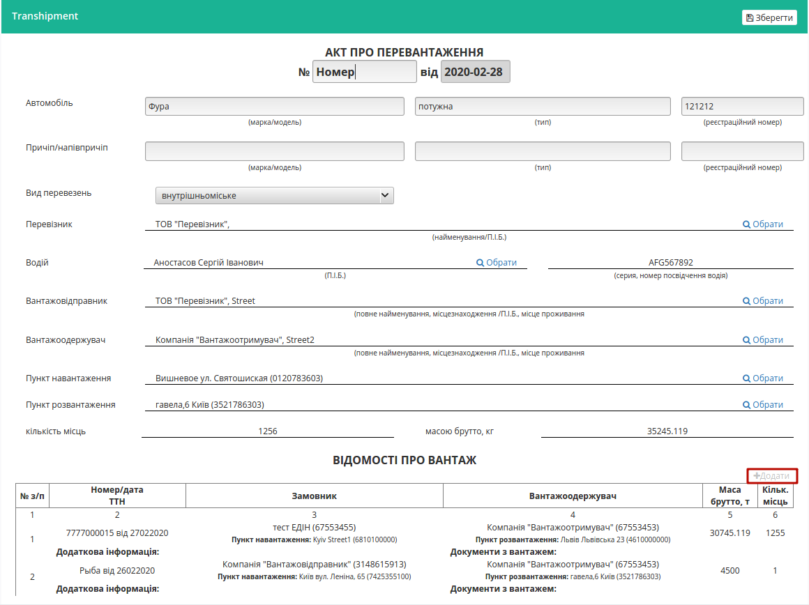
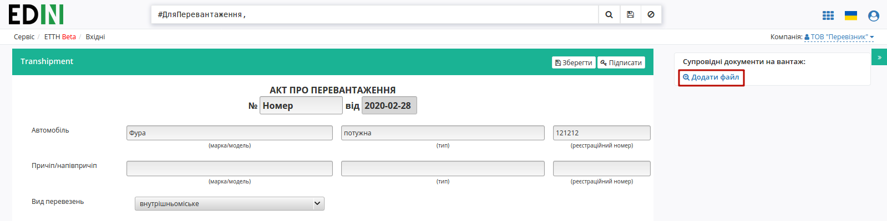
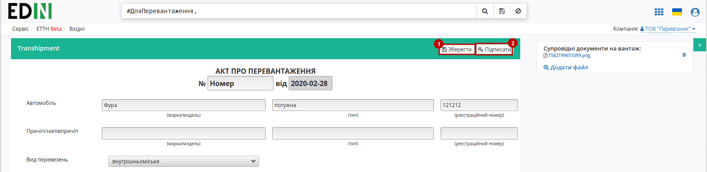
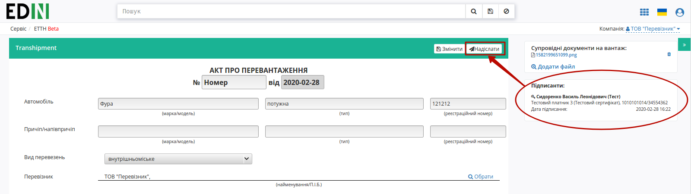

Створення "Акту перевантаження" / "Акту виконаних робіт" на підставі ЕТТН
###############################################################################################

.. role:: red

.. role:: green

.. role:: underline

.. сюда закину немного картинок для текста
.. |фільтр| image:: pics_Work_with_ETTN/Work_with_ETTN_04.png
.. :underline:`"Чернетки" для ролі "Організатор"`

.. contents:: Зміст:
   :depth: 6

---------

.. important::
    Функціонал створення актів доступний для компанії з роллю **"Перевізника"**

Для того аби створити "Акт перевантаження" / "Акт виконаних робіт" потрібно в перейти до каталогу **"Вхідні"** та скористатись кнопкою |фільтр| фільтром, що дозволяє відсортувати ЕТТН документи, на підставі яких може бути створений відповідний акт.

.. image:: pics_Create_acts_at_ETTN/Create_acts_at_ETTN_01.png
   :align: center

**Створення "Акту перевантаження" на підставі ЕТТН ("Перевізник")**
==============================================================================

Загальна схема документообігу з "Актом перевантаження":

.. image:: pics_Create_acts_at_ETTN/Create_acts_at_ETTN_02.png
   :align: center

Загальна схема документообігу з "Актом перевантаження":

.. image:: pics_Create_acts_at_ETTN/Create_acts_at_ETTN_02.png
   :align: center

При створенні "Акту перевантаження" можливо вибрати 1 або кілька документів ЕТТН, на підставі яких він буде створений:

Далі необхідно заповнити форму документа з уже запоненими відомостями про вантаж (їх теж можливо редагувати/додавати): 

Також до "Акту перевантаження" можливо додати супровідні метеріали через кнопку **"Додати файл"**:

Після того, як документ буде заповнений його можливо буде **"Зберегти"** (1) та **"Підписати"**(2):

Після ініціалізації бібліотеки підписання, система надасть можливість додати ключ для підписання. При :underline:`першому` підписанні необхідно додати файловий ключ. Для цього у модальному вікні потрібно обрати файл (2) і ввести пароль (1):

.. image:: pics_Create_acts_at_ETTN/Create_acts_at_ETTN_07.png
   :align: center

Після чого натиснути кнопку **"Додати"**:

.. image:: pics_Create_acts_at_ETTN/Create_acts_at_ETTN_08.png
   :align: center

При успішному додаванні ключа автоматично відобразиться вибрана особа, від імені якої буде здійснено підписання (кнопка **"Підписати"**):

.. image:: pics_Create_acts_at_ETTN/Create_acts_at_ETTN_09.png
   :align: center

При подальшій роботі з раніше доданим ключем/-ами потрібно вводити лише пароль для обраного ключа:

.. image:: pics_Create_acts_at_ETTN/Create_acts_at_ETTN_10.png
   :align: center

Після підписання "Акту про перевантаження" інформація щодо підписанта відображається в блоці "Підписанти", а документ можливо **"Надіслати"**:

У **"Перевізника"** відправлений документ відображається у **"Надіслані"** зі статусом "У процесі"

.. image:: pics_Create_acts_at_ETTN/Create_acts_at_ETTN_12.png
   :align: center

тут ще треба показати привязки до документів... але щось пішло не так

.. include:: kontakti.rst