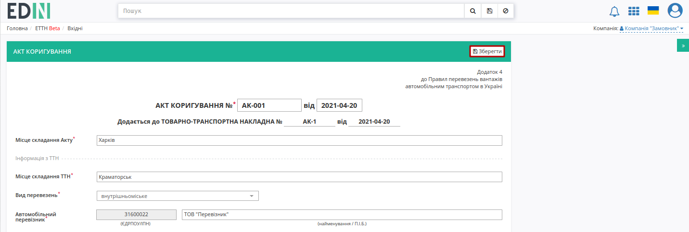
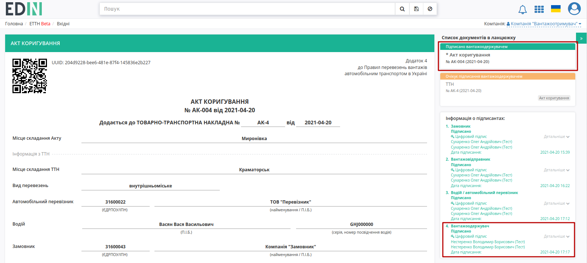

"Акт коригування" на підставі "е-ТТН" (створення, підписання, відправлення та відхилення)
####################################################################################################################################

.. role:: red

.. role:: green

.. role:: underline

.. сюда закину немного картинок для текста

.. |drop_pass| image:: signing/drop_pass.png

.. |del_key| image:: signing/del_key2.png

.. :underline:`"Чернетки" для ролі "Організатор"`

.. contents:: Зміст:
   :depth: 6

---------

В разі виявлення помилки в реквізитах "е-ТТН" є можливість створити і зберегти "Акт коригування", щоб зафіксувати в ньому правильні реквізити "е-ТТН".

В сервісі ETTN передбачені 3 основні ролі учасників документообігу: **"Вантажовідправник"**, **"Перевізник"**, **"Вантажоодержувач"**. Також додатково четвертий контрагент може виступати в якості **"Замовника"**. Документообіг "Актом коригування" здійснюється між трьома або чотирма контагентами в залежності від ролі Ініціатора. 

.. _logic:

Схема і послідовність підписання документа "Акт коригування" в залежності від ролі Ініціатора:

1) "Вантажовідправник" **=>** :green:`"Вантажовідправник" -> "Перевізник" -> "Вантажоодержувач"` (3 підписанти)

2) "Перевізник" **=>** :green:`"Перевізник" -> "Вантажовідправник" -> "Вантажоодержувач"` (3 підписанти)

3) "Вантажоодержувач" **=>** :green:`"Вантажоодержувач" -> "Вантажовідправник" -> "Перевізник"` (3 підписанти)

4) "Замовник" **=>** :green:`"Замовник" -> "Вантажовідправник" -> "Перевізник" -> "Вантажоодержувач"` (4 підписанти)

.. attention::
   "Акт коригування" створюється на основі підписаного документа "Товарно-транспортна накладна", що має статус "Очікує підписання вантажоодержувачем" (підписаний **"Перевізником"**).

**1 Створення "Акта коригування" на підставі "Товарно-транспортної накладної" Ініціатором (Вантажовідправник/Перевізник/Вантажоодержувач/Замовник)**
====================================================================================================================

Для того аби створити "Акт коригування" потрібно перейти до каталога **"Вхідні"** (**"Надіслані"** в випадку Ініціатора-Вантажовідправника) та перейти в "Товарно-транспортну накладну" до якої може бути створений коригуючий акт ("е-ТТН" в статусі "Очікує підписання вантажоодержувачем"):

В журналі з відібраними документами потрібно вибрати один зі списку та відкрити його. У відкритому документі натиснути кнопку **"+Створити коригуючий акт"** -> **"Акт коригування"**:

Далі відкриється форма "Акта коригування" з заповненими даними в блоці "Інформація з ТТН" (підтягується з "е-ТТН", як документа до коригування): 

Обов'язкові до заповнення поля позначені червоною зірочкою :red:`*`. В ручному режимі можливо виправити помилки чи корректно заповнити дані ТТН. Після того, як зміну будуть внесені і всі обов'язкові поля акта будуть заповнені, документ потрібно **"Зберегти"** (зберігається в якості чернетки):

Після всіх подальших змін в "Акті коригування" його можливо, за необхідності, повторно **"Зберегти"** (1) та **"Підписати"** (2):

.. _sign:

**1.1 Підписання та відправка "Акта коригування" Ініціатором (Вантажовідправник/Перевізник/Вантажоодержувач/Замовник)**
-------------------------------------------------------------------------------------------------------------------------------------------------------------------------------------

.. include:: /_constant/atb_check/atb_check.rst
   :start-after: .. початок блоку для ATB_check
   :end-before: .. кінець блоку для ATB_check

.. tabs::

   .. tab:: Файловий ключ

      .. include:: /_constant/signing/signing.rst
         :start-after: .. початок блоку для Signing
         :end-before: .. кінець блоку для Signing

   .. tab:: Token

      .. include:: /_constant/token_signing/token_signing.rst
         :start-after: .. початок блоку для TokenSign
         :end-before: .. кінець блоку для TokenSign

   .. tab:: Гряда

      .. include:: /_constant/gryada_signing/gryada_signing.rst
         :start-after: .. початок блоку для GryadaSign
         :end-before: .. кінець блоку для GryadaSign

   .. tab:: Cloud

      .. include:: /_constant/cloud_signing/cloud_signing.rst
         :start-after: .. початок блоку для CloudSign
         :end-before: .. кінець блоку для CloudSign

Після підписання "Акта коригування" інформація щодо підписанта відображається в блоці "Підписанти", а документ можливо **"Надіслати"**:

Після відправки документа контрагенту він відображається в журналі вихідних документів (папка "Надіслані"). Для відправленого "Акта коригування" присвоюється статус:

* для ініціатора "Вантажовідправника" **=>** **"Очікує підписання водієм / перевізником"**
* для ініціатора "Перевізника" **=>** **"Очікує підписання вантажовідправником"**
* для ініціатора "Вантажоодержувача" **=>** **"Очікує підписання вантажовідправником"**
* для ініціатора "Замовника" **=>** **"Очікує підписання вантажовідправником"**

На формі "Акта коригування" у лівій верхній частині відображаються QR-код та унікальний ідентифікатор документа. Відправлений "Акт коригування" Ініціатор може **"Відхилити"**, а контагенти прив'язаного документа "е-ТТН" отримують помітку і додаткове повідомлення про те, що дії з документом тимчасово обмежені:

**1.2 Відхилення "Акта коригування" Ініціатором (Вантажовідправник/Перевізник/Вантажоодержувач/Замовник)**
-----------------------------------------------------------------------------------------------------------------------------------------------------------------------

Для того, щоб відхилити документ Ініціатору потрібно натиснути кнопку **"Відхилити"**. 

Після чого в модульному вікні обов'язково потрібно заповнити причину відміни документа:

Документ змінює свій статус на:

* для ініціатора "Вантажовідправника" **=>** **"Скасовано вантажовідправником"**
* для ініціатора "Вантажоодержувача" **=>** **"Скасовано вантажоодержувачем"**
* для ініціатора "Перевізника" **=>** **"Скасовано водієм / перевізником"**
* для ініціатора "Замовника" **=>** **"Скасовано замовником"**

В історії відображаються додаткові дані. Документообіг завершено. Після відхилення "Акта коригування" функціонал по роботі з "е-ТТН" знову стає доступним:

**2 Отримання "Акта коригування" Вантажовідправником чи Перевізником**
=================================================================================================================

Вхідний підписаний "Акт коригування" можливо **"Підписати** чи **"Відхилити"**:

**2.1 Підписання "Акта коригування" Вантажовідправником чи Перевізником**
-------------------------------------------------------------------------------------------------

Підписання здійснюється за допомогою кнопки **"Підписати**:

Після чого до документа можливо додати особливі відмітки і підтвердити підписання (кнопка **"Підписати**): 

.. hint::
   Процес підписання не відрізняється від підписання описаного в `розділі вище <https://wiki.edin.ua/uk/latest/ETTN_2_0/Create_adjustment_act.html#sign>`__ .

Після підписання документ змінює свій статус на **"Очікує підписання вантажоодержувачем"** або **"Очікує підписання водієм / перевізником"**, в залежності від `схеми <https://wiki.edin.ua/uk/latest/ETTN_2_0/Create_adjustment_act.html#logic>`__ підписання.

.. image:: pics_Create_adjustment_act/Create_adjustment_act_017.png
   :align: center

**2.2 Відхилення "Акта коригування" Вантажовідправником чи Перевізником**
-------------------------------------------------------------------------------------------------

До того, як документ буде підписано наступним контрагентом його можливо відхилити: для цього потрібно натиснути кнопку **"Відхилити"**.

Після чого в модульному вікні обов'язково потрібно заповнити причину відміни документа:

Документ змінює свій статус на **"Скасовано водієм / перевізником"** чи **"Скасовано вантажовідправником"** в залежності від ролі контрагента. В історії відображаються додаткові дані. Документообіг завершено. Після відхилення "Акта коригування" функціонал по роботі з "е-ТТН" знову стає доступним:

**3 Отримання "Акта коригування" Перевізником чи Вантажоодержувачем**
=================================================================================================================

Вхідний підписаний "Акт коригування" можливо **"Підписати** чи **"Відхилити"**:

**3.1 Підписання "Акта коригування" Перевізником чи Вантажоодержувачем**
-------------------------------------------------------------------------------------------------

Підписання здійснюється за допомогою кнопки **"Підписати**:

Після чого до документа можливо додати особливі відмітки і підтвердити підписання (кнопка **"Підписати**): 

.. hint::
   Процес підписання не відрізняється від підписання описаного в `розділі вище <https://wiki.edin.ua/uk/latest/ETTN_2_0/Create_adjustment_act.html#sign>`__ .

Після підписання документ змінює свій статус на **"Очікує підписання вантажоодержувачем"**, **"Підписано вантажоодержувачем"**, **"Підписано перевізником"**, в залежності від `схеми <https://wiki.edin.ua/uk/latest/ETTN_2_0/Create_adjustment_act.html#logic>`__ підписання, додається запис в інформацію про підписантів:

Після підписання документа "Відхилити" його неможливо. Після трьохстороннього підписання "Акта коригування" для схем з трьома підписантами функціонал по роботі з "е-ТТН" знову стає доступним, можливо за потреби **"Показати зміни в ТТН"** (зміни виділяються жовтим кольором):

**3.2 Відхилення "Акта коригування" Перевізником чи Вантажоодержувачем**
-------------------------------------------------------------------------------------------------

До того, як документ буде підписано його можливо відхилити: для цього потрібно натиснути кнопку **"Відхилити"**. 

Після чого в модульному вікні обов'язково потрібно заповнити причину відміни документа:

Документ змінює свій статус на **"Скасовано водієм / перевізником"** чи **"Скасовано вантажоодержувачем"** в залежності від ролі контрагента. В історії відображаються додаткові дані. Документообіг завершено. Після відхилення "Акта коригування" функціонал по роботі з "е-ТТН" знову стає доступним:

**4 Отримання "Акта коригування" Вантажоодержувачем**
=================================================================================================================

.. note::
   Для схем в яких документ підписується трьома учасниками цей пункт відсутній.

Вхідний підписаний "Акт коригування" можливо **"Підписати** чи **"Відхилити"**:

**4.1 Підписання "Акта коригування" Вантажоодержувачем**
-------------------------------------------------------------------------------------------------

Підписання здійснюється за допомогою кнопки **"Підписати**:

Після чого до документа можливо додати особливі відмітки і підтвердити підписання (кнопка **"Підписати**): 

.. hint::
   Процес підписання не відрізняється від підписання описаного в `розділі вище <https://wiki.edin.ua/uk/latest/ETTN_2_0/Create_adjustment_act.html#sign>`__ .

Після підписання документ змінює свій статус на **"Підписано вантажоодержувачем"**, додається запис в інформацію про підписантів:

Після підписання документа "Відхилити" його неможливо. Після чотирьохстороннього підписання "Акта коригування" функціонал по роботі з "е-ТТН" знову стає доступним, можливо за потреби **"Показати зміни в ТТН"** (зміни виділяються жовтим кольором):

**4.2 Відхилення "Акта коригування" Вантажоодержувачем**
-------------------------------------------------------------------------------------------------

До того, як документ буде підписано його можливо відхилити: для цього потрібно натиснути кнопку **"Відхилити"**. 

Після чого в модульному вікні обов'язково потрібно заповнити причину відміни документа:

Документ змінює свій статус на **"Скасовано вантажоодержувачем"**, в історії відображаються додаткові дані. Документообіг завершено. Після відхилення "Акта коригування" функціонал по роботі з "е-ТТН" знову стає доступним:

--------------------------------------

.. include:: kontakti.rst
