"Акт розбіжностей" на підставі е-ТТН (створення, підписання, відправлення та відхилення) 
#################################################################################################################################

.. role:: red

.. role:: green

.. role:: underline

.. сюда закину немного картинок для текста

.. |фільтр| image:: pics_Create_disagreement_act/Create_disagreement_act_01.png

.. |drop_pass| image:: signing/drop_pass.png

.. |del_key| image:: signing/del_key2.png

.. :underline:`"Чернетки" для ролі "Організатор"`

.. contents:: Зміст:
   :depth: 3

---------

При формуванні "Акта розбіжностей" ініціатором документа виступає **"Вантажоотримувач"** (в сервісі ETTN передбачені 3 основні ролі учасників документообігу: **"Вантажовідправник"**, **"Перевізник"**, **"Вантажоотримувач"**). Обмін документом здійснюється між учасниками в наступному порядку: 

:green:`"Вантажоотримувач" -> "Перевізник" -> "Вантажовідправник"` *(Підписання зі сторони "Вантажовідправника" є опціональним)

.. important::
   Функціонал створення актів доступний для компанії з роллю **"Вантажоотримувача"** на підставі підписаного з двох сторін е-ТТН (в статусі "Очікує підписання вантажоодержувачем").

.. attention::
   Після створення "Акта розбіжностей" дії з документом-підставою ("е-ТТН") будуть обмежені поки **"Перевізник"** не підпише або відхилить створений "Акт розбіжностей".

**1 Створення "Акта розбіжностей" на підставі е-ТТН "Вантажоотримувачем"**
==============================================================================

Для того аби створити "Акт розбіжностей" потрібно перейти до каталогу **"Вхідні"** (1) та обрати потрібний е-ТТН документ в статусі "Очікує підписання вантажоодержувачем" (для зручності можливо скористатись пошуком) та натиснути на кнопку **"+Створити Акт Розбіжностей"**:

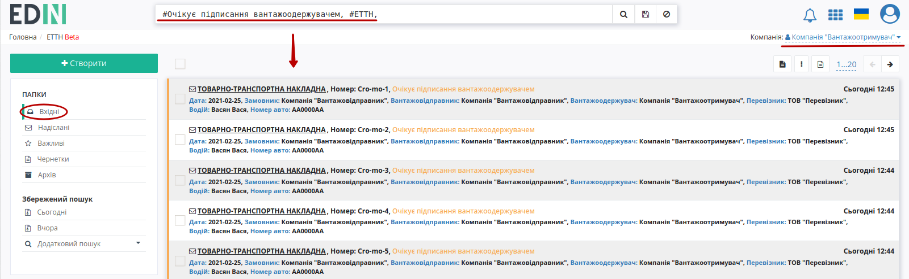

.. image:: pics_Create_disagreement_act/Create_disagreement_act_03.png
   :align: center

.. Може бути лише один "Акт розбіжностей" 

При створенні документа "Акта розбіжностей" його форма частково автоматично заповнюється даними (дані контрагентів, перевізника, відомості про вантаж) з е-ТТН, як документа-підстави: 

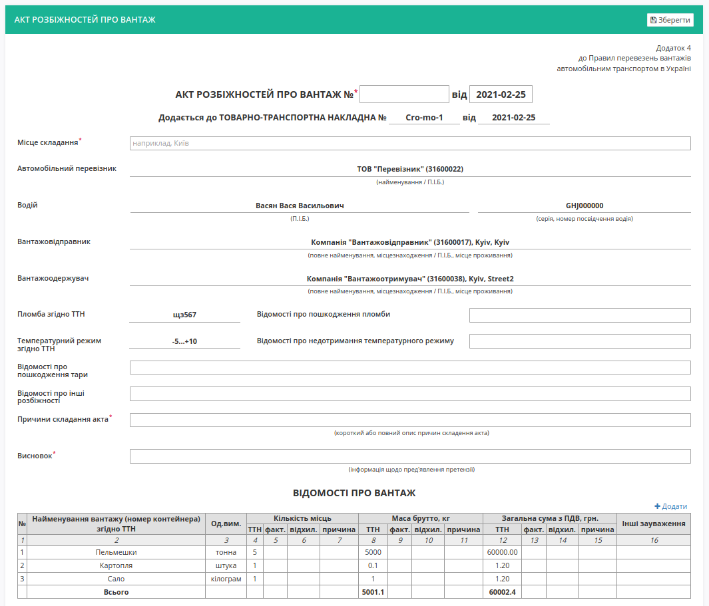

Таблична частина ("Відомості про вантаж") підлягає редагуванню та зміні: за допомогою кнопок можливо **"Змінити"**, **"Клонувати"**, **"Видалити"** будь-яку товарну позицію чи **"+Додати"** нову:

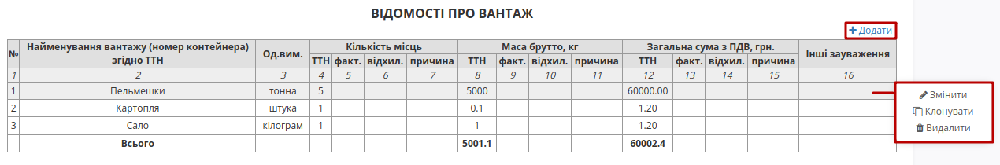

При редагуванні позиції при введенні фактичного значення (по кількості місць, массі брутто, загальній сумі з ПДВ) автоматично вираховується відхилення. Причину відхилення можливо ввести свою або обрати з представлених варіантів. По завершенню введення потрібно натиснути кнопку **"Змінити"**:

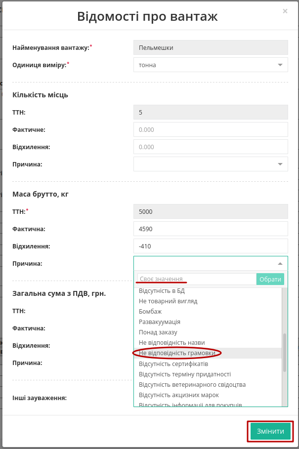

Поля, що потребують обов'язкового заповнення позначені червоною зірочкою :red:`*` (номер документа, місце складання, причини складання акта, висновок). Після того, як обов'язкові дані будуть введені потрібно **"Зберегти"** документ: 

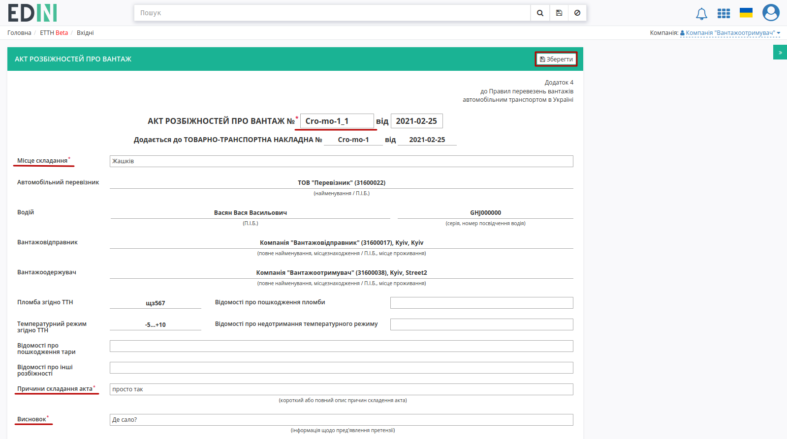

За потреби можливо повторно **"Зберегти"** (1) та **"Підписати"** (2):

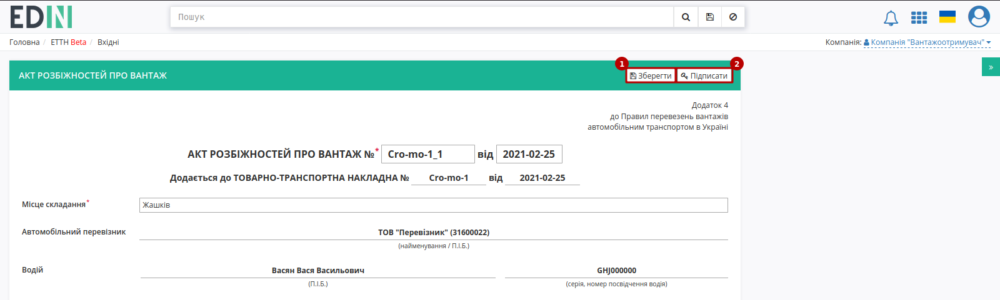

.. _sign:

**1.1 Підписання та відправка "Акта розбіжностей" "Вантажоотримувачем"**
----------------------------------------------------------------------------

Після ініціалізації бібліотеки підписання, система надасть можливість додати ключ для підписання. При :underline:`першому` підписанні у модальному вікні потрібно обрати файл чи токен (1), ввести пароль (2) та натиснути **"Зчитати"** (3) ключ для підписання:

.. image:: signing/file1n.png
   :align: center

.. image:: signing/file2n.png
   :align: center

При успішному додаванні ключа автоматично відобразиться особа, від імені якої буде здійснено підписання. У користувача може бути додано кілька ключів - для вибору потрібного для здійснення операції підписання потрібно проставити відмітку (4) лівою кнопкою миші і натиснути **"Підписати"** (5):

.. image:: signing/file3n.png
   :align: center

.. important::
   Якщо підписання цим ключем вже було здійснено або знайдена невідповідність даних ЄДРПОУ/ІПН (перевірка), то підписання блокується, а користувачу виводиться відповідне повідомлення:

.. image:: signing/wrong_key.png
   :align: center

Додатково в вікні підписання можливо натиснути **"Детальніше"** для того, щоб переглянути інформацію про підписанта; можливо видалити помилкові ключі (|del_key|).

При подальшій роботі з раніше доданим ключем/-ами потрібно вводити лише пароль для обраного ключа:

.. image:: signing/file4n.png
   :align: center

.. image:: signing/file5n.png
   :align: center

Після підписання "Акта розбіжностей" інформація щодо підписанта відображається в блоці "Підписанти", а документ можливо **"Надіслати"**:

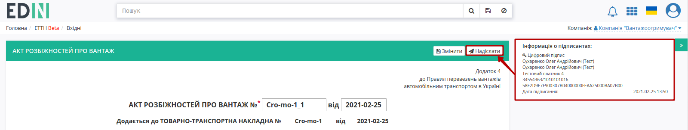

У **"Вантажоотримувача"** відправлений документ відображається у **"Надіслані"** зі статусом **"Очікує підписання водієм / перевізником"**:

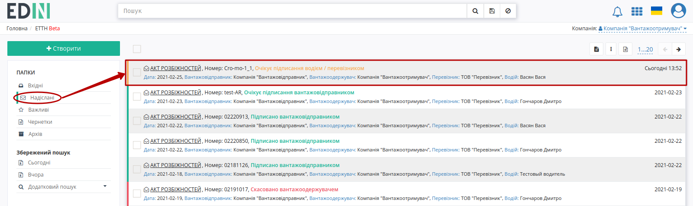

На формі "Акта розбіжностей" у лівій верхній частині відображаються QR-код та унікальний ідентифікатор документа. Відправлений "Акт розбіжностей" **"Вантажоотримувач"** може **"Відхилити"**, а контагенти пов'язаного документа "е-ТТН" отримують помітку і додаткове повідомлення про те, що дії з документом тимчасово обмежені:

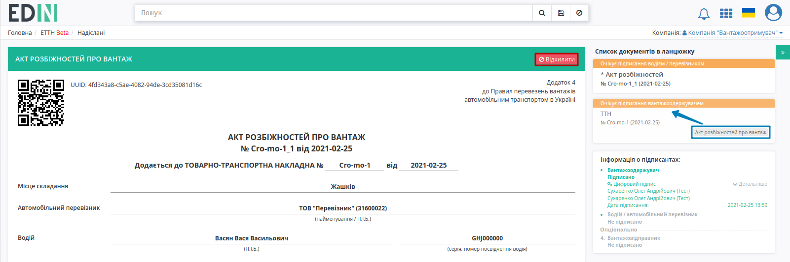

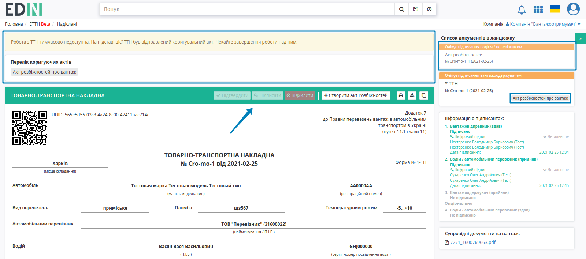

**1.2 Відхилення "Акта розбіжностей" "Вантажоотримувачем"**
----------------------------------------------------------------------------

Для того, щоб відхилити документ **"Вантажоотримувачу"** потрібно натиснути **"Відхилити"**. 

.. image:: pics_Create_disagreement_act/Create_disagreement_act_13.png
   :align: center

Після чого в модульному вікні обов'язково потрібно заповнити причину відміни документа:

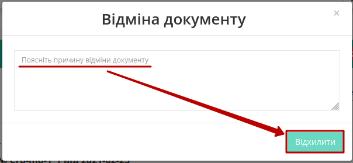

Документ змінює свій статус на **"Скасовано вантажоодержувачем"**, в історії відображаються додаткові дані. Документообіг акта завершено. Після відхилення "Акта розбіжностей" функціонал по роботі з "е-ТТН" знову стає доступним:

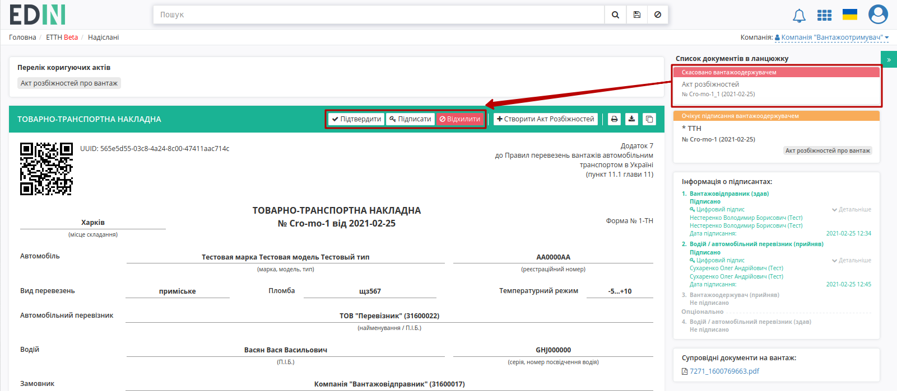

**2 Отримання "Акта розбіжностей" "Перевізником"**
=================================================================================================================

Відправлений з боку **"Вантажоотримувача"** "Акт розбіжностей" відображається в папці "Вхідні".

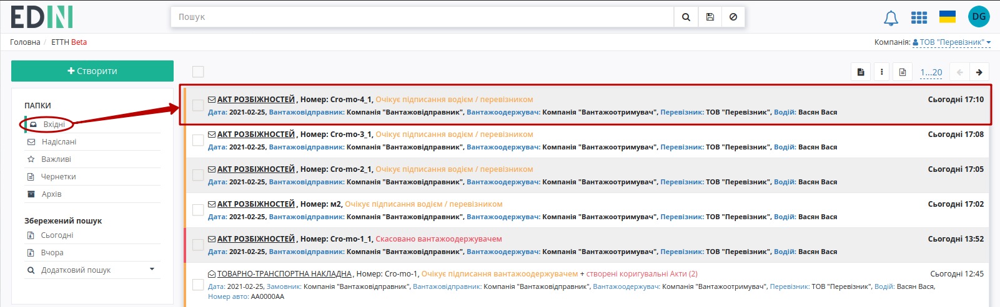

Вхідний підписаний документ можливо **"Підписати"** чи **"Відхилити"**:

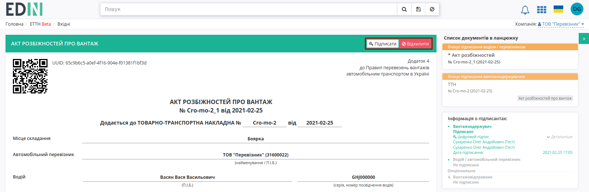

**2.1 Підписання "Акта розбіжностей" "Перевізником"**
----------------------------------------------------------------------------

Для підписання документу потрібно натиснути на кнопку **"Підписати"**:

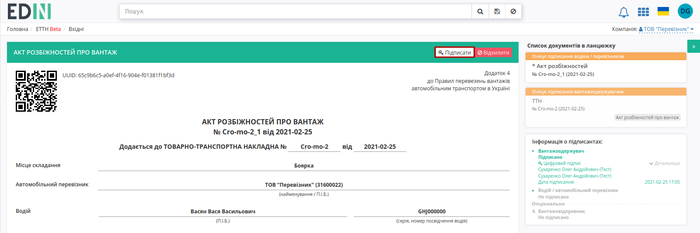

Після чого до документу можливо додати особливі відмітки і підтвердити підписання (кнопка **"Підписати"**):

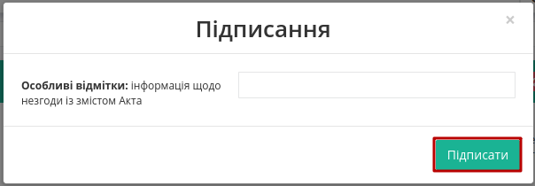

.. hint::
    Процес підписання **"Перевізником"** не відрізняється від підписання **"Вантажоотримувачем"** та описаний в `розділі вище <https://wiki.edin.ua/uk/latest/ETTN_2_0/Create_disagreement_act.html#sign>`__ .

Після підписання документ змінює свій статус на **"Очікує підписання вантажовідправником"**, додається запис в інформацію про підписантів:

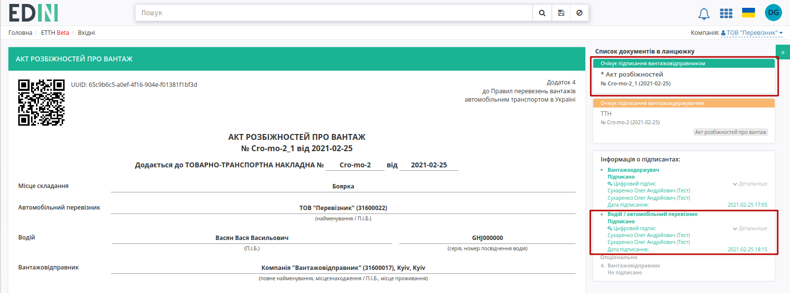

Після підписання "Акта розбіжностей" **"Перевізником"** функціонал по роботі з "е-ТТН" знову стає доступним:

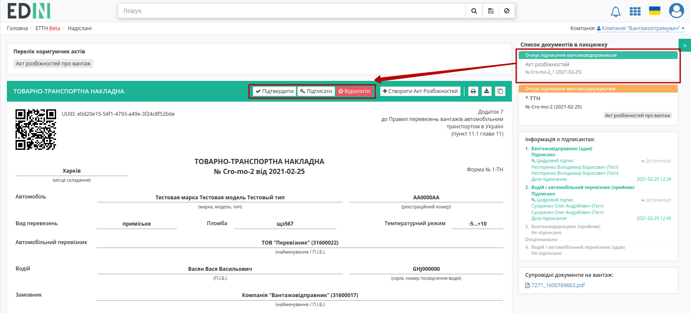

**2.2 Відхилення "Акта розбіжностей" "Перевізником"**
----------------------------------------------------------------------------

У **"Перевізника"** є можливість відхилити "Акт розбіжностей". Для цього потрібно натиснути на кнопку **"Відхилити"**. Після чого в модульному вікні обов'язково потрібно заповнити причину відміни документа:

Відхилений **"Перевізником"** "Акт розбіжностей" змінює свій статус на **"Скасовано водієм / перевізником"**.

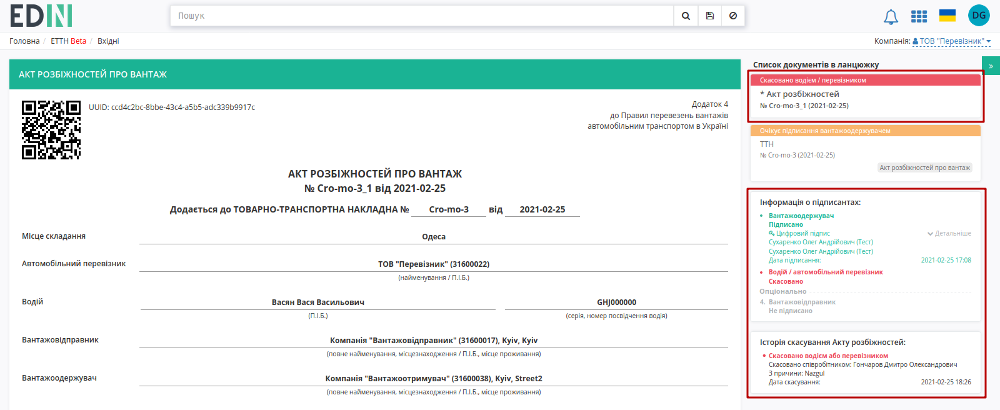

Документообіг акта завершено. Після відхилення "Акта розбіжностей" функціонал по роботі з "е-ТТН" знову стає доступним:

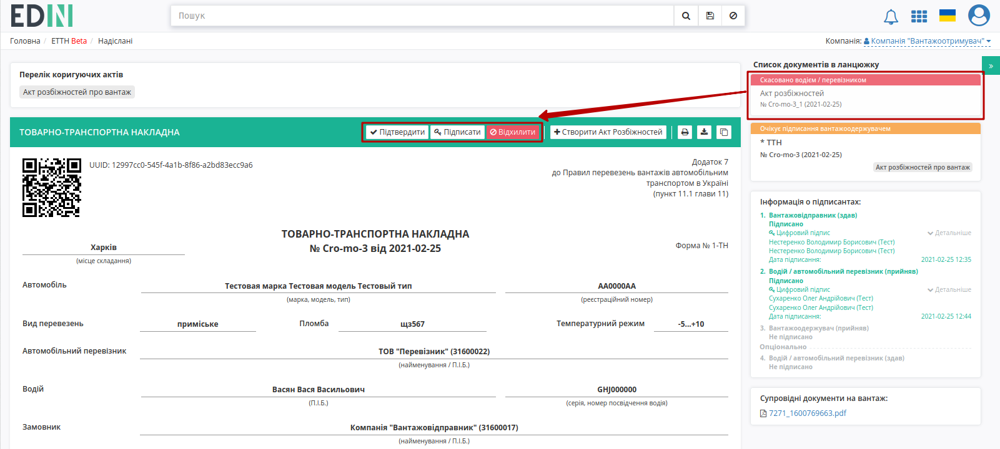

**3 Отримання та підписання "Акта розбіжностей" "Вантажовідправником"**
=================================================================================================================

.. note::
   Підписання "Акта розбіжностей" **"Вантажовідправником"** дає можливість засвідчити інформацію, зафіксовану в ньому і є опціональним.

Підписаний з двох сторін (**"Вантажоотримувачем"** та **"Перевізником"**) "Акт розбіжностей" відображається в папці "Вхідні":

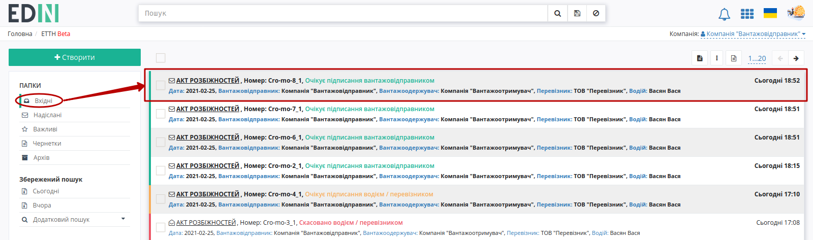

Вхідний підписаний документ можливо **"Підписати"**:

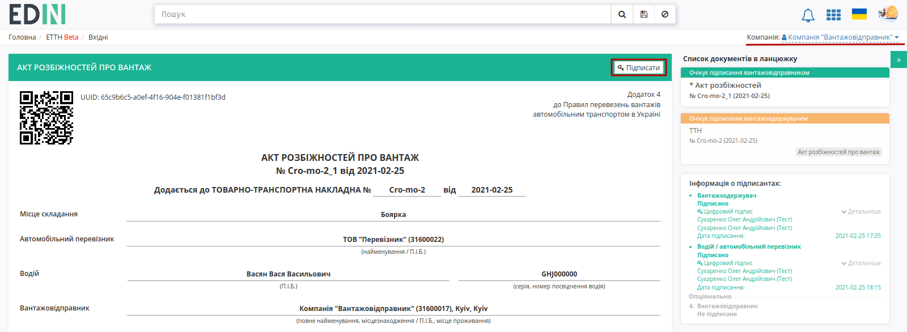

Після чого до документу можливо додати особливі відмітки і підтвердити підписання (кнопка **"Підписати"**):

.. hint::
   Процес підписання **"Вантажовідправником"** не відрізняється від підписання **"Вантажоотримувачем"** / **"Перевізником"** та описаний в `розділі вище <https://wiki.edin.ua/uk/latest/ETTN_2_0/Create_disagreement_act.html#sign>`__ .

Після підписання документ змінює свій статус на **"Підписано вантажовідправником"**, додається запис в інформацію про підписантів. Документообіг завершено.

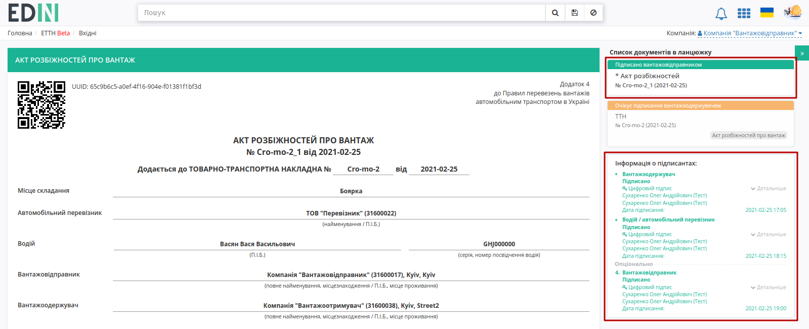

-------------------------------------

.. include:: kontakti.rst