"Акт розбіжностей" на підставі ЕТТН (створення, підписання, відправлення та відхилення)
###############################################################################################

.. role:: red

.. role:: green

.. role:: underline

.. сюда закину немного картинок для текста

.. |фільтр| image:: pics_Create_discrepancy_act/Create_discrepancy_act_01.png

.. :underline:`"Чернетки" для ролі "Організатор"`

.. contents:: Зміст:
   :depth: 6

---------

При формуванні "Акта розбіжностей" ініціатором документа виступає **"Вантажоотримувач"** (в сервісі ETTN передбачені 3 основні ролі учасників документообігу: **"Вантажовідправник"**, **"Перевізник"**, **"Вантажоотримувач"**). Обмін "Актом розбіжностей" здійснюється аналогічно до обміну "ЕТТН" тільки в зворотньому порядку.

.. important::
    "Акта розбіжностей" можливо створити на основі документу ЕТТН, що має статус "Підписано отримувачем". В одному документі одна і та ж компанія не може виступати в якості "Перевізника", "Вантажовідправника" та "Вантажоотримувача"!!!  

Отже, схема документообігу між компаніями має наступний вигляд:

:green:`"Вантажоотримувач" -> "Перевізник" -> "Вантажовідправник"`

.. important::
    Функціонал створення актів доступний для компанії з роллю **"Вантажоотримувача"**

**1 Створення "Акта розбіжностей" на підставі ЕТТН ("Вантажоотримувач")**
==============================================================================

Для того аби створити "Акт розбіжностей" потрібно перейти до каталогу **"Вхідні"** та обрати підписаний усіма сторонами документ "ЕТТН" (зі статусом "Підписано отримувачем"):

.. image:: pics_Create_discrepancy_act/Create_discrepancy_act_02.png
   :align: center

У вибраному документі ЕТТН потрібно натиснути на кнопку **"+Створити акт розбіжностей"**: 

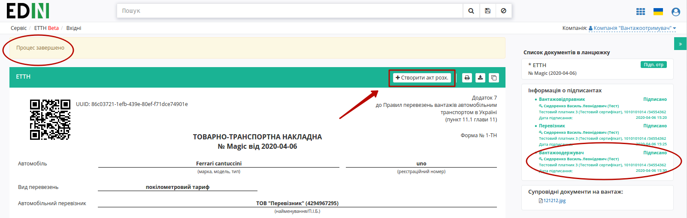

При створенні документа "Акт розбіжностей" його форма частково автоматично заповнюється даними з "ЕТТН": 

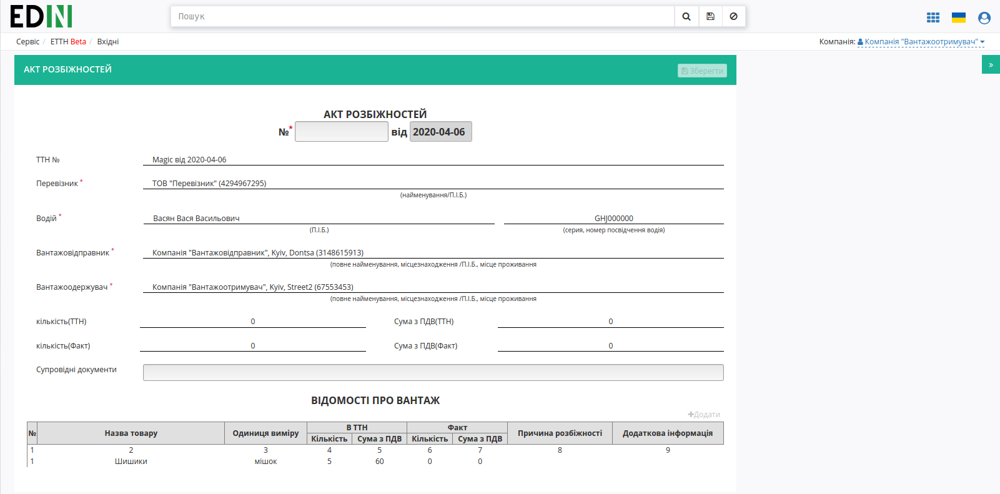

В створеній формі потрібно заповнити Номер документу та **"Змінити"** дані в табличній частині (їх також можливо "Додати"):

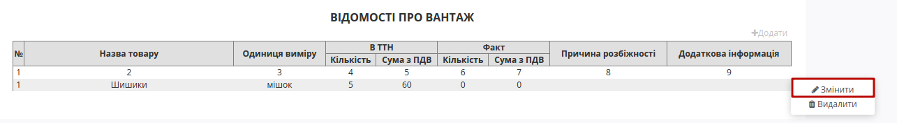

В модальному вікні "Відомостей про вантаж" можливо змінити всі дані і всі вони є обов'язковими до заповнення окрім "Додаткової інформації". Числові значення не можуть бути менші чи рівні нулю.

.. image:: pics_Create_discrepancy_act/Create_discrepancy_act_06.png
   :align: center

Після того, як форма заповнена документ можливо **"Зберегти"** (документ зберігається, як чернетка):

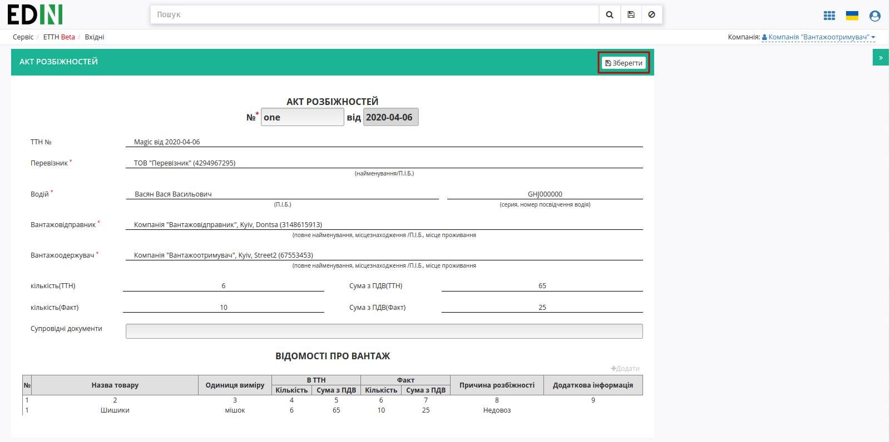

Після збереження документу до "Акту розбіжностей" можливо додати супровідні метеріали через кнопку **"Додати файл"** (назва файлу повинна бути унікальною). Для того щоб видалити доданий файл необхідно натиснути на іконку корзини.

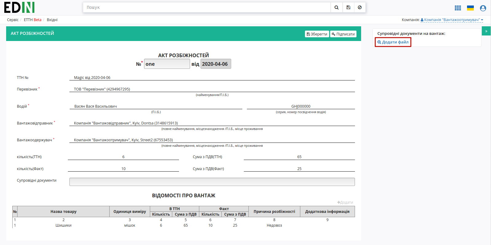

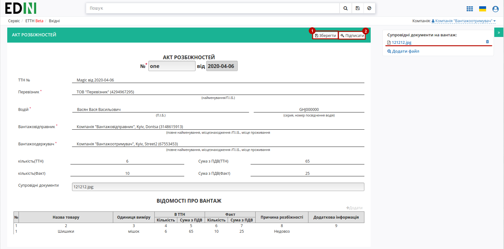

Після усіх проведених змін документ необхідно **"Зберегти"** (1) та **"Підписати"** (2).

.. _sign:

**1.1 Підписання та відправка "Акта розбіжностей" "Вантажоотримувачем"**
================================================================================================

Після ініціалізації бібліотеки підписання, система надасть можливість додати ключ для підписання. При :underline:`першому` підписанні необхідно додати файловий ключ. Для цього у модальному вікні потрібно обрати файл (2) і ввести пароль (1):

.. image:: pics_Create_discrepancy_act/Create_discrepancy_act_10.png
   :align: center

Після чого натиснути кнопку **"Додати"**:

.. image:: pics_Create_discrepancy_act/Create_discrepancy_act_11.png
   :align: center

При успішному додаванні ключа автоматично відобразиться вибрана особа, від імені якої буде здійснено підписання (кнопка **"Підписати"**):

.. image:: pics_Create_discrepancy_act/Create_discrepancy_act_12.png
   :align: center

При подальшій роботі з раніше доданим ключем/-ами потрібно вводити лише пароль для обраного ключа:

.. image:: pics_Create_discrepancy_act/Create_discrepancy_act_13.png
   :align: center

Після підписання "Акту розбіжностей" інформація щодо підписанта відображається в блоці "Підписанти", а документ можливо **"Надіслати"**:

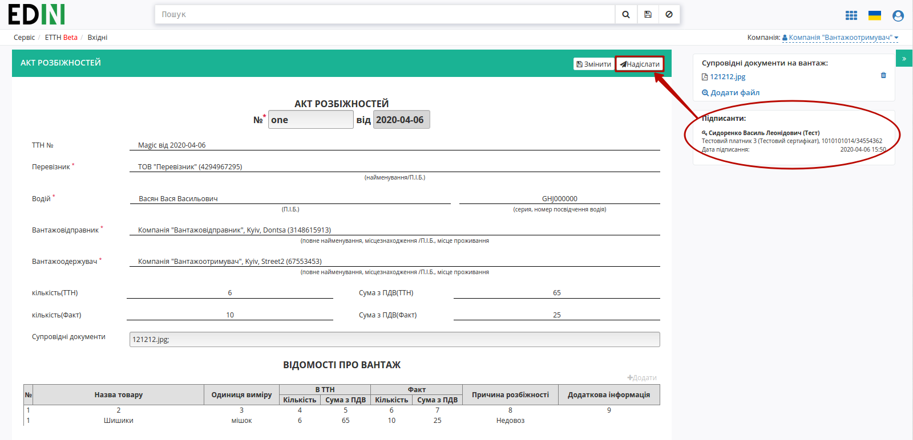

Після відправки документа контрагенту він відображається в журналі вихідних документів. Для відправленого **"Вантажоотримувачем"** "Акта розбіжностей" присвоєно статус "У процесі":

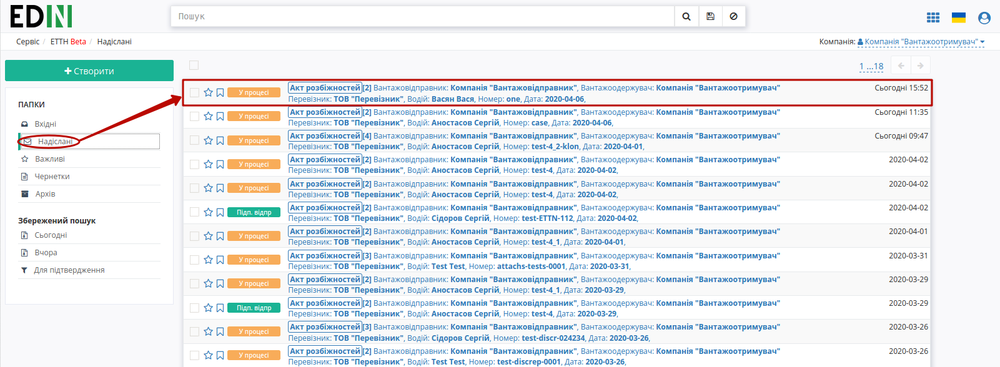

Відправлений "Акт розбіжностей" має наступний вигляд:

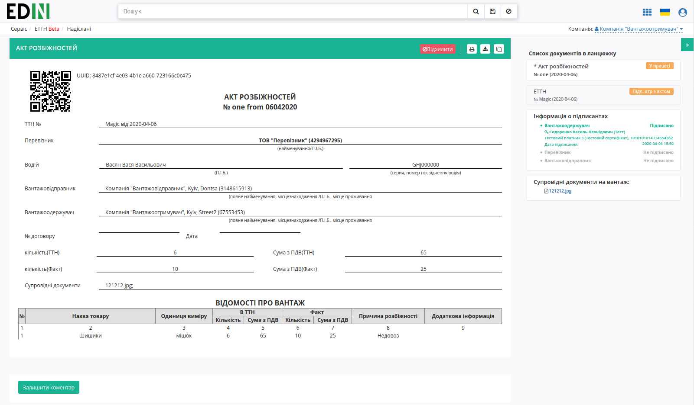

На формі "Акта про розбіжностей" у лівій верхній частині відображаються QR-код та унікальний ідентифікатор документа.

Користувач може скористатись функціоналом для "Друку", "Завантаження" чи "Клонування"; також у разі виявлення помилки в документі є можливість відхилити відправлений "Акт розбіжностей" **до підтвердження/підписання Перевізником**. Для цього потрібно натиснути на кнопку "Відхилити".

**1.2 Відхилення "Акта розбіжностей" "Вантажоотримувачем"**
==============================================================================

Для того, щоб відхилити документ **"Вантажоотримувачу"** потрібно натиснути **"Відхилити"**. 

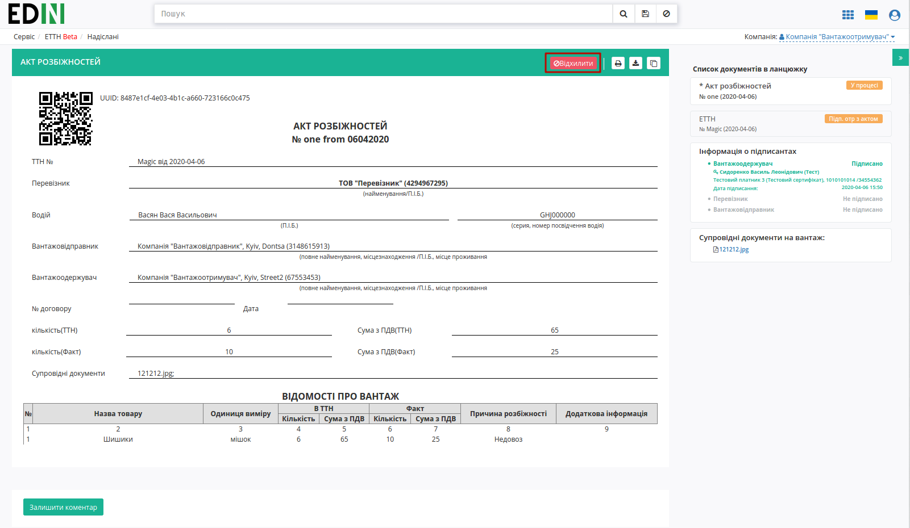

Після чого в модульному вікні обов'язково потрібно заповнити причину відміни документа:

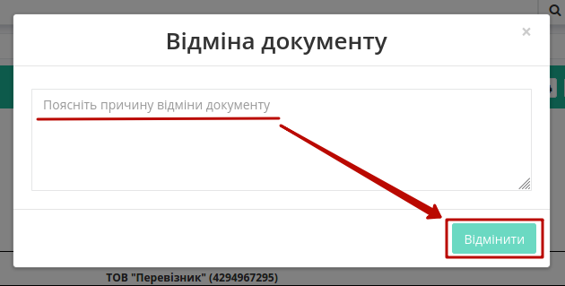

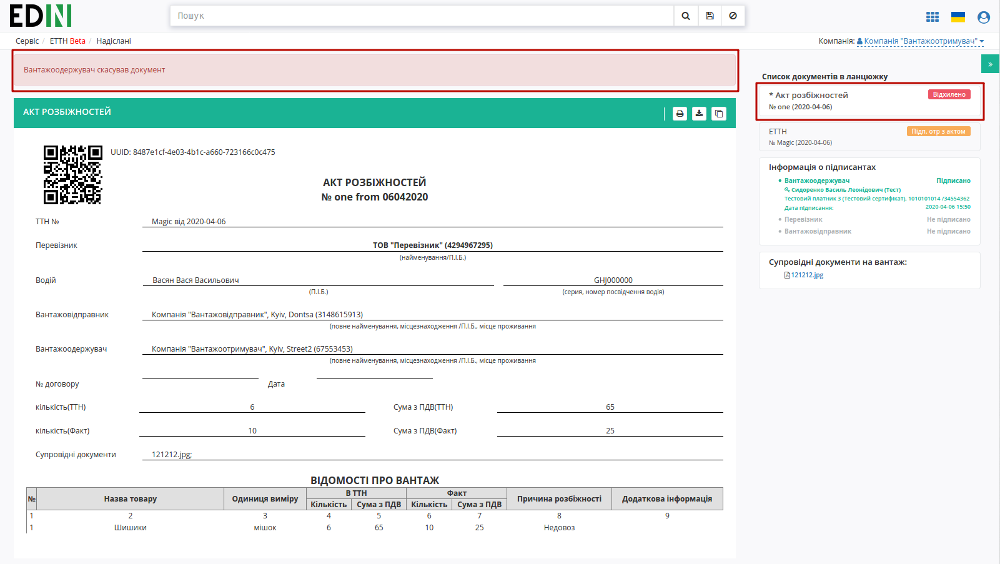

На платформі відображається повідомлення та змінюється статус документа в ланцюжку ("Відхилено"). Документообіг завершено.

**2 Отримання "Акта розбіжностей" "Перевізником"**
=================================================================================================================

Відправлений з боку **"Вантажоотримувача"** "Акт розбіжностей" відображається в папці "Вхідні".

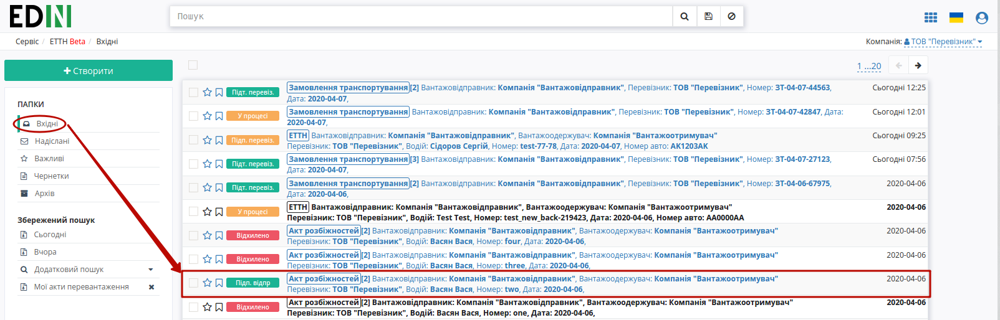

Вхідний підписаний документ можливо "Підтвердити" та "Підписати" чи "Відхилити".

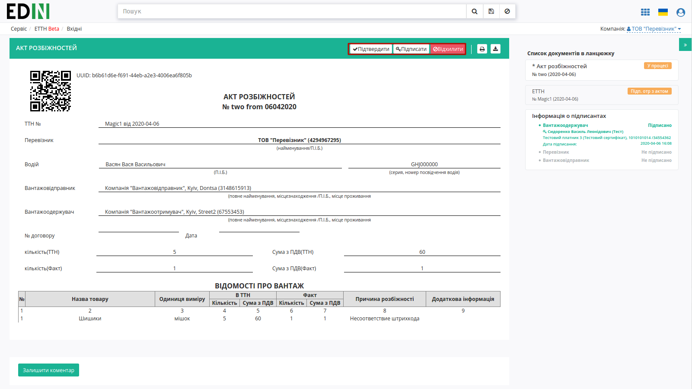

**2.1 Підтвердження / Підписання "Акта розбіжностей" "Перевізником"**
===================================================================================================================

.. important::
    В залежності від внутрішньої схеми **"Перевізника"** документ перед "Підписанням" може бути "Підтверджений" водієм, (кнопка **"Підтвердити"**) і відповідно цей документ у вхідних змінить свій статус на "Підтверджений", підказка в документі:

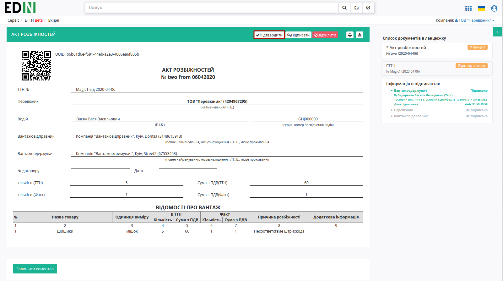

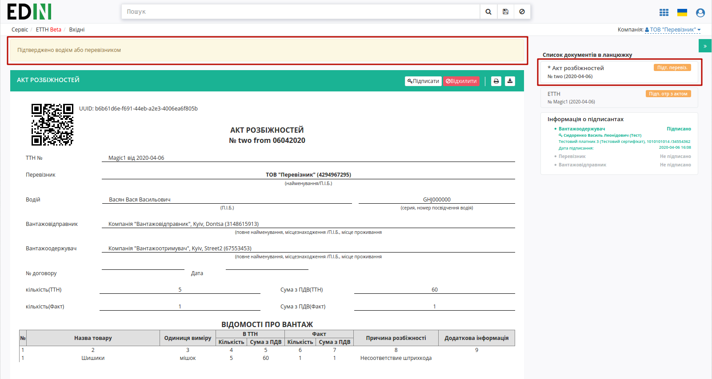

Для підписання документу потрібно натиснути на кнопку **"Підписати"**:

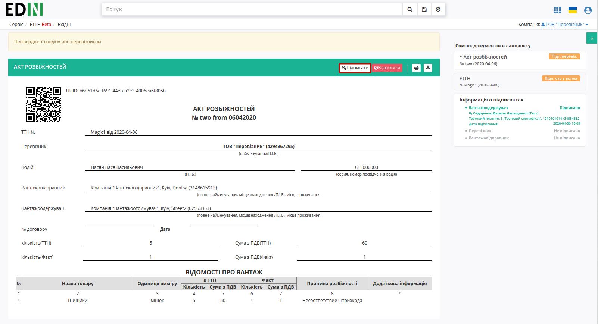

.. hint::
    Процес підписання не відрізняється від підписання **"Вантажоотримувачем"** та описаний в `розділі вище <https://wiki.edi-n.com/uk/latest/ETTN_2_0/Create_discrepancy_act.html#sign>`__ .

Після підписання документ змінить свій статус на "Підписано перевізником", а в інформації про підписантів відобразиться інформація про підписання:

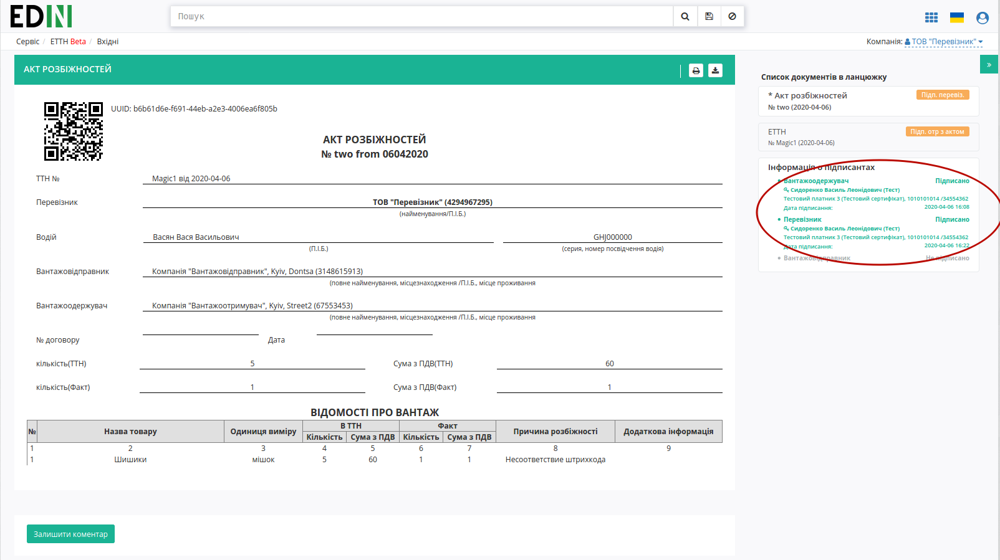

Після підписання документу "Відхилити" його неможливо.

**2.2 Відхилення "Акта розбіжностей" "Перевізником"**
==============================================================================

Для того, щоб відхилити документ потрібно натиснути **"Відхилити"**. 

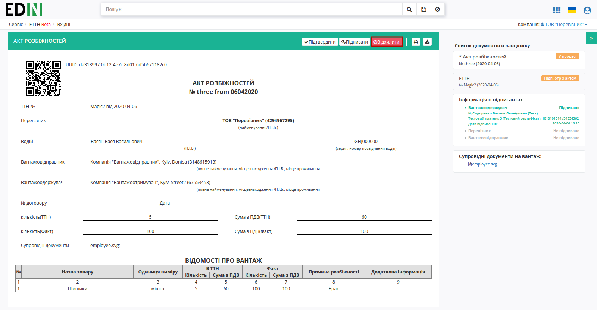

Після чого в модульному вікні обов'язково потрібно заповнити причину відміни документа:

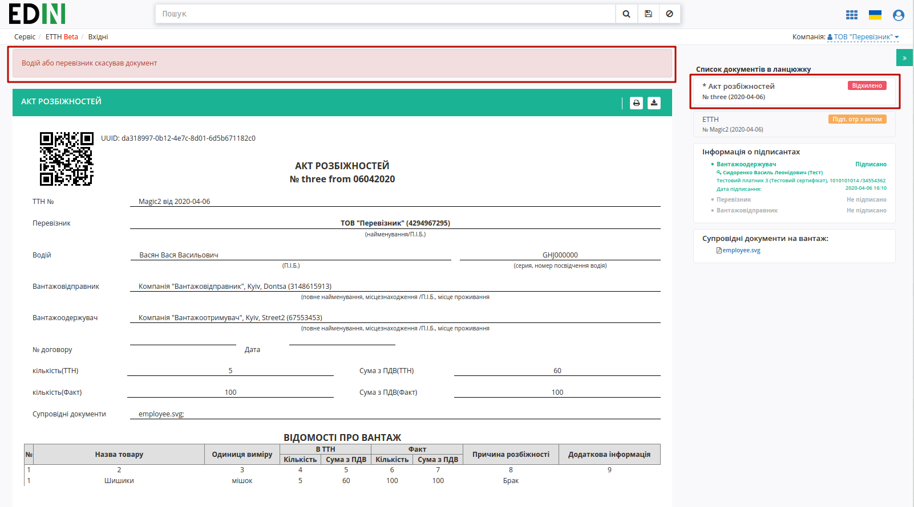

На платформі відображається повідомлення та змінюється статус документа в ланцюжку ("Відхилено"). Документообіг завершено.

**3 Отримання "Акта розбіжностей" "Вантажовідправником"**
=================================================================================================================

Відправлений та підписаний "Акт розбіжностей" у **"Вантажовідправника"** відображається в папці "Надіслані".

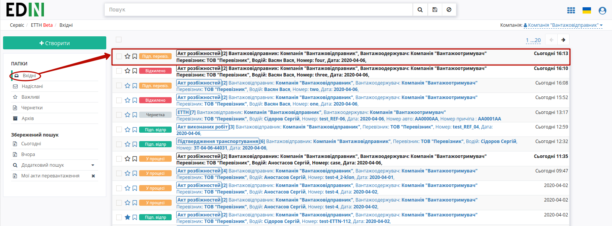

Вхідний підписаний документ можливо "Підтвердити" та "Підписати" чи "Відхилити".

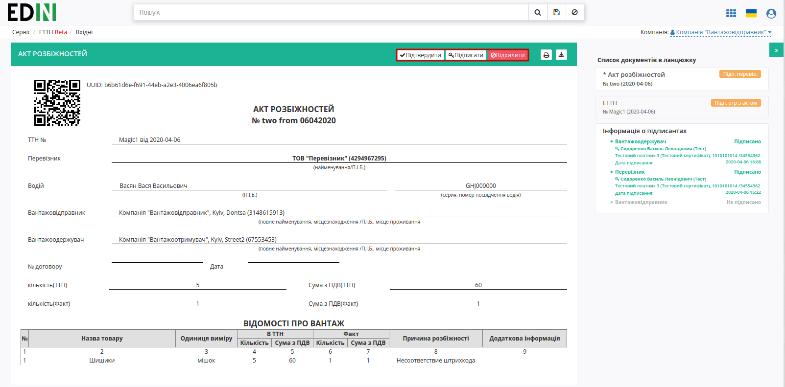

**3.1 Підтвердження / Підписання "Акта розбіжностей" "Вантажовідправником"**
===================================================================================================================

.. important::
    В залежності від внутрішньої схеми **"Вантажовідправника"** документ перед "Підписанням" може бути "Підтверджений" вантажовідправником, (кнопка **"Підтвердити"**) і відповідно цей документ у вхідних змінить свій статус на "Підтверджений", підказка в документі:

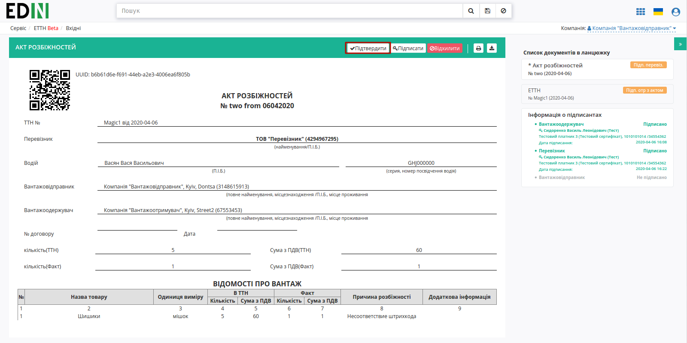

.. image:: pics_Create_discrepancy_act/Create_discrepancy_act_31.png
   :align: center

Для підписання документу потрібно натиснути на кнопку **"Підписати"**:

.. image:: pics_Create_discrepancy_act/Create_discrepancy_act_32.png
   :align: center

.. hint::
    Процес підписання не відрізняється від описаного раніше в `розділі вище <https://wiki.edi-n.com/uk/latest/ETTN_2_0/Create_discrepancy_act.html#sign>`__ .

Після підписання документ змінить свій статус на "Підписано вантажовідправником", а в інформації про підписантів відобразиться інформація про підписання:

.. image:: pics_Create_discrepancy_act/Create_discrepancy_act_33.png
   :align: center

Відображається інформативна підказка про те, що документообіг завершено. При перегляді документу/-ів, на основі яких було створено "Акт розбіжностей" відображається посилання про прив'язаний акт.

**3.2 Відхилення "Акта розбіжностей" "Перевізником"**
=======================================================================================

Для того, щоб відхилити документ потрібно натиснути **"Відхилити"**.

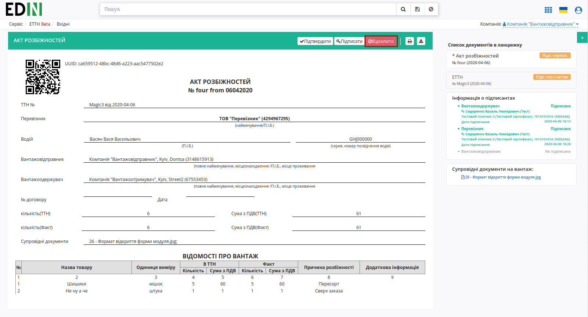

Після чого в модульному вікні обов'язково потрібно заповнити причину відміни документа:

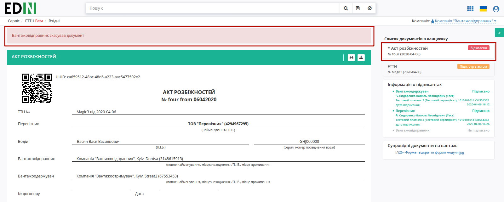

На платформі відображається повідомлення та змінюється статус документа в ланцюжку ("Відхилено"). Документообіг завершено.

.. include:: kontakti.rst