"Акт розбіжностей" на підставі "Акта приймання-передавання" (створення, підписання, відправлення та відхилення)
####################################################################################################################################

.. role:: red

.. role:: green

.. role:: underline

.. сюда закину немного картинок для текста

.. |фільтр| image:: pics_Create_discrepancy_act_new/Create_discrepancy_act_new_01.png

.. |drop_pass| image:: signing/drop_pass.png

.. |del_key| image:: signing/del_key2.png

.. :underline:`"Чернетки" для ролі "Організатор"`

.. contents:: Зміст:
   :depth: 6

---------

При формуванні "Акта розбіжностей" ініціатором документа виступає **"Вантажоотримувач"** (в сервісі ETTN передбачені 3 основні ролі учасників документообігу: **"Вантажовідправник"**, **"Перевізник"**, **"Вантажоотримувач"**). Обмін "Актом розбіжностей" здійснюється аналогічно до обміну "ЕТТН" тільки в зворотньому порядку.

.. attention::
    "Акт розбіжностей" створюється на основі підписаного документу "Акт приймання-передавання", що має статус "Очікує підписання виконавцем" (підписаний **"Вантажовідправником"**). Функціонал створення "Акта розбіжностей" стає доступним лише після підписання **"Перевізником"** пов'язаного документа еТТН (створений на основі вказаного раніше "Акта приймання-передавання"). Документ "еТТН" повинен бути в статусі "Очікує підписання вантажоодержувачем" (підписаний **"Перевізником"**).

.. note::
    В одному документі одна і та ж компанія не може виступати в якості "Перевізника", "Вантажовідправника" та "Вантажоотримувача"!!!  

Отже, схема документообігу "Акта розбіжностей" між компаніями має наступний вигляд:

:green:`"Вантажоотримувач" -> "Перевізник" -> "Вантажовідправник"`

.. important::
    Функціонал створення актів доступний для компанії з роллю **"Вантажоотримувача"**

**1 Створення "Акта розбіжностей" на підставі "Акта приймання-передавання" ("Вантажоотримувач")**
========================================================================================================

Для того аби створити "Акт розбіжностей" потрібно перейти до каталогу **"Вхідні"** та обрати підписаний **"Вантажовідправником"** документ "Акт приймання-передавання" (зі статусом "У процесі"):

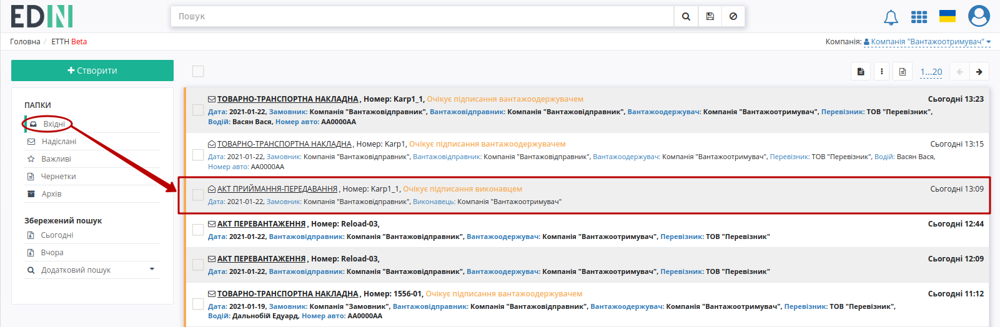

У вибраному документі "Акт приймання-передавання" потрібно натиснути на кнопку **"+Створити акт розбіжностей"**: 

.. image:: pics_Create_discrepancy_act_new/Create_discrepancy_act_new_37.png
   :align: center

При створенні документа "Акт розбіжностей" його форма частково автоматично заповнюється даними з "Акта приймання-передавання" та "еТТН" (обов'язково вказується номер та причина розбіжності): 

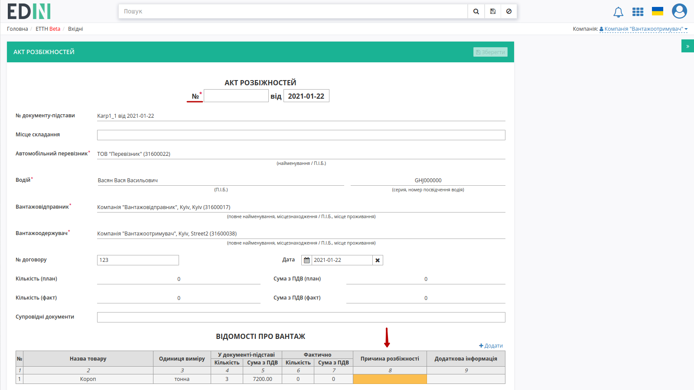

В створеній формі потрібно заповнити порожні поля - **"Змінити"** дані в табличній частині (їх також можливо **"Додати"**):

.. image:: pics_Create_discrepancy_act_new/Create_discrepancy_act_new_05.png
   :align: center

В модальному вікні "Відомостей про вантаж" можливо змінити всі дані і всі вони є обов'язковими до заповнення окрім "Додаткової інформації". Числові значення не можуть бути менші нуля.

.. image:: pics_Create_discrepancy_act_new/Create_discrepancy_act_new_06.png
   :align: center

Після того, як форма заповнена документ можливо **"Зберегти"** (документ зберігається, як чернетка):

.. image:: pics_Create_discrepancy_act_new/Create_discrepancy_act_new_07.png
   :align: center

Після збереження документу "Акт розбіжностей" відображаються посилання на "еТТН" та "Акт приймання-передавання", з'являється можливість додати супровідні метеріали через кнопку **"Додати файл"**. Для того щоб видалити доданий файл необхідно натиснути на іконку корзини.

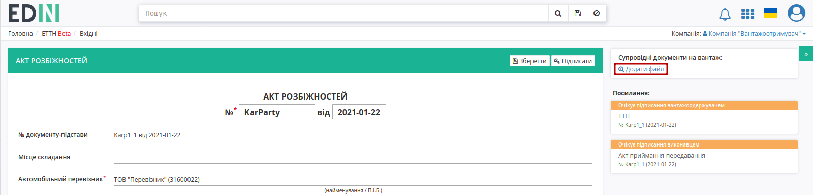

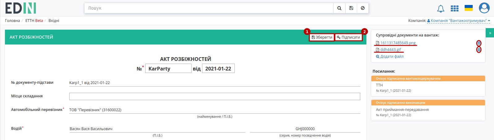

Після усіх проведених змін документ необхідно **"Зберегти"** (1) та **"Підписати"** (2).

.. _sign:

**1.1 Підписання та відправка "Акта розбіжностей" "Вантажоотримувачем"**
================================================================================================

.. include:: /_constant/atb_check/atb_check.rst
   :start-after: .. початок блоку для ATB_check
   :end-before: .. кінець блоку для ATB_check

.. tabs::

   .. tab:: Файловий ключ

      .. include:: /_constant/signing/signing.rst
         :start-after: .. початок блоку для Signing
         :end-before: .. кінець блоку для Signing

   .. tab:: Token

      .. include:: /_constant/token_signing/token_signing.rst
         :start-after: .. початок блоку для TokenSign
         :end-before: .. кінець блоку для TokenSign

   .. tab:: Гряда

      .. include:: /_constant/gryada_signing/gryada_signing.rst
         :start-after: .. початок блоку для GryadaSign
         :end-before: .. кінець блоку для GryadaSign

   .. tab:: Cloud

      .. include:: /_constant/cloud_signing/cloud_signing.rst
         :start-after: .. початок блоку для CloudSign
         :end-before: .. кінець блоку для CloudSign

Після підписання "Акту розбіжностей" інформація щодо підписанта відображається в блоці "Підписанти", а документ можливо **"Надіслати"**:

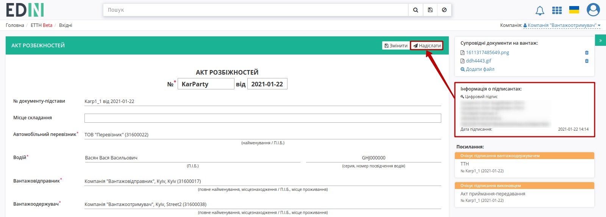

Після відправки документа контрагенту він відображається в журналі вихідних документів. Для відправленого **"Вантажоотримувачем"** "Акта розбіжностей" присвоюється статус "Очікує підписання водієм / перевізником":

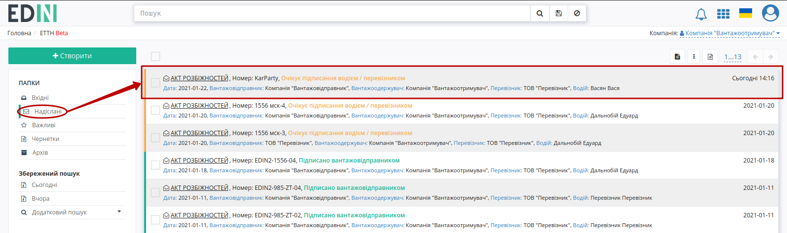

При цьому прив'язані документи (**"еТТН"** та **"Акт приймання-передавання"**) отримують помітку "створено Акт розбіжностей": 

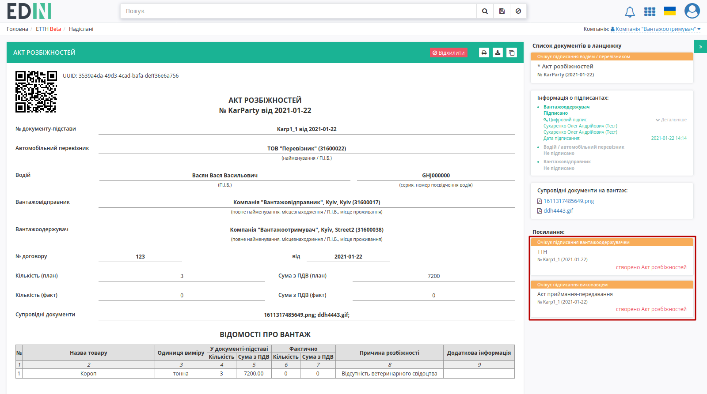

На формі "Акта розбіжностей" у лівій верхній частині відображаються QR-код та унікальний ідентифікатор документа.

Користувач може скористатись функціоналом для "Друку", "Завантаження" чи "Клонування"; також у разі виявлення помилки в документі є можливість відхилити відправлений "Акт розбіжностей" **до підтвердження/підписання Перевізником**. Для цього потрібно натиснути на кнопку "Відхилити".

**1.2 Відхилення "Акта розбіжностей" "Вантажоотримувачем"**
==============================================================================

Для того, щоб відхилити документ **"Вантажоотримувачу"** потрібно натиснути **"Відхилити"**. 

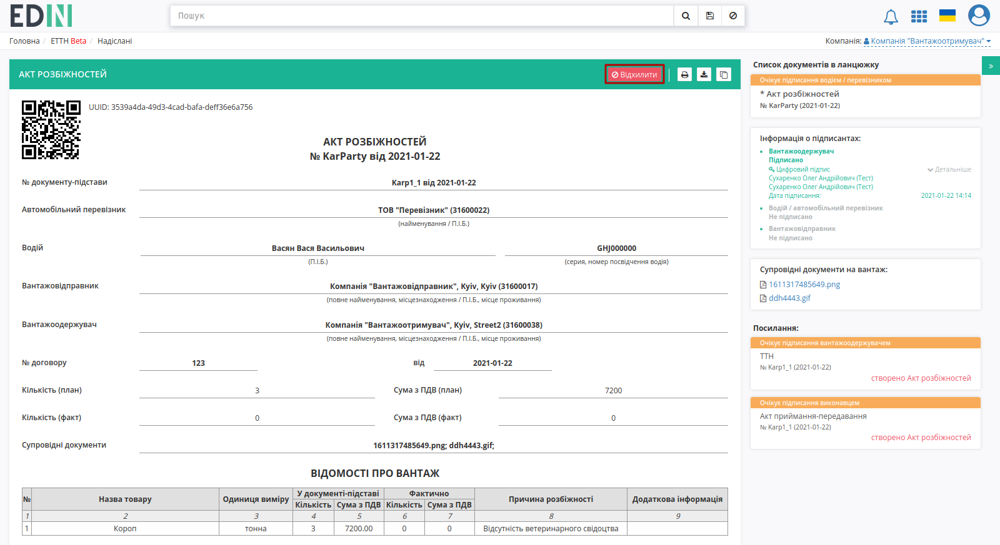

Після чого в модульному вікні обов'язково потрібно заповнити причину відміни документа:

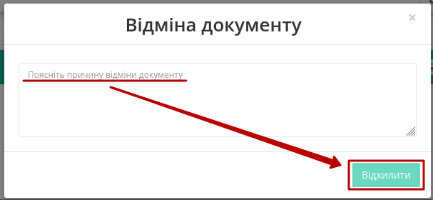

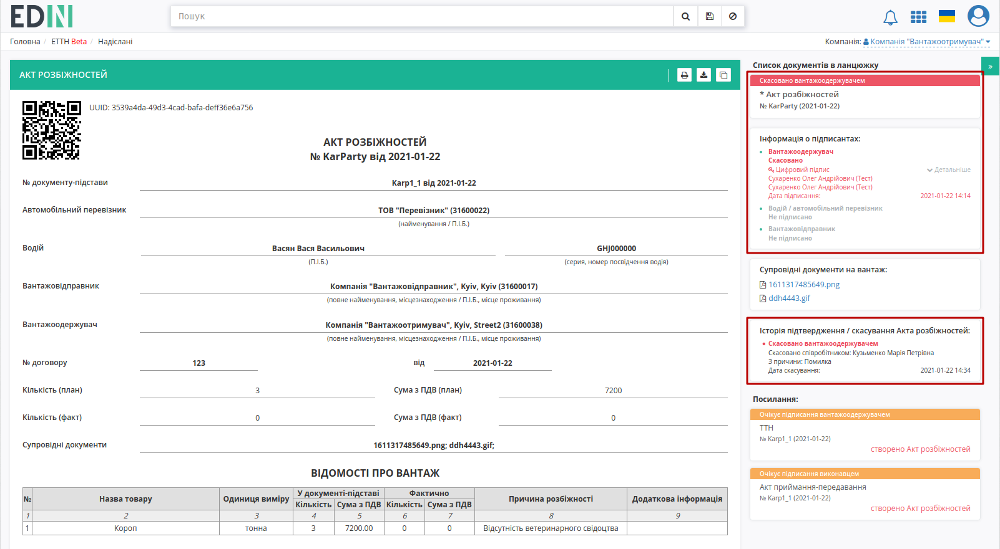

Документ змінює свій статус на "Скасовано вантажоодержувачем". Документообіг завершено.

**2 Отримання "Акта розбіжностей" "Перевізником"**
=================================================================================================================

Відправлений з боку **"Вантажоотримувача"** "Акт розбіжностей" відображається в папці "Вхідні".

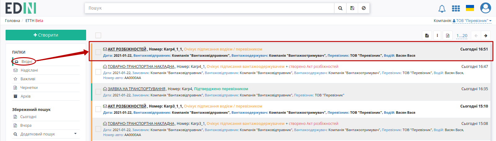

Вхідний підписаний документ можливо "Підтвердити" та "Підписати" чи "Відхилити".

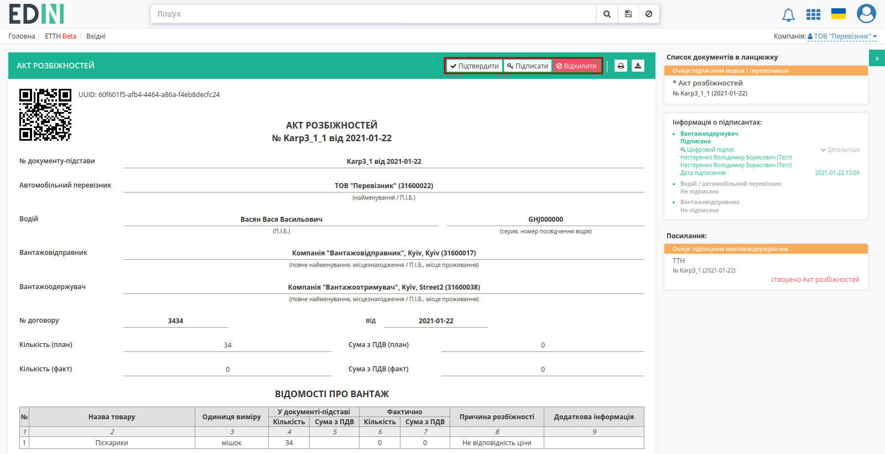

**2.1 Підтвердження / Підписання "Акта розбіжностей" "Перевізником"**
===================================================================================================================

.. important::
    В залежності від внутрішньої схеми **"Перевізника"** документ перед "Підписанням" може бути "Підтверджений" водієм, (кнопка **"Підтвердити"**):

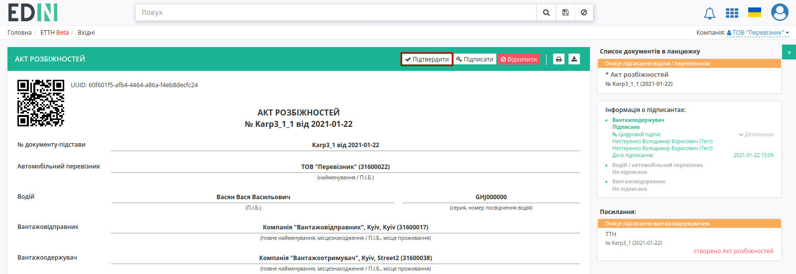

Після підтвердження документ у вхідних змінює свій статус на "Очікує підписання перевізником (підтверджено водієм)", в верхній частині вікна з'являється підказка, а також відображається запис в історії документа:

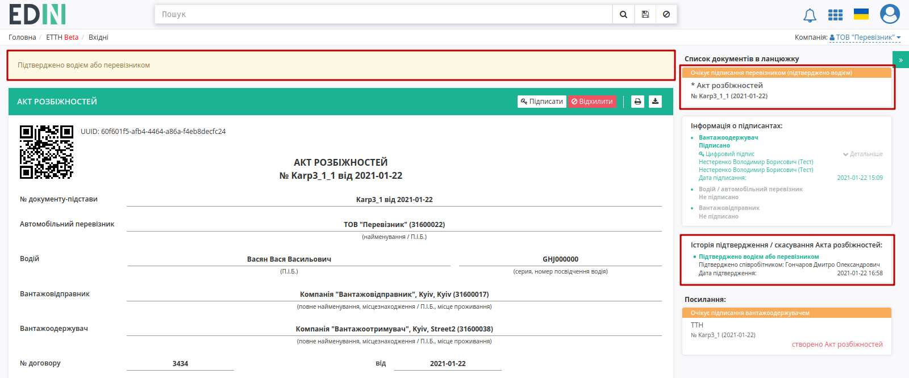

Для підписання документу потрібно натиснути на кнопку **"Підписати"**:

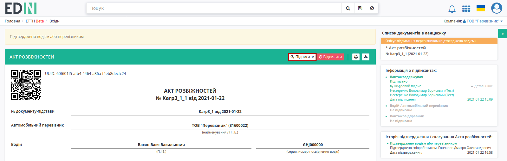

.. hint::
    Процес підписання не відрізняється від підписання **"Вантажоотримувачем"** та описаний в `розділі вище <https://wiki.edin.ua/uk/latest/ETTN_2_0/Create_discrepancy_act_new.html#sign>`__ .

Після підписання документ змінює свій статус на "Очікує підписання вантажовідправником", додається запис в інформацію про підписантів:

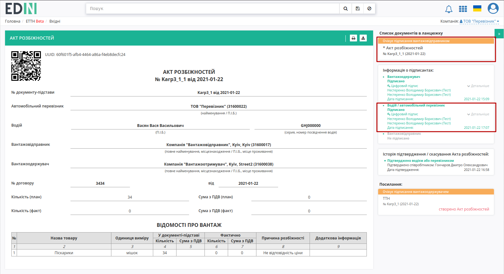

Після підписання документу "Відхилити" його неможливо.

**2.2 Відхилення "Акта розбіжностей" "Перевізником"**
==============================================================================

Для того, щоб відхилити документ потрібно натиснути **"Відхилити"**. 

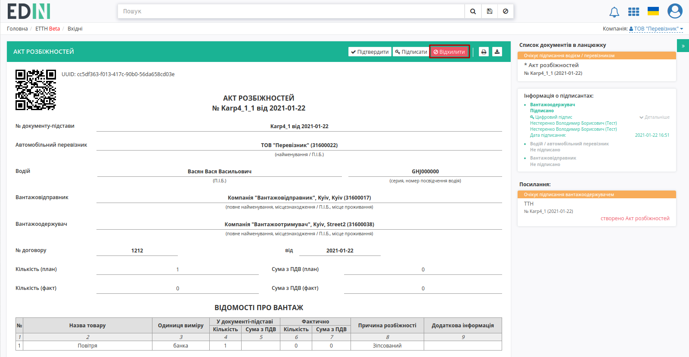

Після чого в модульному вікні обов'язково потрібно заповнити причину відміни документа:

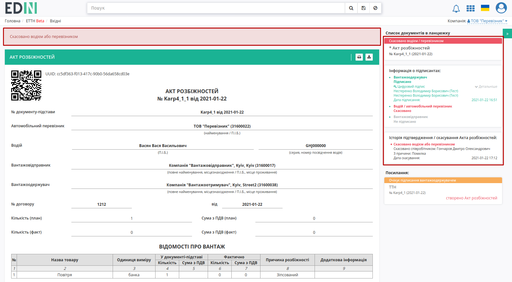

На платформі з'являється підказка про зміну статусу документа в ланцюжку на "Скасовано водієм / перевізником". В **"Інформації про підписантів"** та **"Історії змін статусів"** червоним кольором також відображаються відповідні помітки про відмову зі сторони **"Перевізника"**. Документообіг завершено.

**3 Отримання "Акта розбіжностей" "Вантажовідправником"**
=================================================================================================================

Відправлений та підписаний "Акт розбіжностей" у **"Вантажовідправника"** відображається в папці "Вхідні".

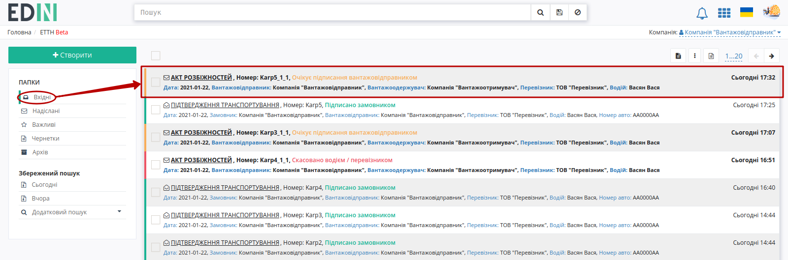

Вхідний підписаний документ можливо "Підписати" чи "Відхилити".

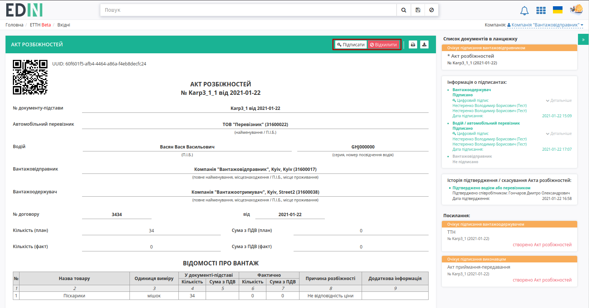

**3.1 Підписання "Акта розбіжностей" "Вантажовідправником"**
===================================================================================================================

Для підписання документу потрібно натиснути на кнопку **"Підписати"**:

.. hint::
    Процес підписання не відрізняється від описаного раніше в `розділі вище <https://wiki.edin.ua/uk/latest/ETTN_2_0/Create_discrepancy_act_new.html#sign>`__ .

Після підписання документ змінить свій статус на "Підписано вантажовідправником", додається запис в інформацію про підписантів:

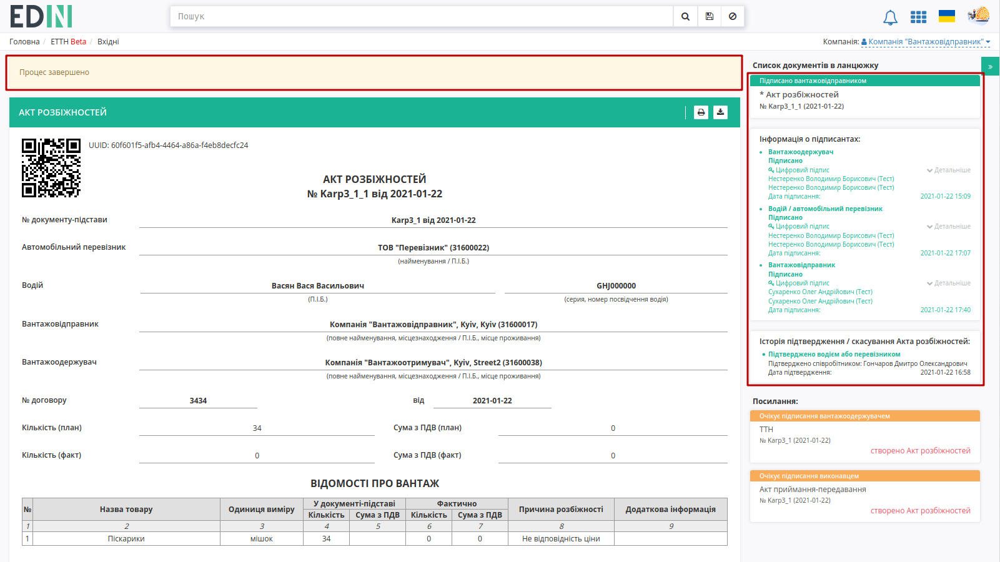

Відображається інформативна підказка про те, що документообіг завершено. При перегляді документу/-ів, на основі яких було створено "Акт розбіжностей" відображається посилання про прив'язаний акт.

**3.2 Відхилення "Акта розбіжностей" "Перевізником"**
=======================================================================================

Для того, щоб відхилити документ потрібно натиснути **"Відхилити"**.

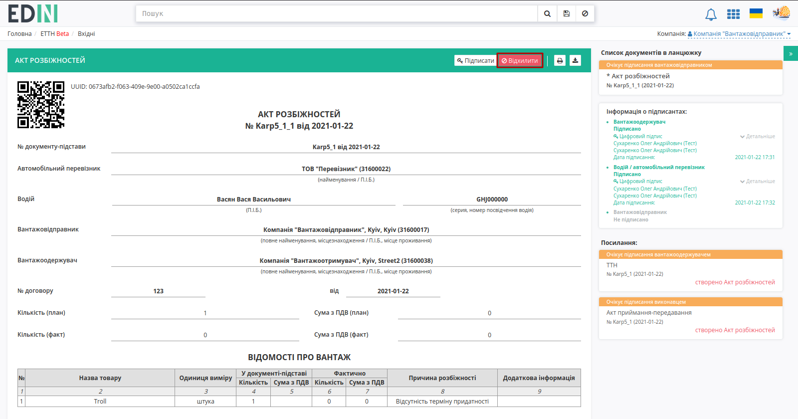

Після чого в модульному вікні обов'язково потрібно заповнити причину відміни документа:

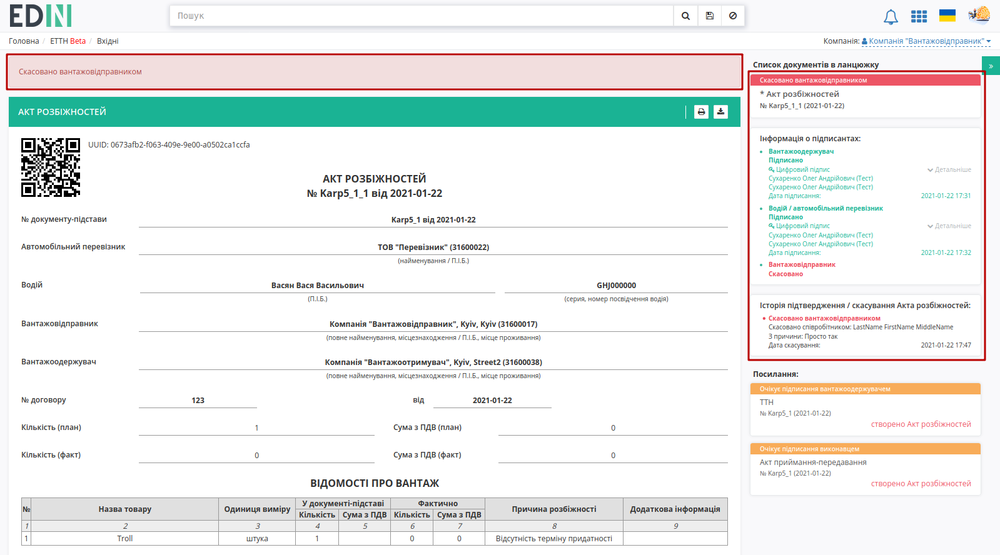

На платформі з'являється підказка про зміну статусу документа в ланцюжку на "Скасовано вантажовідправником". В **"Інформації про підписантів"** та **"Історії змін статусів"** червоним кольором також відображаються відповідні помітки про відмову зі сторони **"Вантажовідправника"**. Документообіг завершено.

--------------------------------------

.. include:: kontakti.rst
