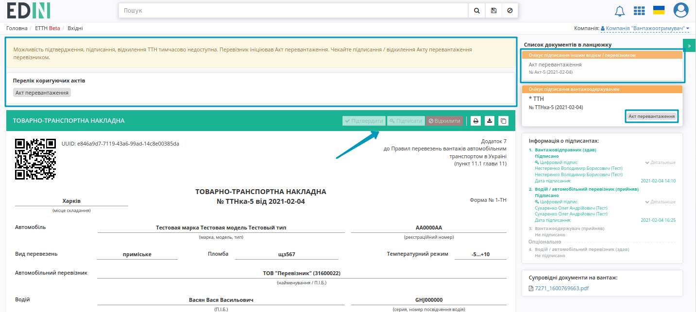

"Акт перевантаження" на підставі "е-ТТН" (створення, підписання, відправлення та відхилення)
####################################################################################################################################

.. role:: red

.. role:: green

.. role:: underline

.. сюда закину немного картинок для текста

.. |фільтр| image:: pics_Create_reload_act/Create_reload_act_01.png

.. |drop_pass| image:: signing/drop_pass.png

.. |del_key| image:: signing/del_key2.png

.. :underline:`"Чернетки" для ролі "Організатор"`

.. contents:: Зміст:
   :depth: 6

---------

Документообіг "Актом перевантаження" здійснюється між двома контагентами-Перевізниками. При формуванні "Акта перевантаження" ініціатором документа виступає **"Перевізник, що здає вантаж"**.

.. attention::
   "Акт перевантаження" створюється на основі підписаного документу "Товарно-транспортна накладна", що має статус "Очікує підписання вантажоодержувачем" (підписаний **"Перевізником"**).

**1 Створення "Акта перевантаження" на підставі "Товарно-транспортної накладної" ("Перевізник, що здає вантаж")**
====================================================================================================================

Для того аби створити "Акт перевантаження" потрібно перейти до каталогу **"Вхідні"** (1) та в розділі **"Додатковий пошук"** (2) скористатись |фільтр| фільтром **"Для акту перевантаження"** (3), що дозволяє відсортувати "Товарно-транспортні накладні", на підставі яких може бути створений відповідний акт.

В журналі з відібраними документами потрібно вибрати один зі списку та відкрити його. У відкритому документі натиснути кнопку :kbd:`+Створити Акт перевантаження`:

.. image:: pics_Create_reload_act/Create_reload_act_04.png
   :align: center

Далі відкриється форма "Акта перевантаження" з заповненими даними **"Перевізника, що здає вантаж"** (ініціатор) та частково заповненими полями **"Перевізника, що приймає вантаж"** (дані контрагентів підтягуються з е-ТТН, як документа-підстави): 

До редагування доступні лише поля **"Перевізника, що приймає вантаж"** (дані автомобіля, водія, пломби, додаткової інформації). Обов'язкові до заповнення поля позначені червоною зірочкою :red:`*`.

Заповнений документ потрібно :kbd:`Зберегти` (зберігається в якості чернетки):

Після всіх подальших змін в "Акті перевантаження" його можливо, за необхідності, повторно :kbd:`Зберегти` (1) та :kbd:`Підписати` (2):

.. _sign:

**1.1 Підписання та відправка "Акта перевантаження" "Перевізником, що здає вантаж"**
-------------------------------------------------------------------------------------------------

.. include:: /_constant/atb_check/atb_check.rst
   :start-after: .. початок блоку для ATB_check
   :end-before: .. кінець блоку для ATB_check

.. tabs::

   .. tab:: Файловий ключ

      .. include:: /_constant/signing/signing.rst
         :start-after: .. початок блоку для Signing
         :end-before: .. кінець блоку для Signing

   .. tab:: Token

      .. include:: /_constant/token_signing/token_signing.rst
         :start-after: .. початок блоку для TokenSign
         :end-before: .. кінець блоку для TokenSign

   .. tab:: Гряда

      .. include:: /_constant/gryada_signing/gryada_signing.rst
         :start-after: .. початок блоку для GryadaSign
         :end-before: .. кінець блоку для GryadaSign

   .. tab:: Cloud

      .. include:: /_constant/cloud_signing/cloud_signing.rst
         :start-after: .. початок блоку для CloudSign
         :end-before: .. кінець блоку для CloudSign

Після підписання "Акта перевантаження" інформація щодо підписанта відображається в блоці "Підписанти", а документ можливо **"Надіслати"**:

Після відправки документа контрагенту він відображається в журналі вихідних документів (папка "Надіслані"). Для відправленого "Акта перевантаження" присвоюється статус "Очікує підписання іншим водієм / перевізником":

На формі "Акта перевантаження" у лівій верхній частині відображаються QR-код та унікальний ідентифікатор документа. Відправлений "Акт перевантаження" "Перевізник, що здає вантаж" може **"Відхилити"**, а контагенти прив'язаного документа "е-ТТН" отримують помітку і додаткове повідомлення про те, що дії з документом тимчасово обмежені:

**1.2 Відхилення "Акта перевантаження" "Перевізником, що здає вантаж"**
-------------------------------------------------------------------------------------------------

Для того, щоб відхилити документ **"Перевізнику, що здає вантаж"** потрібно натиснути **"Відхилити"**. 

Після чого в модульному вікні обов'язково потрібно заповнити причину відміни документа:

Документ змінює свій статус на "Скасовано водієм / перевізником-ініціатором", в історії відображаються додаткові дані. Документообіг завершено. Після відхилення "Акта перевантаження" функціонал по роботі з "е-ТТН" знову стає доступним:

**2 Отримання "Акта перевантаження" "Перевізником, що приймає вантаж"**
=================================================================================================================

Вхідний підписаний "Акт перевантаження" можливо :kbd:`Підписати` чи **"Відхилити"**:

**2.1 Підписання "Акта перевантаження" "Перевізником, що приймає вантаж"**
-------------------------------------------------------------------------------------------------

Підписання здійснюється за допомогою кнопки :kbd:`Підписати`:

Після чого до документу можливо додати особливі відмітки і підтвердити підписання (кнопка :kbd:`Підписати`): 

.. hint::
   Процес підписання не відрізняється від підписання описаного в `розділі вище <https://wiki.edin.ua/uk/latest/ETTN_2_0/Create_reload_act.html#sign>`__ .

Після підписання документ змінює свій статус на "Підписано іншим водієм / перевізником", додається запис в інформацію про підписантів:

Після підписання документу "Відхилити" його неможливо. Після двостороннього підписання "Акта перевантаження" функціонал по роботі з "е-ТТН" знову стає доступним, можливо за потреби :kbd:`Показати зміни в ТТН`:

.. image:: pics_Create_reload_act/Create_reload_act_20.png
   :align: center

**2.2 Відхилення "Акта перевантаження" "Перевізником, що приймає вантаж"**
-------------------------------------------------------------------------------------------------

Для того, щоб відхилити документ потрібно натиснути **"Відхилити"**. 

Після чого в модульному вікні обов'язково потрібно заповнити причину відміни документа:

Документ змінює свій статус на "Скасовано іншим водієм / перевізником", в історії відображаються додаткові дані. Документообіг завершено. Після відхилення "Акта перевантаження" функціонал по роботі з "е-ТТН" знову стає доступним:

--------------------------------------

.. include:: kontakti.rst
