"Акт про заміну пункту призначення вантажу" на підставі "е-ТТН" (створення, підписання, відправлення та відхилення)
####################################################################################################################################

.. role:: red

.. role:: green

.. role:: underline

.. сюда закину немного картинок для текста

.. |drop_pass| image:: signing/drop_pass.png

.. |del_key| image:: signing/del_key2.png

.. :underline:`"Чернетки" для ролі "Організатор"`

.. contents:: Зміст:
   :depth: 6

---------

В разі зміни пункту призначення вантажу і / або Вантажоодержувача, є можливість створити і зберегти "Акт про заміну пункту призначення вантажу", щоб зафіксувати в ньому цей факт.

В сервісі ETTN передбачені 3 основні ролі учасників документообігу: **"Вантажовідправник"**, **"Перевізник"**, **"Вантажоодержувач"**. Один з цих контрагентів також виступає в якості **"Замовника"**. Документообіг "Актом про заміну пункту призначення вантажу" здійснюється між двома або трьома контагентами в залежності від ролі Ініціатора. 

.. _logic:

Схема і послідовність підписання документа "Акт про заміну пункту призначення вантажу" в залежності від ролі Ініціатора:

1. "Вантажовідправник" **=>** :green:`"Вантажовідправник" -> "Перевізник" -> "Замовник"` (3 підписанти)

1.1. "Вантажовідправник"="Замовник" **=>** :green:`"Вантажовідправник" -> "Перевізник"` (2 підписанти)

2. "Вантажоодержувач" **=>** :green:`"Вантажоодержувач" -> "Перевізник" -> "Замовник"` (3 підписанти)

2.1. "Вантажоодержувач"="Замовник" **=>** :green:`"Вантажоодержувач" -> "Перевізник"` (2 підписанти)

3. "Перевізник" **=>** :green:`"Перевізник" -> "Замовник"` (2 підписанти)

4. "Замовник" **=>** :green:`"Замовник" -> "Перевізник"` (2 підписанти)

.. attention::
   "Акт про заміну пункту призначення вантажу" створюється на основі підписаного документу "Товарно-транспортна накладна", що має статус "Очікує підписання вантажоодержувачем" (підписаний **"Перевізником"**).

Розглянемо, для прикладу, формування "Акта про заміну пункту призначення вантажу" в випадку з трьома підписантами.

**1 Створення "Акта про заміну пункту призначення вантажу" на підставі "Товарно-транспортної накладної" Ініціатором (Вантажовідправник/Вантажоодержувач/Перевізник/Замовник)**
====================================================================================================================

Для того аби створити "Акт про заміну пункту призначення вантажу" потрібно перейти до каталога **"Вхідні"** (**"Надіслані"** в випадку Ініціатора-Вантажовідправника) та перейти в "Товарно-транспортну накладну" до якої може бути створений коригуючий акт ("е-ТТН" в статусі "Очікує підписання вантажоодержувачем"):

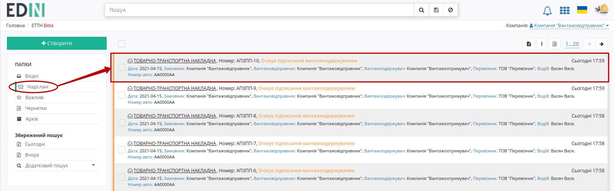

В журналі з відібраними документами потрібно вибрати один зі списку та відкрити його. У відкритому документі натиснути кнопку **"+Створити коригуючий акт"** -> **"Акт про заміну пункту призначення"**:

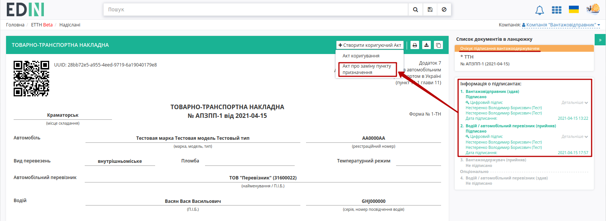

Далі відкриється форма "Акта про заміну пункту призначення вантажу" з частково заповненими полями (дані підтягуються з "е-ТТН", як документа-підстави): 

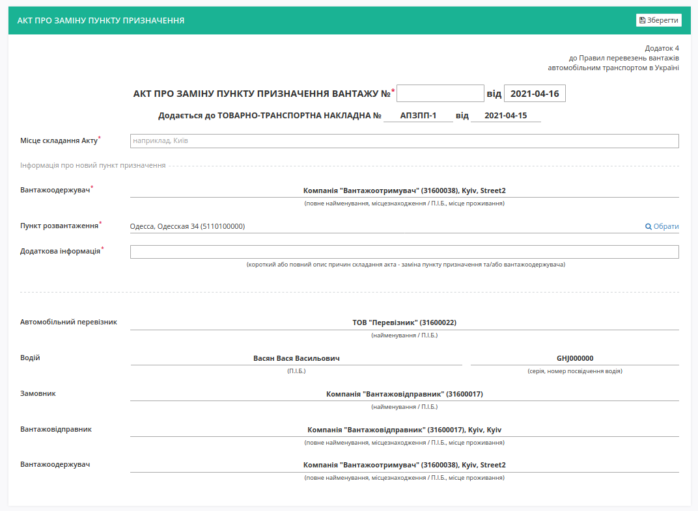

Обов'язкові до заповнення поля позначені червоною зірочкою :red:`*`. В блоці "Інформація про новий пункт призначення" можливо замінити (через кнопку **"Обрати"**) Пункт призначення, вказаного в "е-ТТН" Вантажоодержувача, і обов'язково потрібно вказати додаткову інформацію: 

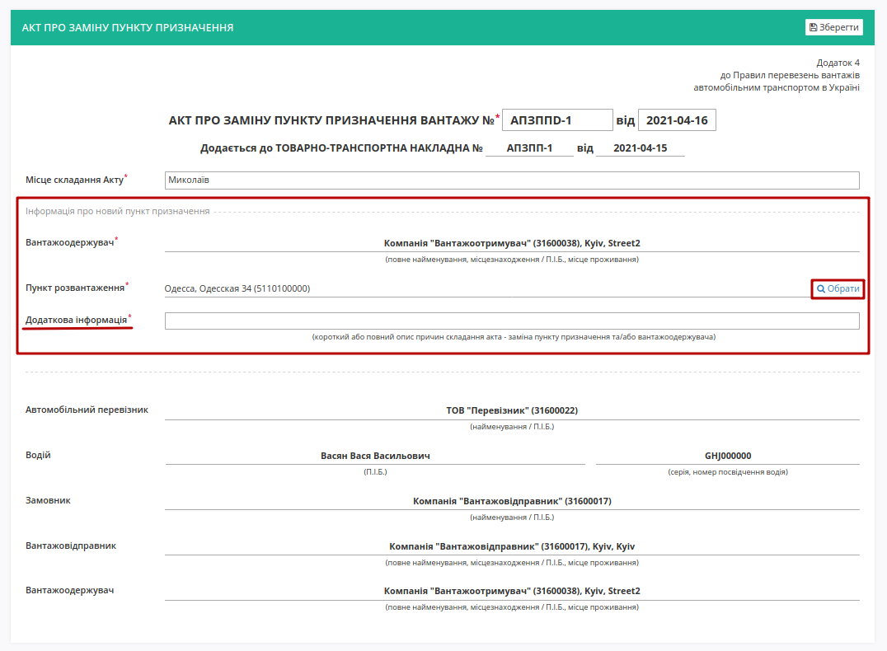

.. note::
   Якщо адреси у вказаному списку немає, то її можливо додати вручну через кнопку **"Нова адреса"** [1]_:

   .. image:: pics_Create_warehouse_change/Create_warehouse_change_031.png
      :align: center

   Після чого в модальному вікні потрібно буде **"Додати"** адресу, населений пункт (достатньо почати вводити назву населеного пункту та обрати його зі списку) - при цьому код `КАТОТТГ <https://www.minregion.gov.ua/napryamki-diyalnosti/rozvytok-mistsevoho-samovryaduvannya/administratyvno/kodyfikator-administratyvno-terytorialnyh-odynycz-ta-terytorij-terytorialnyh-gromad/>`__ вказується автоматично. Додана адреса розвантаження прив'язується в системі до вказаного **"Вантажоодержувача"**.

   .. берем гіфку з ттн інструкції

   .. image:: pics_Creation_signing_ending_rejection_ETTN_shipper/Creation_signing_ending_rejection_ETTN_shipper_99.gif
      :align: center

Заповнений документ потрібно **"Зберегти"** (зберігається в якості чернетки):

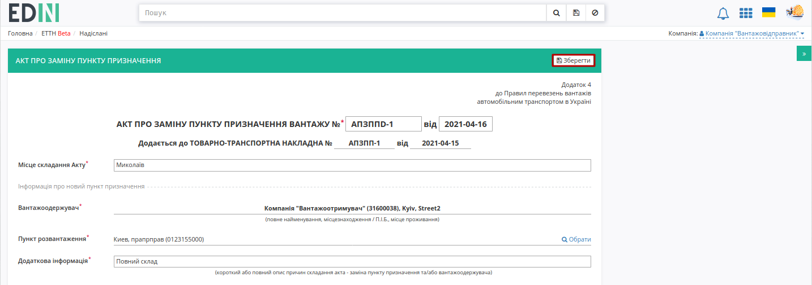

Після всіх подальших змін в "Акті про заміну пункту призначення вантажу" його можливо, за необхідності, повторно **"Зберегти"** (1) та **"Підписати"** (2):

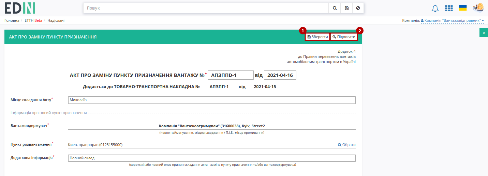

.. _sign:

**1.1 Підписання та відправка "Акта про заміну пункту призначення вантажу" Ініціатором (Вантажовідправник/Вантажоодержувач/Перевізник/Замовник)**
-------------------------------------------------------------------------------------------------------------------------------------------------------------------------------------

.. include:: /_constant/atb_check/atb_check.rst
   :start-after: .. початок блоку для ATB_check
   :end-before: .. кінець блоку для ATB_check

.. tabs::

   .. tab:: Файловий ключ

      .. include:: /_constant/signing/signing.rst
         :start-after: .. початок блоку для Signing
         :end-before: .. кінець блоку для Signing

   .. tab:: Token

      .. include:: /_constant/token_signing/token_signing.rst
         :start-after: .. початок блоку для TokenSign
         :end-before: .. кінець блоку для TokenSign

   .. tab:: Гряда

      .. include:: /_constant/gryada_signing/gryada_signing.rst
         :start-after: .. початок блоку для GryadaSign
         :end-before: .. кінець блоку для GryadaSign

   .. tab:: Cloud

      .. include:: /_constant/cloud_signing/cloud_signing.rst
         :start-after: .. початок блоку для CloudSign
         :end-before: .. кінець блоку для CloudSign

Після підписання "Акта про заміну пункту призначення вантажу" інформація щодо підписанта відображається в блоці "Підписанти", а документ можливо **"Надіслати"**:

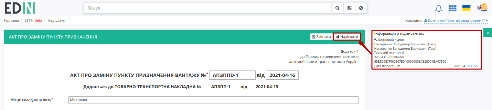

Після відправки документа контрагенту він відображається в журналі вихідних документів (папка "Надіслані"). Для відправленого "Акта про заміну пункту призначення вантажу" присвоюється статус:

* для ініціатора "Вантажовідправника" **=>** **"Очікує підписання водієм / перевізником"**
* для ініціатора "Вантажоодержувача" **=>** **"Очікує підписання водієм / перевізником"**
* для ініціатора "Перевізника" **=>** **"Очікує підписання замовником"**
* для ініціатора "Замовника" **=>** **"Очікує підписання водієм / перевізником"**

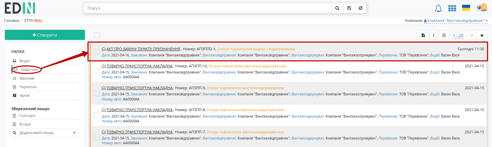

На формі "Акта про заміну пункту призначення вантажу" у лівій верхній частині відображаються QR-код та унікальний ідентифікатор документа. Відправлений "Акт про заміну пункту призначення вантажу" Ініціатор може **"Відхилити"**, а контагенти прив'язаного документа "е-ТТН" отримують помітку і додаткове повідомлення про те, що дії з документом тимчасово обмежені:

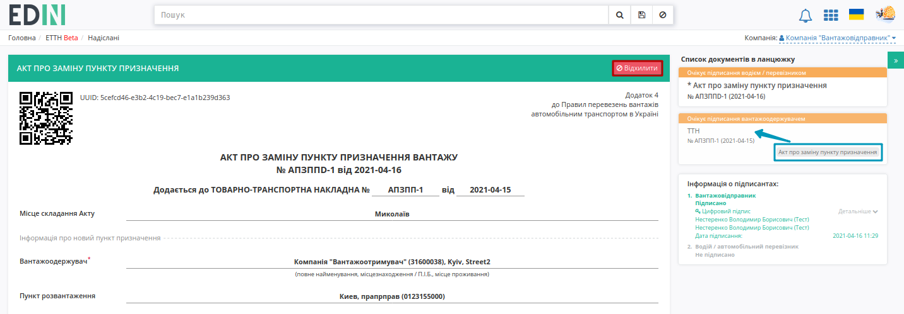

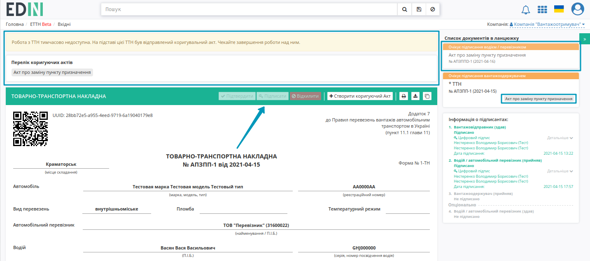

**1.2 Відхилення "Акта про заміну пункту призначення вантажу" Ініціатором (Вантажовідправник/Вантажоодержувач/Перевізник/Замовник)**
-----------------------------------------------------------------------------------------------------------------------------------------------------------------------

Для того, щоб відхилити документ Ініціатору потрібно натиснути кнопку **"Відхилити"**. 

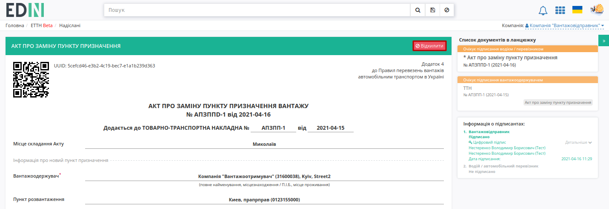

Після чого в модульному вікні обов'язково потрібно заповнити причину відміни документа:

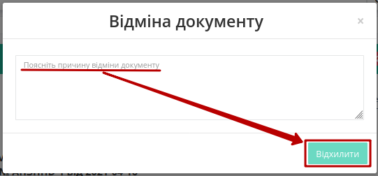

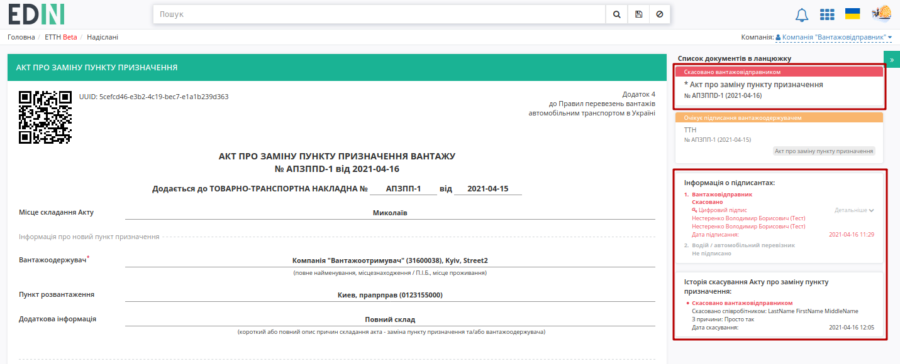

Документ змінює свій статус на:

* для ініціатора "Вантажовідправника" **=>** **"Скасовано вантажовідправником"**
* для ініціатора "Вантажоодержувача" **=>** **"Скасовано вантажоодержувачем"**
* для ініціатора "Перевізника" **=>** **"Скасовано водієм / перевізником"**
* для ініціатора "Замовника" **=>** **"Скасовано замовником"**

В історії відображаються додаткові дані. Документообіг завершено. Після відхилення "Акта про заміну пункту призначення вантажу" функціонал по роботі з "е-ТТН" знову стає доступним:

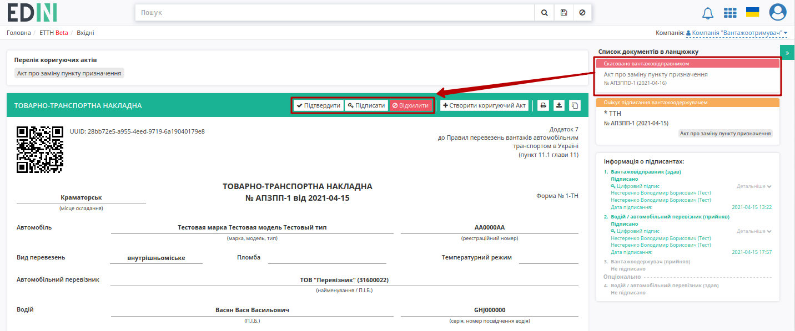

**2 Отримання "Акта про заміну пункту призначення вантажу" Перевізником чи Замовником**
=================================================================================================================

Вхідний підписаний "Акт про заміну пункту призначення вантажу" можливо **"Підписати** чи **"Відхилити"**:

**2.1 Підписання "Акта про заміну пункту призначення вантажу" Перевізником чи Замовником**
-------------------------------------------------------------------------------------------------

Підписання здійснюється за допомогою кнопки **"Підписати**:

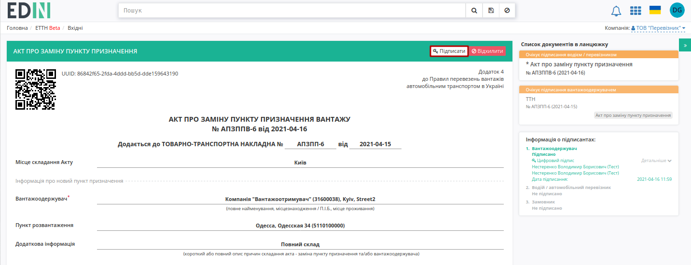

Після чого до документу можливо додати особливі відмітки і підтвердити підписання (кнопка **"Підписати**): 

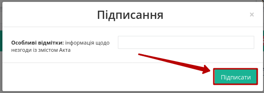

.. hint::
   Процес підписання не відрізняється від підписання описаного в `розділі вище <https://wiki.edin.ua/uk/latest/ETTN_2_0/Create_warehouse_change.html#sign>`__ .

Після підписання документ змінює свій статус на **"Підписано водієм / перевізником"** або **"Очікує підписання замовником"**, якщо `схема <https://wiki.edin.ua/uk/latest/ETTN_2_0/Create_warehouse_change.html#logic>`__ передбачає трьох підписантів.

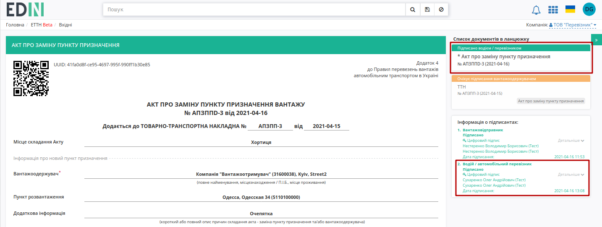

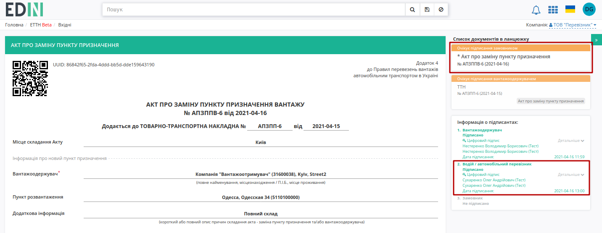

Після підписання документу "Відхилити" його неможливо. Після двостороннього підписання "Акта про заміну пункту призначення вантажу" в схемах з двома підписантами функціонал по роботі з "е-ТТН" знову стає доступним, можливо за потреби **"Показати зміни в ТТН"** (зміни виділяються жовтим кольором):

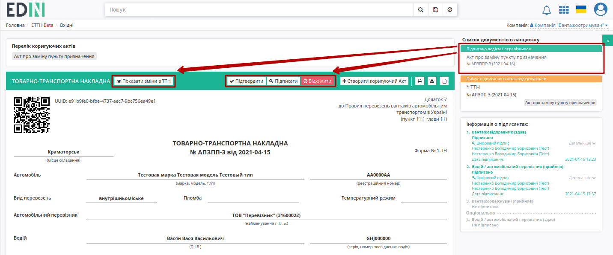

**2.2 Відхилення "Акта про заміну пункту призначення вантажу" Перевізником чи Замовником**
-------------------------------------------------------------------------------------------------

Для того, щоб відхилити документ потрібно натиснути **"Відхилити"**. 

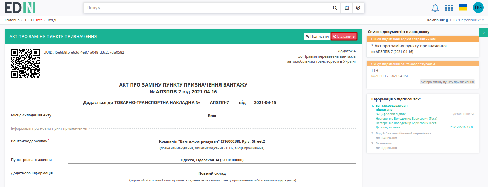

Після чого в модульному вікні обов'язково потрібно заповнити причину відміни документа:

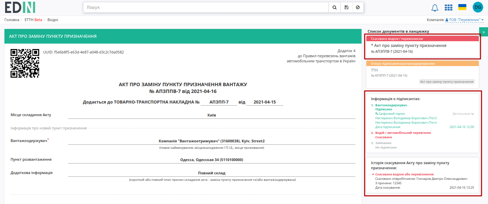

Документ змінює свій статус на **"Скасовано водієм / перевізником"** чи **"Скасовано замовником"** в залежності від ролі контрагента. В історії відображаються додаткові дані. Документообіг завершено. Після відхилення "Акта про заміну пункту призначення вантажу" функціонал по роботі з "е-ТТН" знову стає доступним:

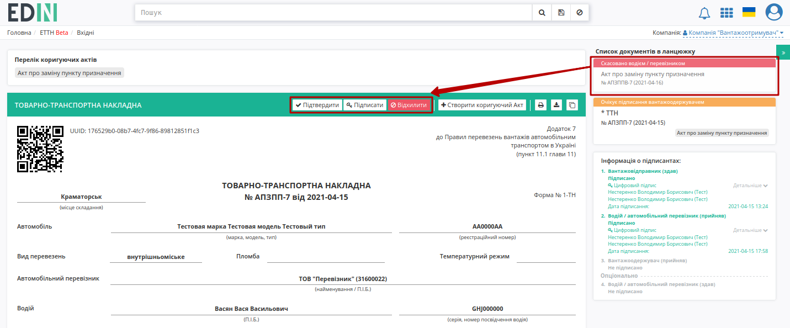

**3 Отримання "Акта про заміну пункту призначення вантажу" Замовником**
=================================================================================================================

.. note::
   Для схем в яких документ підписується двома учасниками цей пункт відсутній.

Вхідний підписаний "Акт про заміну пункту призначення вантажу" можливо **"Підписати** чи **"Відхилити"**:

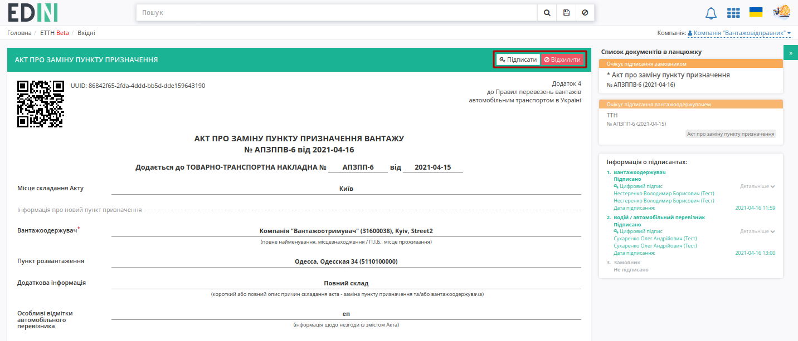

**3.1 Підписання "Акта про заміну пункту призначення вантажу" Замовником**
-------------------------------------------------------------------------------------------------

Підписання здійснюється за допомогою кнопки **"Підписати**:

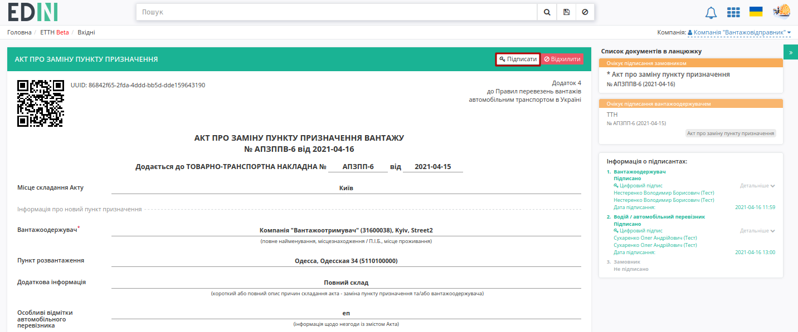

Після чого до документу можливо додати особливі відмітки і підтвердити підписання (кнопка **"Підписати**): 

.. hint::
   Процес підписання не відрізняється від підписання описаного в `розділі вище <https://wiki.edin.ua/uk/latest/ETTN_2_0/Create_warehouse_change.html#sign>`__ .

Після підписання документ змінює свій статус на **"Підписано замовником"**, додається запис в інформацію про підписантів:

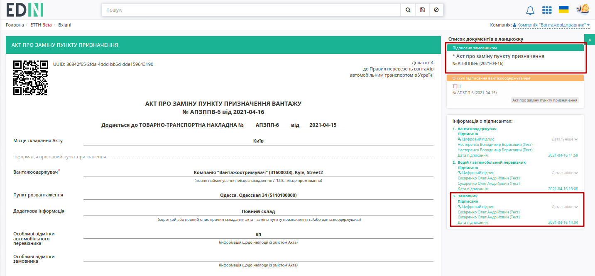

Після підписання документу "Відхилити" його неможливо. Після трьохстороннього підписання "Акта про заміну пункту призначення вантажу" функціонал по роботі з "е-ТТН" знову стає доступним, можливо за потреби **"Показати зміни в ТТН"** (зміни виділяються жовтим кольором):

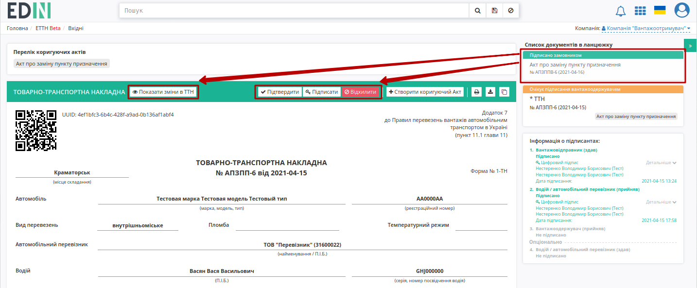

**3.2 Відхилення "Акта про заміну пункту призначення вантажу" Перевізником чи Замовником**
-------------------------------------------------------------------------------------------------

Для того, щоб відхилити документ потрібно натиснути **"Відхилити"**. 

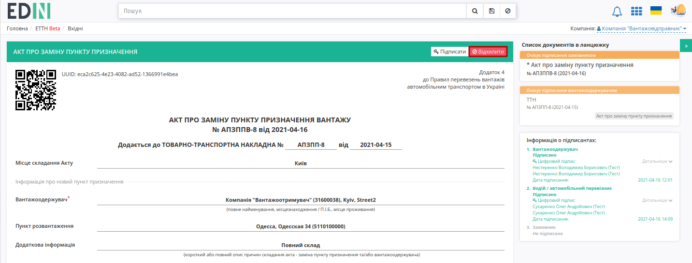

Після чого в модульному вікні обов'язково потрібно заповнити причину відміни документа:

.. image:: pics_Create_warehouse_change/Create_warehouse_change_029.png
   :align: center

Документ змінює свій статус на **"Скасовано замовником"**, в історії відображаються додаткові дані. Документообіг завершено. Після відхилення "Акта про заміну пункту призначення вантажу" функціонал по роботі з "е-ТТН" знову стає доступним:

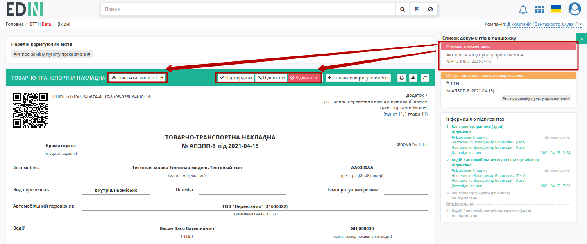

---------------------------------

.. [#] **Заборонити створення пункту розвантаження** - додаткові налаштування "Вантажоодержувача", що можуть бути виконані при зверненні через службу підтримки. Якщо ці налаштуванні активовані, то при створенні "е-ТТН" / "Акта про заміну пункту призначення вантажу" за допомогою WEB чи API ініціатор документа неспроможний додати новий пункт розвантаження. Відповідальність за коректність заповнення даних довідника лежить на "Вантажоодержувачу".

---------------------------------

.. include:: /_constant/kontakti.rst
