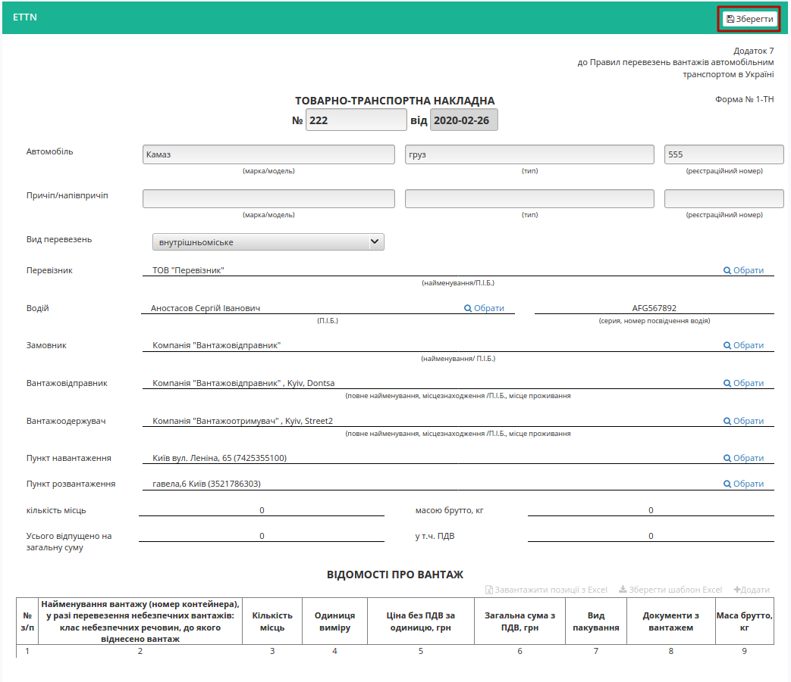
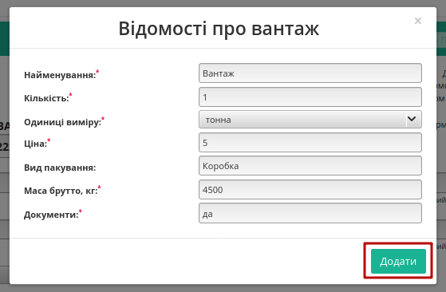
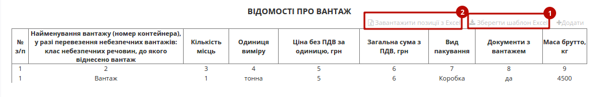
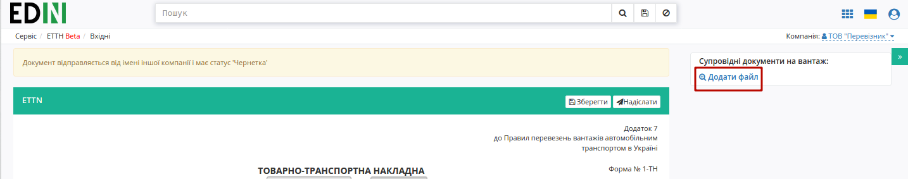
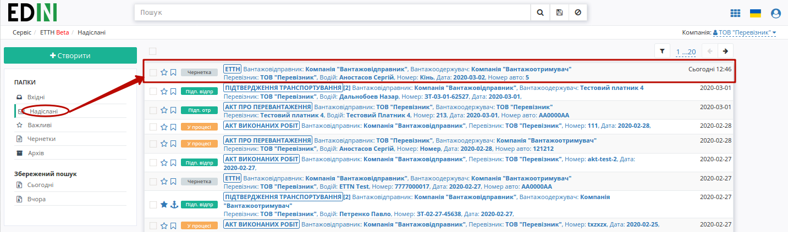
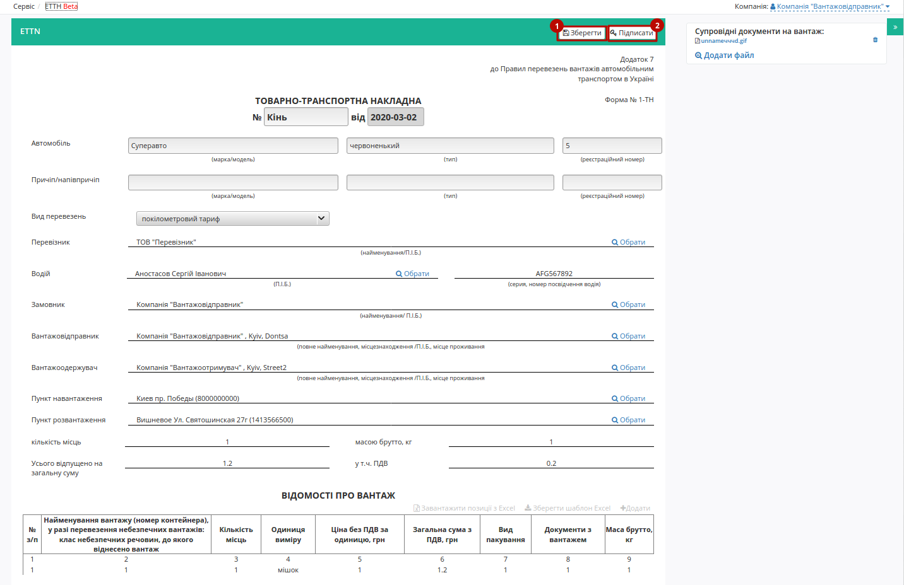

Створення та відправлення е-ТТН перевізником та вантажоотримувачем
###################################################################################################

.. role:: red

.. role:: underline

.. contents:: Зміст:
   :depth: 6

---------

Існують схеми документообігу, в яких ініціатором виступає не **"Вантажовідправник"**, а **"Перевізник"** чи **"Вантажоотримувач"**. В такому випадку ініціатор створює та відправляє документ-чернетку, яку не потрібно підписувати. 

**Створення чернетки документа**
================================================

Для створення е-ТТН на платформі користувачем з роллю **"Перевізник"** чи **"Вантажоотримувач"** необхідно натиснути на кнопку "Створити":

.. image:: pics_Creation_sending_ETTN_carrier_consignee/Creation_sending_ETTN_carrier_consignee_01.png
   :align: center

Після цього необхідно вибрати тип створюваного документа в модальному вікні:

.. image:: pics_Creation_sending_ETTN_carrier_consignee/Creation_sending_ETTN_carrier_consignee_02.png
   :align: center

Далі необхідно заповнити форму е-ТТН (кнопка "Зберегти" активується лише для заповненої форми):

* Номер та дату (за замовчуванням вказується поточна дата);
* Марку/модель, тип, реєстраційний номер автомобілю;
* Марку/модель, тип, реєстраційний номер причіпу/напівпричіпу (необов’язково);
* Вид перевезень (покілометровий тариф, погодинний тариф, відрядний тариф, централізоване перевезення, внутрішньоміське, приміське, міжміське, міжнародне перевезення);
* Перевізник – необхідно обрати з випадаючого списку (для цього в рядку необхідно ввести мінімум 3 символи найменування/П.І.Б. перевізника, після цього обрати його з випадаючого списку);
* Водій (рядок стає активним тільки після вибору перевізника) – необхідно поставити курсор в рядок та обрати його з випадаючого списку;
* Серія, номер посвідчення водія буде додано автоматично після вибору водія (заповнюється в форматі "3 латинські літери + 6 цифр", наприклад "DGJ123456");
* Вантажовідправник – необхідно обрати з випадаючого списку (для цього в рядку необхідно ввести мінімум 3 символи найменування/П.І.Б. вантажовідправника, після цього обрати його з випадаючого списку), місцезнаходження/місце проживання буде додано автоматично;
* Вантажоодержувач – необхідно обрати з випадаючого списку (для цього в рядку необхідно ввести мінімум 3 символи найменування/П.І.Б. вантажоодержувача, після цього обрати його з випадаючого списку), місцезнаходження/місце проживання буде додано автоматично;
* Пункт навантаження – необхідно поставити курсор в рядок та обрати його з випадаючого списку;
* Пункт розвантаження – необхідно поставити курсор в рядок та обрати його з випадаючого списку;
* Натиснути на кнопку "Додати" для заповненя вартісно-кількісних показників та табличної частини.

.. image:: pics_Creation_sending_ETTN_carrier_consignee/Creation_sending_ETTN_carrier_consignee_04.png
   :align: center

Після натискання на кнопку "Додати" відкриється модальне вікно, де необхідно заповнити рядки (найменування вантажу, кількість місць, одиниця виміру, ціна без ПДВ, вид пакування (необов’язково), маса брутто, кількість або назва документів з вантажем) та натиснути на кнопку "Додати".

Також для додавання табличних даних (вантаж) є можливість скористатись шаблоном. Для цього над таблицею необхідно натиснути **"Зберегти шаблон Excel"** (1).

На Ваш комп’ютер буде завантажено файл з назвою **ettn_products_sample.xlsx**. Відкривши його, необхідно внести інформацію про вантаж.

Обов’язкові для заповнення поля (поля відмічені червоним кольором):

* Найменування
* Кількість
* Одиниці виміру
* Ціна
* Маса брутто, кг
* Документи

.. important:: Ні в якому разі не змінювати формат шаблону, не видаляти або додавати нові стовпці. Також не допускається зміна формату комірок.

Після збереження заповненої інформації завантажуємо файл на веб-портал, скориставшись кнопкою **"Завантажити позиції з Excel"** (2).

За необхідністю є можливість додавати ще вантаж(і), для цього необхідно натиснути на кнопку **"Додати"** та заповнити інформацію в модальному вікні.

Для редагування інформації щодо вантажу необхідно навести курсор на рядок цього вантажу та натиснути "Змінити", для видалення – "Видалити".

.. image:: pics_Creation_sending_ETTN_carrier_consignee/Creation_sending_ETTN_carrier_consignee_07.png
   :align: center

.. tip:: Для повторного вибору перевізника, водія, вантажовідправника, вантажоодержувача, пунктів навантаження/розвантаження необхідно натиснути на кнопку "Обрати".

Для збереження е-ТТН необхідно натиснути кнопку **"Зберегти"**, документ потрапить у папку **"Чернетки"**.

.. hint:: Над створеним документом відображається інформативна підказка:

.. image:: pics_Creation_sending_ETTN_carrier_consignee/Creation_sending_ETTN_carrier_consignee_08.png
   :align: center

За необхідністю є можливість додати супровідні документи на вантаж. Для цього необхідно натиснути на кнопку "Додати файл" (назва файлу повина бути унікальною).

Для того щоб видалити доданий файл необхідно натиснути на іконку корзини. Для того щоб зберегти доданий файл необхідно натиснути на його назву.

.. image:: pics_Creation_sending_ETTN_carrier_consignee/Creation_sending_ETTN_carrier_consignee_10.png
   :align: center

Після останнього редагування документу його потрібно **"Зберегти"** (1) та **"Надіслати"** (2) без підписання.  

Після відправки документа контрагенту він відображається в журналі вихідних документів. Для відправленної **"Перевізником"** чи **"Вантажоотримувачем"** е-ТТН присвоюється статус "Чернетка":

Далі згідно `оберненої схеми <https://wiki.edi-n.com/uk/latest/ETTN_2_0/Work_with_ETTN.html#reverse-schema>`__ документообігу контрагент з роллю **"Вантажовідправник"** отримує документ-чернетку:

.. image:: pics_Creation_sending_ETTN_carrier_consignee/Creation_sending_ETTN_carrier_consignee_12.png
   :align: center

Для ролі **"Вантажовідправника"** вхідний документ-чернетка відображається з інформативною підказкою і дозволяє **"Створити"** на основі вхідної чернетки документ, що потребує підписання:

.. image:: pics_Creation_sending_ETTN_carrier_consignee/Creation_sending_ETTN_carrier_consignee_13.png
   :align: center

В створений такий чином документ копіюється вся інформація та вкладення з чернетки. Документ може бути відредагований, після чого його потрібно **"Зберегти"** (1) та **"Підписати"** (2) (детальніше про підписання в `інструкції для вантажовідправника <https://wiki.edi-n.com/uk/latest/ETTN_2_0/Creation_signing_ending_rejection_ETTN_shipper.html>`__ ).

Особливостю такого документообігу є те, що в ланцюжку документів присутня чернетка, як документ-ініціатор документообігу:

.. image:: pics_Creation_sending_ETTN_carrier_consignee/Creation_sending_ETTN_carrier_consignee_15.png
   :align: center

.. include:: kontakti.rst
