Створення, підписання, відправлення та відхилення е-ТТН вантажовідправником
###################################################################################################

.. role:: red

.. role:: underline

.. сюда закину немного картинок для текста

.. |мусорка| image:: pics_Creation_signing_ending_rejection_ETTN_shipper/Creation_signing_ending_rejection_ETTN_shipper_44.png

.. contents:: Зміст:
   :depth: 6

---------

**Створення документа**
================================================

.. important::
    Ініціатор документообігу повинен бути присутнім серед учасників документообігу! 

Для створення е-ТТН на платформі необхідно натиснути на кнопку "Створити".

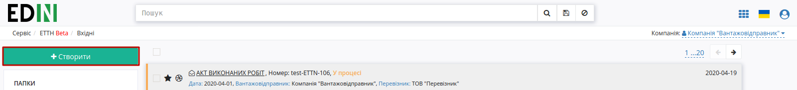

Після цього необхідно вибрати тип створюваного документа в модальному вікні:

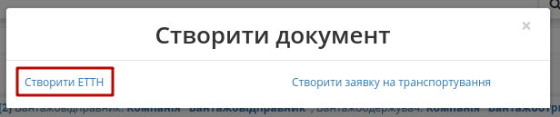

Далі необхідно заповнити форму е-ТТН (кнопка "Зберегти" активується лише для заповненої форми):

.. image:: pics_Creation_signing_ending_rejection_ETTN_shipper/Creation_signing_ending_rejection_ETTN_shipper_03n.png
   :align: center

Для автомобілів та причепів реалізований автоматичний довідник, в який записуються "Реєстраційний номер", "Марка/модель", "Тип". Тож, наприклад, для раніше введеного реєстрайійного номеру BB1234BB користувач може скористатись пошуком (мінімум 3 символи): ``BB1, B12, 123, 234, 34B, 4BB``

.. image:: pics_Creation_signing_ending_rejection_ETTN_shipper/Creation_signing_ending_rejection_ETTN_shipper_42.png
   :align: center

.. important::
    Вибір організацій-контрагентів, водія, адрес навантаження/розвантаження доступні з випадаючого списку або при ручному додаванні! Якщо контрагенти були введені вручну (поки не зареєстровані на платформі EDIN), то при збереженні документа відобразиться попередження, наприклад, для **Вантажоотримувача**:

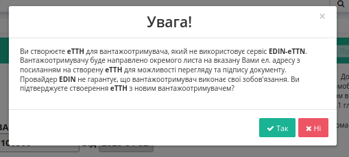

* **Номер та дату** (за замовчуванням вказується поточна дата);
* **Марку/модель, тип, реєстраційний номер автомобілю**;
* **Марку/модель, тип, реєстраційний номер причіпу/напівпричіпу** (необов’язково);
* **Вид перевезень** (покілометровий тариф, погодинний тариф, відрядний тариф, централізоване перевезення, внутрішньоміське, приміське, міжміське, міжнародне перевезення);
* **Автомобільний перевізник** – необхідно обрати з випадаючого списку (для цього в рядку необхідно ввести мінімум 3 символи найменування/П.І.Б. перевізника, після цього обрати його з випадаючого списку);

Якщо **Перевізник** відсутній на платформі EDIN, то його можливо додати через кнопку **"Новий перевізник"**:

.. image:: pics_Creation_signing_ending_rejection_ETTN_shipper/Creation_signing_ending_rejection_ETTN_shipper_36new.png
   :align: center

Відкриється модальне вікно, в якому потрібно буде заповнити основні обов'язкові дані майбутного контрагента (**Назву, Тип, ЄДРПОУ, ІПН, Місто, Адресу** організації та співробітника) та натиснути **"Додати"**:

.. image:: pics_Creation_signing_ending_rejection_ETTN_shipper/Creation_signing_ending_rejection_ETTN_shipper_37new.png
   :align: center

При корректному заповненні даних (унікальні email, ЄДРПОУ) на вказаний email буде відправлено запрошення з унікальним посиланням для подальшої реєстрації на платформі EDIN:

.. image:: pics_Creation_signing_ending_rejection_ETTN_shipper/Creation_signing_ending_rejection_ETTN_shipper_38new.png
   :align: center

* **Водій** (рядок стає активним тільки після вибору перевізника) – необхідно поставити курсор в рядок та обрати його з випадаючого списку;

Якщо водій відсутній в списку його можливо додати через кнопку **"Новий водій"**:

.. image:: pics_Creation_signing_ending_rejection_ETTN_shipper/Creation_signing_ending_rejection_ETTN_shipper_25n.png
   :align: center

Після чого в модальному вікні потрібно буде заповнити дані про водія ("Серія, номер посвідчення водія" заповнюється в форматі "3 заголовні латинські літери + 6 цифр", наприклад "DGJ123456"). Обов'язкові поля позначені червоною зірочкою :red:`*` . Доданий водій прив'язується в системі до вказаного **"Перевізника"**.

.. image:: pics_Creation_signing_ending_rejection_ETTN_shipper/Creation_signing_ending_rejection_ETTN_shipper_26new.png
   :align: center

* **Серія, номер посвідчення водія** буде додано автоматично після вибору водія;
* **Вантажовідправник** – необхідно обрати з випадаючого списку (для цього в рядку необхідно ввести мінімум 3 символи найменування/П.І.Б. вантажовідправника, після цього обрати його з випадаючого списку), місцезнаходження/місце проживання буде додано автоматично;
* **Вантажоодержувач** – необхідно обрати з випадаючого списку (для цього в рядку необхідно ввести мінімум 3 символи найменування/П.І.Б. вантажоодержувача, після цього обрати його з випадаючого списку), місцезнаходження/місце проживання буде додано автоматично;

Якщо **Вантажоодержувач** відсутній на платформі EDIN, то його можливо додати через кнопку **"Новий вантажоодержувач"**:

.. image:: pics_Creation_signing_ending_rejection_ETTN_shipper/Creation_signing_ending_rejection_ETTN_shipper_40new.png
   :align: center

Відкриється модальне вікно, в якому потрібно буде заповнити основні обов'язкові дані майбутного контрагента (**Назву, Тип, ЄДРПОУ, ІПН, Місто, Адресу** організації та співробітника) та натиснути **"Додати"**:

.. image:: pics_Creation_signing_ending_rejection_ETTN_shipper/Creation_signing_ending_rejection_ETTN_shipper_41new.png
   :align: center

При корректному заповненні даних (унікальні email, ЄДРПОУ) на вказаний email буде відправлено запрошення з унікальним посиланням для подальшої реєстрації на платформі EDIN:

.. image:: pics_Creation_signing_ending_rejection_ETTN_shipper/Creation_signing_ending_rejection_ETTN_shipper_38new.png
   :align: center

* **Пункт навантаження** – необхідно поставити курсор в рядок та обрати його з випадаючого списку;
* **Пункт розвантаження** – необхідно поставити курсор в рядок та обрати його з випадаючого списку;

Якщо адреси у вказаному списку немає, то її можливо додати вручну через кнопку **"Нова адреса"**:

.. image:: pics_Creation_signing_ending_rejection_ETTN_shipper/Creation_signing_ending_rejection_ETTN_shipper_27n.png
   :align: center

Після чого в модальному вікні потрібно буде додати населений пункт, адресу та вибрати КОАТУУ (в цьому рядку можливо здійснювати пошук по назві чи коду). Код КОАТУУ вказується автоматично. Додана адреса навантаження прив'язується в системі до вказаного **"Вантажовідправника"**, а адреса розвантаження - до **"Вантажоодержувача"**.

.. image:: pics_Creation_signing_ending_rejection_ETTN_shipper/Creation_signing_ending_rejection_ETTN_shipper_28n.png
   :align: center

.. image:: pics_Creation_signing_ending_rejection_ETTN_shipper/Creation_signing_ending_rejection_ETTN_shipper_29n.png
   :align: center

**Заповнення табличної частини**
---------------------------------------

Заповнити вартісно-кількісні показники табличної частини можливо кількома способами: 

**1) Вручну**
~~~~~~~~~~~~~~~~~~~~~~~~~~~~~~~~~~~~~~~~~~~~~~~~~~~~~~

Потрібно натиснути на кнопку "Додати":

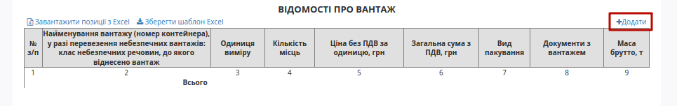

Після натискання на кнопку "Додати" відкриється модальне вікно, де необхідно заповнити рядки (найменування вантажу, кількість місць, одиниця виміру, ціна без ПДВ за одиницю, вид пакування (необов’язково), маса брутто, документи з вантажем) та натиснути на кнопку "Додати".

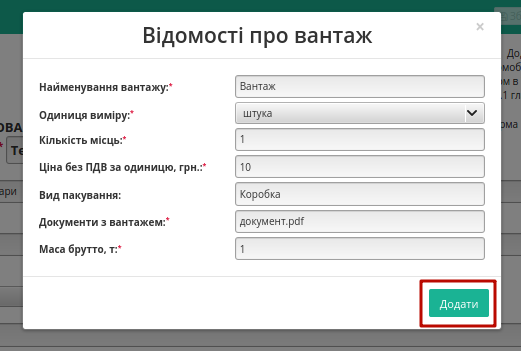

**2) Шаблоном** 
~~~~~~~~~~~~~~~~~~~~~~~~~~~~~~~~~~~~~~~~~~~~~~~~~~~~~~

Також для додавання табличних даних (вантаж) є можливість скористатись шаблоном. Для цього над таблицею необхідно натиснути **"Зберегти шаблон Excel"** (1).

.. image:: pics_Creation_signing_ending_rejection_ETTN_shipper/Creation_signing_ending_rejection_ETTN_shipper_06new.png
   :align: center

На Ваш комп’ютер буде завантажено файл з назвою **ettn_products_sample.xlsx**. Відкривши його, необхідно внести інформацію про вантаж.

Обов’язкові для заповнення поля (поля відмічені жовтим кольором):

* Найменування вантажу
* Одиниці виміру
* Кількість місць
* Ціна без ПДВ за одиницю, грн.
* Документи з вантажем
* Маса брутто, т

.. important:: Ні в якому разі не змінювати формат шаблону, не видаляти або додавати нові стовпці. Також не допускається зміна формату комірок.

Після збереження заповненої інформації завантажуємо файл на веб-портал, скориставшись кнопкою **"Завантажити позиції з Excel"** (2).

За необхідністю є можливість додавати ще вантаж(і), для цього необхідно натиснути на кнопку **"Додати"** та заповнити інформацію в модальному вікні.

Для редагування інформації щодо вантажу необхідно навести курсор на рядок цього вантажу та натиснути "Змінити", для видалення – "Видалити".

.. image:: pics_Creation_signing_ending_rejection_ETTN_shipper/Creation_signing_ending_rejection_ETTN_shipper_07n.png
   :align: center

.. tip:: Для повторного вибору перевізника, водія, вантажовідправника, вантажоодержувача, пунктів навантаження/розвантаження необхідно натиснути на кнопку "Обрати".

Для збереження е-ТТН необхідно натиснути кнопку **"Зберегти"**, документ потрапить у папку **"Чернетки"**.

**3) З файлу**  
~~~~~~~~~~~~~~~~~~~~~~~~~~~~~~~~~~~~~~~~~~~~~~~~~~~~~~

.. attention::
    Цей метод повністю виключає використання інших (попердніх) способів додавання позицій до табличної частини.

Для заповнення вартісно-кількісних показників табличної частини з файлу потрібно спочатку заповнити документ (окрім табличної частини), та натиснути кнопку "Зберегти":

.. image:: pics_Creation_signing_ending_rejection_ETTN_shipper/Creation_signing_ending_rejection_ETTN_shipper_31new.png
   :align: center

Після чого відобразиться кнопка "Додати з файлу", при натисканні на котру відкривається попап вікно відомостей про вантаж:

.. image:: pics_Creation_signing_ending_rejection_ETTN_shipper/Creation_signing_ending_rejection_ETTN_shipper_32new.png
   :align: center

Обов'язково потрібно заповнити всі поля, а також вказати місцерозташування файлу-документа ("Додати файл"): 

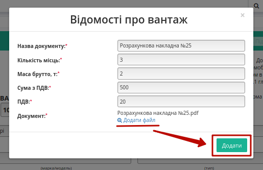

.. important::
    Спосіб дозволяє додати лише 1 файл до табличної частини! Після доданої таким чином табличної позиції зникає можливість додавати інші позиції!

Поле "Супровідні документи" автоматично заповнюється назвою доданого файлу, який також відображається в супровідних документах на вантаж:

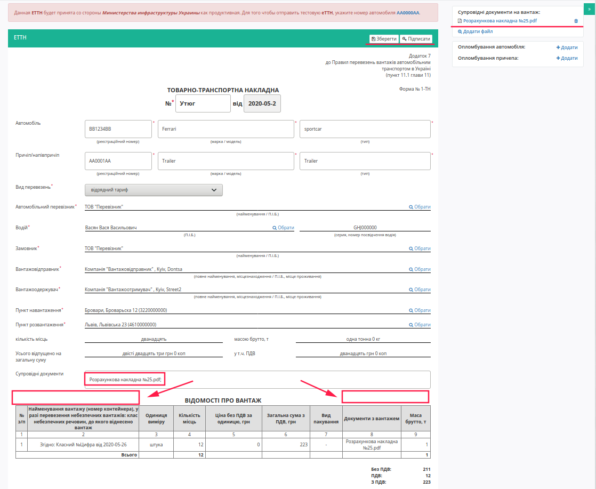

Додану "Позицію з файлу" можливо видалити з табличної частини:

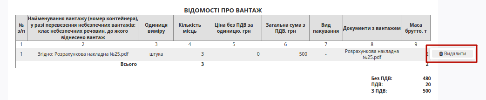

.. important::
    Позиції відправлені в файловому вигляді, а також інші додані файли недоступні для ролі **"Перевізника"** та водіїв.

--------

За необхідністю є можливість додати супровідні документи на вантаж. Для цього необхідно натиснути на кнопку "Додати файл" (назва файлу повина бути унікальною).

.. image:: pics_Creation_signing_ending_rejection_ETTN_shipper/Creation_signing_ending_rejection_ETTN_shipper_08.png
   :align: center

Для того щоб видалити доданий файл необхідно натиснути на іконку корзини. Для того щоб зберегти доданий файл необхідно натиснути на його назву. Назва доданого файлу автоматично додається в поле "Супровідні документи".

.. image:: pics_Creation_signing_ending_rejection_ETTN_shipper/Creation_signing_ending_rejection_ETTN_shipper_09.png
   :align: center

--------

Також у **"Вантажовідправника"** є можливість вказати дані пломб автомобіля та причепа з прив'язкою до створюваної еТТН:

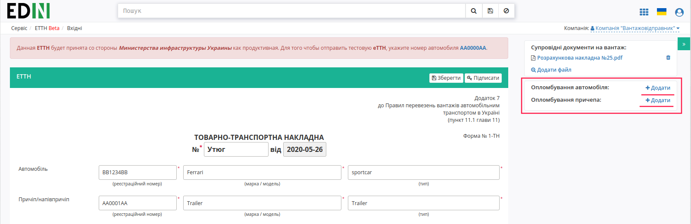

.. image:: pics_Creation_signing_ending_rejection_ETTN_shipper/Creation_signing_ending_rejection_ETTN_shipper_46.png
   :align: center

.. image:: pics_Creation_signing_ending_rejection_ETTN_shipper/Creation_signing_ending_rejection_ETTN_shipper_47.png
   :align: center

**"Вантажовідправник"** за бажання може видалити дані опломбування (кнопка |мусорка|).

--------

Для підписання е-ТТН необхідно натинути на кнопку "Підписати".

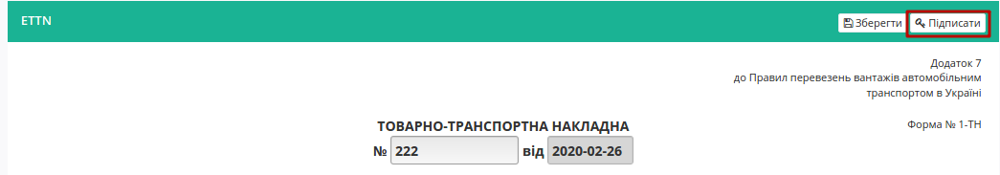

**Підписання та відправка документа**
================================================

Після ініціалізації бібліотеки підписання, система надасть можливість додати ключ для підписання. При :underline:`першому` підписанні необхідно додати файловий ключ. Для цього у модальному вікні потрібно обрати файл (2) і ввести пароль (1):

.. image:: pics_Creation_signing_ending_rejection_ETTN_shipper/Creation_signing_ending_rejection_ETTN_shipper_11n.png
   :align: center

Після чого натиснути кнопку **"Додати"**:

.. image:: pics_Creation_signing_ending_rejection_ETTN_shipper/Creation_signing_ending_rejection_ETTN_shipper_12n.png
   :align: center

При успішному додаванні ключа автоматично відобразиться вибрана особа, від імені якої буде здійснено підписання (кнопка **"Підписати"**):

.. image:: pics_Creation_signing_ending_rejection_ETTN_shipper/Creation_signing_ending_rejection_ETTN_shipper_13n.png
   :align: center

При подальшій роботі з раніше доданим ключем/-ами потрібно вводити лише пароль для обраного ключа:

.. image:: pics_Creation_signing_ending_rejection_ETTN_shipper/Creation_signing_ending_rejection_ETTN_shipper_14n.png
   :align: center

Після підписання е-ТТН інформація щодо підписанта відображається в блоці "Підписанти". Для відправки е-ТТН необхідно натинути на кнопку "Надіслати".

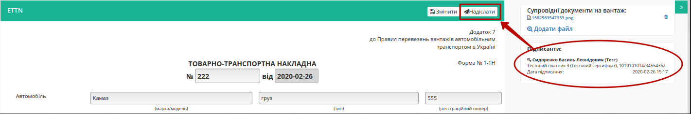

.. image:: pics_Creation_signing_ending_rejection_ETTN_shipper/Creation_signing_ending_rejection_ETTN_shipper_16n.png
   :align: center

Після відправки документа контрагенту він відображається в журналі вихідних документів. Для відправленної вантажовідправником е-ТТН присвоєно статус "У процесі":

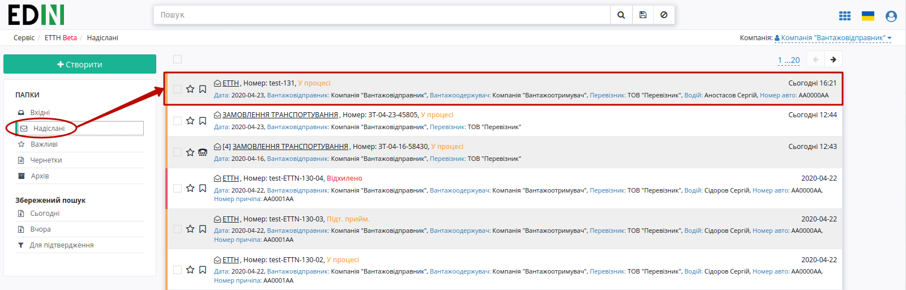

Відправлена е-ТТН має наступний вигляд:

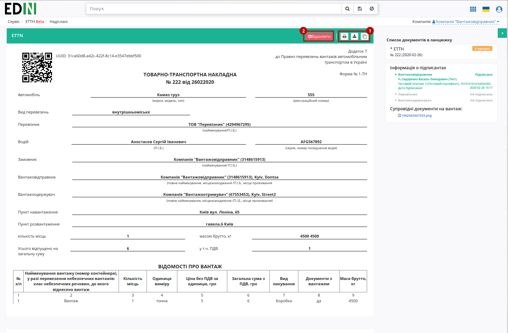

На формі е-ТТН у лівій верхній частині відображаються QR-код та унікальний ідентифікатор документа.

Користувач може скористатись функціоналом для "Друку", "Завантаження" чи "Клонування" (1); також у разі виявлення помилки в документі у **"Вантажовідправника"** є можливість відхилити відправлену е-ТТН **до підписання "Перевізником"**. Для цього потрібно натиснути на кнопку "Відхилити" (2).

**Відхилення документа**
================================================

Для того, щоб відхилити документ (доступно **до підписання "Перевізником"**) потрібно натиснути **"Відхилити"**. Після чого в модульному вікні обов'язково потрібно заповнити причину відміни документа:

.. image:: pics_Creation_signing_ending_rejection_ETTN_shipper/Creation_signing_ending_rejection_ETTN_shipper_30n.png
   :align: center

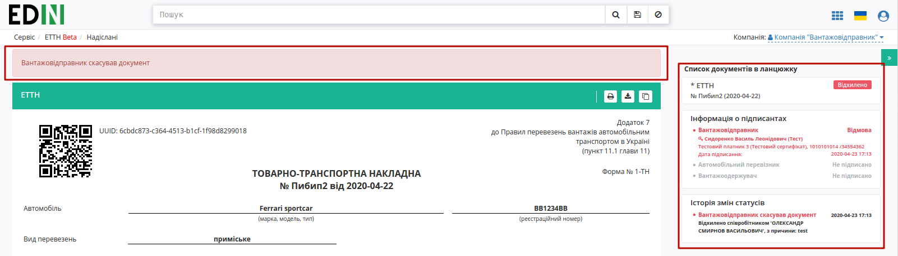

На платформі відображається повідомлення та змінюється статус документа в ланцюжку ("Відхилено").

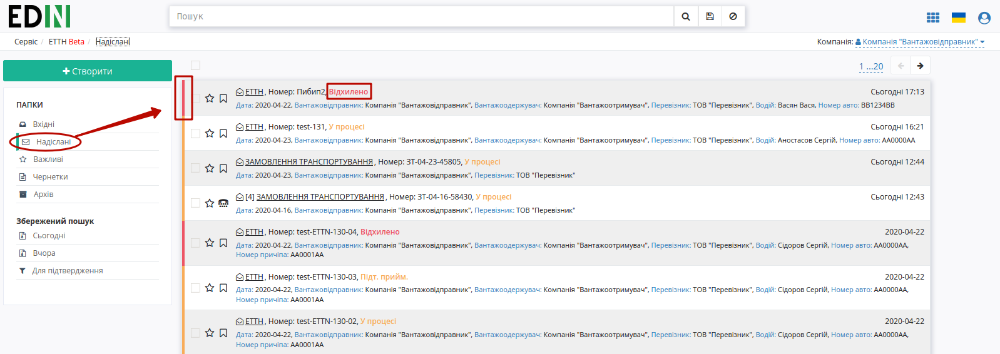

**Створення документа на підставі чернетки Перевізника чи Вантажоотримувача**
================================================================================================

Існують схеми документообігу, в яких ініціатором виступає не **"Вантажовідправник"**, а **"Перевізник"** чи **"Вантажоотримувач"**. В такому випадку ініціатор створює та відправляє документ-чернетку, яку не потрібно підписувати. 

Далі згідно `оберненої схеми <https://wiki.edi-n.com/uk/latest/ETTN_2_0/Work_with_ETTN.html#reverse-schema>`__ документообігу контрагент з роллю **"Вантажовідправник"** отримує документ-чернетку:

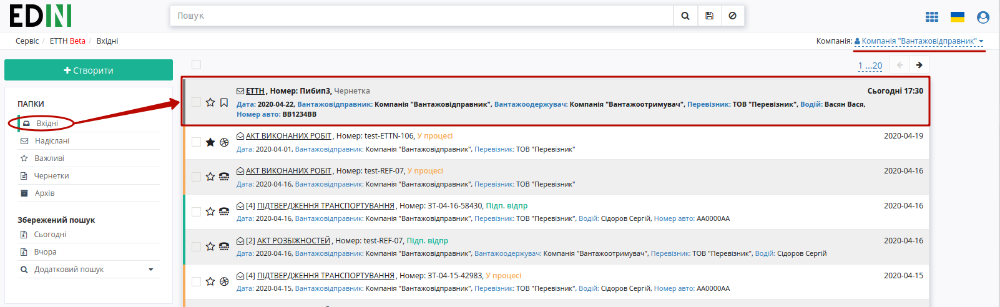

Для ролі **"Вантажовідправника"** вхідний документ-чернетка відображається з інформативною підказкою і дозволяє **"Створити"** на основі вхідної чернетки документ, що потребує підписання:

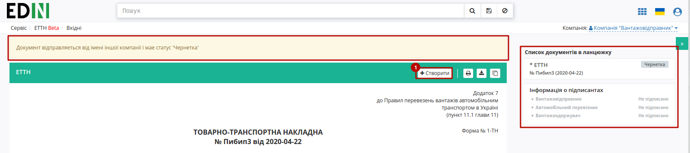

В створений такий чином документ копіюється вся інформація та вкладення з чернетки. Документ може бути відредагований, після чого його потрібно **"Зберегти"** (1), **"Підписати"** (2) та **"Надіслати"** (3):

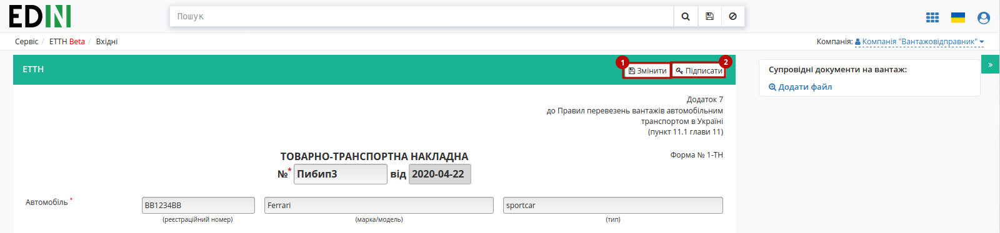

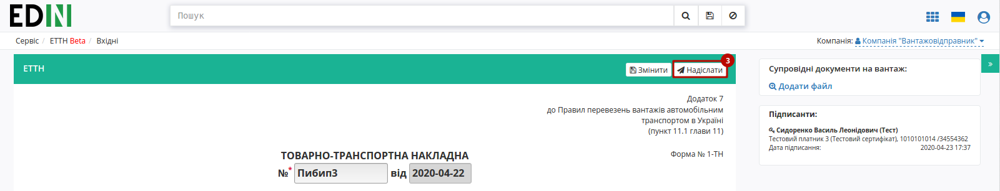

Особливістю такого документообігу є те, що в ланцюжку документів присутня чернетка, як документ-ініціатор документообігу:

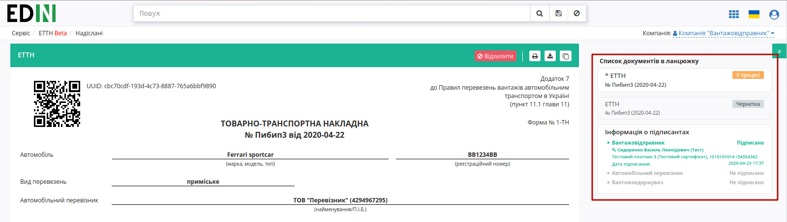

.. include:: kontakti.rst
