Створення, підписання, відправлення та відхилення е-ТТН вантажовідправником
###################################################################################################

.. role:: red

.. role:: underline

.. сюда закину немного картинок для текста

.. |drop_pass| image:: signing/drop_pass.png

.. |del_key| image:: signing/del_key2.png

.. contents:: Зміст:
   :depth: 6

---------

**1 Створення документа**
================================================

.. important::
   Ініціатор документообігу повинен бути присутнім серед учасників документообігу! 

Для створення е-ТТН на платформі необхідно натиснути на кнопку "Створити". Після цього необхідно вибрати тип створюваного документа в модальному вікні:

.. image:: pics_Creation_signing_ending_rejection_ETTN_shipper/Creation_signing_ending_rejection_ETTN_shipper_48.png
   :align: center

Далі необхідно заповнити форму е-ТТН (кнопка "Зберегти" активується лише для заповненої форми):

.. image:: pics_Creation_signing_ending_rejection_ETTN_shipper/Creation_signing_ending_rejection_ETTN_shipper_49.png
   :align: center

.. hint::
   Поля обов'язкові до заповнення позначені червоною зірочкою :red:`*`!

Для автомобілів та причепів реалізований автоматичний довідник, в який записуються "Реєстраційний номер", "Марка/модель", "Тип". Для раніше введеного реєстрайійного номеру, наприклад, **КК1234КК** користувач може скористатись пошуком (мінімум 3 символи): ``КК1, К12, 123, 234, 34К, 4КК``.

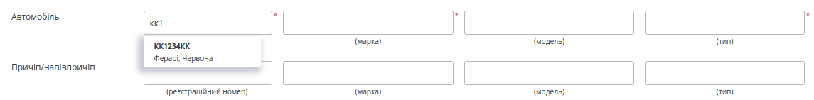

.. note::
   Якщо користувач вказує будь-які дані причіпа/напівпричіпа, то відповідні поля: реєстраційний номер, марка та тип стають обов'язковими до заповнення!

.. important::
   Вибір організацій-контрагентів, водія, адрес навантаження/розвантаження доступні з випадаючого списку. Також дані **Автомобільного перевізника** та **Вантажоодержувача** можливо додати вручну (кнопки "Новий перевізник", "Новий вантажоодержувач" відповідно).

.. note::
   Якщо контрагенти були введені вручну (поки не зареєстровані на платформі EDIN), то при збереженні документа відобразиться попередження, наприклад, для **Вантажоодержувача**:

   .. image:: pics_Creation_signing_ending_rejection_ETTN_shipper/Creation_signing_ending_rejection_ETTN_shipper_39new.png
      :align: center

Якщо **Автомобільний перевізник** відсутній на платформі EDIN, то його можливо додати через кнопку **"Новий перевізник"**:

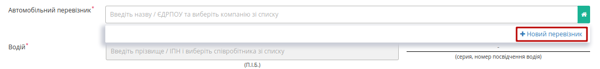

Відкриється модальне вікно, в якому потрібно спочатку заповнити e-mail майбутного контрагента і після підтведження його унікальності заповнити обов'язкові поля: **ЄДРПОУ чи ІПН** та **Назву компанії чи ПІБ** та натиснути **"Додати"**:

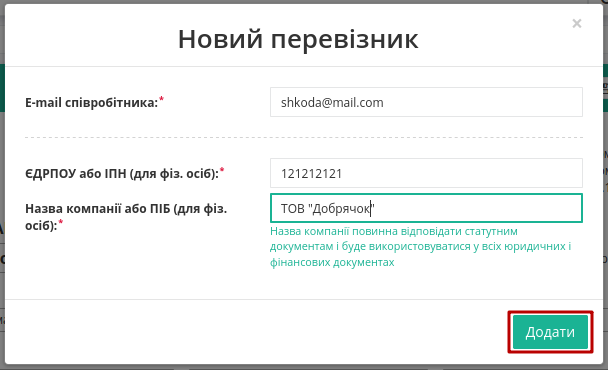

Дані нового контрагента автоматично додаються в таблицю **"Додаткові дані"** (детальніше `детальніше <https://wiki.edin.ua/uk/latest/ETTN_2_0/Creation_signing_ending_rejection_ETTN_shipper.html#additional-data>`__). При корректному заповненні даних (унікальні email, ЄДРПОУ) на вказаний email відправляється запрошення з унікальним посиланням для подальшої реєстрації на платформі EDIN:

* **Водій** (рядок стає активним тільки після вибору перевізника) – необхідно необхідно ввести мінімум 3 символи та обрати його з випадаючого списку;

Якщо водій відсутній в списку його можливо додати через кнопку **"Новий водій"**:

.. image:: pics_Creation_signing_ending_rejection_ETTN_shipper/Creation_signing_ending_rejection_ETTN_shipper_53.png
   :align: center

Після чого в модальному вікні потрібно буде заповнити дані про водія ("Серія, номер посвідчення водія" заповнюється в форматі "3 заголовні кириличні/латинські літери + 6 цифр без пробілів", наприклад "DGJ123456", "АБВ123456"). Обов'язкові поля позначені червоною зірочкою :red:`*` . Доданий водій прив'язується в системі до вказаного **"Перевізника"**.

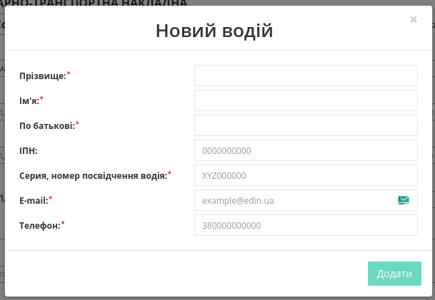

При додаванні нового перевізника автоматично підтягуються дані вказаної особи, є можливість їх **"Змінити"**:

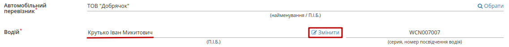

* **Серія, номер посвідчення водія** буде додано автоматично після вибору водія;
* **Замовник** – необхідно обрати з випадаючого списку (для цього в рядку необхідно ввести мінімум 3 символи найменування/П.І.Б. замовника, після цього обрати його з випадаючого списку) або **"Вказати себе"** (кнопка |green_house|);
* **Вантажовідправник** – необхідно обрати з випадаючого списку (для цього в рядку необхідно ввести мінімум 3 символи найменування/П.І.Б. вантажовідправника, після цього обрати його з випадаючого списку) або **"Вказати себе"** (кнопка |green_house|); місцезнаходження/місце проживання буде додано автоматично;
* **Вантажоодержувач** – необхідно обрати з випадаючого списку (для цього в рядку необхідно ввести мінімум 3 символи найменування/П.І.Б. вантажоодержувача, після цього обрати його з випадаючого списку) або **"Вказати себе"** (кнопка |green_house|); місцезнаходження/місце проживання буде додано автоматично;

Якщо **Вантажоодержувач** відсутній на платформі EDIN, то його можливо додати через кнопку **"Новий вантажоодержувач"**:

.. image:: pics_Creation_signing_ending_rejection_ETTN_shipper/Creation_signing_ending_rejection_ETTN_shipper_56.png
   :align: center

Відкриється модальне вікно, в якому потрібно спочатку заповнити e-mail майбутного контрагента і після підтведження його унікальності заповнити обов'язкові поля: **Назву, ЄДРПОУ, ІПН, Місто, Адресу** організації та співробітника та натиснути **"Додати"**:

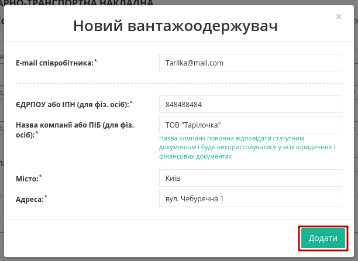

Дані нового контрагента автоматично додаються в таблицю **"Додаткові дані"** (детальніше `детальніше <https://wiki.edin.ua/uk/latest/ETTN_2_0/Creation_signing_ending_rejection_ETTN_shipper.html#additional-data>`__). При корректному заповненні даних (унікальні email, ЄДРПОУ) на вказаний email буде відправлено запрошення з унікальним посиланням для подальшої реєстрації на платформі EDIN:

* **Пункт навантаження** – необхідно обрати з випадаючого списку (для цього в рядку необхідно ввести мінімум 3 символи найменування, після цього обрати його з випадаючого списку);
* **Пункт розвантаження** – необхідно обрати з випадаючого списку (для цього в рядку необхідно ввести мінімум 3 символи найменування, після цього обрати його з випадаючого списку);

Якщо адреси у вказаному списку немає, то її можливо додати вручну через кнопку **"Нова адреса"** [1]_:

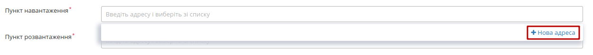

Після чого в модальному вікні потрібно буде **"Додати"** адресу, населений пункт (достатньо почати вводити назву населеного пункту та обрати його зі списку) - при цьому код `КАТОТТГ <https://www.minregion.gov.ua/napryamki-diyalnosti/rozvytok-mistsevoho-samovryaduvannya/administratyvno/kodyfikator-administratyvno-terytorialnyh-odynycz-ta-terytorij-terytorialnyh-gromad/>`__ вказується автоматично. Додана адреса навантаження прив'язується в системі до вказаного **"Вантажовідправника"**, а адреса розвантаження - до **"Вантажоодержувача"**.

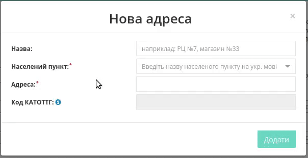

Існує можливість вказати за потреби "Спеціальну охорону вантажу" та документ, згідно з яким здійснюється супровід через кнопку **"Додати"**:

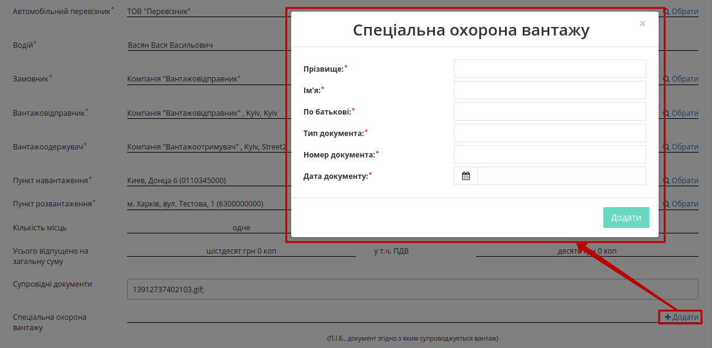

.. tip:: Для повторного вибору перевізника, водія, вантажовідправника, вантажоодержувача, пунктів навантаження/розвантаження необхідно натиснути на кнопку "Обрати".

.. note::
   Значення для "Кількість місць", "масою бруто, кг", "Усього відпущено на загальну суму", "у т.ч. ПДВ" підтягуються автоматично з таблиці відомостей про вантаж і автоматично дублюються в буквенній формі:

   .. image:: pics_Creation_signing_ending_rejection_ETTN_shipper/Creation_signing_ending_rejection_ETTN_shipper_60.png
      :align: center

Для збереження е-ТТН необхідно натиснути кнопку **"Зберегти"**, документ потрапить у папку **"Чернетки"**.

**1.1 Заповнення табличної частини**
---------------------------------------

**1.1.1 Відомості про вантаж**
~~~~~~~~~~~~~~~~~~~~~~~~~~~~~~~~~~~~~~~~~~~~~~~~~~~~~~

Заповнення "Відомостей про вантаж" є обов'язковим і його можливо здійснити кількома способами: 

**1) Вручну**
""""""""""""""""""""""""""""""""""""

Потрібно натиснути на кнопку **"Додати"**:

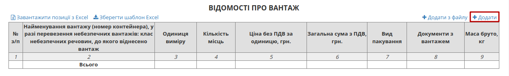

Після натискання на кнопку "Додати" відкриється модальне вікно, де необхідно заповнити рядки (найменування вантажу, кількість місць, одиниця виміру, ціна без ПДВ за одиницю, вид пакування (необов’язково), маса брутто, документи з вантажем) та натиснути на кнопку "Додати".

.. image:: pics_Creation_signing_ending_rejection_ETTN_shipper/Creation_signing_ending_rejection_ETTN_shipper_62.png
   :align: center

**2) Шаблоном** 
""""""""""""""""""""""""""""""""""""

Також для додавання табличних даних (вантаж) є можливість скористатись шаблоном. Для цього над таблицею необхідно натиснути **"Зберегти шаблон Excel"** (1).

.. image:: pics_Creation_signing_ending_rejection_ETTN_shipper/Creation_signing_ending_rejection_ETTN_shipper_63.png
   :align: center

На Ваш комп’ютер буде завантажено файл з назвою **ettn_products_sample.xlsx**. Відкривши його, необхідно внести інформацію про вантаж.

Обов’язкові для заповнення поля в файлі відмічені жовтим кольором ("Найменування вантажу", "Маса брутто, кг").

.. important:: Ні в якому разі не змінювати формат шаблону, не видаляти або додавати нові стовпці. Також не допускається зміна формату комірок.

Після збереження заповненої інформації завантажуємо файл на веб-портал, скориставшись кнопкою **"Завантажити позиції з Excel"** (2).

За необхідністю є можливість додавати ще вантаж(і), для цього необхідно натиснути на кнопку **"Додати"** та заповнити інформацію в модальному вікні.

Для редагування інформації щодо вантажу необхідно навести курсор на рядок цього вантажу та натиснути "Змінити", для видалення – "Видалити".

.. image:: pics_Creation_signing_ending_rejection_ETTN_shipper/Creation_signing_ending_rejection_ETTN_shipper_64.png
   :align: center

.. **3) З файлу**  
   ~~~~~~~~~~~~~~~~~~~~~~~~~~~~~~~~~~~~~~~~~~~~~~~~~~~~~~

   .. attention::
      Цей метод повністю виключає використання інших (попердніх) способів додавання позицій до табличної частини.

   При натисканні на кнопку **"Додати з файлу"** відкривається попап вікно для заповнення відомостей про вантаж:

   .. image:: pics_Creation_signing_ending_rejection_ETTN_shipper/Creation_signing_ending_rejection_ETTN_shipper_32new.png
      :align: center

   Обов'язково потрібно заповнити всі поля, а також вказати місцерозташування файлу-документа ("Додати файл"): 

   .. image:: pics_Creation_signing_ending_rejection_ETTN_shipper/Creation_signing_ending_rejection_ETTN_shipper_33.png
      :align: center

   .. important::
      Спосіб дозволяє додати лише 1 файл до табличної частини! Після доданої таким чином табличної позиції зникає можливість додавати інші позиції!

   Поле "Супровідні документи" автоматично заповнюється назвою доданого файлу, який також відображається в супровідних документах на вантаж:

   .. image:: pics_Creation_signing_ending_rejection_ETTN_shipper/Creation_signing_ending_rejection_ETTN_shipper_34.png
      :align: center

   Додану "Позицію з файлу" можливо видалити з табличної частини:

   .. image:: pics_Creation_signing_ending_rejection_ETTN_shipper/Creation_signing_ending_rejection_ETTN_shipper_35new.png
      :align: center

   .. important::
      Позиції відправлені в файловому вигляді, а також інші додані файли недоступні для ролі **"Перевізника"** та водіїв.

**1.1.2 Вантажно-розвантажувальні операції**
~~~~~~~~~~~~~~~~~~~~~~~~~~~~~~~~~~~~~~~~~~~~~~~~~~~~~~

Обов'язково повинні бути заповнені дані ("Маса бруто, кг", "Дата прибуття", "Дата відправлення", "Відповідальна особа вантажовідправника") в таблиці вантажно-розвантажувальних операцій.

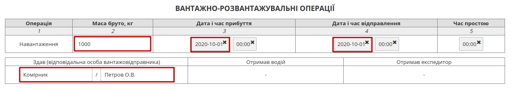

.. hint::
   При переміщенні курсора в поле "Маса бруто, кг" система автоматично пропонує вказати (доступно до редагування) загальну масу всього вантажу із таблиці відомостей про вантаж:

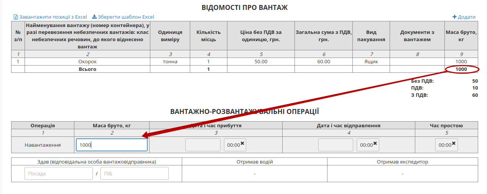

.. _additional-data:

**1.1.3 Додаткові дані**
~~~~~~~~~~~~~~~~~~~~~~~~~~~~~~~~~~~~~~~~~~~~~~~~~~~~~~

Опціонально можуть бути заповнені додаткові дані в таблицю, як для всіх учасників документообігу так і межах однієї сторони.

.. image:: pics_Creation_signing_ending_rejection_ETTN_shipper/Creation_signing_ending_rejection_ETTN_shipper_67.png
   :align: center

.. image:: pics_Creation_signing_ending_rejection_ETTN_shipper/Creation_signing_ending_rejection_ETTN_shipper_68.png
   :align: center

Також при додаванні нових Перевізника та/або Вантажоотримувача дані автоматично додаються в таблицю **"Додаткові дані"**: 

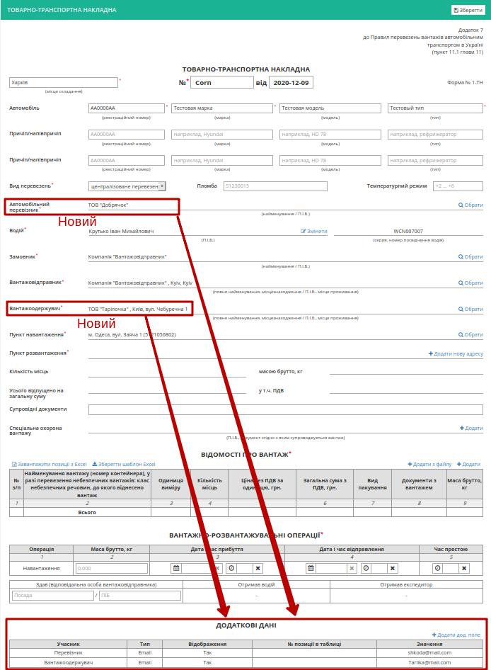

--------

За необхідністю є можливість додати супровідні документи на вантаж (лише в pdf форматі). Для цього необхідно натиснути на кнопку "Додати файл" (назва файлу повина бути унікальною).

.. image:: pics_Creation_signing_ending_rejection_ETTN_shipper/Creation_signing_ending_rejection_ETTN_shipper_69.png
   :align: center

Для того щоб видалити доданий файл необхідно натиснути на іконку корзини. Для того щоб зберегти доданий файл необхідно натиснути на його назву. Назва доданого файлу автоматично додається в поле "Супровідні документи".

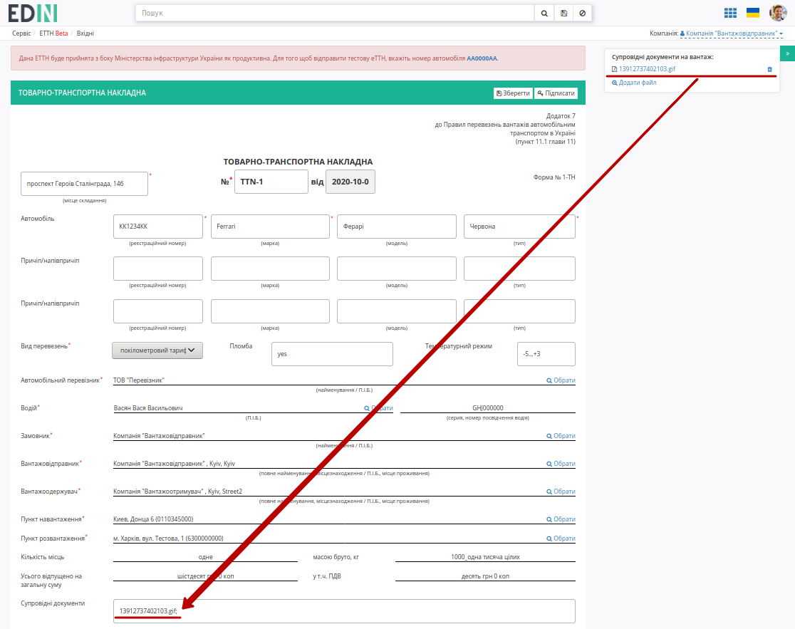

.. --------

   Також у **"Вантажовідправника"** є можливість вказати дані пломб автомобіля та причепа з прив'язкою до створюваної еТТН:

   .. image:: pics_Creation_signing_ending_rejection_ETTN_shipper/Creation_signing_ending_rejection_ETTN_shipper_45.png
      :align: center

   .. image:: pics_Creation_signing_ending_rejection_ETTN_shipper/Creation_signing_ending_rejection_ETTN_shipper_46.png
      :align: center

   .. image:: pics_Creation_signing_ending_rejection_ETTN_shipper/Creation_signing_ending_rejection_ETTN_shipper_47.png
      :align: center

   **"Вантажовідправник"** за бажання може видалити дані опломбування (кнопка |мусорка|).

.. _without-sign:

**1.1.4 Схема "е-ТТН без ЕЦП/КЕП" (Вантажовідправник в ТТН = поточній компанії)**
~~~~~~~~~~~~~~~~~~~~~~~~~~~~~~~~~~~~~~~~~~~~~~~~~~~~~~~~~~~~~~~~~~~~~~~~~~~~~~~~~~~~~

.. note::
   Деякі контрагенти мають відмінну схему роботи з е-ТТН, наприклад, ТОВ "СІЛЬПО-ФУД", коли підписання не є обов'язковим чи навіть повністю виключеним з документообігу і передбачає двосторонній обмін ТТН між вантажовідправником і вантажоодержувачем. Так для Вантажоодержувача, що може працювати, як з підписаною ТТН так і з непідписаною ТТН функціональні кнопки залишаються без змін, а в примітці вказується можливість не підписувати документ:

   .. image:: pics_Creation_signing_ending_rejection_ETTN_shipper/Creation_signing_ending_rejection_ETTN_shipper_93.png
      :align: center

   Для Вантажоодержувача, що може працювати лише з непідписаною ТТН відсутня можливість підписати документ:

   .. image:: pics_Creation_signing_ending_rejection_ETTN_shipper/Creation_signing_ending_rejection_ETTN_shipper_91.png
      :align: center

   Лише у відправленому **непідписаному документі е-ТТН в статусі "Чернетка"** у відправника є можливість **"Замінити ТТН"**:

   .. image:: pics_Creation_signing_ending_rejection_ETTN_shipper/Creation_signing_ending_rejection_ETTN_shipper_92.png
      :align: center

   При **"Заміні ТТН"** виконується копіювання всіх даних документа для подальшого редагування, а в додаткові поля записується посилання на документ, який буде замінено.

.. _sign:

**2 Підписання та відправка документа**
================================================

Для підписання е-ТТН необхідно натинути на кнопку "Підписати".

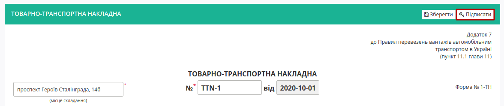

.. include:: /_constant/atb_check/atb_check.rst
   :start-after: .. початок блоку для ATB_check
   :end-before: .. кінець блоку для ATB_check

.. tabs::

   .. tab:: Файловий ключ

      .. include:: /_constant/signing/signing.rst
         :start-after: .. початок блоку для Signing
         :end-before: .. кінець блоку для Signing

   .. tab:: Token

      .. include:: /_constant/token_signing/token_signing.rst
         :start-after: .. початок блоку для TokenSign
         :end-before: .. кінець блоку для TokenSign

   .. tab:: Гряда

      .. include:: /_constant/gryada_signing/gryada_signing.rst
         :start-after: .. початок блоку для GryadaSign
         :end-before: .. кінець блоку для GryadaSign

   .. tab:: Cloud

      .. include:: /_constant/cloud_signing/cloud_signing.rst
         :start-after: .. початок блоку для CloudSign
         :end-before: .. кінець блоку для CloudSign

Після підписання е-ТТН відображається інформація щодо підписантів. Для відправки е-ТТН необхідно натинути на кнопку "Надіслати".

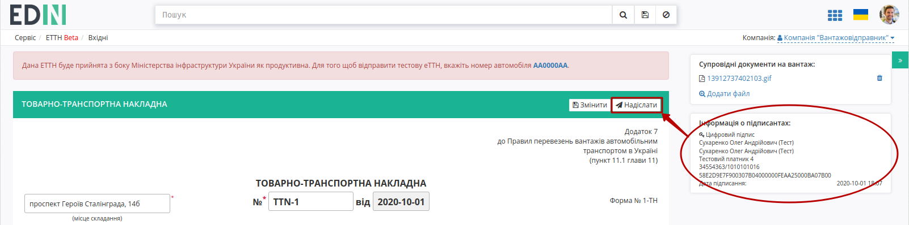

Після відправки документа контрагенту він відображається в журналі надісланих документів. Для відправленної **Вантажовідправником** е-ТТН присвоєно статус **"Очікує підписання водієм / перевізником"**:

.. image:: pics_Creation_signing_ending_rejection_ETTN_shipper/Creation_signing_ending_rejection_ETTN_shipper_73.png
   :align: center

Відправлена е-ТТН має наступний вигляд:

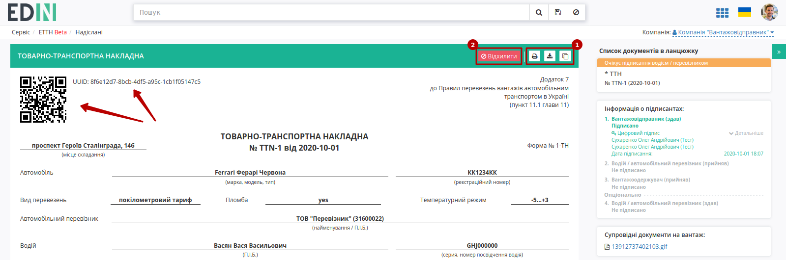

На формі е-ТТН у лівій верхній частині відображаються QR-код та унікальний ідентифікатор документа.

Користувач може скористатись функціоналом для "Друку", "Завантаження" чи "Клонування" (1); також у разі виявлення помилки в документі у **"Вантажовідправника"** є можливість відхилити відправлену е-ТТН **до підписання "Перевізником"**. Для цього потрібно натиснути на кнопку "Відхилити" (2).

**3 Відхилення документа**
================================================

Для того, щоб відхилити документ (доступно **до підписання "Перевізником"**) потрібно натиснути **"Відхилити"**. Після чого в модульному вікні обов'язково потрібно заповнити причину відміни документа:

.. image:: pics_Creation_signing_ending_rejection_ETTN_shipper/Creation_signing_ending_rejection_ETTN_shipper_30n.png
   :align: center

.. image:: pics_Creation_signing_ending_rejection_ETTN_shipper/Creation_signing_ending_rejection_ETTN_shipper_75.png
   :align: center

На платформі відображається повідомлення та змінюється статус документа в ланцюжку (**"Скасовано вантажовідправником"**).

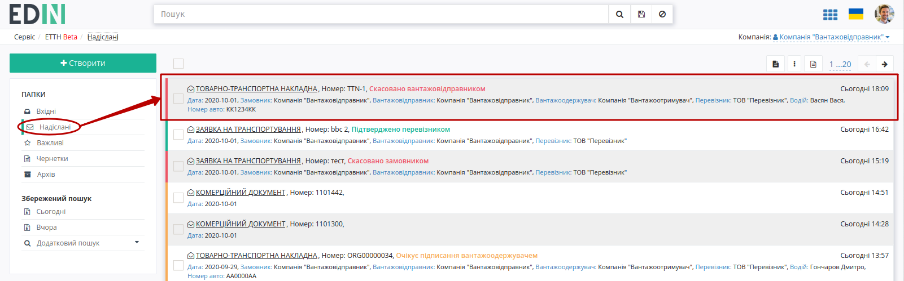

**4 Створення документа на підставі чернетки Перевізника чи Вантажоотримувача**
================================================================================================

Існують схеми документообігу, в яких ініціатором виступає не **"Вантажовідправник"**, а **"Перевізник"** чи **"Вантажоотримувач"**. В такому випадку ініціатор створює та відправляє документ-чернетку, яку не потрібно підписувати. 

Далі згідно `оберненої схеми <https://wiki.edin.ua/uk/latest/ETTN_2_0/Work_with_ETTN.html#reverse-schema>`__ документообігу контрагент з роллю **"Вантажовідправник"** отримує документ-чернетку:

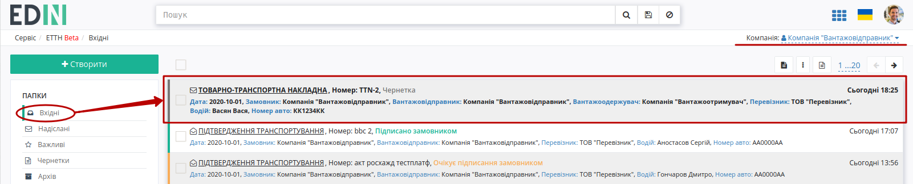

Для ролі **"Вантажовідправника"** вхідний документ-чернетка відображається з інформативною підказкою і дозволяє **"Створити"** (1) на основі вхідної чернетки документ, що потребує підписання:

.. image:: pics_Creation_signing_ending_rejection_ETTN_shipper/Creation_signing_ending_rejection_ETTN_shipper_78.png
   :align: center

В створений такий чином документ копіюється вся інформація та вкладення з чернетки. Документ можливо **"Зберегти"** (2) чи внести зміни (**"Змінити"** (2)), **"Підписати"** (3) та **"Надіслати"** (4):

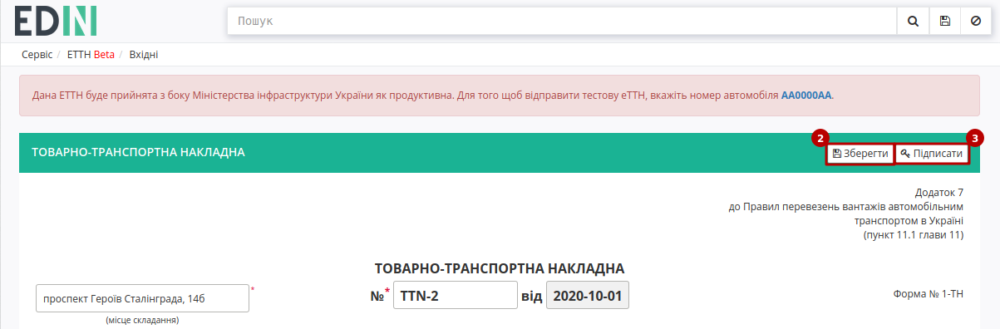

.. image:: pics_Creation_signing_ending_rejection_ETTN_shipper/Creation_signing_ending_rejection_ETTN_shipper_80.png
   :align: center

Особливістю такого документообігу є те, що в ланцюжку документів присутня чернетка, як документ-ініціатор документообігу:

.. image:: pics_Creation_signing_ending_rejection_ETTN_shipper/Creation_signing_ending_rejection_ETTN_shipper_81.png
   :align: center

.. _doc-status:

**5 Отримання статусу обробки е-ТТН від "Вантажоодержувача"**
================================================================================================

У "Вантажоодержувача" є можливість відправити статус обробки е-ТТН, що відображається позначкою в журналі відправлених е-ТТН:

* |doc_good| - Документ без помилок
* |doc_bad| - Документ з помилками

Клік мишкою на значок викликає pop-up вікно з детальною інформацією:

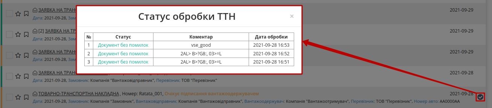

Статус обробки е-ТТН також відображається в самому документі:

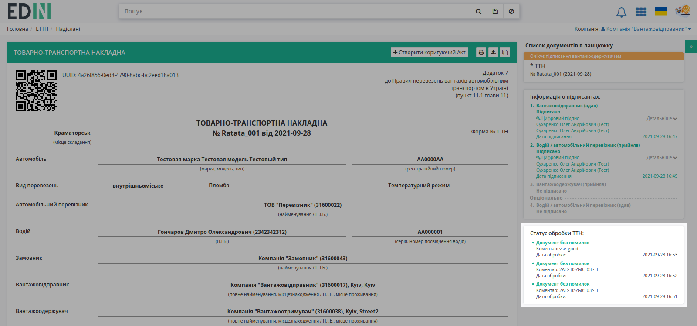

Про відправку такого статусу співробітники "Вантажовідправника" будуть проінформовані на email:

---------------------------------

.. [#] **Заборонити створення пункту розвантаження** - додаткові налаштування "Вантажоодержувача", що можуть бути виконані при зверненні через службу підтримки. Якщо ці налаштуванні активовані, то при створенні "е-ТТН" / "Акта про заміну пункту призначення вантажу" за допомогою WEB чи API ініціатор документа неспроможний додати новий пункт розвантаження. Відповідальність за коректність заповнення даних довідника лежить на "Вантажоодержувачу".

---------------------------------

.. include:: /_constant/kontakti.rst

