Створення, підписання, відправлення та відхилення е-ТТН вантажовідправником
###################################################################################################

.. role:: red

.. role:: underline

Для створення е-ТТН на платформі необхідно натиснути на кнопку "Створити".

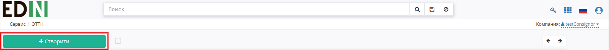

Після цього необхідно вибрати тип створюваного документа в модальному окні:

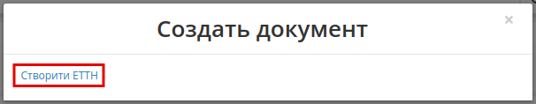

Далі необхідно заповнити форму е-ТТН:

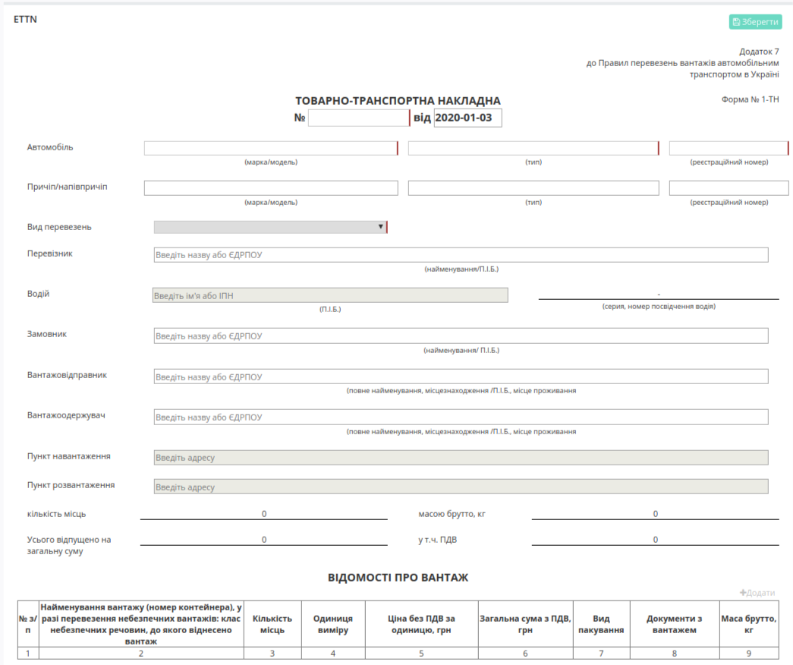

* Номер та дату (за замовчуванням вказується поточна дата);
* Марку/модель, тип, реєстраційний номер автомобілю;
* Марку/модель, тип, реєстраційний номер причіпу/напівпричіпу (необов’язково);
* Вид перевезень (покілометровий тариф, погодинний тариф, відрядний тариф, централізоване перевезення, внутрішньоміське, приміське, міжміське, міжнародне перевезення);
* Перевізник – необхідно обрати з випадаючого списку (для цього в рядку необхідно ввести мінімум 3 символи найменування/П.І.Б. перевізника, після цього обрати його з випадаючого списку);
* Водій (рядок стає активним тільки після вибору перевізника) – необхідно поставити курсор в рядок та обрати його з випадаючого списку;
* Серія, номер посвідчення водія буде додано автоматично після вибору водія
* Вантажовідправник – необхідно обрати з випадаючого списку (для цього в рядку необхідно ввести мінімум 3 символи найменування/П.І.Б. вантажовідправника, після цього обрати його з випадаючого списку), місцезнаходження/місце проживання буде додано автоматично;
* Вантажоодержувач – необхідно обрати з випадаючого списку (для цього в рядку необхідно ввести мінімум 3 символи найменування/П.І.Б. вантажоодержувача, після цього обрати його з випадаючого списку), місцезнаходження/місце проживання буде додано автоматично;
* Пункт навантаження – необхідно поставити курсор в рядок та обрати його з випадаючого списку;
* Пункт розвантаження – необхідно поставити курсор в рядок та обрати його з випадаючого списку;
* Натиснути на кнопку "Додати" для заповненя вартісно-кількісних показників та табличної частини.

Після натискання на кнопку "Додати" відкриється модальне вікно, де необхідно заповнити рядки (найменування вантажу, кількість місць, одиниця виміру, ціна без ПДВ, вид пакування (необов’язково), маса брутто, кількість документів з вантажем) та натиснути на кнопку "Додати".

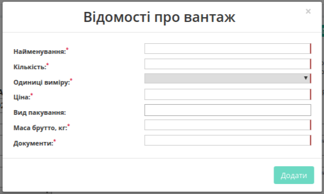

За необхідністю є можливість додавати ще вантаж(і), для цього необхідно натиснути на кнопку "Додати" та заповнити інформацію в модальному вікні.

Для редагування інформації щодо вантажу необхідно навести курсор на рядок цього вантажу та натиснути "Змінити", для видалення – "Видалити".

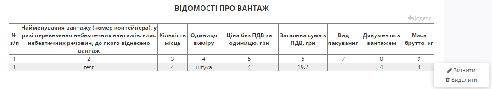

Заповнена форма е-ТТН має наступний вигляд:

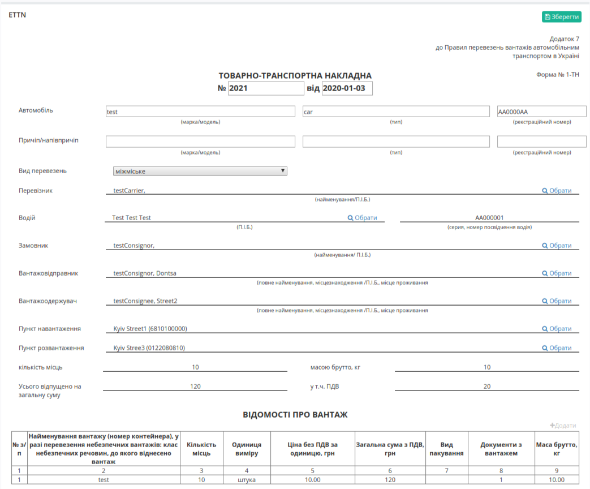

.. tip:: Для повторного вибору перевізника, водія, вантажовідправника, вантажоодержувача, пунктів навантаження/розвантаження необхідно натиснути на кнопку "Обрати".

Для збереження е-ТТН необхідно натиснути кнопку "Зберегти", документ потрапить у папку "Чернетки".

За необхідністю є можливість додати супровідні документи на вантаж. Для цього необхідно натиснути на кнопку "Додати файл" (назва файлу повина бути унікальною).

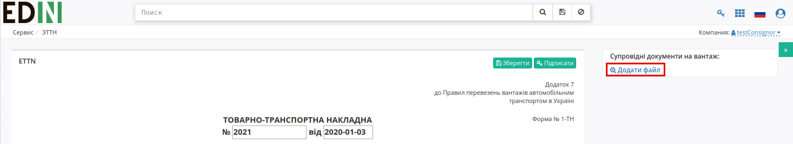

Для того щоб видалити доданий файл необхідно натиснути на іконку корзини.

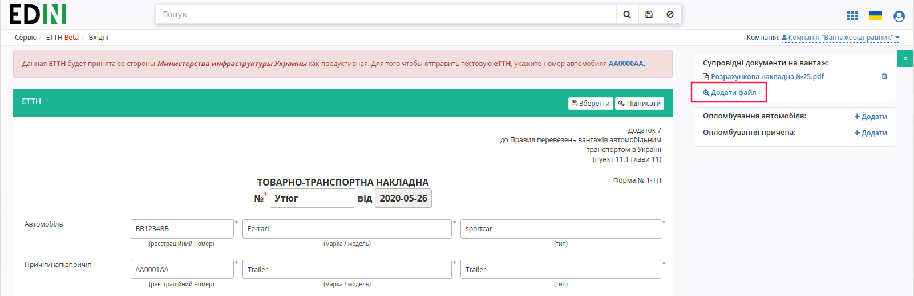

Для того щоб зберегти доданий файл необхідно натиснути на його назву.

Для підписання е-ТТН необхідно натинути на кнопку "Підписати".

.. hint:: Після ініціалізації бібліотеки підписання, система надасть можливість додати ключ для підписання.

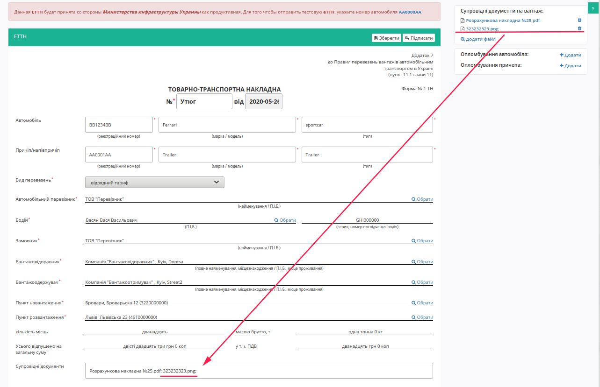

Далі у модальному вікні необхідно додати ключ для підписання, натиснувши на кнопку "Додайте ключі для підписання", ввести пароль та натиснути – "Встановити ключ".

Ключ успішно додано:

.. image:: pics_Creation_signing_ending_rejection_ETTN_shipper/Creation_signing_ending_rejection_ETTN_shipper_10.png
   :align: center

Далі необхідно закрити модальне вікно та ще раз натиснути на кнопку "Підписати". У модальному вікні обрати ключ та натиснути – "Підписати".

.. image:: pics_Creation_signing_ending_rejection_ETTN_shipper/Creation_signing_ending_rejection_ETTN_shipper_11.png
   :align: center

Також додати ключи для підписання можна натиснувши на іконку ключа в правій верхній частині сторінки. Після чого повторити алгоритм додавання ключа в модальному вікні.

.. image:: pics_Creation_signing_ending_rejection_ETTN_shipper/Creation_signing_ending_rejection_ETTN_shipper_12.png
   :align: center

Після підписання е-ТТН інформація щодо підписанта відображається в блоці "Підписанти".

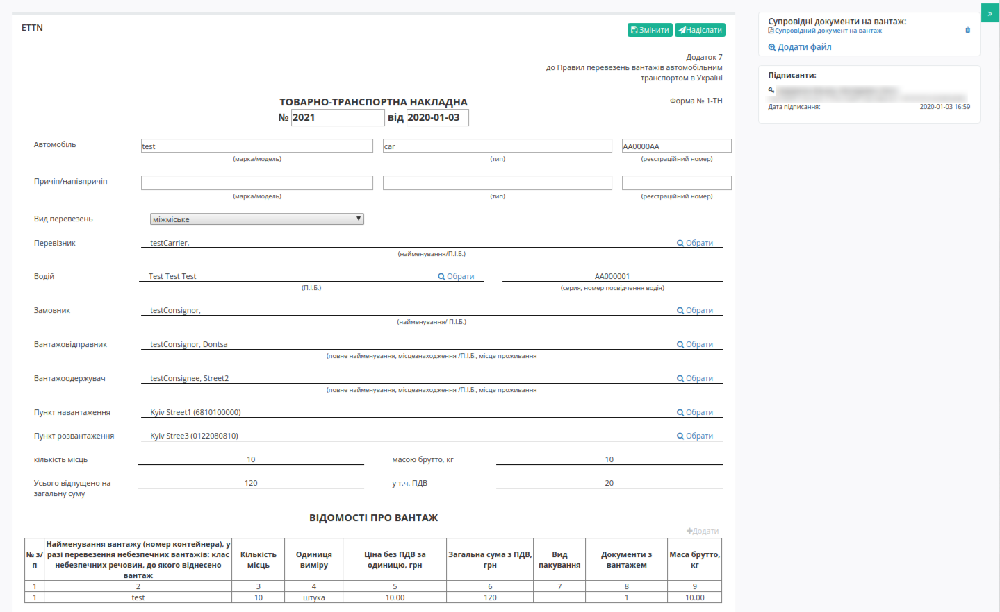

Для відправки е-ТТН необхідно натинути на кнопку "Надіслати".

Після відправки користувачу відображається журнал вихідних документів. Для відправленної вантажовідправником е-ТТН присвоєно статус "У процесі".

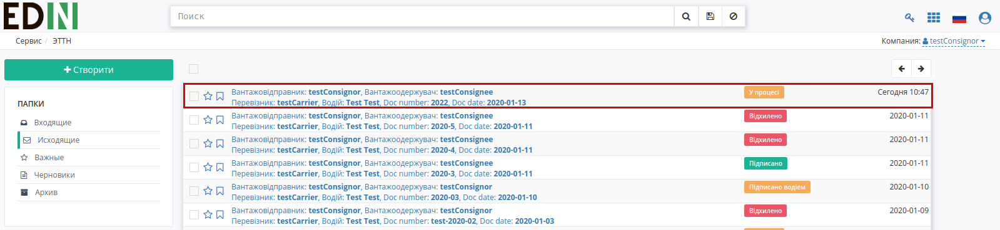

Відправлена е-ТТН має наступний вигляд:

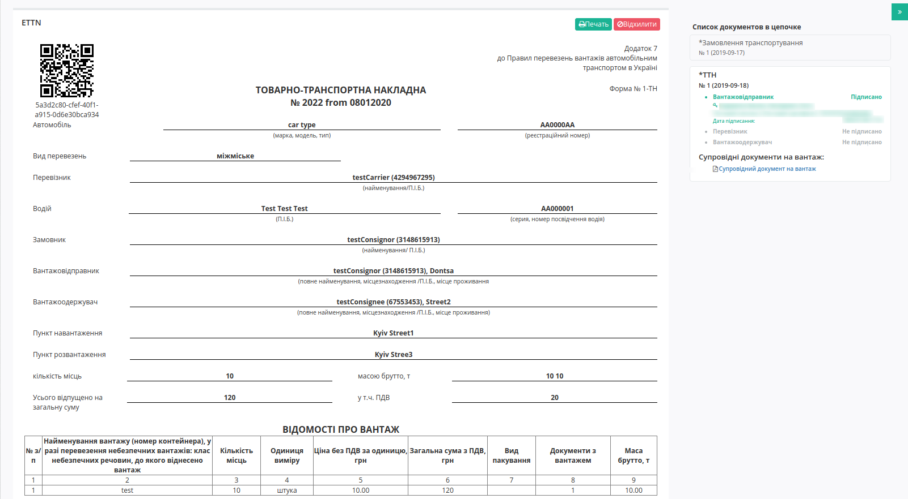

На формі е-ТТН у лівій верхній частині відображаються QR-код та унікальний ідентифікатор документу.

У разі помилки у користувача є можливість відхилити відправлену е-ТТН **до підписання перевізником**. Для цього потрібно натиснути на кнопку "Відхилити".

Результат:

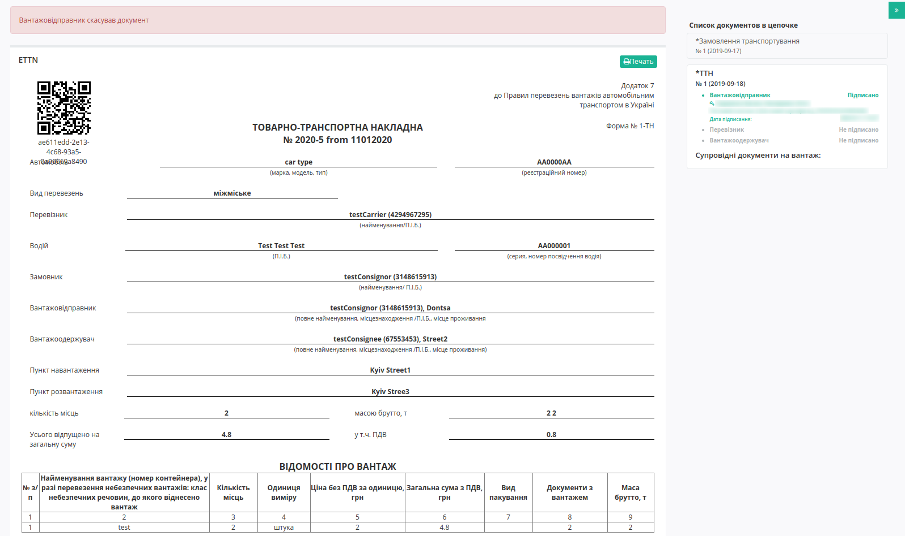

Для відхиленної вантажовідправником е-ТТН присвоєно статус "Відхилено".

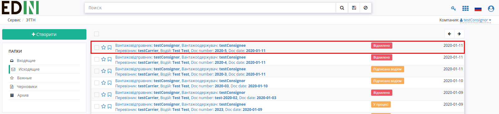

.. include:: kontakti.rst
