Замовлення транспортування (Створення, підписання, відправлення та відхилення)
###################################################################################################

.. сюда закину немного картинок для текста

.. |drop_pass| image:: signing/drop_pass.png

.. |del_key| image:: signing/del_key.png

.. role:: red

.. role:: green

.. role:: underline

.. contents:: Зміст:
   :depth: 6

---------

При формуванні документообігу "Замовлення транспортування" ініціатором документа виступає користувач з роллю **"Вантажовідправник"** (в сервісі ETTN передбачені 3 основні ролі учасників документообігу: **"Вантажовідправник"**, **"Перевізник"**, **"Вантажоотримувач"**). Обмін документом здійснюється між **"Вантажовідправником"** та **"Перевізником"**:

1) :green:`"Вантажовідправник" -> "Перевізник"`

2) :green:`"Перевізник" -> "Вантажовідправник"`

**Сценарії взаємодії з контрагентами**
================================================================================================

При роботі з "Замовленням на транспортування" можливо організувати:

* Документообіг, в якому "Замовленням на транспортування" пропонує перевезення між трьома компаніями-учасниками (1 **"Вантажовідправник"** - 1 **"Перевізник"** - 1 **"Вантажоотримувач"**) з пункту навантаження в пункт розвантаження (дві адреси).
* Документообіг, в якому "Замовленням на транспортування" пропонує перевезення одразу одразу з кількома **"Вантажоотримувачами"** (1 **"Вантажовідправник"** - 1 **"Перевізник"** - N **"Вантажоотримувачів"**) з відповідною кількістю пунктів навантаження та розвантаження (кілька адрес).

**1 Створення "Замовлення транспортування" "Вантажовідправником"**
================================================================================================

Для створення "Замовлення транспортування" на платформі **"Вантажовідправнику"** необхідно натиснути на кнопку "Створити".

.. image:: pics_Creation_signing_ending_rejection_Proposal/Creation_signing_ending_rejection_Proposal_01n.png
   :align: center

Після цього необхідно вибрати тип створюваного документа в модальному вікні:

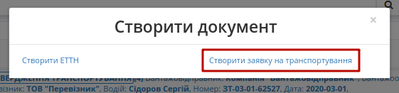

Далі необхідно заповнити форму "Замовлення транспортування" (кнопка "Зберегти" активується лише для заповненої форми):

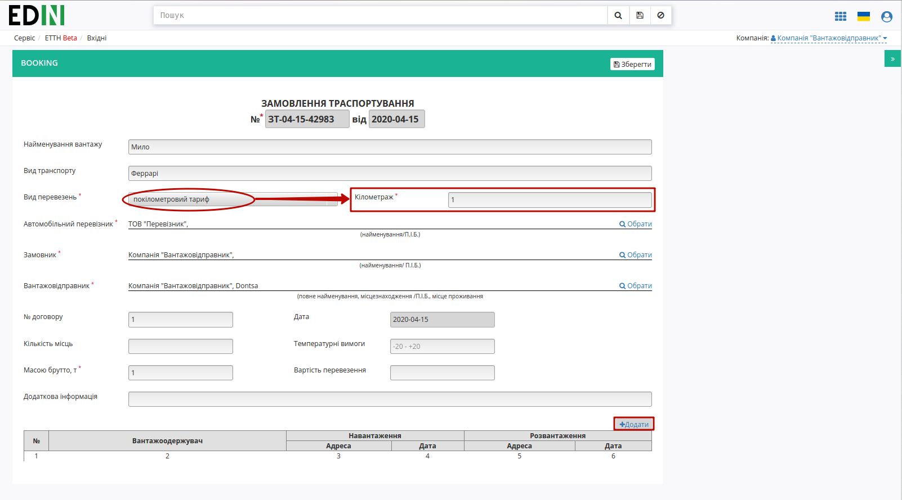

.. important::
    При виборі "Виду перевезень"="покілометровий тариф" з'являється обов'язкове поле "кілометраж". Вибір компаній-контрагентів доступний лише з випадаючого списку!

* За замовчуванням формується номер та вказується поточна дата;
* Найменування вантажу - вказується загальний характер вантажу;
* Вид транспорту - вказуються вимоги до виду транспорту;
* Вид перевезень (покілометровий тариф, погодинний тариф, відрядний тариф, централізоване перевезення, внутрішньоміське, приміське, міжміське, міжнародне перевезення);
* Перевізник – необхідно обрати з випадаючого списку (для цього в рядку необхідно ввести мінімум 3 символи найменування/П.І.Б. перевізника, після цього обрати його з випадаючого списку);
* Замовник – необхідно обрати з випадаючого списку (для цього в рядку необхідно ввести мінімум 3 символи найменування/П.І.Б. перевізника, після цього обрати його з випадаючого списку);
* Вантажовідправник – необхідно обрати з випадаючого списку (для цього в рядку необхідно ввести мінімум 3 символи найменування/П.І.Б. вантажовідправника, після цього обрати його з випадаючого списку), місцезнаходження/місце проживання буде додано автоматично;
* № договору та його дата – номер/дата договору, на підставі якого створено документ;
* Кількість місць – вказуються вимоги до місткості грузового транспорту;
* Температурні вимоги – вказуються температурні вимоги до перевезення вантажу;
* Масою брутто,т – вказуються вимоги до вантажопідйомності грузового транспорту;
* Вартість перевезення – вказуються вимоги до вартості послуги перевезення;

Також окрім полей в формі документу необхідно заповнити табличну частини "Замовлення транспортування". Для заповнення табличної частини документу потрібно натиснути на кнопку "Додати", після чого відкриється модальне вікно "Відомостей про вантаж" (обов'язкові поля позначені червоною зірочкою :red:`*` ):

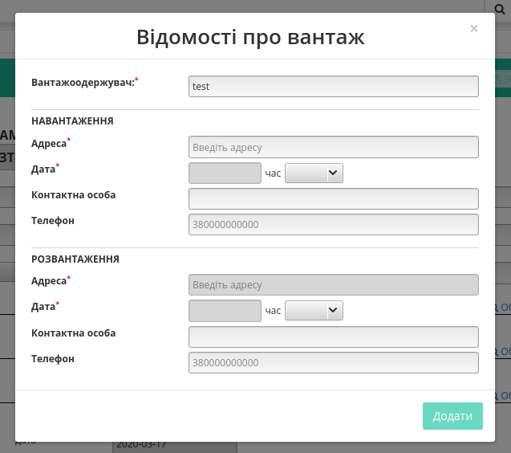

* Вантажоодержувач – необхідно обрати з випадаючого списку (для цього в рядку необхідно ввести мінімум 3 символи найменування/П.І.Б. вантажоодержувача, після цього обрати його з випадаючого списку), місцезнаходження/місце проживання буде додано автоматично;

.. hint::
    Для пункту навантаження та розвантаження заповнюються поля вказуються відповідні значення адрес, дат, контактних осіб, телефони.

* Адреса – необхідно обрати з випадаючого списку (для навантаження значення підтягуються з довідника **"Вантажовідправника"**, а для розвантаження - **"Вантажоодержувача"**);
* Дата та час навантаження/розвантаження - для кожної адреси вказуються кінцеві терміни в яких потрібно здійснити забір та доставку вантажу;
* Контактна особа та її телефон - вказуються для того, щоб водію було зрозуміло, до кого потрібно звертатись при навантаженні/розвантаженні.

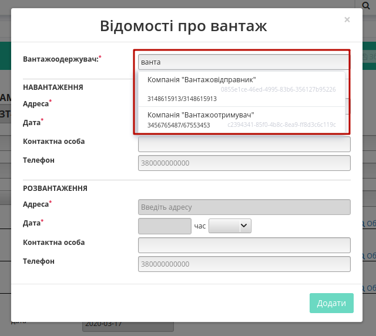

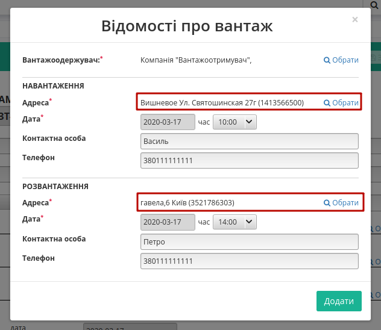

.. tip:: Для повторного вибору перевізника, вантажовідправника, вантажоодержувача, пунктів навантаження/розвантаження необхідно натиснути на кнопку "Обрати".

Для редагування інформації щодо вантажу необхідно навести курсор на рядок цього вантажу та натиснути "Змінити", для видалення – "Видалити".

.. image:: pics_Creation_signing_ending_rejection_Proposal/Creation_signing_ending_rejection_Proposal_31n.png
   :align: center

Для збереження "Замовлення транспортування" необхідно натиснути кнопку **"Зберегти"**, документ потрапить у папку **"Чернетки"**.

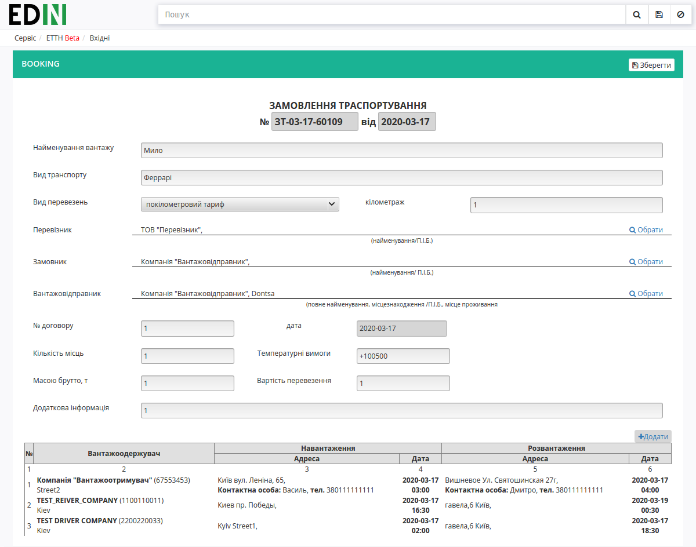

За необхідністю є можливість додати супровідні документи. Для цього необхідно натиснути на кнопку "Додати файл" (назва файлу повинна бути унікальною).

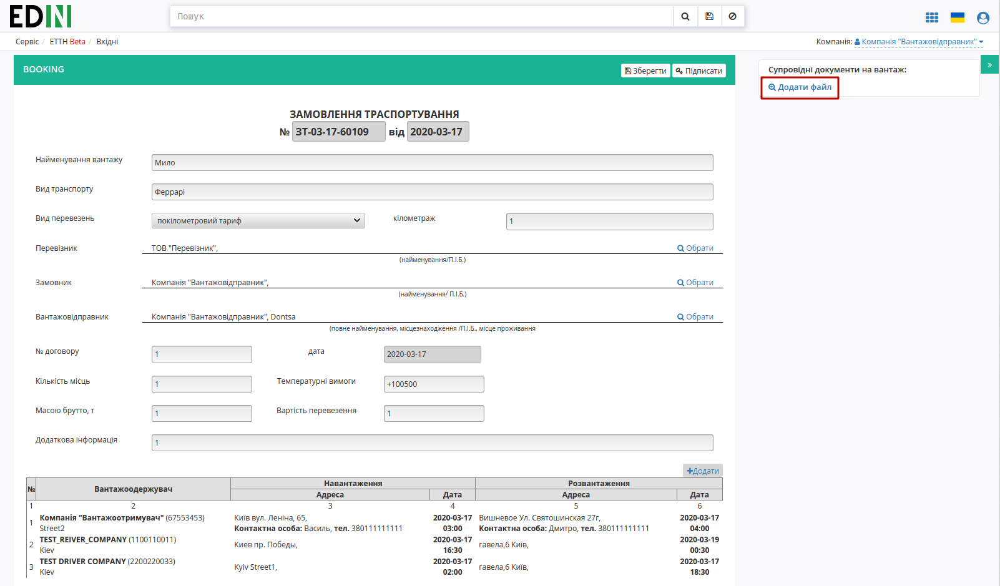

Для того щоб видалити доданий файл необхідно натиснути на іконку корзини. Для того щоб зберегти доданий файл необхідно натиснути на його назву.

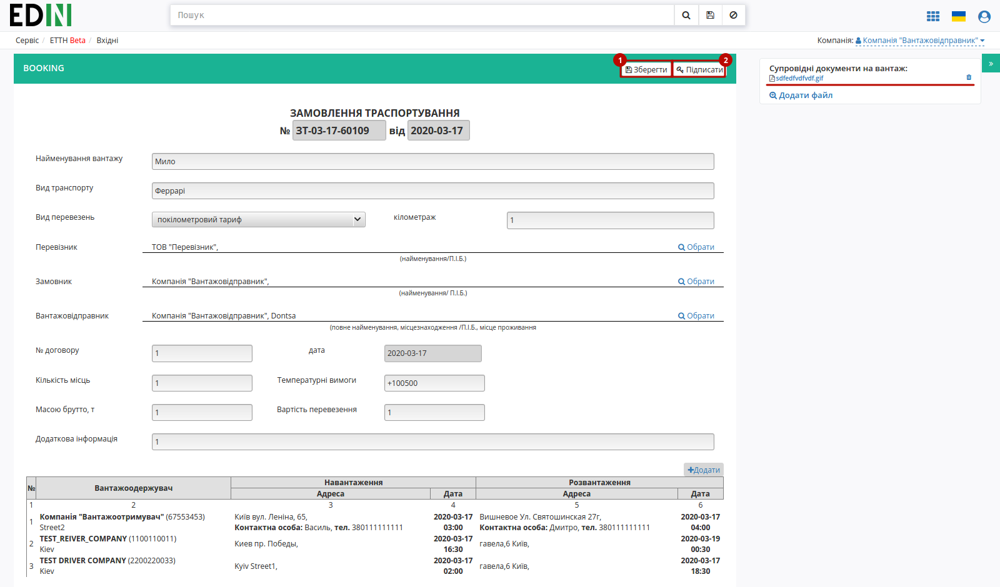

Після усіх проведених змін документ необхідно **"Зберегти"** (1) та **"Підписати"** (2).

.. _sign:

**1.1 Підписання та відправка "Замовлення транспортування" "Вантажовідправником"**
================================================================================================

Після ініціалізації бібліотеки підписання, система надасть можливість додати ключ для підписання. При :underline:`першому` підписанні у модальному вікні потрібно обрати файл чи токен (1), ввести пароль (2) та натиснути **"Считати"** (3) ключ для підписання:

.. image:: signing/file1.png
   :align: center

.. image:: signing/file2.png
   :align: center

При успішному додаванні ключа автоматично відобразиться особа, від імені якої буде здійснено підписання. У користувача може бути додано кілька ключів - для вибору потрібного для здійснення операції підписання потрібно проставити відмітку (4) лівою кнопкою миші і натиснути "Підписати" (5):

.. image:: signing/file3.png
   :align: center

.. important::
   Якщо підписання цим ключем вже було здійснено або знайдена невідповідність даних ЄДРПОУ/ІПН (перевірка), то підписання блокується, а користувачу виводиться відповідне повідомлення:

.. image:: signing/wrong_key.png
   :align: center

Додатково в вікні підписання можливо натиснути **"Детальніше"** для того, щоб переглянути інформацію про підписанта, обрати за необхідності посаду, скинути пароль активного ключа (|drop_pass|) чи видалити помилкові (|del_key|).

При подальшій роботі з раніше доданим ключем/-ами потрібно вводити лише пароль для обраного ключа:

.. image:: signing/file4.png
   :align: center

Після підписання "Замовлення транспортування" інформація щодо підписанта відображається в блоці "Підписанти". Для відправки "Замовлення транспортування" необхідно натинути на кнопку "Надіслати".

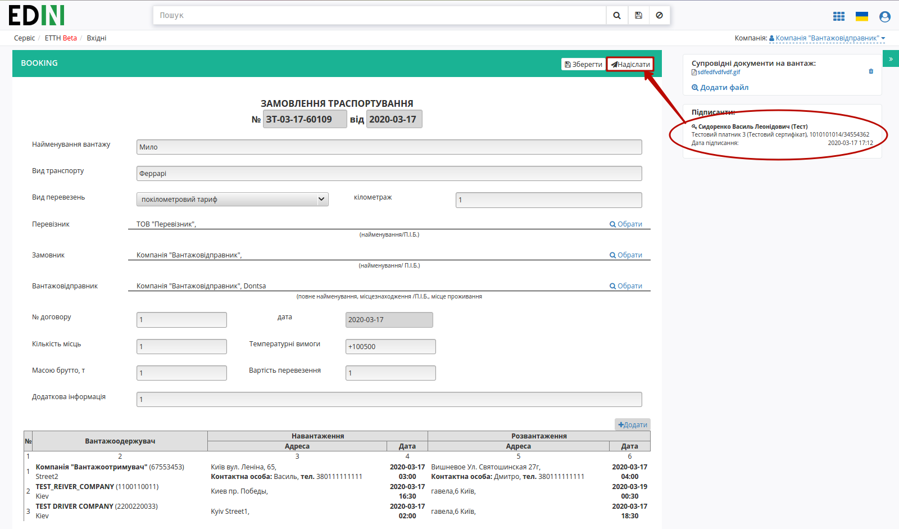

Після відправки документа контрагенту він відображається в журналі вихідних документів. Для відправленого **"Вантажовідправником"** "Замовлення транспортування"  присвоюється статус "У процесі":

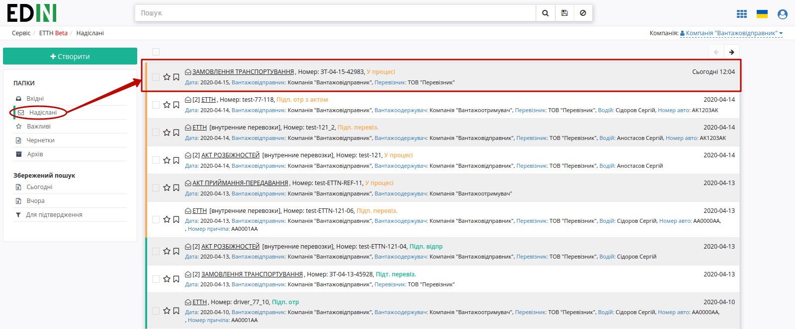

Відправлена "Замовлення транспортування" має наступний вигляд:

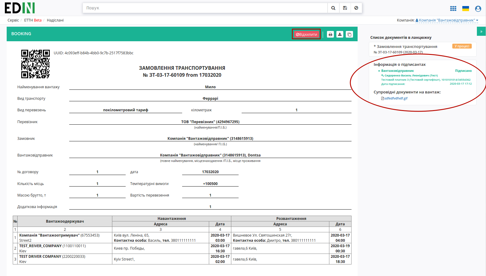

На формі "Замовлення транспортування" у лівій верхній частині відображаються QR-код та унікальний ідентифікатор документа.

Користувач може скористатись функціоналом для "Друку", "Завантаження" чи "Клонування"; також у разі виявлення помилки в документі у **"Вантажовідправника"** є можливість відхилити відправлене "Замовлення транспортування" **до підписання "Перевізником"**. Для цього потрібно натиснути на кнопку "Відхилити".

**1.2 Відхилення "Замовлення транспортування" "Вантажовідправником"**
---------------------------------------------------------------------------

Для того, щоб відхилити документ (доступно **до підписання "Перевізником"**) потрібно натиснути **"Відхилити"**. Після чого в модульному вікні обов'язково потрібно заповнити причину відміни документа:

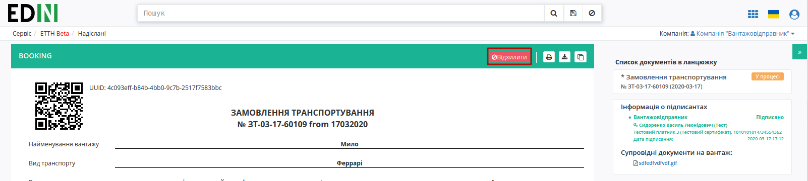

.. image:: pics_Creation_signing_ending_rejection_Proposal/Creation_signing_ending_rejection_Proposal_25.png
   :align: center

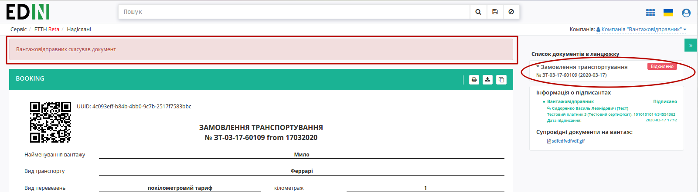

На платформі відображається повідомлення та змінюється статус документа в ланцюжку ("Відхилено").

**2 Отримання "Замовлення транспортування" "Перевізником"**
=================================================================================================================

Відправлене з боку **"Вантажовідправника"** "Замовлення транспортування" відображається в папці "Вхідні".

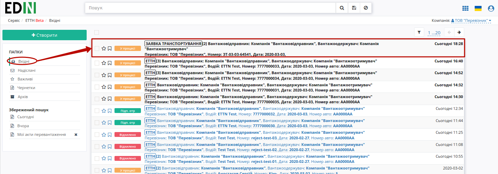

Вхідний підписаний документ можливо "Підтвердити" чи "Відхилити".

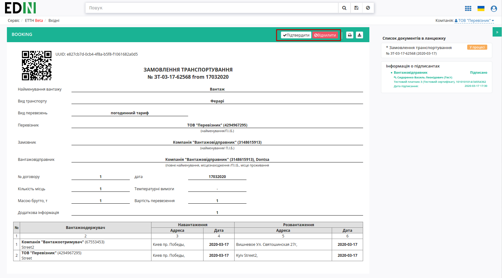

.. _confirmation:

**2.1 Підтвердження "Замовлення транспортування" та відправка "Підтвердження транспортування" "Перевізником"**
------------------------------------------------------------------------------------------------------------------------------------------

Після того, як водій чи **"Перевізник"** "підтверджує" документ, відкривається форма "Підтвердження транспортування", в якій необхідно заповнити відомості про водія та натиснути "Зберегти":

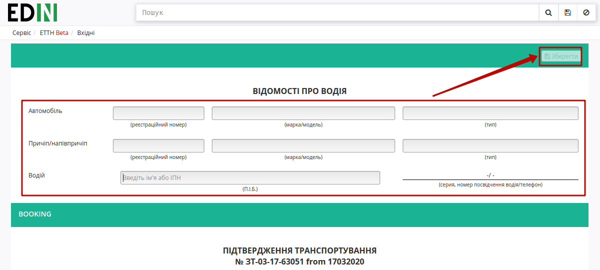

Для автомобілів та причепів реалізований автоматичний довідник, в який записуються "Реєстраційний номер", "Марка/модель", "Тип". Тож, наприклад, для раніше введеного реєстрайійного номеру BB1234BB користувач може скористатись пошуком (мінімум 3 символи): ``BB1, B12, 123, 234, 34B, 4BB``

.. image:: pics_Creation_signing_ending_rejection_Proposal/Creation_signing_ending_rejection_Proposal_43.png
   :align: center

Якщо водій відсутній в списку його можливо додати через кнопку **"Новий водій"**:

.. image:: pics_Creation_signing_ending_rejection_Proposal/Creation_signing_ending_rejection_Proposal_41n.png
   :align: center

Після чого в модальному вікні потрібно буде заповнити дані про водія ("Серія, номер посвідчення водія" заповнюється в форматі "3 заголовні латинські літери + 6 цифр", наприклад "DGJ123456"). Обов'язкові поля позначені червоною зірочкою :red:`*` . Доданий водій прив'язується в системі до вказаного **"Перевізника"**.

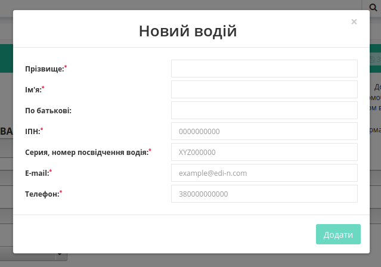

За необхідністю до "Підтвердження транспортування" також є можливість додати супровідні документи. Для цього необхідно натиснути на кнопку "Додати файл" (назва файлу повинна бути унікальною).

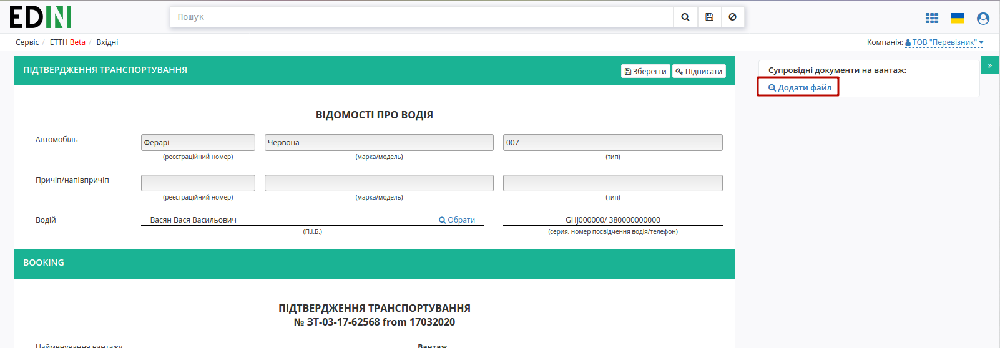

Для того щоб видалити доданий файл необхідно натиснути на іконку корзини. Для того щоб зберегти доданий файл необхідно натиснути на його назву.

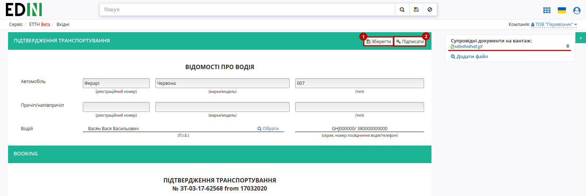

Після усіх проведених змін документ необхідно **"Зберегти"** (1) та **"Підписати"** (2).

.. hint::
    Процес підписання **"Перевізником"** не відрізняється від підписання **"Вантажовідправником"** та описаний в `розділі вище <https://wiki.edi-n.com/uk/latest/ETTN_2_0/Creation_signing_ending_rejection_Proposal.html#sign>`__ .

Після підписання в "Підтвердження транспортування" додається інформація щодо підписантів документа. Документ можливо **"Надіслати"** контрагенту (**"Вантажовідправнику"**): 

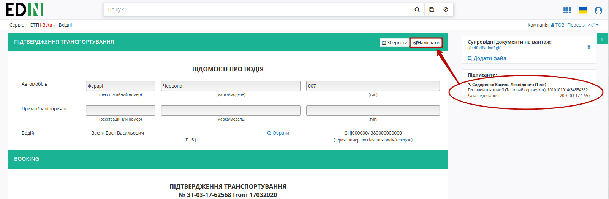

Підписаний документ відображається в журналі надісланих документів зі статусом "У процесі":

.. image:: pics_Creation_signing_ending_rejection_Proposal/Creation_signing_ending_rejection_Proposal_23.png
   :align: center

**2.2 Відхилення "Замовлення транспортування" "Перевізником"**
-------------------------------------------------------------------------------------

У **"Перевізника"** є можливість відхилити "Замовлення транспортування" **до її підтвердження**. Для цього потрібно натиснути на кнопку **"Відхилити"**. Після чого в модульному вікні обов'язково потрібно заповнити причину відміни документа:

.. image:: pics_Creation_signing_ending_rejection_Proposal/Creation_signing_ending_rejection_Proposal_25.png
   :align: center

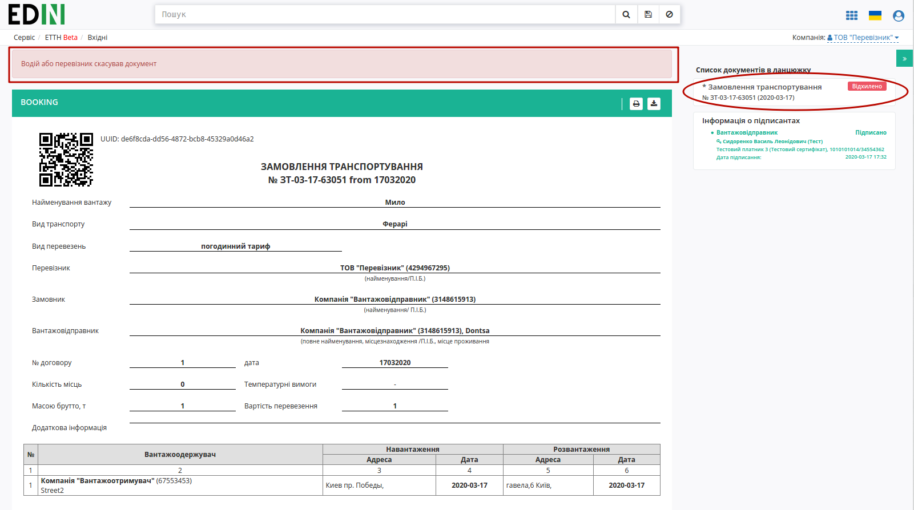

Для відхиленого перевізником "Замовлення транспортування" присвоєно статус "Відхилено". Документ з цим статусом відображається у "Вхідних" **"Перевізника"**.

**3 Отримання "Підтвердження транспортування" "Вантажовідправником"**
================================================================================================

Відправлене з боку **"Перевізника"** "Підтвердження транспортування" відображається в папці "Вхідні".

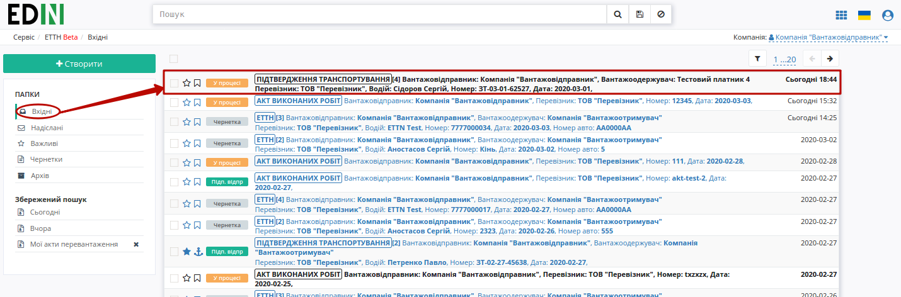

Вхідний відкритий підписаний документ доступно "Підписати" та "Відхилити".

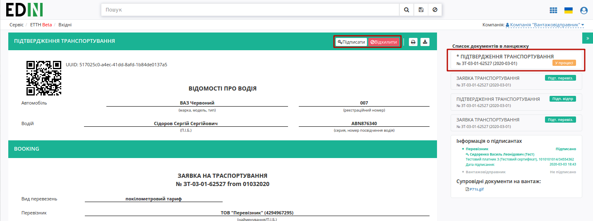

**3.1 Підписання "Підтвердження транспортування" "Вантажовідправником"**
-------------------------------------------------------------------------------------

Для підписання Підтвердження транспортування потрібно натиснути на кнопку **"Підписати"**.

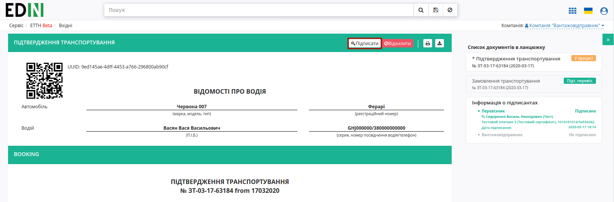

.. hint::
    Процес підписання **"Вантажовідправником"** вже описаний раніше в `розділі вище <https://wiki.edi-n.com/uk/latest/ETTN_2_0/Creation_signing_ending_rejection_Proposal.html#sign>`__ .

Після підписання інформаційне повідомлення сповіщає про те, що документообіг завершено ("Процес завершено"), а статус документа "Підтвердження транспортування" змінюється на "Підписано вантажовідправником".

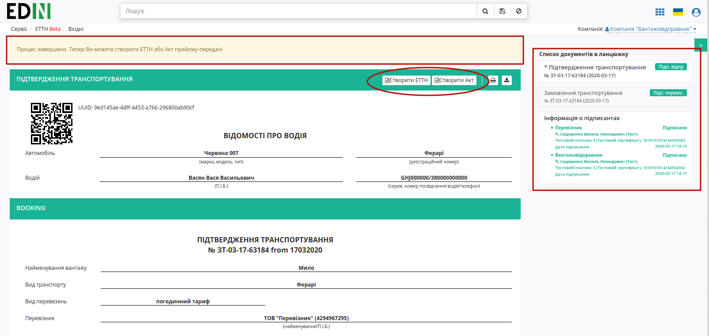

А на панелі підписаного "Підтвердження транспортування" з'являються дві кнопки:

1) **Створити ЕТТН** - дозволяє створити ЕТТН за вибраним **"Вантажовідправником"** (якщо їх було кілька в "Замовленні транспортування"):

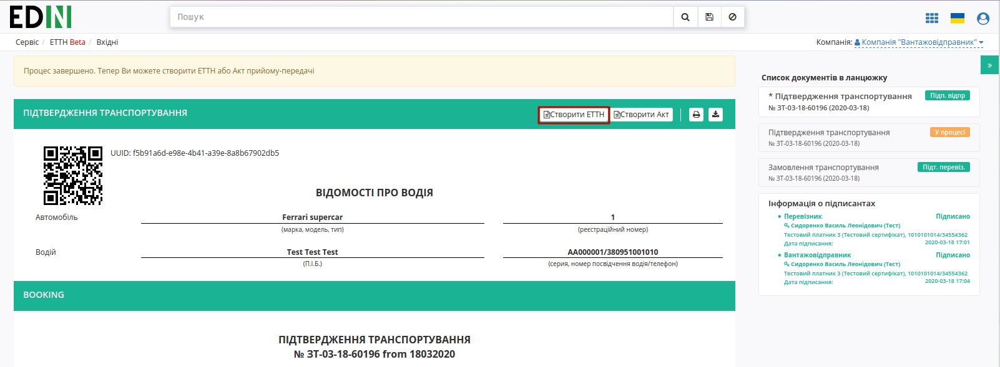

Необхідно вибрати для якої адреси із "Підтвердження транспортування" буде створено ЕТТН: 

.. image:: pics_Creation_signing_ending_rejection_Proposal/Creation_signing_ending_rejection_Proposal_36n.png
   :align: center

Після чого відкриється частково заповненя форма ЕТТН, що вже матиме зв'язок з раніше створеними документами:

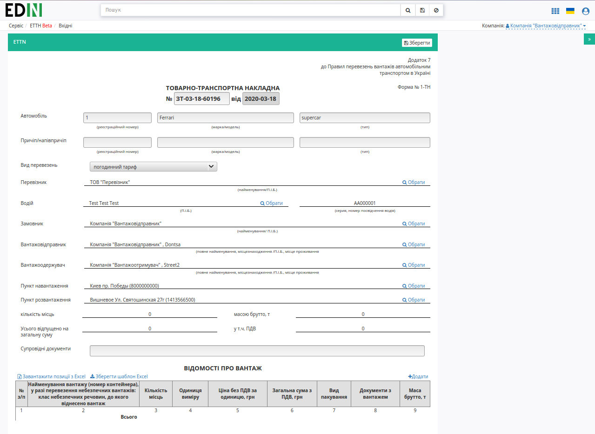

Детальніше про заповнення, підписання, відправку в `інструкції для роботи з "ЕТТН" <https://wiki.edi-n.com/uk/latest/ETTN_2_0/Creation_signing_ending_rejection_ETTN_shipper.html>`__ )

2) **Створити Акт** - дозволяє створити "Акт прийому-передачі" за вибраним **"Вантажовідправником"** (якщо їх було кілька в "Замовленні транспортування"):

.. image:: pics_Creation_signing_ending_rejection_Proposal/Creation_signing_ending_rejection_Proposal_38n.png
   :align: center

Необхідно вибрати для якої адреси із "Підтвердження транспортування" буде створено "Акт прийому-передачі": 

.. image:: pics_Creation_signing_ending_rejection_Proposal/Creation_signing_ending_rejection_Proposal_39n.png
   :align: center

Після чого відкриється частково заповненя форма "Акта прийому-передачі", що вже матиме зв'язок з раніше створеними документами:

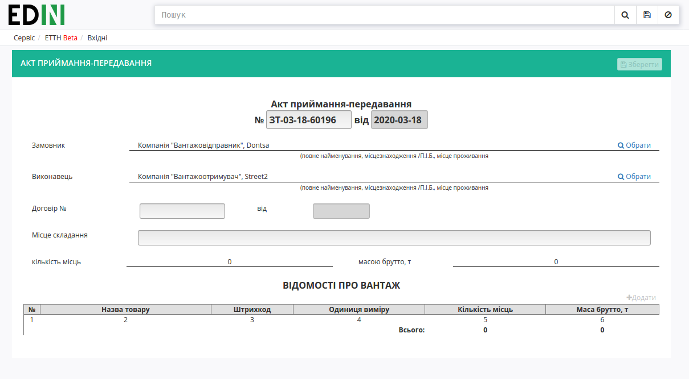

Детальніше про заповнення, підписання, відправку в `інструкції для роботи з "Актом прийому-передачі" <https://wiki.edi-n.com/uk/latest/ETTN_2_0/Work_with_acceptance_certificate.html>`__ )

**3.2 Відхилення "Підтвердження транспортування" "Вантажовідправником"**
------------------------------------------------------------------------------------

Для того, щоб відхилити документ потрібно натиснути **"Відхилити"**. 

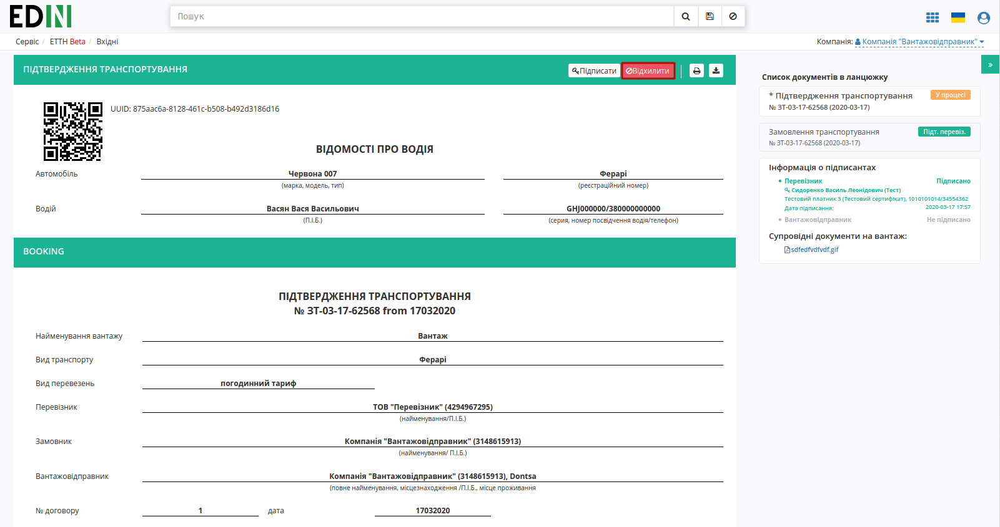

Після чого в модульному вікні обов'язково потрібно заповнити причину відміни документа:

.. image:: pics_Creation_signing_ending_rejection_Proposal/Creation_signing_ending_rejection_Proposal_25.png
   :align: center

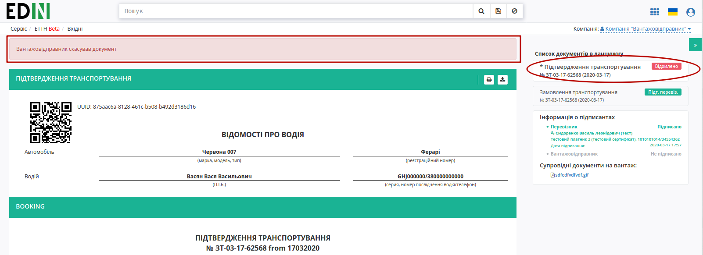

На платформі відображається повідомлення та змінюється статус документа в ланцюжку ("Відхилено").

.. include:: kontakti.rst
