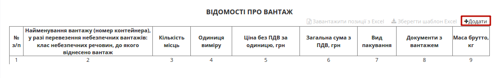
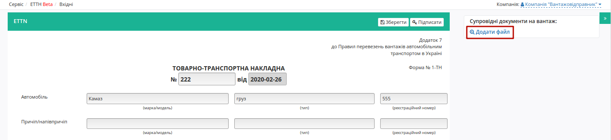
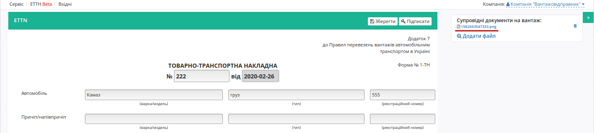
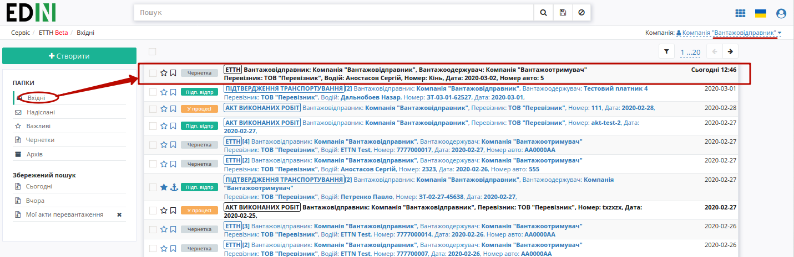
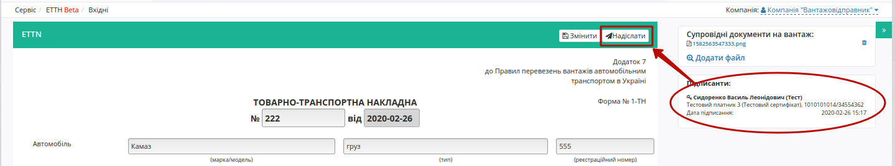
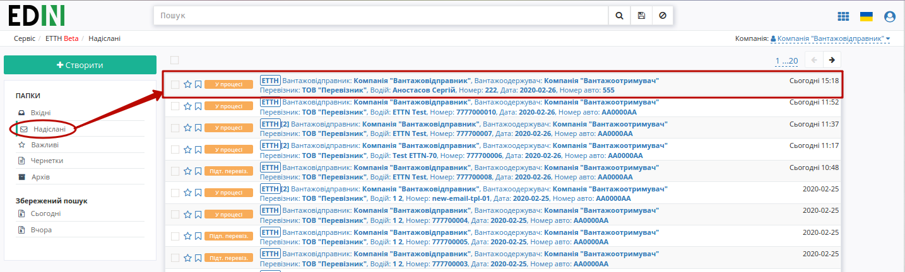
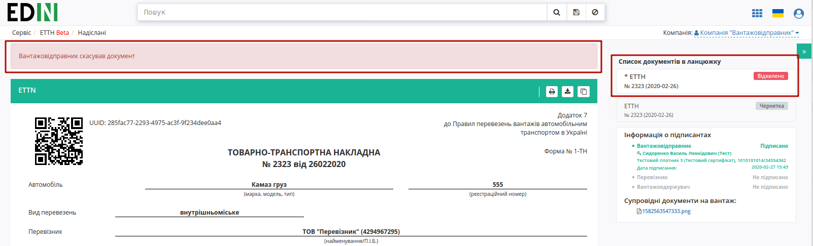
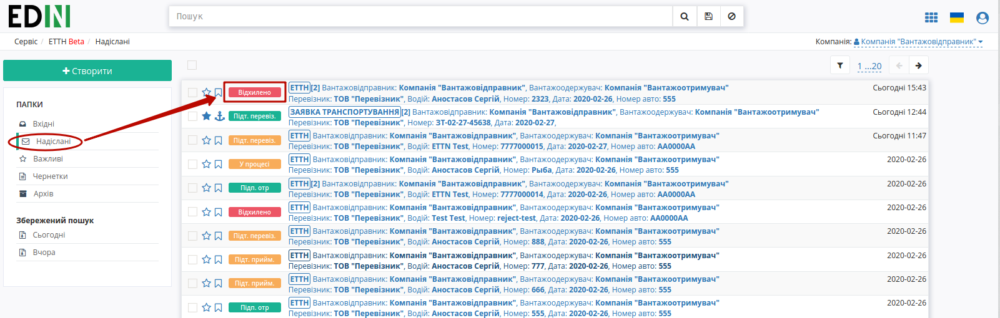

Заявка на транспортування (Створення, підписання, відправлення та відхилення)
###################################################################################################

.. role:: red

.. role:: underline

.. contents:: Зміст:
   :depth: 6

---------

При формуванні документообігу "Заявки на транспортування" ініціатором документа виступає користувач з роллю **"Вантажовідправник"** (в сервісі ETTN передбачені 3 основні ролі учасників документообігу: **"Вантажовідправник"**, **"Перевізник"**, **"Вантажоотримувач"**). Обмін документом здійснюється між **"Вантажовідправником"** та **"Перевізником"**.

**Створення документа**
================================================

Для створення "Заявки на транспортування" на платформі **"Вантажовідправнику"** необхідно натиснути на кнопку "Створити".

.. image:: pics_Creation_signing_ending_rejection_Proposal/Creation_signing_ending_rejection_Proposal_01.png
   :align: center

Після цього необхідно вибрати тип створюваного документа в модальному вікні:

.. image:: pics_Creation_signing_ending_rejection_Proposal/Creation_signing_ending_rejection_Proposal_02.png
   :align: center

Далі необхідно заповнити форму "Заявки на транспортування" (кнопка "Зберегти" активується лише для заповненої форми):

.. image:: pics_Creation_signing_ending_rejection_Proposal/Creation_signing_ending_rejection_Proposal_03.png
   :align: center

.. important::
    Вибір компаній, водія, адрес навантаження/розвантаження доступний лише з випадаючого списку!

* За замовчуванням формується номер та вказується поточна дата;
* Вид перевезень (покілометровий тариф, погодинний тариф, відрядний тариф, централізоване перевезення, внутрішньоміське, приміське, міжміське, міжнародне перевезення);
* Перевізник – необхідно обрати з випадаючого списку (для цього в рядку необхідно ввести мінімум 3 символи найменування/П.І.Б. перевізника, після цього обрати його з випадаючого списку);
* Замовник – необхідно обрати з випадаючого списку (для цього в рядку необхідно ввести мінімум 3 символи найменування/П.І.Б. перевізника, після цього обрати його з випадаючого списку);
* Вантажовідправник – необхідно обрати з випадаючого списку (для цього в рядку необхідно ввести мінімум 3 символи найменування/П.І.Б. вантажовідправника, після цього обрати його з випадаючого списку), місцезнаходження/місце проживання буде додано автоматично;
* Вантажоодержувач – необхідно обрати з випадаючого списку (для цього в рядку необхідно ввести мінімум 3 символи найменування/П.І.Б. вантажоодержувача, після цього обрати його з випадаючого списку), місцезнаходження/місце проживання буде додано автоматично;
* Пункт навантаження – необхідно поставити курсор в рядок та обрати його з випадаючого списку;
* Пункт розвантаження – необхідно поставити курсор в рядок та обрати його з випадаючого списку;
* Вид транспорту / Кількість місць / Температурні вимоги / Масою брутто / Вартість перевезення – в цих полях **"Вантажовідправником"** заповнюються вимоги до транспорту

Якщо адреси у вказаному списку немає, то її можливо додати вручну через кнопку **"Нова адреса"**:

.. image:: pics_Creation_signing_ending_rejection_ETTN_shipper/Creation_signing_ending_rejection_ETTN_shipper_27n.png
   :align: center

Після чого в модальному вікні потрібно буде додати населений пункт, адресу та вибрати КОАТУУ (в цьому рядку можливо здійснювати пошук по назві чи коду). Код КОАТУУ вказується автоматично. Додана адреса навантаження прив'язується в системі до вказаного **"Вантажовідправника"**, а адреса розвантаження - до **"Вантажоодержувача"**.

.. image:: pics_Creation_signing_ending_rejection_ETTN_shipper/Creation_signing_ending_rejection_ETTN_shipper_28n.png
   :align: center

.. image:: pics_Creation_signing_ending_rejection_ETTN_shipper/Creation_signing_ending_rejection_ETTN_shipper_29n.png
   :align: center

* Натиснути на кнопку "Додати" для заповненя вартісно-кількісних показників та табличної частини.

Після натискання на кнопку "Додати" відкриється модальне вікно, де необхідно заповнити рядки (найменування вантажу, кількість місць, одиниця виміру, ціна без ПДВ, вид пакування (необов’язково), маса брутто, кількість або назва документів з вантажем) та натиснути на кнопку "Додати".

.. image:: pics_Creation_signing_ending_rejection_ETTN_shipper/Creation_signing_ending_rejection_ETTN_shipper_05n.png
   :align: center

Також для додавання табличних даних (вантаж) є можливість скористатись шаблоном. Для цього над таблицею необхідно натиснути **"Зберегти шаблон Excel"** (1).

.. image:: pics_Creation_signing_ending_rejection_ETTN_shipper/Creation_signing_ending_rejection_ETTN_shipper_06n.png
   :align: center

На Ваш комп’ютер буде завантажено файл з назвою **ettn_products_sample.xlsx**. Відкривши його, необхідно внести інформацію про вантаж.

Обов’язкові для заповнення поля (поля відмічені червоним кольором):

* Найменування
* Кількість
* Одиниці виміру
* Ціна
* Маса брутто, кг
* Документи

.. important:: Ні в якому разі не змінювати формат шаблону, не видаляти або додавати нові стовпці. Також не допускається зміна формату комірок.

Після збереження заповненої інформації завантажуємо файл на веб-портал, скориставшись кнопкою **"Завантажити позиції з Excel"** (2).

За необхідністю є можливість додавати ще вантаж(і), для цього необхідно натиснути на кнопку **"Додати"** та заповнити інформацію в модальному вікні.

Для редагування інформації щодо вантажу необхідно навести курсор на рядок цього вантажу та натиснути "Змінити", для видалення – "Видалити".

.. image:: pics_Creation_signing_ending_rejection_ETTN_shipper/Creation_signing_ending_rejection_ETTN_shipper_07n.png
   :align: center

.. tip:: Для повторного вибору перевізника, водія, вантажовідправника, вантажоодержувача, пунктів навантаження/розвантаження необхідно натиснути на кнопку "Обрати".

Для збереження е-ТТН необхідно натиснути кнопку **"Зберегти"**, документ потрапить у папку **"Чернетки"**.

За необхідністю є можливість додати супровідні документи на вантаж. Для цього необхідно натиснути на кнопку "Додати файл" (назва файлу повина бути унікальною).

Для того щоб видалити доданий файл необхідно натиснути на іконку корзини. Для того щоб зберегти доданий файл необхідно натиснути на його назву.

Для підписання е-ТТН необхідно натинути на кнопку "Підписати".

.. image:: pics_Creation_signing_ending_rejection_ETTN_shipper/Creation_signing_ending_rejection_ETTN_shipper_10n.png
   :align: center

**Створення документа на підставі чернетки Перевізника чи Вантажоотримувача**
----------------------------------------------------------------------------------

Існують схеми документообігу, в яких ініціатором виступає не **"Вантажовідправник"**, а **"Перевізник"** чи **"Вантажоотримувач"**. В такому випадку ініціатор створює та відправляє документ-чернетку, яку не потрібно підписувати. 

Далі згідно `оберненої схеми <https://wiki.edi-n.com/uk/latest/ETTN_2_0/Work_with_ETTN.html#reverse-schema>`__ документообігу контрагент з роллю **"Вантажовідправник"** отримує документ-чернетку:

Для ролі **"Вантажовідправника"** вхідний документ-чернетка відображається з інформативною підказкою і дозволяє **"Створити"** на основі вхідної чернетки документ, що потребує підписання:

.. image:: pics_Creation_signing_ending_rejection_ETTN_shipper/Creation_signing_ending_rejection_ETTN_shipper_22n.png
   :align: center

В створений такий чином документ копіюється вся інформація та вкладення з чернетки. Документ може бути відредагований, після чого його потрібно **"Зберегти"** (1) та **"Підписати"** (2) (детальніше про підписання в наступному розділі).

.. image:: pics_Creation_signing_ending_rejection_ETTN_shipper/Creation_signing_ending_rejection_ETTN_shipper_23n.png
   :align: center

Особливостю такого документообігу є те, що в ланцюжку документів присутня чернетка, як документ-ініціатор документообігу:

.. image:: pics_Creation_signing_ending_rejection_ETTN_shipper/Creation_signing_ending_rejection_ETTN_shipper_24n.png
   :align: center

**Підписання та відправка документа**
================================================

Після ініціалізації бібліотеки підписання, система надасть можливість додати ключ для підписання. При :underline:`першому` підписанні необхідно додати файловий ключ. Для цього у модальному вікні потрібно обрати файл (2) і ввести пароль (1):

.. image:: pics_Creation_signing_ending_rejection_ETTN_shipper/Creation_signing_ending_rejection_ETTN_shipper_11n.png
   :align: center

Після чого натиснути кнопку **"Додати"**:

.. image:: pics_Creation_signing_ending_rejection_ETTN_shipper/Creation_signing_ending_rejection_ETTN_shipper_12n.png
   :align: center

При успішному додаванні ключа автоматично відобразиться вибрана особа, від імені якої буде здійснено підписання (кнопка **"Підписати"**):

.. image:: pics_Creation_signing_ending_rejection_ETTN_shipper/Creation_signing_ending_rejection_ETTN_shipper_13n.png
   :align: center

При подальшій роботі з раніше доданим ключем/-ами потрібно вводити лише пароль для обраного ключа:

.. image:: pics_Creation_signing_ending_rejection_ETTN_shipper/Creation_signing_ending_rejection_ETTN_shipper_14n.png
   :align: center

Після підписання е-ТТН інформація щодо підписанта відображається в блоці "Підписанти". Для відправки е-ТТН необхідно натинути на кнопку "Надіслати".

.. image:: pics_Creation_signing_ending_rejection_ETTN_shipper/Creation_signing_ending_rejection_ETTN_shipper_16n.png
   :align: center

Після відправки документа контрагенту він відображається в журналі вихідних документів. Для відправленної вантажовідправником е-ТТН присвоєно статус "У процесі":

Відправлена е-ТТН має наступний вигляд:

.. image:: pics_Creation_signing_ending_rejection_ETTN_shipper/Creation_signing_ending_rejection_ETTN_shipper_18n.png
   :align: center

На формі е-ТТН у лівій верхній частині відображаються QR-код та унікальний ідентифікатор документа.

Користувач може скористатись функціоналом для "Друку", "Завантаження" чи "Клонування" (1); також у разі виявлення помилки в документі у **"Вантажовідправника"** є можливість відхилити відправлену е-ТТН **до підписання "Перевізником"**. Для цього потрібно натиснути на кнопку "Відхилити" (2).

**Відхилення документа**
================================================

Для того, щоб відхилит документ (доступно **до підписання "Перевізником"**) потрібно натиснути **"Відхилити"**.

На платформі відображається повідомлення та змінюється статус документа в ланцюжку ("Відхилено").

.. include:: kontakti.rst
