Заявка на транспортування (Створення, підписання, відправлення та відхилення)
###################################################################################################

.. role:: red

.. role:: green

.. role:: underline

.. contents:: Зміст:
   :depth: 6

---------

При формуванні документообігу "Заявки на транспортування" ініціатором документа виступає користувач з роллю **"Вантажовідправник"** (в сервісі ETTN передбачені 3 основні ролі учасників документообігу: **"Вантажовідправник"**, **"Перевізник"**, **"Вантажоотримувач"**). Обмін документом здійснюється між **"Вантажовідправником"** та **"Перевізником"**:

:green:`"Вантажовідправник" -> "Перевізник" -> "Вантажовідправник"`

**Створення "Заявки на транспортування" "Вантажовідправником"**
================================================================================================

Для створення "Заявки на транспортування" на платформі **"Вантажовідправнику"** необхідно натиснути на кнопку "Створити".

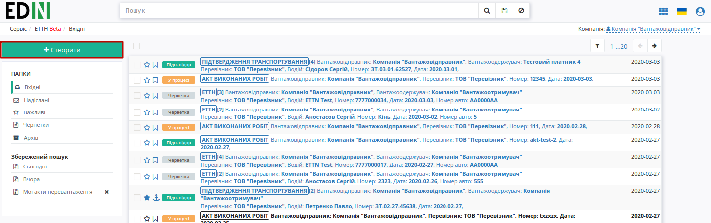

Після цього необхідно вибрати тип створюваного документа в модальному вікні:

.. image:: pics_Creation_signing_ending_rejection_Proposal/Creation_signing_ending_rejection_Proposal_02.png
   :align: center

Далі необхідно заповнити форму "Заявки на транспортування" (кнопка "Зберегти" активується лише для заповненої форми):

.. image:: pics_Creation_signing_ending_rejection_Proposal/Creation_signing_ending_rejection_Proposal_03.png
   :align: center

.. important::
    Вибір компаній, водія, адрес навантаження/розвантаження доступний лише з випадаючого списку!

* За замовчуванням формується номер та вказується поточна дата;
* Вид перевезень (покілометровий тариф, погодинний тариф, відрядний тариф, централізоване перевезення, внутрішньоміське, приміське, міжміське, міжнародне перевезення);
* Перевізник – необхідно обрати з випадаючого списку (для цього в рядку необхідно ввести мінімум 3 символи найменування/П.І.Б. перевізника, після цього обрати його з випадаючого списку);
* Замовник – необхідно обрати з випадаючого списку (для цього в рядку необхідно ввести мінімум 3 символи найменування/П.І.Б. перевізника, після цього обрати його з випадаючого списку);
* Вантажовідправник – необхідно обрати з випадаючого списку (для цього в рядку необхідно ввести мінімум 3 символи найменування/П.І.Б. вантажовідправника, після цього обрати його з випадаючого списку), місцезнаходження/місце проживання буде додано автоматично;
* Вантажоодержувач – необхідно обрати з випадаючого списку (для цього в рядку необхідно ввести мінімум 3 символи найменування/П.І.Б. вантажоодержувача, після цього обрати його з випадаючого списку), місцезнаходження/місце проживання буде додано автоматично;
* Пункт навантаження – необхідно поставити курсор в рядок та обрати його з випадаючого списку;
* Пункт розвантаження – необхідно поставити курсор в рядок та обрати його з випадаючого списку;

Якщо адреси у вказаному списку немає, то її можливо додати вручну через кнопку **"Нова адреса"**:

.. image:: pics_Creation_signing_ending_rejection_Proposal/Creation_signing_ending_rejection_Proposal_04.png
   :align: center

Після чого в модальному вікні потрібно буде додати населений пункт, адресу та вибрати КОАТУУ (в цьому рядку можливо здійснювати пошук по назві чи коду). Код КОАТУУ вказується автоматично. Додана адреса навантаження прив'язується в системі до вказаного **"Вантажовідправника"**, а адреса розвантаження - до **"Вантажоодержувача"**.

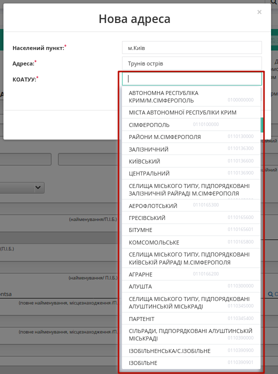

.. image:: pics_Creation_signing_ending_rejection_Proposal/Creation_signing_ending_rejection_Proposal_06.png
   :align: center

* Вид транспорту / Кількість місць / Температурні вимоги / Масою брутто / Вартість перевезення – в цих полях **"Вантажовідправником"** заповнюються вимоги до транспорту

.. tip:: Для повторного вибору перевізника, водія, вантажовідправника, вантажоодержувача, пунктів навантаження/розвантаження необхідно натиснути на кнопку "Обрати".

Для збереження "Заявки на транспортування" необхідно натиснути кнопку **"Зберегти"**, документ потрапить у папку **"Чернетки"**.

За необхідністю є можливість додати супровідні документи. Для цього необхідно натиснути на кнопку "Додати файл" (назва файлу повинна бути унікальною).

.. image:: pics_Creation_signing_ending_rejection_Proposal/Creation_signing_ending_rejection_Proposal_07.png
   :align: center

Для того щоб видалити доданий файл необхідно натиснути на іконку корзини. Для того щоб зберегти доданий файл необхідно натиснути на його назву.

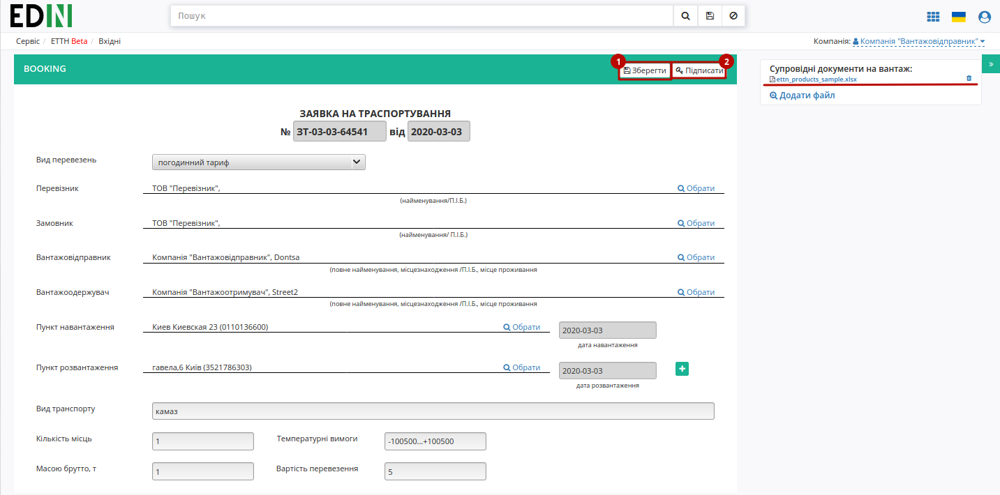

Після усіх проведених змін документ необхідно **"Зберегти"** (1) та **"Підписати"** (2).

.. _sign:

**Підписання та відправка "Заявки на транспортування" "Вантажовідправником"**
================================================================================================

Після ініціалізації бібліотеки підписання, система надасть можливість додати ключ для підписання. При :underline:`першому` підписанні необхідно додати файловий ключ. Для цього у модальному вікні потрібно обрати файл (2) і ввести пароль (1):

.. image:: pics_Creation_signing_ending_rejection_Proposal/Creation_signing_ending_rejection_Proposal_09.png
   :align: center

Після чого натиснути кнопку **"Додати"**:

.. image:: pics_Creation_signing_ending_rejection_Proposal/Creation_signing_ending_rejection_Proposal_10.png
   :align: center

При успішному додаванні ключа автоматично відобразиться вибрана особа, від імені якої буде здійснено підписання (кнопка **"Підписати"**):

.. image:: pics_Creation_signing_ending_rejection_Proposal/Creation_signing_ending_rejection_Proposal_11.png
   :align: center

При подальшій роботі з раніше доданим ключем/-ами потрібно вводити лише пароль для обраного ключа:

.. image:: pics_Creation_signing_ending_rejection_Proposal/Creation_signing_ending_rejection_Proposal_12.png
   :align: center

Після підписання "Заявки на транспортування" інформація щодо підписанта відображається в блоці "Підписанти". Для відправки "Заявки на транспортування" необхідно натинути на кнопку "Надіслати".

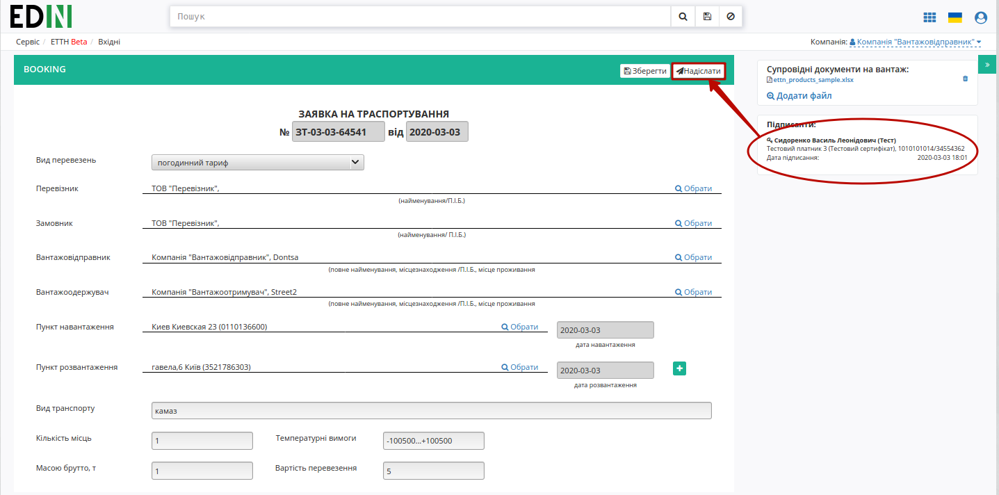

Після відправки документа контрагенту він відображається в журналі вихідних документів. Для відправленної **"Вантажовідправником"** "Заявки на транспортування"  присвоюється статус "У процесі":

.. image:: pics_Creation_signing_ending_rejection_Proposal/Creation_signing_ending_rejection_Proposal_14.png
   :align: center

Відправлена "Заявка на транспортування" має наступний вигляд:

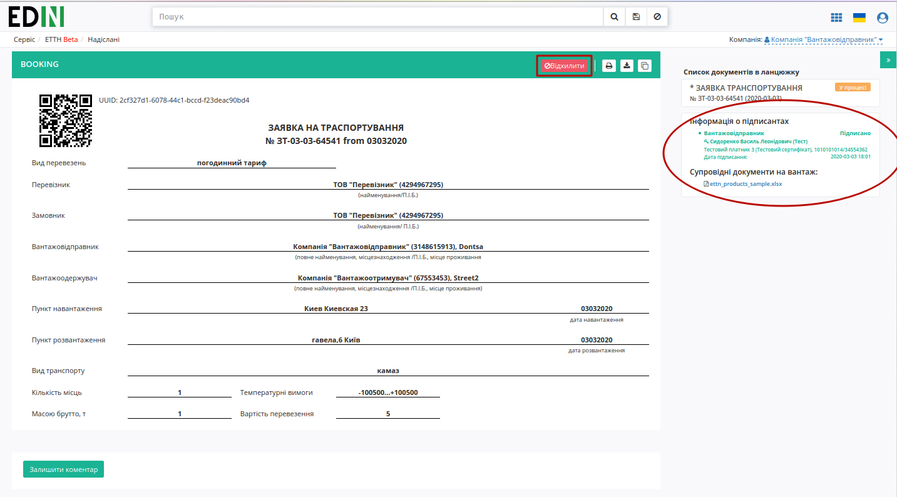

На формі "Заявки на транспортування" у лівій верхній частині відображаються QR-код та унікальний ідентифікатор документа.

Користувач може скористатись функціоналом для "Друку", "Завантаження" чи "Клонування"; також у разі виявлення помилки в документі у **"Вантажовідправника"** є можливість відхилити відправлену "Заявку на транспортування" **до підписання "Перевізником"**. Для цього потрібно натиснути на кнопку "Відхилити".

**Відхилення "Заявки на транспортування" "Вантажовідправником"**
---------------------------------------------------------------------------

Для того, щоб відхилити документ (доступно **до підписання "Перевізником"**) потрібно натиснути **"Відхилити"**. Після чого в модульному вікні обов'язково потрібно заповнити причину відміни документа:

.. image:: pics_Creation_signing_ending_rejection_Proposal/Creation_signing_ending_rejection_Proposal_25.png
   :align: center

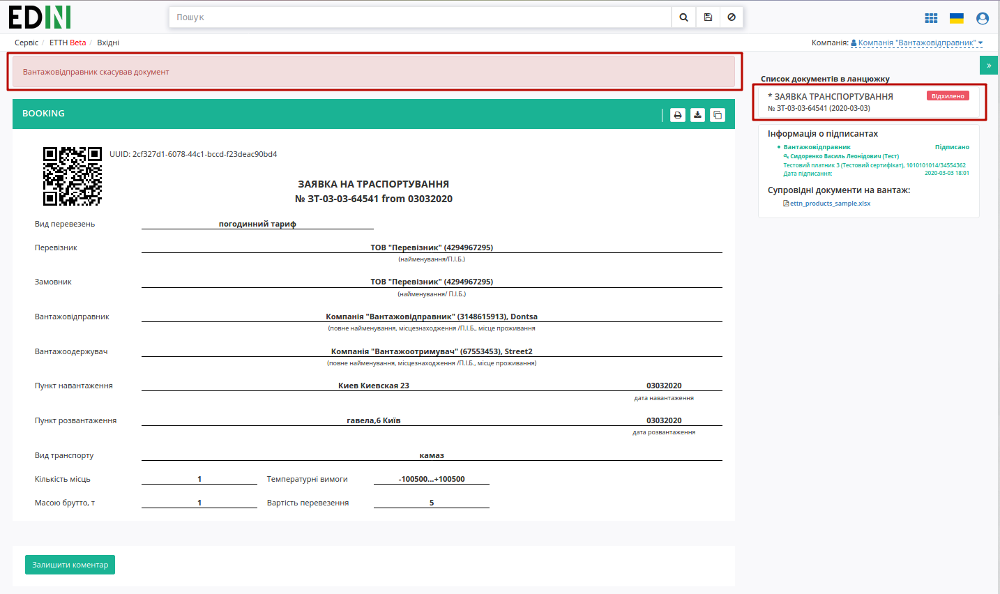

На платформі відображається повідомлення та змінюється статус документа в ланцюжку ("Відхилено").

**Підтвердження "Заявки на транспортування" та відправка "Підтвердження транспортування" "Перевізником"**
=================================================================================================================

Відправлена з боку **"Вантажовідправника"** "Заявка на транспортування" відображається в папці "Вхідні".

.. image:: pics_Creation_signing_ending_rejection_Proposal/Creation_signing_ending_rejection_Proposal_17.png
   :align: center

Вхідний підписаний документ дозволяє "Підтвердити" та "Відхилити" документ.

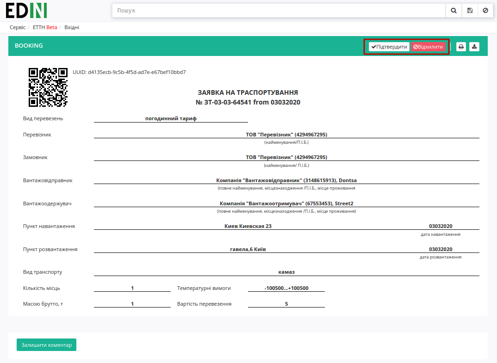

Після того, як водій чи **"Перевізник"** "підтверджує" документ, відкривається форма "Підтвердження транспортування", в якій необхідно заповнити відомості про водія та натиснути "Зберегти":

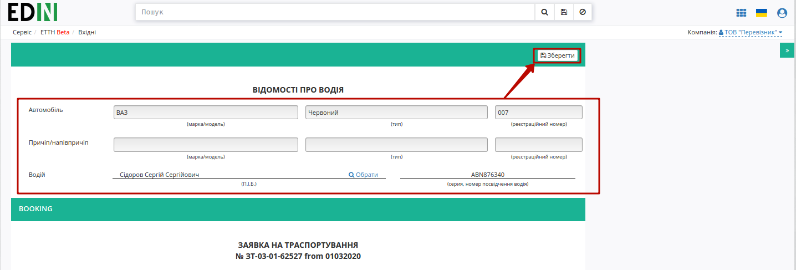

За необхідністю до "Підтвердження транспортування" також є можливість додати супровідні документи. Для цього необхідно натиснути на кнопку "Додати файл" (назва файлу повинна бути унікальною).

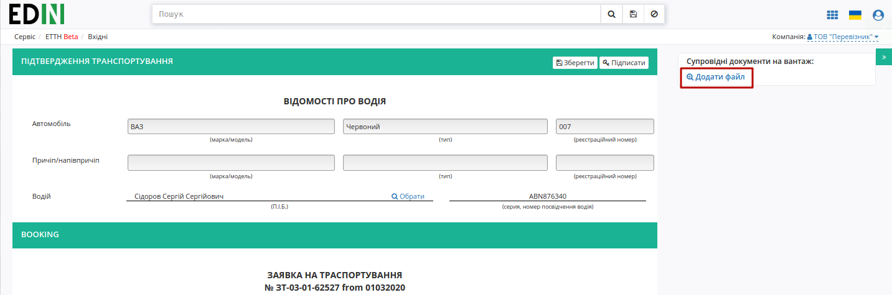

Для того щоб видалити доданий файл необхідно натиснути на іконку корзини. Для того щоб зберегти доданий файл необхідно натиснути на його назву.

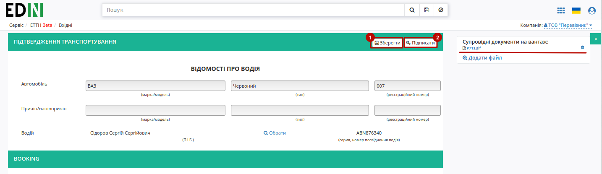

Після усіх проведених змін документ необхідно **"Зберегти"** (1) та **"Підписати"** (2).

.. hint::
    Процес підписання **"Перевізником"** не відрізняється від підписання **"Вантажовідправником"** та описаний в `розділі вище <https://wiki.edi-n.com/uk/latest/ETTN_2_0/Work_with_ETTN.html#sign>`__ .

Після підписання в "Підтвердження транспортування" додається інформація щодо підписантів документа. Документ можливо **"Надіслати"** контрагенту (**"Вантажовідправнику"**): 

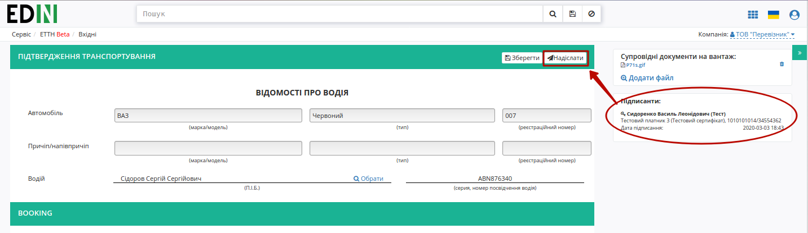

Підписаний документ відображається в журналі надісланих документів зі статусом "У процесі":

.. image:: pics_Creation_signing_ending_rejection_Proposal/Creation_signing_ending_rejection_Proposal_23.png
   :align: center

**Відхилення "Заявки на транспортування" "Перевізником"**
=============================================================================

У **"Перевізника"** є можливість відхилити "Заявку на транспортування" **до її підтвердження**. Для цього потрібно натиснути на кнопку **"Відхилити"**. Після чого в модульному вікні обов'язково потрібно заповнити причину відміни документа:

.. image:: pics_Creation_signing_ending_rejection_Proposal/Creation_signing_ending_rejection_Proposal_25.png
   :align: center

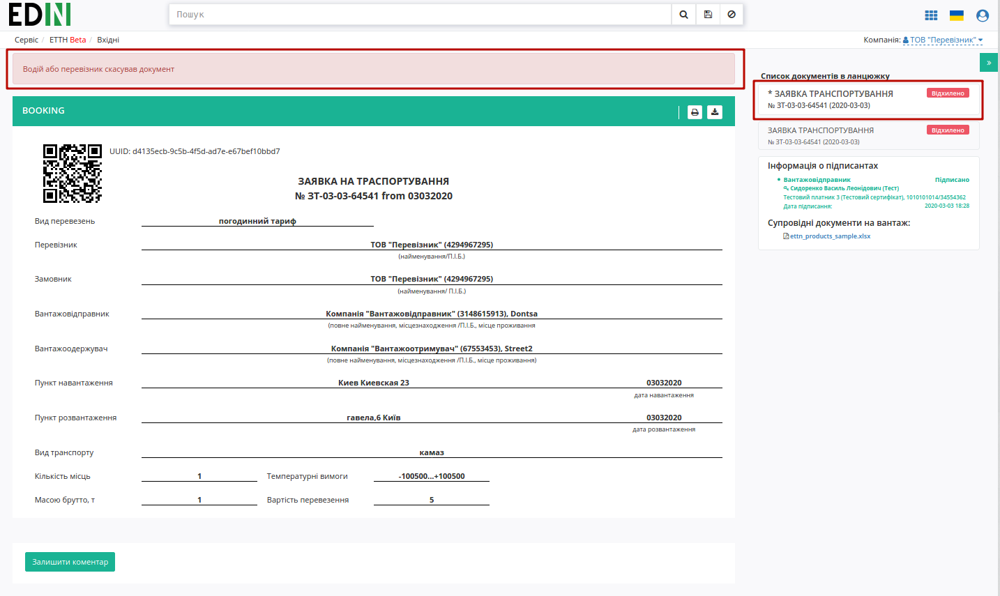

Для відхиленної перевізником "Заявки на транспортування" присвоєно статус "Відхилено". Документ з цим статусом відображається у "Вхідних" **"Перевізника"**.

**Підписання "Підтвердження транспортування" "Вантажовідправником"**
================================================================================================

Відправлене з боку **"Перевізника"** "Підтвердження транспортування" відображається в папці "Вхідні".

.. image:: pics_Creation_signing_ending_rejection_Proposal/Creation_signing_ending_rejection_Proposal_26.png
   :align: center

Вхідний відкритий підписаний документ доступно "Підписати" та "Відхилити".

.. image:: pics_Creation_signing_ending_rejection_Proposal/Creation_signing_ending_rejection_Proposal_27.png
   :align: center

.. hint::
    Процес підписання **"Перевізником"** не відрізняється від підписання **"Вантажовідправником"** та описаний в `розділі вище <https://wiki.edi-n.com/uk/latest/ETTN_2_0/Work_with_ETTN.html#sign>`__ .

**Відхилення "Підтвердження транспортування" "Вантажовідправником"**
=======================================================================================

Для того, щоб відхилити документ потрібно натиснути **"Відхилити"**. Після чого в модульному вікні обов'язково потрібно заповнити причину відміни документа:

.. image:: pics_Creation_signing_ending_rejection_Proposal/Creation_signing_ending_rejection_Proposal_25.png
   :align: center

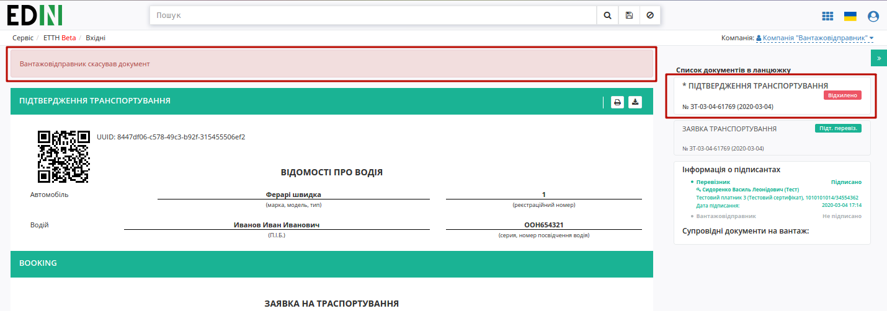

На платформі відображається повідомлення та змінюється статус документа в ланцюжку ("Відхилено").

.. include:: kontakti.rst
