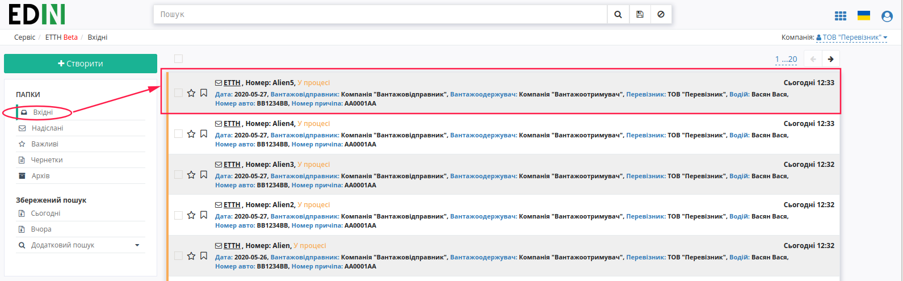
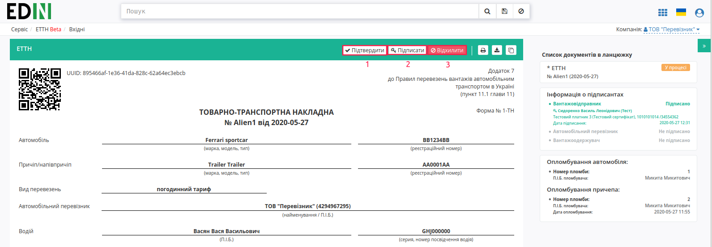
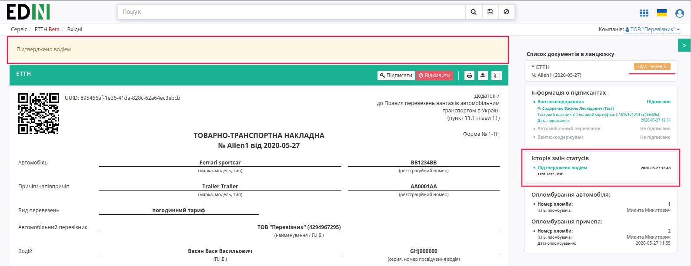
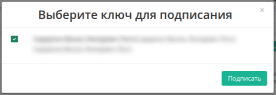
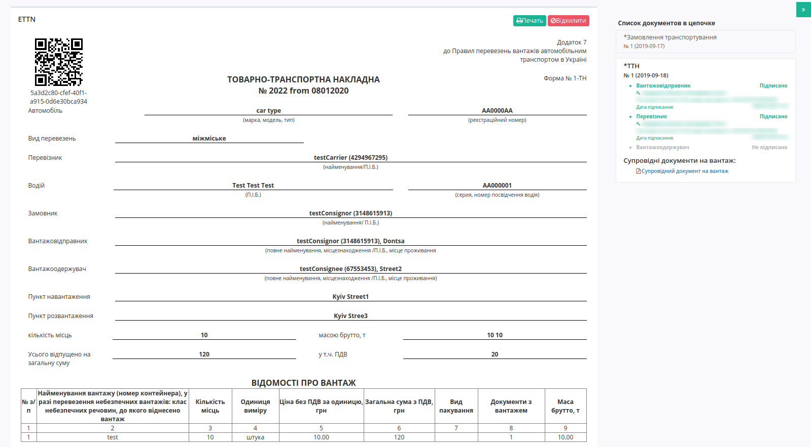
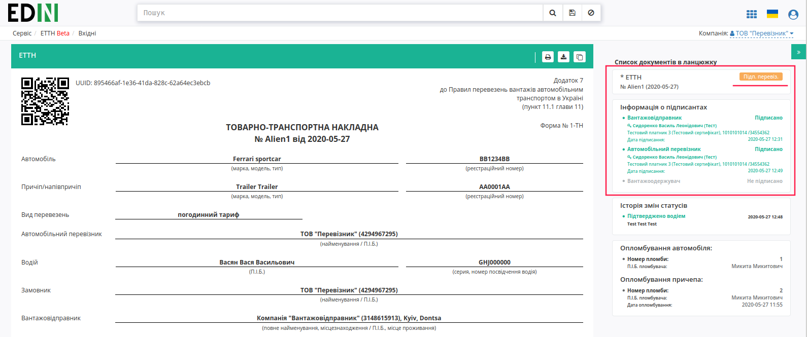
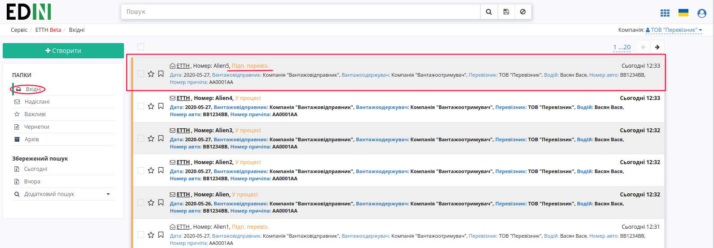
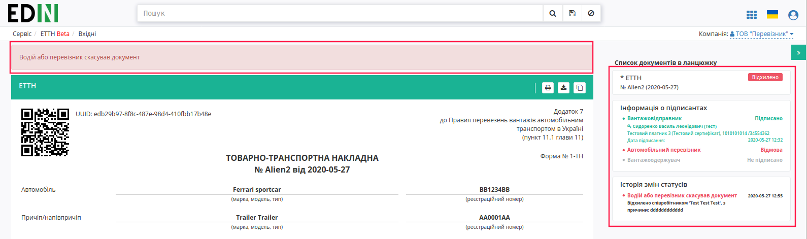

Підписання або відхилення е-ТТН перевізником
###################################################################################################

.. role:: red

.. role:: underline

Відправлена з боку вантажовідправника е-ТТН відображається в папці "Вхідні".

Для підписання е-ТТН перевізнику необхідно її відкрити та натиснути на кнопку "Підписати".

.. hint:: Після ініціалізації бібліотеки підписання, система надасть можливість додати ключ для підписання.

Далі у модальному вікні необхідно додати ключ для підписання, натиснувши на кнопку "Додайте ключі для підписання", ввести пароль та натиснути – "Встановити ключ".

Ключ успішно додано:

.. image:: pics_Signing_rejection_ETTN_carrier/Signing_rejection_ETTN_carrier_04.png
   :align: center

Далі необхідно закрити модальне вікно та ще раз натиснути на кнопку "Підписати". У модальному вікні обрати ключ та натиснути – "Підписати".

Також додати ключи для підписання можна натиснувши на іконку ключа в правій верхній частині сторінки. Після чого повторити алгоритм додавання ключа в модальному вікні.

.. image:: pics_Signing_rejection_ETTN_carrier/Signing_rejection_ETTN_carrier_06.png
   :align: center

Після підписання е-ТТН інформація щодо підписантів відображається в документі ТТН у списку документів у ланцюжку.

Після підписання перевізником е-ТТН присвоєно статус "Підписано водієм".

У перевізника є можливість відхилити е-ТТН **до підписання**. Для цього потрібно натиснути на кнопку "Відхилити".

Результат:

Для відхиленної перевізником е-ТТН присвоєно статус "Відхилено".

.. include:: kontakti.rst

