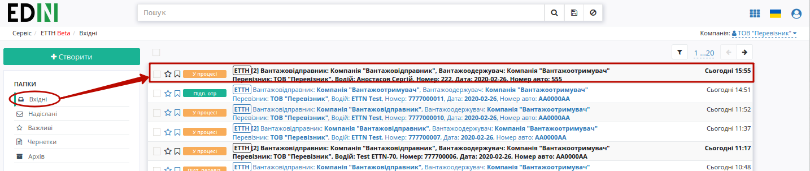
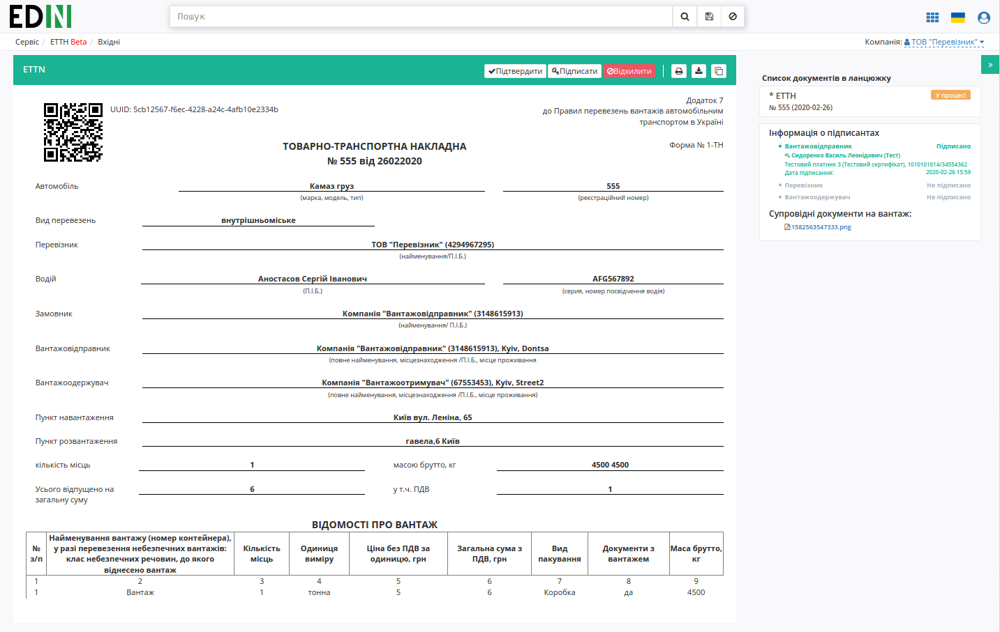
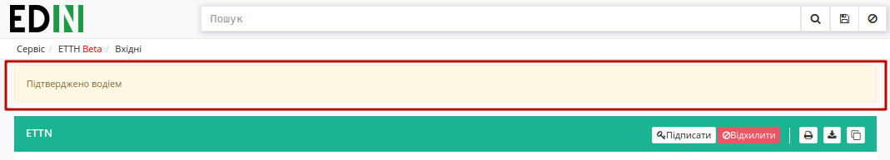
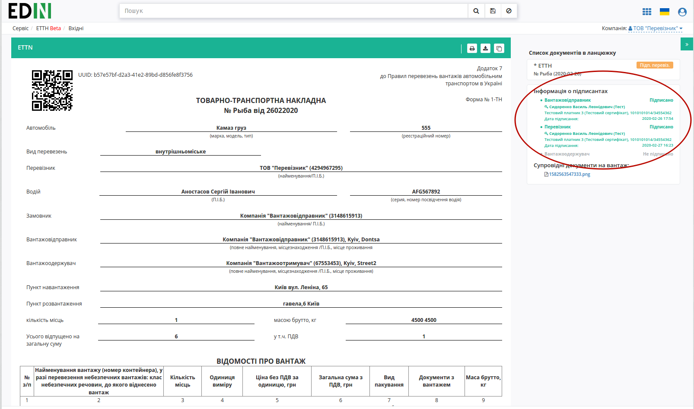
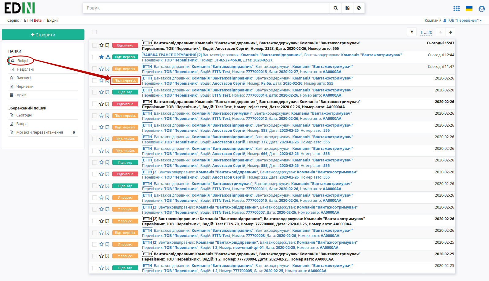
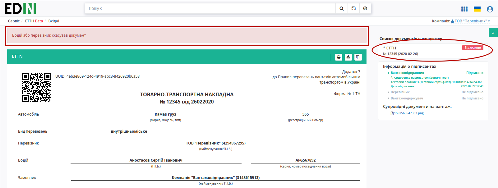
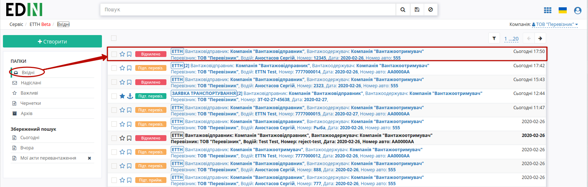

Підписання або відхилення е-ТТН перевізником
###################################################################################################

.. role:: red

.. role:: underline

.. contents:: Зміст:
   :depth: 6

---------

Відправлена з боку вантажовідправника е-ТТН відображається в папці "Вхідні".

Вхідний підписаний документ дозволяє "Підтвердити" / "Підписати" / "Відхилити" документ.

.. important::
    В залежності від внутрішньої схеми **"Перевізника"** документ перед "Підписанням" може бути "Підтверджений" водієм, (кнопка **"Підтвердити"**) і відповідно цей документ у вхідних змінить свій статус на "Підтверджений водієм", підказка в документі:

**Підписання документа**
==============================================================

Для підписання е-ТТН **"Перевізнику"** необхідно її відкрити та натиснути на кнопку "Підписати".

Після ініціалізації бібліотеки підписання, система надасть можливість додати ключ для підписання. При :underline:`першому` підписанні необхідно додати файловий ключ. Для цього у модальному вікні потрібно обрати файл (2) і ввести пароль (1):

.. image:: pics_Signing_rejection_ETTN_carrier/Signing_rejection_ETTN_carrier_04n.png
   :align: center

Після чого натиснути кнопку **"Додати"**:

.. image:: pics_Signing_rejection_ETTN_carrier/Signing_rejection_ETTN_carrier_05n.png
   :align: center

При успішному додаванні ключа автоматично відобразиться вибрана особа, від імені якої буде здійснено підписання (кнопка **"Підписати"**):

.. image:: pics_Signing_rejection_ETTN_carrier/Signing_rejection_ETTN_carrier_06n.png
   :align: center

При подальшій роботі з раніше доданим ключем/-ами потрібно вводити лише пароль для обраного ключа:

.. image:: pics_Signing_rejection_ETTN_carrier/Signing_rejection_ETTN_carrier_07n.png
   :align: center

Після підписання е-ТТН додається інформація щодо підписантів документа.

Підписаний документ відображається в журналі вхідних документів зі статусом "Підписано перевізником":

**Відхилення документа**
==============================================================

У **"Перевізника"** є можливість відхилити е-ТТН **до підписання**. Для цього потрібно натиснути на кнопку **"Відхилити"**. Після чого в модульному вікні обов'язково потрібно заповнити причину відміни документа:

.. image:: pics_Signing_rejection_ETTN_carrier/Signing_rejection_ETTN_carrier_12n.png
   :align: center

Для відхиленної перевізником е-ТТН присвоєно статус "Відхилено". Документ з цим статусом відображається у "Вхідних" **"Перевізника"**.

.. include:: kontakti.rst

