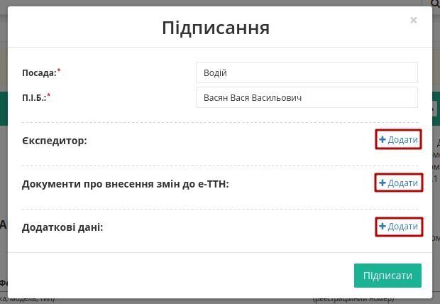
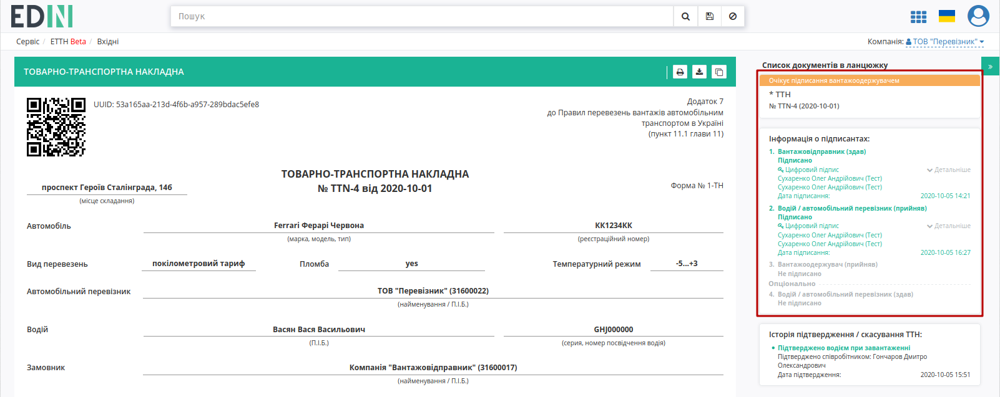
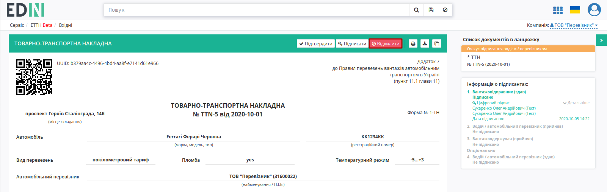
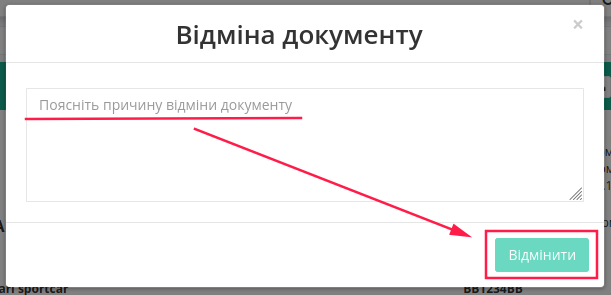

Підписання або відхилення е-ТТН перевізником
###################################################################################################

.. сюда закину немного картинок для текста

.. |drop_pass| image:: signing/drop_pass.png

.. |del_key| image:: signing/del_key2.png

.. role:: red

.. role:: underline

.. contents:: Зміст:
   :depth: 6

---------

Відправлена з боку вантажовідправника е-ТТН відображається в папці "Вхідні".

.. image:: pics_Signing_rejection_ETTN_carrier/Signing_rejection_ETTN_carrier_14.png
   :align: center

.. important::
   Підписання е-ТТН **Перевізником** можливе тільки після підписання **Вантажовідправником** (статус документу – **"Очікує підписання водієм / перевізником"** ). Також Перевізник може виступати в якості завершальної ланки документообігу, коли всі учасники документообігу вже підписали документ (опціонально). 

Вхідний підписаний документ дозволяє "Підтвердити" (1) та "Підписати" (2) чи "Відхилити" (3) документ.

.. image:: pics_Signing_rejection_ETTN_carrier/Signing_rejection_ETTN_carrier_15.png
   :align: center

.. important::
   В залежності від внутрішньої схеми **"Перевізника"** документ перед "Підписанням" може бути "Підтверджений" водієм, (кнопка **"Підтвердити"**) і відповідно цей документ у вхідних змінить свій статус на **"Очікує підписання перевізником (підтверджено водієм)"**, підказка в документі:

.. image:: pics_Signing_rejection_ETTN_carrier/Signing_rejection_ETTN_carrier_16.png
   :align: center

Також в **"Історії змін статусів"** відображається інформація про співробітника, що здійснив "підтвердження".

.. _sign:

**Підписання документа**
==============================================================

Для підписання е-ТТН **"Перевізнику"** необхідно відкрити документ та натиснути на кнопку "Підписати".

Відкривається модульне вікно підписання, в якому автоматично вказується водій, в якості особи, що буде здійснювати підписання (поля "Посада" і "П.І.Б." обов'язкові до заповнення). Додатково можливо додати дані експедитора, документи про внесення змін, дані про товарні позиції:

.. image:: pics_Signing_rejection_ETTN_carrier/Signing_rejection_ETTN_carrier_19.png
   :align: center

.. attention::
   Блоки, що були додані містять обов'язкові поля (відмічені червоною зірочкою :red:`*`). Додаткові блоки можливо "Видалити". 

Після того, як всі обов'язкові поля будуть заповнені потрібно натиснути **"Підписати"**.

.. hint::
   Лише у ролі **"Перевізник"** є можливість підписати за допомогою мобільного додатку "Дія"!

.. include:: /_constant/atb_check/atb_check.rst
   :start-after: .. початок блоку для ATB_check
   :end-before: .. кінець блоку для ATB_check

.. tabs::

   .. tab:: Файловий ключ

      .. include:: /_constant/signing/signing.rst
         :start-after: .. початок блоку для Signing
         :end-before: .. кінець блоку для Signing

   .. tab:: Token

      .. include:: /_constant/token_signing/token_signing.rst
         :start-after: .. початок блоку для TokenSign
         :end-before: .. кінець блоку для TokenSign

   .. tab:: Гряда

      .. include:: /_constant/gryada_signing/gryada_signing.rst
         :start-after: .. початок блоку для GryadaSign
         :end-before: .. кінець блоку для GryadaSign

   .. tab:: Дія.Підпис

      .. include:: /_constant/diya_signing/diya_signing.rst
         :start-after: .. початок блоку для DiyaPidps
         :end-before: .. кінець блоку для DiyaPidps

   .. tab:: Cloud

      .. include:: /_constant/cloud_signing/cloud_signing.rst
         :start-after: .. початок блоку для CloudSign
         :end-before: .. кінець блоку для CloudSign

Після підписання е-ТТН додається інформація щодо підписантів документа, документ змінює свій статус на **"Очікує підписання вантажоодержувачем"**:

Підписаний документ відображається в журналі вхідних документів:

.. image:: pics_Signing_rejection_ETTN_carrier/Signing_rejection_ETTN_carrier_20.png
   :align: center

**Відхилення документа**
==============================================================

У **Перевізника** є можливість відхилити е-ТТН до того, як документ буде підписано **Перевізником**. Для цього потрібно натиснути на кнопку **"Відхилити"**:

Після чого в модульному вікні обов'язково потрібно заповнити причину відміни документа:

.. image:: pics_Signing_rejection_ETTN_carrier/Signing_rejection_ETTN_carrier_22.png
   :align: center

Для відхиленної **"Перевізником"** еТТН присвоюється статус "Скасовано водієм / перевізником". Також в **"Історії змін статусів"** відображається інформація про співробітника, що здійснив "відхилення". Документ зі статусом "Відхилено" відображається у "Вхідних" **"Перевізника"**. Документообіг завершено.

.. image:: pics_Signing_rejection_ETTN_carrier/Signing_rejection_ETTN_carrier_23.png
   :align: center

---------------------------------

.. include:: kontakti.rst

